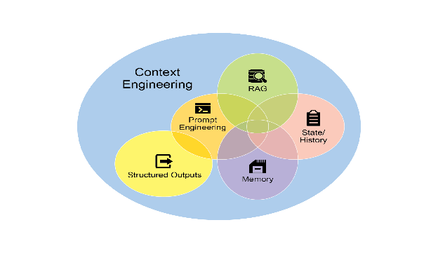

# Chapter 1: Prompt Chaining

# Prompt Chaining 패턴 개요

Prompt chaining은 Pipeline pattern으로도 불리며, 대형 언어 모델(LLM)을 활용하여 복잡한 작업을 처리하는 강력한 패러다임을 제시함. LLM이 복잡한 문제를 단일하고 거대한 단계로 해결하도록 기대하는 대신, prompt chaining은 분할 정복 전략을 주장함. 핵심 아이디어는 원래의 어려운 문제를 더 작고 관리 가능한 하위 문제들의 시퀀스로 분해하는 것임. 각 하위 문제는 특별히 설계된 프롬프트를 통해 개별적으로 처리되며, 하나의 프롬프트에서 생성된 출력이 체인의 다음 프롬프트에 입력으로 전략적으로 전달됨.

이러한 순차 처리 기법은 LLM과의 상호작용에 본질적으로 모듈성과 명확성을 도입함. 복잡한 작업을 분해함으로써 각 개별 단계를 이해하고 디버깅하기 쉬워지며, 전체 프로세스가 더욱 견고하고 해석 가능해짐. 체인의 각 단계는 더 큰 문제의 특정 측면에 집중하도록 세밀하게 제작 및 최적화될 수 있어 더 정확하고 집중된 출력을 이끌어냄.

한 단계의 출력이 다음 단계의 입력으로 작용하는 것이 핵심임. 이러한 정보 전달은 의존성 체인을 확립하며, 이것이 바로 이름의 유래이고, 이전 작업의 컨텍스트와 결과가 후속 처리를 안내함. 이를 통해 LLM은 이전 작업을 기반으로 구축하고, 이해를 정제하며, 원하는 솔루션에 점진적으로 접근할 수 있음.

나아가 prompt chaining은 단순히 문제를 분해하는 것뿐만 아니라 외부 지식과 도구의 통합도 가능하게 함. 각 단계에서 LLM은 외부 시스템, API 또는 데이터베이스와 상호작용하도록 지시받을 수 있으며, 내부 학습 데이터를 넘어 지식과 능력을 풍부하게 만듦. 이 기능은 LLM의 잠재력을 극적으로 확장하여, 단순히 고립된 모델이 아닌 더 광범위하고 지능적인 시스템의 핵심 구성 요소로 기능하게 함.

Prompt chaining의 중요성은 단순한 문제 해결을 넘어섬. 이는 정교한 AI agent를 구축하기 위한 기초 기술로 작용함. 이러한 agent는 prompt chain을 활용하여 동적 환경에서 자율적으로 계획하고 추론하며 행동할 수 있음. 프롬프트 시퀀스를 전략적으로 구조화함으로써 agent는 다단계 추론, 계획 및 의사결정을 요구하는 작업에 참여할 수 있음. 이러한 agent 워크플로우는 인간의 사고 프로세스를 더욱 밀접하게 모방할 수 있어 복잡한 도메인 및 시스템과의 더 자연스럽고 효과적인 상호작용을 가능하게 함.

**단일 프롬프트의 한계:** 다면적 작업의 경우, LLM에 단일하고 복잡한 프롬프트를 사용하는 것은 비효율적일 수 있으며, 모델이 제약과 지시사항으로 어려움을 겪게 되고, 프롬프트의 일부가 간과되는 지시사항 무시(instruction neglect), 모델이 초기 컨텍스트를 잃는 컨텍스트 드리프트(contextual drift), 초기 오류가 증폭되는 오류 전파(error propagation), 모델이 응답하기에 불충분한 정보를 받는 긴 컨텍스트 윈도우가 필요한 프롬프트, 인지 부하가 증가하여 잘못된 정보의 가능성이 높아지는 환각(hallucination) 등의 문제가 발생할 수 있음. 예를 들어, 시장 조사 보고서를 분석하고 결과를 요약하며 데이터 포인트로 트렌드를 식별하고 이메일 초안을 작성하라는 쿼리는 모델이 요약은 잘하지만 데이터 추출이나 이메일 초안 작성에 실패할 수 있어 실패 위험이 있음.

**순차 분해를 통한 신뢰성 향상:** Prompt chaining은 복잡한 작업을 집중되고 순차적인 워크플로우로 분해하여 이러한 문제를 해결하며, 이는 신뢰성과 제어를 크게 향상시킴. 위의 예를 고려할 때, pipeline 또는 chained 접근 방식은 다음과 같이 설명될 수 있음:

1. 초기 프롬프트(요약): "다음 시장 조사 보고서의 주요 결과를 요약하라: [text]." 모델의 유일한 초점은 요약이며, 이 초기 단계의 정확성이 향상됨.
2. 두 번째 프롬프트(트렌드 식별): "요약을 사용하여 상위 세 가지 신흥 트렌드를 식별하고 각 트렌드를 뒷받침하는 구체적인 데이터 포인트를 추출하라: [1단계 출력]." 이 프롬프트는 이제 더 제약되고 검증된 출력을 직접 기반으로 구축됨.
3. 세 번째 프롬프트(이메일 작성): "다음 트렌드와 지원 데이터를 개략적으로 설명하는 마케팅 팀에 대한 간결한 이메일 초안을 작성하라: [2단계 출력]."

이러한 분해는 프로세스에 대한 더욱 세밀한 제어를 가능하게 함. 각 단계는 더 간단하고 덜 모호하여 모델의 인지 부하를 줄이고 더 정확하고 신뢰할 수 있는 최종 출력을 이끌어냄. 이러한 모듈성은 각 함수가 다음으로 결과를 전달하기 전에 특정 작업을 수행하는 계산 파이프라인과 유사함. 각 특정 작업에 대한 정확한 응답을 보장하기 위해 모델은 모든 단계에서 고유한 역할을 할당받을 수 있음. 예를 들어, 주어진 시나리오에서 초기 프롬프트는 "시장 분석가", 후속 프롬프트는 "무역 분석가", 세 번째 프롬프트는 "전문 문서 작성자" 등으로 지정될 수 있음.

**구조화된 출력의 역할:** Prompt chain의 신뢰성은 단계 간 전달되는 데이터의 무결성에 크게 의존함. 한 프롬프트의 출력이 모호하거나 형식이 잘못된 경우, 후속 프롬프트는 잘못된 입력으로 인해 실패할 수 있음. 이를 완화하기 위해 JSON 또는 XML과 같은 구조화된 출력 형식을 지정하는 것이 중요함.

예를 들어, 트렌드 식별 단계의 출력은 JSON 객체로 형식화될 수 있음:

```json
{
  "trends": [
    {
      "trend_name": "AI-Powered Personalization",
      "supporting_data": "73% of consumers prefer to do business with brands that use personal information to make their shopping experiences more relevant."
    },
    {
      "trend_name": "Sustainable and Ethical Brands",
      "supporting_data": "Sales of products with ESG-related claims grew 28% over the last five years, compared to 20% for products without."
    }
  ]
}
```

이러한 구조화된 형식은 데이터가 기계 판독 가능하며 모호함 없이 정확하게 구문 분석되고 다음 프롬프트에 삽입될 수 있도록 보장함. 이 방법은 자연어 해석에서 발생할 수 있는 오류를 최소화하며, 강력한 다단계 LLM 기반 시스템을 구축하는 핵심 구성 요소임.

# 실용적 적용 사례 및 활용 예시

Prompt chaining은 agentic 시스템을 구축할 때 광범위한 시나리오에서 적용 가능한 다목적 패턴임. 핵심 유용성은 복잡한 문제를 순차적이고 관리 가능한 단계로 분해하는 데 있음. 다음은 몇 가지 실용적 적용 사례 및 활용 예시임:

**1. 정보 처리 워크플로우:** 많은 작업은 여러 변환을 통해 원시 정보를 처리하는 것을 포함함. 예를 들어, 문서를 요약하고 주요 엔티티를 추출한 다음 해당 엔티티를 사용하여 데이터베이스를 쿼리하거나 보고서를 생성하는 것. Prompt chain은 다음과 같을 수 있음:

* 프롬프트 1: 주어진 URL 또는 문서에서 텍스트 콘텐츠 추출
* 프롬프트 2: 정제된 텍스트를 요약
* 프롬프트 3: 요약 또는 원본 텍스트에서 특정 엔티티(예: 이름, 날짜, 위치) 추출
* 프롬프트 4: 엔티티를 사용하여 내부 지식 기반 검색
* 프롬프트 5: 요약, 엔티티 및 검색 결과를 통합한 최종 보고서 생성

이 방법론은 자동화된 콘텐츠 분석, AI 기반 연구 보조 도구 개발, 복잡한 보고서 생성과 같은 도메인에 적용됨.

**2. 복잡한 질의 응답:** 다단계 추론이나 정보 검색이 필요한 복잡한 질문에 답하는 것은 주요 활용 사례임. 예를 들어, "1929년 주식 시장 붕괴의 주요 원인은 무엇이며, 정부 정책은 어떻게 대응했는가?"

* 프롬프트 1: 사용자 쿼리의 핵심 하위 질문 식별(붕괴 원인, 정부 대응)
* 프롬프트 2: 1929년 붕괴 원인에 대한 정보를 구체적으로 조사 또는 검색
* 프롬프트 3: 1929년 주식 시장 붕괴에 대한 정부의 정책 대응에 대한 정보를 구체적으로 조사 또는 검색
* 프롬프트 4: 2단계와 3단계의 정보를 원래 쿼리에 대한 일관된 답변으로 통합

이러한 순차 처리 방법론은 다단계 추론 및 정보 통합이 가능한 AI 시스템 개발에 필수적임. 이러한 시스템은 단일 데이터 포인트에서 답변할 수 없지만 대신 일련의 논리적 단계 또는 다양한 소스의 정보 통합을 필요로 하는 쿼리에 필요함.

예를 들어, 특정 주제에 대한 종합 보고서를 생성하도록 설계된 자동화된 연구 agent는 하이브리드 계산 워크플로우를 실행함. 초기에는 시스템이 수많은 관련 기사를 검색함. 각 기사에서 주요 정보를 추출하는 후속 작업은 각 소스에 대해 동시에 수행될 수 있음. 이 단계는 효율성을 극대화하기 위해 독립적인 하위 작업이 동시에 실행되는 병렬 처리에 적합함.

그러나 개별 추출이 완료되면 프로세스는 본질적으로 순차적이 됨. 시스템은 먼저 추출된 데이터를 수집한 다음 이를 일관된 초안으로 합성하고, 마지막으로 이 초안을 검토 및 개선하여 최종 보고서를 생성해야 함. 이러한 후기 단계 각각은 이전 단계의 성공적인 완료에 논리적으로 의존함. 이것이 prompt chaining이 적용되는 지점임: 수집된 데이터는 합성 프롬프트의 입력으로 사용되고, 결과적으로 합성된 텍스트는 최종 검토 프롬프트의 입력이 됨. 따라서 복잡한 작업은 종종 독립적인 데이터 수집을 위한 병렬 처리와 합성 및 정제의 종속 단계를 위한 prompt chaining을 결합함.

**3. 데이터 추출 및 변환:** 비구조화된 텍스트를 구조화된 형식으로 변환하는 것은 일반적으로 출력의 정확성과 완전성을 향상시키기 위해 순차적 수정이 필요한 반복 프로세스를 통해 달성됨.

* 프롬프트 1: 인보이스 문서에서 특정 필드(예: 이름, 주소, 금액) 추출 시도
* 처리: 모든 필수 필드가 추출되었는지 및 형식 요구사항을 충족하는지 확인
* 프롬프트 2(조건부): 필드가 누락되었거나 형식이 잘못된 경우, 실패한 시도의 컨텍스트를 제공하여 누락되거나 형식이 잘못된 정보를 구체적으로 찾도록 요청하는 새 프롬프트 작성
* 처리: 결과를 다시 검증. 필요한 경우 반복
* 출력: 추출되고 검증된 구조화된 데이터 제공

이러한 순차 처리 방법론은 양식, 인보이스 또는 이메일과 같은 비구조화된 소스에서 데이터 추출 및 분석에 특히 적용 가능함. 예를 들어, PDF 양식 처리와 같은 복잡한 광학 문자 인식(OCR) 문제를 해결하는 것은 분해된 다단계 접근 방식을 통해 더 효과적으로 처리됨.

초기에는 대형 언어 모델을 사용하여 문서 이미지에서 기본 텍스트 추출을 수행함. 이후 모델은 원시 출력을 처리하여 데이터를 정규화하는데, 이 단계에서 "천 오십"과 같은 숫자 텍스트를 숫자 등가물인 1050으로 변환할 수 있음. LLM의 중요한 과제는 정확한 수학적 계산을 수행하는 것임. 따라서 후속 단계에서 시스템은 필요한 산술 연산을 외부 계산기 도구에 위임할 수 있음. LLM은 필요한 계산을 식별하고 정규화된 숫자를 도구에 공급한 다음 정확한 결과를 통합함. 이러한 텍스트 추출, 데이터 정규화 및 외부 도구 사용의 연결된 시퀀스는 단일 LLM 쿼리에서 신뢰성 있게 얻기 어려운 정확한 최종 결과를 달성함.

**4. 콘텐츠 생성 워크플로우:** 복잡한 콘텐츠의 구성은 초기 아이디어 도출, 구조적 개요 작성, 초안 작성 및 후속 수정을 포함하는 고유한 단계로 분해되는 절차적 작업임.

* 프롬프트 1: 사용자의 일반적인 관심사를 기반으로 5개의 주제 아이디어 생성
* 처리: 사용자가 하나의 아이디어를 선택하도록 허용하거나 자동으로 최선의 아이디어 선택
* 프롬프트 2: 선택된 주제를 기반으로 상세한 개요 생성
* 프롬프트 3: 개요의 첫 번째 포인트를 기반으로 초안 섹션 작성
* 프롬프트 4: 개요의 두 번째 포인트를 기반으로 초안 섹션 작성하되, 컨텍스트를 위해 이전 섹션 제공. 모든 개요 포인트에 대해 계속
* 프롬프트 5: 일관성, 톤 및 문법에 대한 완전한 초안을 검토 및 개선

이 방법론은 창의적 서사, 기술 문서 및 기타 형태의 구조화된 텍스트 콘텐츠의 자동 구성을 포함한 다양한 자연어 생성 작업에 사용됨.

**5. 상태를 가진 대화형 Agent:** 포괄적인 상태 관리 아키텍처는 순차 연결보다 더 복잡한 방법을 사용하지만, prompt chaining은 대화 연속성을 유지하기 위한 기초 메커니즘을 제공함. 이 기술은 대화 시퀀스의 이전 상호작용에서 정보나 추출된 엔티티를 체계적으로 통합하는 새로운 프롬프트로 각 대화 턴을 구성하여 컨텍스트를 유지함.

* 프롬프트 1: 사용자 발화 1 처리, 의도 및 주요 엔티티 식별
* 처리: 의도 및 엔티티로 대화 상태 업데이트
* 프롬프트 2: 현재 상태를 기반으로 응답을 생성하거나 필요한 다음 정보를 식별
* 후속 턴에 대해 반복하되, 각 새 사용자 발화는 누적되는 대화 기록(상태)을 활용하는 체인을 시작함

이 원칙은 대화형 agent 개발의 기초이며, 확장된 다중 턴 대화에서 컨텍스트와 일관성을 유지할 수 있게 함. 대화 기록을 보존함으로써 시스템은 이전에 교환된 정보에 의존하는 사용자 입력을 이해하고 적절하게 응답할 수 있음.

**6. 코드 생성 및 개선:** 기능적 코드의 생성은 일반적으로 문제를 점진적으로 실행되는 개별 논리 연산의 시퀀스로 분해해야 하는 다단계 프로세스임.

* 프롬프트 1: 코드 함수에 대한 사용자 요청 이해. 의사코드 또는 개요 생성
* 프롬프트 2: 개요를 기반으로 초기 코드 초안 작성
* 프롬프트 3: 코드에서 잠재적 오류 또는 개선 영역 식별(정적 분석 도구 또는 다른 LLM 호출 사용 가능)
* 프롬프트 4: 식별된 문제를 기반으로 코드를 다시 작성하거나 개선
* 프롬프트 5: 문서 또는 테스트 케이스 추가

AI 지원 소프트웨어 개발과 같은 애플리케이션에서 prompt chaining의 유용성은 복잡한 코딩 작업을 일련의 관리 가능한 하위 문제로 분해하는 능력에서 비롯됨. 이러한 모듈식 구조는 각 단계에서 대형 언어 모델의 작동 복잡성을 줄임. 중요한 것은 이 접근 방식이 모델 호출 사이에 결정론적 논리 삽입을 허용하여 워크플로우 내에서 중간 데이터 처리, 출력 검증 및 조건부 분기를 가능하게 한다는 것임. 이 방법을 통해 신뢰할 수 없거나 불완전한 결과로 이어질 수 있는 단일하고 다면적인 요청이 기본 실행 프레임워크에 의해 관리되는 구조화된 작업 시퀀스로 변환됨.

**7. 다중 모달 및 다단계 추론:** 다양한 모달리티를 가진 데이터셋을 분석하려면 문제를 더 작은 프롬프트 기반 작업으로 분해해야 함. 예를 들어, 포함된 텍스트가 있는 그림, 특정 텍스트 세그먼트를 강조 표시하는 레이블 및 각 레이블을 설명하는 표 형식 데이터가 포함된 이미지를 해석하려면 이러한 접근 방식이 필요함.

* 프롬프트 1: 사용자의 이미지 요청에서 텍스트를 추출하고 이해
* 프롬프트 2: 추출된 이미지 텍스트를 해당 레이블과 연결
* 프롬프트 3: 필요한 출력을 결정하기 위해 테이블을 사용하여 수집된 정보를 해석

# 실습 코드 예제

Prompt chaining 구현은 스크립트 내 직접적이고 순차적인 함수 호출에서부터 제어 흐름, 상태 및 구성 요소 통합을 관리하도록 설계된 특수 프레임워크 활용까지 다양함. LangChain, LangGraph, Crew AI 및 Google Agent Development Kit(ADK)과 같은 프레임워크는 이러한 다단계 프로세스를 구축하고 실행하기 위한 구조화된 환경을 제공하며, 이는 복잡한 아키텍처에 특히 유리함.

데모 목적상 LangChain과 LangGraph는 핵심 API가 작업의 체인 및 그래프 구성을 위해 명시적으로 설계되었기 때문에 적합한 선택임. LangChain은 선형 시퀀스에 대한 기초 추상화를 제공하며, LangGraph는 이러한 기능을 확장하여 더 정교한 agentic 동작 구현에 필요한 상태 유지 및 순환 계산을 지원함. 이 예제는 기본적인 선형 시퀀스에 초점을 맞춤.

다음 코드는 데이터 처리 파이프라인으로 기능하는 2단계 prompt chain을 구현함. 초기 단계는 비구조화된 텍스트를 구문 분석하고 특정 정보를 추출하도록 설계됨. 후속 단계는 이 추출된 출력을 수신하고 구조화된 데이터 형식으로 변환함.

이 절차를 복제하려면 먼저 필요한 라이브러리를 설치해야 함. 다음 명령을 사용하여 수행할 수 있음:

```bash
pip install langchain langchain-community langchain-openai langgraph
```

langchain-openai는 다른 모델 제공업체에 적합한 패키지로 대체될 수 있음. 이후 실행 환경은 OpenAI, Google Gemini 또는 Anthropic과 같은 선택된 언어 모델 제공업체에 필요한 API 자격 증명으로 구성되어야 함.

```python
import os
from langchain_openai import ChatOpenAI
from langchain_core.prompts import ChatPromptTemplate
from langchain_core.output_parsers import StrOutputParser

# For better security, load environment variables from a .env file
# from dotenv import load_dotenv
# load_dotenv()
# Make sure your OPENAI_API_KEY is set in the .env file

# Initialize the Language Model (using ChatOpenAI is recommended)
llm = ChatOpenAI(temperature=0)

# --- Prompt 1: Extract Information ---
prompt_extract = ChatPromptTemplate.from_template(
   "Extract the technical specifications from the following text:\n\n{text_input}"
)

# --- Prompt 2: Transform to JSON ---
prompt_transform = ChatPromptTemplate.from_template(
   "Transform the following specifications into a JSON object with 'cpu', 'memory', and 'storage' as keys:\n\n{specifications}"
)

# --- Build the Chain using LCEL ---
# The StrOutputParser() converts the LLM's message output to a simple string.
extraction_chain = prompt_extract | llm | StrOutputParser()

# The full chain passes the output of the extraction chain into the 'specifications'
# variable for the transformation prompt.
full_chain = (
   {"specifications": extraction_chain}
   | prompt_transform
   | llm
   | StrOutputParser()
)

# --- Run the Chain ---
input_text = "The new laptop model features a 3.5 GHz octa-core processor, 16GB of RAM, and a 1TB NVMe SSD."

# Execute the chain with the input text dictionary.
final_result = full_chain.invoke({"text_input": input_text})

print("\n--- Final JSON Output ---")
print(final_result)
```

이 Python 코드는 LangChain 라이브러리를 사용하여 텍스트를 처리하는 방법을 보여줌. 두 개의 개별 프롬프트를 활용함: 하나는 입력 문자열에서 기술 사양을 추출하고 다른 하나는 이러한 사양을 JSON 객체로 형식화함. ChatOpenAI 모델은 언어 모델 상호작용에 사용되며, StrOutputParser는 출력이 사용 가능한 문자열 형식으로 보장함. LangChain Expression Language(LCEL)는 이러한 프롬프트와 언어 모델을 우아하게 연결하는 데 사용됨. 첫 번째 체인인 extraction_chain은 사양을 추출함. full_chain은 추출의 출력을 가져와 변환 프롬프트의 입력으로 사용함. 노트북을 설명하는 샘플 입력 텍스트가 제공됨. full_chain은 이 텍스트로 호출되어 두 단계를 모두 통과 처리함. 최종 결과인 추출되고 형식화된 사양을 포함하는 JSON 문자열이 인쇄됨.

# Context Engineering과 Prompt Engineering

Context Engineering(그림 1 참조)은 토큰 생성 이전에 AI 모델에 완전한 정보 환경을 설계, 구축 및 전달하는 체계적인 학문임. 이 방법론은 모델 출력의 품질이 모델 아키텍처 자체보다는 제공되는 컨텍스트의 풍부함에 덜 의존한다고 주장함.



그림 1: Context Engineering은 AI를 위한 풍부하고 포괄적인 정보 환경을 구축하는 학문이며, 이 컨텍스트의 품질이 고급 Agentic 성능을 가능하게 하는 주요 요소임.

이는 주로 사용자의 즉각적인 쿼리의 표현을 최적화하는 데 중점을 둔 전통적인 prompt engineering에서 크게 진화한 것을 나타냄. Context Engineering은 이 범위를 확장하여 여러 정보 계층을 포함하는데, 예를 들어 **시스템 프롬프트**가 있으며, 이는 AI의 작동 매개변수를 정의하는 기초 지시사항 세트임—예를 들어, *"당신은 기술 작가입니다; 당신의 톤은 공식적이고 정확해야 합니다."* 컨텍스트는 외부 데이터로 더욱 풍부해짐. 여기에는 AI가 응답을 알리기 위해 지식 베이스에서 정보를 적극적으로 가져오는 검색된 문서가 포함되며, 예를 들어 프로젝트의 기술 사양을 가져오는 것임. 또한 실시간 데이터를 얻기 위해 외부 API를 사용하는 AI의 결과인 도구 출력도 포함되는데, 예를 들어 사용자의 가용성을 결정하기 위해 캘린더를 쿼리하는 것임. 이러한 명시적 데이터는 사용자 정체성, 상호작용 기록 및 환경 상태와 같은 중요한 암묵적 데이터와 결합됨. 핵심 원칙은 제한적이거나 잘못 구성된 운영 환경의 관점이 제공될 때 고급 모델조차 성능이 저하된다는 것임.

따라서 이 방법은 단순히 질문에 답하는 것에서 agent를 위한 포괄적인 운영 그림을 구축하는 것으로 작업을 재구성함. 예를 들어, context-engineered agent는 쿼리에 응답하는 것뿐만 아니라 먼저 사용자의 캘린더 가용성(도구 출력), 이메일 수신자와의 전문적 관계(암묵적 데이터) 및 이전 회의의 메모(검색된 문서)를 통합함. 이를 통해 모델은 매우 관련성 있고 개인화되며 실용적으로 유용한 출력을 생성할 수 있음. "엔지니어링" 구성 요소는 런타임에 이 데이터를 가져오고 변환하는 강력한 파이프라인을 생성하고 컨텍스트 품질을 지속적으로 개선하기 위한 피드백 루프를 설정하는 것을 포함함.

이를 구현하기 위해 특수 튜닝 시스템을 사용하여 대규모로 개선 프로세스를 자동화할 수 있음. 예를 들어, Google의 Vertex AI prompt optimizer와 같은 도구는 샘플 입력 세트 및 사전 정의된 평가 메트릭에 대해 응답을 체계적으로 평가하여 모델 성능을 향상시킬 수 있음. 이 접근 방식은 광범위한 수동 재작성 없이 다양한 모델에서 프롬프트 및 시스템 지시사항을 조정하는 데 효과적임. 이러한 optimizer에 샘플 프롬프트, 시스템 지시사항 및 템플릿을 제공함으로써 프로그래밍 방식으로 컨텍스트 입력을 개선할 수 있으며, 정교한 Context Engineering에 필요한 피드백 루프를 구현하기 위한 구조화된 방법을 제공함.

이러한 구조화된 접근 방식은 기초적인 AI 도구를 더 정교하고 컨텍스트를 인식하는 시스템과 구분하는 것임. 이는 컨텍스트 자체를 주요 구성 요소로 취급하며, agent가 무엇을 알고 있는지, 언제 아는지, 그리고 그 정보를 어떻게 사용하는지에 중요성을 부여함. 이 방법은 모델이 사용자의 의도, 기록 및 현재 환경을 균형 잡힌 방식으로 이해하도록 보장함. 궁극적으로 Context Engineering은 상태 비저장 챗봇을 매우 유능하고 상황을 인식하는 시스템으로 발전시키기 위한 중요한 방법론임.

# 한눈에 보기

**무엇:** 복잡한 작업은 단일 프롬프트 내에서 처리될 때 LLM을 압도하는 경우가 많으며, 심각한 성능 문제로 이어짐. 모델의 인지 부하가 증가하면 지시사항 간과, 컨텍스트 손실 및 잘못된 정보 생성과 같은 오류 가능성이 높아짐. 모놀리식 프롬프트는 여러 제약과 순차 추론 단계를 효과적으로 관리하는 데 어려움을 겪음. 이는 LLM이 다면적 요청의 모든 측면을 다루지 못하기 때문에 신뢰할 수 없고 부정확한 출력을 초래함.

**왜:** Prompt chaining은 복잡한 문제를 더 작고 상호 연결된 하위 작업의 시퀀스로 분해하여 표준화된 솔루션을 제공함. 체인의 각 단계는 집중된 프롬프트를 사용하여 특정 작업을 수행하며, 신뢰성과 제어를 크게 향상시킴. 한 프롬프트의 출력이 다음의 입력으로 전달되어 최종 솔루션을 향해 점진적으로 구축되는 논리적 워크플로우를 생성함. 이러한 모듈식 분할 정복 전략은 프로세스를 더 관리하기 쉽고 디버깅하기 쉽게 만들며, 단계 간 외부 도구 또는 구조화된 데이터 형식의 통합을 허용함. 이 패턴은 계획하고 추론하며 복잡한 워크플로우를 실행할 수 있는 정교한 다단계 Agentic 시스템을 개발하기 위한 기초임.

**경험 법칙:** 작업이 단일 프롬프트에 너무 복잡하거나, 여러 개별 처리 단계를 포함하거나, 단계 간 외부 도구와의 상호작용이 필요하거나, 다단계 추론을 수행하고 상태를 유지해야 하는 Agentic 시스템을 구축할 때 이 패턴을 사용함.

**시각적 요약**


그림 2: Prompt Chaining Pattern: Agent는 사용자로부터 일련의 프롬프트를 받으며, 각 agent의 출력은 체인의 다음 agent에 대한 입력으로 사용됨.

# 핵심 요점

다음은 주요 핵심 사항임:

* Prompt Chaining은 복잡한 작업을 더 작고 집중된 단계의 시퀀스로 분해함. 이는 때때로 Pipeline pattern으로 알려짐.
* 체인의 각 단계는 이전 단계의 출력을 입력으로 사용하여 LLM 호출 또는 처리 논리를 포함함.
* 이 패턴은 언어 모델과의 복잡한 상호작용의 신뢰성과 관리 가능성을 향상시킨.
* LangChain/LangGraph 및 Google ADK와 같은 프레임워크는 이러한 다단계 시퀀스를 정의, 관리 및 실행하기 위한 강력한 도구를 제공함.

# 결론

복잡한 문제를 더 간단하고 관리 가능한 하위 작업의 시퀀스로 분해함으로써 prompt chaining은 대형 언어 모델을 안내하기 위한 강력한 프레임워크를 제공함. 이러한 "분할 정복" 전략은 한 번에 하나의 특정 작업에 모델을 집중시킴으로써 출력의 신뢰성과 제어를 크게 향상시킴. 기초 패턴으로서, 다단계 추론, 도구 통합 및 상태 관리가 가능한 정교한 AI agent 개발을 가능하게 함. 궁극적으로 prompt chaining을 마스터하는 것은 단일 프롬프트의 기능을 훨씬 넘어 복잡한 워크플로우를 실행할 수 있는 강력하고 컨텍스트를 인식하는 시스템을 구축하는 데 중요함.

# 참고자료

1. LangChain Documentation on LCEL: [https://python.langchain.com/v0.2/docs/core_modules/expression_language/](https://python.langchain.com/v0.2/docs/core_modules/expression_language/)
2. LangGraph Documentation: [https://langchain-ai.github.io/langgraph/](https://langchain-ai.github.io/langgraph/)
3. Prompt Engineering Guide \- Chaining Prompts: [https://www.promptingguide.ai/techniques/chaining](https://www.promptingguide.ai/techniques/chaining)
4. OpenAI API Documentation (General Prompting Concepts): [https://platform.openai.com/docs/guides/gpt/prompting](https://platform.openai.com/docs/guides/gpt/prompting)
5. Crew AI Documentation (Tasks and Processes): [https://docs.crewai.com/](https://docs.crewai.com/)
6. Google AI for Developers (Prompting Guides): [https://cloud.google.com/discover/what-is-prompt-engineering?hl=en](https://cloud.google.com/discover/what-is-prompt-engineering?hl=en)
7. Vertex Prompt Optimizer [https://cloud.google.com/vertex-ai/generative-ai/docs/learn/prompts/prompt-optimizer](https://cloud.google.com/vertex-ai/generative-ai/docs/learn/prompts/prompt-optimizer)

