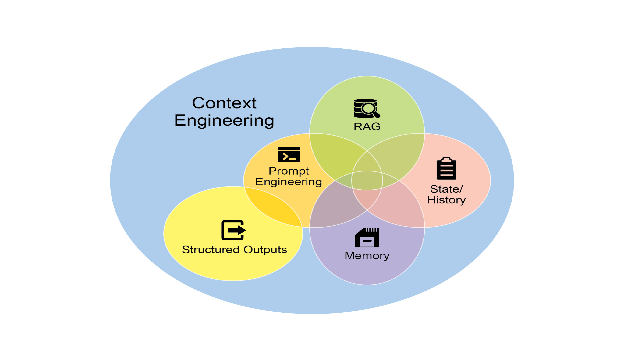
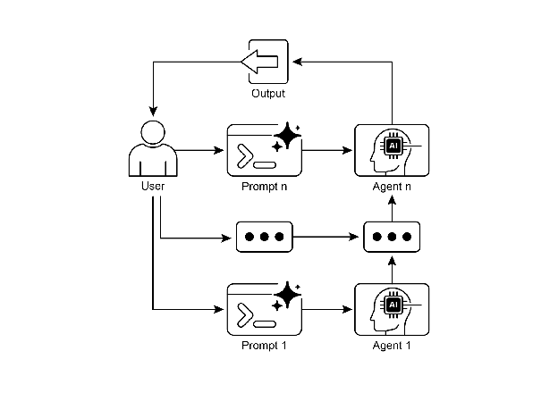

# Chapter 1: Prompt Chaining

# Prompt Chaining Pattern Overview

Prompt chaining, sometimes referred to as Pipeline pattern, represents a powerful paradigm for handling intricate tasks when leveraging large language models (LLMs). Rather than expecting an LLM to solve a complex problem in a single, monolithic step, prompt chaining advocates for a divide-and-conquer strategy. The core idea is to break down the original, daunting problem into a sequence of smaller, more manageable sub-problems. Each sub-problem is addressed individually through a specifically designed prompt, and the output generated from one prompt is strategically fed as input into the subsequent prompt in the chain.

This sequential processing technique inherently introduces modularity and clarity into the interaction with LLMs. By decomposing a complex task, it becomes easier to understand and debug each individual step, making the overall process more robust and interpretable. Each step in the chain can be meticulously crafted and optimized to focus on a specific aspect of the larger problem, leading to more accurate and focused outputs.

The output of one step acting as the input for the next is crucial. This passing of information establishes a dependency chain, hence the name, where the context and results of previous operations guide the subsequent processing. This allows the LLM to build on its previous work, refine its understanding, and progressively move closer to the desired solution.

Furthermore, prompt chaining is not just about breaking down problems; it also enables the integration of external knowledge and tools. At each step, the LLM can be instructed to interact with external systems, APIs, or databases, enriching its knowledge and abilities beyond its internal training data. This capability dramatically expands the potential of LLMs, allowing them to function not just as isolated models but as integral components of broader, more intelligent systems.

The significance of prompt chaining extends beyond simple problem-solving. It serves as a foundational technique for building sophisticated AI agents. These agents can utilize prompt chains to autonomously plan, reason, and act in dynamic environments. By strategically structuring the sequence of prompts, an agent can engage in tasks requiring multi-step reasoning, planning, and decision-making. Such agent workflows can mimic human thought processes more closely, allowing for more natural and effective interactions with complex domains and systems.

**Limitations of single prompts:** For multifaceted tasks, using a single, complex prompt for an LLM can be inefficient, causing the model to struggle with constraints and instructions, potentially leading to instruction neglect where parts of the prompt are overlooked, contextual drift where the model loses track of the initial context, error propagation where early errors amplify, prompts which require a longer context window where the model gets insufficient information to respond back and hallucination where the cognitive load increases the chance of incorrect information. For example, a query asking to analyze a market research report, summarize findings, identify trends with data points, and draft an email risks failure as the model might summarize well but fail to extract data or draft an email properly.

**Enhanced Reliability Through Sequential Decomposition:** Prompt chaining addresses these challenges by breaking the complex task into a focused, sequential workflow, which significantly improves reliability and control. Given the example above, a pipeline or chained approach can be described as follows:

1. Initial Prompt (Summarization): "Summarize the key findings of the following market research report: [text]." The model's sole focus is summarization, increasing the accuracy of this initial step.
2. Second Prompt (Trend Identification): "Using the summary, identify the top three emerging trends and extract the specific data points that support each trend: [output from step 1]." This prompt is now more constrained and builds directly upon a validated output.
3. Third Prompt (Email Composition): "Draft a concise email to the marketing team that outlines the following trends and their supporting data: [output from step 2]."

This decomposition allows for more granular control over the process. Each step is simpler and less ambiguous, which reduces the cognitive load on the model and leads to a more accurate and reliable final output. This modularity is analogous to a computational pipeline where each function performs a specific operation before passing its result to the next. To ensure an accurate response for each specific task, the model can be assigned a distinct role at every stage. For example, in the given scenario, the initial prompt could be designated as "Market Analyst," the subsequent prompt as "Trade Analyst," and the third prompt as "Expert Documentation Writer," and so forth.

**The Role of Structured Output:** The reliability of a prompt chain is highly dependent on the integrity of the data passed between steps. If the output of one prompt is ambiguous or poorly formatted, the subsequent prompt may fail due to faulty input. To mitigate this, specifying a structured output format, such as JSON or XML, is crucial.

For example, the output from the trend identification step could be formatted as a JSON object:

```json
{
  "trends": [
    {
      "trend_name": "AI-Powered Personalization",
      "supporting_data": "73% of consumers prefer to do business with brands that use personal information to make their shopping experiences more relevant."
    },
    {
      "trend_name": "Sustainable and Ethical Brands",
      "supporting_data": "Sales of products with ESG-related claims grew 28% over the last five years, compared to 20% for products without."
    }
  ]
}
```

This structured format ensures that the data is machine-readable and can be precisely parsed and inserted into the next prompt without ambiguity. This practice minimizes errors that can arise from interpreting natural language and is a key component in building robust, multi-step LLM-based systems. 

# Practical Applications & Use Cases

Prompt chaining is a versatile pattern applicable in a wide range of scenarios when building agentic systems. Its core utility lies in breaking down complex problems into sequential, manageable steps. Here are several practical applications and use cases:

**1\. Information Processing Workflows:** Many tasks involve processing raw information through multiple transformations. For instance, summarizing a document, extracting key entities, and then using those entities to query a database or generate a report. A prompt chain could look like:

* Prompt 1: Extract text content from a given URL or document.  
* Prompt 2: Summarize the cleaned text.  
* Prompt 3: Extract specific entities (e.g., names, dates, locations) from the summary or original text.  
* Prompt 4: Use the entities to search an internal knowledge base.  
* Prompt 5: Generate a final report incorporating the summary, entities, and search results.

This methodology is applied in domains such as automated content analysis, the development of AI-driven research assistants, and complex report generation.

**2\. Complex Query Answering:** Answering complex questions that require multiple steps of reasoning or information retrieval is a prime use case. For example, "What were the main causes of the stock market crash in 1929, and how did government policy respond?"

* Prompt 1: Identify the core sub-questions in the user's query (causes of crash, government response).  
* Prompt 2: Research or retrieve information specifically about the causes of the 1929 crash.  
* Prompt 3: Research or retrieve information specifically about the government's policy response to the 1929 stock market crash.  
* Prompt 4: Synthesize the information from steps 2 and 3 into a coherent answer to the original query.

This sequential processing methodology is integral to developing AI systems capable of multi-step inference and information synthesis. Such systems are required when a query cannot be answered from a single data point but instead necessitates a series of logical steps or the integration of information from diverse sources.

For example, an automated research agent designed to generate a comprehensive report on a specific topic executes a hybrid computational workflow. Initially, the system retrieves numerous relevant articles. The subsequent task of extracting key information from each article can be performed concurrently for each source. This stage is well-suited for parallel processing, where independent sub-tasks are run simultaneously to maximize efficiency.

However, once the individual extractions are complete, the process becomes inherently sequential. The system must first collate the extracted data, then synthesize it into a coherent draft, and finally review and refine this draft to produce a final report. Each of these later stages is logically dependent on the successful completion of the preceding one. This is where prompt chaining is applied: the collated data serves as the input for the synthesis prompt, and the resulting synthesized text becomes the input for the final review prompt. Therefore, complex operations frequently combine parallel processing for independent data gathering with prompt chaining for the dependent steps of synthesis and refinement.

**3\. Data Extraction and Transformation:** The conversion of unstructured text into a structured format is typically achieved through an iterative process, requiring sequential modifications to improve the accuracy and completeness of the output.

* Prompt 1: Attempt to extract specific fields (e.g., name, address, amount) from an invoice document.  
* Processing: Check if all required fields were extracted and if they meet format requirements.  
* Prompt 2 (Conditional): If fields are missing or malformed, craft a new prompt asking the model to specifically find the missing/malformed information, perhaps providing context from the failed attempt.  
* Processing: Validate the results again. Repeat if necessary.  
* Output: Provide the extracted, validated structured data.

This sequential processing methodology is particularly applicable to data extraction and analysis from unstructured sources like forms, invoices, or emails. For example, solving complex Optical Character Recognition (OCR) problems, such as processing a PDF form, is more effectively handled through a decomposed, multi-step approach.

Initially, a large language model is employed to perform the primary text extraction from the document image. Following this, the model processes the raw output to normalize the data, a step where it might convert numeric text, such as "one thousand and fifty," into its numerical equivalent, 1050\. A significant challenge for LLMs is performing precise mathematical calculations. Therefore, in a subsequent step, the system can delegate any required arithmetic operations to an external calculator tool. The LLM identifies the necessary calculation, feeds the normalized numbers to the tool, and then incorporates the precise result. This chained sequence of text extraction, data normalization, and external tool use achieves a final, accurate result that is often difficult to obtain reliably from a single LLM query.

**4\. Content Generation Workflows:** The composition of complex content is a procedural task that is typically decomposed into distinct phases, including initial ideation, structural outlining, drafting, and subsequent revision

* Prompt 1: Generate 5 topic ideas based on a user's general interest.  
* Processing: Allow the user to select one idea or automatically choose the best one.  
* Prompt 2: Based on the selected topic, generate a detailed outline.  
* Prompt 3: Write a draft section based on the first point in the outline.  
* Prompt 4: Write a draft section based on the second point in the outline, providing the previous section for context. Continue this for all outline points.  
* Prompt 5: Review and refine the complete draft for coherence, tone, and grammar.

This methodology is employed for a range of natural language generation tasks, including the automated composition of creative narratives, technical documentation, and other forms of structured textual content.

**5\. Conversational Agents with State:** Although comprehensive state management architectures employ methods more complex than sequential linking, prompt chaining provides a foundational mechanism for preserving conversational continuity. This technique maintains context by constructing each conversational turn as a new prompt that systematically incorporates information or extracted entities from preceding interactions in the dialogue sequence.

* Prompt 1: Process User Utterance 1, identify intent and key entities.  
* Processing: Update conversation state with intent and entities.  
* Prompt 2: Based on current state, generate a response and/or identify the next required piece of information.  
* Repeat for subsequent turns, with each new user utterance initiating a chain that leverages the accumulating conversation history (state).

This principle is fundamental to the development of conversational agents, enabling them to maintain context and coherence across extended, multi-turn dialogues. By preserving the conversational history, the system can understand and appropriately respond to user inputs that depend on previously exchanged information.

**6\. Code Generation and Refinement:** The generation of functional code is typically a multi-stage process, requiring a problem to be decomposed into a sequence of discrete logical operations that are executed progressively

* Prompt 1: Understand the user's request for a code function. Generate pseudocode or an outline.  
* Prompt 2: Write the initial code draft based on the outline.  
* Prompt 3: Identify potential errors or areas for improvement in the code (perhaps using a static analysis tool or another LLM call).  
* Prompt 4: Rewrite or refine the code based on the identified issues.  
* Prompt 5: Add documentation or test cases.

In applications such as AI-assisted software development, the utility of prompt chaining stems from its capacity to decompose complex coding tasks into a series of manageable sub-problems. This modular structure reduces the operational complexity for the large language model at each step. Critically, this approach also allows for the insertion of deterministic logic between model calls, enabling intermediate data processing, output validation, and conditional branching within the workflow. By this method, a single, multifaceted request that could otherwise lead to unreliable or incomplete results is converted into a structured sequence of operations managed by an underlying execution framework.

**7\. Multimodal and multi-step reasoning:** Analyzing datasets with diverse modalities necessitates breaking down the problem into smaller, prompt-based tasks. For example, interpreting an image that contains a picture with embedded text, labels highlighting specific text segments, and tabular data explaining each label, requires such an approach.

* Prompt 1: Extract and comprehend the text from the user's image request.  
* Prompt 2: Link the extracted image text with its corresponding labels.  
* Prompt 3: Interpret the gathered information using a table to determine the required output.

# Hands-On Code Example

Implementing prompt chaining ranges from direct, sequential function calls within a script to the utilization of specialized frameworks designed to manage control flow, state, and component integration. Frameworks such as LangChain, LangGraph, Crew AI, and the Google Agent Development Kit (ADK) offer structured environments for constructing and executing these multi-step processes, which is particularly advantageous for complex architectures.

For the purpose of demonstration, LangChain and LangGraph are suitable choices as their core APIs are explicitly designed for composing chains and graphs of operations. LangChain provides foundational abstractions for linear sequences, while LangGraph extends these capabilities to support stateful and cyclical computations, which are necessary for implementing more sophisticated agentic behaviors. This example will focus on a fundamental linear sequence.

The following code implements a two-step prompt chain that functions as a data processing pipeline. The initial stage is designed to parse unstructured text and extract specific information. The subsequent stage then receives this extracted output and transforms it into a structured data format.

To replicate this procedure, the required libraries must first be installed. This can be accomplished using the following command: 

```bash
pip install langchain langchain-community langchain-openai langgraph
```

Note that langchain-openai can be substituted with the appropriate package for a different model provider. Subsequently, the execution environment must be configured with the necessary API credentials for the selected language model provider, such as OpenAI, Google Gemini, or Anthropic.

```python
import os
from langchain_openai import ChatOpenAI
from langchain_core.prompts import ChatPromptTemplate
from langchain_core.output_parsers import StrOutputParser

# For better security, load environment variables from a .env file
# from dotenv import load_dotenv
# load_dotenv()
# Make sure your OPENAI_API_KEY is set in the .env file

# Initialize the Language Model (using ChatOpenAI is recommended)
llm = ChatOpenAI(temperature=0)

# --- Prompt 1: Extract Information ---
prompt_extract = ChatPromptTemplate.from_template(
   "Extract the technical specifications from the following text:\n\n{text_input}"
)

# --- Prompt 2: Transform to JSON ---
prompt_transform = ChatPromptTemplate.from_template(
   "Transform the following specifications into a JSON object with 'cpu', 'memory', and 'storage' as keys:\n\n{specifications}"
)

# --- Build the Chain using LCEL ---
# The StrOutputParser() converts the LLM's message output to a simple string.
extraction_chain = prompt_extract | llm | StrOutputParser()

# The full chain passes the output of the extraction chain into the 'specifications'
# variable for the transformation prompt.
full_chain = (
   {"specifications": extraction_chain}
   | prompt_transform
   | llm
   | StrOutputParser()
)

# --- Run the Chain ---
input_text = "The new laptop model features a 3.5 GHz octa-core processor, 16GB of RAM, and a 1TB NVMe SSD."

# Execute the chain with the input text dictionary.
final_result = full_chain.invoke({"text_input": input_text})

print("\n--- Final JSON Output ---")
print(final_result)
```

This Python code demonstrates how to use the LangChain library to process text. It utilizes two separate prompts: one to extract technical specifications from an input string and another to format these specifications into a JSON object. The ChatOpenAI model is employed for language model interactions, and the StrOutputParser ensures the output is in a usable string format. The LangChain Expression Language (LCEL) is used to elegantly chain these prompts and the language model together. The first chain, extraction_chain, extracts the specifications. The full_chain then takes the output of the extraction and uses it as input for the transformation prompt. A sample input text describing a laptop is provided. The full_chain is invoked with this text, processing it through both steps. The final result, a JSON string containing the extracted and formatted specifications, is then printed.

# Context Engineering and Prompt Engineering

Context Engineering (see Fig.1) is the systematic discipline of designing, constructing, and delivering a complete informational environment to an AI model prior to token generation. This methodology asserts that the quality of a model's output is less dependent on the model's architecture itself and more on the richness of the context provided. 



Fig.1: Context Engineering is the discipline of building a rich, comprehensive informational environment for an AI, as the quality of this context is a primary factor in enabling advanced Agentic performance.

It represents a significant evolution from traditional prompt engineering, which focuses primarily on optimizing the phrasing of a user's immediate query. Context Engineering expands this scope to include several layers of information, such as the **system prompt**, which is a foundational set of instructions defining the AI's operational parameters—for instance, *"You are a technical writer; your tone must be formal and precise."* The context is further enriched with external data. This includes retrieved documents, where the AI actively fetches information from a knowledge base to inform its response, such as pulling technical specifications for a project. It also incorporates tool outputs, which are the results from the AI using an external API to obtain real-time data, like querying a calendar to determine a user's availability. This explicit data is combined with critical implicit data, such as user identity, interaction history, and environmental state. The core principle is that even advanced models underperform when provided with a limited or poorly constructed view of the operational environment.

This practice, therefore, reframes the task from merely answering a question to building a comprehensive operational picture for the agent. For example, a context-engineered agent would not just respond to a query but would first integrate the user's calendar availability (a tool output), the professional relationship with an email's recipient (implicit data), and notes from previous meetings (retrieved documents). This allows the model to generate outputs that are highly relevant, personalized, and pragmatically useful. The "engineering" component involves creating robust pipelines to fetch and transform this data at runtime and establishing feedback loops to continually improve context quality.

To implement this, specialized tuning systems can be used to automate the improvement process at scale. For example, tools like Google's Vertex AI prompt optimizer can enhance model performance by systematically evaluating responses against a set of sample inputs and predefined evaluation metrics. This approach is effective for adapting prompts and system instructions across different models without requiring extensive manual rewriting. By providing such an optimizer with sample prompts, system instructions, and a template, it can programmatically refine the contextual inputs, offering a structured method for implementing the feedback loops required for sophisticated Context Engineering.

This structured approach is what differentiates a rudimentary AI tool from a more sophisticated and contextually-aware system. It treats the context itself as a primary component, placing critical importance on what the agent knows, when it knows it, and how it uses that information. The practice ensures the model has a well-rounded understanding of the user's intent, history, and current environment. Ultimately, Context Engineering is a crucial methodology for advancing stateless chatbots into highly capable, situationally-aware systems.

# At a Glance

**What:** Complex tasks often overwhelm LLMs when handled within a single prompt, leading to significant performance issues. The cognitive load on the model increases the likelihood of errors such as overlooking instructions, losing context, and generating incorrect information. A monolithic prompt struggles to manage multiple constraints and sequential reasoning steps effectively. This results in unreliable and inaccurate outputs, as the LLM fails to address all facets of the multifaceted request.

**Why:** Prompt chaining provides a standardized solution by breaking down a complex problem into a sequence of smaller, interconnected sub-tasks. Each step in the chain uses a focused prompt to perform a specific operation, significantly improving reliability and control. The output from one prompt is passed as the input to the next, creating a logical workflow that progressively builds towards the final solution. This modular, divide-and-conquer strategy makes the process more manageable, easier to debug, and allows for the integration of external tools or structured data formats between steps. This pattern is foundational for developing sophisticated, multi-step Agentic systems that can plan, reason, and execute complex workflows.

**Rule of thumb:** Use this pattern when a task is too complex for a single prompt, involves multiple distinct processing stages, requires interaction with external tools between steps, or when building Agentic systems that need to perform multi-step reasoning and maintain state.

**Visual summary** 



Fig. 2: Prompt Chaining Pattern: Agents receive a series of prompts from the user, with the output of each agent serving as the input for the next in the chain.

# Key Takeaways

Here are some key takeaways: 

* Prompt Chaining breaks down complex tasks into a sequence of smaller, focused steps. This is occasionally known as the Pipeline pattern.  
* Each step in a chain involves an LLM call or processing logic, using the output of the previous step as input.  
* This pattern improves the reliability and manageability of complex interactions with language models.  
* Frameworks like LangChain/LangGraph, and Google ADK  provide robust tools to define, manage, and execute these multi-step sequences.

# Conclusion

By deconstructing complex problems into a sequence of simpler, more manageable sub-tasks, prompt chaining provides a robust framework for guiding large language models. This "divide-and-conquer" strategy significantly enhances the reliability and control of the output by focusing the model on one specific operation at a time. As a foundational pattern, it enables the development of sophisticated AI agents capable of multi-step reasoning, tool integration, and state management. Ultimately, mastering prompt chaining is crucial for building robust, context-aware systems that can execute intricate workflows well beyond the capabilities of a single prompt.

# References

1. LangChain Documentation on LCEL: [https://python.langchain.com/v0.2/docs/core_modules/expression_language/](https://python.langchain.com/v0.2/docs/core_modules/expression_language/)     
2. LangGraph Documentation: [https://langchain-ai.github.io/langgraph/](https://langchain-ai.github.io/langgraph/)  
3. Prompt Engineering Guide \- Chaining Prompts: [https://www.promptingguide.ai/techniques/chaining](https://www.promptingguide.ai/techniques/chaining)    
4. OpenAI API Documentation (General Prompting Concepts): [https://platform.openai.com/docs/guides/gpt/prompting](https://platform.openai.com/docs/guides/gpt/prompting)   
5. Crew AI Documentation (Tasks and Processes): [https://docs.crewai.com/](https://docs.crewai.com/)    
6. Google AI for Developers (Prompting Guides): [https://cloud.google.com/discover/what-is-prompt-engineering?hl=en](https://cloud.google.com/discover/what-is-prompt-engineering?hl=en)   
7. Vertex Prompt Optimizer [https://cloud.google.com/vertex-ai/generative-ai/docs/learn/prompts/prompt-optimizer](https://cloud.google.com/vertex-ai/generative-ai/docs/learn/prompts/prompt-optimizer) 

