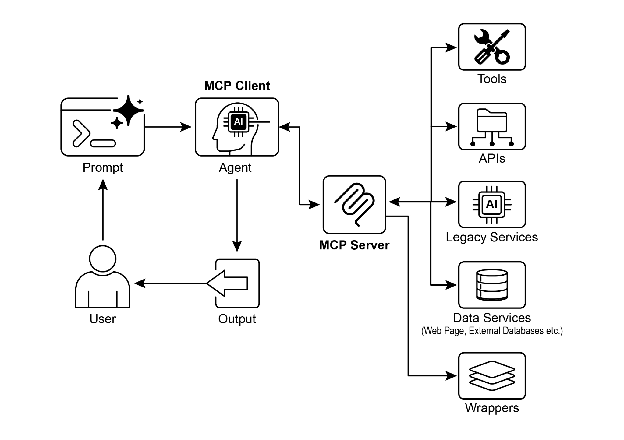

# Chapter 10: Model Context Protocol

LLM이 Agent로서 효과적으로 기능하려면, 다중 모달 생성 기능을 넘어서는 역량이 필요함. 외부 환경과의 상호 작용이 필수적이며, 여기에는 현재 데이터 접근, 외부 소프트웨어 활용, 특정 운영 작업 실행이 포함됨. Model Context Protocol(MCP)은 LLM이 외부 리소스와 인터페이스할 수 있는 표준화된 인터페이스를 제공하여 이러한 요구를 충족함. 이 프로토콜은 일관되고 예측 가능한 통합을 촉진하는 핵심 메커니즘임.

# MCP Pattern 개요

모든 LLM이 각각 맞춤 통합 없이 모든 외부 시스템, 데이터베이스 또는 도구에 연결할 수 있는 범용 어댑터를 상상해보면 됨. 이것이 바로 Model Context Protocol(MCP)의 본질임. Gemini, OpenAI의 GPT 모델, Mixtral, Claude 같은 LLM이 외부 애플리케이션, 데이터 소스, 도구와 통신하는 방법을 표준화하기 위해 설계된 개방형 표준임. LLM이 컨텍스트를 획득하고, 작업을 실행하며, 다양한 시스템과 상호 작용하는 방법을 단순화하는 범용 연결 메커니즘으로 이해할 수 있음.

MCP는 클라이언트-서버 아키텍처로 작동함. 데이터(리소스라고 불림), 대화형 템플릿(본질적으로 프롬프트), 실행 가능한 함수(도구라고 알려진)와 같은 다양한 요소가 MCP 서버에 의해 어떻게 노출되는지를 정의함. 이들은 MCP 클라이언트에 의해 소비되며, 클라이언트는 LLM 호스트 애플리케이션 또는 AI Agent 자체일 수 있음. 이러한 표준화된 접근 방식은 LLM을 다양한 운영 환경에 통합하는 복잡성을 극적으로 감소시킴.

하지만 MCP는 "agentic interface"를 위한 계약이며, 그 효율성은 노출하는 기본 API의 설계에 크게 의존함. 개발자가 단순히 기존의 레거시 API를 수정 없이 래핑하는 위험이 있으며, 이는 Agent에게 최적이 아닐 수 있음. 예를 들어, 티켓팅 시스템의 API가 티켓 전체 세부 정보를 하나씩만 검색할 수 있다면, 우선순위가 높은 티켓을 요약하도록 요청받은 Agent는 대량 처리 시 느리고 부정확할 것임. 진정으로 효과적이려면, 기본 API는 필터링 및 정렬과 같은 결정론적 기능으로 개선되어 비결정론적 Agent가 효율적으로 작동할 수 있도록 도와야 함. 이는 Agent가 결정론적 워크플로를 마법처럼 대체하지 않으며, 종종 성공하기 위해 더 강력한 결정론적 지원이 필요함을 강조함.

또한 MCP는 입력이나 출력이 여전히 Agent가 본질적으로 이해할 수 없는 API를 래핑할 수 있음. API는 데이터 형식이 Agent 친화적일 때만 유용하며, 이는 MCP 자체가 보장하지 않음. 예를 들어, PDF로 파일을 반환하는 문서 저장소용 MCP 서버를 만드는 것은 소비하는 Agent가 PDF 콘텐츠를 구문 분석할 수 없다면 대부분 쓸모없음. 더 나은 접근 방식은 먼저 Agent가 실제로 읽고 처리할 수 있는 Markdown 같은 텍스트 버전의 문서를 반환하는 API를 만드는 것임. 이는 개발자가 연결뿐만 아니라 교환되는 데이터의 특성을 고려하여 진정한 호환성을 보장해야 함을 보여줌.

# MCP vs. Tool Function Calling

Model Context Protocol(MCP)과 tool function calling은 LLM이 외부 기능(도구 포함)과 상호 작용하고 작업을 실행할 수 있게 하는 별개의 메커니즘임. 둘 다 LLM 기능을 텍스트 생성 너머로 확장하는 역할을 하지만, 접근 방식과 추상화 수준에서 차이가 있음.

Tool function calling은 LLM이 특정하고 사전 정의된 도구나 함수에 직접 요청하는 것으로 생각할 수 있음. 이 맥락에서 "도구"와 "함수"라는 단어를 상호 교환적으로 사용함. 이러한 상호 작용은 일대일 통신 모델로 특징지어지며, LLM이 외부 작업이 필요한 사용자 의도에 대한 이해를 바탕으로 요청을 포맷함. 그런 다음 애플리케이션 코드가 이 요청을 실행하고 결과를 LLM에 반환함. 이 프로세스는 종종 독점적이며 다양한 LLM 제공자마다 다름.

대조적으로, Model Context Protocol(MCP)은 LLM이 외부 기능을 발견하고, 통신하고, 활용할 수 있는 표준화된 인터페이스로 작동함. 다양한 도구 및 시스템과의 상호 작용을 촉진하는 개방형 프로토콜로 기능하며, 모든 호환 도구가 모든 호환 LLM에 의해 접근될 수 있는 생태계를 구축하는 것을 목표로 함. 이는 다양한 시스템과 구현 전반에 걸쳐 상호 운용성, 조합성, 재사용성을 촉진함. 연합 모델을 채택함으로써, 상호 운용성을 크게 개선하고 기존 자산의 가치를 활용함. 이 전략은 서로 다른 레거시 서비스를 단순히 MCP 호환 인터페이스로 래핑함으로써 현대적인 생태계로 가져올 수 있게 함. 이러한 서비스는 독립적으로 계속 작동하지만 이제 새로운 애플리케이션과 워크플로에 구성될 수 있으며, LLM에 의해 협업이 조율됨. 이는 기초 시스템의 비용이 많이 드는 재작성 없이 민첩성과 재사용성을 촉진함.

다음은 MCP와 tool function calling 간의 근본적인 차이점임:

| 기능 | Tool Function Calling | Model Context Protocol (MCP) |
| ----- | ----- | ----- |
| **표준화** | 독점적이고 벤더별로 다름. 형식과 구현이 LLM 제공자마다 다름. | 개방형 표준화된 프로토콜로, 다양한 LLM과 도구 간 상호 운용성 촉진. |
| **범위** | LLM이 특정하고 사전 정의된 함수의 실행을 요청하는 직접적인 메커니즘. | LLM과 외부 도구가 서로를 발견하고 통신하는 방법에 대한 더 광범위한 프레임워크. |
| **아키텍처** | LLM과 애플리케이션의 도구 처리 로직 간 일대일 상호 작용. | LLM 기반 애플리케이션(클라이언트)이 다양한 MCP 서버(도구)에 연결하고 활용할 수 있는 클라이언트-서버 아키텍처. |
| **발견** | LLM은 특정 대화 컨텍스트 내에서 어떤 도구를 사용할 수 있는지 명시적으로 알려받음. | 사용 가능한 도구의 동적 발견 가능. MCP 클라이언트는 서버에 쿼리하여 제공하는 기능을 확인할 수 있음. |
| **재사용성** | 도구 통합은 종종 사용되는 특정 애플리케이션 및 LLM과 긴밀하게 결합됨. | 모든 호환 애플리케이션이 접근할 수 있는 재사용 가능한 독립형 "MCP 서버" 개발 촉진. |

Tool function calling은 AI에게 특정한 맞춤 제작 도구 세트를 주는 것, 예를 들어 특정 렌치와 드라이버를 주는 것과 같음. 고정된 작업 세트를 가진 작업장에는 효율적임. 반면 MCP(Model Context Protocol)는 범용 표준화된 전원 콘센트 시스템을 만드는 것과 같음. 도구 자체를 제공하지는 않지만, 모든 제조업체의 모든 호환 도구가 연결되어 작동할 수 있게 하여 동적이고 끊임없이 확장되는 작업장을 가능하게 함.

요약하면, function calling은 몇 가지 특정 함수에 대한 직접 접근을 제공하는 반면, MCP는 LLM이 광범위한 외부 리소스를 발견하고 사용할 수 있게 하는 표준화된 통신 프레임워크임. 간단한 애플리케이션의 경우 특정 도구만으로 충분하지만, 적응이 필요한 복잡하고 상호 연결된 AI 시스템의 경우 MCP 같은 범용 표준이 필수적임.

# MCP에 대한 추가 고려사항

MCP가 강력한 프레임워크를 제시하지만, 철저한 평가는 특정 사용 사례에 대한 적합성에 영향을 미치는 여러 중요한 측면을 고려해야 함. 몇 가지 측면을 더 자세히 살펴봄:

* **Tool vs. Resource vs. Prompt**: 이러한 구성 요소의 특정 역할을 이해하는 것이 중요함. 리소스는 정적 데이터임(예: PDF 파일, 데이터베이스 레코드). 도구는 작업을 수행하는 실행 가능한 함수임(예: 이메일 전송, API 쿼리). 프롬프트는 LLM이 리소스나 도구와 상호 작용하는 방법을 안내하는 템플릿으로, 상호 작용이 구조화되고 효과적이도록 보장함.
* **발견 가능성**: MCP의 주요 장점은 MCP 클라이언트가 서버에 동적으로 쿼리하여 제공하는 도구와 리소스를 파악할 수 있다는 것임. 이 "just-in-time" 발견 메커니즘은 재배포 없이 새로운 기능에 적응해야 하는 Agent에게 강력함.
* **보안**: 모든 프로토콜을 통해 도구와 데이터를 노출하려면 강력한 보안 조치가 필요함. MCP 구현에는 어떤 클라이언트가 어떤 서버에 접근할 수 있고 어떤 특정 작업을 수행할 수 있는지를 제어하기 위한 인증 및 권한 부여가 포함되어야 함.
* **구현**: MCP는 개방형 표준이지만, 구현은 복잡할 수 있음. 하지만 제공자들이 이 프로세스를 단순화하기 시작하고 있음. 예를 들어, Anthropic이나 FastMCP 같은 일부 모델 제공자는 보일러플레이트 코드의 대부분을 추상화하는 SDK를 제공하여 개발자가 MCP 클라이언트와 서버를 더 쉽게 만들고 연결할 수 있게 함.
* **오류 처리**: 포괄적인 오류 처리 전략이 중요함. 프로토콜은 오류(예: 도구 실행 실패, 사용 불가능한 서버, 유효하지 않은 요청)가 LLM에 어떻게 다시 전달되는지를 정의해야 하며, LLM이 실패를 이해하고 잠재적으로 대안적 접근 방식을 시도할 수 있도록 해야 함.
* **로컬 vs. 원격 서버**: MCP 서버는 Agent와 같은 머신에 로컬로 배포하거나 다른 서버에 원격으로 배포할 수 있음. 로컬 서버는 민감한 데이터의 속도와 보안을 위해 선택될 수 있으며, 원격 서버 아키텍처는 조직 전반에 걸쳐 공통 도구에 대한 공유되고 확장 가능한 접근을 허용함.
* **온디맨드 vs. 배치**: MCP는 온디맨드 대화형 세션과 대규모 배치 처리를 모두 지원할 수 있음. 선택은 애플리케이션에 따라 달라지며, 즉각적인 도구 접근이 필요한 실시간 대화형 Agent부터 레코드를 배치로 처리하는 데이터 분석 파이프라인까지 다양함.
* **전송 메커니즘**: 프로토콜은 통신을 위한 기본 전송 계층도 정의함. 로컬 상호 작용의 경우, 효율적인 프로세스 간 통신을 위해 STDIO(표준 입력/출력)를 통한 JSON-RPC를 사용함. 원격 연결의 경우, 지속적이고 효율적인 클라이언트-서버 통신을 가능하게 하기 위해 Streamable HTTP 및 Server-Sent Events(SSE)와 같은 웹 친화적 프로토콜을 활용함.

Model Context Protocol은 클라이언트-서버 모델을 사용하여 정보 흐름을 표준화함. 구성 요소 상호 작용을 이해하는 것이 MCP의 고급 agentic 동작의 핵심임:

1. **Large Language Model (LLM)**: 핵심 지능. 사용자 요청을 처리하고, 계획을 수립하며, 외부 정보에 접근하거나 작업을 수행해야 할 때를 결정함.
2. **MCP Client**: LLM 주변의 애플리케이션 또는 래퍼. 중개자 역할을 하며, LLM의 의도를 MCP 표준을 준수하는 공식 요청으로 변환함. MCP 서버를 발견하고, 연결하고, 통신하는 책임이 있음.
3. **MCP Server**: 외부 세계로의 게이트웨이. 권한이 부여된 모든 MCP 클라이언트에 도구, 리소스, 프롬프트 세트를 노출함. 각 서버는 일반적으로 회사 내부 데이터베이스 연결, 이메일 서비스 또는 공개 API와 같은 특정 도메인을 담당함.
4. **선택적 Third-Party (3P) 서비스:** MCP 서버가 관리하고 노출하는 실제 외부 도구, 애플리케이션 또는 데이터 소스를 나타냄. 독점 데이터베이스 쿼리, SaaS 플랫폼과의 상호 작용, 공개 날씨 API 호출과 같은 요청된 작업을 수행하는 최종 엔드포인트임.

상호 작용은 다음과 같이 진행됨:

1. **발견**: MCP 클라이언트는 LLM을 대신하여 MCP 서버에 쿼리하여 제공하는 기능을 묻음. 서버는 사용 가능한 도구(예: send_email), 리소스(예: customer_database), 프롬프트를 나열하는 매니페스트로 응답함.
2. **요청 수립**: LLM은 발견된 도구 중 하나를 사용해야 한다고 결정함. 예를 들어, 이메일을 보내기로 결정함. 사용할 도구(send_email)와 필요한 매개변수(수신자, 제목, 본문)를 지정하여 요청을 수립함.
3. **클라이언트 통신**: MCP 클라이언트는 LLM의 수립된 요청을 가져와 적절한 MCP 서버에 표준화된 호출로 전송함.
4. **서버 실행**: MCP 서버는 요청을 받음. 클라이언트를 인증하고, 요청을 검증한 다음, 기본 소프트웨어와 인터페이스하여 지정된 작업을 실행함(예: 이메일 API의 send() 함수 호출).
5. **응답 및 컨텍스트 업데이트**: 실행 후, MCP 서버는 표준화된 응답을 MCP 클라이언트로 다시 전송함. 이 응답은 작업이 성공했는지를 나타내며 관련 출력을 포함함(예: 전송된 이메일에 대한 확인 ID). 그런 다음 클라이언트는 이 결과를 LLM에 다시 전달하여 컨텍스트를 업데이트하고 작업의 다음 단계를 진행할 수 있게 함.

# 실용적 애플리케이션 및 사용 사례

MCP는 AI/LLM 기능을 크게 확장하여 더 다재다능하고 강력하게 만듦. 다음은 9가지 주요 사용 사례임:

* **데이터베이스 통합:** MCP를 통해 LLM과 Agent가 데이터베이스의 구조화된 데이터에 원활하게 접근하고 상호 작용할 수 있음. 예를 들어, MCP Toolbox for Databases를 사용하여 Agent는 Google BigQuery 데이터셋을 쿼리하여 실시간 정보를 검색하고, 보고서를 생성하거나, 레코드를 업데이트할 수 있으며, 모두 자연어 명령으로 구동됨.
* **생성 미디어 오케스트레이션:** MCP는 Agent가 고급 생성 미디어 서비스와 통합할 수 있게 함. MCP Tools for Genmedia Services를 통해 Agent는 이미지 생성을 위한 Google의 Imagen, 비디오 제작을 위한 Google의 Veo, 현실적인 음성을 위한 Google의 Chirp 3 HD, 또는 음악 작곡을 위한 Google의 Lyria를 포함하는 워크플로를 조율할 수 있으며, AI 애플리케이션 내에서 동적 콘텐츠 생성이 가능함.
* **외부 API 상호 작용:** MCP는 LLM이 모든 외부 API를 호출하고 응답을 받을 수 있는 표준화된 방법을 제공함. 이는 Agent가 실시간 날씨 데이터를 가져오고, 주가를 가져오고, 이메일을 보내거나, CRM 시스템과 상호 작용할 수 있음을 의미하며, 핵심 언어 모델을 훨씬 넘어 기능을 확장함.
* **추론 기반 정보 추출:** LLM의 강력한 추론 능력을 활용하여 MCP는 기존 검색 및 검색 시스템을 능가하는 효과적이고 쿼리 의존적인 정보 추출을 촉진함. 전통적인 검색 도구가 전체 문서를 반환하는 대신, Agent는 텍스트를 분석하고 사용자의 복잡한 질문에 직접 답하는 정확한 조항, 수치 또는 진술을 추출할 수 있음.
* **사용자 정의 도구 개발:** 개발자는 사용자 정의 도구를 구축하고 MCP 서버를 통해 노출할 수 있음(예: FastMCP 사용). 이를 통해 전문화된 내부 함수나 독점 시스템을 LLM을 직접 수정할 필요 없이 표준화되고 쉽게 소비 가능한 형식으로 LLM 및 다른 Agent에게 제공할 수 있음.
* **표준화된 LLM-애플리케이션 통신:** MCP는 LLM과 이들이 상호 작용하는 애플리케이션 간에 일관된 통신 계층을 보장함. 이는 통합 오버헤드를 줄이고, 다양한 LLM 제공자와 호스트 애플리케이션 간의 상호 운용성을 촉진하며, 복잡한 agentic 시스템 개발을 단순화함.
* **복잡한 워크플로 오케스트레이션:** 다양한 MCP 노출 도구와 데이터 소스를 결합함으로써 Agent는 매우 복잡한 다단계 워크플로를 조율할 수 있음. 예를 들어, Agent는 데이터베이스에서 고객 데이터를 검색하고, 개인화된 마케팅 이미지를 생성하고, 맞춤형 이메일을 작성한 다음, 모두 다양한 MCP 서비스와 상호 작용하여 전송할 수 있음.
* **IoT 디바이스 제어:** MCP는 LLM과 Internet of Things(IoT) 디바이스 간의 상호 작용을 촉진할 수 있음. Agent는 MCP를 사용하여 스마트 홈 기기, 산업 센서 또는 로봇 공학에 명령을 보낼 수 있으며, 물리적 시스템의 자연어 제어 및 자동화를 가능하게 함.
* **금융 서비스 자동화:** 금융 서비스에서 MCP는 LLM이 다양한 금융 데이터 소스, 거래 플랫폼 또는 규정 준수 시스템과 상호 작용할 수 있게 함. Agent는 시장 데이터를 분석하고, 거래를 실행하고, 개인화된 금융 조언을 생성하거나, 규제 보고를 자동화할 수 있으며, 모두 안전하고 표준화된 통신을 유지하면서 수행함.

요약하면, Model Context Protocol(MCP)은 Agent가 데이터베이스, API, 웹 리소스로부터 실시간 정보에 접근할 수 있게 함. 또한 Agent가 이메일 전송, 레코드 업데이트, 디바이스 제어와 같은 작업을 수행하고, 다양한 소스의 데이터를 통합 및 처리하여 복잡한 작업을 실행할 수 있게 함. 추가로, MCP는 AI 애플리케이션을 위한 미디어 생성 도구를 지원함.

# ADK를 사용한 실습 코드 예제

이 섹션에서는 파일 시스템 작업을 제공하는 로컬 MCP 서버에 연결하는 방법을 설명하며, ADK Agent가 로컬 파일 시스템과 상호 작용할 수 있게 함.

## MCPToolset을 사용한 Agent 설정

파일 시스템 상호 작용을 위해 Agent를 구성하려면, `agent.py` 파일을 생성해야 함(예: `./adk_agent_samples/mcp_agent/agent.py`). `MCPToolset`은 `LlmAgent` 객체의 `tools` 리스트 내에 인스턴스화됨. `args` 리스트의 `"/path/to/your/folder"`를 MCP 서버가 접근할 수 있는 로컬 시스템의 디렉토리 절대 경로로 교체하는 것이 중요함. 이 디렉토리는 Agent가 수행하는 파일 시스템 작업의 루트가 됨.

```python
import os
from google.adk.agents import LlmAgent
from google.adk.tools.mcp_tool.mcp_toolset import MCPToolset, StdioServerParameters

# Create a reliable absolute path to a folder named 'mcp_managed_files'
# within the same directory as this agent script.
# This ensures the agent works out-of-the-box for demonstration.
# For production, you would point this to a more persistent and secure location.
TARGET_FOLDER_PATH = os.path.join(os.path.dirname(os.path.abspath(__file__)), "mcp_managed_files")

# Ensure the target directory exists before the agent needs it.
os.makedirs(TARGET_FOLDER_PATH, exist_ok=True)

root_agent = LlmAgent(
    model='gemini-2.0-flash',
    name='filesystem_assistant_agent',
    instruction=(
        'Help the user manage their files. You can list files, read files, and write files. '
        f'You are operating in the following directory: {TARGET_FOLDER_PATH}'
    ),
    tools=[
        MCPToolset(
            connection_params=StdioServerParameters(
                command='npx',
                args=[
                    "-y",  # Argument for npx to auto-confirm install
                    "@modelcontextprotocol/server-filesystem",
                    # This MUST be an absolute path to a folder.
                    TARGET_FOLDER_PATH,
                ],
            ),
            # Optional: You can filter which tools from the MCP server are exposed.
            # For example, to only allow reading:
            # tool_filter=['list_directory', 'read_file']
        )
    ],
)
```

`npx`(Node Package Execute)는 npm(Node Package Manager) 버전 5.2.0 이상과 함께 번들로 제공되는 유틸리티로, npm 레지스트리에서 Node.js 패키지를 직접 실행할 수 있게 함. 전역 설치가 필요 없음. 본질적으로, `npx`는 npm 패키지 러너 역할을 하며, 많은 커뮤니티 MCP 서버를 실행하는 데 일반적으로 사용되며, 이들은 Node.js 패키지로 배포됨.

\_\_init\_\_.py 파일을 생성하는 것은 agent.py 파일이 Agent Development Kit(ADK)에서 발견 가능한 Python 패키지의 일부로 인식되도록 하기 위해 필요함. 이 파일은 [agent.py](http://agent.py)와 같은 디렉토리에 있어야 함.

```python
# ./adk_agent_samples/mcp_agent/__init__.py
from . import agent
```

다른 지원되는 명령도 사용 가능함. 예를 들어, python3에 연결하는 것은 다음과 같이 달성할 수 있음:

```python
connection_params = StdioConnectionParams(
    server_params={
        "command": "python3",
        "args": ["./agent/mcp_server.py"],
        "env": {
            "SERVICE_ACCOUNT_PATH": SERVICE_ACCOUNT_PATH,
            "DRIVE_FOLDER_ID": DRIVE_FOLDER_ID
        }
    }
)
```

Python 맥락에서 UVX는 uv를 활용하여 임시 격리된 Python 환경에서 명령을 실행하는 커맨드라인 도구를 가리킴. 본질적으로 Python 도구와 패키지를 전역으로 또는 프로젝트 환경 내에 설치할 필요 없이 실행할 수 있게 함. MCP 서버를 통해 실행할 수 있음.

```python
connection_params = StdioConnectionParams(
    server_params={
        "command": "uvx",
        "args": ["mcp-google-sheets@latest"],
        "env": {
            "SERVICE_ACCOUNT_PATH": SERVICE_ACCOUNT_PATH,
            "DRIVE_FOLDER_ID": DRIVE_FOLDER_ID
        }
    }
)
```

MCP 서버가 생성되면, 다음 단계는 연결하는 것임.

## ADK Web과 MCP 서버 연결

시작하려면 'adk web'을 실행함. 터미널에서 mcp_agent의 상위 디렉토리(예: adk_agent_samples)로 이동하여 실행:

```bash
cd ./adk_agent_samples # Or your equivalent parent directory
adk web
```

브라우저에서 ADK Web UI가 로드되면, Agent 메뉴에서 `filesystem_assistant_agent`를 선택함. 다음과 같은 프롬프트로 실험:

* "Show me the contents of this folder."
* "Read the `sample.txt` file." (`sample.txt`가 `TARGET_FOLDER_PATH`에 위치한다고 가정.)
* "What's in `another_file.md`?"

## FastMCP로 MCP 서버 생성

FastMCP는 MCP 서버 개발을 간소화하기 위해 설계된 고급 Python 프레임워크임. 프로토콜 복잡성을 추상화하는 추상화 계층을 제공하여 개발자가 핵심 로직에 집중할 수 있게 함.

라이브러리는 간단한 Python 데코레이터를 사용하여 도구, 리소스, 프롬프트를 빠르게 정의할 수 있게 함. 중요한 장점은 자동 스키마 생성으로, Python 함수 시그니처, 타입 힌트, 문서 문자열을 지능적으로 해석하여 필요한 AI 모델 인터페이스 사양을 구성함. 이러한 자동화는 수동 구성을 최소화하고 인적 오류를 줄임.

기본 도구 생성을 넘어 FastMCP는 서버 구성 및 프록시와 같은 고급 아키텍처 패턴을 촉진함. 이를 통해 복잡한 다중 구성 요소 시스템의 모듈식 개발과 기존 서비스를 AI 접근 가능한 프레임워크로 원활하게 통합할 수 있음. 또한 FastMCP는 효율적이고 분산되며 확장 가능한 AI 기반 애플리케이션을 위한 최적화를 포함함.

## FastMCP로 서버 설정

기본 "greet" 도구를 제공하는 서버를 예시로 살펴봄. ADK Agent 및 다른 MCP 클라이언트는 활성화되면 HTTP를 사용하여 이 도구와 상호 작용할 수 있음.

```python
# fastmcp_server.py
# This script demonstrates how to create a simple MCP server using FastMCP.
# It exposes a single tool that generates a greeting.

# 1. Make sure you have FastMCP installed:
# pip install fastmcp

from fastmcp import FastMCP, Client

# Initialize the FastMCP server.
mcp_server = FastMCP()

# Define a simple tool function.
# The `@mcp_server.tool` decorator registers this Python function as an MCP tool.
# The docstring becomes the tool's description for the LLM.
@mcp_server.tool
def greet(name: str) -> str:
    """
    Generates a personalized greeting.

    Args:
        name: The name of the person to greet.

    Returns:
        A greeting string.
    """
    return f"Hello, {name}! Nice to meet you."

# Or if you want to run it from the script:
if __name__ == "__main__":
    mcp_server.run(
        transport="http",
        host="127.0.0.1",
        port=8000
    )
```

이 Python 스크립트는 사람의 이름을 받아 개인화된 인사를 반환하는 greet라는 단일 함수를 정의함. 이 함수 위의 @tool() 데코레이터는 AI나 다른 프로그램이 사용할 수 있는 도구로 자동 등록함. 함수의 문서 문자열과 타입 힌트는 FastMCP가 Agent에게 도구의 작동 방식, 필요한 입력, 반환할 내용을 알려주는 데 사용됨.

스크립트가 실행되면, localhost:8000에서 요청을 수신하는 FastMCP 서버를 시작함. 이는 greet 함수를 네트워크 서비스로 사용할 수 있게 함. 그러면 Agent는 이 서버에 연결하도록 구성되어 greet 도구를 사용하여 더 큰 작업의 일부로 인사말을 생성할 수 있음. 서버는 수동으로 중지될 때까지 계속 실행됨.

## ADK Agent로 FastMCP 서버 사용

ADK Agent는 실행 중인 FastMCP 서버를 사용하기 위해 MCP 클라이언트로 설정할 수 있음. 이는 FastMCP 서버의 네트워크 주소(보통 http://localhost:8000)로 HttpServerParameters를 구성해야 함.

tool_filter 매개변수를 포함하여 Agent의 도구 사용을 서버가 제공하는 특정 도구(예: 'greet')로 제한할 수 있음. "Greet John Doe"와 같은 요청으로 프롬프트되면, Agent에 내장된 LLM이 MCP를 통해 사용 가능한 'greet' 도구를 식별하고, "John Doe" 인수로 호출하며, 서버의 응답을 반환함. 이 프로세스는 MCP를 통해 노출된 사용자 정의 도구와 ADK Agent의 통합을 보여줌.

이 구성을 설정하려면, agent 파일(예: ./adk_agent_samples/fastmcp_client_agent/에 위치한 agent.py)이 필요함. 이 파일은 ADK Agent를 인스턴스화하고 HttpServerParameters를 사용하여 운영 중인 FastMCP 서버와의 연결을 설정함.

```python
# ./adk_agent_samples/fastmcp_client_agent/agent.py
import os
from google.adk.agents import LlmAgent
from google.adk.tools.mcp_tool.mcp_toolset import MCPToolset, HttpServerParameters

# Define the FastMCP server's address.
# Make sure your fastmcp_server.py (defined previously) is running on this port.
FASTMCP_SERVER_URL = "http://localhost:8000"

root_agent = LlmAgent(
    model='gemini-2.0-flash',  # Or your preferred model
    name='fastmcp_greeter_agent',
    instruction='You are a friendly assistant that can greet people by their name. Use the "greet" tool.',
    tools=[
        MCPToolset(
            connection_params=HttpServerParameters(
                url=FASTMCP_SERVER_URL,
            ),
            # Optional: Filter which tools from the MCP server are exposed
            # For this example, we're expecting only 'greet'
            tool_filter=['greet']
        )
    ],
)
```

스크립트는 Gemini 언어 모델을 사용하는 fastmcp_greeter_agent라는 Agent를 정의함. 사람들에게 인사하는 것이 목적인 친근한 조수로 행동하라는 특정 지시를 받음. 중요한 것은, 코드가 이 Agent에 작업을 수행할 도구를 장착함. localhost:8000에서 실행되는 별도의 서버에 연결하도록 MCPToolset을 구성하며, 이는 이전 예제의 FastMCP 서버일 것으로 예상됨. Agent는 해당 서버에서 호스팅되는 greet 도구에 대한 접근 권한을 특별히 부여받음. 본질적으로 이 코드는 시스템의 클라이언트 측을 설정하여, 사람들에게 인사하는 것이 목표임을 이해하고 이를 달성하기 위해 사용할 외부 도구를 정확히 아는 지능형 Agent를 생성함.

fastmcp_client_agent 디렉토리 내에 \_\_init\_\_.py 파일을 생성하는 것이 필요함. 이는 Agent가 ADK에서 발견 가능한 Python 패키지로 인식되도록 보장함.

시작하려면, 새 터미널을 열고 `python fastmcp_server.py`를 실행하여 FastMCP 서버를 시작함. 다음으로, 터미널에서 `fastmcp_client_agent`의 상위 디렉토리(예: `adk_agent_samples`)로 이동하여 `adk web`을 실행함. 브라우저에서 ADK Web UI가 로드되면, Agent 메뉴에서 `fastmcp_greeter_agent`를 선택함. 그런 다음 "Greet John Doe"와 같은 프롬프트를 입력하여 테스트할 수 있음. Agent는 FastMCP 서버의 `greet` 도구를 사용하여 응답을 생성함.

# 한눈에 보기

**무엇:** LLM이 효과적인 Agent로 기능하려면, 단순한 텍스트 생성을 넘어서야 함. 현재 데이터에 접근하고 외부 소프트웨어를 활용하기 위해 외부 환경과 상호 작용할 수 있는 능력이 필요함. 표준화된 통신 방법이 없으면, LLM과 외부 도구 또는 데이터 소스 간의 각 통합은 맞춤형이고, 복잡하며, 재사용 불가능한 노력이 됨. 이러한 임시 방편적 접근 방식은 확장성을 저해하고 복잡하고 상호 연결된 AI 시스템을 구축하는 것을 어렵고 비효율적으로 만듦.

**왜:** Model Context Protocol(MCP)은 LLM과 외부 시스템 간의 범용 인터페이스 역할을 하여 표준화된 솔루션을 제공함. 외부 기능이 발견되고 사용되는 방법을 정의하는 개방형 표준화된 프로토콜을 확립함. 클라이언트-서버 모델로 작동하는 MCP는 서버가 도구, 데이터 리소스, 대화형 프롬프트를 모든 호환 클라이언트에 노출할 수 있게 함. LLM 기반 애플리케이션은 이러한 클라이언트로 작동하여 사용 가능한 리소스를 예측 가능한 방식으로 동적으로 발견하고 상호 작용함. 이러한 표준화된 접근 방식은 상호 운용 가능하고 재사용 가능한 구성 요소의 생태계를 조성하며, 복잡한 agentic 워크플로 개발을 극적으로 단순화함.

**경험 법칙:** 다양하고 진화하는 외부 도구, 데이터 소스, API 세트와 상호 작용해야 하는 복잡하고 확장 가능하거나 엔터프라이즈급 agentic 시스템을 구축할 때 Model Context Protocol(MCP)을 사용함. 다양한 LLM과 도구 간의 상호 운용성이 우선순위이고, Agent가 재배포 없이 새로운 기능을 동적으로 발견할 수 있는 능력이 필요할 때 이상적임. 고정되고 제한된 수의 사전 정의된 함수를 가진 더 간단한 애플리케이션의 경우, 직접적인 tool function calling으로 충분할 수 있음.

**시각적 요약!**



Fig.1: Model Context protocol

# 주요 요점

주요 요점은 다음과 같음:

* Model Context Protocol(MCP)은 LLM과 외부 애플리케이션, 데이터 소스, 도구 간의 표준화된 통신을 촉진하는 개방형 표준임.
* 클라이언트-서버 아키텍처를 사용하며, 리소스, 프롬프트, 도구를 노출하고 소비하는 방법을 정의함.
* Agent Development Kit(ADK)는 기존 MCP 서버 활용과 MCP 서버를 통한 ADK 도구 노출을 모두 지원함.
* FastMCP는 특히 Python으로 구현된 도구를 노출하는 데 있어 MCP 서버의 개발 및 관리를 단순화함.
* MCP Tools for Genmedia Services는 Agent가 Google Cloud의 생성 미디어 기능(Imagen, Veo, Chirp 3 HD, Lyria)과 통합할 수 있게 함.
* MCP는 LLM과 Agent가 실제 시스템과 상호 작용하고, 동적 정보에 접근하며, 텍스트 생성을 넘어선 작업을 수행할 수 있게 함.

# 결론

Model Context Protocol(MCP)은 Large Language Model(LLM)과 외부 시스템 간의 통신을 촉진하는 개방형 표준임. 클라이언트-서버 아키텍처를 사용하여 LLM이 리소스에 접근하고, 프롬프트를 활용하며, 표준화된 도구를 통해 작업을 실행할 수 있게 함. MCP는 LLM이 데이터베이스와 상호 작용하고, 생성 미디어 워크플로를 관리하고, IoT 디바이스를 제어하며, 금융 서비스를 자동화할 수 있게 함. 실용적 예제는 파일 시스템 서버 및 FastMCP로 구축된 서버를 포함한 MCP 서버와 통신하도록 Agent를 설정하는 것을 보여주며, Agent Development Kit(ADK)와의 통합을 설명함. MCP는 기본 언어 기능을 넘어 확장되는 대화형 AI Agent를 개발하기 위한 핵심 구성 요소임.

# 참고 문헌

1. Model Context Protocol (MCP) Documentation. (Latest). *Model Context Protocol (MCP)*. [https://google.github.io/adk-docs/mcp/](https://google.github.io/adk-docs/mcp/)
2. FastMCP Documentation. FastMCP. [https://github.com/jlowin/fastmcp](https://github.com/jlowin/fastmcp)
3. MCP Tools for Genmedia Services. *MCP Tools for Genmedia Services*. [https://google.github.io/adk-docs/mcp/\#mcp-servers-for-google-cloud-genmedia](https://google.github.io/adk-docs/mcp/#mcp-servers-for-google-cloud-genmedia)
4. MCP Toolbox for Databases Documentation. (Latest). *MCP Toolbox for Databases*. [https://google.github.io/adk-docs/mcp/databases/](https://google.github.io/adk-docs/mcp/databases/)
