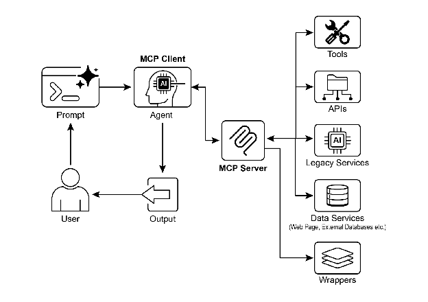

# Chapter 10: Model Context Protocol

To enable LLMs to function effectively as agents, their capabilities must extend beyond multimodal generation. Interaction with the external environment is necessary, including access to current data, utilization of external software, and execution of specific operational tasks. The Model Context Protocol (MCP) addresses this need by providing a standardized interface for LLMs to interface with external resources. This protocol serves as a key mechanism to facilitate consistent and predictable integration.

# MCP Pattern Overview

Imagine a universal adapter that allows any LLM to plug into any external system, database, or tool without a custom integration for each one. That's essentially what the Model Context Protocol (MCP) is. It's an open standard designed to standardize how LLMs like Gemini, OpenAI's GPT models, Mixtral, and Claude communicate with external applications, data sources, and tools. Think of it as a universal connection mechanism that simplifies how LLMs obtain context, execute actions, and interact with various systems.

MCP operates on a client-server architecture. It defines how different elements—data (referred to as resources), interactive templates (which are essentially prompts), and actionable functions (known as tools)—are exposed by an MCP server. These are then consumed by an MCP client, which could be an LLM host application or an AI agent itself. This standardized approach dramatically reduces the complexity of integrating LLMs into diverse operational environments.

However, MCP is a contract for an "agentic interface," and its effectiveness depends heavily on the design of the underlying APIs it exposes. There is a risk that developers simply wrap pre-existing, legacy APIs without modification, which can be suboptimal for an agent. For example, if a ticketing system's API only allows retrieving full ticket details one by one, an agent asked to summarize high-priority tickets will be slow and inaccurate at high volumes. To be truly effective, the underlying API should be improved with deterministic features like filtering and sorting to help the non-deterministic agent work efficiently. This highlights that agents do not magically replace deterministic workflows; they often require stronger deterministic support to succeed.

Furthermore, MCP can wrap an API whose input or output is still not inherently understandable by the agent. An API is only useful if its data format is agent-friendly, a guarantee that MCP itself does not enforce. For instance, creating an MCP server for a document store that returns files as PDFs is mostly useless if the consuming agent cannot parse PDF content. The better approach would be to first create an API that returns a textual version of the document, such as Markdown, which the agent can actually read and process. This demonstrates that developers must consider not just the connection, but the nature of the data being exchanged to ensure true compatibility.

# MCP vs. Tool Function Calling

The Model Context Protocol (MCP) and tool function calling are distinct mechanisms that enable LLMs to interact with external capabilities (including tools) and execute actions. While both serve to extend LLM capabilities beyond text generation, they differ in their approach and level of abstraction.

Tool function calling can be thought of as a direct request from an LLM to a specific, pre-defined tool or function. Note that in this context we use the words "tool" and "function" interchangeably. This interaction is characterized by a one-to-one communication model, where the LLM formats a request based on its understanding of a user's intent requiring external action. The application code then executes this request and returns the result to the LLM. This process is often proprietary and varies across different LLM providers.

In contrast, the Model Context Protocol (MCP) operates as a standardized interface for LLMs to discover, communicate with, and utilize external capabilities. It functions as an open protocol that facilitates interaction with a wide range of tools and systems, aiming to establish an ecosystem where any compliant tool can be accessed by any compliant LLM. This fosters interoperability, composability and reusability across different systems and implementations. By adopting a federated model, we significantly improve interoperability and unlock the value of existing assets. This strategy allows us to bring disparate and legacy services into a modern ecosystem simply by wrapping them in an MCP-compliant interface. These services continue to operate independently, but can now be composed into new applications and workflows, with their collaboration orchestrated by LLMs. This fosters agility and reusability without requiring costly rewrites of foundational systems.

Here's a breakdown of the fundamental distinctions between MCP and tool function calling:

| Feature | Tool Function Calling | Model Context Protocol (MCP) |
| ----- | ----- | ----- |
| **Standardization** | Proprietary and vendor-specific. The format and implementation differ across LLM providers. | An open, standardized protocol, promoting interoperability between different LLMs and tools. |
| **Scope** | A direct mechanism for an LLM to request the execution of a specific, predefined function. | A broader framework for how LLMs and external tools discover and communicate with each other. |
| **Architecture** | A one-to-one interaction between the LLM and the application's tool-handling logic. | A client-server architecture where LLM-powered applications (clients) can connect to and utilize various MCP servers (tools). |
| **Discovery** | The LLM is explicitly told which tools are available within the context of a specific conversation. | Enables dynamic discovery of available tools. An MCP client can query a server to see what capabilities it offers. |
| **Reusability** | Tool integrations are often tightly coupled with the specific application and LLM being used. | Promotes the development of reusable, standalone "MCP servers" that can be accessed by any compliant application. |

Think of tool function calling as giving an AI a specific set of custom-built tools, like a particular wrench and screwdriver. This is efficient for a workshop with a fixed set of tasks. MCP (Model Context Protocol), on the other hand, is like creating a universal, standardized power outlet system. It doesn't provide the tools itself, but it allows any compliant tool from any manufacturer to plug in and work, enabling a dynamic and ever-expanding workshop.

In short, function calling provides direct access to a few specific functions, while MCP is the standardized communication framework that lets LLMs discover and use a vast range of external resources. For simple applications, specific tools are enough; for complex, interconnected AI systems that need to adapt, a universal standard like MCP is essential.

# Additional considerations for MCP

While MCP presents a powerful framework, a thorough evaluation requires considering several crucial aspects that influence its suitability for a given use case. Let's see some aspects in more details:

* **Tool vs. Resource vs. Prompt**: It's important to understand the specific roles of these components. A resource is static data (e.g., a PDF file, a database record). A tool is an executable function that performs an action (e.g., sending an email, querying an API). A prompt is a template that guides the LLM in how to interact with a resource or tool, ensuring the interaction is structured and effective.
* **Discoverability**: A key advantage of MCP is that an MCP client can dynamically query a server to learn what tools and resources it offers. This "just-in-time" discovery mechanism is powerful for agents that need to adapt to new capabilities without being redeployed.
* **Security**: Exposing tools and data via any protocol requires robust security measures. An MCP implementation must include authentication and authorization to control which clients can access which servers and what specific actions they are permitted to perform.
* **Implementation**: While MCP is an open standard, its implementation can be complex. However, providers are beginning to simplify this process. For example, some model providers like Anthropic or FastMCP offer SDKs that abstract away much of the boilerplate code, making it easier for developers to create and connect MCP clients and servers.
* **Error Handling**: A comprehensive error-handling strategy is critical. The protocol must define how errors (e.g., tool execution failure, unavailable server, invalid request) are communicated back to the LLM so it can understand the failure and potentially try an alternative approach.
* **Local vs. Remote Server**: MCP servers can be deployed locally on the same machine as the agent or remotely on a different server. A local server might be chosen for speed and security with sensitive data, while a remote server architecture allows for shared, scalable access to common tools across an organization.
* **On-demand vs. Batch**: MCP can support both on-demand, interactive sessions and larger-scale batch processing. The choice depends on the application, from a real-time conversational agent needing immediate tool access to a data analysis pipeline that processes records in batches.
* **Transportation Mechanism**: The protocol also defines the underlying transport layers for communication. For local interactions, it uses JSON-RPC over STDIO (standard input/output) for efficient inter-process communication. For remote connections, it leverages web-friendly protocols like Streamable HTTP and Server-Sent Events (SSE) to enable persistent and efficient client-server communication.

The Model Context Protocol uses a client-server model to standardize information flow. Understanding component interaction is key to MCP's advanced agentic behavior:

1. **Large Language Model (LLM)**: The core intelligence. It processes user requests, formulates plans, and decides when it needs to access external information or perform an action.
2. **MCP Client**: This is an application or wrapper around the LLM. It acts as the intermediary, translating the LLM's intent into a formal request that conforms to the MCP standard. It is responsible for discovering, connecting to, and communicating with MCP Servers.
3. **MCP Server**: This is the gateway to the external world. It exposes a set of tools, resources, and prompts to any authorized MCP Client. Each server is typically responsible for a specific domain, such as a connection to a company's internal database, an email service, or a public API.
4. ​​**Optional Third-Party (3P) Service:** This represents the actual external tool, application, or data source that the MCP Server manages and exposes. It is the ultimate endpoint that performs the requested action, such as querying a proprietary database, interacting with a SaaS platform, or calling a public weather API.

The interaction flows as follows:

1. **Discovery**: The MCP Client, on behalf of the LLM, queries an MCP Server to ask what capabilities it offers. The server responds with a manifest listing its available tools (e.g., send\_email), resources (e.g., customer\_database), and prompts.
2. **Request Formulation**: The LLM determines that it needs to use one of the discovered tools. For instance, it decides to send an email. It formulates a request, specifying the tool to use (send\_email) and the necessary parameters (recipient, subject, body).
3. **Client Communication**: The MCP Client takes the LLM's formulated request and sends it as a standardized call to the appropriate MCP Server.
4. **Server Execution**: The MCP Server receives the request. It authenticates the client, validates the request, and then executes the specified action by interfacing with the underlying software (e.g., calling the send() function of an email API).
5. **Response and Context Update**: After execution, the MCP Server sends a standardized response back to the MCP Client. This response indicates whether the action was successful and includes any relevant output (e.g., a confirmation ID for the sent email). The client then passes this result back to the LLM, updating its context and enabling it to proceed with the next step of its task.

# Practical Applications & Use Cases

MCP significantly broadens AI/LLM capabilities, making them more versatile and powerful. Here are nine key use cases:

* **Database Integration:** MCP allows LLMs and agents to seamlessly access and interact with structured data in databases. For instance, using the MCP Toolbox for Databases, an agent can query Google BigQuery datasets to retrieve real-time information, generate reports, or update records, all driven by natural language commands.
* **Generative Media Orchestration:** MCP enables agents to integrate with advanced generative media services. Through MCP Tools for Genmedia Services, an agent can orchestrate workflows involving Google's Imagen for image generation, Google's Veo for video creation, Google's Chirp 3 HD for realistic voices, or Google's Lyria for music composition, allowing for dynamic content creation within AI applications.
* **External API Interaction:** MCP provides a standardized way for LLMs to call and receive responses from any external API. This means an agent can fetch live weather data, pull stock prices, send emails, or interact with CRM systems, extending its capabilities far beyond its core language model.
* **Reasoning-Based Information Extraction:** Leveraging an LLM's strong reasoning skills, MCP facilitates effective, query-dependent information extraction that surpasses conventional search and retrieval systems. Instead of a traditional search tool returning an entire document, an agent can analyze the text and extract the precise clause, figure, or statement that directly answers a user's complex question.
* **Custom Tool Development:** Developers can build custom tools and expose them via an MCP server (e.g., using FastMCP). This allows specialized internal functions or proprietary systems to be made available to LLMs and other agents in a standardized, easily consumable format, without needing to modify the LLM directly.
* **Standardized LLM-to-Application Communication:** MCP ensures a consistent communication layer between LLMs and the applications they interact with. This reduces integration overhead, promotes interoperability between different LLM providers and host applications, and simplifies the development of complex agentic systems.
* **Complex Workflow Orchestration:** By combining various MCP-exposed tools and data sources, agents can orchestrate highly complex, multi-step workflows. An agent could, for example, retrieve customer data from a database, generate a personalized marketing image, draft a tailored email, and then send it, all by interacting with different MCP services.
* **IoT Device Control:** MCP can facilitate LLM interaction with Internet of Things (IoT) devices. An agent could use MCP to send commands to smart home appliances, industrial sensors, or robotics, enabling natural language control and automation of physical systems.
* **Financial Services Automation:** In financial services, MCP could enable LLMs to interact with various financial data sources, trading platforms, or compliance systems. An agent might analyze market data, execute trades, generate personalized financial advice, or automate regulatory reporting, all while maintaining secure and standardized communication.

In short, the Model Context Protocol (MCP) enables agents to access real-time information from databases, APIs, and web resources. It also allows agents to perform actions like sending emails, updating records, controlling devices, and executing complex tasks by integrating and processing data from various sources. Additionally, MCP supports media generation tools for AI applications.

# Hands-On Code Example with ADK

This section outlines how to connect to a local MCP server that provides file system operations, enabling an ADK  agent to interact with the local file system.

## Agent Setup with MCPToolset

To configure an agent for file system interaction, an \`agent.py\` file must be created (e.g., at \`./adk\_agent\_samples/mcp\_agent/agent.py\`). The \`MCPToolset\` is instantiated within the \`tools\` list of the \`LlmAgent\` object. It is crucial to replace \`"/path/to/your/folder"\` in the \`args\` list with the absolute path to a directory on the local system that the MCP server can access. This directory will be the root for the file system operations performed by the agent.

```python
import os
from google.adk.agents import LlmAgent
from google.adk.tools.mcp_tool.mcp_toolset import MCPToolset, StdioServerParameters

# Create a reliable absolute path to a folder named 'mcp_managed_files'
# within the same directory as this agent script.
# This ensures the agent works out-of-the-box for demonstration.
# For production, you would point this to a more persistent and secure location.
TARGET_FOLDER_PATH = os.path.join(os.path.dirname(os.path.abspath(__file__)), "mcp_managed_files")

# Ensure the target directory exists before the agent needs it.
os.makedirs(TARGET_FOLDER_PATH, exist_ok=True)

root_agent = LlmAgent(
    model='gemini-2.0-flash',
    name='filesystem_assistant_agent',
    instruction=(
        'Help the user manage their files. You can list files, read files, and write files. '
        f'You are operating in the following directory: {TARGET_FOLDER_PATH}'
    ),
    tools=[
        MCPToolset(
            connection_params=StdioServerParameters(
                command='npx',
                args=[
                    "-y",  # Argument for npx to auto-confirm install
                    "@modelcontextprotocol/server-filesystem",
                    # This MUST be an absolute path to a folder.
                    TARGET_FOLDER_PATH,
                ],
            ),
            # Optional: You can filter which tools from the MCP server are exposed.
            # For example, to only allow reading:
            # tool_filter=['list_directory', 'read_file']
        )
    ],
)
```

\`npx\` (Node Package Execute), bundled with npm (Node Package Manager) versions 5.2.0 and later, is a utility that enables direct execution of Node.js packages from the npm registry. This eliminates the need for global installation. In essence, \`npx\` serves as an npm package runner, and it is commonly used to run many community MCP servers, which are distributed as Node.js packages.

Creating an \_\_init\_\_.py file is necessary to ensure the agent.py file is recognized as part of a discoverable Python package for the Agent Development Kit (ADK). This file should reside in the same directory as [agent.py](http://agent.py).

```python
# ./adk_agent_samples/mcp_agent/__init__.py
from . import agent
```

Certainly, other supported commands are available for use. For example, connecting to python3 can be achieved as follows:

```python
connection_params = StdioConnectionParams(
    server_params={
        "command": "python3",
        "args": ["./agent/mcp_server.py"],
        "env": {
            "SERVICE_ACCOUNT_PATH": SERVICE_ACCOUNT_PATH,
            "DRIVE_FOLDER_ID": DRIVE_FOLDER_ID
        }
    }
)
```

UVX, in the context of Python, refers to a command-line tool that utilizes uv to execute commands in a temporary, isolated Python environment. Essentially, it allows you to run Python tools and packages without needing to install them globally or within your project's environment. You can run it via the MCP server.

```python
connection_params = StdioConnectionParams(
    server_params={
        "command": "uvx",
        "args": ["mcp-google-sheets@latest"],
        "env": {
            "SERVICE_ACCOUNT_PATH": SERVICE_ACCOUNT_PATH,
            "DRIVE_FOLDER_ID": DRIVE_FOLDER_ID
        }
    }
)
```

Once the MCP Server is created, the next step is to connect to it.

## Connecting the MCP Server with ADK Web

To begin, execute 'adk web'. Navigate to the parent directory of mcp\_agent (e.g., adk\_agent\_samples) in your terminal and run:

```bash
cd ./adk_agent_samples # Or your equivalent parent directory
adk web
```

Once the ADK Web UI has loaded in your browser, select the \`filesystem\_assistant\_agent\` from the agent menu. Next, experiment with prompts such as:

* "Show me the contents of this folder."
* "Read the \`sample.txt\` file." (This assumes \`sample.txt\` is located at \`TARGET\_FOLDER\_PATH\`.)
* "What's in \`another\_file.md\`?"

## Creating an MCP Server with FastMCP

FastMCP is a high-level Python framework designed to streamline the development of MCP servers. It provides an abstraction layer that simplifies protocol complexities, allowing developers to focus on core logic.

The library enables rapid definition of tools, resources, and prompts using simple Python decorators. A significant advantage is its automatic schema generation, which intelligently interprets Python function signatures, type hints, and documentation strings to construct necessary AI model interface specifications. This automation minimizes manual configuration and reduces human error.

Beyond basic tool creation, FastMCP facilitates advanced architectural patterns like server composition and proxying. This enables modular development of complex, multi-component systems and seamless integration of existing services into an AI-accessible framework. Additionally, FastMCP includes optimizations for efficient, distributed, and scalable AI-driven applications.

## Server setup with FastMCP

## To illustrate, consider a basic "greet" tool provided by the server. ADK agents and other MCP clients can interact with this tool using HTTP once it is active.

```python
# fastmcp_server.py
# This script demonstrates how to create a simple MCP server using FastMCP.
# It exposes a single tool that generates a greeting.

# 1. Make sure you have FastMCP installed:
# pip install fastmcp

from fastmcp import FastMCP, Client

# Initialize the FastMCP server.
mcp_server = FastMCP()

# Define a simple tool function.
# The `@mcp_server.tool` decorator registers this Python function as an MCP tool.
# The docstring becomes the tool's description for the LLM.
@mcp_server.tool
def greet(name: str) -> str:
    """
    Generates a personalized greeting.

    Args:
        name: The name of the person to greet.

    Returns:
        A greeting string.
    """
    return f"Hello, {name}! Nice to meet you."

# Or if you want to run it from the script:
if __name__ == "__main__":
    mcp_server.run(
        transport="http",
        host="127.0.0.1",
        port=8000
    )
```

This Python script defines a single function called greet, which takes a person's name and returns a personalized greeting. The @tool() decorator above this function automatically registers it as a tool that an AI or another program can use. The function's documentation string and type hints are used by FastMCP to tell the Agent how the tool works, what inputs it needs, and what it will return.

When the script is executed, it starts the FastMCP server, which listens for requests on localhost:8000. This makes the greet function available as a network service. An  agent could then be configured to connect to this server and use the greet tool to generate greetings as part of a larger task. The server runs continuously until it is manually stopped.

## Consuming the FastMCP Server with an ADK Agent

An ADK agent can be set up as an MCP client to use a running FastMCP server. This requires configuring HttpServerParameters with the FastMCP server's network address, which is usually http://localhost:8000.

A tool\_filter parameter can be included to restrict the agent's tool usage to specific tools offered by the server, such as 'greet'. When prompted with a request like "Greet John Doe," the agent's embedded LLM identifies the 'greet' tool available via MCP, invokes it with the argument "John Doe," and returns the server's response. This process demonstrates the integration of user-defined tools exposed through MCP with an ADK agent.

To establish this configuration, an agent file (e.g., agent.py located in ./adk\_agent\_samples/fastmcp\_client\_agent/) is required. This file will instantiate an ADK agent and use HttpServerParameters to establish a connection with the operational FastMCP server.

```python
# ./adk_agent_samples/fastmcp_client_agent/agent.py
import os
from google.adk.agents import LlmAgent
from google.adk.tools.mcp_tool.mcp_toolset import MCPToolset, HttpServerParameters

# Define the FastMCP server's address.
# Make sure your fastmcp_server.py (defined previously) is running on this port.
FASTMCP_SERVER_URL = "http://localhost:8000"

root_agent = LlmAgent(
    model='gemini-2.0-flash',  # Or your preferred model
    name='fastmcp_greeter_agent',
    instruction='You are a friendly assistant that can greet people by their name. Use the "greet" tool.',
    tools=[
        MCPToolset(
            connection_params=HttpServerParameters(
                url=FASTMCP_SERVER_URL,
            ),
            # Optional: Filter which tools from the MCP server are exposed
            # For this example, we're expecting only 'greet'
            tool_filter=['greet']
        )
    ],
)
```

The script defines an Agent named fastmcp\_greeter\_agent that uses a Gemini language model. It's given a specific instruction to act as a friendly assistant whose purpose is to greet people. Crucially, the code equips this agent with a tool to perform its task. It configures an MCPToolset to connect to a separate server running on localhost:8000, which is expected to be the FastMCP server from the previous example. The agent is specifically granted access to the greet tool hosted on that server. In essence, this code sets up the client side of the system, creating an intelligent agent that understands its goal is to greet people and knows exactly which external tool to use to accomplish it.

Creating an \_\_init\_\_.py file within the fastmcp\_client\_agent directory is necessary. This ensures the agent is recognized as a discoverable Python package for the ADK.

To begin, open a new terminal and run \`python fastmcp\_server.py\` to start the FastMCP server. Next, go to the parent directory of \`fastmcp\_client\_agent\` (for example, \`adk\_agent\_samples\`) in your terminal and execute \`adk web\`. Once the ADK Web UI loads in your browser, select the \`fastmcp\_greeter\_agent\` from the agent menu. You can then test it by entering a prompt like "Greet John Doe." The agent will use the \`greet\` tool on your FastMCP server to create a response.

# At a Glance

**What:** To function as effective agents, LLMs must move beyond simple text generation. They require the ability to interact with the external environment to access current data and utilize external software. Without a standardized communication method, each integration between an LLM and an external tool or data source becomes a custom, complex, and non-reusable effort. This ad-hoc approach hinders scalability and makes building complex, interconnected AI systems difficult and inefficient.

**Why:** The Model Context Protocol (MCP) offers a standardized solution by acting as a universal interface between LLMs and external systems. It establishes an open, standardized protocol that defines how external capabilities are discovered and used. Operating on a client-server model, MCP allows servers to expose tools, data resources, and interactive prompts to any compliant client. LLM-powered applications act as these clients, dynamically discovering and interacting with available resources in a predictable manner. This standardized approach fosters an ecosystem of interoperable and reusable components, dramatically simplifying the development of complex agentic workflows.

**Rule of thumb:** Use the Model Context Protocol (MCP) when building complex, scalable, or enterprise-grade agentic systems that need to interact with a diverse and evolving set of external tools, data sources, and APIs. It is ideal when interoperability between different LLMs and tools is a priority, and when agents require the ability to dynamically discover new capabilities without being redeployed. For simpler applications with a fixed and limited number of predefined functions, direct tool function calling may be sufficient.

**Visual summary!**



Fig.1: Model Context protocol

# Key Takeaways

These are the key takeaways:

* The Model Context Protocol (MCP) is an open standard facilitating standardized communication between LLMs and external applications, data sources, and tools.
* It employs a client-server architecture, defining the methods for exposing and consuming resources, prompts, and tools.
* The Agent Development Kit (ADK) supports both utilizing existing MCP servers and exposing ADK tools via an MCP server.
* FastMCP simplifies the development and management of MCP servers, particularly for exposing tools implemented in Python.
* MCP Tools for Genmedia Services allows agents to integrate with Google Cloud's generative media capabilities (Imagen, Veo, Chirp 3 HD, Lyria).
* MCP enables LLMs and agents to interact with real-world systems, access dynamic information, and perform actions beyond text generation.

# Conclusion

The Model Context Protocol (MCP) is an open standard that facilitates communication between Large Language Models (LLMs) and external systems. It employs a client-server architecture, enabling LLMs to access resources, utilize prompts, and execute actions through standardized tools. MCP allows LLMs to interact with databases, manage generative media workflows, control IoT devices, and automate financial services. Practical examples demonstrate setting up agents to communicate with MCP servers, including filesystem servers and servers built with FastMCP, illustrating its integration with the Agent Development Kit (ADK). MCP is a key component for developing interactive AI agents that extend beyond basic language capabilities.

# References

1. Model Context Protocol (MCP) Documentation. (Latest). *Model Context Protocol (MCP)*. [https://google.github.io/adk-docs/mcp/](https://google.github.io/adk-docs/mcp/)
2. FastMCP Documentation. FastMCP. [https://github.com/jlowin/fastmcp](https://github.com/jlowin/fastmcp)
3. MCP Tools for Genmedia Services. *MCP Tools for Genmedia Services*. [https://google.github.io/adk-docs/mcp/\#mcp-servers-for-google-cloud-genmedia](https://google.github.io/adk-docs/mcp/#mcp-servers-for-google-cloud-genmedia)
4. MCP Toolbox for Databases Documentation. (Latest). *MCP Toolbox for Databases*. [https://google.github.io/adk-docs/mcp/databases/](https://google.github.io/adk-docs/mcp/databases/)
