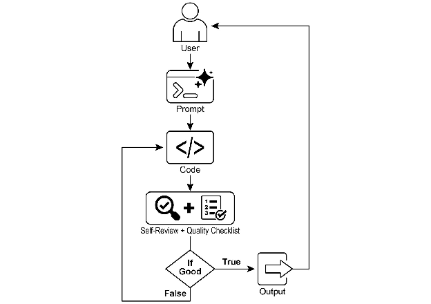
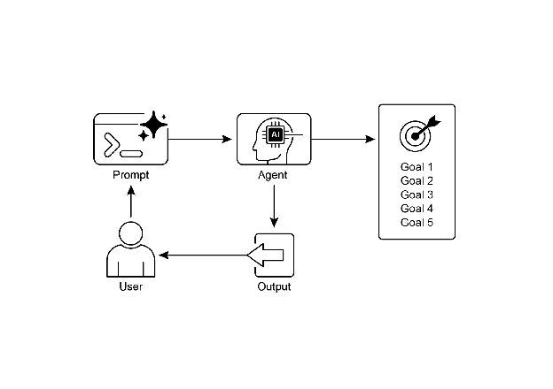

# Chapter 11: Goal Setting and Monitoring

AI Agent가 진정으로 효과적이고 목적 지향적이기 위해서는 단순히 정보를 처리하거나 도구를 사용하는 능력 이상이 필요함. 명확한 방향성과 목표 달성 여부를 판단할 수 있는 방법이 필요함. 바로 이 지점에서 Goal Setting and Monitoring 패턴이 등장함. 이는 Agent에게 달성해야 할 구체적인 목표를 부여하고, 진행 상황을 추적하며 목표 달성 여부를 판단할 수 있는 수단을 제공하는 것임.

# Goal Setting and Monitoring Pattern Overview

여행 계획을 생각해보면 됨. 목적지에 그냥 순간이동하지 않음. 어디로 갈지 결정하고(목표 상태), 어디서 출발하는지 파악하고(초기 상태), 이용 가능한 옵션(교통수단, 경로, 예산)을 고려한 후, 일련의 단계를 계획함: 티켓 예약, 짐 싸기, 공항/역으로 이동, 탑승, 도착, 숙소 찾기 등. 이러한 단계별 프로세스는 의존성과 제약 조건을 고려하며, 이것이 Agentic System에서 Planning의 기본 개념임.

AI Agent의 맥락에서 Planning은 일반적으로 Agent가 상위 레벨 목표를 받아 자율적으로 또는 반자율적으로 일련의 중간 단계나 하위 목표를 생성하는 것을 의미함. 이러한 단계들은 순차적으로 또는 더 복잡한 흐름으로 실행될 수 있으며, Tool Use, Routing 또는 Multi-Agent Collaboration 같은 다른 패턴을 포함할 수 있음. Planning 메커니즘은 정교한 검색 알고리즘, 논리적 추론, 또는 점점 더 많이 사용되는 LLM의 능력을 활용하여 훈련 데이터와 작업 이해를 기반으로 그럴듯하고 효과적인 계획을 생성할 수 있음.

좋은 Planning 능력은 Agent가 단순한 단일 단계 쿼리가 아닌 문제를 해결할 수 있게 함. 다면적인 요청을 처리하고, 재계획을 통해 변화하는 상황에 적응하며, 복잡한 Workflow를 조율할 수 있게 함. 이는 많은 고급 Agentic Behavior를 뒷받침하는 기초 패턴으로, 단순한 반응형 시스템을 정의된 목표를 향해 능동적으로 작업할 수 있는 시스템으로 전환함.

# Practical Applications & Use Cases

Goal Setting and Monitoring 패턴은 복잡한 실제 시나리오에서 자율적이고 안정적으로 작동할 수 있는 Agent를 구축하는 데 필수적임. 실용적인 적용 사례는 다음과 같음:

* **Customer Support Automation:** Agent의 목표는 "고객의 청구 문의 해결"일 수 있음. 대화를 모니터링하고, Database 항목을 확인하며, Tool을 사용하여 청구를 조정함. 성공 여부는 청구 변경 확인과 긍정적인 고객 피드백 수신으로 모니터링됨. 문제가 해결되지 않으면 에스컬레이션함.
* **Personalized Learning Systems:** Learning Agent는 "학생의 대수학 이해도 향상"이라는 목표를 가질 수 있음. 학생의 연습 문제 진행 상황을 모니터링하고, 교재를 조정하며, 정확도와 완료 시간 같은 성과 지표를 추적하여 학생이 어려움을 겪으면 접근 방식을 조정함.
* **Project Management Assistants:** Agent는 "Y일까지 프로젝트 마일스톤 X 완료 보장" 작업을 받을 수 있음. 작업 상태, 팀 커뮤니케이션, 리소스 가용성을 모니터링하고, 목표가 위험에 처하면 지연을 표시하고 수정 조치를 제안함.
* **Automated Trading Bots:** Trading Agent의 목표는 "위험 허용 범위 내에서 포트폴리오 수익 최대화"일 수 있음. 시장 데이터, 현재 포트폴리오 가치, 위험 지표를 지속적으로 모니터링하고, 조건이 목표와 일치하면 거래를 실행하며 위험 임계값이 초과되면 전략을 조정함.
* **Robotics and Autonomous Vehicles:** 자율 주행 차량의 주요 목표는 "A에서 B로 승객을 안전하게 운송"임. 환경(다른 차량, 보행자, 신호등), 자체 상태(속도, 연료), 계획된 경로 상의 진행 상황을 지속적으로 모니터링하고, 목표를 안전하고 효율적으로 달성하기 위해 운전 행동을 조정함.
* **Content Moderation:** Agent의 목표는 "플랫폼 X에서 유해 콘텐츠 식별 및 제거"일 수 있음. 들어오는 콘텐츠를 모니터링하고, 분류 모델을 적용하며, False Positive/Negative 같은 지표를 추적하여 필터링 기준을 조정하거나 모호한 케이스를 Human Reviewer에게 에스컬레이션함.

이 패턴은 안정적으로 작동하고, 특정 결과를 달성하며, 동적 조건에 적응해야 하는 Agent에게 기본적이며, 지능적인 자체 관리를 위한 필수 프레임워크를 제공함.

# Hands-On Code Example

Goal Setting and Monitoring 패턴을 설명하기 위해 LangChain과 OpenAI API를 사용하는 예제를 제공함. 이 Python Script는 Python 코드를 생성하고 개선하도록 설계된 자율 AI Agent를 개요화함. 핵심 기능은 지정된 문제에 대한 솔루션을 생성하고, 사용자 정의 품질 벤치마크를 준수하는 것임.

"Goal-Setting and Monitoring" 패턴을 사용하여 코드를 한 번만 생성하는 것이 아니라, 생성, 자체 평가, 개선의 반복 사이클에 진입함. Agent의 성공은 생성된 코드가 초기 목표를 성공적으로 충족하는지에 대한 자체 AI 기반 판단으로 측정됨. 최종 출력은 이 개선 프로세스의 정점을 나타내는 세련되고 주석이 달린 사용 준비가 된 Python 파일임.

**Dependencies**:

```bash
pip install langchain_openai openai python-dotenv
# .env file with key in OPENAI_API_KEY
```

이 Script를 프로젝트에 할당된 자율 AI Programmer로 상상하면 가장 잘 이해할 수 있음(Fig. 1 참조). 프로세스는 AI에게 상세한 프로젝트 브리프를 제공하는 것으로 시작되며, 이는 AI가 해결해야 할 특정 코딩 문제임.

```python
# MIT License
# Copyright (c) 2025 Mahtab Syed
# https://www.linkedin.com/in/mahtabsyed/

"""
Hands-On Code Example - Iteration 2 -
Goal Setting and Monitoring 패턴을 설명하기 위해 LangChain과 OpenAI API를 사용하는 예제:

목표: 지정된 목표에 따라 특정 Use Case에 대한 코드를 작성할 수 있는 AI Agent 구축:
- 코드 또는 입력으로 코딩 문제(Use Case)를 수락함.
- 코드 또는 입력으로 목표 목록(예: "simple", "tested", "handles edge cases")을 수락함.
- LLM(GPT-4o 같은)을 사용하여 목표가 충족될 때까지 Python 코드를 생성하고 개선함. (최대 5회 반복 사용, 설정된 목표에 따라 달라질 수 있음)
- 목표 달성 여부를 확인하기 위해 LLM에게 판단을 요청하고 True 또는 False로만 답변하게 하여 반복 중지를 쉽게 만듦.
- 깔끔한 파일명과 헤더 주석으로 최종 코드를 .py 파일에 저장함.
"""

import os
import random
import re
from pathlib import Path
from langchain_openai import ChatOpenAI
from dotenv import load_dotenv, find_dotenv

# 🔐 환경 변수 로드
_ = load_dotenv(find_dotenv())
OPENAI_API_KEY = os.getenv("OPENAI_API_KEY")

if not OPENAI_API_KEY:
    raise EnvironmentError("❌ OPENAI_API_KEY 환경 변수를 설정하세요.")

# ✅ OpenAI 모델 초기화
print("📡 OpenAI LLM (gpt-4o) 초기화 중...")
llm = ChatOpenAI(
    model="gpt-4o",  # got-4o 접근 권한이 없으면 다른 OpenAI LLM 사용
    temperature=0.3,
    openai_api_key=OPENAI_API_KEY,
)

# --- Utility Functions ---
def generate_prompt(
    use_case: str, goals: list[str], previous_code: str = "", feedback: str = ""
) -> str:
    print("📝 코드 생성을 위한 Prompt 구성 중...")
    base_prompt = f"""
당신은 AI 코딩 Agent임. 다음 Use Case를 기반으로 Python 코드를 작성하는 것이 작업임:

Use Case: {use_case}

목표:
{chr(10).join(f"- {g.strip()}" for g in goals)}
"""
    if previous_code:
        print("🔄 개선을 위해 이전 코드를 Prompt에 추가 중.")
        base_prompt += f"\n이전에 생성된 코드:\n{previous_code}"
    if feedback:
        print("📋 수정을 위한 피드백 포함 중.")
        base_prompt += f"\n이전 버전에 대한 피드백:\n{feedback}\n"
    base_prompt += "\n수정된 Python 코드만 반환하세요. 코드 외부의 주석이나 설명을 포함하지 마세요."
    return base_prompt


def get_code_feedback(code: str, goals: list[str]) -> str:
    print("🔍 목표 대비 코드 평가 중...")
    feedback_prompt = f"""
당신은 Python 코드 Reviewer임. 아래 코드 스니펫이 표시됨. 다음 목표를 기반으로:

{chr(10).join(f"- {g.strip()}" for g in goals)}

이 코드를 비평하고 목표가 충족되는지 식별하세요. 명확성, 단순성, 정확성, Edge Case 처리 또는 테스트 커버리지에 개선이 필요한지 언급하세요.

코드:
{code}
"""
    return llm.invoke(feedback_prompt)


def goals_met(feedback_text: str, goals: list[str]) -> bool:
    """
    피드백 텍스트를 기반으로 목표가 충족되었는지 평가하기 위해 LLM 사용함.
    True 또는 False 반환 (LLM 출력에서 파싱됨).
    """
    review_prompt = f"""
당신은 AI Reviewer임. 목표는 다음과 같음:

{chr(10).join(f"- {g.strip()}" for g in goals)}

코드에 대한 피드백:
\"\"\"
{feedback_text}
\"\"\"

위 피드백을 기반으로 목표가 충족되었습니까? 한 단어로만 응답: True 또는 False.
"""
    response = llm.invoke(review_prompt).content.strip().lower()
    return response == "true"


def clean_code_block(code: str) -> str:
    lines = code.strip().splitlines()
    if lines and lines[0].strip().startswith("```"):
        lines = lines[1:]
    if lines and lines[-1].strip() == "```":
        lines = lines[:-1]
    return "\n".join(lines).strip()


def add_comment_header(code: str, use_case: str) -> str:
    comment = f"# 이 Python 프로그램은 다음 Use Case를 구현함:\n# {use_case.strip()}\n"
    return comment + "\n" + code


def to_snake_case(text: str) -> str:
    text = re.sub(r"[^a-zA-Z0-9 ]", "", text)
    return re.sub(r"\s+", "_", text.strip().lower())


def save_code_to_file(code: str, use_case: str) -> str:
    print("💾 최종 코드를 파일에 저장 중...")
    summary_prompt = (
        f"다음 Use Case를 Python 파일명에 적합한 10자 이하의 소문자 단어나 구문으로 요약하세요:\n\n{use_case}"
    )
    raw_summary = llm.invoke(summary_prompt).content.strip()
    short_name = re.sub(r"[^a-zA-Z0-9_]", "", raw_summary.replace(" ", "_").lower())[:10]
    random_suffix = str(random.randint(1000, 9999))
    filename = f"{short_name}_{random_suffix}.py"
    filepath = Path.cwd() / filename

    with open(filepath, "w") as f:
        f.write(code)

    print(f"✅ 코드 저장 완료: {filepath}")
    return str(filepath)


# --- Main Agent Function ---
def run_code_agent(use_case: str, goals_input: str, max_iterations: int = 5) -> str:
    goals = [g.strip() for g in goals_input.split(",")]
    print(f"\n🎯 Use Case: {use_case}")
    print("🎯 목표:")
    for g in goals:
        print(f"  - {g}")

    previous_code = ""
    feedback = ""

    for i in range(max_iterations):
        print(f"\n=== 🔁 반복 {i + 1}/{max_iterations} ===")
        prompt = generate_prompt(use_case, goals, previous_code, feedback if isinstance(feedback, str) else feedback.content)

        print("🚧 코드 생성 중...")
        code_response = llm.invoke(prompt)
        raw_code = code_response.content.strip()
        code = clean_code_block(raw_code)

        print("\n🧾 생성된 코드:\n" + "-" * 50 + f"\n{code}\n" + "-" * 50)

        print("\n📤 피드백 검토를 위해 코드 제출 중...")
        feedback = get_code_feedback(code, goals)
        feedback_text = feedback.content.strip()

        print("\n📥 피드백 수신:\n" + "-" * 50 + f"\n{feedback_text}\n" + "-" * 50)

        if goals_met(feedback_text, goals):
            print("✅ LLM이 목표 달성 확인함. 반복 중지.")
            break

        print("🛠️ 목표가 완전히 충족되지 않음. 다음 반복 준비 중...")
        previous_code = code

    final_code = add_comment_header(code, use_case)
    return save_code_to_file(final_code, use_case)


# --- CLI Test Run ---
if __name__ == "__main__":
    print("\n🧠 AI Code Generation Agent에 오신 것을 환영함")

    # Example 1
    use_case_input = "주어진 양의 정수의 BinaryGap을 찾는 코드 작성"
    goals_input = "이해하기 쉬운 코드, 기능적으로 정확함, 포괄적인 Edge Case 처리, 양의 정수 입력만 받음, 몇 가지 예제와 함께 결과 출력"
    run_code_agent(use_case_input, goals_input)

    # Example 2
    # use_case_input = "현재 디렉토리와 모든 중첩된 하위 디렉토리의 파일 수를 세고 총 개수를 출력하는 코드 작성"
    # goals_input = (
    #     "이해하기 쉬운 코드, 기능적으로 정확함, 포괄적인 Edge Case 처리, 성능 권장 사항 무시, unittest나 pytest 같은 테스트 스위트 사용 권장 사항 무시"
    # )
    # run_code_agent(use_case_input, goals_input)

    # Example 3
    # use_case_input = "word doc 또는 docx 파일의 명령줄 입력을 받아 열고 단어 수와 문자 수를 세고 모두 출력하는 코드 작성"
    # goals_input = "이해하기 쉬운 코드, 기능적으로 정확함, Edge Case 처리"
    # run_code_agent(use_case_input, goals_input)
```

이 브리프와 함께 최종 코드가 충족해야 하는 목표를 나타내는 엄격한 품질 체크리스트를 제공함—"솔루션은 간단해야 함", "기능적으로 정확해야 함", "예상치 못한 Edge Case를 처리해야 함" 같은 기준임.



Fig.1: Goal Setting and Monitor 예제

이 할당을 받은 AI Programmer는 작업에 착수하여 코드의 첫 번째 초안을 생성함. 그러나 이 초기 버전을 즉시 제출하는 대신, 중요한 단계를 수행하기 위해 일시 중지함: 엄격한 자체 검토임. 제공된 품질 체크리스트의 모든 항목과 자신의 창작물을 꼼꼼하게 비교하여 자체 품질 보증 검사관 역할을 함. 검사 후, 자신의 진행 상황에 대해 간단하고 편견 없는 판정을 내림: 모든 기준을 충족하면 "True", 부족하면 "False"임.

판정이 "False"이면 AI는 포기하지 않음. 자체 비평에서 얻은 통찰력을 사용하여 약점을 정확히 찾아내고 코드를 지능적으로 다시 작성하는 사려 깊은 수정 단계에 진입함. 초안 작성, 자체 검토, 개선의 이 사이클은 계속되며, 각 반복은 목표에 더 가까워지는 것을 목표로 함. 이 프로세스는 AI가 모든 요구 사항을 만족시켜 "True" 상태를 달성하거나, 마감 시한에 맞춰 작업하는 개발자처럼 사전 정의된 시도 제한에 도달할 때까지 반복됨. 코드가 이 최종 검사를 통과하면, Script는 세련된 솔루션을 패키징하고, 유용한 주석을 추가하며, 사용 준비가 된 깔끔한 새 Python 파일에 저장함.

**Caveats and Considerations:** 이것은 예시적인 설명이며 프로덕션 준비 코드가 아님을 유념해야 함. 실제 애플리케이션의 경우 여러 요소를 고려해야 함. LLM은 목표의 의도된 의미를 완전히 파악하지 못할 수 있으며 성능을 잘못 평가하여 성공적이라고 판단할 수 있음. 목표가 잘 이해되더라도 모델은 Hallucination을 할 수 있음. 동일한 LLM이 코드 작성과 품질 판단을 모두 담당하면 잘못된 방향으로 가고 있음을 발견하기 어려울 수 있음.

궁극적으로 LLM은 마법으로 완벽한 코드를 생성하지 않음. 생성된 코드를 여전히 실행하고 테스트해야 함. 또한 간단한 예제의 "Monitoring"은 기본적이며 프로세스가 영원히 실행될 수 있는 잠재적 위험을 생성함.

```
깨끗하고 정확하며 간단한 코드를 생성하는 데 깊이 전념하는 전문 코드 Reviewer로 행동하세요. 핵심 임무는 모든 제안이 현실과 모범 사례에 근거하도록 하여 코드 "Hallucination"을 제거하는 것임. 코드 스니펫을 제공하면 다음을 원함:
-- 오류 식별 및 수정: 논리적 결함, 버그 또는 잠재적 런타임 오류를 지적함.
-- 단순화 및 리팩터링: 정확성을 희생하지 않고 코드를 더 읽기 쉽고, 효율적이며, 유지 관리 가능하게 만드는 변경 사항을 제안함.
-- 명확한 설명 제공: 제안된 모든 변경 사항에 대해 Clean Code, 성능 또는 보안의 원칙을 참조하여 개선인 이유를 설명함.
-- 수정된 코드 제공: 개선이 명확하도록 제안된 변경 사항의 "Before"와 "After"를 보여줌.
피드백은 직접적이고 건설적이며 항상 코드 품질 향상을 목표로 해야 함.
```

더 강력한 접근 방식은 Agent 크루에 특정 역할을 부여하여 이러한 우려 사항을 분리하는 것임. 예를 들어, Gemini를 사용하여 개인 AI Agent 크루를 구축했으며 각각 특정 역할을 가짐:

* The Peer Programmer: 코드 작성 및 브레인스토밍 지원함.
* The Code Reviewer: 오류를 포착하고 개선 사항을 제안함.
* The Documenter: 명확하고 간결한 문서를 생성함.
* The Test Writer: 포괄적인 Unit Test를 생성함.
* The Prompt Refiner: AI와의 상호 작용을 최적화함.

이 Multi-Agent 시스템에서 Programmer Agent와 별도의 엔티티로 작동하는 Code Reviewer는 예제의 Judge와 유사한 Prompt를 가지며, 이는 객관적인 평가를 크게 개선함. 이 구조는 자연스럽게 더 나은 관행으로 이어지며, Test Writer Agent가 Peer Programmer가 생성한 코드에 대한 Unit Test 작성 필요를 충족할 수 있음.

이러한 보다 정교한 제어를 추가하고 코드를 프로덕션 준비에 더 가깝게 만드는 작업은 관심 있는 독자에게 맡김.

# At a Glance

**What**: AI Agent는 종종 명확한 방향이 없어 단순하고 반응적인 작업을 넘어서 목적을 가지고 행동하는 것을 방해함. 정의된 목표 없이는 복잡한 다단계 문제를 독립적으로 해결하거나 정교한 Workflow를 조율할 수 없음. 또한 자신의 행동이 성공적인 결과로 이어지는지 판단할 수 있는 고유한 메커니즘이 없음. 이는 자율성을 제한하고 단순한 작업 실행만으로는 불충분한 동적 실제 시나리오에서 진정으로 효과적이지 못하게 함.

**Why**: Goal Setting and Monitoring 패턴은 Agentic System에 목적 의식과 자체 평가를 내장하여 표준화된 솔루션을 제공함. Agent가 달성해야 할 명확하고 측정 가능한 목표를 명시적으로 정의하는 것을 포함함. 동시에 이러한 목표에 대해 Agent의 진행 상황과 환경 상태를 지속적으로 추적하는 모니터링 메커니즘을 구축함. 이는 중요한 피드백 루프를 생성하여 Agent가 성능을 평가하고, 경로를 수정하며, 성공으로 가는 길에서 벗어나면 계획을 조정할 수 있게 함. 이 패턴을 구현함으로써 개발자는 단순한 반응형 Agent를 자율적이고 안정적인 작동이 가능한 능동적이고 목표 지향적인 시스템으로 전환할 수 있음.

**Rule of thumb**: AI Agent가 다단계 작업을 자율적으로 실행하고, 동적 조건에 적응하며, 지속적인 인간 개입 없이 특정 상위 레벨 목표를 안정적으로 달성해야 할 때 이 패턴을 사용함.

**Visual summary**:



Fig.2: Goal Design Patterns

# Key takeaways

주요 내용:

* Goal Setting and Monitoring은 Agent에게 목적과 진행 상황 추적 메커니즘을 제공함.
* 목표는 구체적이고, 측정 가능하며, 달성 가능하고, 관련성이 있으며, 기한이 정해져야 함(SMART).
* 효과적인 모니터링을 위해 지표와 성공 기준을 명확하게 정의하는 것이 필수적임.
* 모니터링은 Agent 행동, 환경 상태, Tool 출력을 관찰하는 것을 포함함.
* 모니터링의 피드백 루프는 Agent가 적응하고, 계획을 수정하거나, 문제를 에스컬레이션할 수 있게 함.
* Google의 ADK에서 목표는 종종 Agent Instruction을 통해 전달되며, 모니터링은 State Management와 Tool Interaction을 통해 달성됨.

# Conclusion

이 Chapter는 Goal Setting and Monitoring의 중요한 패러다임에 초점을 맞춤. AI Agent를 단순한 반응형 시스템에서 능동적이고 목표 중심적인 엔티티로 전환하는 방법을 강조함. 텍스트는 명확하고 측정 가능한 목표를 정의하고 진행 상황을 추적하기 위한 엄격한 모니터링 절차를 수립하는 것의 중요성을 강조함. 실용적인 적용 사례는 이 패러다임이 Customer Service와 Robotics를 포함한 다양한 도메인에서 안정적인 자율 운영을 어떻게 지원하는지 보여줌. 개념적 코딩 예제는 Agent 지시와 State Management를 사용하여 Agent의 지정된 목표 달성을 안내하고 평가하는 구조화된 프레임워크 내에서 이러한 원칙의 구현을 설명함. 궁극적으로 목표를 공식화하고 감독할 수 있는 능력을 Agent에게 부여하는 것은 진정으로 지능적이고 책임감 있는 AI 시스템을 구축하기 위한 기본 단계임.

# References

1. SMART Goals Framework. [https://en.wikipedia.org/wiki/SMART_criteria](https://en.wikipedia.org/wiki/SMART_criteria)
