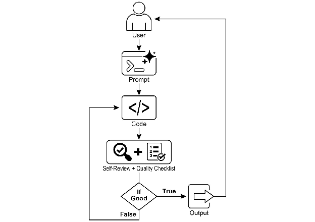

# Chapter 11: Goal Setting and Monitoring

For AI agents to be truly effective and purposeful, they need more than just the ability to process information or use tools; they need a clear sense of direction and a way to know if they're actually succeeding. This is where the Goal Setting and Monitoring pattern comes into play. It's about giving agents specific objectives to work towards and equipping them with the means to track their progress and determine if those objectives have been met.

# Goal Setting and Monitoring Pattern Overview

Think about planning a trip. You don't just spontaneously appear at your destination. You decide where you want to go (the goal state), figure out where you are starting from (the initial state), consider available options (transportation, routes, budget), and then map out a sequence of steps: book tickets, pack bags, travel to the airport/station, board the transport, arrive, find accommodation, etc. This step-by-step process, often considering dependencies and constraints, is fundamentally what we mean by planning in agentic systems.

In the context of AI agents, planning typically involves an agent taking a high-level objective and autonomously, or semi-autonomously, generating a series of intermediate steps or sub-goals. These steps can then be executed sequentially or in a more complex flow, potentially involving other patterns like tool use, routing, or multi-agent collaboration. The planning mechanism might involve sophisticated search algorithms, logical reasoning, or increasingly, leveraging the capabilities of large language models (LLMs) to generate plausible and effective plans based on their training data and understanding of tasks.

A good planning capability allows agents to tackle problems that aren't simple, single-step queries. It enables them to handle multi-faceted requests, adapt to changing circumstances by replanning, and orchestrate complex workflows. It's a foundational pattern that underpins many advanced agentic behaviors, turning a simple reactive system into one that can proactively work towards a defined objective.

# Practical Applications & Use Cases

The Goal Setting and Monitoring pattern is essential for building agents that can operate autonomously and reliably in complex, real-world scenarios. Here are some practical applications:

* **Customer Support Automation:** An agent's goal might be to "resolve customer's billing inquiry." It monitors the conversation, checks database entries, and uses tools to adjust billing. Success is monitored by confirming the billing change and receiving positive customer feedback. If the issue isn't resolved, it escalates.
* **Personalized Learning Systems:** A learning agent might have the goal to "improve students' understanding of algebra." It monitors the student's progress on exercises, adapts teaching materials, and tracks performance metrics like accuracy and completion time, adjusting its approach if the student struggles.
* **Project Management Assistants:** An agent could be tasked with "ensuring project milestone X is completed by Y date." It monitors task statuses, team communications, and resource availability, flagging delays and suggesting corrective actions if the goal is at risk.
* **Automated Trading Bots:** A trading agent's goal might be to "maximize portfolio gains while staying within risk tolerance." It continuously monitors market data, its current portfolio value, and risk indicators, executing trades when conditions align with its goals and adjusting strategy if risk thresholds are breached.
* **Robotics and Autonomous Vehicles:** An autonomous vehicle's primary goal is "safely transport passengers from A to B." It constantly monitors its environment (other vehicles, pedestrians, traffic signals), its own state (speed, fuel), and its progress along the planned route, adapting its driving behavior to achieve the goal safely and efficiently.
* **Content Moderation:** An agent's goal could be to "identify and remove harmful content from platform X." It monitors incoming content, applies classification models, and tracks metrics like false positives/negatives, adjusting its filtering criteria or escalating ambiguous cases to human reviewers.

This pattern is fundamental for agents that need to operate reliably, achieve specific outcomes, and adapt to dynamic conditions, providing the necessary framework for intelligent self-management.

# Hands-On Code Example

To illustrate the Goal Setting and Monitoring pattern, we have an example using LangChain and OpenAI APIs. This Python script outlines an autonomous AI agent engineered to generate and refine Python code. Its core function is to produce solutions for specified problems, ensuring adherence to user-defined quality benchmarks.

It employs a "goal-setting and monitoring" pattern where it doesn't just generate code once, but enters into an iterative cycle of creation, self-evaluation, and improvement. The agent's success is measured by its own AI-driven judgment on whether the generated code successfully meets the initial objectives. The ultimate output is a polished, commented, and ready-to-use Python file that represents the culmination of this refinement process.

 **Dependencies**:

```bash
pip install langchain_openai openai python-dotenv
# .env file with key in OPENAI_API_KEY
```

You can best understand this script by imagining it as an autonomous AI programmer assigned to a project (see Fig. 1). The process begins when you hand the AI a detailed project brief, which is the specific coding problem it needs to solve.

```python
# MIT License
# Copyright (c) 2025 Mahtab Syed
# https://www.linkedin.com/in/mahtabsyed/

"""
Hands-On Code Example - Iteration 2 -
To illustrate the Goal Setting and Monitoring pattern, we have an example using LangChain and OpenAI APIs:

Objective: Build an AI Agent which can write code for a specified use case based on specified goals:
- Accepts a coding problem (use case) in code or can be as input.
- Accepts a list of goals (e.g., "simple", "tested", "handles edge cases")  in code or can be input.
- Uses an LLM (like GPT-4o) to generate and refine Python code until the goals are met. (I am using max 5 iterations, this could be based on a set goal as well)
- To check if we have met our goals I am asking the LLM to judge this and answer just True or False which makes it easier to stop the iterations.
- Saves the final code in a .py file with a clean filename and a header comment.
"""

import os
import random
import re
from pathlib import Path
from langchain_openai import ChatOpenAI
from dotenv import load_dotenv, find_dotenv

# 🔐 Load environment variables
_ = load_dotenv(find_dotenv())
OPENAI_API_KEY = os.getenv("OPENAI_API_KEY")

if not OPENAI_API_KEY:
    raise EnvironmentError("❌ Please set the OPENAI_API_KEY environment variable.")

# ✅ Initialize OpenAI model
print("📡 Initializing OpenAI LLM (gpt-4o)...")
llm = ChatOpenAI(
    model="gpt-4o",  # If you dont have access to got-4o use other OpenAI LLMs
    temperature=0.3,
    openai_api_key=OPENAI_API_KEY,
)

# --- Utility Functions ---
def generate_prompt(
    use_case: str, goals: list[str], previous_code: str = "", feedback: str = ""
) -> str:
    print("📝 Constructing prompt for code generation...")
    base_prompt = f"""
You are an AI coding agent. Your job is to write Python code based on the following use case:

Use Case: {use_case}

Your goals are:
{chr(10).join(f"- {g.strip()}" for g in goals)}
"""
    if previous_code:
        print("🔄 Adding previous code to the prompt for refinement.")
        base_prompt += f"\nPreviously generated code:\n{previous_code}"
    if feedback:
        print("📋 Including feedback for revision.")
        base_prompt += f"\nFeedback on previous version:\n{feedback}\n"
    base_prompt += "\nPlease return only the revised Python code. Do not include comments or explanations outside the code."
    return base_prompt


def get_code_feedback(code: str, goals: list[str]) -> str:
    print("🔍 Evaluating code against the goals...")
    feedback_prompt = f"""
You are a Python code reviewer. A code snippet is shown below. Based on the following goals:

{chr(10).join(f"- {g.strip()}" for g in goals)}

Please critique this code and identify if the goals are met. Mention if improvements are needed for clarity, simplicity, correctness, edge case handling, or test coverage.

Code:
{code}
"""
    return llm.invoke(feedback_prompt)


def goals_met(feedback_text: str, goals: list[str]) -> bool:
    """
    Uses the LLM to evaluate whether the goals have been met based on the feedback text.
    Returns True or False (parsed from LLM output).
    """
    review_prompt = f"""
You are an AI reviewer. Here are the goals:

{chr(10).join(f"- {g.strip()}" for g in goals)}

Here is the feedback on the code:
\"\"\"
{feedback_text}
\"\"\"

Based on the feedback above, have the goals been met? Respond with only one word: True or False.
"""
    response = llm.invoke(review_prompt).content.strip().lower()
    return response == "true"


def clean_code_block(code: str) -> str:
    lines = code.strip().splitlines()
    if lines and lines[0].strip().startswith("```"):
        lines = lines[1:]
    if lines and lines[-1].strip() == "```":
        lines = lines[:-1]
    return "\n".join(lines).strip()


def add_comment_header(code: str, use_case: str) -> str:
    comment = f"# This Python program implements the following use case:\n# {use_case.strip()}\n"
    return comment + "\n" + code


def to_snake_case(text: str) -> str:
    text = re.sub(r"[^a-zA-Z0-9 ]", "", text)
    return re.sub(r"\s+", "_", text.strip().lower())


def save_code_to_file(code: str, use_case: str) -> str:
    print("💾 Saving final code to file...")
    summary_prompt = (
        f"Summarize the following use case into a single lowercase word or phrase, "
        f"no more than 10 characters, suitable for a Python filename:\n\n{use_case}"
    )
    raw_summary = llm.invoke(summary_prompt).content.strip()
    short_name = re.sub(r"[^a-zA-Z0-9_]", "", raw_summary.replace(" ", "_").lower())[:10]
    random_suffix = str(random.randint(1000, 9999))
    filename = f"{short_name}_{random_suffix}.py"
    filepath = Path.cwd() / filename

    with open(filepath, "w") as f:
        f.write(code)

    print(f"✅ Code saved to: {filepath}")
    return str(filepath)


# --- Main Agent Function ---
def run_code_agent(use_case: str, goals_input: str, max_iterations: int = 5) -> str:
    goals = [g.strip() for g in goals_input.split(",")]
    print(f"\n🎯 Use Case: {use_case}")
    print("🎯 Goals:")
    for g in goals:
        print(f"  - {g}")

    previous_code = ""
    feedback = ""

    for i in range(max_iterations):
        print(f"\n=== 🔁 Iteration {i + 1} of {max_iterations} ===")
        prompt = generate_prompt(use_case, goals, previous_code, feedback if isinstance(feedback, str) else feedback.content)

        print("🚧 Generating code...")
        code_response = llm.invoke(prompt)
        raw_code = code_response.content.strip()
        code = clean_code_block(raw_code)

        print("\n🧾 Generated Code:\n" + "-" * 50 + f"\n{code}\n" + "-" * 50)

        print("\n📤 Submitting code for feedback review...")
        feedback = get_code_feedback(code, goals)
        feedback_text = feedback.content.strip()

        print("\n📥 Feedback Received:\n" + "-" * 50 + f"\n{feedback_text}\n" + "-" * 50)

        if goals_met(feedback_text, goals):
            print("✅ LLM confirms goals are met. Stopping iteration.")
            break

        print("🛠️ Goals not fully met. Preparing for next iteration...")
        previous_code = code

    final_code = add_comment_header(code, use_case)
    return save_code_to_file(final_code, use_case)


# --- CLI Test Run ---
if __name__ == "__main__":
    print("\n🧠 Welcome to the AI Code Generation Agent")

    # Example 1
    use_case_input = "Write code to find BinaryGap of a given positive integer"
    goals_input = "Code simple to understand, Functionally correct, Handles comprehensive edge cases, Takes positive integer input only, prints the results with few examples"
    run_code_agent(use_case_input, goals_input)

    # Example 2
    # use_case_input = "Write code to count the number of files in current directory and all its nested sub directories, and print the total count"
    # goals_input = (
    #     "Code simple to understand, Functionally correct, Handles comprehensive edge cases, Ignore recommendations for performance, Ignore recommendations for test suite use like unittest or pytest"
    # )
    # run_code_agent(use_case_input, goals_input)

    # Example 3
    # use_case_input = "Write code which takes a command line input of a word doc or docx file and opens it and counts the number of words, and characters in it and prints all"
    # goals_input = "Code simple to understand, Functionally correct, Handles edge cases"
    # run_code_agent(use_case_input, goals_input)
```

Along with this brief, you provide a strict quality checklist, which represents the objectives the final code must meet—criteria like "the solution must be simple," "it must be functionally correct," or "it needs to handle unexpected edge cases."



Fig.1: Goal Setting and Monitor example

With this assignment in hand, the AI programmer gets to work and produces its first draft of the code. However, instead of immediately submitting this initial version, it pauses to perform a crucial step: a rigorous self-review. It meticulously compares its own creation against every item on the quality checklist you provided, acting as its own quality assurance inspector. After this inspection, it renders a simple, unbiased verdict on its own progress: "True" if the work meets all standards, or "False" if it falls short.

If the verdict is "False," the AI doesn't give up. It enters a thoughtful revision phase, using the insights from its self-critique to pinpoint the weaknesses and intelligently rewrite the code. This cycle of drafting, self-reviewing, and refining continues, with each iteration aiming to get closer to the goals. This process repeats until the AI finally achieves a "True" status by satisfying every requirement, or until it reaches a predefined limit of attempts, much like a developer working against a deadline. Once the code passes this final inspection, the script packages the polished solution, adding helpful comments and saving it to a clean, new Python file, ready for use.

**Caveats and Considerations:** It is important to note that this is an exemplary illustration and not production-ready code. For real-world applications, several factors must be taken into account. An LLM may not fully grasp the intended meaning of a goal and might incorrectly assess its performance as successful. Even if the goal is well understood, the model may hallucinate. When the same LLM is responsible for both writing the code and judging its quality, it may have a harder time discovering it is going in the wrong direction.

Ultimately, LLMs do not produce flawless code by magic; you still need to run and test the produced code. Furthermore, the "monitoring" in the simple example is basic and creates a potential risk of the process running forever.

```
Act as an expert code reviewer with a deep commitment to producing clean, correct, and simple code. Your core mission is to eliminate code "hallucinations" by ensuring every suggestion is grounded in reality and best practices. When I provide you with a code snippet, I want you to:
-- Identify and Correct Errors: Point out any logical flaws, bugs, or potential runtime errors.
-- Simplify and Refactor: Suggest changes that make the code more readable, efficient, and maintainable without sacrificing correctness.
-- Provide Clear Explanations: For every suggested change, explain why it is an improvement, referencing principles of clean code, performance, or security.
-- Offer Corrected Code: Show the "before" and "after" of your suggested changes so the improvement is clear.
Your feedback should be direct, constructive, and always aimed at improving the quality of the code.
```

A more robust approach involves separating these concerns by giving specific roles to a crew of agents. For instance, I have built a personal crew of AI agents using Gemini where each has a specific role:

* The Peer Programmer: Helps write and brainstorm code.
* The Code Reviewer: Catches errors and suggests improvements.
* The Documenter: Generates clear and concise documentation.
* The Test Writer: Creates comprehensive unit tests.
* The Prompt Refiner: Optimizes interactions with the AI.

In this multi-agent system, the Code Reviewer, acting as a separate entity from the programmer agent, has a prompt similar to the judge in the example, which significantly improves objective evaluation. This structure naturally leads to better practices, as the Test Writer agent can fulfill the need to write unit tests for the code produced by the Peer Programmer.

I leave to the interested reader the task of adding these more sophisticated controls and making the code closer to production-ready.

# At a Glance

**What**: AI agents often lack a clear direction, preventing them from acting with purpose beyond simple, reactive tasks. Without defined objectives, they cannot independently tackle complex, multi-step problems or orchestrate sophisticated workflows. Furthermore, there is no inherent mechanism for them to determine if their actions are leading to a successful outcome. This limits their autonomy and prevents them from being truly effective in dynamic, real-world scenarios where mere task execution is insufficient.

**Why**: The Goal Setting and Monitoring pattern provides a standardized solution by embedding a sense of purpose and self-assessment into agentic systems. It involves explicitly defining clear, measurable objectives for the agent to achieve. Concurrently, it establishes a monitoring mechanism that continuously tracks the agent's progress and the state of its environment against these goals. This creates a crucial feedback loop, enabling the agent to assess its performance, correct its course, and adapt its plan if it deviates from the path to success. By implementing this pattern, developers can transform simple reactive agents into proactive, goal-oriented systems capable of autonomous and reliable operation.

**Rule of thumb**: Use this pattern when an AI agent must autonomously execute a multi-step task, adapt to dynamic conditions, and reliably achieve a specific, high-level objective without constant human intervention.

**Visual summary**:


Fig.2: Goal design patterns

# Key takeaways

Key takeaways include:

* Goal Setting and Monitoring equips agents with purpose and mechanisms to track progress.
* Goals should be specific, measurable, achievable, relevant, and time-bound (SMART).
* Clearly defining metrics and success criteria is essential for effective monitoring.
* Monitoring involves observing agent actions, environmental states, and tool outputs.
* Feedback loops from monitoring allow agents to adapt, revise plans, or escalate issues.
* In Google's ADK, goals are often conveyed through agent instructions, with monitoring accomplished through state management and tool interactions.

# Conclusion

This chapter focused on the crucial paradigm of Goal Setting and Monitoring. I highlighted how this concept transforms AI agents from merely reactive systems into proactive, goal-driven entities. The text emphasized the importance of defining clear, measurable objectives and establishing rigorous monitoring procedures to track progress. Practical applications demonstrated how this paradigm supports reliable autonomous operation across various domains, including customer service and robotics. A conceptual coding example illustrates the implementation of these principles within a structured framework, using agent directives and state management to guide and evaluate an agent's achievement of its specified goals. Ultimately, equipping agents with the ability to formulate and oversee goals is a fundamental step toward building truly intelligent and accountable AI systems.

# References

1. SMART Goals Framework. [https://en.wikipedia.org/wiki/SMART_criteria](https://en.wikipedia.org/wiki/SMART_criteria)
