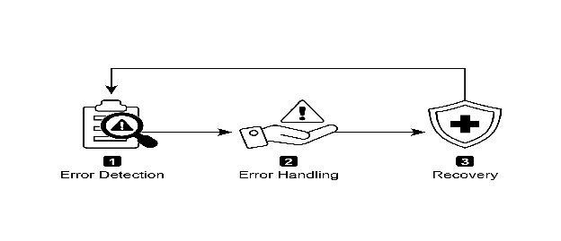
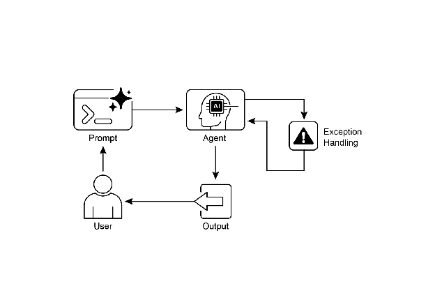

# Chapter 12: Exception Handling and Recovery

AI agent가 다양한 실제 환경에서 안정적으로 작동하려면 예상치 못한 상황, 오류, 오작동을 관리할 수 있어야 함. 인간이 예기치 않은 장애물에 적응하듯이, 지능형 agent는 문제를 감지하고 복구 절차를 시작하거나 최소한 제어된 실패를 보장하는 강력한 시스템이 필요함. 이러한 필수 요구사항이 Exception Handling and Recovery 패턴의 기초를 형성함.

이 패턴은 다양한 어려움과 이상 현상에도 불구하고 중단 없는 기능과 운영 무결성을 유지할 수 있는 매우 내구성 있고 탄력적인 agent 개발에 중점을 둠. 도전에 직면했을 때도 지속적인 운영을 보장하기 위해 사전 준비와 대응 전략의 중요성을 강조함. 이러한 적응성은 agent가 복잡하고 예측 불가능한 환경에서 성공적으로 작동하는 데 중요하며, 궁극적으로 전반적인 효과와 신뢰성을 향상시킴.

예상치 못한 이벤트를 처리하는 능력은 이러한 AI 시스템이 지능적일 뿐만 아니라 안정적이고 신뢰할 수 있도록 보장하여 배포 및 성능에 대한 신뢰를 높임. 포괄적인 모니터링 및 진단 도구를 통합하면 agent가 문제를 신속하게 식별하고 해결하는 능력이 더욱 강화되어 잠재적인 중단을 방지하고 진화하는 조건에서 더 원활한 운영을 보장함. 이러한 고급 시스템은 AI 운영의 무결성과 효율성을 유지하고 복잡성과 예측 불가능성을 관리하는 능력을 강화하는 데 중요함.

이 패턴은 때때로 reflection과 함께 사용될 수 있음. 예를 들어, 초기 시도가 실패하고 exception을 발생시키면 reflective 프로세스가 실패를 분석하고 오류를 해결하기 위해 개선된 prompt와 같은 개선된 접근 방식으로 작업을 재시도할 수 있음.

# Exception Handling and Recovery Pattern Overview

Exception Handling and Recovery 패턴은 AI agent가 운영 장애를 관리해야 하는 필요성을 다룸. 이 패턴은 tool 오류나 서비스 불가 등 잠재적인 문제를 예상하고 이를 완화하는 전략을 개발하는 것을 포함함. 이러한 전략에는 오류 로깅, 재시도, fallback, graceful degradation, 알림이 포함될 수 있음. 또한 이 패턴은 state rollback, 진단, self-correction, escalation과 같은 복구 메커니즘을 강조하여 agent를 안정적인 작동으로 복원함. 이 패턴을 구현하면 AI agent의 안정성과 견고성이 향상되어 예측 불가능한 환경에서 작동할 수 있음. 실제 적용 사례로는 database 오류를 관리하는 chatbot, 금융 오류를 처리하는 trading bot, 장치 오작동을 해결하는 스마트 홈 agent가 있음. 이 패턴은 agent가 복잡성과 장애에 직면하더라도 효과적으로 계속 작동할 수 있도록 보장함.



Fig.1: Key components of exception handling and recovery for AI agents

**Error Detection:** 발생하는 운영 문제를 세심하게 식별하는 것을 포함함. 이는 잘못되거나 형식이 잘못된 tool 출력, 404(Not Found) 또는 500(Internal Server Error) 코드와 같은 특정 API 오류, 서비스나 API의 비정상적으로 긴 응답 시간, 예상 형식에서 벗어나는 일관성 없고 무의미한 응답으로 나타날 수 있음. 또한 다른 agent나 전문 모니터링 시스템에 의한 모니터링을 구현하여 보다 적극적인 이상 감지를 수행하고 시스템이 문제가 확대되기 전에 잠재적인 문제를 포착할 수 있도록 함.

**Error Handling**: 오류가 감지되면 신중하게 계획된 대응 계획이 필수적임. 여기에는 나중에 디버깅 및 분석을 위해 오류 세부 정보를 log에 세심하게 기록하는 것이 포함됨(logging). 특히 일시적인 오류의 경우 때로는 약간 조정된 매개변수로 작업이나 요청을 재시도하는 것이 실행 가능한 전략일 수 있음(retries). 대체 전략이나 방법을 활용하면(fallbacks) 일부 기능이 유지되도록 할 수 있음. 완전한 복구가 즉시 불가능한 경우 agent는 부분적인 기능을 유지하여 최소한의 가치를 제공할 수 있음(graceful degradation). 마지막으로 인간 운영자나 다른 agent에게 경고하는 것은 인간의 개입이나 협력이 필요한 상황에서 중요할 수 있음(notification).

**Recovery:** 이 단계는 오류 후 agent나 시스템을 안정적이고 운영 가능한 상태로 복원하는 것임. 오류의 영향을 취소하기 위해 최근 변경 사항이나 transaction을 되돌리는 것을 포함할 수 있음(state rollback). 재발을 방지하기 위해 오류 원인에 대한 철저한 조사가 필수적임. 향후 동일한 오류를 피하기 위해 self-correction 메커니즘이나 재계획 프로세스를 통해 agent의 계획, 로직 또는 매개변수를 조정해야 할 수 있음. 복잡하거나 심각한 경우 인간 운영자나 상위 시스템에 문제를 위임하는 것(escalation)이 최선의 조치일 수 있음.

이 강력한 exception handling and recovery 패턴을 구현하면 AI agent를 취약하고 신뢰할 수 없는 시스템에서 도전적이고 매우 예측 불가능한 환경에서 효과적이고 탄력적으로 작동할 수 있는 강력하고 신뢰할 수 있는 구성 요소로 변환할 수 있음. 이를 통해 agent가 기능을 유지하고 가동 중단 시간을 최소화하며 예상치 못한 문제에 직면했을 때도 원활하고 신뢰할 수 있는 경험을 제공할 수 있음.

# Practical Applications & Use Cases

Exception Handling and Recovery는 완벽한 조건을 보장할 수 없는 실제 시나리오에 배포된 모든 agent에 중요함.

* **Customer Service Chatbots:** chatbot이 고객 database에 액세스하려고 하는데 database가 일시적으로 다운된 경우 충돌해서는 안 됨. 대신 API 오류를 감지하고 사용자에게 일시적인 문제에 대해 알리고 나중에 다시 시도하도록 제안하거나 인간 agent에게 쿼리를 escalate해야 함.
* **Automated Financial Trading:** 거래를 실행하려는 trading bot은 "insufficient funds" 오류나 "market closed" 오류를 만날 수 있음. 오류를 로깅하고 동일한 잘못된 거래를 반복적으로 시도하지 않으며 사용자에게 알리거나 전략을 조정하여 이러한 exception을 처리해야 함.
* **Smart Home Automation:** 스마트 조명을 제어하는 agent는 network 문제나 장치 오작동으로 인해 조명을 켜지 못할 수 있음. 이 실패를 감지하고 재시도해야 하며, 여전히 실패하면 조명을 켤 수 없다고 사용자에게 알리고 수동 개입을 제안해야 함.
* **Data Processing Agents:** 일괄 문서 처리 작업을 수행하는 agent는 손상된 파일을 만날 수 있음. 손상된 파일을 건너뛰고 오류를 로깅하며 다른 파일을 계속 처리하고 전체 프로세스를 중단하는 대신 건너뛴 파일을 끝에 보고해야 함.
* **Web Scraping Agents:** web scraping agent가 CAPTCHA, 변경된 웹사이트 구조 또는 서버 오류(예: 404 Not Found, 503 Service Unavailable)를 만나면 이를 gracefully하게 처리해야 함. 일시 중지, proxy 사용 또는 실패한 특정 URL 보고를 포함할 수 있음.
* **Robotics and Manufacturing:** 조립 작업을 수행하는 로봇 팔은 정렬 불량으로 인해 구성 요소를 집지 못할 수 있음. 이 실패를 감지하고(예: 센서 피드백을 통해) 재조정을 시도하고 픽업을 재시도하며, 지속되면 인간 운영자에게 경고하거나 다른 구성 요소로 전환해야 함.

요약하면 이 패턴은 실제 복잡성에 직면했을 때 지능적일 뿐만 아니라 신뢰할 수 있고 탄력적이며 사용자 친화적인 agent를 구축하는 데 필수적임.

# Hands-On Code Example (ADK)

Exception handling and recovery는 시스템 견고성과 안정성에 필수적임. 예를 들어 실패한 tool 호출에 대한 agent의 응답을 고려함. 이러한 실패는 잘못된 tool 입력이나 tool이 의존하는 외부 서비스의 문제로 발생할 수 있음.

```python
from google.adk.agents import Agent, SequentialAgent

# Agent 1: Tries the primary tool. Its focus is narrow and clear.
primary_handler = Agent(
    name="primary_handler",
    model="gemini-2.0-flash-exp",
    instruction="""
Your job is to get precise location information.
Use the get_precise_location_info tool with the user's provided address.
    """,
    tools=[get_precise_location_info]
)

# Agent 2: Acts as the fallback handler, checking state to decide its action.
fallback_handler = Agent(
    name="fallback_handler",
    model="gemini-2.0-flash-exp",
    instruction="""
Check if the primary location lookup failed by looking at state["primary_location_failed"].
- If it is True, extract the city from the user's original query and use the get_general_area_info tool.
- If it is False, do nothing.
    """,
    tools=[get_general_area_info]
)

# Agent 3: Presents the final result from the state.
response_agent = Agent(
    name="response_agent",
    model="gemini-2.0-flash-exp",
    instruction="""
Review the location information stored in state["location_result"].
Present this information clearly and concisely to the user.
If state["location_result"] does not exist or is empty, apologize that you could not retrieve the location.
    """,
    tools=[] # This agent only reasons over the final state.
)

# The SequentialAgent ensures the handlers run in a guaranteed order.
robust_location_agent = SequentialAgent(
    name="robust_location_agent",
    sub_agents=[primary_handler, fallback_handler, response_agent]
)
```

이 코드는 세 개의 sub-agent를 사용하는 ADK의 SequentialAgent를 사용하여 강력한 위치 검색 시스템을 정의함. primary\_handler는 첫 번째 agent로 get\_precise\_location\_info tool을 사용하여 정확한 위치 정보를 가져오려고 시도함. fallback\_handler는 backup 역할을 하며 state 변수를 검사하여 primary lookup이 실패했는지 확인함. primary lookup이 실패하면 fallback agent는 사용자 쿼리에서 도시를 추출하고 get\_general\_area\_info tool을 사용함. response\_agent는 sequence의 최종 agent임. state에 저장된 위치 정보를 검토함. 이 agent는 사용자에게 최종 결과를 제시하도록 설계됨. 위치 정보를 찾지 못한 경우 사과함. SequentialAgent는 이 세 agent가 사전 정의된 순서로 실행되도록 보장함. 이 구조는 위치 정보 검색에 대한 계층화된 접근 방식을 허용함.

# At a Glance

**What:** 실제 환경에서 작동하는 AI agent는 예상치 못한 상황, 오류 및 시스템 오작동을 필연적으로 만남. 이러한 중단은 tool 장애 및 network 문제에서 잘못된 데이터에 이르기까지 다양하며 agent가 작업을 완료하는 능력을 위협함. 이러한 문제를 관리하는 구조화된 방법이 없으면 agent는 예상치 못한 장애물에 직면했을 때 취약하고 신뢰할 수 없으며 완전한 실패가 발생하기 쉬움. 이러한 신뢰성 부족으로 인해 일관된 성능이 필수적인 중요하거나 복잡한 애플리케이션에 배포하기 어려움.

**Why**: Exception Handling and Recovery 패턴은 강력하고 탄력적인 AI agent를 구축하기 위한 표준화된 솔루션을 제공함. 운영 장애를 예측, 관리 및 복구할 수 있는 agentic 기능을 갖추게 함. 이 패턴은 tool 출력 및 API 응답 모니터링과 같은 사전 오류 감지와 진단을 위한 로깅, 일시적 실패 재시도 또는 fallback 메커니즘 사용과 같은 대응 처리 전략을 포함함. 더 심각한 문제의 경우 안정적인 상태로 되돌리기, 계획을 조정하여 self-correction하기 또는 인간 운영자에게 문제를 escalate하는 것을 포함하는 복구 프로토콜을 정의함. 이러한 체계적인 접근 방식은 agent가 운영 무결성을 유지하고 실패로부터 학습하며 예측 불가능한 환경에서 안정적으로 작동할 수 있도록 보장함.

**Rule of thumb:** 시스템 장애, tool 오류, network 문제 또는 예측할 수 없는 입력이 가능하고 운영 안정성이 핵심 요구 사항인 동적인 실제 환경에 배포된 모든 AI agent에 이 패턴을 사용함.

**Visual summary**



Fig.2: Exception handling pattern

# Key Takeaways

기억해야 할 핵심 사항:

* Exception Handling and Recovery는 강력하고 신뢰할 수 있는 Agent를 구축하는 데 필수적임.
* 이 패턴은 오류를 감지하고 gracefully하게 처리하며 복구 전략을 구현하는 것을 포함함.
* 오류 감지는 tool 출력 검증, API 오류 코드 확인 및 timeout 사용을 포함할 수 있음.
* 처리 전략에는 로깅, 재시도, fallback, graceful degradation 및 알림이 포함됨.
* Recovery는 진단, self-correction 또는 escalation을 통해 안정적인 작동을 복원하는 데 중점을 둠.
* 이 패턴은 agent가 예측 불가능한 실제 환경에서도 효과적으로 작동할 수 있도록 보장함.

# Conclusion

이 챕터는 강력하고 신뢰할 수 있는 AI agent를 개발하는 데 필수적인 Exception Handling and Recovery 패턴을 탐구함. 이 패턴은 AI agent가 예상치 못한 문제를 식별하고 관리하고 적절한 응답을 구현하며 안정적인 운영 상태로 복구하는 방법을 다룸. 챕터는 오류 감지, 로깅, 재시도 및 fallback과 같은 메커니즘을 통한 오류 처리, agent나 시스템을 적절한 기능으로 복원하는 데 사용되는 전략을 포함하여 이 패턴의 다양한 측면을 논의함. Exception Handling and Recovery 패턴의 실제 적용은 실제 복잡성과 잠재적 장애를 처리하는 데 있어 관련성을 보여주기 위해 여러 도메인에 걸쳐 설명됨. 이러한 적용은 AI agent에 exception handling 기능을 장착하는 것이 동적 환경에서의 안정성과 적응성에 어떻게 기여하는지 보여줌.

# References

1. McConnell, S. (2004). *Code Complete (2nd ed.)*. Microsoft Press.
2. Shi, Y., Pei, H., Feng, L., Zhang, Y., & Yao, D. (2024). *Towards Fault Tolerance in Multi-Agent Reinforcement Learning*. arXiv preprint arXiv:2412.00534.
3. O'Neill, V. (2022). *Improving Fault Tolerance and Reliability of Heterogeneous Multi-Agent IoT Systems Using Intelligence Transfer*. Electronics, 11(17), 2724.
