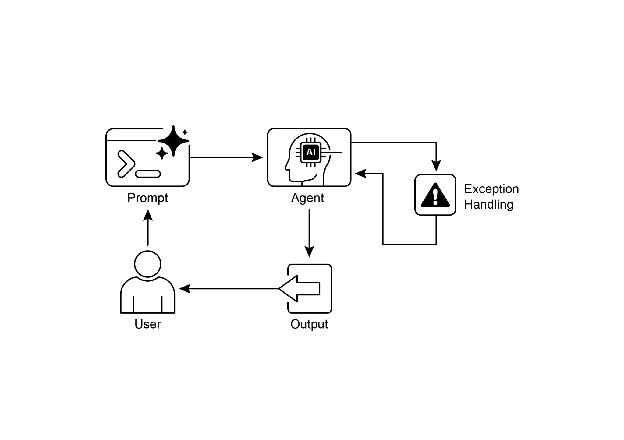

# Chapter 12: Exception Handling and Recovery

For AI agents to operate reliably in diverse real-world environments, they must be able to manage unforeseen situations, errors, and malfunctions. Just as humans adapt to unexpected obstacles, intelligent agents need robust systems to detect problems, initiate recovery procedures, or at least ensure controlled failure. This essential requirement forms the basis of the Exception Handling and Recovery pattern.

This pattern focuses on developing exceptionally durable and resilient agents that can maintain uninterrupted functionality and operational integrity despite various difficulties and anomalies. It emphasizes the importance of both proactive preparation and reactive strategies to ensure continuous operation, even when facing challenges. This adaptability is critical for agents to function successfully in complex and unpredictable settings, ultimately boosting their overall effectiveness and trustworthiness.

The capacity to handle unexpected events ensures these AI systems are not only intelligent but also stable and reliable, which fosters greater confidence in their deployment and performance. Integrating comprehensive monitoring and diagnostic tools further strengthens an agent's ability to quickly identify and address issues, preventing potential disruptions and ensuring smoother operation in evolving conditions. These advanced systems are crucial for maintaining the integrity and efficiency of AI operations, reinforcing their ability to manage complexity and unpredictability.

This pattern may sometimes be used with reflection. For example, if an initial attempt fails and raises an exception, a reflective process can analyze the failure and reattempt the task with a refined approach, such as an improved prompt, to resolve the error.

# Exception Handling and Recovery Pattern Overview

The Exception Handling and Recovery pattern addresses the need for AI agents to manage operational failures. This pattern involves anticipating potential issues, such as tool errors or service unavailability, and developing strategies to mitigate them. These strategies may include error logging, retries, fallbacks, graceful degradation, and notifications. Additionally, the pattern emphasizes recovery mechanisms like state rollback, diagnosis, self-correction, and escalation, to restore agents to stable operation. Implementing this pattern enhances the reliability and robustness of AI agents, allowing them to function in unpredictable environments. Examples of practical applications include chatbots managing database errors, trading bots handling financial errors, and smart home agents addressing device malfunctions. The pattern ensures that agents can continue to operate effectively despite encountering complexities and failures.


Fig.1: Key components of exception handling and recovery for AI agents

**Error Detection:** This involves meticulously identifying operational issues as they arise. This could manifest as invalid or malformed tool outputs, specific API errors such as 404 (Not Found) or 500 (Internal Server Error) codes, unusually long response times from services or APIs, or incoherent and nonsensical responses that deviate from expected formats. Additionally, monitoring by other agents or specialized monitoring systems might be implemented for more proactive anomaly detection, enabling the system to catch potential issues before they escalate.

**Error Handling**: Once an error is detected, a carefully thought-out response plan is essential. This includes recording error details meticulously in logs for later debugging and analysis (logging). Retrying the action or request, sometimes with slightly adjusted parameters, may be a viable strategy, especially for transient errors (retries). Utilizing alternative strategies or methods (fallbacks) can ensure that some functionality is maintained. Where complete recovery is not immediately possible, the agent can maintain partial functionality to provide at least some value (graceful degradation). Finally, alerting human operators or other agents might be crucial for situations that require human intervention or collaboration (notification).

**Recovery:** This stage is about restoring the agent or system to a stable and operational state after an error. It could involve reversing recent changes or transactions to undo the effects of the error (state rollback). A thorough investigation into the cause of the error is vital for preventing recurrence. Adjusting the agent's plan, logic, or parameters through a self-correction mechanism or replanning process may be needed to avoid the same error in the future. In complex or severe cases, delegating the issue to a human operator or a higher-level system (escalation) might be the best course of action.

Implementation of this robust exception handling and recovery pattern can transform AI agents from fragile and unreliable systems into robust, dependable components capable of operating effectively and resiliently in challenging and highly unpredictable environments. This ensures that the agents maintain functionality, minimize downtime, and provide a seamless and reliable experience even when faced with unexpected issues.

# Practical Applications & Use Cases

Exception Handling and Recovery is critical for any agent deployed in a real-world scenario where perfect conditions cannot be guaranteed.

* **Customer Service Chatbots:** If a chatbot tries to access a customer database and the database is temporarily down, it shouldn't crash. Instead, it should detect the API error, inform the user about the temporary issue, perhaps suggest trying again later, or escalate the query to a human agent.
* **Automated Financial Trading:** A trading bot attempting to execute a trade might encounter an "insufficient funds" error or a "market closed" error. It needs to handle these exceptions by logging the error, not repeatedly trying the same invalid trade, and potentially notifying the user or adjusting its strategy.
* **Smart Home Automation:** An agent controlling smart lights might fail to turn on a light due to a network issue or a device malfunction. It should detect this failure, perhaps retry, and if still unsuccessful, notify the user that the light could not be turned on and suggest manual intervention.
* **Data Processing Agents:** An agent tasked with processing a batch of documents might encounter a corrupted file. It should skip the corrupted file, log the error, continue processing other files, and report the skipped files at the end rather than halting the entire process.
* **Web Scraping Agents:** When a web scraping agent encounters a CAPTCHA, a changed website structure, or a server error (e.g., 404 Not Found, 503 Service Unavailable), it needs to handle these gracefully. This could involve pausing, using a proxy, or reporting the specific URL that failed.
* **Robotics and Manufacturing:** A robotic arm performing an assembly task might fail to pick up a component due to misalignment. It needs to detect this failure (e.g., via sensor feedback), attempt to readjust, retry the pickup, and if persistent, alert a human operator or switch to a different component.

In short, this pattern is fundamental for building agents that are not only intelligent but also reliable, resilient, and user-friendly in the face of real-world complexities.

# Hands-On Code Example (ADK)

Exception handling and recovery are vital for system robustness and reliability. Consider, for instance, an agent's response to a failed tool call. Such failures can stem from incorrect tool input or issues with an external service that the tool depends on.

```python
from google.adk.agents import Agent, SequentialAgent

# Agent 1: Tries the primary tool. Its focus is narrow and clear.
primary_handler = Agent(
    name="primary_handler",
    model="gemini-2.0-flash-exp",
    instruction="""
Your job is to get precise location information.
Use the get_precise_location_info tool with the user's provided address.
    """,
    tools=[get_precise_location_info]
)

# Agent 2: Acts as the fallback handler, checking state to decide its action.
fallback_handler = Agent(
    name="fallback_handler",
    model="gemini-2.0-flash-exp",
    instruction="""
Check if the primary location lookup failed by looking at state["primary_location_failed"].
- If it is True, extract the city from the user's original query and use the get_general_area_info tool.
- If it is False, do nothing.
    """,
    tools=[get_general_area_info]
)

# Agent 3: Presents the final result from the state.
response_agent = Agent(
    name="response_agent",
    model="gemini-2.0-flash-exp",
    instruction="""
Review the location information stored in state["location_result"].
Present this information clearly and concisely to the user.
If state["location_result"] does not exist or is empty, apologize that you could not retrieve the location.
    """,
    tools=[] # This agent only reasons over the final state.
)

# The SequentialAgent ensures the handlers run in a guaranteed order.
robust_location_agent = SequentialAgent(
    name="robust_location_agent",
    sub_agents=[primary_handler, fallback_handler, response_agent]
)
```

This code defines a robust location retrieval system using a ADK's SequentialAgent with three sub-agents. The primary\_handler is the first agent, attempting to get precise location information using the get\_precise\_location\_info tool. The fallback\_handler acts as a backup, checking if the primary lookup failed by inspecting a state variable. If the primary lookup failed, the fallback agent extracts the city from the user's query and uses the get\_general\_area\_info tool. The response\_agent is the final agent in the sequence. It reviews the location information stored in the state. This agent is designed to present the final result to the user. If no location information was found, it apologizes. The SequentialAgent ensures that these three agents execute in a predefined order. This structure allows for a layered approach to location information retrieval.

# At a Glance

**What:** AI agents operating in real-world environments inevitably encounter unforeseen situations, errors, and system malfunctions. These disruptions can range from tool failures and network issues to invalid data, threatening the agent's ability to complete its tasks. Without a structured way to manage these problems, agents can be fragile, unreliable, and prone to complete failure when faced with unexpected hurdles. This unreliability makes it difficult to deploy them in critical or complex applications where consistent performance is essential.

**Why**: The Exception Handling and Recovery pattern provides a standardized solution for building robust and resilient AI agents. It equips them with the agentic capability to anticipate, manage, and recover from operational failures. The pattern involves proactive error detection, such as monitoring tool outputs and API responses, and reactive handling strategies like logging for diagnostics, retrying transient failures, or using fallback mechanisms. For more severe issues, it defines recovery protocols, including reverting to a stable state, self-correction by adjusting its plan, or escalating the problem to a human operator. This systematic approach ensures agents can maintain operational integrity, learn from failures, and function dependably in unpredictable settings.

**Rule of thumb:** Use this pattern for any AI agent deployed in a dynamic, real-world environment where system failures, tool errors, network issues, or unpredictable inputs are possible and operational reliability is a key requirement.

**Visual summary**



Fig.2: Exception handling pattern

# Key Takeaways

Essential points to remember:

* Exception Handling and Recovery is essential for building robust and reliable Agents.
* This pattern involves detecting errors, handling them gracefully, and implementing strategies to recover.
* Error detection can involve validating tool outputs, checking API error codes, and using timeouts.
* Handling strategies include logging, retries, fallbacks, graceful degradation, and notifications.
* Recovery focuses on restoring stable operation through diagnosis, self-correction, or escalation.
* This pattern ensures agents can operate effectively even in unpredictable real-world environments.

# Conclusion

This chapter explores the Exception Handling and Recovery pattern, which is essential for developing robust and dependable AI agents. This pattern addresses how AI agents can identify and manage unexpected issues, implement appropriate responses, and recover to a stable operational state. The chapter discusses various aspects of this pattern, including the detection of errors, the handling of these errors through mechanisms such as logging, retries, and fallbacks, and the strategies used to restore the agent or system to proper function. Practical applications of the Exception Handling and Recovery pattern are illustrated across several domains to demonstrate its relevance in handling real-world complexities and potential failures. These applications show how equipping AI agents with exception handling capabilities contributes to their reliability and adaptability in dynamic environments.

# References

1. McConnell, S. (2004). *Code Complete (2nd ed.)*. Microsoft Press.
2. Shi, Y., Pei, H., Feng, L., Zhang, Y., & Yao, D. (2024). *Towards Fault Tolerance in Multi-Agent Reinforcement Learning*. arXiv preprint arXiv:2412.00534.
3. O'Neill, V. (2022). *Improving Fault Tolerance and Reliability of Heterogeneous Multi-Agent IoT Systems Using Intelligence Transfer*. Electronics, 11(17), 2724.
