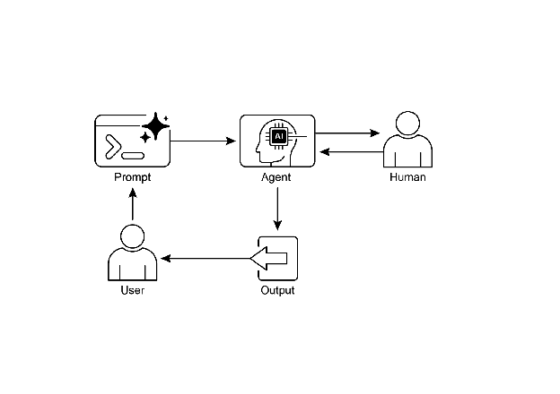

# Chapter 13: Human-in-the-Loop

Human-in-the-Loop(HITL) 패턴은 Agent 개발 및 배포의 핵심 전략임. 인간 인지의 고유한 강점—판단력, 창의성, 섬세한 이해—을 AI의 계산 능력 및 효율성과 의도적으로 결합함. 이러한 전략적 통합은 단순한 선택이 아니라 필수적인 요소이며, 특히 AI 시스템이 중요한 의사결정 프로세스에 점점 더 많이 통합되고 있는 현실에서 그러함.

HITL의 핵심 원칙은 AI가 윤리적 경계 내에서 작동하고, 안전 프로토콜을 준수하며, 최적의 효과로 목표를 달성하도록 보장하는 것임. 이러한 우려는 복잡성, 모호성 또는 심각한 위험이 특징인 영역에서 특히 심각함. 이러한 시나리오에서 AI 오류나 오해의 영향이 상당할 수 있음. 인간의 개입 없이 AI 시스템이 독립적으로 작동하는 완전 자율성은 경솔할 수 있음. HITL은 이러한 현실을 인정하고, 급속도로 발전하는 AI 기술에도 불구하고 인간의 감독, 전략적 입력, 협력적 상호작용이 여전히 필수불가결함을 강조함.

HITL 접근 방식은 근본적으로 인공지능과 인간 지능 간의 시너지라는 아이디어를 중심으로 함. AI를 인간 근로자의 대체재로 보는 것이 아니라, HITL은 AI를 인간 능력을 증강하고 향상시키는 도구로 위치시킴. 이러한 증강은 일상적인 작업 자동화부터 인간의 결정에 정보를 제공하는 데이터 기반 인사이트 제공까지 다양한 형태를 취할 수 있음. 최종 목표는 인간과 AI Agent가 각자의 고유한 강점을 활용하여 단독으로는 달성할 수 없는 결과를 얻을 수 있는 협력적 생태계를 만드는 것임.

실제로 HITL은 다양한 방식으로 구현될 수 있음. 일반적인 접근 방식 중 하나는 인간이 검증자 또는 검토자 역할을 하여 AI 출력을 검사하고 정확성을 보장하며 잠재적 오류를 식별하는 것임. 또 다른 구현은 인간이 피드백을 제공하거나 실시간으로 수정하여 AI 동작을 적극적으로 안내하는 것임. 더 복잡한 설정에서는 인간이 AI와 파트너로 협력하여 대화형 대화 또는 공유 인터페이스를 통해 공동으로 문제를 해결하거나 결정을 내릴 수 있음. 특정 구현에 관계없이 HITL 패턴은 인간의 통제와 감독을 유지하는 것의 중요성을 강조하며, AI 시스템이 인간의 윤리, 가치, 목표 및 사회적 기대와 일치하도록 보장함.

# Human-in-the-Loop Pattern 개요

Human-in-the-Loop(HITL) 패턴은 인공지능과 인간 입력을 통합하여 Agent 기능을 향상시킴. 이 접근 방식은 최적의 AI 성능이 자동화된 처리와 인간의 통찰력의 조합을 요구함을 인정함. 특히 복잡성이 높거나 윤리적 고려 사항이 있는 시나리오에서 그러함. 인간 입력을 대체하는 것이 아니라, HITL은 중요한 판단과 결정이 인간의 이해에 의해 정보를 받도록 보장하여 인간의 능력을 증강하는 것을 목표로 함.

HITL은 여러 핵심 측면을 포함함: Human Oversight는 AI agent 성능과 출력을 모니터링(예: 로그 검토 또는 실시간 대시보드를 통해)하여 지침 준수를 보장하고 바람직하지 않은 결과를 방지하는 것임. Intervention and Correction은 AI agent가 오류나 모호한 시나리오에 직면할 때 발생하며 인간의 개입을 요청할 수 있음; 인간 운영자는 오류를 수정하고, 누락된 데이터를 제공하거나, agent를 안내할 수 있으며, 이는 향후 agent 개선에도 정보를 제공함. Human Feedback for Learning은 수집되어 AI 모델을 개선하는 데 사용되며, 특히 인간 피드백을 통한 강화 학습과 같은 방법론에서 두드러지며, 인간의 선호도가 agent의 학습 궤적에 직접적인 영향을 미침. Decision Augmentation은 AI agent가 분석 및 권장 사항을 인간에게 제공하고, 인간이 최종 결정을 내리는 것임. 완전 자율성이 아닌 AI가 생성한 인사이트를 통해 인간의 의사결정을 향상시킴. Human-Agent Collaboration은 인간과 AI agent가 각자의 강점을 기여하는 협력적 상호작용임; 일상적인 데이터 처리는 agent가 처리할 수 있지만, 창의적인 문제 해결이나 복잡한 협상은 인간이 관리함. 마지막으로 Escalation Policies는 agent가 작업을 인간 운영자에게 에스컬레이션해야 하는 시기와 방법을 지시하는 확립된 프로토콜로, agent의 능력을 넘어서는 상황에서 오류를 방지함.

HITL 패턴 구현은 완전 자율성이 실현 가능하지 않거나 허용되지 않는 민감한 부문에서 Agent 사용을 가능하게 함. 또한 피드백 루프를 통한 지속적인 개선을 위한 메커니즘을 제공함. 예를 들어, 금융에서 대규모 기업 대출의 최종 승인은 인간 대출 담당자가 리더십 성격과 같은 질적 요인을 평가해야 함. 마찬가지로 법률 분야에서는 정의와 책임의 핵심 원칙이 인간 판사가 복잡한 도덕적 추론을 포함하는 형량과 같은 중요한 결정에 대한 최종 권한을 유지하도록 요구함.

### **주의사항:** 이점에도 불구하고 HITL 패턴에는 상당한 주의사항이 있으며, 그중 가장 중요한 것은 확장성 부족임. 인간 감독은 높은 정확도를 제공하지만 운영자는 수백만 개의 작업을 관리할 수 없으며, 이는 규모를 위한 자동화와 정확도를 위한 HITL을 결합한 하이브리드 접근 방식이 종종 필요한 근본적인 절충을 생성함. 또한 이 패턴의 효과는 인간 운영자의 전문성에 크게 의존함; 예를 들어, AI는 소프트웨어 코드를 생성할 수 있지만 숙련된 개발자만이 미묘한 오류를 정확하게 식별하고 이를 수정하기 위한 올바른 지침을 제공할 수 있음. 이러한 전문성의 필요성은 HITL을 사용하여 훈련 데이터를 생성할 때도 적용되며, 인간 주석자는 고품질 데이터를 생성하는 방식으로 AI를 수정하는 방법을 배우기 위해 특별한 훈련이 필요할 수 있음. 마지막으로 HITL 구현은 상당한 개인 정보 보호 문제를 제기함. 민감한 정보는 인간 운영자에게 노출되기 전에 엄격하게 익명화되어야 하며, 이는 프로세스 복잡성의 또 다른 계층을 추가함.

# 실제 응용 및 사용 사례

Human-in-the-Loop 패턴은 특히 정확성, 안전성, 윤리 또는 섬세한 이해가 중요한 광범위한 산업 및 응용 분야에서 필수적임.

* **콘텐츠 조정:** AI agent는 위반 사항(예: 증오 발언, 스팸)에 대한 방대한 양의 온라인 콘텐츠를 신속하게 필터링할 수 있음. 그러나 모호한 사례나 경계선 콘텐츠는 검토 및 최종 결정을 위해 인간 조정자에게 에스컬레이션되어 미묘한 판단과 복잡한 정책 준수를 보장함.
* **자율 주행:** 자율 주행 자동차는 대부분의 주행 작업을 자율적으로 처리하지만, AI가 자신 있게 탐색할 수 없는 복잡하고 예측할 수 없거나 위험한 상황(예: 극단적인 날씨, 특이한 도로 조건)에서 인간 운전자에게 제어권을 넘기도록 설계됨.
* **금융 사기 탐지:** AI 시스템은 패턴을 기반으로 의심스러운 거래에 플래그를 지정할 수 있음. 그러나 고위험 또는 모호한 경고는 종종 추가 조사를 수행하고 고객에게 연락하며 거래가 사기인지 여부에 대한 최종 결정을 내리는 인간 분석가에게 전송됨.
* **법률 문서 검토:** AI는 수천 개의 법률 문서를 신속하게 스캔하고 분류하여 관련 조항이나 증거를 식별할 수 있음. 그런 다음 인간 법률 전문가가 특히 중요한 사례에 대해 AI의 발견 사항을 정확성, 맥락 및 법적 의미에 대해 검토함.
* **고객 지원(복잡한 쿼리):** 챗봇은 일상적인 고객 문의를 처리할 수 있음. 사용자의 문제가 너무 복잡하거나 감정적으로 충전되었거나 AI가 제공할 수 없는 공감이 필요한 경우 대화가 원활하게 인간 지원 에이전트에게 넘어감.
* **데이터 레이블링 및 주석:** AI 모델은 훈련을 위해 종종 레이블이 지정된 데이터의 대규모 데이터 세트가 필요함. 인간은 루프에 포함되어 이미지, 텍스트 또는 오디오에 정확하게 레이블을 지정하고 AI가 학습하는 ground truth를 제공함. 모델이 진화함에 따라 이는 지속적인 프로세스임.
* **Generative AI 개선:** LLM이 크리에이티브 콘텐츠(예: 마케팅 카피, 디자인 아이디어)를 생성할 때 인간 편집자 또는 디자이너가 출력을 검토하고 개선하여 브랜드 가이드라인을 충족하고 대상 고객에게 공감하며 품질을 유지하도록 보장함.
* **자율 네트워크:** AI 시스템은 주요 성능 지표(KPI)와 식별된 패턴을 활용하여 경고를 분석하고 네트워크 문제 및 트래픽 이상을 예측할 수 있음. 그럼에도 불구하고 고위험 경고 해결과 같은 중요한 결정은 종종 인간 분석가에게 에스컬레이션됨. 이러한 분석가는 추가 조사를 수행하고 네트워크 변경 승인에 관한 최종 결정을 내림.

이 패턴은 AI 구현을 위한 실용적인 방법을 예시함. 향상된 확장성과 효율성을 위해 AI를 활용하는 동시에 품질, 안전 및 윤리적 준수를 보장하기 위해 인간 감독을 유지함.

"Human-on-the-loop"는 이 패턴의 변형으로, 인간 전문가가 포괄적인 정책을 정의하고 AI가 규정 준수를 보장하기 위해 즉각적인 조치를 처리함. 두 가지 예를 고려해봄:

* **자동화된 금융 거래 시스템**: 이 시나리오에서 인간 금융 전문가는 포괄적인 투자 전략과 규칙을 설정함. 예를 들어, 인간은 정책을 다음과 같이 정의할 수 있음: "기술주 70%, 채권 30%의 포트폴리오를 유지하고, 단일 회사에 5% 이상 투자하지 말고, 구매 가격보다 10% 떨어지는 모든 주식을 자동으로 매도함." 그런 다음 AI는 실시간으로 주식 시장을 모니터링하고 이러한 사전 정의된 조건이 충족되면 즉시 거래를 실행함. AI는 인간 운영자가 설정한 느리고 전략적인 정책을 기반으로 즉각적이고 고속의 조치를 처리함.
* **현대 콜센터**: 이 설정에서 인간 관리자는 고객 상호작용에 대한 높은 수준의 정책을 수립함. 예를 들어, 관리자는 "서비스 중단"을 언급하는 모든 통화는 즉시 기술 지원 전문가에게 라우팅되어야 함" 또는 "고객의 목소리 톤이 높은 좌절감을 나타내는 경우 시스템은 인간 에이전트에게 직접 연결하도록 제안해야 함"과 같은 규칙을 설정할 수 있음. 그런 다음 AI 시스템은 초기 고객 상호작용을 처리하고 실시간으로 고객의 요구를 듣고 해석함. 각 개별 사례에 대한 인간 개입 없이 통화를 즉시 라우팅하거나 에스컬레이션을 제공하여 관리자의 정책을 자율적으로 실행함. 이를 통해 AI는 인간 운영자가 제공한 느리고 전략적인 지침에 따라 대량의 즉각적인 조치를 관리할 수 있음.

# 실습 코드 예제

Human-in-the-Loop 패턴을 시연하기 위해 ADK agent는 인간 검토가 필요한 시나리오를 식별하고 에스컬레이션 프로세스를 시작할 수 있음. 이를 통해 agent의 자율적 의사결정 능력이 제한적이거나 복잡한 판단이 필요한 상황에서 인간 개입이 가능함. 이것은 고립된 기능이 아님; 다른 인기 있는 프레임워크도 유사한 기능을 채택했음. 예를 들어 LangChain도 이러한 유형의 상호작용을 구현하기 위한 도구를 제공함.

```python
from google.adk.agents import Agent
from google.adk.tools.tool_context import ToolContext
from google.adk.callbacks import CallbackContext
from google.adk.models.llm import LlmRequest
from google.genai import types
from typing import Optional

# Placeholder for tools (replace with actual implementations if needed)
def troubleshoot_issue(issue: str) -> dict:
   return {"status": "success", "report": f"Troubleshooting steps for {issue}."}

def create_ticket(issue_type: str, details: str) -> dict:
   return {"status": "success", "ticket_id": "TICKET123"}

def escalate_to_human(issue_type: str) -> dict:
   # This would typically transfer to a human queue in a real system
   return {"status": "success", "message": f"Escalated {issue_type} to a human specialist."}

technical_support_agent = Agent(
   name="technical_support_specialist",
   model="gemini-2.0-flash-exp",
   instruction="""
You are a technical support specialist for our electronics company.

FIRST, check if the user has a support history in state["customer_info"]["support_history"].
If they do, reference this history in your responses.

For technical issues:
1. Use the troubleshoot_issue tool to analyze the problem.
2. Guide the user through basic troubleshooting steps.
3. If the issue persists, use create_ticket to log the issue.

For complex issues beyond basic troubleshooting:
1. Use escalate_to_human to transfer to a human specialist.

Maintain a professional but empathetic tone. Acknowledge the frustration technical issues can cause,
while providing clear steps toward resolution.
""",
   tools=[troubleshoot_issue, create_ticket, escalate_to_human]
)

def personalization_callback(
   callback_context: CallbackContext, llm_request: LlmRequest
) -> Optional[LlmRequest]:
   """Adds personalization information to the LLM request."""
   # Get customer info from state
   customer_info = callback_context.state.get("customer_info")
   if customer_info:
       customer_name = customer_info.get("name", "valued customer")
       customer_tier = customer_info.get("tier", "standard")
       recent_purchases = customer_info.get("recent_purchases", [])

       personalization_note = (
           f"\nIMPORTANT PERSONALIZATION:\n"
           f"Customer Name: {customer_name}\n"
           f"Customer Tier: {customer_tier}\n"
       )

       if recent_purchases:
           personalization_note += f"Recent Purchases: {', '.join(recent_purchases)}\n"

       if llm_request.contents:
           # Add as a system message before the first content
           system_content = types.Content(
               role="system", parts=[types.Part(text=personalization_note)]
           )
           llm_request.contents.insert(0, system_content)

   return None # Return None to continue with the modified request
```

이 코드는 HITL 프레임워크를 중심으로 설계된 Google의 ADK를 사용하여 기술 지원 agent를 만들기 위한 청사진을 제공함. agent는 지능형 최초 지원 라인 역할을 하며 특정 지침으로 구성되고 troubleshoot\_issue, create\_ticket, escalate\_to\_human과 같은 도구를 갖추어 완전한 지원 워크플로를 관리함. 에스컬레이션 도구는 HITL 설계의 핵심 부분으로, 복잡하거나 민감한 사례가 인간 전문가에게 전달되도록 보장함.

이 아키텍처의 주요 기능은 전용 콜백 함수를 통해 달성되는 깊은 개인화 능력임. LLM에 연락하기 전에 이 함수는 agent의 상태에서 고객별 데이터(이름, 등급, 구매 내역 등)를 동적으로 검색함. 이 컨텍스트는 시스템 메시지로 프롬프트에 주입되어 agent가 사용자의 이력을 참조하는 매우 맞춤화되고 정보에 입각한 응답을 제공할 수 있도록 함. 구조화된 워크플로를 필수 인간 감독 및 동적 개인화와 결합함으로써 이 코드는 ADK가 정교하고 강력한 AI 지원 솔루션 개발을 촉진하는 방법에 대한 실용적인 예로 사용됨.

# 요약

**What:** 고급 LLM을 포함한 AI 시스템은 미묘한 판단, 윤리적 추론 또는 복잡하고 모호한 맥락에 대한 깊은 이해가 필요한 작업에 어려움을 겪는 경우가 많음. 고위험 환경에서 완전 자율적인 AI를 배포하는 것은 오류가 심각한 안전, 재정적 또는 윤리적 결과로 이어질 수 있으므로 상당한 위험을 수반함. 이러한 시스템은 인간이 가진 고유한 창의성과 상식적 추론이 부족함. 따라서 중요한 의사결정 프로세스에서 자동화에만 의존하는 것은 종종 경솔하며 시스템의 전반적인 효과와 신뢰성을 훼손할 수 있음.

**Why:** Human-in-the-Loop(HITL) 패턴은 AI 워크플로에 인간 감독을 전략적으로 통합하여 표준화된 솔루션을 제공함. 이 agentic 접근 방식은 AI가 계산 집약적 작업과 데이터 처리를 처리하고 인간이 중요한 검증, 피드백 및 개입을 제공하는 공생 파트너십을 만듦. 이를 통해 HITL은 AI 조치가 인간의 가치와 안전 프로토콜과 일치하도록 보장함. 이 협력적 프레임워크는 완전 자동화의 위험을 완화할 뿐만 아니라 인간 입력에서 지속적인 학습을 통해 시스템의 기능을 향상시킴. 궁극적으로 이것은 인간이나 AI 단독으로는 달성할 수 없는 보다 강력하고 정확하며 윤리적인 결과로 이어짐.

**경험 법칙:** 의료, 금융 또는 자율 시스템과 같이 오류가 심각한 안전, 윤리적 또는 재정적 결과를 초래하는 영역에 AI를 배포할 때 이 패턴을 사용함. 콘텐츠 조정 또는 복잡한 고객 지원 에스컬레이션과 같이 LLM이 안정적으로 처리할 수 없는 모호성과 뉘앙스를 포함하는 작업에 필수적임. 고품질의 인간 레이블 데이터로 AI 모델을 지속적으로 개선하거나 특정 품질 표준을 충족하도록 generative AI 출력을 개선하는 것이 목표일 때 HITL을 사용함.

**시각적 요약:**



Fig.1: Human in the loop 디자인 패턴

# 핵심 요점

핵심 요점은 다음과 같음:

* Human-in-the-Loop(HITL)는 인간의 지능과 판단을 AI 워크플로에 통합함.
* 복잡하거나 고위험 시나리오에서 안전, 윤리 및 효과를 위해 중요함.
* 핵심 측면에는 인간 감독, 개입, 학습을 위한 피드백 및 의사결정 증강이 포함됨.
* 에스컬레이션 정책은 agent가 인간에게 인계해야 하는 시기를 알기 위해 필수적임.
* HITL은 책임 있는 AI 배포 및 지속적인 개선을 가능하게 함.
* Human-in-the-Loop의 주요 단점은 고유한 확장성 부족으로 정확도와 볼륨 간의 절충을 생성하며, 효과적인 개입을 위해 고도로 숙련된 도메인 전문가에 의존함.
* 구현은 데이터 생성을 위한 인간 운영자 교육 필요성과 민감한 정보를 익명화하여 개인 정보 보호 문제를 해결해야 하는 등의 운영 과제를 제시함.

# 결론

이 장에서는 강력하고 안전하며 윤리적인 AI 시스템을 만드는 데 있어 필수적인 Human-in-the-Loop(HITL) 패턴을 탐구했음. 인간의 감독, 개입 및 피드백을 agent 워크플로에 통합하는 것이 특히 복잡하고 민감한 영역에서 성능과 신뢰성을 크게 향상시킬 수 있는 방법을 논의했음. 실제 응용 사례는 콘텐츠 조정 및 의료 진단에서 자율 주행 및 고객 지원에 이르기까지 HITL의 광범위한 유용성을 보여줌. 개념적 코드 예제는 ADK가 에스컬레이션 메커니즘을 통해 이러한 인간-agent 상호작용을 어떻게 촉진할 수 있는지에 대한 통찰을 제공했음. AI 기능이 계속 발전함에 따라 HITL은 책임 있는 AI 개발의 초석으로 남아 있으며 인간의 가치와 전문성이 지능형 시스템 설계의 중심에 남아 있도록 보장함.

# 참고문헌

1. A Survey of Human-in-the-loop for Machine Learning, Xingjiao Wu, Luwei Xiao, Yixuan Sun, Junhang Zhang, Tianlong Ma, Liang He, [https://arxiv.org/abs/2108.00941](https://arxiv.org/abs/2108.00941)
