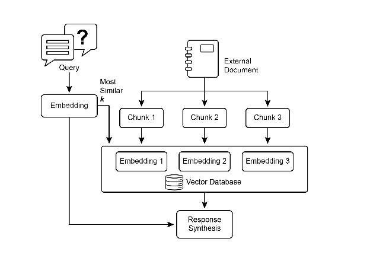
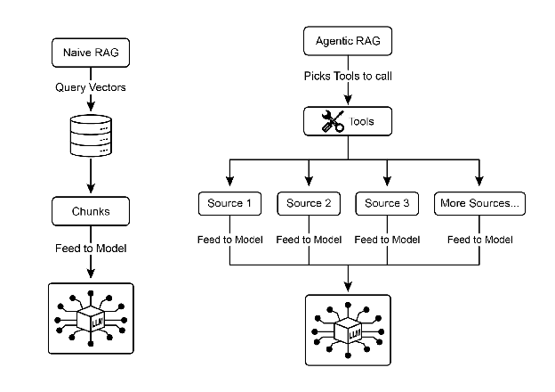
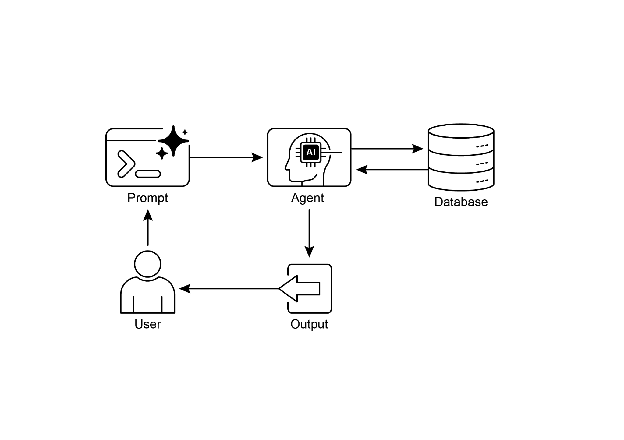

# Chapter 14: 지식 검색 (RAG)

LLM은 인간과 유사한 텍스트를 생성하는 데 있어 상당한 능력을 보여줌. 하지만 이들의 지식 기반은 일반적으로 학습된 데이터에 국한되어 있어, 실시간 정보, 특정 회사 데이터, 고도로 전문화된 세부 정보에 대한 접근이 제한됨. 지식 검색(RAG, Retrieval Augmented Generation)은 이러한 한계를 해결함. RAG는 LLM이 외부의 최신 컨텍스트별 정보에 접근하고 통합할 수 있게 하여, 출력의 정확성, 관련성, 사실 기반을 향상시킴.

AI 에이전트의 경우, 이는 정적 학습 범위를 넘어 실시간으로 검증 가능한 데이터에 행동과 응답을 기반할 수 있게 하므로 중요함. 이 기능은 특정 질문에 답하기 위해 최신 회사 정책에 접근하거나 주문 전에 현재 재고를 확인하는 등 복잡한 작업을 정확하게 수행할 수 있게 함. 외부 지식을 통합함으로써 RAG는 에이전트를 단순한 대화 상대에서 의미 있는 작업을 수행할 수 있는 효과적인 데이터 기반 도구로 변환함.

# 지식 검색 (RAG) 패턴 개요

지식 검색(RAG) 패턴은 응답을 생성하기 전에 외부 지식 베이스에 접근할 수 있게 함으로써 LLM의 능력을 크게 향상시킴. RAG는 LLM이 내부의 사전 학습된 지식에만 의존하는 대신, 인간이 책을 참조하거나 인터넷을 검색하는 것처럼 정보를 "조회"할 수 있게 함. 이 프로세스는 LLM이 더 정확하고 최신이며 검증 가능한 답변을 제공할 수 있게 함.

사용자가 RAG를 사용하는 AI 시스템에 질문을 하거나 프롬프트를 제공할 때, 쿼리는 LLM으로 직접 전송되지 않음. 대신 시스템은 먼저 방대한 외부 지식 베이스(문서, 데이터베이스, 웹 페이지의 고도로 조직화된 라이브러리)를 검색하여 관련 정보를 찾음. 이 검색은 단순한 키워드 매칭이 아니며, 사용자의 의도와 단어 뒤의 의미를 이해하는 "의미론적 검색"임. 이 초기 검색은 가장 관련성 높은 정보의 스니펫 또는 "청크"를 추출함. 추출된 조각들은 원래 프롬프트에 "증강" 또는 추가되어, 더 풍부하고 정보가 많은 쿼리를 생성함. 마지막으로 이 향상된 프롬프트가 LLM으로 전송됨. 이 추가 컨텍스트를 통해 LLM은 유창하고 자연스러울 뿐만 아니라 검색된 데이터에 사실적으로 기반한 응답을 생성할 수 있음.

RAG 프레임워크는 여러 중요한 이점을 제공함. LLM이 최신 정보에 접근할 수 있게 하여 정적 학습 데이터의 제약을 극복함. 이 접근 방식은 검증 가능한 데이터에 응답을 기반함으로써 허위 정보 생성인 "환각(hallucination)"의 위험을 줄임. 또한 LLM은 내부 회사 문서나 위키에서 발견되는 전문 지식을 활용할 수 있음. 이 프로세스의 중요한 이점은 정확한 정보 출처를 지적하는 "인용"을 제공할 수 있는 능력이며, 이를 통해 AI 응답의 신뢰성과 검증 가능성을 향상시킴.

RAG가 어떻게 작동하는지 완전히 이해하려면 몇 가지 핵심 개념을 이해하는 것이 필수적임 (Fig.1 참조):

**임베딩**: LLM의 맥락에서 임베딩은 단어, 구, 전체 문서와 같은 텍스트의 수치적 표현임. 이러한 표현은 숫자 목록인 벡터 형태임. 핵심 아이디어는 수학적 공간에서 서로 다른 텍스트 조각 간의 의미론적 의미와 관계를 포착하는 것임. 유사한 의미를 가진 단어나 구는 이 벡터 공간에서 서로 더 가까운 임베딩을 가짐. 예를 들어, 간단한 2D 그래프를 상상해보면, "cat"이라는 단어는 좌표 (2, 3)으로 표현될 수 있으며, "kitten"은 (2.1, 3.1)로 매우 가까움. 반대로 "car"라는 단어는 다른 의미를 반영하여 (8, 1)과 같이 먼 좌표를 가짐. 실제로 이러한 임베딩은 수백 또는 수천 개의 차원을 가진 훨씬 더 높은 차원 공간에 있으며, 언어에 대한 매우 미묘한 이해를 가능하게 함.

**텍스트 유사성:** 텍스트 유사성은 두 텍스트 조각이 얼마나 유사한지를 측정하는 것을 의미함. 이는 표면 수준에서 단어의 중복(어휘적 유사성)을 보거나, 더 깊은 의미 기반 수준일 수 있음. RAG의 맥락에서 텍스트 유사성은 사용자의 쿼리에 해당하는 지식 베이스에서 가장 관련성 높은 정보를 찾는 데 중요함. 예를 들어, "What is the capital of France?"와 "Which city is the capital of France?"라는 문장을 고려하면, 표현은 다르지만 같은 질문을 하고 있음. 좋은 텍스트 유사성 모델은 이를 인식하고 두 문장에 높은 유사성 점수를 부여할 것이며, 몇 개의 단어만 공유하더라도 그럼. 이는 종종 텍스트의 임베딩을 사용하여 계산됨.

**의미론적 유사성과 거리:** 의미론적 유사성은 사용된 단어만이 아니라 텍스트의 의미와 맥락에 순전히 초점을 맞춘 텍스트 유사성의 더 고급 형태임. 두 텍스트 조각이 같은 개념이나 아이디어를 전달하는지 이해하는 것을 목표로 함. 의미론적 거리는 이의 역임; 높은 의미론적 유사성은 낮은 의미론적 거리를 의미하며, 그 반대도 마찬가지임. RAG에서 의미론적 검색은 사용자의 쿼리에 대해 가장 작은 의미론적 거리를 가진 문서를 찾는 데 의존함. 예를 들어, "a furry feline companion"과 "a domestic cat"이라는 구는 "a" 외에는 공통된 단어가 없음. 하지만 의미론적 유사성을 이해하는 모델은 이들이 같은 것을 지칭한다는 것을 인식하고 매우 유사하다고 간주할 것임. 이는 그들의 임베딩이 벡터 공간에서 매우 가까울 것이며, 작은 의미론적 거리를 나타내기 때문임. 이것이 RAG가 사용자의 표현이 지식 베이스의 텍스트와 정확히 일치하지 않더라도 관련 정보를 찾을 수 있게 하는 "스마트 검색"임.



Fig.1: RAG 핵심 개념: 청킹, 임베딩, 벡터 데이터베이스

**문서 청킹:** 청킹은 큰 문서를 더 작고 관리 가능한 조각 또는 "청크"로 나누는 프로세스임. RAG 시스템이 효율적으로 작동하려면 전체 큰 문서를 LLM에 공급할 수 없음. 대신 이러한 더 작은 청크를 처리함. 문서가 청킹되는 방식은 정보의 컨텍스트와 의미를 보존하는 데 중요함. 예를 들어, 50페이지 사용자 매뉴얼을 단일 텍스트 블록으로 처리하는 대신, 청킹 전략은 이를 섹션, 단락 또는 문장으로 나눌 수 있음. 예를 들어, "문제 해결" 섹션은 "설치 가이드"와 별도의 청크가 됨. 사용자가 특정 문제에 대한 질문을 할 때, RAG 시스템은 전체 매뉴얼이 아닌 가장 관련성 높은 문제 해결 청크를 검색할 수 있음. 이는 검색 프로세스를 더 빠르게 만들고 LLM에 제공되는 정보를 사용자의 즉각적인 필요에 더 집중되고 관련성 있게 만듦. 문서가 청킹되면 RAG 시스템은 주어진 쿼리에 대해 가장 관련성 높은 조각을 찾기 위해 검색 기법을 사용해야 함. 주요 방법은 벡터 검색이며, 이는 임베딩과 의미론적 거리를 사용하여 사용자의 질문과 개념적으로 유사한 청크를 찾음. 더 오래되었지만 여전히 가치 있는 기법은 BM25이며, 이는 의미론적 의미를 이해하지 않고 용어 빈도를 기반으로 청크를 순위화하는 키워드 기반 알고리즘임. 양쪽의 장점을 얻기 위해 하이브리드 검색 접근 방식이 자주 사용되며, BM25의 키워드 정밀도와 의미론적 검색의 맥락 이해를 결합함. 이 융합은 더 강력하고 정확한 검색을 가능하게 하며, 문자 그대로의 일치와 개념적 관련성을 모두 포착함.

**벡터 데이터베이스:** 벡터 데이터베이스는 임베딩을 효율적으로 저장하고 쿼리하도록 설계된 특수 유형의 데이터베이스임. 문서가 청킹되고 임베딩으로 변환된 후, 이러한 고차원 벡터는 벡터 데이터베이스에 저장됨. 키워드 기반 검색과 같은 전통적인 검색 기법은 쿼리에서 정확한 단어를 포함하는 문서를 찾는 데 탁월하지만 언어에 대한 깊은 이해가 부족함. "furry feline companion"이 "cat"을 의미한다는 것을 인식하지 못함. 이것이 벡터 데이터베이스가 탁월한 부분임. 이들은 의미론적 검색을 위해 특별히 구축됨. 텍스트를 수치 벡터로 저장함으로써, 키워드 중복이 아닌 개념적 의미를 기반으로 결과를 찾을 수 있음. 사용자의 쿼리도 벡터로 변환되면, 데이터베이스는 고도로 최적화된 알고리즘(HNSW - Hierarchical Navigable Small World와 같은)을 사용하여 수백만 개의 벡터를 빠르게 검색하고 의미상 "가장 가까운" 것을 찾음. 이 접근 방식은 사용자의 표현이 소스 문서와 완전히 다르더라도 관련 컨텍스트를 발견하기 때문에 RAG에 훨씬 우수함. 본질적으로 다른 기법이 단어를 검색하는 반면, 벡터 데이터베이스는 의미를 검색함. 이 기술은 Pinecone 및 Weaviate와 같은 관리형 데이터베이스부터 Chroma DB, Milvus, Qdrant와 같은 오픈 소스 솔루션까지 다양한 형태로 구현됨. 기존 데이터베이스도 Redis, Elasticsearch, Postgres(pgvector 확장 사용)에서 볼 수 있듯이 벡터 검색 기능으로 증강될 수 있음. 핵심 검색 메커니즘은 종종 Meta AI의 FAISS 또는 Google Research의 ScaNN과 같은 라이브러리에 의해 구동되며, 이는 이러한 시스템의 효율성에 근본적임.

**RAG의 과제:** 강력함에도 불구하고 RAG 패턴은 과제가 없지 않음. 주요 문제는 쿼리에 답하는 데 필요한 정보가 단일 청크에 국한되지 않고 문서의 여러 부분 또는 여러 문서에 분산되어 있을 때 발생함. 이러한 경우 리트리버는 필요한 모든 컨텍스트를 수집하지 못하여 불완전하거나 부정확한 답변으로 이어질 수 있음. 시스템의 효과성은 청킹 및 검색 프로세스의 품질에도 크게 의존함; 관련 없는 청크가 검색되면 노이즈를 도입하고 LLM을 혼란스럽게 할 수 있음. 또한 잠재적으로 모순되는 소스에서 정보를 효과적으로 종합하는 것은 이러한 시스템에 여전히 중요한 장애물로 남아 있음. 그 외에도 또 다른 과제는 RAG가 전체 지식 베이스를 벡터 또는 그래프 데이터베이스와 같은 특수 데이터베이스에 사전 처리되고 저장되어야 한다는 것이며, 이는 상당한 작업임. 결과적으로 이 지식은 최신 상태를 유지하기 위해 주기적으로 조정되어야 하며, 이는 회사 위키와 같은 진화하는 소스를 다룰 때 중요한 작업임. 이 전체 프로세스는 성능에 눈에 띄는 영향을 미칠 수 있으며, 지연 시간, 운영 비용, 최종 프롬프트에 사용되는 토큰 수를 증가시킴.

요약하면, Retrieval-Augmented Generation(RAG) 패턴은 AI를 더 지식이 풍부하고 신뢰할 수 있게 만드는 데 있어 중요한 도약을 나타냄. 생성 프로세스에 외부 지식 검색 단계를 원활하게 통합함으로써 RAG는 독립형 LLM의 일부 핵심 제한 사항을 해결함. 임베딩 및 의미론적 유사성의 기본 개념과 키워드 및 하이브리드 검색과 같은 검색 기법을 결합하여 시스템이 관련 정보를 지능적으로 찾을 수 있게 하며, 이는 전략적 청킹을 통해 관리 가능하게 됨. 이 전체 검색 프로세스는 규모에 맞춰 수백만 개의 임베딩을 저장하고 효율적으로 쿼리하도록 설계된 특수 벡터 데이터베이스에 의해 구동됨. 단편화되거나 모순되는 정보를 검색하는 과제가 지속되지만, RAG는 LLM이 맥락적으로 적절할 뿐만 아니라 검증 가능한 사실에 기반한 답변을 생성할 수 있게 하며, AI에 대한 더 큰 신뢰와 유용성을 촉진함.

**Graph RAG:** GraphRAG는 정보 검색을 위해 단순한 벡터 데이터베이스 대신 지식 그래프를 활용하는 Retrieval-Augmented Generation의 고급 형태임. 이 구조화된 지식 베이스 내에서 데이터 엔티티(노드) 간의 명시적 관계(엣지)를 탐색하여 복잡한 쿼리에 답함. 주요 장점은 여러 문서에 걸쳐 단편화된 정보에서 답변을 종합할 수 있는 능력이며, 이는 전통적인 RAG의 일반적인 실패임. 이러한 연결을 이해함으로써 GraphRAG는 더 맥락적으로 정확하고 미묘한 응답을 제공함.

사용 사례로는 복잡한 재무 분석, 회사를 시장 이벤트에 연결, 유전자와 질병 간의 관계를 발견하기 위한 과학 연구가 포함됨. 그러나 주요 단점은 고품질 지식 그래프를 구축하고 유지하는 데 필요한 상당한 복잡성, 비용, 전문 지식임. 이 설정은 또한 더 간단한 벡터 검색 시스템에 비해 덜 유연하고 더 높은 지연 시간을 도입할 수 있음. 시스템의 효과성은 기본 그래프 구조의 품질과 완전성에 전적으로 의존함. 결과적으로 GraphRAG는 복잡한 질문에 대해 우수한 맥락 추론을 제공하지만 훨씬 더 높은 구현 및 유지 관리 비용이 듦. 요약하면, 깊고 상호 연결된 통찰력이 표준 RAG의 속도와 단순성보다 더 중요한 곳에서 탁월함.

**Agentic RAG:** 이 패턴의 진화인 **Agentic RAG**(Fig.2 참조)는 정보 추출의 신뢰성을 크게 향상시키기 위해 추론 및 의사 결정 계층을 도입함. 단순히 검색하고 증강하는 대신, 특수 AI 구성 요소인 "에이전트"가 지식의 중요한 게이트키퍼 및 정제자 역할을 함. 초기에 검색된 데이터를 수동적으로 수용하는 대신, 이 에이전트는 다음 시나리오에서 설명되는 것처럼 품질, 관련성, 완전성을 적극적으로 조사함.

첫째, 에이전트는 반영 및 소스 검증에 탁월함. 사용자가 "우리 회사의 원격 근무 정책은 무엇입니까?"라고 묻는 경우, 표준 RAG는 공식 2025 정책 문서와 함께 2020 블로그 게시물을 가져올 수 있음. 하지만 에이전트는 문서의 메타데이터를 분석하고 2025 정책을 가장 최신이고 권위 있는 소스로 인식하며, 정확한 답변을 위해 LLM에 올바른 컨텍스트를 보내기 전에 오래된 블로그 게시물을 폐기함.



Fig.2: Agentic RAG는 검색된 정보를 적극적으로 평가, 조정, 정제하여 더 정확하고 신뢰할 수 있는 최종 응답을 보장하는 추론 에이전트를 도입함.

둘째, 에이전트는 지식 충돌 조정에 능숙함. 재무 분석가가 "프로젝트 알파의 1분기 예산은 얼마였습니까?"라고 묻는다고 상상해보면, 시스템은 두 개의 문서를 검색함: €50,000 예산을 명시한 초기 제안서와 €65,000으로 나열된 최종 재무 보고서. Agentic RAG는 이 모순을 식별하고 재무 보고서를 더 신뢰할 수 있는 소스로 우선순위를 매기며, LLM에 검증된 수치를 제공하여 최종 답변이 가장 정확한 데이터를 기반으로 하도록 보장함.

셋째, 에이전트는 복잡한 답변을 종합하기 위해 다단계 추론을 수행할 수 있음. 사용자가 "우리 제품의 기능과 가격을 경쟁사 X와 어떻게 비교합니까?"라고 묻는 경우, 에이전트는 이를 별도의 하위 쿼리로 분해함. 자체 제품의 기능, 가격, 경쟁사 X의 기능, 경쟁사 X의 가격에 대해 별도의 검색을 시작함. 이러한 개별 정보를 수집한 후, 에이전트는 LLM에 공급하기 전에 구조화된 비교 컨텍스트로 종합하여 단순 검색으로는 생성할 수 없는 포괄적인 응답을 가능하게 함.

넷째, 에이전트는 지식 격차를 식별하고 외부 도구를 사용할 수 있음. 사용자가 "어제 출시된 우리의 새 제품에 대한 시장의 즉각적인 반응은 무엇이었습니까?"라고 묻는다고 가정하면, 에이전트는 주간으로 업데이트되는 내부 지식 베이스를 검색하고 관련 정보를 찾지 못함. 이 격차를 인식하고 라이브 웹 검색 API와 같은 도구를 활성화하여 최근 뉴스 기사 및 소셜 미디어 감정을 찾을 수 있음. 그런 다음 에이전트는 이 새로 수집된 외부 정보를 사용하여 최신 답변을 제공하며, 정적 내부 데이터베이스의 제한을 극복함.

**Agentic RAG의 과제:** 강력하지만 에이전틱 계층은 자체적인 과제를 도입함. 주요 단점은 복잡성과 비용의 상당한 증가임. 에이전트의 의사 결정 논리 및 도구 통합을 설계, 구현, 유지하려면 상당한 엔지니어링 노력이 필요하고 계산 비용이 추가됨. 이 복잡성은 또한 지연 시간 증가로 이어질 수 있으며, 에이전트의 반영, 도구 사용, 다단계 추론 주기가 표준 직접 검색 프로세스보다 더 많은 시간이 걸림. 또한 에이전트 자체가 새로운 오류 소스가 될 수 있음; 결함이 있는 추론 프로세스는 쓸모없는 루프에 갇히게 하거나 작업을 잘못 해석하거나 관련 정보를 부적절하게 폐기하여 궁극적으로 최종 응답의 품질을 저하시킬 수 있음.

### **요약:** Agentic RAG는 표준 검색 패턴의 정교한 진화를 나타내며, 수동적 데이터 파이프라인에서 능동적 문제 해결 프레임워크로 변환함. 소스를 평가하고 충돌을 조정하며 복잡한 질문을 분해하고 외부 도구를 사용할 수 있는 추론 계층을 임베딩함으로써 에이전트는 생성된 답변의 신뢰성과 깊이를 극적으로 향상시킴. 이 발전은 AI를 더 신뢰할 수 있고 유능하게 만들지만, 신중하게 관리해야 하는 시스템 복잡성, 지연 시간, 비용의 중요한 절충이 따름.

# 실용적 적용 및 사용 사례

지식 검색(RAG)은 Large Language Model(LLM)이 다양한 산업에서 활용되는 방식을 변화시키고 있으며, 더 정확하고 맥락적으로 관련성 있는 응답을 제공하는 능력을 향상시킴.

적용 사례는 다음을 포함함:

* **엔터프라이즈 검색 및 Q\&A:** 조직은 HR 정책, 기술 매뉴얼, 제품 사양과 같은 내부 문서를 사용하여 직원 문의에 응답하는 내부 챗봇을 개발할 수 있음. RAG 시스템은 이러한 문서에서 관련 섹션을 추출하여 LLM의 응답을 알림.
* **고객 지원 및 헬프데스크:** RAG 기반 시스템은 제품 매뉴얼, FAQ, 지원 티켓의 정보에 접근하여 고객 쿼리에 정확하고 일관된 응답을 제공할 수 있음. 이는 일상적인 문제에 대한 직접적인 인간 개입의 필요성을 줄일 수 있음.
* **개인화된 콘텐츠 추천:** 기본 키워드 매칭 대신 RAG는 사용자의 선호도 또는 이전 상호 작용과 의미론적으로 관련된 콘텐츠(기사, 제품)를 식별하고 검색하여 더 관련성 있는 추천으로 이어질 수 있음.
* **뉴스 및 시사 요약:** LLM은 실시간 뉴스 피드와 통합될 수 있음. 현재 이벤트에 대해 프롬프트되면 RAG 시스템은 최근 기사를 검색하여 LLM이 최신 요약을 생성할 수 있게 함.

외부 지식을 통합함으로써 RAG는 LLM의 능력을 단순한 커뮤니케이션을 넘어 지식 처리 시스템으로 기능하도록 확장함.

# 실습 코드 예제 (ADK)

지식 검색(RAG) 패턴을 설명하기 위해 세 가지 예제를 살펴보겠음.

첫째, Google Search를 사용하여 RAG를 수행하고 LLM을 검색 결과에 기반하는 방법임. RAG는 외부 정보 접근을 포함하므로 Google Search 도구는 LLM의 지식을 증강할 수 있는 내장 검색 메커니즘의 직접적인 예임.

```python
from google.adk.tools import google_search
from google.adk.agents import Agent

search_agent = Agent(
    name="research_assistant",
    model="gemini-2.0-flash-exp",
    instruction="You help users research topics. When asked, use the Google Search tool",
    tools=[google_search]
)
```

둘째, 이 섹션은 Google ADK 내에서 Vertex AI RAG 기능을 활용하는 방법을 설명함. 제공된 코드는 ADK에서 VertexAiRagMemoryService의 초기화를 보여줌. 이를 통해 Google Cloud Vertex AI RAG Corpus에 대한 연결을 설정할 수 있음. 서비스는 corpus resource name과 SIMILARITY\_TOP\_K 및 VECTOR\_DISTANCE\_THRESHOLD와 같은 선택적 매개변수를 지정하여 구성됨. 이러한 매개변수는 검색 프로세스에 영향을 미침. SIMILARITY\_TOP\_K는 검색할 상위 유사 결과의 수를 정의함. VECTOR\_DISTANCE\_THRESHOLD는 검색된 결과에 대한 의미론적 거리의 제한을 설정함. 이 설정은 에이전트가 지정된 RAG Corpus에서 확장 가능하고 지속적인 의미론적 지식 검색을 수행할 수 있게 함. 이 프로세스는 Google Cloud의 RAG 기능을 ADK 에이전트에 효과적으로 통합하여 사실 데이터에 기반한 응답 개발을 지원함.

```python
# Import the necessary VertexAiRagMemoryService class from the google.adk.memory module.
from google.adk.memory import VertexAiRagMemoryService

RAG_CORPUS_RESOURCE_NAME = "projects/your-gcp-project-id/locations/us-central1/ragCorpora/your-corpus-id"

# Define an optional parameter for the number of top similar results to retrieve.
# This controls how many relevant document chunks the RAG service will return.
SIMILARITY_TOP_K = 5

# Define an optional parameter for the vector distance threshold.
# This threshold determines the maximum semantic distance allowed for retrieved results;
# results with a distance greater than this value might be filtered out.
VECTOR_DISTANCE_THRESHOLD = 0.7

# Initialize an instance of VertexAiRagMemoryService.
# This sets up the connection to your Vertex AI RAG Corpus.
# - rag_corpus: Specifies the unique identifier for your RAG Corpus.
# - similarity_top_k: Sets the maximum number of similar results to fetch.
# - vector_distance_threshold: Defines the similarity threshold for filtering results.
memory_service = VertexAiRagMemoryService(
    rag_corpus=RAG_CORPUS_RESOURCE_NAME,
    similarity_top_k=SIMILARITY_TOP_K,
    vector_distance_threshold=VECTOR_DISTANCE_THRESHOLD
)
```

# 실습 코드 예제 (LangChain)

셋째, LangChain을 사용한 완전한 예제를 살펴보겠음.

```python
import os
import requests
from typing import List, Dict, Any, TypedDict

from langchain_community.document_loaders import TextLoader
from langchain_core.documents import Document
from langchain_core.prompts import ChatPromptTemplate
from langchain_core.output_parsers import StrOutputParser
from langchain_community.embeddings import OpenAIEmbeddings
from langchain_community.vectorstores import Weaviate
from langchain_openai import ChatOpenAI
from langchain.text_splitter import CharacterTextSplitter
from langchain.schema.runnable import RunnablePassthrough
from langgraph.graph import StateGraph, END

import weaviate
from weaviate.embedded import EmbeddedOptions
import dotenv

# Load environment variables (e.g., OPENAI_API_KEY)
dotenv.load_dotenv()

# Set your OpenAI API key (ensure it's loaded from .env or set here)
# os.environ["OPENAI_API_KEY"] = "YOUR_OPENAI_API_KEY"

# --- 1. Data Preparation (Preprocessing) ---

# Load data
url = "https://github.com/langchain-ai/langchain/blob/master/docs/docs/how_to/state_of_the_union.txt"
res = requests.get(url)
with open("state_of_the_union.txt", "w") as f:
    f.write(res.text)

loader = TextLoader('./state_of_the_union.txt')
documents = loader.load()

# Chunk documents
text_splitter = CharacterTextSplitter(chunk_size=500, chunk_overlap=50)
chunks = text_splitter.split_documents(documents)

# Embed and store chunks in Weaviate
client = weaviate.Client(
    embedded_options = EmbeddedOptions()
)

vectorstore = Weaviate.from_documents(
    client = client,
    documents = chunks,
    embedding = OpenAIEmbeddings(),
    by_text = False
)

# Define the retriever
retriever = vectorstore.as_retriever()

# Initialize LLM
llm = ChatOpenAI(model_name="gpt-3.5-turbo", temperature=0)

# --- 2. Define the State for LangGraph ---

class RAGGraphState(TypedDict):
    question: str
    documents: List[Document]
    generation: str

# --- 3. Define the Nodes (Functions) ---

def retrieve_documents_node(state: RAGGraphState) -> RAGGraphState:
    """Retrieves documents based on the user's question."""
    question = state["question"]
    documents = retriever.invoke(question)
    return {"documents": documents, "question": question, "generation": ""}

def generate_response_node(state: RAGGraphState) -> RAGGraphState:
    """Generates a response using the LLM based on retrieved documents."""
    question = state["question"]
    documents = state["documents"]

    # Prompt template from the PDF
    template = """You are an assistant for question-answering tasks. Use the following pieces of retrieved context to answer the question. If you don't know the answer, just say that you don't know. Use three sentences maximum and keep the answer concise.
Question: {question}
Context: {context}
Answer: """

    prompt = ChatPromptTemplate.from_template(template)

    # Format the context from the documents
    context = "\n\n".join([doc.page_content for doc in documents])

    # Create the RAG chain
    rag_chain = prompt | llm | StrOutputParser()

    # Invoke the chain
    generation = rag_chain.invoke({"context": context, "question": question})

    return {"question": question, "documents": documents, "generation": generation}

# --- 4. Build the LangGraph Graph ---

workflow = StateGraph(RAGGraphState)

# Add nodes
workflow.add_node("retrieve", retrieve_documents_node)
workflow.add_node("generate", generate_response_node)

# Set the entry point
workflow.set_entry_point("retrieve")

# Add edges (transitions)
workflow.add_edge("retrieve", "generate")
workflow.add_edge("generate", END)

# Compile the graph
app = workflow.compile()

# --- 5. Run the RAG Application ---

if __name__ == "__main__":
    print("\n--- Running RAG Query ---")
    query = "What did the president say about Justice Breyer"
    inputs = {"question": query}

    for s in app.stream(inputs):
        print(s)

    print("\n--- Running another RAG Query ---")
    query_2 = "What did the president say about the economy?"
    inputs_2 = {"question": query_2}

    for s in app.stream(inputs_2):
        print(s)
```

이 Python 코드는 LangChain 및 LangGraph로 구현된 Retrieval-Augmented Generation(RAG) 파이프라인을 설명함. 프로세스는 텍스트 문서에서 파생된 지식 베이스 생성으로 시작하며, 청크로 분할되고 임베딩으로 변환됨. 이러한 임베딩은 Weaviate 벡터 스토어에 저장되어 효율적인 정보 검색을 촉진함. LangGraph의 StateGraph는 두 가지 주요 함수 간의 워크플로를 관리하는 데 사용됨: \`retrieve\_documents\_node\` 및 \`generate\_response\_node\`. \`retrieve\_documents\_node\` 함수는 사용자의 입력을 기반으로 관련 문서 청크를 식별하기 위해 벡터 스토어를 쿼리함. 그 후 \`generate\_response\_node\` 함수는 검색된 정보와 사전 정의된 프롬프트 템플릿을 활용하여 OpenAI Large Language Model(LLM)을 사용하여 응답을 생성함. \`app.stream\` 메서드는 RAG 파이프라인을 통해 쿼리를 실행할 수 있게 하며, 맥락적으로 관련성 있는 출력을 생성하는 시스템의 능력을 보여줌.

# 한눈에 보기

**무엇을:** LLM은 인상적인 텍스트 생성 능력을 보유하고 있지만 학습 데이터에 의해 근본적으로 제한됨. 이 지식은 정적이며, 실시간 정보나 비공개 도메인별 데이터를 포함하지 않음을 의미함. 결과적으로 그들의 응답은 오래되었거나 부정확할 수 있으며 특수 작업에 필요한 특정 컨텍스트가 부족할 수 있음. 이 격차는 현재 및 사실적 답변을 요구하는 애플리케이션에 대한 신뢰성을 제한함.

**왜:** Retrieval-Augmented Generation(RAG) 패턴은 LLM을 외부 지식 소스에 연결하여 표준화된 솔루션을 제공함. 쿼리가 수신되면 시스템은 먼저 지정된 지식 베이스에서 관련 정보 스니펫을 검색함. 이러한 스니펫은 원래 프롬프트에 추가되어 시기적절하고 특정한 컨텍스트로 풍부하게 함. 이 증강된 프롬프트는 LLM으로 전송되어 정확하고 검증 가능하며 외부 데이터에 기반한 응답을 생성할 수 있게 함. 이 프로세스는 LLM을 폐쇄형 추론자에서 개방형 추론자로 효과적으로 변환하며, 유용성과 신뢰성을 크게 향상시킴.

**경험 법칙:** LLM이 원래 학습 데이터의 일부가 아니었던 특정, 최신 또는 독점 정보를 기반으로 질문에 답하거나 콘텐츠를 생성해야 할 때 이 패턴을 사용함. 내부 문서에 대한 Q\&A 시스템, 고객 지원 봇, 인용과 함께 검증 가능하고 사실 기반 응답을 요구하는 애플리케이션을 구축하는 데 이상적임.

**시각적 요약**



지식 검색 패턴: 구조화된 데이터베이스에서 정보를 쿼리하고 검색하는 AI 에이전트


Fig. 3: 지식 검색 패턴: 사용자 쿼리에 응답하여 공개 인터넷에서 정보를 찾고 종합하는 AI 에이전트.

# 주요 시사점

* 지식 검색(RAG)은 LLM이 외부의 최신 및 특정 정보에 접근할 수 있게 하여 향상시킴.
* 프로세스는 검색(관련 스니펫을 위한 지식 베이스 검색) 및 증강(LLM의 프롬프트에 이러한 스니펫 추가)을 포함함.
* RAG는 LLM이 오래된 학습 데이터와 같은 제한을 극복하고 "환각"을 줄이며 도메인별 지식 통합을 가능하게 함.
* RAG는 LLM의 응답이 검색된 소스에 기반하므로 귀속 가능한 답변을 허용함.
* GraphRAG는 지식 그래프를 활용하여 서로 다른 정보 조각 간의 관계를 이해하며, 여러 소스에서 데이터를 종합해야 하는 복잡한 질문에 답할 수 있게 함.
* Agentic RAG는 지능형 에이전트를 사용하여 외부 지식을 적극적으로 추론, 검증, 정제함으로써 단순 정보 검색을 넘어서며, 더 정확하고 신뢰할 수 있는 답변을 보장함.
* 실용적 적용은 엔터프라이즈 검색, 고객 지원, 법률 연구, 개인화된 추천에 걸쳐 있음.

# 결론

결론적으로 Retrieval-Augmented Generation(RAG)은 외부의 최신 데이터 소스에 연결함으로써 Large Language Model의 정적 지식의 핵심 제한을 해결함. 프로세스는 먼저 관련 정보 스니펫을 검색한 다음 사용자의 프롬프트를 증강하여 LLM이 더 정확하고 맥락적으로 인식하는 응답을 생성할 수 있게 함. 이는 임베딩, 의미론적 검색, 벡터 데이터베이스와 같은 기본 기술에 의해 가능하며, 키워드가 아닌 의미를 기반으로 정보를 찾음. 검증 가능한 데이터에 출력을 기반함으로써 RAG는 사실 오류를 크게 줄이고 독점 정보의 사용을 허용하며 인용을 통해 신뢰를 향상시킨.

고급 진화인 Agentic RAG는 검색된 지식을 적극적으로 검증, 조정, 종합하는 추론 계층을 도입하여 훨씬 더 큰 신뢰성을 제공함. 마찬가지로 GraphRAG와 같은 특수 접근 방식은 지식 그래프를 활용하여 명시적 데이터 관계를 탐색하며, 시스템이 고도로 복잡하고 상호 연결된 쿼리에 답변을 종합할 수 있게 함. 이 에이전트는 충돌하는 정보를 해결하고 다단계 쿼리를 수행하며 누락된 데이터를 찾기 위해 외부 도구를 사용할 수 있음. 이러한 고급 방법은 복잡성과 지연 시간을 추가하지만 최종 응답의 깊이와 신뢰성을 극적으로 향상시킴. 이러한 패턴에 대한 실용적 적용은 이미 엔터프라이즈 검색 및 고객 지원에서 개인화된 콘텐츠 전달까지 산업을 변화시키고 있음. 과제에도 불구하고 RAG는 AI를 더 지식이 풍부하고 신뢰할 수 있으며 유용하게 만드는 데 중요한 패턴임. 궁극적으로 LLM을 폐쇄형 대화 상대에서 강력한 개방형 추론 도구로 변환함.

# 참고 문헌

1. Lewis, P., et al. (2020). *Retrieval-Augmented Generation for Knowledge-Intensive NLP Tasks*. [https://arxiv.org/abs/2005.11401](https://arxiv.org/abs/2005.11401)
2. Google AI for Developers Documentation.  *Retrieval Augmented Generation \- [https://cloud.google.com/vertex-ai/generative-ai/docs/rag-engine/rag-overview](https://cloud.google.com/vertex-ai/generative-ai/docs/rag-engine/rag-overview)*
3. Retrieval-Augmented Generation with Graphs (GraphRAG), [https://arxiv.org/abs/2501.00309](https://arxiv.org/abs/2501.00309)
4. LangChain and LangGraph: Leonie Monigatti, "Retrieval-Augmented Generation (RAG): From Theory to LangChain Implementation,"  [*https://medium.com/data-science/retrieval-augmented-generation-rag-from-theory-to-langchain-implementation-4e9bd5f6a4f2*](https://medium.com/data-science/retrieval-augmented-generation-rag-from-theory-to-langchain-implementation-4e9bd5f6a4f2)
5.  Google Cloud Vertex AI RAG Corpus [*https://cloud.google.com/vertex-ai/generative-ai/docs/rag-engine/manage-your-rag-corpus\#corpus-management*](https://cloud.google.com/vertex-ai/generative-ai/docs/rag-engine/manage-your-rag-corpus#corpus-management)
