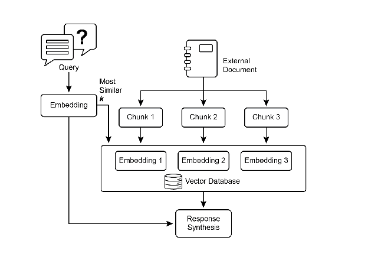
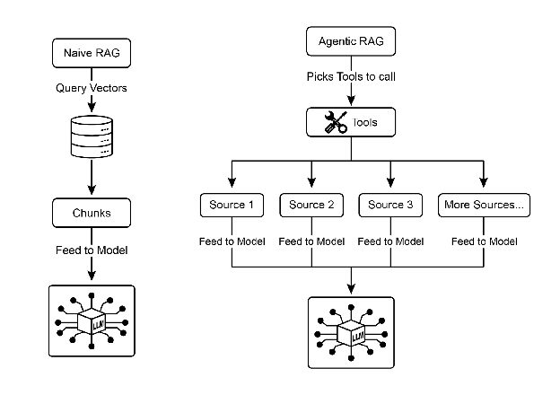
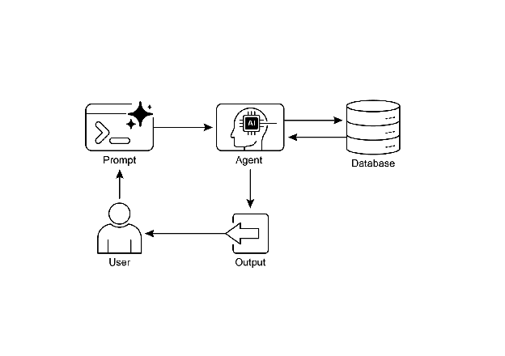
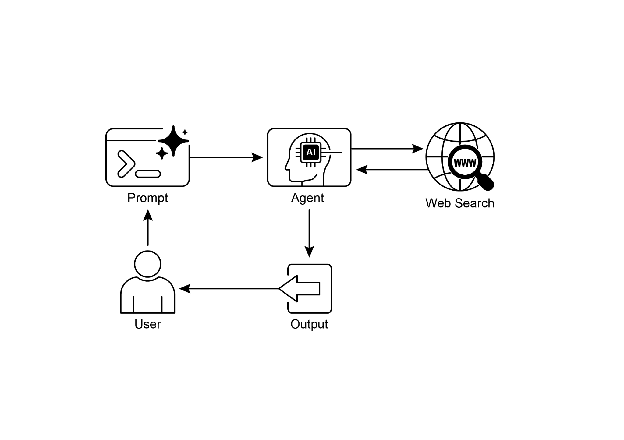

# Chapter 14: Knowledge Retrieval (RAG)

LLMs exhibit substantial capabilities in generating human-like text. However, their knowledge base is typically confined to the data on which they were trained, limiting their access to real-time information, specific company data, or highly specialized details. Knowledge Retrieval (RAG, or  Retrieval Augmented Generation), addresses this limitation. RAG enables LLMs to access and integrate external, current, and context-specific information, thereby enhancing the accuracy, relevance, and factual basis of their outputs.

For AI agents, this is crucial as it allows them to ground their actions and responses in real-time, verifiable data beyond their static training. This capability enables them to perform complex tasks accurately, such as accessing the latest company policies to answer a specific question or checking current inventory before placing an order. By integrating external knowledge, RAG transforms agents from simple conversationalists into effective, data-driven tools capable of executing meaningful work.

# Knowledge Retrieval (RAG) Pattern Overview

The Knowledge Retrieval (RAG) pattern significantly enhances the capabilities of LLMs by granting them access to external knowledge bases before generating a response. Instead of relying solely on their internal, pre-trained knowledge, RAG allows LLMs to "look up" information, much like a human might consult a book or search the internet. This process empowers LLMs to provide more accurate, up-to-date, and verifiable answers.

When a user poses a question or gives a prompt to an AI system using RAG, the query isn't sent directly to the LLM. Instead, the system first scours a vast external knowledge base—a highly organized library of documents, databases, or web pages—for relevant information. This search is not a simple keyword match; it's a "semantic search" that understands the user's intent and the meaning behind their words. This initial search pulls out the most pertinent snippets or "chunks" of information. These extracted pieces are then "augmented," or added, to the original prompt, creating a richer, more informed query. Finally, this enhanced prompt is sent to the LLM. With this additional context, the LLM can generate a response that is not only fluent and natural but also factually grounded in the retrieved data.

The RAG framework provides several significant benefits. It allows LLMs to access up-to-date information, thereby overcoming the constraints of their static training data. This approach also reduces the risk of "hallucination"—the generation of false information—by grounding responses in verifiable data. Moreover, LLMs can utilize specialized knowledge found in internal company documents or wikis. A vital advantage of this process is the capability to offer "citations," which pinpoint the exact source of information, thereby enhancing the trustworthiness and verifiability of the AI's responses..

To fully appreciate how RAG functions, it's essential to understand a few core concepts (see Fig.1):

**Embeddings**: In the context of LLMs, embeddings are numerical representations of text, such as words, phrases, or entire documents. These representations are in the form of a vector, which is a list of numbers. The key idea is to capture the semantic meaning and the relationships between different pieces of text in a mathematical space. Words or phrases with similar meanings will have embeddings that are closer to each other in this vector space. For instance, imagine a simple 2D graph. The word "cat" might be represented by the coordinates (2, 3), while "kitten" would be very close at (2.1, 3.1). In contrast, the word "car" would have a distant coordinate like (8, 1), reflecting its different meaning. In reality, these embeddings are in a much higher-dimensional space with hundreds or even thousands of dimensions, allowing for a very nuanced understanding of language.

**Text Similarity:** Text similarity refers to the measure of how alike two pieces of text are. This can be at a surface level, looking at the overlap of words (lexical similarity), or at a deeper, meaning-based level. In the context of RAG, text similarity is crucial for finding the most relevant information in the knowledge base that corresponds to a user's query. For instance, consider the sentences: "What is the capital of France?" and "Which city is the capital of France?". While the wording is different, they are asking the same question. A good text similarity model would recognize this and assign a high similarity score to these two sentences, even though they only share a few words. This is often calculated using the embeddings of the texts.

**Semantic Similarity and Distance:** Semantic similarity is a more advanced form of text similarity that focuses purely on the meaning and context of the text, rather than just the words used. It aims to understand if two pieces of text convey the same concept or idea. Semantic distance is the inverse of this; a high semantic similarity implies a low semantic distance, and vice versa. In RAG, semantic search relies on finding documents with the smallest semantic distance to the user's query. For instance, the phrases "a furry feline companion" and "a domestic cat" have no words in common besides "a". However, a model that understands semantic similarity would recognize that they refer to the same thing and would consider them to be highly similar. This is because their embeddings would be very close in the vector space, indicating a small semantic distance. This is the "smart search" that allows RAG to find relevant information even when the user's wording doesn't exactly match the text in the knowledge base.



Fig.1: RAG Core Concepts: Chunking, Embeddings, and Vector Database

**Chunking of Documents:** Chunking is the process of breaking down large documents into smaller, more manageable pieces, or "chunks." For a RAG system to work efficiently, it cannot feed entire large documents into the LLM. Instead, it processes these smaller chunks. The way documents are chunked is important for preserving the context and meaning of the information. For instance, instead of treating a 50-page user manual as a single block of text, a chunking strategy might break it down into sections, paragraphs, or even sentences. For instance, a section on "Troubleshooting" would be a separate chunk from the "Installation Guide." When a user asks a question about a specific problem, the RAG system can then retrieve the most relevant troubleshooting chunk, rather than the entire manual. This makes the retrieval process faster and the information provided to the LLM more focused and relevant to the user's immediate need. Once documents are chunked, the RAG system must employ a retrieval technique to find the most relevant pieces for a given query. The primary method is vector search, which uses embeddings and semantic distance to find chunks that are conceptually similar to the user's question. An older, but still valuable, technique is BM25, a keyword-based algorithm that ranks chunks based on term frequency without understanding semantic meaning. To get the best of both worlds, hybrid search approaches are often used, combining the keyword precision of BM25 with the contextual understanding of semantic search. This fusion allows for more robust and accurate retrieval, capturing both literal matches and conceptual relevance.

**Vector databases:** A vector database is a specialized type of database designed to store and query embeddings efficiently. After documents are chunked and converted into embeddings, these high-dimensional vectors are stored in a vector database. Traditional retrieval techniques, like keyword-based search, are excellent at finding documents containing exact words from a query but lack a deep understanding of language. They wouldn't recognize that "furry feline companion" means "cat." This is where vector databases excel. They are built specifically for semantic search. By storing text as numerical vectors, they can find results based on conceptual meaning, not just keyword overlap. When a user's query is also converted into a vector, the database uses highly optimized algorithms (like HNSW \- Hierarchical Navigable Small World) to rapidly search through millions of vectors and find the ones that are "closest" in meaning. This approach is far superior for RAG because it uncovers relevant context even if the user's phrasing is completely different from the source documents. In essence, while other techniques search for words, vector databases search for meaning. This technology is implemented in various forms, from managed databases like Pinecone and Weaviate to open-source solutions such as Chroma DB, Milvus, and Qdrant. Even existing databases can be augmented with vector search capabilities, as seen with Redis, Elasticsearch, and Postgres (using the pgvector extension). The core retrieval mechanisms are often powered by libraries like Meta AI's FAISS or Google Research's ScaNN, which are fundamental to the efficiency of these systems.

**RAG's Challenges:** Despite its power, the RAG pattern is not without its challenges. A primary issue arises when the information needed to answer a query is not confined to a single chunk but is spread across multiple parts of a document or even several documents. In such cases, the retriever might fail to gather all the necessary context, leading to an incomplete or inaccurate answer. The system's effectiveness is also highly dependent on the quality of the chunking and retrieval process; if irrelevant chunks are retrieved, it can introduce noise and confuse the LLM. Furthermore, effectively synthesizing information from potentially contradictory sources remains a significant hurdle for these systems.  Besides that, another challenge is that RAG requires the entire knowledge base to be pre-processed and stored in specialized databases, such as vector or graph databases, which is a considerable undertaking. Consequently, this knowledge requires periodic reconciliation to remain up-to-date, a crucial task when dealing with evolving sources like company wikis. This entire process can have a noticeable impact on performance, increasing latency, operational costs, and the number of tokens used in the final prompt.

In summary,  the Retrieval-Augmented Generation (RAG) pattern represents a significant leap forward in making AI more knowledgeable and reliable. By seamlessly integrating an external knowledge retrieval step into the generation process, RAG addresses some of the core limitations of standalone LLMs. The foundational concepts of embeddings and semantic similarity, combined with retrieval techniques like keyword and hybrid search, allow the system to intelligently find relevant information, which is made manageable through strategic chunking. This entire retrieval process is powered by specialized vector databases designed to store and efficiently query millions of embeddings at scale. While challenges in retrieving fragmented or contradictory information persist, RAG empowers LLMs to produce answers that are not only contextually appropriate but also anchored in verifiable facts, fostering greater trust and utility in AI.

**Graph RAG:** GraphRAG is an advanced form of Retrieval-Augmented Generation that utilizes a knowledge graph instead of a simple vector database for information retrieval. It answers complex queries by navigating the explicit relationships (edges) between data entities (nodes) within this structured knowledge base. A key advantage is its ability to synthesize answers from information fragmented across multiple documents, a common failing of traditional RAG. By understanding these connections, GraphRAG provides more contextually accurate and nuanced responses.

Use cases include complex financial analysis, connecting companies to market events, and scientific research for discovering relationships between genes and diseases. The primary drawback, however, is the significant complexity, cost, and expertise required to build and maintain a high-quality knowledge graph. This setup is also less flexible and can introduce higher latency compared to simpler vector search systems. The system's effectiveness is entirely dependent on the quality and completeness of the underlying graph structure. Consequently, GraphRAG offers superior contextual reasoning for intricate questions but at a much higher implementation and maintenance cost. In summary, it excels where deep, interconnected insights are more critical than the speed and simplicity of standard RAG.

**Agentic RAG:** An evolution of this pattern, known as **Agentic RAG** (see Fig.2), introduces a reasoning and decision-making layer to significantly enhance the reliability of information extraction. Instead of just retrieving and augmenting, an "agent"—a specialized AI component—acts as a critical gatekeeper and refiner of knowledge. Rather than passively accepting the initially retrieved data, this agent actively interrogates its quality, relevance, and completeness, as illustrated by the following scenarios.

First, an agent excels at reflection and source validation. If a user asks, "What is our company's policy on remote work?" a standard RAG might pull up a 2020 blog post alongside the official 2025 policy document. The agent, however, would analyze the documents' metadata, recognize the 2025 policy as the most current and authoritative source, and discard the outdated blog post before sending the correct context to the LLM for a precise answer.



Fig.2: Agentic RAG introduces a reasoning agent that actively evaluates, reconciles, and refines retrieved information to ensure a more accurate and trustworthy final response.

Second, an agent is adept at reconciling knowledge conflicts. Imagine a financial analyst asks, "What was Project Alpha's Q1 budget?" The system retrieves two documents: an initial proposal stating a €50,000 budget and a finalized financial report listing it as €65,000. An Agentic RAG would identify this contradiction, prioritize the financial report as the more reliable source, and provide the LLM with the verified figure, ensuring the final answer is based on the most accurate data.

Third, an agent can perform multi-step reasoning to synthesize complex answers. If a user asks, "How do our product's features and pricing compare to Competitor X's?" the agent would decompose this into separate sub-queries. It would initiate distinct searches for its own product's features, its pricing, Competitor X's features, and Competitor X's pricing. After gathering these individual pieces of information, the agent would synthesize them into a structured, comparative context before feeding it to the LLM, enabling a comprehensive response that a simple retrieval could not have produced.

Fourth, an agent can identify knowledge gaps and use external tools. Suppose a user asks, "What was the market's immediate reaction to our new product launched yesterday?" The agent searches the internal knowledge base, which is updated weekly, and finds no relevant information. Recognizing this gap, it can then activate a tool—such as a live web-search API—to find recent news articles and social media sentiment. The agent then uses this freshly gathered external information to provide an up-to-the-minute answer, overcoming the limitations of its static internal database.

**Challenges of Agentic RAG:** While powerful, the agentic layer introduces its own set of challenges. The primary drawback is a significant increase in complexity and cost. Designing, implementing, and maintaining the agent's decision-making logic and tool integrations requires substantial engineering effort and adds to computational expenses. This complexity can also lead to increased latency, as the agent's cycles of reflection, tool use, and multi-step reasoning take more time than a standard, direct retrieval process. Furthermore, the agent itself can become a new source of error; a flawed reasoning process could cause it to get stuck in useless loops, misinterpret a task, or improperly discard relevant information, ultimately degrading the quality of the final response.

### **In summary:** Agentic RAG represents a sophisticated evolution of the standard retrieval pattern, transforming it from a passive data pipeline into an active, problem-solving framework. By embedding a reasoning layer that can evaluate sources, reconcile conflicts, decompose complex questions, and use external tools, agents dramatically improve the reliability and depth of the generated answers. This advancement makes the AI more trustworthy and capable, though it comes with important trade-offs in system complexity, latency, and cost that must be carefully managed.

# Practical Applications & Use Cases

Knowledge Retrieval (RAG) is changing how Large Language Models (LLMs) are utilized across various industries, enhancing their ability to provide more accurate and contextually relevant responses.

Applications include:

* **Enterprise Search and Q\&A:** Organizations can develop internal chatbots that respond to employee inquiries using internal documentation such as HR policies, technical manuals, and product specifications. The RAG system extracts relevant sections from these documents to inform the LLM's response.
* **Customer Support and Helpdesks:** RAG-based systems can offer precise and consistent responses to customer queries by accessing information from product manuals, frequently asked questions (FAQs), and support tickets. This can reduce the need for direct human intervention for routine issues.
* **Personalized Content Recommendation:** Instead of basic keyword matching, RAG can identify and retrieve content (articles, products) that is semantically related to a user's preferences or previous interactions, leading to more relevant recommendations.
* **News and Current Events Summarization:** LLMs can be integrated with real-time news feeds. When prompted about a current event, the RAG system retrieves recent articles, allowing the LLM to produce an up-to-date summary.

By incorporating external knowledge, RAG extends the capabilities of LLMs beyond simple communication to function as knowledge processing systems.

# Hands-On Code Example (ADK)

To illustrate the Knowledge Retrieval (RAG) pattern,  let's see three examples.

First, is how to use Google Search to do RAG and ground LLMs to search results. Since RAG involves accessing external information, the Google Search tool is a direct example of a built-in retrieval mechanism that can augment an LLM's knowledge.

```python
from google.adk.tools import google_search
from google.adk.agents import Agent

search_agent = Agent(
    name="research_assistant",
    model="gemini-2.0-flash-exp",
    instruction="You help users research topics. When asked, use the Google Search tool",
    tools=[google_search]
)
```

Second, this section explains how to utilize Vertex AI RAG capabilities within the Google ADK. The code provided demonstrates the initialization of VertexAiRagMemoryService from the ADK. This allows for establishing a connection to a Google Cloud Vertex AI RAG Corpus. The service is configured by specifying the corpus resource name and optional parameters such as SIMILARITY\_TOP\_K and VECTOR\_DISTANCE\_THRESHOLD. These parameters influence the retrieval process. SIMILARITY\_TOP\_K defines the number of top similar results to be retrieved. VECTOR\_DISTANCE\_THRESHOLD sets a limit on the semantic distance for the retrieved results. This setup enables agents to perform scalable and persistent semantic knowledge retrieval from the designated RAG Corpus. The process effectively integrates Google Cloud's RAG functionalities into an ADK agent, thereby supporting the development of responses grounded in factual data.

```python
# Import the necessary VertexAiRagMemoryService class from the google.adk.memory module.
from google.adk.memory import VertexAiRagMemoryService

RAG_CORPUS_RESOURCE_NAME = "projects/your-gcp-project-id/locations/us-central1/ragCorpora/your-corpus-id"

# Define an optional parameter for the number of top similar results to retrieve.
# This controls how many relevant document chunks the RAG service will return.
SIMILARITY_TOP_K = 5

# Define an optional parameter for the vector distance threshold.
# This threshold determines the maximum semantic distance allowed for retrieved results;
# results with a distance greater than this value might be filtered out.
VECTOR_DISTANCE_THRESHOLD = 0.7

# Initialize an instance of VertexAiRagMemoryService.
# This sets up the connection to your Vertex AI RAG Corpus.
# - rag_corpus: Specifies the unique identifier for your RAG Corpus.
# - similarity_top_k: Sets the maximum number of similar results to fetch.
# - vector_distance_threshold: Defines the similarity threshold for filtering results.
memory_service = VertexAiRagMemoryService(
    rag_corpus=RAG_CORPUS_RESOURCE_NAME,
    similarity_top_k=SIMILARITY_TOP_K,
    vector_distance_threshold=VECTOR_DISTANCE_THRESHOLD
)
```

# Hands-On Code Example (LangChain)

Third, let's walk through a complete example using LangChain.

```python
import os
import requests
from typing import List, Dict, Any, TypedDict

from langchain_community.document_loaders import TextLoader
from langchain_core.documents import Document
from langchain_core.prompts import ChatPromptTemplate
from langchain_core.output_parsers import StrOutputParser
from langchain_community.embeddings import OpenAIEmbeddings
from langchain_community.vectorstores import Weaviate
from langchain_openai import ChatOpenAI
from langchain.text_splitter import CharacterTextSplitter
from langchain.schema.runnable import RunnablePassthrough
from langgraph.graph import StateGraph, END

import weaviate
from weaviate.embedded import EmbeddedOptions
import dotenv

# Load environment variables (e.g., OPENAI_API_KEY)
dotenv.load_dotenv()

# Set your OpenAI API key (ensure it's loaded from .env or set here)
# os.environ["OPENAI_API_KEY"] = "YOUR_OPENAI_API_KEY"

# --- 1. Data Preparation (Preprocessing) ---

# Load data
url = "https://github.com/langchain-ai/langchain/blob/master/docs/docs/how_to/state_of_the_union.txt"
res = requests.get(url)
with open("state_of_the_union.txt", "w") as f:
    f.write(res.text)

loader = TextLoader('./state_of_the_union.txt')
documents = loader.load()

# Chunk documents
text_splitter = CharacterTextSplitter(chunk_size=500, chunk_overlap=50)
chunks = text_splitter.split_documents(documents)

# Embed and store chunks in Weaviate
client = weaviate.Client(
    embedded_options = EmbeddedOptions()
)

vectorstore = Weaviate.from_documents(
    client = client,
    documents = chunks,
    embedding = OpenAIEmbeddings(),
    by_text = False
)

# Define the retriever
retriever = vectorstore.as_retriever()

# Initialize LLM
llm = ChatOpenAI(model_name="gpt-3.5-turbo", temperature=0)

# --- 2. Define the State for LangGraph ---

class RAGGraphState(TypedDict):
    question: str
    documents: List[Document]
    generation: str

# --- 3. Define the Nodes (Functions) ---

def retrieve_documents_node(state: RAGGraphState) -> RAGGraphState:
    """Retrieves documents based on the user's question."""
    question = state["question"]
    documents = retriever.invoke(question)
    return {"documents": documents, "question": question, "generation": ""}

def generate_response_node(state: RAGGraphState) -> RAGGraphState:
    """Generates a response using the LLM based on retrieved documents."""
    question = state["question"]
    documents = state["documents"]

    # Prompt template from the PDF
    template = """You are an assistant for question-answering tasks. Use the following pieces of retrieved context to answer the question. If you don't know the answer, just say that you don't know. Use three sentences maximum and keep the answer concise.
Question: {question}
Context: {context}
Answer: """

    prompt = ChatPromptTemplate.from_template(template)

    # Format the context from the documents
    context = "\n\n".join([doc.page_content for doc in documents])

    # Create the RAG chain
    rag_chain = prompt | llm | StrOutputParser()

    # Invoke the chain
    generation = rag_chain.invoke({"context": context, "question": question})

    return {"question": question, "documents": documents, "generation": generation}

# --- 4. Build the LangGraph Graph ---

workflow = StateGraph(RAGGraphState)

# Add nodes
workflow.add_node("retrieve", retrieve_documents_node)
workflow.add_node("generate", generate_response_node)

# Set the entry point
workflow.set_entry_point("retrieve")

# Add edges (transitions)
workflow.add_edge("retrieve", "generate")
workflow.add_edge("generate", END)

# Compile the graph
app = workflow.compile()

# --- 5. Run the RAG Application ---

if __name__ == "__main__":
    print("\n--- Running RAG Query ---")
    query = "What did the president say about Justice Breyer"
    inputs = {"question": query}

    for s in app.stream(inputs):
        print(s)

    print("\n--- Running another RAG Query ---")
    query_2 = "What did the president say about the economy?"
    inputs_2 = {"question": query_2}

    for s in app.stream(inputs_2):
        print(s)
```

This Python code illustrates a Retrieval-Augmented Generation (RAG) pipeline implemented with LangChain and LangGraph. The process begins with the creation of a knowledge base derived from a text document, which is segmented into chunks and transformed into embeddings. These embeddings are then stored in a Weaviate vector store, facilitating efficient information retrieval. A StateGraph in LangGraph is utilized to manage the workflow between two key functions: \`retrieve\_documents\_node\` and \`generate\_response\_node\`. The \`retrieve\_documents\_node\` function queries the vector store to identify relevant document chunks based on the user's input. Subsequently, the \`generate\_response\_node\` function utilizes the retrieved information and a predefined prompt template to produce a response using an OpenAI Large Language Model (LLM). The \`app.stream\` method allows the execution of queries through the RAG pipeline, demonstrating the system's capacity to generate contextually relevant outputs.

# At Glance

**What:** LLMs possess impressive text generation abilities but are fundamentally limited by their training data. This knowledge is static, meaning it doesn't include real-time information or private, domain-specific data. Consequently, their responses can be outdated, inaccurate, or lack the specific context required for specialized tasks. This gap restricts their reliability for applications demanding current and factual answers.

**Why:** The Retrieval-Augmented Generation (RAG) pattern provides a standardized solution by connecting LLMs to external knowledge sources. When a query is received, the system first retrieves relevant information snippets from a specified knowledge base. These snippets are then appended to the original prompt, enriching it with timely and specific context. This augmented prompt is then sent to the LLM, enabling it to generate a response that is accurate, verifiable, and grounded in external data. This process effectively transforms the LLM from a closed-book reasoner into an open-book one, significantly enhancing its utility and trustworthiness.

**Rule of thumb:** Use this pattern when you need an LLM to answer questions or generate content based on specific, up-to-date, or proprietary information that was not part of its original training data. It is ideal for building Q\&A systems over internal documents, customer support bots, and applications requiring verifiable, fact-based responses with citations.

**Visual summary**



Knowledge Retrieval pattern: an AI agent to query and retrieve information from structured databases



Fig. 3: Knowledge Retrieval pattern: an AI agent to find and synthesize information from the public internet in response to user queries.

# Key Takeaways

* Knowledge Retrieval (RAG) enhances LLMs by allowing them to access external, up-to-date, and specific information.
* The process involves Retrieval (searching a knowledge base for relevant snippets) and Augmentation (adding these snippets to the LLM's prompt).
* RAG helps LLMs overcome limitations like outdated training data, reduces "hallucinations," and enables domain-specific knowledge integration.
* RAG allows for attributable answers, as the LLM's response is grounded in retrieved sources.
* GraphRAG leverages a knowledge graph to understand the relationships between different pieces of information, allowing it to answer complex questions that require synthesizing data from multiple sources.
* Agentic RAG moves beyond simple information retrieval by using an intelligent agent to actively reason about, validate, and refine external knowledge, ensuring a more accurate and reliable answer.
* Practical applications span enterprise search, customer support, legal research, and personalized recommendations.

# Conclusion

In conclusion, Retrieval-Augmented Generation (RAG) addresses the core limitation of a Large Language Model's static knowledge by connecting it to external, up-to-date data sources. The process works by first retrieving relevant information snippets and then augmenting the user's prompt, enabling the LLM to generate more accurate and contextually aware responses. This is made possible by foundational technologies like embeddings, semantic search, and vector databases, which find information based on meaning rather than just keywords. By grounding outputs in verifiable data, RAG significantly reduces factual errors and allows for the use of proprietary information, enhancing trust through citations.

An advanced evolution, Agentic RAG, introduces a reasoning layer that actively validates, reconciles, and synthesizes retrieved knowledge for even greater reliability. Similarly, specialized approaches like GraphRAG leverage knowledge graphs to navigate explicit data relationships, allowing the system to synthesize answers to highly complex, interconnected queries. This agent can resolve conflicting information, perform multi-step queries, and use external tools to find missing data. While these advanced methods add complexity and latency, they drastically improve the depth and trustworthiness of the final response. Practical applications for these patterns are already transforming industries, from enterprise search and customer support to personalized content delivery. Despite the challenges, RAG is a crucial pattern for making AI more knowledgeable, reliable, and useful. Ultimately, it transforms LLMs from closed-book conversationalists into powerful, open-book reasoning tools.

# References

1. Lewis, P., et al. (2020). *Retrieval-Augmented Generation for Knowledge-Intensive NLP Tasks*. [https://arxiv.org/abs/2005.11401](https://arxiv.org/abs/2005.11401)
2. Google AI for Developers Documentation.  *Retrieval Augmented Generation \- [https://cloud.google.com/vertex-ai/generative-ai/docs/rag-engine/rag-overview](https://cloud.google.com/vertex-ai/generative-ai/docs/rag-engine/rag-overview)*
3. Retrieval-Augmented Generation with Graphs (GraphRAG), [https://arxiv.org/abs/2501.00309](https://arxiv.org/abs/2501.00309)
4. LangChain and LangGraph: Leonie Monigatti, "Retrieval-Augmented Generation (RAG): From Theory to LangChain Implementation,"  [*https://medium.com/data-science/retrieval-augmented-generation-rag-from-theory-to-langchain-implementation-4e9bd5f6a4f2*](https://medium.com/data-science/retrieval-augmented-generation-rag-from-theory-to-langchain-implementation-4e9bd5f6a4f2)
5.  Google Cloud Vertex AI RAG Corpus [*https://cloud.google.com/vertex-ai/generative-ai/docs/rag-engine/manage-your-rag-corpus\#corpus-management*](https://cloud.google.com/vertex-ai/generative-ai/docs/rag-engine/manage-your-rag-corpus#corpus-management)
