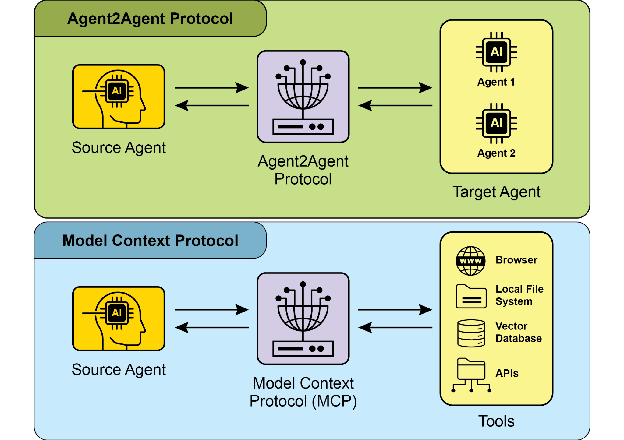
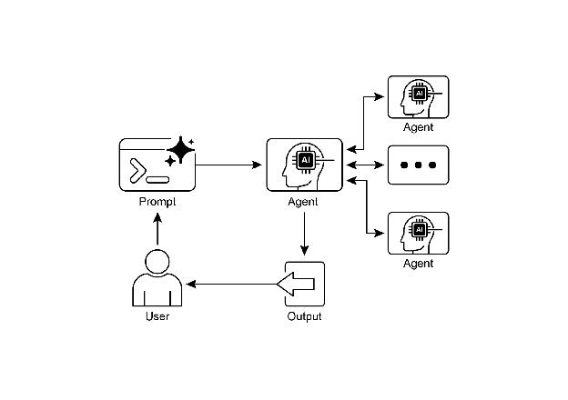

# Chapter 15: Inter-Agent Communication (A2A)

개별 AI agent는 고급 기능을 갖추고 있어도 복잡하고 다면적인 문제를 다룰 때 종종 한계에 직면함. 이를 극복하기 위해 Inter-Agent Communication (A2A)는 다양한 AI agent들이 서로 다른 프레임워크로 구축되었더라도 효과적으로 협업할 수 있도록 함. 이 협업에는 원활한 조정, 작업 위임, 정보 교환이 포함됨.

Google의 A2A 프로토콜은 이러한 범용 통신을 촉진하도록 설계된 개방형 표준임. 본 장에서는 A2A, 실제 응용 사례, Google ADK 내에서의 구현을 살펴봄.

# Inter-Agent Communication 패턴 개요

Agent2Agent (A2A) 프로토콜은 서로 다른 AI agent 프레임워크 간의 통신과 협업을 가능하게 하도록 설계된 개방형 표준임. 상호운용성을 보장하여 LangGraph, CrewAI, Google ADK 같은 기술로 개발된 AI agent들이 원래 출처나 프레임워크 차이에 관계없이 함께 작동할 수 있도록 함.

A2A는 Atlassian, Box, LangChain, MongoDB, Salesforce, SAP, ServiceNow를 포함한 다양한 기술 회사와 서비스 제공업체의 지원을 받고 있음. Microsoft는 A2A를 Azure AI Foundry 및 Copilot Studio에 통합할 계획이며, 이는 개방형 프로토콜에 대한 약속을 보여줌. 또한 Auth0와 SAP는 자사 플랫폼과 agent에 A2A 지원을 통합하고 있음.

오픈소스 프로토콜로서 A2A는 진화와 광범위한 채택을 촉진하기 위해 커뮤니티 기여를 환영함.

## A2A의 핵심 개념

A2A 프로토콜은 여러 핵심 개념을 기반으로 agent 상호작용을 위한 구조화된 접근 방식을 제공함. 이러한 개념을 철저히 이해하는 것은 A2A 호환 시스템을 개발하거나 통합하는 모든 사람에게 중요함. A2A의 기본 요소로는 Core Actors, Agent Card, Agent Discovery, Communication and Tasks, Interaction mechanisms, Security가 있으며, 이들을 모두 자세히 검토할 예정임.

**Core Actors:** A2A는 세 가지 주요 엔티티를 포함함:

* User: Agent 지원 요청을 시작함.
* A2A Client (Client Agent): 사용자를 대신하여 작업이나 정보를 요청하는 애플리케이션 또는 AI agent.
* A2A Server (Remote Agent): 클라이언트 요청을 처리하고 결과를 반환하는 HTTP 엔드포인트를 제공하는 AI agent 또는 시스템. Remote agent는 "불투명한" 시스템으로 작동하며, 이는 클라이언트가 내부 운영 세부 사항을 이해할 필요가 없음을 의미함.

**Agent Card:** Agent의 디지털 신원은 Agent Card로 정의되며, 일반적으로 JSON 파일임. 이 파일에는 클라이언트 상호작용과 자동 검색을 위한 주요 정보가 포함되어 있으며, agent의 신원, 엔드포인트 URL, 버전이 포함됨. 또한 streaming이나 push notification과 같은 지원되는 기능, 특정 skill, 기본 입출력 모드, 인증 요구사항을 자세히 설명함. 아래는 WeatherBot의 Agent Card 예시임.

```json
{
  "name": "WeatherBot",
  "description": "Provides accurate weather forecasts and historical data.",
  "url": "http://weather-service.example.com/a2a",
  "version": "1.0.0",
  "capabilities": {
    "streaming": true,
    "pushNotifications": false,
    "stateTransitionHistory": true
  },
  "authentication": {
    "schemes": [
      "apiKey"
    ]
  },
  "defaultInputModes": [
    "text"
  ],
  "defaultOutputModes": [
    "text"
  ],
  "skills": [
    {
      "id": "get_current_weather",
      "name": "Get Current Weather",
      "description": "Retrieve real-time weather for any location.",
      "inputModes": [
        "text"
      ],
      "outputModes": [
        "text"
      ],
      "examples": [
        "What's the weather in Paris?",
        "Current conditions in Tokyo"
      ],
      "tags": [
        "weather",
        "current",
        "real-time"
      ]
    },
    {
      "id": "get_forecast",
      "name": "Get Forecast",
      "description": "Get 5-day weather predictions.",
      "inputModes": [
        "text"
      ],
      "outputModes": [
        "text"
      ],
      "examples": [
        "5-day forecast for New York",
        "Will it rain in London this weekend?"
      ],
      "tags": [
        "weather",
        "forecast",
        "prediction"
      ]
    }
  ]
}
```

**Agent discovery:** 클라이언트가 사용 가능한 A2A Server의 기능을 설명하는 Agent Card를 찾을 수 있도록 함. 이 프로세스를 위한 여러 전략이 존재함:

* Well-Known URI: Agent가 표준화된 경로(예: /.well-known/agent.json)에 Agent Card를 호스팅함. 이 접근 방식은 공개 또는 도메인별 사용을 위한 광범위하고 종종 자동화된 접근성을 제공함.
* Curated Registries: Agent Card가 게시되고 특정 기준에 따라 쿼리할 수 있는 중앙 집중식 카탈로그를 제공함. 중앙 집중식 관리와 액세스 제어가 필요한 엔터프라이즈 환경에 적합함.
* Direct Configuration: Agent Card 정보가 임베드되거나 비공개로 공유됨. 동적 검색이 중요하지 않은 긴밀하게 결합된 또는 비공개 시스템에 적합함.

선택한 방법에 관계없이 Agent Card 엔드포인트를 보호하는 것이 중요함. 특히 카드에 민감한(비밀은 아니지만) 정보가 포함되어 있는 경우 액세스 제어, mutual TLS (mTLS) 또는 네트워크 제한을 통해 달성할 수 있음.

**Communications and Tasks:** A2A 프레임워크에서 통신은 비동기 task를 중심으로 구조화되며, task는 장기 실행 프로세스의 기본 작업 단위를 나타냄. 각 task에는 고유 식별자가 할당되고 제출됨, 작업 중, 완료됨 등 일련의 상태를 거치며, 이 설계는 복잡한 작업에서 병렬 처리를 지원함. Agent 간의 통신은 Message를 통해 발생함.

이 통신에는 메시지를 설명하는 키-값 메타데이터(우선순위나 생성 시간 등)인 attributes와 일반 텍스트, 파일 또는 구조화된 JSON 데이터와 같이 전달되는 실제 콘텐츠를 담고 있는 하나 이상의 parts가 포함됨. Task 중에 agent가 생성하는 실질적 출력을 artifacts라고 함. 메시지처럼 artifact도 하나 이상의 part로 구성되며 결과가 사용 가능해지면 점진적으로 스트리밍될 수 있음. A2A 프레임워크 내의 모든 통신은 페이로드에 JSON-RPC 2.0 프로토콜을 사용하여 HTTP(S)를 통해 수행됨. 여러 상호작용에 걸쳐 연속성을 유지하기 위해 서버 생성 contextId를 사용하여 관련 task를 그룹화하고 컨텍스트를 보존함.

**Interaction Mechanisms**: Request/Response (Polling) Server-Sent Events (SSE). A2A는 다양한 AI 애플리케이션 요구사항에 맞는 여러 상호작용 방법을 제공하며, 각각 고유한 메커니즘을 가짐:

* Synchronous Request/Response: 빠르고 즉각적인 작업용. 이 모델에서 클라이언트는 요청을 보내고 서버가 이를 처리하고 단일 동기 교환으로 완전한 응답을 반환할 때까지 적극적으로 대기함.
* Asynchronous Polling: 처리 시간이 더 오래 걸리는 task에 적합함. 클라이언트가 요청을 보내면 서버는 즉시 "작업 중" 상태와 task ID로 확인함. 그런 다음 클라이언트는 다른 작업을 자유롭게 수행할 수 있으며, task가 "완료됨" 또는 "실패"로 표시될 때까지 새 요청을 보내 주기적으로 서버의 task 상태를 폴링할 수 있음.
* Streaming Updates (Server-Sent Events - SSE): 실시간 점진적 결과를 받는 데 이상적임. 이 방법은 서버에서 클라이언트로 지속적인 단방향 연결을 설정함. Remote agent가 클라이언트의 여러 요청 없이 상태 변경이나 부분 결과와 같은 업데이트를 지속적으로 푸시할 수 있음.
* Push Notifications (Webhooks): 일정한 연결 유지 또는 빈번한 폴링이 비효율적인 매우 장기 실행 또는 리소스 집약적 task용으로 설계됨. 클라이언트는 webhook URL을 등록할 수 있으며, task의 상태가 크게 변경될 때(예: 완료 시) 서버가 해당 URL로 비동기 알림("푸시")을 보냄.

Agent Card는 agent가 streaming 또는 push notification 기능을 지원하는지 여부를 명시함. 또한 A2A는 모달리티에 구애받지 않으며, 텍스트뿐만 아니라 오디오 및 비디오와 같은 다른 데이터 유형에 대해서도 이러한 상호작용 패턴을 촉진할 수 있어 풍부한 다중 모드 AI 애플리케이션을 가능하게 함. Streaming 및 push notification 기능은 모두 Agent Card 내에 명시됨.

```json
// Synchronous Request Example
{
  "jsonrpc": "2.0",
  "id": "1",
  "method": "sendTask",
  "params": {
    "id": "task-001",
    "sessionId": "session-001",
    "message": {
      "role": "user",
      "parts": [
        {
          "type": "text",
          "text": "What is the exchange rate from USD to EUR?"
        }
      ]
    },
    "acceptedOutputModes": ["text/plain"],
    "historyLength": 5
  }
}
```

동기 요청은 sendTask 메서드를 사용하며, 클라이언트가 쿼리에 대한 단일하고 완전한 답변을 요청하고 기대함. 대조적으로 streaming 요청은 sendTaskSubscribe 메서드를 사용하여 지속적인 연결을 설정하고, agent가 시간이 지남에 따라 여러 점진적 업데이트 또는 부분 결과를 다시 보낼 수 있도록 함.

```json
// Streaming Request Example
{
  "jsonrpc": "2.0",
  "id": "2",
  "method": "sendTaskSubscribe",
  "params": {
    "id": "task-002",
    "sessionId": "session-001",
    "message": {
      "role": "user",
      "parts": [
        {
          "type": "text",
          "text": "What's the exchange rate for JPY to GBP today?"
        }
      ]
    },
    "acceptedOutputModes": ["text/plain"],
    "historyLength": 5
  }
}
```

**Security:** Inter-Agent Communication (A2A): Inter-Agent Communication (A2A)는 시스템 아키텍처의 중요한 구성 요소로, agent 간 안전하고 원활한 데이터 교환을 가능하게 함. 여러 내장 메커니즘을 통해 견고성과 무결성을 보장함.

Mutual Transport Layer Security (TLS): 암호화되고 인증된 연결을 설정하여 무단 액세스 및 데이터 가로채기를 방지하고 안전한 통신을 보장함.

Comprehensive Audit Logs: 모든 inter-agent 통신이 세심하게 기록되며, 정보 흐름, 관련 agent 및 작업에 대한 세부 정보가 포함됨. 이 감사 추적은 책임성, 문제 해결 및 보안 분석에 중요함.

Agent Card Declaration: 인증 요구사항은 agent의 신원, 기능 및 보안 정책을 설명하는 구성 artifact인 Agent Card에 명시적으로 선언됨. 이는 인증 관리를 중앙 집중화하고 단순화함.

Credential Handling: Agent는 일반적으로 HTTP 헤더를 통해 전달되는 OAuth 2.0 토큰 또는 API 키와 같은 보안 자격 증명을 사용하여 인증함. 이 방법은 URL이나 메시지 본문에 자격 증명이 노출되는 것을 방지하여 전반적인 보안을 강화함.

## A2A vs. MCP

A2A는 Anthropic의 Model Context Protocol (MCP)을 보완하는 프로토콜임(그림 1 참조). MCP는 agent와 외부 데이터 및 도구와의 상호작용을 위한 컨텍스트 구조화에 중점을 두는 반면, A2A는 agent 간의 조정과 통신을 촉진하여 작업 위임과 협업을 가능하게 함.



Fig.1: A2A와 MCP 프로토콜 비교

A2A의 목표는 복잡한 multi-agent AI 시스템 개발에서 효율성을 향상시키고, 통합 비용을 절감하며, 혁신과 상호운용성을 촉진하는 것임. 따라서 협업 및 상호운용 가능한 AI agent 시스템을 구축하는 데 있어 효과적인 설계, 구현 및 적용을 위해서는 A2A의 핵심 구성 요소와 운영 방법에 대한 철저한 이해가 필수적임.

# 실제 응용 사례 및 사용 사례

Inter-Agent Communication은 다양한 도메인에서 정교한 AI 솔루션을 구축하는 데 필수적이며, 모듈화, 확장성 및 향상된 지능을 가능하게 함.

* **Multi-Framework Collaboration:** A2A의 주요 사용 사례는 기본 프레임워크(예: ADK, LangChain, CrewAI)에 관계없이 독립적인 AI agent가 통신하고 협업할 수 있도록 하는 것임. 이는 서로 다른 agent가 문제의 다양한 측면을 전문화하는 복잡한 multi-agent 시스템을 구축하는 데 기본적임.
* **Automated Workflow Orchestration:** 엔터프라이즈 환경에서 A2A는 agent가 작업을 위임하고 조정할 수 있도록 하여 복잡한 워크플로를 촉진할 수 있음. 예를 들어, agent가 초기 데이터 수집을 처리한 다음 분석을 위해 다른 agent에게 위임하고, 최종적으로 보고서 생성을 위해 세 번째 agent에게 위임하며, 모두 A2A 프로토콜을 통해 통신할 수 있음.
* **Dynamic Information Retrieval:** Agent는 실시간 정보를 검색하고 교환하기 위해 통신할 수 있음. 주 agent가 전문화된 "데이터 가져오기 agent"에게 실시간 시장 데이터를 요청할 수 있으며, 해당 agent는 외부 API를 사용하여 정보를 수집하고 다시 전송함.

# 실습 코드 예제

A2A 프로토콜의 실제 응용을 살펴보겠음. [https://github.com/google-a2a/a2a-samples/tree/main/samples](https://github.com/google-a2a/a2a-samples/tree/main/samples)의 리포지토리는 LangGraph, CrewAI, Azure AI Foundry, AG2와 같은 다양한 agent 프레임워크가 A2A를 사용하여 통신하는 방법을 보여주는 Java, Go, Python 예제를 제공함. 이 리포지토리의 모든 코드는 Apache 2.0 라이선스로 릴리스됨. A2A의 핵심 개념을 추가로 설명하기 위해 Google 인증 도구를 사용하는 ADK 기반 agent를 사용하여 A2A Server를 설정하는 데 중점을 둔 코드 발췌를 검토할 예정임. [https://github.com/google-a2a/a2a-samples/blob/main/samples/python/agents/birthday_planner_adk/calendar_agent/adk_agent.py](https://github.com/google-a2a/a2a-samples/blob/main/samples/python/agents/birthday_planner_adk/calendar_agent/adk_agent.py) 참조

```python
import datetime
from google.adk.agents import LlmAgent # type: ignore[import-untyped]
from google.adk.tools.google_api_tool import CalendarToolset # type: ignore[import-untyped]

async def create_agent(client_id, client_secret) -> LlmAgent:
    """Constructs the ADK agent."""
    toolset = CalendarToolset(client_id=client_id, client_secret=client_secret)
    return LlmAgent(
        model='gemini-2.0-flash-001',
        name='calendar_agent',
        description="An agent that can help manage a user's calendar",
        instruction=f""" You are an agent that can help manage a user's calendar.
Users will request information about the state of their calendar
or to make changes to their calendar.
Use the provided tools for interacting with the calendar API.
If not specified, assume the calendar the user wants is the 'primary' calendar.
When using the Calendar API tools, use well-formed RFC3339 timestamps.
Today is {datetime.datetime.now()}.
""",
        tools=await toolset.get_tools(),
    )
```

이 Python 코드는 ADK LlmAgent를 구성하는 비동기 함수 `create_agent`를 정의함. 제공된 클라이언트 자격 증명을 사용하여 Google Calendar API에 액세스하기 위해 `CalendarToolset`을 초기화하는 것으로 시작함. 이후 지정된 Gemini 모델, 설명적인 이름, 사용자의 캘린더 관리를 위한 지침으로 구성된 `LlmAgent` 인스턴스가 생성됨. Agent에는 `CalendarToolset`의 캘린더 도구가 제공되어 Calendar API와 상호작용하고 캘린더 상태 또는 수정에 관한 사용자 쿼리에 응답할 수 있음. Agent의 지침에는 시간적 컨텍스트를 위해 현재 날짜가 동적으로 통합됨. Agent가 어떻게 구성되는지 설명하기 위해 GitHub의 A2A 샘플에 있는 calendar_agent의 주요 섹션을 살펴보겠음.

아래 코드는 특정 지침 및 도구로 agent가 정의되는 방법을 보여줌. 이 기능을 설명하는 데 필요한 코드만 표시되었음을 참고하며, 전체 파일은 다음에서 액세스 가능함: [https://github.com/a2aproject/a2a-samples/blob/main/samples/python/agents/birthday_planner_adk/calendar_agent/__main__.py](https://github.com/a2aproject/a2a-samples/blob/main/samples/python/agents/birthday_planner_adk/calendar_agent/__main__.py)

```python
def main(host: str, port: int):
    # Verify an API key is set.
    # Not required if using Vertex AI APIs.
    if os.getenv('GOOGLE_GENAI_USE_VERTEXAI') != 'TRUE' and not os.getenv(
        'GOOGLE_API_KEY'
    ):
        raise ValueError(
            'GOOGLE_API_KEY environment variable not set and '
            'GOOGLE_GENAI_USE_VERTEXAI is not TRUE.'
        )

    skill = AgentSkill(
        id='check_availability',
        name='Check Availability',
        description="Checks a user's availability for a time using their Google Calendar",
        tags=['calendar'],
        examples=['Am I free from 10am to 11am tomorrow?'],
    )

    agent_card = AgentCard(
        name='Calendar Agent',
        description="An agent that can manage a user's calendar",
        url=f'http://{host}:{port}/',
        version='1.0.0',
        defaultInputModes=['text'],
        defaultOutputModes=['text'],
        capabilities=AgentCapabilities(streaming=True),
        skills=[skill],
    )

    adk_agent = asyncio.run(create_agent(
        client_id=os.getenv('GOOGLE_CLIENT_ID'),
        client_secret=os.getenv('GOOGLE_CLIENT_SECRET'),
    ))

    runner = Runner(
        app_name=agent_card.name,
        agent=adk_agent,
        artifact_service=InMemoryArtifactService(),
        session_service=InMemorySessionService(),
        memory_service=InMemoryMemoryService(),
    )

    agent_executor = ADKAgentExecutor(runner, agent_card)

    async def handle_auth(request: Request) -> PlainTextResponse:
        await agent_executor.on_auth_callback(
            str(request.query_params.get('state')), str(request.url)
        )
        return PlainTextResponse('Authentication successful.')

    request_handler = DefaultRequestHandler(
        agent_executor=agent_executor, task_store=InMemoryTaskStore()
    )

    a2a_app = A2AStarletteApplication(
        agent_card=agent_card, http_handler=request_handler
    )

    routes = a2a_app.routes()
    routes.append(
        Route(
            path='/authenticate',
            methods=['GET'],
            endpoint=handle_auth,
        )
    )

    app = Starlette(routes=routes)

    uvicorn.run(app, host=host, port=port)

if __name__ == '__main__':
    main()
```

이 Python 코드는 Google Calendar를 사용하여 사용자 가용성을 확인하는 A2A 호환 "Calendar Agent"를 설정하는 것을 보여줌. 인증 목적을 위해 API 키 또는 Vertex AI 구성을 확인하는 것이 포함됨. "check_availability" skill을 포함한 agent의 기능은 agent의 네트워크 주소도 지정하는 AgentCard 내에 정의됨. 이후 ADK agent가 생성되며, artifact, 세션 및 메모리 관리를 위한 in-memory 서비스로 구성됨. 코드는 그런 다음 Starlette 웹 애플리케이션을 초기화하고, 인증 콜백과 A2A 프로토콜 핸들러를 통합하며, HTTP를 통해 agent를 노출하기 위해 Uvicorn을 사용하여 실행함.

이러한 예제는 기능 정의부터 웹 서비스로 실행하기까지 A2A 호환 agent를 구축하는 프로세스를 보여줌. Agent Card와 ADK를 활용하여 개발자는 Google Calendar와 같은 도구와 통합할 수 있는 상호운용 가능한 AI agent를 만들 수 있음. 이 실용적 접근 방식은 multi-agent 생태계를 구축하는 데 있어 A2A의 적용을 보여줌.

A2A에 대한 추가 탐색은 [https://www.trickle.so/blog/how-to-build-google-a2a-project](https://www.trickle.so/blog/how-to-build-google-a2a-project)의 코드 데모를 통해 권장됨. 이 링크에서 사용 가능한 리소스에는 Python 및 JavaScript의 샘플 A2A 클라이언트 및 서버, multi-agent 웹 애플리케이션, 명령줄 인터페이스, 다양한 agent 프레임워크에 대한 예제 구현이 포함됨.

# 한눈에 보기

**What:** 개별 AI agent, 특히 서로 다른 프레임워크로 구축된 agent는 복잡하고 다면적인 문제를 단독으로 해결하는 데 어려움을 겪는 경우가 많음. 주요 과제는 효과적으로 통신하고 협업할 수 있도록 하는 공통 언어 또는 프로토콜의 부재임. 이러한 고립은 여러 전문화된 agent가 고유한 기술을 결합하여 더 큰 작업을 해결할 수 있는 정교한 시스템 생성을 방해함. 표준화된 접근 방식이 없으면 이러한 이질적인 agent를 통합하는 것은 비용이 많이 들고 시간이 오래 걸리며 더 강력하고 응집력 있는 AI 솔루션 개발을 방해함.

**Why:** Inter-Agent Communication (A2A) 프로토콜은 이 문제에 대한 개방형 표준화된 솔루션을 제공함. 이는 상호운용성을 가능하게 하는 HTTP 기반 프로토콜로, 서로 다른 AI agent가 기본 기술에 관계없이 작업을 조정하고, 위임하며, 정보를 원활하게 공유할 수 있도록 함. 핵심 구성 요소는 agent의 기능, skill 및 통신 엔드포인트를 설명하여 검색 및 상호작용을 촉진하는 디지털 신원 파일인 Agent Card임. A2A는 다양한 사용 사례를 지원하기 위해 동기 및 비동기 통신을 포함한 다양한 상호작용 메커니즘을 정의함. Agent 협업을 위한 범용 표준을 만들어 A2A는 복잡한 multi-agent Agentic 시스템을 구축하기 위한 모듈식 및 확장 가능한 생태계를 조성함.

**Rule of thumb:** 두 개 이상의 AI agent 간 협업을 조정해야 할 때 이 패턴을 사용함. 특히 서로 다른 프레임워크(예: Google ADK, LangGraph, CrewAI)를 사용하여 구축된 경우 유용함. 전문화된 agent가 워크플로의 특정 부분을 처리하는 복잡하고 모듈식 애플리케이션을 구축하는 데 이상적이며, 예를 들어 데이터 분석을 한 agent에게 위임하고 보고서 생성을 다른 agent에게 위임하는 경우임. 이 패턴은 agent가 작업을 완료하기 위해 다른 agent의 기능을 동적으로 검색하고 사용해야 할 때도 필수적임.

**Visual summary**



Fig.2: A2A inter-agent communication 패턴

# 핵심 정리

핵심 정리:

* Google A2A 프로토콜은 서로 다른 프레임워크로 구축된 AI agent 간의 통신과 협업을 촉진하는 개방형 HTTP 기반 표준임.
* AgentCard는 agent의 디지털 식별자 역할을 하며, 다른 agent가 자동으로 검색하고 기능을 이해할 수 있도록 함.
* A2A는 다양한 통신 요구사항을 수용하기 위해 동기 request-response 상호작용(`tasks/send` 사용)과 streaming 업데이트(`tasks/sendSubscribe` 사용)를 모두 제공함.
* 프로토콜은 `input-required` 상태를 포함한 다중 턴 대화를 지원하며, 이를 통해 agent가 추가 정보를 요청하고 상호작용 중 컨텍스트를 유지할 수 있음.
* A2A는 전문화된 agent가 다른 포트에서 독립적으로 작동할 수 있는 모듈식 아키텍처를 권장하여 시스템 확장성과 분산을 가능하게 함.
* Trickle AI와 같은 도구는 A2A 통신을 시각화하고 추적하는 데 도움이 되며, 개발자가 multi-agent 시스템을 모니터링, 디버깅 및 최적화하는 데 도움이 됨.
* A2A는 서로 다른 agent 간 task 및 워크플로 관리를 위한 고수준 프로토콜인 반면, Model Context Protocol (MCP)은 LLM이 외부 리소스와 인터페이스하기 위한 표준화된 인터페이스를 제공함

# 결론

Inter-Agent Communication (A2A) 프로토콜은 개별 AI agent의 고유한 고립을 극복하기 위한 필수적인 개방형 표준을 확립함. 공통 HTTP 기반 프레임워크를 제공함으로써 Google ADK, LangGraph, CrewAI와 같은 다양한 플랫폼에 구축된 agent 간의 원활한 협업과 상호운용성을 보장함. 핵심 구성 요소는 디지털 신원 역할을 하는 Agent Card로, agent의 기능을 명확히 정의하고 다른 agent의 동적 검색을 가능하게 함. 프로토콜의 유연성은 동기 요청, 비동기 폴링, 실시간 streaming을 포함한 다양한 상호작용 패턴을 지원하여 광범위한 애플리케이션 요구사항을 충족함.

이를 통해 전문화된 agent를 결합하여 복잡한 자동화 워크플로를 조정할 수 있는 모듈식 및 확장 가능한 아키텍처를 만들 수 있음. 보안은 mTLS 및 명시적 인증 요구사항과 같은 내장 메커니즘으로 통신을 보호하는 기본적인 측면임. MCP와 같은 다른 표준을 보완하면서 A2A의 고유한 초점은 agent 간의 고수준 조정 및 작업 위임에 있음. 주요 기술 회사의 강력한 지원과 실용적인 구현의 가용성은 그 중요성이 커지고 있음을 강조함. 이 프로토콜은 개발자가 더 정교하고 분산되며 지능적인 multi-agent 시스템을 구축할 수 있는 길을 열어줌. 궁극적으로 A2A는 협업 AI의 혁신적이고 상호운용 가능한 생태계를 조성하기 위한 기본 기둥임.

# References

1. Chen, B. (2025, April 22). *How to Build Your First Google A2A Project: A Step-by-Step Tutorial*. Trickle.so Blog. [https://www.trickle.so/blog/how-to-build-google-a2a-project](https://www.trickle.so/blog/how-to-build-google-a2a-project)
2. Google A2A GitHub Repository. [https://github.com/google-a2a/A2A](https://github.com/google-a2a/A2A)
3. Google Agent Development Kit (ADK) [https://google.github.io/adk-docs/](https://google.github.io/adk-docs/)
4. Getting Started with Agent-to-Agent (A2A) Protocol: [https://codelabs.developers.google.com/intro-a2a-purchasing-concierge#0](https://codelabs.developers.google.com/intro-a2a-purchasing-concierge#0)
5. Google AgentDiscovery - [https://a2a-protocol.org/latest/](https://a2a-protocol.org/latest/)
6. Communication between different AI frameworks such as LangGraph, CrewAI, and Google ADK [https://www.trickle.so/blog/how-to-build-google-a2a-project#setting-up-your-a2a-development-environment](https://www.trickle.so/blog/how-to-build-google-a2a-project#setting-up-your-a2a-development-environment)
7. Designing Collaborative Multi-Agent Systems with the A2A Protocol [https://www.oreilly.com/radar/designing-collaborative-multi-agent-systems-with-the-a2a-protocol/](https://www.oreilly.com/radar/designing-collaborative-multi-agent-systems-with-the-a2a-protocol/)
