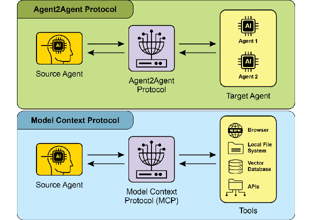
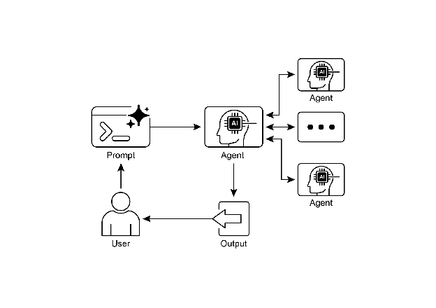

# Chapter 15: Inter-Agent Communication (A2A)

Individual AI agents often face limitations when tackling complex, multifaceted problems, even with advanced capabilities. To overcome this, Inter-Agent Communication (A2A) enables diverse AI agents, potentially built with different frameworks, to collaborate effectively. This collaboration involves seamless coordination, task delegation, and information exchange.

Google's A2A protocol is an open  standard designed to facilitate this universal communication. This chapter will explore A2A, its practical applications, and its implementation within the Google ADK.

# Inter-Agent Communication Pattern Overview

The Agent2Agent (A2A) protocol is an open standard designed to enable communication and collaboration between different AI agent frameworks. It ensures interoperability, allowing AI agents developed with technologies like LangGraph, CrewAI, or Google ADK to work together regardless of their origin or framework differences.

A2A is supported by a range of technology companies and service providers, including Atlassian, Box, LangChain, MongoDB, Salesforce, SAP, and ServiceNow. Microsoft plans to integrate A2A into Azure AI Foundry and Copilot Studio, demonstrating its commitment to open protocols. Additionally, Auth0 and SAP are integrating A2A support into their platforms and agents.

As an open-source protocol, A2A welcomes community contributions to facilitate its evolution and widespread adoption.

## Core Concepts of A2A

The A2A protocol provides a structured approach for agent interactions, built upon several core concepts. A thorough grasp of these concepts is crucial for anyone developing or integrating with A2A-compliant systems. The foundational pillars of A2A include Core Actors, Agent Card, Agent Discovery, Communication and Tasks,  Interaction mechanisms, and Security, all of which will be reviewed in detail.

**Core Actors:** A2A involves three main entities:

* User: Initiates requests for agent assistance.
* A2A Client (Client Agent): An application or AI agent that acts on the user's behalf to request actions or information.
* A2A Server (Remote Agent): An AI agent or system that provides an HTTP endpoint to process client requests and return results. The remote agent operates as an "opaque" system, meaning the client does not need to understand its internal operational details.

**Agent Card:** An agent's digital identity is defined by its Agent Card, usually a JSON file. This file contains key information for client interaction and automatic discovery, including the agent's identity, endpoint URL, and version. It also details supported capabilities like streaming or push notifications, specific skills, default input/output modes, and authentication requirements. Below is an example of an Agent Card for a WeatherBot.

```json
{
  "name": "WeatherBot",
  "description": "Provides accurate weather forecasts and historical data.",
  "url": "http://weather-service.example.com/a2a",
  "version": "1.0.0",
  "capabilities": {
    "streaming": true,
    "pushNotifications": false,
    "stateTransitionHistory": true
  },
  "authentication": {
    "schemes": [
      "apiKey"
    ]
  },
  "defaultInputModes": [
    "text"
  ],
  "defaultOutputModes": [
    "text"
  ],
  "skills": [
    {
      "id": "get_current_weather",
      "name": "Get Current Weather",
      "description": "Retrieve real-time weather for any location.",
      "inputModes": [
        "text"
      ],
      "outputModes": [
        "text"
      ],
      "examples": [
        "What's the weather in Paris?",
        "Current conditions in Tokyo"
      ],
      "tags": [
        "weather",
        "current",
        "real-time"
      ]
    },
    {
      "id": "get_forecast",
      "name": "Get Forecast",
      "description": "Get 5-day weather predictions.",
      "inputModes": [
        "text"
      ],
      "outputModes": [
        "text"
      ],
      "examples": [
        "5-day forecast for New York",
        "Will it rain in London this weekend?"
      ],
      "tags": [
        "weather",
        "forecast",
        "prediction"
      ]
    }
  ]
}
```

**Agent discovery:** it allows clients to find Agent Cards, which describe the capabilities of available A2A Servers. Several strategies exist for this process:

* Well-Known URI: Agents host their Agent Card at a standardized path (e.g., /.well-known/agent.json). This approach offers broad, often automated, accessibility for public or domain-specific use.
* Curated Registries**:** These provide a centralized catalog where Agent Cards are published and can be queried based on specific criteria. This is well-suited for enterprise environments needing centralized management and access control.
* Direct Configuration**:** Agent Card information is embedded or privately shared. This method is appropriate for closely coupled or private systems where dynamic discovery isn't crucial.

Regardless of the chosen method, it is important to secure Agent Card endpoints. This can be achieved through access control, mutual TLS (mTLS), or network restrictions, especially if the card contains sensitive (though non-secret) information.

**Communications and Tasks:** In the A2A framework, communication is structured around asynchronous tasks, which represent the fundamental units of work for long-running processes. Each task is assigned a unique identifier and moves through a series of states—such as submitted, working, or completed—a design that supports parallel processing in complex operations. Communication between agents occurs through a Message.

This communication  contains attributes, which are key-value metadata describing the message (like its priority or creation time), and one or more parts, which carry the actual content being delivered, such as plain text, files, or structured JSON data. The tangible outputs generated by an agent during a task are called artifacts. Like messages, artifacts are also composed of one or more parts and can be streamed incrementally as results become available. All communication within the A2A framework is conducted over HTTP(S) using the JSON-RPC 2.0 protocol for payloads. To maintain continuity across multiple interactions, a server-generated contextId is used to group related tasks and preserve context.

**Interaction Mechanisms**: Request/Response (Polling) Server-Sent Events (SSE). A2A provides multiple interaction methods to suit a variety of AI application needs, each with a distinct mechanism:

* Synchronous Request/Response: For quick, immediate operations. In this model, the client sends a request and actively waits for the server to process it and return a complete response in a single, synchronous exchange.
* Asynchronous Polling: Suited for tasks that take longer to process. The client sends a request, and the server immediately acknowledges it with a "working" status and a task ID. The client is then free to perform other actions and can periodically poll the server by sending new requests to check the status of the task until it is marked as "completed" or "failed."
* Streaming Updates (Server-Sent Events - SSE): Ideal for receiving real-time, incremental results. This method establishes a persistent, one-way connection from the server to the client. It allows the remote agent to continuously push updates, such as status changes or partial results, without the client needing to make multiple requests.
* Push Notifications (Webhooks): Designed for very long-running or resource-intensive tasks where maintaining a constant connection or frequent polling is inefficient. The client can register a webhook URL, and the server will send an asynchronous notification (a "push") to that URL when the task's status changes significantly (e.g., upon completion).

The Agent Card specifies whether an agent supports streaming or push notification capabilities. Furthermore, A2A is modality-agnostic, meaning it can facilitate these interaction patterns not just for text, but also for other data types like audio and video, enabling rich, multimodal AI applications. Both streaming and push notification capabilities are specified within the Agent Card.

```json
// Synchronous Request Example
{
  "jsonrpc": "2.0",
  "id": "1",
  "method": "sendTask",
  "params": {
    "id": "task-001",
    "sessionId": "session-001",
    "message": {
      "role": "user",
      "parts": [
        {
          "type": "text",
          "text": "What is the exchange rate from USD to EUR?"
        }
      ]
    },
    "acceptedOutputModes": ["text/plain"],
    "historyLength": 5
  }
}
```

The synchronous request uses the sendTask method, where the client asks for and expects a single, complete answer to its query. In contrast, the streaming request uses the sendTaskSubscribe method to establish a persistent connection, allowing the agent to send back multiple, incremental updates or partial results over time.

```json
// Streaming Request Example
{
  "jsonrpc": "2.0",
  "id": "2",
  "method": "sendTaskSubscribe",
  "params": {
    "id": "task-002",
    "sessionId": "session-001",
    "message": {
      "role": "user",
      "parts": [
        {
          "type": "text",
          "text": "What's the exchange rate for JPY to GBP today?"
        }
      ]
    },
    "acceptedOutputModes": ["text/plain"],
    "historyLength": 5
  }
}
```

**Security:**  Inter-Agent Communication (A2A): Inter-Agent Communication (A2A) is a vital component of system architecture, enabling secure and seamless data exchange among agents. It ensures robustness and integrity through several built-in mechanisms.

Mutual Transport Layer Security (TLS): Encrypted and authenticated connections are established to prevent unauthorized access and data interception, ensuring secure communication.

Comprehensive Audit Logs: All inter-agent communications are meticulously recorded, detailing information flow, involved agents, and actions. This audit trail is crucial for accountability, troubleshooting, and security analysis.

Agent Card Declaration: Authentication requirements are explicitly declared in the Agent Card, a configuration artifact outlining the agent's identity, capabilities, and security policies. This centralizes and simplifies authentication management.

Credential Handling: Agents typically authenticate using secure credentials like OAuth 2.0 tokens or API keys, passed via HTTP headers. This method prevents credential exposure in URLs or message bodies, enhancing overall security.

## A2A vs. MCP

A2A is a protocol that complements Anthropic's Model Context Protocol (MCP) (see Fig. 1). While MCP focuses on structuring context for agents and their interaction with external data and tools, A2A facilitates coordination and communication among agents, enabling task delegation and collaboration.



Fig.1: Comparison A2A and MCP Protocols

The goal of A2A is to enhance efficiency, reduce integration costs, and foster innovation and interoperability in the development of complex, multi-agent AI systems. Therefore, a thorough understanding of A2A's core components and operational methods is essential for its effective design, implementation, and application in building collaborative and interoperable AI agent systems..

# Practical Applications & Use Cases

Inter-Agent Communication is indispensable for building sophisticated AI solutions across diverse domains, enabling modularity, scalability, and enhanced intelligence.

* **Multi-Framework Collaboration:** A2A's primary use case is enabling independent AI agents, regardless of their underlying frameworks (e.g., ADK, LangChain, CrewAI), to communicate and collaborate. This is fundamental for building complex multi-agent systems where different agents specialize in different aspects of a problem.
* **Automated Workflow Orchestration:** In enterprise settings, A2A can facilitate complex workflows by enabling agents to delegate and coordinate tasks. For instance, an agent might handle initial data collection, then delegate to another agent for analysis, and finally to a third for report generation, all communicating via the A2A protocol.
* **Dynamic Information Retrieval:** Agents can communicate to retrieve and exchange real-time information. A primary agent might request live market data from a specialized "data fetching agent," which then uses external APIs to gather the information and send it back.

# Hands-On Code Example

Let's examine the practical applications of the A2A protocol. The repository at [https://github.com/google-a2a/a2a-samples/tree/main/samples](https://github.com/google-a2a/a2a-samples/tree/main/samples) provides examples in Java, Go, and Python that illustrate how various agent frameworks, such as LangGraph, CrewAI, Azure AI Foundry, and AG2, can communicate using A2A. All code in this repository is released under the Apache 2.0 license. To further illustrate A2A's core concepts, we will review code excerpts focusing on setting up an A2A Server using an ADK-based agent with Google-authenticated tools. Looking at [https://github.com/google-a2a/a2a-samples/blob/main/samples/python/agents/birthday_planner_adk/calendar_agent/adk_agent.py](https://github.com/google-a2a/a2a-samples/blob/main/samples/python/agents/birthday_planner_adk/calendar_agent/adk_agent.py)

```python
import datetime
from google.adk.agents import LlmAgent # type: ignore[import-untyped]
from google.adk.tools.google_api_tool import CalendarToolset # type: ignore[import-untyped]

async def create_agent(client_id, client_secret) -> LlmAgent:
    """Constructs the ADK agent."""
    toolset = CalendarToolset(client_id=client_id, client_secret=client_secret)
    return LlmAgent(
        model='gemini-2.0-flash-001',
        name='calendar_agent',
        description="An agent that can help manage a user's calendar",
        instruction=f""" You are an agent that can help manage a user's calendar.
Users will request information about the state of their calendar
or to make changes to their calendar.
Use the provided tools for interacting with the calendar API.
If not specified, assume the calendar the user wants is the 'primary' calendar.
When using the Calendar API tools, use well-formed RFC3339 timestamps.
Today is {datetime.datetime.now()}.
""",
        tools=await toolset.get_tools(),
    )
```

This Python code defines an asynchronous function `create_agent` that constructs an ADK LlmAgent. It begins by initializing a `CalendarToolset` using the provided client credentials to access the Google Calendar API. Subsequently, an `LlmAgent` instance is created, configured with a specified Gemini model, a descriptive name, and instructions for managing a user's calendar. The agent is furnished with calendar tools from the `CalendarToolset`, enabling it to interact with the Calendar API and respond to user queries regarding calendar states or modifications. The agent's instructions dynamically incorporate the current date for temporal context. To illustrate how an agent is constructed, let's examine a key section from the calendar_agent found in the A2A samples on GitHub.

The code below shows how the agent is defined with its specific instructions and tools. Please note that only the code required to explain this functionality is shown; you can access the complete file here: [https://github.com/a2aproject/a2a-samples/blob/main/samples/python/agents/birthday_planner_adk/calendar_agent/__main__.py](https://github.com/a2aproject/a2a-samples/blob/main/samples/python/agents/birthday_planner_adk/calendar_agent/__main__.py)

```python
def main(host: str, port: int):
    # Verify an API key is set.
    # Not required if using Vertex AI APIs.
    if os.getenv('GOOGLE_GENAI_USE_VERTEXAI') != 'TRUE' and not os.getenv(
        'GOOGLE_API_KEY'
    ):
        raise ValueError(
            'GOOGLE_API_KEY environment variable not set and '
            'GOOGLE_GENAI_USE_VERTEXAI is not TRUE.'
        )

    skill = AgentSkill(
        id='check_availability',
        name='Check Availability',
        description="Checks a user's availability for a time using their Google Calendar",
        tags=['calendar'],
        examples=['Am I free from 10am to 11am tomorrow?'],
    )

    agent_card = AgentCard(
        name='Calendar Agent',
        description="An agent that can manage a user's calendar",
        url=f'http://{host}:{port}/',
        version='1.0.0',
        defaultInputModes=['text'],
        defaultOutputModes=['text'],
        capabilities=AgentCapabilities(streaming=True),
        skills=[skill],
    )

    adk_agent = asyncio.run(create_agent(
        client_id=os.getenv('GOOGLE_CLIENT_ID'),
        client_secret=os.getenv('GOOGLE_CLIENT_SECRET'),
    ))

    runner = Runner(
        app_name=agent_card.name,
        agent=adk_agent,
        artifact_service=InMemoryArtifactService(),
        session_service=InMemorySessionService(),
        memory_service=InMemoryMemoryService(),
    )

    agent_executor = ADKAgentExecutor(runner, agent_card)

    async def handle_auth(request: Request) -> PlainTextResponse:
        await agent_executor.on_auth_callback(
            str(request.query_params.get('state')), str(request.url)
        )
        return PlainTextResponse('Authentication successful.')

    request_handler = DefaultRequestHandler(
        agent_executor=agent_executor, task_store=InMemoryTaskStore()
    )

    a2a_app = A2AStarletteApplication(
        agent_card=agent_card, http_handler=request_handler
    )

    routes = a2a_app.routes()
    routes.append(
        Route(
            path='/authenticate',
            methods=['GET'],
            endpoint=handle_auth,
        )
    )

    app = Starlette(routes=routes)

    uvicorn.run(app, host=host, port=port)

if __name__ == '__main__':
    main()
```

This Python code demonstrates setting up an A2A-compliant "Calendar Agent" for checking user availability using Google Calendar. It involves verifying API keys or Vertex AI configurations for authentication purposes. The agent's capabilities, including the "check_availability" skill, are defined within an AgentCard, which also specifies the agent's network address. Subsequently, an ADK agent is created, configured with in-memory services for managing artifacts, sessions, and memory. The code then initializes a Starlette web application, incorporates an authentication callback and the A2A protocol handler, and executes it using Uvicorn to expose the agent via HTTP.

These examples illustrate the process of building an A2A-compliant agent, from defining its capabilities to running it as a web service. By utilizing Agent Cards and ADK, developers can create interoperable AI agents capable of integrating with tools like Google Calendar. This practical approach demonstrates the application of A2A in establishing a multi-agent ecosystem.

Further exploration of A2A is recommended through the code demonstration at [https://www.trickle.so/blog/how-to-build-google-a2a-project](https://www.trickle.so/blog/how-to-build-google-a2a-project). Resources available at this link include sample A2A clients and servers in Python and JavaScript, multi-agent web applications, command-line interfaces, and example implementations for various agent frameworks.

# At a Glance

**What:** Individual AI agents, especially those built on different frameworks, often struggle with complex, multi-faceted problems on their own. The primary challenge is the lack of a common language or protocol that allows them to communicate and collaborate effectively. This isolation prevents the creation of sophisticated systems where multiple specialized agents can combine their unique skills to solve larger tasks. Without a standardized approach, integrating these disparate agents is costly, time-consuming, and hinders the development of more powerful, cohesive AI solutions.

**Why:** The Inter-Agent Communication (A2A) protocol provides an open, standardized solution for this problem. It is an HTTP-based protocol that enables interoperability, allowing distinct AI agents to coordinate, delegate tasks, and share information seamlessly, regardless of their underlying technology. A core component is the Agent Card, a digital identity file that describes an agent's capabilities, skills, and communication endpoints, facilitating discovery and interaction. A2A defines various interaction mechanisms, including synchronous and asynchronous communication, to support diverse use cases. By creating a universal standard for agent collaboration, A2A fosters a modular and scalable ecosystem for building complex, multi-agent Agentic systems.

**Rule of thumb:** Use this pattern when you need to orchestrate collaboration between two or more AI agents, especially if they are built using different frameworks (e.g., Google ADK, LangGraph, CrewAI). It is ideal for building complex, modular applications where specialized agents handle specific parts of a workflow, such as delegating data analysis to one agent and report generation to another. This pattern is also essential when an agent needs to dynamically discover and consume the capabilities of other agents to complete a task.

**Visual summary**



Fig.2: A2A inter-agent communication pattern

# Key Takeaways

Key Takeaways:

* The Google A2A protocol is an open, HTTP-based standard that facilitates communication and collaboration between AI agents built with different frameworks.
* An AgentCard serves as a digital identifier for an agent, allowing for automatic discovery and understanding of its capabilities by other agents.
* A2A offers both synchronous request-response interactions (using `tasks/send`) and streaming updates (using `tasks/sendSubscribe`) to accommodate varying communication needs.
* The protocol supports multi-turn conversations, including an `input-required` state, which allows agents to request additional information and maintain context during interactions.
* A2A encourages a modular architecture where specialized agents can operate independently on different ports, enabling system scalability and distribution.
* Tools such as Trickle AI aid in visualizing and tracking A2A communications, which helps developers monitor, debug, and optimize multi-agent systems.
* While A2A is a high-level protocol for managing tasks and workflows between different agents, the Model Context Protocol (MCP) provides a standardized interface for LLMs to interface with external resources

# Conclusions

The Inter-Agent Communication (A2A) protocol establishes a vital, open standard to overcome the inherent isolation of individual AI agents. By providing a common HTTP-based framework, it ensures seamless collaboration and interoperability between agents built on different platforms, such as Google ADK, LangGraph, or CrewAI. A core component is the Agent Card, which serves as a digital identity, clearly defining an agent's capabilities and enabling dynamic discovery by other agents. The protocol's flexibility supports various interaction patterns, including synchronous requests, asynchronous polling, and real-time streaming, catering to a wide range of application needs.

This enables the creation of modular and scalable architectures where specialized agents can be combined to orchestrate complex automated workflows. Security is a fundamental aspect, with built-in mechanisms like mTLS and explicit authentication requirements to protect communications. While complementing other standards like MCP, A2A's unique focus is on the high-level coordination and task delegation between agents. The strong backing from major technology companies and the availability of practical implementations highlight its growing importance. This protocol paves the way for developers to build more sophisticated, distributed, and intelligent multi-agent systems. Ultimately, A2A is a foundational pillar for fostering an innovative and interoperable ecosystem of collaborative AI.

# References

1. Chen, B. (2025, April 22). *How to Build Your First Google A2A Project: A Step-by-Step Tutorial*. Trickle.so Blog. [https://www.trickle.so/blog/how-to-build-google-a2a-project](https://www.trickle.so/blog/how-to-build-google-a2a-project)
2. Google A2A GitHub Repository. [https://github.com/google-a2a/A2A](https://github.com/google-a2a/A2A)
3. Google Agent Development Kit (ADK) [https://google.github.io/adk-docs/](https://google.github.io/adk-docs/)
4. Getting Started with Agent-to-Agent (A2A) Protocol: [https://codelabs.developers.google.com/intro-a2a-purchasing-concierge#0](https://codelabs.developers.google.com/intro-a2a-purchasing-concierge#0)
5. Google AgentDiscovery - [https://a2a-protocol.org/latest/](https://a2a-protocol.org/latest/)
6. Communication between different AI frameworks such as LangGraph, CrewAI, and Google ADK [https://www.trickle.so/blog/how-to-build-google-a2a-project#setting-up-your-a2a-development-environment](https://www.trickle.so/blog/how-to-build-google-a2a-project#setting-up-your-a2a-development-environment)
7. Designing Collaborative Multi-Agent Systems with the A2A Protocol [https://www.oreilly.com/radar/designing-collaborative-multi-agent-systems-with-the-a2a-protocol/](https://www.oreilly.com/radar/designing-collaborative-multi-agent-systems-with-the-a2a-protocol/)
