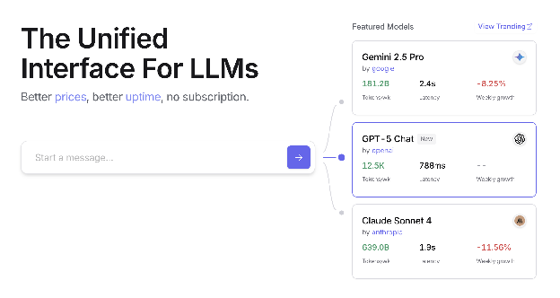
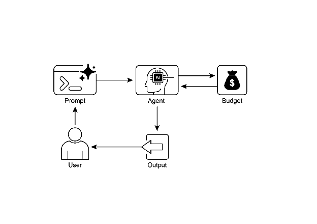

# Chapter 16: Resource-Aware Optimization

Resource-Aware Optimization은 지능형 에이전트가 작동 중 컴퓨팅, 시간, 재무 리소스를 동적으로 모니터링하고 관리할 수 있게 함. 이는 주로 액션 순서에 집중하는 단순 계획과 다름. Resource-Aware Optimization은 에이전트가 지정된 리소스 예산 내에서 목표를 달성하거나 효율성을 최적화하기 위해 액션 실행에 관한 결정을 내리도록 요구함. 이는 더 정확하지만 비싼 모델과 더 빠르고 저렴한 모델 중 선택하거나, 더 정교한 응답을 위해 추가 컴퓨팅을 할당할지 더 빠르지만 덜 상세한 답변을 반환할지 결정하는 것을 포함함.

예를 들어, 금융 분석가를 위해 대규모 데이터셋을 분석하는 작업을 맡은 에이전트를 고려해보자. 분석가가 예비 보고서를 즉시 필요로 하면, 에이전트는 더 빠르고 저렴한 모델을 사용해 주요 트렌드를 신속하게 요약할 수 있음. 그러나 분석가가 중요한 투자 결정을 위해 고도로 정확한 예측을 필요로 하고 더 큰 예산과 시간이 있다면, 에이전트는 더 강력하고 느리지만 더 정확한 예측 모델을 사용하기 위해 더 많은 리소스를 할당함. 이 범주의 핵심 전략은 폴백 메커니즘으로, 선호 모델이 과부하 또는 제한으로 사용 불가능할 때 안전장치로 작동함. 우아한 성능 저하를 보장하기 위해, 시스템은 완전히 실패하는 대신 기본 또는 더 저렴한 모델로 자동 전환하여 서비스 연속성을 유지함.

# Practical Applications & Use Cases

실제 사용 사례:

* **비용 최적화 LLM 사용:** 예산 제약에 따라 복잡한 작업에는 대형 고가 LLM을, 간단한 쿼리에는 소형 저렴한 LLM을 사용할지 결정하는 에이전트.
* **지연 시간 민감 작업:** 실시간 시스템에서 에이전트가 적시 응답을 보장하기 위해 더 빠르지만 잠재적으로 덜 포괄적인 추론 경로를 선택.
* **에너지 효율성:** 엣지 디바이스에 배포되거나 제한된 전력이 있는 에이전트의 경우, 배터리 수명을 보존하기 위해 처리를 최적화.
* **서비스 안정성을 위한 폴백:** 주요 선택이 사용 불가능할 때 에이전트가 자동으로 백업 모델로 전환하여 서비스 연속성과 우아한 성능 저하를 보장.
* **데이터 사용 관리:** 대역폭이나 스토리지를 절약하기 위해 전체 데이터셋 다운로드 대신 요약된 데이터 검색을 선택하는 에이전트.
* **적응형 작업 할당:** 다중 에이전트 시스템에서 에이전트가 현재 컴퓨팅 부하 또는 가용 시간에 따라 작업을 자체 할당.

# Hands-On Code Example

사용자 질문에 답변하는 지능형 시스템은 각 질문의 난이도를 평가할 수 있음. 간단한 쿼리의 경우 Gemini Flash 같은 비용 효율적인 언어 모델을 활용. 복잡한 질의의 경우, 더 강력하지만 비싼 언어 모델(Gemini Pro 등)을 고려. 더 강력한 모델 사용 결정은 리소스 가용성, 특히 예산과 시간 제약에도 의존함. 이 시스템은 적절한 모델을 동적으로 선택함.

예를 들어, 계층적 에이전트로 구축된 여행 플래너를 고려해보자. 사용자의 복잡한 요청 이해, 다단계 일정으로 분해, 논리적 결정 수행을 포함하는 고수준 계획은 Gemini Pro 같은 정교하고 더 강력한 LLM이 관리함. 이것은 컨텍스트의 깊은 이해와 추론 능력을 필요로 하는 "planner" 에이전트임.

그러나 계획이 수립되면, 해당 계획 내 개별 작업들, 예를 들어 항공편 가격 조회, 호텔 예약 가능성 확인, 레스토랑 리뷰 찾기는 본질적으로 간단하고 반복적인 웹 쿼리임. 이러한 "tool function calls"는 Gemini Flash 같은 더 빠르고 저렴한 모델로 실행 가능. 이러한 직접적인 웹 검색에는 저렴한 모델을 사용할 수 있는 반면, 복잡한 계획 단계에는 일관되고 논리적인 여행 계획을 보장하기 위해 더 고급 모델의 높은 지능이 필요한 이유를 시각화하기 쉬움.

Google의 ADK는 다중 에이전트 아키텍처를 통해 이 접근법을 지원하며, 모듈식이고 확장 가능한 애플리케이션을 가능하게 함. 다양한 에이전트가 특화된 작업을 처리할 수 있음. 모델 유연성은 Gemini Pro와 Gemini Flash를 포함한 다양한 Gemini 모델의 직접 사용 또는 LiteLLM을 통한 다른 모델 통합을 가능하게 함. ADK의 오케스트레이션 기능은 적응형 동작을 위한 동적 LLM 기반 라우팅을 지원함. 내장 평가 기능은 에이전트 성능의 체계적 평가를 가능하게 하며, 시스템 개선에 사용될 수 있음(Evaluation and Monitoring 챕터 참조).

다음으로, 동일한 설정이지만 다른 모델과 비용을 사용하는 두 에이전트를 정의함:

```python
# Conceptual Python-like structure, not runnable code
from google.adk.agents import Agent
# from google.adk.models.lite_llm import LiteLlm # If using models not directly supported by ADK's default Agent

# Agent using the more expensive Gemini Pro 2.5
gemini_pro_agent = Agent(
   name="GeminiProAgent",
   model="gemini-2.5-pro", # Placeholder for actual model name if different
   description="A highly capable agent for complex queries.",
   instruction="You are an expert assistant for complex problem-solving."
)

# Agent using the less expensive Gemini Flash 2.5
gemini_flash_agent = Agent(
   name="GeminiFlashAgent",
   model="gemini-2.5-flash", # Placeholder for actual model name if different
   description="A fast and efficient agent for simple queries.",
   instruction="You are a quick assistant for straightforward questions."
)
```

Router Agent는 쿼리 길이 같은 간단한 메트릭을 기반으로 쿼리를 지시할 수 있으며, 짧은 쿼리는 저렴한 모델로, 긴 쿼리는 더 유능한 모델로 전송함. 그러나 더 정교한 Router Agent는 LLM 또는 ML 모델을 활용해 쿼리 뉘앙스와 복잡성을 분석할 수 있음. 이 LLM 라우터는 가장 적합한 다운스트림 언어 모델을 결정할 수 있음. 예를 들어, 사실 회상을 요청하는 쿼리는 flash 모델로 라우팅되고, 깊은 분석을 요구하는 복잡한 쿼리는 pro 모델로 라우팅됨.

최적화 기법은 LLM 라우터의 효과성을 더욱 향상시킬 수 있음. 프롬프트 튜닝은 더 나은 라우팅 결정을 위해 라우터 LLM을 안내하는 프롬프트를 작성하는 것을 포함함. 쿼리와 최적 모델 선택의 데이터셋으로 LLM 라우터를 파인 튜닝하면 정확도와 효율성이 향상됨. 이 동적 라우팅 기능은 응답 품질과 비용 효율성의 균형을 맞춤.

```python
# Conceptual Python-like structure, not runnable code
from google.adk.agents import Agent, BaseAgent
from google.adk.events import Event
from google.adk.agents.invocation_context import InvocationContext
import asyncio

class QueryRouterAgent(BaseAgent):
   name: str = "QueryRouter"
   description: str = "Routes user queries to the appropriate LLM agent based on complexity."

   async def _run_async_impl(self, context: InvocationContext) -> AsyncGenerator[Event, None]:
       user_query = context.current_message.text # Assuming text input
       query_length = len(user_query.split()) # Simple metric: number of words

       if query_length < 20: # Example threshold for simplicity vs. complexity
           print(f"Routing to Gemini Flash Agent for short query (length: {query_length})")
           # In a real ADK setup, you would 'transfer_to_agent' or directly invoke
           # For demonstration, we'll simulate a call and yield its response
           response = await gemini_flash_agent.run_async(context.current_message)
           yield Event(author=self.name, content=f"Flash Agent processed: {response}")
       else:
           print(f"Routing to Gemini Pro Agent for long query (length: {query_length})")
           response = await gemini_pro_agent.run_async(context.current_message)
           yield Event(author=self.name, content=f"Pro Agent processed: {response}")
```

Critique Agent는 언어 모델의 응답을 평가하여 여러 기능을 제공하는 피드백을 제공함. 자체 수정의 경우, 오류나 불일치를 식별하여 응답 에이전트가 품질 향상을 위해 출력을 개선하도록 촉구함. 또한 성능 모니터링을 위해 응답을 체계적으로 평가하여 정확도와 관련성 같은 메트릭을 추적하며, 이는 최적화에 사용됨.

추가로, 피드백은 강화 학습이나 파인 튜닝을 신호할 수 있음; 예를 들어, Flash 모델 응답의 지속적인 부적절함 식별은 라우터 에이전트의 로직을 개선할 수 있음. 예산을 직접 관리하지는 않지만, Critique Agent는 단순 쿼리를 Pro 모델로 지시하거나 복잡한 쿼리를 Flash 모델로 지시하는 것 같은 차선책 라우팅 선택을 식별하여 간접적 예산 관리에 기여하며, 이는 리소스 할당과 비용 절감 개선으로 이어짐.

Critique Agent는 응답 에이전트의 생성된 텍스트만 검토하거나 원래 쿼리와 생성된 텍스트를 모두 검토하도록 구성될 수 있어, 초기 질문과 응답의 일치에 대한 포괄적 평가를 가능하게 함.

```python
CRITIC_SYSTEM_PROMPT = """
You are the **Critic Agent**, serving as the quality assurance arm of our collaborative research assistant system.

Your primary function is to **meticulously review and challenge** information from the Researcher Agent, guaranteeing **accuracy, completeness, and unbiased presentation**.

Your duties encompass:

* **Assessing research findings** for factual correctness, thoroughness, and potential leanings.
* **Identifying any missing data** or inconsistencies in reasoning.
* **Raising critical questions** that could refine or expand the current understanding.
* **Offering constructive suggestions** for enhancement or exploring different angles.
* **Validating that the final output is comprehensive** and balanced.

All criticism must be constructive. Your goal is to fortify the research, not invalidate it.

Structure your feedback clearly, drawing attention to specific points for revision.

Your overarching aim is to ensure the final research product meets the highest possible quality standards.
"""
```

Critic Agent는 역할, 책임, 피드백 접근법을 개괄하는 사전 정의된 시스템 프롬프트를 기반으로 작동함. 이 에이전트를 위한 잘 설계된 프롬프트는 평가자로서의 기능을 명확히 확립해야 함. 비판적 집중을 위한 영역을 명시해야 하며 단순 기각보다는 건설적 피드백 제공을 강조해야 함. 프롬프트는 강점과 약점 모두의 식별을 장려해야 하며, 피드백을 구조화하고 제시하는 방법에 대해 에이전트를 안내해야 함.

# Hands-On Code with OpenAI

이 시스템은 사용자 쿼리를 효율적으로 처리하기 위해 리소스 인식 최적화 전략을 사용함. 먼저 각 쿼리를 세 가지 범주 중 하나로 분류하여 가장 적절하고 비용 효율적인 처리 경로를 결정함. 이 접근법은 간단한 요청에 컴퓨팅 리소스를 낭비하지 않으면서 복잡한 쿼리가 필요한 주의를 받도록 보장함. 세 가지 범주:

* simple: 복잡한 추론이나 외부 데이터 없이 직접 답변할 수 있는 간단한 질문.
* reasoning: 논리적 추론이나 다단계 사고 프로세스를 요구하는 쿼리로, 더 강력한 모델로 라우팅됨.
* internet\_search: 최신 정보가 필요한 질문으로, 자동으로 Google 검색을 트리거하여 최신 답변을 제공함.

코드는 MIT 라이선스로 Github에서 사용 가능: ([https://github.com/mahtabsyed/21-Agentic-Patterns/blob/main/16\_Resource\_Aware\_Opt\_LLM\_Reflection\_v2.ipynb](https://github.com/mahtabsyed/21-Agentic-Patterns/blob/main/16_Resource_Aware_Opt_LLM_Reflection_v2.ipynb))

```python
# MIT License
# Copyright (c) 2025 Mahtab Syed
# https://www.linkedin.com/in/mahtabsyed/

import os
import requests
import json
from dotenv import load_dotenv
from openai import OpenAI

# Load environment variables
load_dotenv()

OPENAI_API_KEY = os.getenv("OPENAI_API_KEY")
GOOGLE_CUSTOM_SEARCH_API_KEY = os.getenv("GOOGLE_CUSTOM_SEARCH_API_KEY")
GOOGLE_CSE_ID = os.getenv("GOOGLE_CSE_ID")

if not OPENAI_API_KEY or not GOOGLE_CUSTOM_SEARCH_API_KEY or not GOOGLE_CSE_ID:
   raise ValueError(
       "Please set OPENAI_API_KEY, GOOGLE_CUSTOM_SEARCH_API_KEY, and GOOGLE_CSE_ID in your .env file."
   )

client = OpenAI(api_key=OPENAI_API_KEY)

# --- Step 1: Classify the Prompt ---
def classify_prompt(prompt: str) -> dict:
   system_message = {
       "role": "system",
       "content": (
           "You are a classifier that analyzes user prompts and returns one of three categories ONLY:\n\n"
           "- simple\n"
           "- reasoning\n"
           "- internet_search\n\n"
           "Rules:\n"
           "- Use 'simple' for direct factual questions that need no reasoning or current events.\n"
           "- Use 'reasoning' for logic, math, or multi-step inference questions.\n"
           "- Use 'internet_search' if the prompt refers to current events, recent data, or things not in your training data.\n\n"
           "Respond ONLY with JSON like:\n"
           '{ "classification": "simple" }'
       ),
   }
   user_message = {"role": "user", "content": prompt}

   response = client.chat.completions.create(
       model="gpt-4o", messages=[system_message, user_message], temperature=1
   )
   reply = response.choices[0].message.content
   return json.loads(reply)

# --- Step 2: Google Search ---
def google_search(query: str, num_results=1) -> list:
   url = "https://www.googleapis.com/customsearch/v1"
   params = {
       "key": GOOGLE_CUSTOM_SEARCH_API_KEY,
       "cx": GOOGLE_CSE_ID,
       "q": query,
       "num": num_results,
   }

   try:
       response = requests.get(url, params=params)
       response.raise_for_status()
       results = response.json()

       if "items" in results and results["items"]:
           return [
               {
                   "title": item.get("title"),
                   "snippet": item.get("snippet"),
                   "link": item.get("link"),
               }
               for item in results["items"]
           ]
       else:
           return []
   except requests.exceptions.RequestException as e:
       return {"error": str(e)}

# --- Step 3: Generate Response ---
def generate_response(prompt: str, classification: str, search_results=None) -> str:
   if classification == "simple":
       model = "gpt-4o-mini"
       full_prompt = prompt
   elif classification == "reasoning":
       model = "o4-mini"
       full_prompt = prompt
   elif classification == "internet_search":
       model = "gpt-4o"
       # Convert each search result dict to a readable string
       if search_results:
           search_context = "\n".join(
               [
                   f"Title: {item.get('title')}\nSnippet: {item.get('snippet')}\nLink: {item.get('link')}"
                   for item in search_results
               ]
           )
       else:
           search_context = "No search results found."

       full_prompt = f"""Use the following web results to answer the user query:

{search_context}

Query: {prompt}"""

   response = client.chat.completions.create(
       model=model,
       messages=[{"role": "user", "content": full_prompt}],
       temperature=1,
   )
   return response.choices[0].message.content, model

# --- Step 4: Combined Router ---
def handle_prompt(prompt: str) -> dict:
   classification_result = classify_prompt(prompt)
   classification = classification_result["classification"]

   search_results = None
   if classification == "internet_search":
       search_results = google_search(prompt)

   answer, model = generate_response(prompt, classification, search_results)

   return {"classification": classification, "response": answer, "model": model}

test_prompt = "What is the capital of Australia?"
# test_prompt = "Explain the impact of quantum computing on cryptography."
# test_prompt = "When does the Australian Open 2026 start, give me full date?"

result = handle_prompt(test_prompt)

print("Classification:", result["classification"])
print("Model Used:", result["model"])
print("Response:\n", result["response"])
```

이 Python 코드는 사용자 질문에 답변하기 위한 프롬프트 라우팅 시스템을 구현함. .env 파일에서 OpenAI와 Google Custom Search를 위한 필요한 API 키를 로드하는 것으로 시작함. 핵심 기능은 사용자의 프롬프트를 simple, reasoning, 또는 internet search의 세 가지 범주로 분류하는 것에 있음. 전용 함수가 이 분류 단계를 위해 OpenAI 모델을 활용함. 프롬프트가 최신 정보를 요구하면, Google Custom Search API를 사용해 Google 검색이 수행됨. 다른 함수는 분류에 따라 적절한 OpenAI 모델을 선택하여 최종 응답을 생성함. Internet search 쿼리의 경우, 검색 결과가 모델에 컨텍스트로 제공됨. 메인 handle\_prompt 함수는 응답을 생성하기 전에 분류 및 검색(필요시) 함수를 호출하여 이 워크플로를 조율함. 분류, 사용된 모델, 생성된 답변을 반환함. 이 시스템은 다양한 유형의 쿼리를 더 나은 응답을 위한 최적화된 방법으로 효율적으로 지시함.

# Hands-On Code Example (OpenRouter)

OpenRouter는 단일 API 엔드포인트를 통해 수백 개의 AI 모델에 대한 통합 인터페이스를 제공함. 자동 폴오버와 비용 최적화를 제공하며, 선호하는 SDK나 프레임워크를 통한 쉬운 통합을 지원함.

```python
import requests
import json

response = requests.post(
 url="https://openrouter.ai/api/v1/chat/completions",
 headers={
   "Authorization": "Bearer <OPENROUTER_API_KEY>",
   "HTTP-Referer": "<YOUR_SITE_URL>", # Optional. Site URL for rankings on openrouter.ai.
   "X-Title": "<YOUR_SITE_NAME>", # Optional. Site title for rankings on openrouter.ai.
 },
 data=json.dumps({
   "model": "openai/gpt-4o", # Optional
   "messages": [
     {
       "role": "user",
       "content": "What is the meaning of life?"
     }
   ]
 })
)
```

이 코드 스니펫은 requests 라이브러리를 사용해 OpenRouter API와 상호작용함. 사용자 메시지로 채팅 완료 엔드포인트에 POST 요청을 전송함. 요청은 API 키와 선택적 사이트 정보가 포함된 인증 헤더를 포함함. 목표는 지정된 언어 모델(이 경우 "openai/gpt-4o")에서 응답을 받는 것임.

Openrouter는 주어진 요청을 처리하는 데 사용되는 컴퓨팅 모델을 라우팅하고 결정하기 위한 두 가지 고유한 방법론을 제공함.

* **자동 모델 선택:** 이 기능은 사용 가능한 모델의 선별된 세트에서 선택된 최적화된 모델로 요청을 라우팅함. 선택은 사용자 프롬프트의 특정 내용에 기초함. 궁극적으로 요청을 처리하는 모델의 식별자가 응답의 메타데이터에 반환됨.

```python
{
 "model": "openrouter/auto",
 ... // Other params
}
```

* **순차적 모델 폴백:** 이 메커니즘은 사용자가 계층적 모델 목록을 지정할 수 있도록 하여 운영 중복성을 제공함. 시스템은 먼저 시퀀스에서 지정된 기본 모델로 요청을 처리하려고 시도함. 이 기본 모델이 서비스 사용 불가, 속도 제한, 또는 콘텐츠 필터링 같은 여러 오류 조건으로 인해 응답에 실패하면, 시스템은 자동으로 시퀀스에서 다음 지정된 모델로 요청을 재라우팅함. 이 프로세스는 목록의 모델이 요청을 성공적으로 실행하거나 목록이 소진될 때까지 계속됨. 작업의 최종 비용과 응답에 반환된 모델 식별자는 계산을 성공적으로 완료한 모델에 해당함.

```python
{
 "models": ["anthropic/claude-3.5-sonnet", "gryphe/mythomax-l2-13b"],
 ... // Other params
}
```

OpenRouter는 누적 토큰 생산량을 기반으로 사용 가능한 AI 모델의 순위를 매기는 상세한 리더보드([https://openrouter.ai/rankings](https://openrouter.ai/rankings))를 제공함. 또한 다양한 제공업체(ChatGPT, Gemini, Claude)의 최신 모델을 제공함(Fig. 1 참조).


Fig. 1: OpenRouter 웹사이트 ([https://openrouter.ai/](https://openrouter.ai/))

# Beyond Dynamic Model Switching: A Spectrum of Agent Resource Optimizations

리소스 인식 최적화는 실제 제약 내에서 효율적이고 효과적으로 작동하는 지능형 에이전트 시스템 개발에서 가장 중요함. 다수의 추가 기법을 살펴보자:

**Dynamic Model Switching**은 당면한 작업의 복잡성과 사용 가능한 컴퓨팅 리소스를 기반으로 대형 언어 모델을 전략적으로 선택하는 것을 포함하는 중요한 기법임. 간단한 쿼리에 직면하면 경량의 비용 효율적인 LLM을 배포할 수 있는 반면, 복잡하고 다면적인 문제는 더 정교하고 리소스 집약적인 모델의 활용을 필요로 함.

**Adaptive Tool Use & Selection**은 에이전트가 도구 모음에서 지능적으로 선택하여 각 특정 하위 작업에 가장 적절하고 효율적인 도구를 선택할 수 있도록 보장하며, API 사용 비용, 지연 시간, 실행 시간 같은 요소를 신중히 고려함. 이 동적 도구 선택은 외부 API 및 서비스의 사용을 최적화하여 전체 시스템 효율성을 향상시킴.

**Contextual Pruning & Summarization**은 에이전트가 처리하는 정보량을 관리하는 데 중요한 역할을 하며, 상호작용 히스토리에서 가장 관련성 높은 정보만을 지능적으로 요약하고 선택적으로 보유하여 프롬프트 토큰 수를 전략적으로 최소화하고 추론 비용을 줄이며, 불필요한 컴퓨팅 오버헤드를 방지함.

**Proactive Resource Prediction**은 미래 워크로드와 시스템 요구 사항을 예측하여 리소스 수요를 예측하는 것을 포함하며, 이는 리소스의 사전 할당 및 관리를 가능하게 하여 시스템 응답성을 보장하고 병목 현상을 방지함.

**Cost-Sensitive Exploration**은 다중 에이전트 시스템에서 전통적인 컴퓨팅 비용과 함께 통신 비용을 포함하도록 최적화 고려 사항을 확장하며, 전체 리소스 지출을 최소화하는 것을 목표로 에이전트가 협력하고 정보를 공유하기 위해 사용하는 전략에 영향을 미침.

**Energy-Efficient Deployment**는 엄격한 리소스 제약이 있는 환경을 위해 특별히 맞춤화되어 지능형 에이전트 시스템의 에너지 풋프린트를 최소화하는 것을 목표로 하며, 운영 시간을 연장하고 전체 실행 비용을 줄임.

**Parallelization & Distributed Computing Awareness**는 분산 리소스를 활용하여 에이전트의 처리 능력과 처리량을 향상시키며, 컴퓨팅 워크로드를 여러 머신 또는 프로세서에 분산하여 더 높은 효율성과 더 빠른 작업 완료를 달성함.

**Learned Resource Allocation Policies**는 학습 메커니즘을 도입하여 에이전트가 피드백 및 성능 메트릭을 기반으로 시간이 지남에 따라 리소스 할당 전략을 적응하고 최적화할 수 있게 하며, 지속적인 개선을 통해 효율성을 향상시킴.

**Graceful Degradation and Fallback Mechanisms**는 지능형 에이전트 시스템이 리소스 제약이 심각할 때에도 아마도 감소된 용량으로나마 계속 기능할 수 있도록 보장하며, 성능을 우아하게 저하하고 대체 전략으로 폴백하여 운영을 유지하고 필수 기능을 제공함.

# At a Glance

**What:** Resource-Aware Optimization은 지능형 시스템에서 컴퓨팅, 시간, 재무 리소스의 소비를 관리하는 과제를 다룸. LLM 기반 애플리케이션은 비싸고 느릴 수 있으며, 모든 작업에 최상의 모델이나 도구를 선택하는 것은 종종 비효율적임. 이는 시스템 출력의 품질과 이를 생산하는 데 필요한 리소스 간의 근본적인 트레이드오프를 생성함. 동적 관리 전략 없이, 시스템은 다양한 작업 복잡성에 적응하거나 예산 및 성능 제약 내에서 작동할 수 없음.

**Why:** 표준화된 솔루션은 당면한 작업을 기반으로 리소스를 지능적으로 모니터링하고 할당하는 에이전트 시스템을 구축하는 것임. 이 패턴은 일반적으로 "Router Agent"를 사용하여 먼저 들어오는 요청의 복잡성을 분류함. 그런 다음 요청은 가장 적합한 LLM 또는 도구로 전달됨 - 간단한 쿼리를 위한 빠르고 저렴한 모델, 복잡한 추론을 위한 더 강력한 모델. "Critique Agent"는 응답의 품질을 평가하여 시간이 지남에 따라 라우팅 로직을 개선하기 위한 피드백을 제공함으로써 프로세스를 더욱 개선할 수 있음. 이 동적 다중 에이전트 접근법은 시스템이 효율적으로 작동하도록 보장하며, 응답 품질과 비용 효율성의 균형을 맞춤.

**Rule of thumb:** API 호출이나 컴퓨팅 파워에 대한 엄격한 재무 예산 하에서 운영할 때, 빠른 응답 시간이 중요한 지연 시간에 민감한 애플리케이션을 구축할 때, 제한된 배터리 수명을 가진 엣지 디바이스 같은 리소스 제약 하드웨어에 에이전트를 배포할 때, 응답 품질과 운영 비용 간의 트레이드오프를 프로그래밍 방식으로 균형 맞출 때, 그리고 다양한 작업이 다양한 리소스 요구 사항을 가진 복잡한 다단계 워크플로를 관리할 때 이 패턴을 사용함.

**Visual Summary**



Fig. 2: Resource-Aware Optimization 디자인 패턴

# Key Takeaways

* Resource-Aware Optimization은 필수적: 지능형 에이전트는 컴퓨팅, 시간, 재무 리소스를 동적으로 관리할 수 있음. 모델 사용 및 실행 경로에 관한 결정은 실시간 제약 및 목표에 따라 이루어짐.
* 확장성을 위한 다중 에이전트 아키텍처: Google의 ADK는 모듈식 설계를 가능하게 하는 다중 에이전트 프레임워크를 제공함. 다양한 에이전트(응답, 라우팅, 비평)가 특정 작업을 처리함.
* 동적 LLM 기반 라우팅: Router Agent는 쿼리 복잡성과 예산에 따라 언어 모델(간단한 경우 Gemini Flash, 복잡한 경우 Gemini Pro)로 쿼리를 지시함. 이는 비용과 성능을 최적화함.
* Critique Agent 기능: 전용 Critique Agent는 자체 수정, 성능 모니터링, 라우팅 로직 개선을 위한 피드백을 제공하여 시스템 효과성을 향상시킴.
* 피드백 및 유연성을 통한 최적화: 비평을 위한 평가 기능 및 모델 통합 유연성은 적응형이고 자체 개선하는 시스템 동작에 기여함.
* 추가 리소스 인식 최적화: 다른 방법으로는 Adaptive Tool Use & Selection, Contextual Pruning & Summarization, Proactive Resource Prediction, 다중 에이전트 시스템에서의 Cost-Sensitive Exploration, Energy-Efficient Deployment, Parallelization & Distributed Computing Awareness, Learned Resource Allocation Policies, Graceful Degradation and Fallback Mechanisms, 중요 작업의 우선순위 지정이 포함됨.

# Conclusions

리소스 인식 최적화는 실제 제약 내에서 효율적인 작동을 가능하게 하는 지능형 에이전트 개발에 필수적임. 컴퓨팅, 시간, 재무 리소스를 관리함으로써, 에이전트는 최적의 성능과 비용 효율성을 달성할 수 있음. Dynamic model switching, adaptive tool use, contextual pruning 같은 기법은 이러한 효율성을 달성하는 데 중요함. Learned resource allocation policies 및 graceful degradation 같은 고급 전략은 다양한 조건에서 에이전트의 적응성과 복원력을 향상시킴. 이러한 최적화 원칙을 에이전트 설계에 통합하는 것은 확장 가능하고 견고하며 지속 가능한 AI 시스템을 구축하는 데 근본적임.

# References

1. Google's Agent Development Kit (ADK): [https://google.github.io/adk-docs/](https://google.github.io/adk-docs/)
2. Gemini Flash 2.5 & Gemini 2.5 Pro:  [https://aistudio.google.com/](https://aistudio.google.com/)
3. OpenRouter: [https://openrouter.ai/docs/quickstart](https://openrouter.ai/docs/quickstart)
