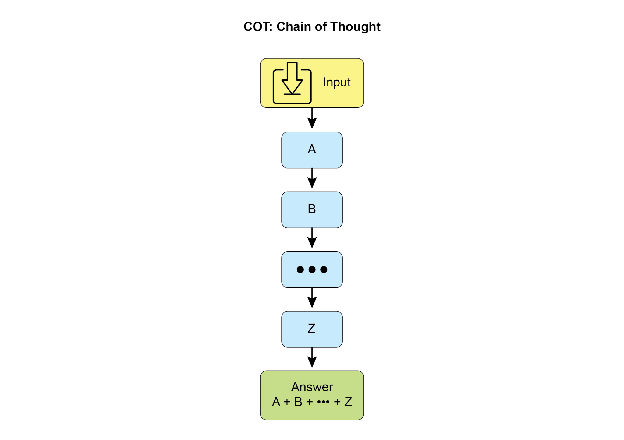
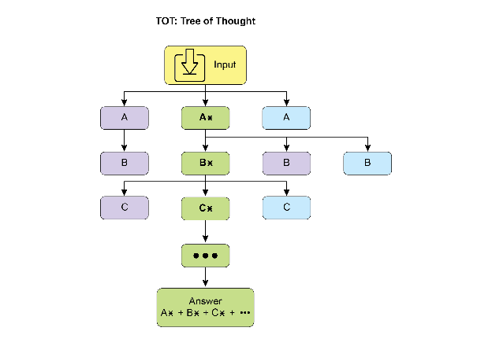
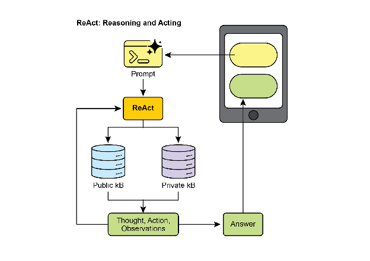
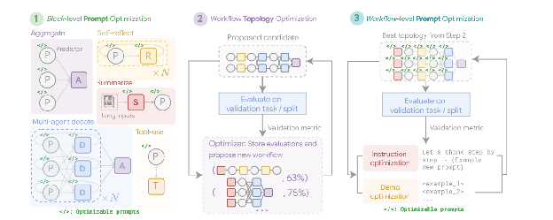
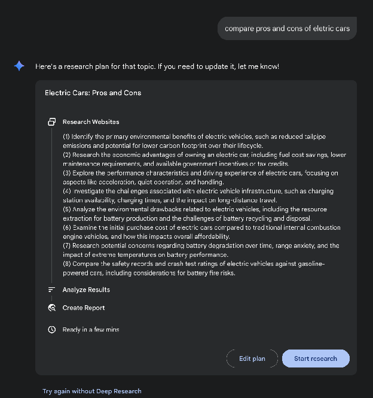
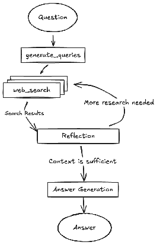
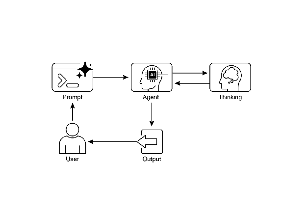

# Chapter 17: Reasoning Techniques

This chapter delves into advanced reasoning methodologies for intelligent agents, focusing on multi-step logical inferences and problem-solving. These techniques go beyond simple sequential operations, making the agent's internal reasoning explicit. This allows agents to break down problems, consider intermediate steps, and reach more robust and accurate conclusions.  A core principle among these advanced methods is the allocation of increased computational resources during inference. This means granting the agent, or the underlying LLM, more processing time or steps to process a query and generate a response. Rather than a quick, single pass, the agent can engage in iterative refinement, explore multiple solution paths, or utilize external tools. This extended processing time during inference often significantly enhances accuracy, coherence, and robustness, especially for complex problems requiring deeper analysis and deliberation.

# Practical Applications & Use Cases

Practical applications include:

* **Complex Question Answering:** Facilitating the resolution of multi-hop queries, which necessitate the integration of data from diverse sources and the execution of logical deductions, potentially involving the examination of multiple reasoning paths, and benefiting from extended inference time to synthesize information.  
* **Mathematical Problem Solving:** Enabling the division of mathematical problems into smaller, solvable components, illustrating the step-by-step process, and employing code execution for precise computations, where prolonged inference enables more intricate code generation and validation.  
* **Code Debugging and Generation:** Supporting an agent's explanation of its rationale for generating or correcting code, pinpointing potential issues sequentially, and iteratively refining the code based on test results (Self-Correction), leveraging extended inference time for thorough debugging cycles.  
* **Strategic Planning:** Assisting in the development of comprehensive plans through reasoning across various options, consequences, and preconditions, and adjusting plans based on real-time feedback (ReAct), where extended deliberation can lead to more effective and reliable plans.  
* **Medical Diagnosis:** Aiding an agent in systematically assessing symptoms, test outcomes, and patient histories to reach a diagnosis, articulating its reasoning at each phase, and potentially utilizing external instruments for data retrieval (ReAct). Increased inference time allows for a more comprehensive differential diagnosis.  
* **Legal Analysis:** Supporting the analysis of legal documents and precedents to formulate arguments or provide guidance, detailing the logical steps taken, and ensuring logical consistency through self-correction. Increased inference time allows for more in-depth legal research and argument construction.

# Reasoning techniques

To start, let's delve into the core reasoning techniques used to enhance the problem-solving abilities of AI models..

**Chain-of-Thought (CoT)** prompting significantly enhances LLMs complex reasoning abilities by mimicking a step-by-step thought process (see Fig. 1). Instead of providing a direct answer, CoT prompts guide the model to generate a sequence of intermediate reasoning steps. This explicit breakdown allows LLMs to tackle complex problems by decomposing them into smaller, more manageable sub-problems. This technique markedly improves the model's performance on tasks requiring multi-step reasoning, such as arithmetic, common sense reasoning, and symbolic manipulation. A primary advantage of CoT is its ability to transform a difficult, single-step problem into a series of simpler steps, thereby increasing the transparency of the LLM's reasoning process. This approach not only boosts accuracy but also offers valuable insights into the model's decision-making, aiding in debugging and comprehension.  CoT can be implemented using various strategies, including offering few-shot examples that demonstrate step-by-step reasoning or simply instructing the model to "think step by step." Its effectiveness stems from its ability to guide the model's internal processing toward a more deliberate and logical progression. As a result, Chain-of-Thought has become a cornerstone technique for enabling advanced reasoning capabilities in contemporary LLMs. This enhanced transparency and breakdown of complex problems into manageable sub-problems is particularly important for autonomous agents, as it enables them to perform more reliable and auditable actions in complex environments.  
   
Fig. 1: CoT prompt alongside the detailed, step-by-step response generated by the agent.

Let's see an example.  It begins with a set of instructions that tell the AI how to think, defining its persona and a clear five-step process to follow. This is the prompt that initiates structured thinking.

Following that, the example shows the CoT process in action. The section labeled "Agent's Thought Process" is the internal monologue where the model executes the instructed steps. This is the literal "chain of thought." Finally, the "Agent's Final Answer" is the polished, comprehensive output generated as a result of that careful, step-by-step reasoning process

```
You are an Information Retrieval Agent. Your goal is to answer the user's question comprehensively and accurately by thinking step-by-step. Here's the process you must follow: 1.  **Analyze the Query:** Understand the core subject and specific requirements of the user's question. Identify key entities, keywords, and the type of information being sought. 2.  **Formulate Search Queries (for Knowledge Base):** Based on your analysis, generate a list of precise search queries that you would use to retrieve relevant information from a knowledge base or external tools. 3.  **Simulate Information Retrieval (Self-Correction/Reasoning):** For each search query, mentally consider what kind of information you expect to find. If you were to retrieve the content, what would be the most relevant snippets? Think about potential ambiguities or missing pieces. 4.  **Synthesize Information:** Based on the simulated retrieval and your understanding of the user's original query, synthesize the gathered information into a coherent and complete answer. Ensure all aspects of the query are addressed. 5.  **Review and Refine:** Before finalizing, critically evaluate your answer. Is it accurate? Is it comprehensive? Is it easy to understand? Is it concise? If not, identify what needs to be improved and how. **User Query:** "Explain the main differences between classical computers and quantum computers, and briefly describe a potential application of quantum computing." **Agent's Thought Process (Internal CoT Output - encouraged by the prompt):** **Thought 1 (Analyze Query):** The user wants two things: 1.  Main differences between classical and quantum computers. 2.  One potential application of quantum computing. Keywords: classical computers, quantum computers, differences, potential application. **Thought 2 (Formulate Search Queries):** - "differences classical vs quantum computers" - "how quantum computers work" - "how classical computers work" - "applications of quantum computing" **Thought 3 (Simulate Information Retrieval & Identify Key Concepts):** - From "differences": Expect concepts like bits vs. qubits, superposition, entanglement, probabilistic nature, computational power for specific problems. - From "how they work": Classical uses transistors/binary. Quantum uses quantum mechanics. - From "applications": Expect drug discovery, material science, cryptography, optimization. **Thought 4 (Synthesize Information):** Classical computers use bits (0 or 1), processing information sequentially. Quantum computers use qubits, which can be 0, 1, or both simultaneously (superposition), and can be entangled, allowing for vastly different computational approaches. This enables them to solve certain problems (like factoring large numbers or simulating complex molecules) far more efficiently than classical computers. A potential application is in drug discovery, where quantum computers could simulate molecular interactions with unprecedented accuracy, accelerating the development of new medicines. **Thought 5 (Review and Refine):** - Differences are covered (bits vs qubits, superposition, entanglement, processing). - Application is given (drug discovery). - Is it brief? Yes. - Is it clear? Yes. - Looks good. **Agent's Final Answer (Output to User):** Classical computers process information using bits, which can be either a 0 or a 1 at any given time, performing operations sequentially. In contrast, quantum computers utilize qubits, which can exist in multiple states simultaneously through superposition and can be linked through entanglement, allowing for exponentially more complex computations. This fundamental difference enables quantum machines to tackle certain problems, such as simulating molecular structures or breaking complex encryption, that are intractable for even the most powerful classical supercomputers. A significant potential application of quantum computing lies in drug discovery, where its ability to precisely model molecular behavior could revolutionize the development of new pharmaceuticals.
```

**Tree-of-Thought (ToT)** is a reasoning technique that builds upon Chain-of-Thought (CoT). It allows large language models to explore multiple reasoning paths by branching into different intermediate steps, forming a tree structure (see Fig. 2\) This approach supports complex problem-solving by enabling backtracking, self-correction, and exploration of alternative solutions. Maintaining a tree of possibilities allows the model to evaluate various reasoning trajectories before finalizing an answer. This iterative process enhances the model's ability to handle challenging tasks that require strategic planning and decision-making.  
  
Fig.2: Example of Tree of Thoughts

**Self-correction**, also known as self-refinement, is a crucial aspect of an agent's reasoning process, particularly within Chain-of-Thought prompting. It involves the agent's internal evaluation of its generated content and intermediate thought processes. This critical review enables the agent to identify ambiguities, information gaps, or inaccuracies in its understanding or solutions. This iterative cycle of reviewing and refining allows the agent to adjust its approach, improve response quality, and ensure accuracy and thoroughness before delivering a final output. This internal critique enhances the agent's capacity to produce reliable and high-quality results, as demonstrated in examples within the dedicated Chapter 4\. 

This example demonstrates a systematic process of self-correction, crucial for refining AI-generated content. It involves an iterative loop of drafting, reviewing against original requirements, and implementing specific improvements. The illustration begins by outlining the AI's function as a "Self-Correction Agent" with a defined five-step analytical and revision workflow. Following this, a subpar "Initial Draft" of a social media post is presented. The "Self-Correction Agent's Thought Process" forms the core of the demonstration. Here, the Agent critically evaluates the draft according to its instructions, pinpointing weaknesses such as low engagement and a vague call to action. It then suggests concrete enhancements, including the use of more impactful verbs and emojis. The process concludes with the "Final Revised Content," a polished and notably improved version that integrates the self-identified adjustments.

```
You are a highly critical and detail-oriented Self-Correction Agent. Your task is to review a previously generated piece of content against its original requirements and identify areas for improvement. Your goal is to refine the content to be more accurate, comprehensive, engaging, and aligned with the prompt. Here's the process you must follow for self-correction: 1.  **Understand Original Requirements:** Review the initial prompt/requirements that led to the content's creation. What was the *original intent*? What were the key constraints or goals? 2.  **Analyze Current Content:** Read the provided content carefully. 3.  **Identify Discrepancies/Weaknesses:** Compare the current content against the original requirements. Look for:    * **Accuracy Issues:** Are there any factual errors or misleading statements?    * **Completeness Gaps:** Does it fully address all aspects of the original prompt? Is anything missing?    * **Clarity & Coherence:** Is the language clear, concise, and easy to understand? Does it flow logically?    * **Tone & Style:** Does it match the desired tone and style (e.g., professional, engaging, concise)?    * **Engagement:** Is it captivating? Does it hold the reader's attention?    * **Redundancy/Verbosity:** Can any parts be condensed or removed without losing meaning? 4.  **Propose Specific Improvements:** For each identified weakness, suggest concrete and actionable changes. Do not just state the problem; propose a solution. 5.  **Generate Revised Content:** Based on your proposed improvements, rewrite the original content to incorporate all the necessary changes. Ensure the revised content is polished and ready for final use. **Original Prompt/Requirements:** "Write a short, engaging social media post (max 150 characters) announcing a new eco-friendly product line: 'GreenTech Gadgets'." **Initial Draft (Content to be corrected):** "We have new products. They are green and techy. Buy GreenTech Gadgets now!" **Self-Correction Agent's Thought Process (Internal CoT Output - encouraged by the prompt):** **Thought 1 (Understand Original Requirements):** - Short, engaging social media post. - Max 150 characters. - Announce "GreenTech Gadgets" - a new eco-friendly product line. **Thought 2 (Analyze Current Content):** "We have new products. They are green and techy. Buy GreenTech Gadgets now!" (64 characters) **Thought 3 (Identify Discrepancies/Weaknesses):** - **Engaging:** Not very engaging. Sounds generic. - **Eco-friendly:** Implied by "green," but not explicitly highlighted as a benefit. - **Call to Action:** "Buy now!" is okay, but could be more compelling. - **Conciseness:** It's short, but could use stronger verbs/phrasing. - **Impact:** Lacks excitement for a new product launch. **Thought 4 (Propose Specific Improvements):** - Make it more dynamic and exciting. - Emphasize "eco-friendly" and "innovation." - Use stronger verbs and more active voice. - Add a clear, engaging call to action. - Ensure it stays under 150 characters. **Thought 5 (Generate Revised Content):** Original: "We have new products. They are green and techy. Buy GreenTech Gadgets now!" Revised idea 1: "🌱 Discover GreenTech Gadgets! Our new eco-friendly line blends innovation with sustainability. Go green, go smart! Shop now! #EcoFriendly #GreenTech" (148 characters) This revision directly addresses eco-friendliness, uses emojis for engagement, adds a stronger call to action, and includes relevant hashtags while staying within the character limit. **Self-Correction Agent's Final Revised Content (Output to User):** 🌱 Discover GreenTech Gadgets! Our new eco-friendly line blends innovation with sustainability. Go green, go smart! Shop now! #EcoFriendly #GreenTech
```

Fundamentally, this technique integrates a quality control measure directly into the Agent's content generation, yielding more refined, precise, and superior results that more effectively meet intricate user demands.

**Program-Aided Language Models (PALMs)** integrate LLMs with symbolic reasoning capabilities. This integration allows the LLM to generate and execute code, such as Python, as part of its problem-solving process. PALMs offload complex calculations, logical operations, and data manipulation to a deterministic programming environment. This approach utilizes the strengths of traditional programming for tasks where LLMs might exhibit limitations in accuracy or consistency. When faced with symbolic challenges, the model can produce code, execute it, and convert the results into natural language. This hybrid methodology combines the LLM's understanding and generation abilities with precise computation, enabling the model to address a wider range of complex problems with potentially increased reliability and accuracy. This is important for agents as it allows them to perform more accurate and reliable actions by leveraging precise computation alongside their understanding and generation capabilities. An example is the use of external tools within Google's ADK for generating code.

```python
from google.adk.tools import agent_tool
from google.adk.agents import Agent
from google.adk.tools import google_search
from google.adk.code_executors import BuiltInCodeExecutor

search_agent = Agent(
    model='gemini-2.0-flash',
    name='SearchAgent',
    instruction="""
    You're a specialist in Google Search
    """,
    tools=[google_search],
)

coding_agent = Agent(
    model='gemini-2.0-flash',
    name='CodeAgent',
    instruction="""
    You're a specialist in Code Execution
    """,
    code_executor=[BuiltInCodeExecutor],
)

root_agent = Agent(
    name="RootAgent",
    model="gemini-2.0-flash",
    description="Root Agent",
    tools=[agent_tool.AgentTool(agent=search_agent), agent_tool.AgentTool(agent=coding_agent)],
)
```

**Reinforcement Learning with Verifiable Rewards (RLVR):** While effective, the standard Chain-of-Thought (CoT) prompting used by many LLMs is a somewhat basic approach to reasoning. It generates a single, predetermined line of thought without adapting to the complexity of the problem. To overcome these limitations, a new class of specialized "reasoning models" has been developed. These models operate differently by dedicating a variable amount of "thinking" time before providing an answer. This "thinking" process produces a more extensive and dynamic Chain-of-Thought that can be thousands of tokens long. This extended reasoning allows for more complex behaviors like self-correction and backtracking, with the model dedicating more effort to harder problems. The key innovation enabling these models is a training strategy called Reinforcement Learning from Verifiable Rewards (RLVR). By training the model on problems with known correct answers (like math or code), it learns through trial and error to generate effective, long-form reasoning. This allows the model to evolve its problem-solving abilities without direct human supervision. Ultimately, these reasoning models don't just produce an answer; they generate a "reasoning trajectory" that demonstrates advanced skills like planning, monitoring, and evaluation. This enhanced ability to reason and strategize is fundamental to the development of autonomous AI agents, which can break down and solve complex tasks with minimal human intervention.

**ReAct** (Reasoning and Acting, see Fig. 3, where KB stands for Knowledge Base) is a paradigm that integrates Chain-of-Thought (CoT) prompting with an agent's ability to interact with external environments through tools. Unlike generative models that produce a final answer, a ReAct agent reasons about which actions to take. This reasoning phase involves an internal planning process, similar to CoT, where the agent determines its next steps, considers available tools, and anticipates outcomes. Following this, the agent acts by executing a tool or function call, such as querying a database, performing a calculation, or interacting with an API. 



Fig.3: Reasoning and Act

ReAct operates in an interleaved manner: the agent executes an action, observes the outcome, and incorporates this observation into subsequent reasoning. This iterative loop of “Thought, Action, Observation, Thought...” allows the agent to dynamically adapt its plan, correct errors, and achieve goals requiring multiple interactions with the environment. This provides a more robust and flexible problem-solving approach compared to linear CoT, as the agent responds to real-time feedback. By combining language model understanding and generation with the capability to use tools, ReAct enables agents to perform complex tasks requiring both reasoning and practical execution. This approach is crucial for agents as it allows them to not only reason but also to practically execute steps and interact with dynamic environments.

**CoD** (Chain of Debates) is a formal AI framework proposed by Microsoft where multiple, diverse models collaborate and argue to solve a problem, moving beyond a single AI's "chain of thought." This system operates like an AI council meeting, where different models present initial ideas, critique each other's reasoning, and exchange counterarguments. The primary goal is to enhance accuracy, reduce bias, and improve the overall quality of the final answer by leveraging collective intelligence. Functioning as an AI version of peer review, this method creates a transparent and trustworthy record of the reasoning process. Ultimately, it represents a shift from a solitary Agent providing an answer to a collaborative team of Agents working together to find a more robust and validated solution.

**GoD** (Graph of Debates)  is an advanced Agentic framework that reimagines discussion as a dynamic, non-linear network rather than a simple chain. In this model, arguments are individual nodes connected by edges that signify relationships like 'supports' or 'refutes,' reflecting the multi-threaded nature of real debate. This structure allows new lines of inquiry to dynamically branch off, evolve independently, and even merge over time. A conclusion is reached not at the end of a sequence, but by identifying the most robust and well-supported cluster of arguments within the entire graph. In this context, "well-supported" refers to knowledge that is firmly established and verifiable. This can include information considered to be ground truth, which means it is inherently correct and widely accepted as fact. Additionally, it encompasses factual evidence obtained through search grounding, where information is validated against external sources and real-world data. Finally, it also pertains to a consensus reached by multiple models during a debate, indicating a high degree of agreement and confidence in the information presented. This comprehensive approach ensures a more robust and reliable foundation for the information being discussed. This approach provides a more holistic and realistic model for complex, collaborative AI reasoning.

**MASS (optional advanced topic):** An in-depth analysis of the design of multi-agent systems reveals that their effectiveness is critically dependent on both the quality of the prompts used to program individual agents and the topology that dictates their interactions. The complexity of designing these systems is significant, as it involves a vast and intricate search space. To address this challenge, a novel framework called Multi-Agent System Search (MASS) was developed to automate and optimize the design of MAS.

MASS employs a multi-stage optimization strategy that systematically navigates the complex design space by interleaving prompt and topology optimization (see Fig. 4\)

#### **1\. Block-Level Prompt Optimization:** The process begins with a local optimization of prompts for individual agent types, or "blocks," to ensure each component performs its role effectively before being integrated into a larger system. This initial step is crucial as it ensures that the subsequent topology optimization builds upon well-performing agents, rather than suffering from the compounding impact of poorly configured ones. For example, when optimizing for the HotpotQA dataset, the prompt for a "Debator" agent is creatively framed to instruct it to act as an "expert fact-checker for a major publication". Its optimized task is to meticulously review proposed answers from other agents, cross-reference them with provided context passages, and identify any inconsistencies or unsupported claims. This specialized role-playing prompt, discovered during block-level optimization, aims to make the debator agent highly effective at synthesizing information before it's even placed into a larger workflow.

#### **2\. Workflow Topology Optimization:** Following local optimization, MASS optimizes the workflow topology by selecting and arranging different agent interactions from a customizable design space. To make this search efficient, MASS employs an influence-weighted method. This method calculates the "incremental influence" of each topology by measuring its performance gain relative to a baseline agent and uses these scores to guide the search toward more promising combinations. For instance, when optimizing for the MBPP coding task, the topology search discovers that a specific hybrid workflow is most effective. The best-found topology is not a simple structure but a combination of an iterative refinement process with external tool use. Specifically, it consists of one predictor agent that engages in several rounds of reflection, with its code being verified by one executor agent that runs the code against test cases. This discovered workflow shows that for coding, a structure that combines iterative self-correction with external verification is superior to simpler MAS designs.



#### Fig. 4: (Courtesy of the Authors): The Multi-Agent System Search (MASS) Framework is a three-stage optimization process that navigates a search space encompassing optimizable prompts (instructions and demonstrations) and configurable agent building blocks (Aggregate, Reflect, Debate, Summarize, and Tool-use). The first stage, Block-level Prompt Optimization, independently optimizes prompts for each agent module. Stage two, Workflow Topology Optimization, samples valid system configurations from an influence-weighted design space, integrating the optimized prompts. The final stage, Workflow-level Prompt Optimization, involves a second round of prompt optimization for the entire multi-agent system after the optimal workflow from Stage two has been identified.

#### **3\. Workflow-Level Prompt Optimization:** The final stage involves a global optimization of the entire system's prompts. After identifying the best-performing topology, the prompts are fine-tuned as a single, integrated entity to ensure they are tailored for orchestration and that agent interdependencies are optimized. As an example, after finding the best topology for the DROP dataset, the final optimization stage refines the "Predictor" agent's prompt. The final, optimized prompt is highly detailed, beginning by providing the agent with a summary of the dataset itself, noting its focus on "extractive question answering" and "numerical information". It then includes few-shot examples of correct question-answering behavior and frames the core instruction as a high-stakes scenario: "You are a highly specialized AI tasked with extracting critical numerical information for an urgent news report. A live broadcast is relying on your accuracy and speed". This multi-faceted prompt, combining meta-knowledge, examples, and role-playing, is tuned specifically for the final workflow to maximize accuracy.

#### Key Findings and Principles: Experiments demonstrate that MAS optimized by MASS significantly outperform existing manually designed systems and other automated design methods across a range of tasks. The key design principles for effective MAS, as derived from this research, are threefold:

* Optimize individual agents with high-quality prompts before composing them.  
* Construct MAS by composing influential topologies rather than exploring an unconstrained search space.  
* Model and optimize the interdependencies between agents through a final, workflow-level joint optimization.

Building on our discussion of key reasoning techniques, let's first examine a core performance principle: the Scaling Inference Law for LLMs. This law states that a model's performance predictably improves as the computational resources allocated to it increase. We can see this principle in action in complex systems like Deep Research, where an AI agent leverages these resources to autonomously investigate a topic by breaking it down into sub-questions, using Web search as a tool, and synthesizing its findings.

**Deep Research.** The term "Deep Research" describes a category of AI Agentic tools designed to act as tireless, methodical research assistants. Major platforms in this space include Perplexity AI, Google's Gemini research capabilities, and OpenAI's advanced functions within ChatGPT (see Fig.5).

Fig. 5: Google Deep Research for Information Gathering

A fundamental shift introduced by these tools is the change in the search process itself. A standard search provides immediate links, leaving the work of synthesis to you. Deep Research operates on a different model. Here, you task an AI with a complex query and grant it a "time budget"—usually a few minutes. In return for this patience, you receive a detailed report.

During this time, the AI works on your behalf in an agentic way. It autonomously performs a series of sophisticated steps that would be incredibly time-consuming for a person:

1. Initial Exploration: It runs multiple, targeted searches based on your initial prompt.  
2. Reasoning and Refinement: It reads and analyzes the first wave of results, synthesizes the findings, and critically identifies gaps, contradictions, or areas that require more detail.  
3. Follow-up Inquiry: Based on its internal reasoning, it conducts new, more nuanced searches to fill those gaps and deepen its understanding.  
4. Final Synthesis: After several rounds of this iterative searching and reasoning, it compiles all the validated information into a single, cohesive, and structured summary.

This systematic approach ensures a comprehensive and well-reasoned response, significantly enhancing the efficiency and depth of information gathering, thereby facilitating more agentic decision-making.

Scaling Inference Law 

This critical principle dictates the relationship between an LLM's performance and the computational resources allocated during its operational phase, known as inference. The Inference Scaling Law differs from the more familiar scaling laws for training, which focus on how model quality improves with increased data volume and computational power during a model's creation. Instead, this law specifically examines the dynamic trade-offs that occur when an LLM is actively generating an output or answer.

A cornerstone of this law is the revelation that superior results can frequently be achieved from a comparatively smaller LLM by augmenting the computational investment at inference time. This doesn't necessarily mean using a more powerful GPU, but rather employing more sophisticated or resource-intensive inference strategies. A prime example of such a strategy is instructing the model to generate multiple potential answers—perhaps through techniques like diverse beam search or self-consistency methods—and then employing a selection mechanism to identify the most optimal output. This iterative refinement or multiple-candidate generation process demands more computational cycles but can significantly elevate the quality of the final response.

This principle offers a crucial framework for informed and economically sound decision-making in the deployment of Agents systems. It challenges the intuitive notion that a larger model will always yield better performance. The law posits that a smaller model, when granted a more substantial "thinking budget" during inference, can occasionally surpass the performance of a much larger model that relies on a simpler, less computationally intensive generation process. The "thinking budget" here refers to the additional computational steps or complex algorithms applied during inference, allowing the smaller model to explore a wider range of possibilities or apply more rigorous internal checks before settling on an answer.

Consequently, the Scaling Inference Law becomes fundamental to constructing efficient and cost-effective Agentic systems. It provides a methodology for meticulously balancing several interconnected factors:

* **Model Size:** Smaller models are inherently less demanding in terms of memory and storage.  
* **Response Latency:** While increased inference-time computation can add to latency, the law helps identify the point at which the performance gains outweigh this increase, or how to strategically apply computation to avoid excessive delays.  
* **Operational Cost:** Deploying and running larger models typically incurs higher ongoing operational costs due to increased power consumption and infrastructure requirements. The law demonstrates how to optimize performance without unnecessarily escalating these costs.

By understanding and applying the Scaling Inference Law, developers and organizations can make strategic choices that lead to optimal performance for specific agentic applications, ensuring that computational resources are allocated where they will have the most significant impact on the quality and utility of the LLM's output. This allows for more nuanced and economically viable approaches to AI deployment, moving beyond a simple "bigger is better" paradigm.

# Hands-On Code Example

The DeepSearch code, open-sourced by Google, is available through the gemini-fullstack-langgraph-quickstart repository (Fig. 6). This repository provides a template for developers to construct full-stack AI agents using Gemini 2.5 and the LangGraph orchestration framework. This open-source stack facilitates experimentation with agent-based architectures and can be integrated with local LLLMs such as Gemma. It utilizes Docker and modular project scaffolding for rapid prototyping. It should be noted that this release serves as a well-structured demonstration and is not intended as a production-ready backend.



Fig. 6: (Courtesy of authors) Example of DeepSearch with multiple Reflection steps

This project provides a full-stack application featuring a React frontend and a LangGraph backend, designed for advanced research and conversational AI. A LangGraph agent dynamically generates search queries using Google Gemini models and integrates web research via the Google Search API. The system employs reflective reasoning to identify knowledge gaps, refine searches iteratively, and synthesize answers with citations. The frontend and backend support hot-reloading. The project's structure includes separate frontend/ and backend/ directories. Requirements for setup include Node.js, npm, Python 3.8+, and a Google Gemini API key. After configuring the API key in the backend's .env file, dependencies for both the backend (using pip install .) and frontend (npm install) can be installed. Development servers can be run concurrently with make dev or individually. The backend agent, defined in backend/src/agent/graph.py, generates initial search queries, conducts web research, performs knowledge gap analysis, refines queries iteratively, and synthesizes a cited answer using a Gemini model. Production deployment involves the backend server delivering a static frontend build and requires Redis for streaming real-time output and a Postgres database for managing data. A Docker image can be built and run using docker-compose up, which also requires a LangSmith API key for the docker-compose.yml example. The application utilizes React with Vite, Tailwind CSS, Shadcn UI, LangGraph, and Google Gemini. The project is licensed under the Apache License 2.0.

```python
# Create our Agent Graph
builder = StateGraph(OverallState, config_schema=Configuration)

# Define the nodes we will cycle between
builder.add_node("generate_query", generate_query)
builder.add_node("web_research", web_research)
builder.add_node("reflection", reflection)
builder.add_node("finalize_answer", finalize_answer)

# Set the entrypoint as `generate_query`
# This means that this node is the first one called
builder.add_edge(START, "generate_query")

# Add conditional edge to continue with search queries in a parallel branch
builder.add_conditional_edges(
    "generate_query", continue_to_web_research, ["web_research"]
)

# Reflect on the web research
builder.add_edge("web_research", "reflection")

# Evaluate the research
builder.add_conditional_edges(
    "reflection", evaluate_research, ["web_research", "finalize_answer"]
)

# Finalize the answer
builder.add_edge("finalize_answer", END)

graph = builder.compile(name="pro-search-agent")
```

Fig.4: Example of DeepSearch with LangGraph (code from backend/src/agent/graph.py)

# So, what do agents think?

In summary, an agent's thinking process is a structured approach that combines reasoning and acting to solve problems. This method allows an agent to explicitly plan its steps, monitor its progress, and interact with external tools to gather information.

At its core, the agent's "thinking" is facilitated by a powerful LLM. This LLM generates a series of thoughts that guide the agent's subsequent actions. The process typically follows a thought-action-observation loop:

1. **Thought:** The agent first generates a textual thought that breaks down the problem, formulates a plan, or analyzes the current situation. This internal monologue makes the agent's reasoning process transparent and steerable.  
2. **Action:** Based on the thought, the agent selects an action from a predefined, discrete set of options. For example, in a question-answering scenario, the action space might include searching online, retrieving information from a specific webpage, or providing a final answer.  
3. **Observation:** The agent then receives feedback from its environment based on the action taken. This could be the results of a web search or the content of a webpage.

This cycle repeats, with each observation informing the next thought, until the agent determines that it has reached a final solution and performs a "finish" action.

The effectiveness of this approach relies on the advanced reasoning and planning capabilities of the underlying LLM. To guide the agent, the ReAct framework often employs few-shot learning, where the LLM is provided with examples of human-like problem-solving trajectories. These examples demonstrate how to effectively combine thoughts and actions to solve similar tasks.

The frequency of an agent's thoughts can be adjusted depending on the task. For knowledge-intensive reasoning tasks like fact-checking, thoughts are typically interleaved with every action to ensure a logical flow of information gathering and reasoning. In contrast, for decision-making tasks that require many actions, such as navigating a simulated environment, thoughts may be used more sparingly, allowing the agent to decide when thinking is necessary

# At a Glance

**What**: Complex problem-solving often requires more than a single, direct answer, posing a significant challenge for AI. The core problem is enabling AI agents to tackle multi-step tasks that demand logical inference, decomposition, and strategic planning. Without a structured approach, agents may fail to handle intricacies, leading to inaccurate or incomplete conclusions. These advanced reasoning methodologies aim to make an agent's internal "thought" process explicit, allowing it to systematically work through challenges.

**Why:** The standardized solution is a suite of reasoning techniques that provide a structured framework for an agent's problem-solving process. Methodologies like Chain-of-Thought (CoT) and Tree-of-Thought (ToT) guide LLMs to break down problems and explore multiple solution paths. Self-Correction allows for the iterative refinement of answers, ensuring higher accuracy. Agentic frameworks like ReAct integrate reasoning with action, enabling agents to interact with external tools and environments to gather information and adapt their plans. This combination of explicit reasoning, exploration, refinement, and tool use creates more robust, transparent, and capable AI systems.

**Rule of thumb:** Use these reasoning techniques when a problem is too complex for a single-pass answer and requires decomposition, multi-step logic, interaction with external data sources or tools, or strategic planning and adaptation. They are ideal for tasks where showing the "work" or thought process is as important as the final answer.

**Visual summary**



Fig. 7: Reasoning design pattern

# Key Takeaways

* By making their reasoning explicit, agents can formulate transparent, multi-step plans, which is the foundational capability for autonomous action and user trust.  
* The ReAct framework provides agents with their core operational loop, empowering them to move beyond mere reasoning and interact with external tools to dynamically act and adapt within an environment.  
* The Scaling Inference Law implies an agent's performance is not just about its underlying model size, but its allocated "thinking time," allowing for more deliberate and higher-quality autonomous actions.  
* Chain-of-Thought (CoT) serves as an agent's internal monologue, providing a structured way to formulate a plan by breaking a complex goal into a sequence of manageable actions.  
* Tree-of-Thought and Self-Correction give agents the crucial ability to deliberate, allowing them to evaluate multiple strategies, backtrack from errors, and improve their own plans before execution.  
* Collaborative frameworks like Chain of Debates (CoD) signal the shift from solitary agents to multi-agent systems, where teams of agents can reason together to tackle more complex problems and reduce individual biases.  
* Applications like Deep Research demonstrate how these techniques culminate in agents that can execute complex, long-running tasks, such as in-depth investigation, completely autonomously on a user's behalf.  
* To build effective teams of agents, frameworks like MASS automate the optimization of how individual agents are instructed and how they interact, ensuring the entire multi-agent system performs optimally.  
* By integrating these reasoning techniques, we build agents that are not just automated but truly autonomous, capable of being trusted to plan, act, and solve complex problems without direct supervision.

# Conclusions

Modern AI is evolving from passive tools into autonomous agents, capable of tackling complex goals through structured reasoning. This agentic behavior begins with an internal monologue, powered by techniques like Chain-of-Thought (CoT), which allows an agent to formulate a coherent plan before acting. True autonomy requires deliberation, which agents achieve through Self-Correction and Tree-of-Thought (ToT), enabling them to evaluate multiple strategies and independently improve their own work. The pivotal leap to fully agentic systems comes from the ReAct framework, which empowers an agent to move beyond thinking and start acting by using external tools. This establishes the core agentic loop of thought, action, and observation, allowing the agent to dynamically adapt its strategy based on environmental feedback.

An agent's capacity for deep deliberation is fueled by the Scaling Inference Law, where more computational "thinking time" directly translates into more robust autonomous actions. The next frontier is the multi-agent system, where frameworks like Chain of Debates (CoD) create collaborative agent societies that reason together to achieve a common goal. This is not theoretical; agentic applications like Deep Research already demonstrate how autonomous agents can execute complex, multi-step investigations on a user's behalf. The overarching goal is to engineer reliable and transparent autonomous agents that can be trusted to independently manage and solve intricate problems. Ultimately, by combining explicit reasoning with the power to act, these methodologies are completing the transformation of AI into truly agentic problem-solvers.

# References

Relevant research includes:

1. "Chain-of-Thought Prompting Elicits Reasoning in Large Language Models" by Wei et al. (2022)  
2. "Tree of Thoughts: Deliberate Problem Solving with Large Language Models" by Yao et al. (2023)  
3. "Program-Aided Language Models" by Gao et al. (2023)  
4. "ReAct: Synergizing Reasoning and Acting in Language Models" by Yao et al. (2023)  
5. Inference Scaling Laws: An Empirical Analysis of Compute-Optimal Inference for LLM Problem-Solving, 2024  
6. Multi-Agent Design: Optimizing Agents with Better Prompts and Topologies, [https://arxiv.org/abs/2502.02533](https://arxiv.org/abs/2502.02533) 


