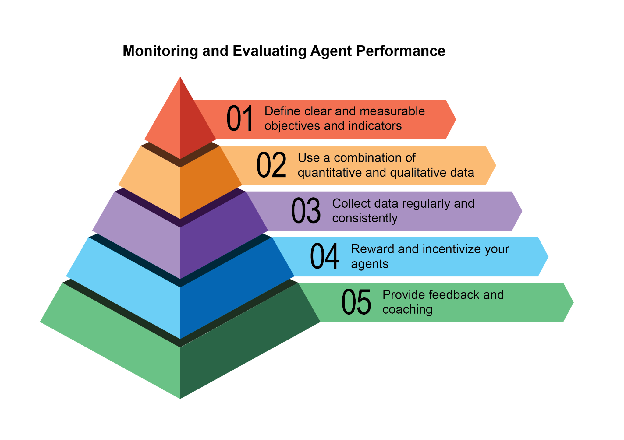
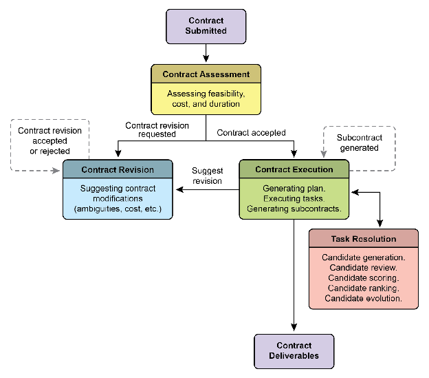
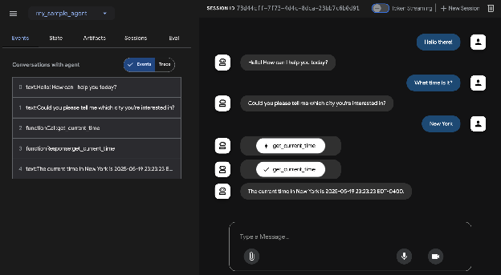
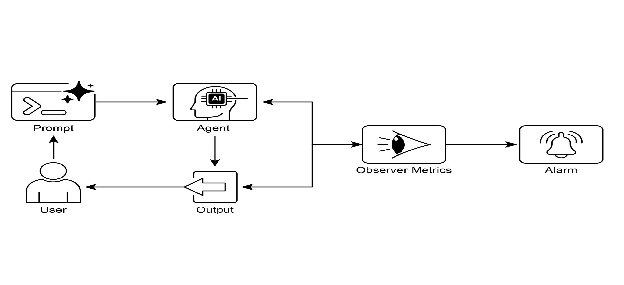

# Chapter 19: Evaluation and Monitoring

This chapter examines methodologies that allow intelligent agents to systematically assess their performance, monitor progress toward goals, and detect operational anomalies. While Chapter 11 outlines goal setting and monitoring, and Chapter 17 addresses Reasoning mechanisms, this chapter focuses on the continuous, often external, measurement of an agent's effectiveness, efficiency, and compliance with requirements. This includes defining metrics, establishing feedback loops, and implementing reporting systems to ensure agent performance aligns with expectations in operational environments (see Fig.1)



Fig:1. Best practices for evaluation and monitoring

# Practical Applications & Use Cases

Most Common Applications and Use Cases:

* **Performance Tracking in Live Systems:** Continuously monitoring the accuracy, latency, and resource consumption of an agent deployed in a production environment (e.g., a customer service chatbot's resolution rate, response time).  
* **A/B Testing for Agent Improvements:** Systematically comparing the performance of different agent versions or strategies in parallel to identify optimal approaches (e.g., trying two different planning algorithms for a logistics agent).  
* **Compliance and Safety Audits:** Generate automated audit reports that track an agent's compliance with ethical guidelines, regulatory requirements, and safety protocols over time. These reports can be verified by a human-in-the-loop or another agent, and can generate KPIs or trigger alerts upon identifying issues.  
* **Enterprise systems:** To govern Agentic AI in corporate systems, a new control instrument, the AI "Contract," is needed. This dynamic agreement codifies the objectives, rules, and controls for AI-delegated tasks.  
* **Drift Detection:** Monitoring the relevance or accuracy of an agent's outputs over time, detecting when its performance degrades due to changes in input data distribution (concept drift) or environmental shifts.  
* **Anomaly Detection in Agent Behavior:** Identifying unusual or unexpected actions taken by an agent that might indicate an error, a malicious attack, or an emergent un-desired behavior.  
* **Learning Progress Assessment:** For agents designed to learn, tracking their learning curve, improvement in specific skills, or generalization capabilities over different tasks or data sets.

# Hands-On Code Example

Developing a comprehensive evaluation framework for AI agents is a challenging endeavor, comparable to an academic discipline or a substantial publication in its complexity. This difficulty stems from the multitude of factors to consider, such as model performance, user interaction, ethical implications, and broader societal impact. Nevertheless, for practical implementation, the focus can be narrowed to critical use cases essential for the efficient and effective functioning of AI agents.

**Agent Response Assessment:** This core process is essential for evaluating the quality and accuracy of an agent's outputs. It involves determining if the agent delivers pertinent, correct,  logical, unbiased, and accurate information in response to given inputs. Assessment metrics may include factual correctness, fluency, grammatical precision, and adherence to the user's intended purpose.

```python
def evaluate_response_accuracy(agent_output: str, expected_output: str) -> float:
    """Calculates a simple accuracy score for agent responses."""
    # This is a very basic exact match; real-world would use more sophisticated metrics
    return 1.0 if agent_output.strip().lower() == expected_output.strip().lower() else 0.0

# Example usage
agent_response = "The capital of France is Paris."
ground_truth = "Paris is the capital of France."
score = evaluate_response_accuracy(agent_response, ground_truth)
print(f"Response accuracy: {score}")
```

The Python function \`evaluate\_response\_accuracy\` calculates a basic accuracy score for an AI agent's response by performing an exact, case-insensitive comparison between the agent's output and the expected output, after removing leading or trailing whitespace. It returns a score of 1.0 for an exact match and 0.0 otherwise, representing a binary correct or incorrect evaluation. This method, while straightforward for simple checks, does not account for variations like paraphrasing or semantic equivalence.

The problem lies in its method of comparison. The function performs a strict, character-for-character comparison of the two strings. In the example provided:

* agent\_response: "The capital of France is Paris."  
* ground\_truth: "Paris is the capital of France."

Even after removing whitespace and converting to lowercase, these two strings are not identical. As a result, the function will incorrectly return an accuracy score of `0.0`, even though both sentences convey the same meaning.

A straightforward comparison falls short in assessing semantic similarity, only succeeding if an agent's response exactly matches the expected output. A more effective evaluation necessitates advanced Natural Language Processing (NLP) techniques to discern the meaning between sentences. For thorough AI agent evaluation in real-world scenarios, more sophisticated metrics are often indispensable. These metrics can encompass String Similarity Measures like Levenshtein distance and Jaccard similarity, Keyword Analysis for the presence or absence of specific keywords, Semantic Similarity using cosine similarity with embedding models, LLM-as-a-Judge Evaluations (discussed later for assessing nuanced correctness and helpfulness), and RAG-specific Metrics such as faithfulness and relevance.

**Latency Monitoring:** Latency Monitoring for Agent Actions is crucial in applications where the speed of an AI agent's response or action is a critical factor. This process measures the duration required for an agent to process requests and generate outputs. Elevated latency can adversely affect user experience and the agent's overall effectiveness, particularly in real-time or interactive environments. In practical applications, simply printing latency data to the console is insufficient. Logging this information to a persistent storage system is recommended. Options include structured log files (e.g., JSON), time-series databases (e.g., InfluxDB, Prometheus), data warehouses (e.g., Snowflake, BigQuery, PostgreSQL), or observability platforms (e.g., Datadog, Splunk, Grafana Cloud).

**Tracking Token Usage for LLM Interactions:** For LLM-powered agents, tracking token usage is crucial for managing costs and optimizing resource allocation. Billing for LLM interactions often depends on the number of tokens processed (input and output). Therefore, efficient token usage directly reduces operational expenses. Additionally, monitoring token counts helps identify potential areas for improvement in prompt engineering or response generation processes.

```python
# This is conceptual as actual token counting depends on the LLM API
class LLMInteractionMonitor:
    def __init__(self):
        self.total_input_tokens = 0
        self.total_output_tokens = 0

    def record_interaction(self, prompt: str, response: str):
        # In a real scenario, use LLM API's token counter or a tokenizer
        input_tokens = len(prompt.split()) # Placeholder
        output_tokens = len(response.split()) # Placeholder
        self.total_input_tokens += input_tokens
        self.total_output_tokens += output_tokens
        print(f"Recorded interaction: Input tokens={input_tokens}, Output tokens={output_tokens}")

    def get_total_tokens(self):
        return self.total_input_tokens, self.total_output_tokens

# Example usage
monitor = LLMInteractionMonitor()
monitor.record_interaction("What is the capital of France?", "The capital of France is Paris.")
monitor.record_interaction("Tell me a joke.", "Why don't scientists trust atoms? Because they make up everything!")
input_t, output_t = monitor.get_total_tokens()
print(f"Total input tokens: {input_t}, Total output tokens: {output_t}")
```

This section introduces a conceptual Python class, \`LLMInteractionMonitor\`, developed to track token usage in large language model interactions. The class incorporates counters for both input and output tokens. Its \`record\_interaction\` method simulates token counting by splitting the prompt and response strings. In a practical implementation, specific LLM API tokenizers would be employed for precise token counts. As interactions occur, the monitor accumulates the total input and output token counts. The \`get\_total\_tokens\` method provides access to these cumulative totals, essential for cost management and optimization of LLM usage.

**Custom Metric for "Helpfulness" using LLM-as-a-Judge:** Evaluating subjective qualities like an AI agent's "helpfulness" presents challenges beyond standard objective metrics. A potential framework involves using an LLM as an evaluator. This LLM-as-a-Judge approach assesses another AI agent's output based on predefined criteria for "helpfulness." Leveraging the advanced linguistic capabilities of LLMs, this method offers nuanced, human-like evaluations of subjective qualities, surpassing simple keyword matching or rule-based assessments. Though in development, this technique shows promise for automating and scaling qualitative evaluations.

```python
import google.generativeai as genai
import os
import json
import logging
from typing import Optional

# --- Configuration ---
logging.basicConfig(level=logging.INFO, format='%(asctime)s - %(levelname)s - %(message)s')

# Set your API key as an environment variable to run this script
# For example, in your terminal: export GOOGLE_API_KEY='your_key_here'
try:
    genai.configure(api_key=os.environ["GOOGLE_API_KEY"])
except KeyError:
    logging.error("Error: GOOGLE_API_KEY environment variable not set.")
    exit(1)

# --- LLM-as-a-Judge Rubric for Legal Survey Quality ---
LEGAL_SURVEY_RUBRIC = """
You are an expert legal survey methodologist and a critical legal reviewer. Your task is to evaluate the quality of a given legal survey question. Provide a score from 1 to 5 for overall quality, along with a detailed rationale and specific feedback. Focus on the following criteria:

1.  **Clarity & Precision (Score 1-5):**
   * 1: Extremely vague, highly ambiguous, or confusing.
   * 3: Moderately clear, but could be more precise.
   * 5: Perfectly clear, unambiguous, and precise in its legal terminology (if applicable) and intent.

2.  **Neutrality & Bias (Score 1-5):**
   * 1: Highly leading or biased, clearly influencing the respondent towards a specific answer.
   * 3: Slightly suggestive or could be interpreted as leading.
   * 5: Completely neutral, objective, and free from any leading language or loaded terms.

3.  **Relevance & Focus (Score 1-5):**
   * 1: Irrelevant to the stated survey topic or out of scope.
   * 3: Loosely related but could be more focused.
   * 5: Directly relevant to the survey's objectives and well-focused on a single concept.

4.  **Completeness (Score 1-5):**
   * 1: Omits critical information needed to answer accurately or provides insufficient context.
   * 3: Mostly complete, but minor details are missing.
   * 5: Provides all necessary context and information for the respondent to answer thoroughly.

5.  **Appropriateness for Audience (Score 1-5):**
   * 1: Uses jargon inaccessible to the target audience or is overly simplistic for experts.
   * 3: Generally appropriate, but some terms might be challenging or oversimplified.
   * 5: Perfectly tailored to the assumed legal knowledge and background of the target survey audience.

**Output Format:**
Your response MUST be a JSON object with the following keys:
* `overall_score`: An integer from 1 to 5 (average of criterion scores, or your holistic judgment).
* `rationale`: A concise summary of why this score was given, highlighting major strengths and weaknesses.
* `detailed_feedback`: A bullet-point list detailing feedback for each criterion (Clarity, Neutrality, Relevance, Completeness, Audience Appropriateness). Suggest specific improvements.
* `concerns`: A list of any specific legal, ethical, or methodological concerns.
* `recommended_action`: A brief recommendation (e.g., "Revise for neutrality", "Approve as is", "Clarify scope").
"""

class LLMJudgeForLegalSurvey:
    """A class to evaluate legal survey questions using a generative AI model."""

    def __init__(self, model_name: str = 'gemini-1.5-flash-latest', temperature: float = 0.2):
        """
        Initializes the LLM Judge.

        Args:
            model_name (str): The name of the Gemini model to use.
                              'gemini-1.5-flash-latest' is recommended for speed and cost.
                              'gemini-1.5-pro-latest' offers the highest quality.
            temperature (float): The generation temperature. Lower is better for deterministic evaluation.
        """
        self.model = genai.GenerativeModel(model_name)
        self.temperature = temperature

    def _generate_prompt(self, survey_question: str) -> str:
        """Constructs the full prompt for the LLM judge."""
        return f"{LEGAL_SURVEY_RUBRIC}\n\n---\n**LEGAL SURVEY QUESTION TO EVALUATE:**\n{survey_question}\n---"

    def judge_survey_question(self, survey_question: str) -> Optional[dict]:
        """
        Judges the quality of a single legal survey question using the LLM.

        Args:
            survey_question (str): The legal survey question to be evaluated.

        Returns:
            Optional[dict]: A dictionary containing the LLM's judgment, or None if an error occurs.
        """
        full_prompt = self._generate_prompt(survey_question)

        try:
            logging.info(f"Sending request to '{self.model.model_name}' for judgment...")
            response = self.model.generate_content(
                full_prompt,
                generation_config=genai.types.GenerationConfig(
                    temperature=self.temperature,
                    response_mime_type="application/json"
                )
            )

            # Check for content moderation or other reasons for an empty response.
            if not response.parts:
                safety_ratings = response.prompt_feedback.safety_ratings
                logging.error(f"LLM response was empty or blocked. Safety Ratings: {safety_ratings}")
                return None

            return json.loads(response.text)

        except json.JSONDecodeError:
            logging.error(f"Failed to decode LLM response as JSON. Raw response: {response.text}")
            return None
        except Exception as e:
            logging.error(f"An unexpected error occurred during LLM judgment: {e}")
            return None

# --- Example Usage ---
if __name__ == "__main__":
    judge = LLMJudgeForLegalSurvey()

    # --- Good Example ---
    good_legal_survey_question = """
    To what extent do you agree or disagree that current intellectual property laws in Switzerland adequately protect emerging AI-generated content, assuming the content meets the originality criteria established by the Federal Supreme Court?
    (Select one: Strongly Disagree, Disagree, Neutral, Agree, Strongly Agree)
    """
    print("\n--- Evaluating Good Legal Survey Question ---")
    judgment_good = judge.judge_survey_question(good_legal_survey_question)
    if judgment_good:
        print(json.dumps(judgment_good, indent=2))

    # --- Biased/Poor Example ---
    biased_legal_survey_question = """
    Don't you agree that overly restrictive data privacy laws like the FADP are hindering essential technological innovation and economic growth in Switzerland?
    (Select one: Yes, No)
    """
    print("\n--- Evaluating Biased Legal Survey Question ---")
    judgment_biased = judge.judge_survey_question(biased_legal_survey_question)
    if judgment_biased:
        print(json.dumps(judgment_biased, indent=2))

    # --- Ambiguous/Vague Example ---
    vague_legal_survey_question = """
    What are your thoughts on legal tech?
    """
    print("\n--- Evaluating Vague Legal Survey Question ---")
    judgment_vague = judge.judge_survey_question(vague_legal_survey_question)
    if judgment_vague:
        print(json.dumps(judgment_vague, indent=2))
```

The Python code defines a class LLMJudgeForLegalSurvey designed to evaluate the quality of legal survey questions using a generative AI model. It utilizes the google.generativeai library to interact with Gemini models. 

The core functionality involves sending a survey question to the model along with a detailed rubric for evaluation. The rubric specifies five criteria for judging survey questions: Clarity & Precision, Neutrality & Bias, Relevance & Focus, Completeness, and Appropriateness for Audience. For each criterion, a score from 1 to 5 is assigned, and a detailed rationale and feedback are required in the output. The code constructs a prompt that includes the rubric and the survey question to be evaluated. 

The judge\_survey\_question method sends this prompt to the configured Gemini model, requesting a JSON response formatted according to the defined structure. The expected output JSON includes an overall score, a summary rationale, detailed feedback for each criterion, a list of concerns, and a recommended action. The class handles potential errors during the AI model interaction, such as JSON decoding issues or empty responses. The script demonstrates its operation by evaluating examples of legal survey questions, illustrating how the AI assesses quality based on the predefined criteria.

Before we conclude, let's examine various evaluation methods, considering their strengths and weaknesses.

| Evaluation Method | Strengths | Weaknesses |
| :---- | :---- | :---- |
| Human Evaluation  | Captures subtle behavior | Difficult to scale, expensive, and time-consuming, as it considers subjective human factors. |
| LLM-as-a-Judge | Consistent, efficient, and scalable.  | Intermediate steps may be overlooked. Limited by LLM capabilities. |
| Automated Metrics  | Scalable, efficient, and objective | Potential limitation in capturing complete capabilities. |

# Agents trajectories 

Evaluating agents' trajectories is essential, as traditional software tests are insufficient. Standard code yields predictable pass/fail results, whereas agents operate probabilistically, necessitating qualitative assessment of both the final output and the agent's trajectory—the sequence of steps taken to reach a solution. Evaluating multi-agent systems is challenging because they are constantly in flux. This requires developing sophisticated metrics that go beyond individual performance to measure the effectiveness of communication and teamwork. Moreover, the environments themselves are not static, demanding that evaluation methods, including test cases, adapt over time.

This involves examining the quality of decisions, the reasoning process, and the overall outcome. Implementing automated evaluations is valuable, particularly for development beyond the prototype stage. Analyzing trajectory and tool use includes evaluating the steps an agent employs to achieve a goal, such as tool selection, strategies, and task efficiency. For example, an agent addressing a customer's product query might ideally follow a trajectory involving intent determination, database search tool use, result review, and report generation. The agent's actual actions are compared to this expected, or ground truth, trajectory to identify errors and inefficiencies. Comparison methods include exact match (requiring a perfect match to the ideal sequence), in-order match (correct actions in order, allowing extra steps), any-order match (correct actions in any order, allowing extra steps), precision (measuring the relevance of predicted actions), recall (measuring how many essential actions are captured), and single-tool use (checking for a specific action). Metric selection depends on specific agent requirements, with high-stakes scenarios potentially demanding an exact match, while more flexible situations might use an in-order or any-order match.

Evaluation of AI agents involves two primary approaches: using test files and using evalset files. Test files, in JSON format, represent single, simple agent-model interactions or sessions and are ideal for unit testing during active development, focusing on rapid execution and simple session complexity. Each test file contains a single session with multiple turns, where a turn is a user-agent interaction including the user’s query, expected tool use trajectory, intermediate agent responses, and final response. For example, a test file might detail a user request to “Turn off device\_2 in the Bedroom,” specifying the agent’s use of a set\_device\_info tool with parameters like location: Bedroom, device\_id: device\_2, and status: OFF, and an expected final response of “I have set the device\_2 status to off.” Test files can be organized into folders and may include a test\_config.json file to define evaluation criteria. Evalset files utilize a dataset called an “evalset” to evaluate interactions, containing multiple potentially lengthy sessions suited for simulating complex, multi-turn conversations and integration tests. An evalset file comprises multiple “evals,” each representing a distinct session with one or more “turns” that include user queries, expected tool use, intermediate responses, and a reference final response. An example evalset might include a session where the user first asks “What can you do?” and then says “Roll a 10 sided dice twice and then check if 9 is a prime or not,” defining expected roll\\\_die tool calls and a check\_prime tool call, along with the final response summarizing the dice rolls and the prime check. 

**Multi-agents**: Evaluating a complex AI system with multiple agents is much like assessing a team project. Because there are many steps and handoffs, its complexity is an advantage, allowing you to check the quality of work at each stage. You can examine how well each individual "agent" performs its specific job, but you must also evaluate how the entire system is performing as a whole.

To do this, you ask key questions about the team's dynamics, supported by concrete examples:

* Are the agents cooperating effectively? For instance, after a 'Flight-Booking Agent' secures a flight, does it successfully pass the correct dates and destination to the 'Hotel-Booking Agent'? A failure in cooperation could lead to a hotel being booked for the wrong week.  
* Did they create a good plan and stick to it? Imagine the plan is to first book a flight, then a hotel. If the 'Hotel Agent' tries to book a room before the flight is confirmed, it has deviated from the plan. You also check if an agent gets stuck, for example, endlessly searching for a "perfect" rental car and never moving on to the next step.  
* Is the right agent being chosen for the right task? If a user asks about the weather for their trip, the system should use a specialized 'Weather Agent' that provides live data. If it instead uses a 'General Knowledge Agent' that gives a generic answer like "it's usually warm in summer," it has chosen the wrong tool for the job.  
* Finally, does adding more agents improve performance? If you add a new 'Restaurant-Reservation Agent' to the team, does it make the overall trip-planning better and more efficient? Or does it create conflicts and slow the system down, indicating a problem with scalability?.

# From Agents to Advanced Contractors

# Recently, it has been proposed (Agent Companion, gulli et al.) an evolution from simple AI agents to advanced "contractors", moving from probabilistic, often unreliable systems to more deterministic and accountable ones designed for complex, high-stakes environments (see Fig.2). 

# Today's common AI agents operate on brief, underspecified instructions, which makes them suitable for simple demonstrations but brittle in production, where ambiguity leads to failure. The "contractor" model addresses this by establishing a rigorous, formalized relationship between the user and the AI, built upon a foundation of clearly defined and mutually agreed-upon terms, much like a legal service agreement in the human world. This transformation is supported by four key pillars that collectively ensure clarity, reliability, and robust execution of tasks that were previously beyond the scope of autonomous systems.

First is the pillar of the Formalized Contract, a detailed specification that serves as the single source of truth for a task. It goes far beyond a simple prompt. For example, a contract for a financial analysis task wouldn't just say "analyze last quarter's sales"; it would demand "a 20-page PDF report analyzing European market sales from Q1 2025, including five specific data visualizations, a comparative analysis against Q1 2024, and a risk assessment based on the included dataset of supply chain disruptions." This contract explicitly defines the required deliverables, their precise specifications, the acceptable data sources, the scope of work, and even the expected computational cost and completion time, making the outcome objectively verifiable.

Second is the pillar of a Dynamic Lifecycle of Negotiation and Feedback. The contract is not a static command but the start of a dialogue. The contractor agent can analyze the initial terms and negotiate. For instance, if a contract demands the use of a specific proprietary data source the agent cannot access, it can return feedback stating, "The specified XYZ database is inaccessible. Please provide credentials or approve the use of an alternative public database, which may slightly alter the data's granularity." This negotiation phase, which also allows the agent to flag ambiguities or potential risks, resolves misunderstandings before execution begins, preventing costly failures and ensuring the final output aligns perfectly with the user's actual intent.



Fig. 2: Contract execution example among agents

The third pillar is Quality-Focused Iterative Execution. Unlike agents designed for low-latency responses, a contractor prioritizes correctness and quality. It operates on a principle of self-validation and correction. For a code generation contract, for example, the agent would not just write the code; it would generate multiple algorithmic approaches, compile and run them against a suite of unit tests defined within the contract, score each solution on metrics like performance, security, and readability, and only submit the version that passes all validation criteria. This internal loop of generating, reviewing, and improving its own work until the contract's specifications are met is crucial for building trust in its outputs.

Finally, the fourth pillar is Hierarchical Decomposition via Subcontracts. For tasks of significant complexity, a primary contractor agent can act as a project manager, breaking the main goal into smaller, more manageable sub-tasks. It achieves this by generating new, formal "subcontracts." For example, a master contract to "build an e-commerce mobile application" could be decomposed by the primary agent into subcontracts for "designing the UI/UX," "developing the user authentication module," "creating the product database schema," and "integrating a payment gateway." Each of these subcontracts is a complete, independent contract with its own deliverables and specifications, which could be assigned to other specialized agents. This structured decomposition allows the system to tackle immense, multifaceted projects in a highly organized and scalable manner, marking the transition of AI from a simple tool to a truly autonomous and reliable problem-solving engine.

Ultimately, this contractor framework reimagines AI interaction by embedding principles of formal specification, negotiation, and verifiable execution directly into the agent's core logic. This methodical approach elevates artificial intelligence from a promising but often unpredictable assistant into a dependable system capable of autonomously managing complex projects with auditable precision. By solving the critical challenges of ambiguity and reliability, this model paves the way for deploying AI in mission-critical domains where trust and accountability are paramount.

# Google's ADK 

Before concluding, let's look at a concrete example of a framework that supports evaluation. Agent evaluation with Google's ADK (see Fig.3) can be conducted via three methods: web-based UI (adk web) for interactive evaluation and dataset generation, programmatic integration using pytest for incorporation into testing pipelines, and direct command-line interface (adk eval) for automated evaluations suitable for regular build generation and verification processes. 



Fig.3: Evaluation Support for Google ADK

The web-based UI enables interactive session creation and saving into existing or new eval sets, displaying evaluation status. Pytest integration allows running test files as part of integration tests by calling AgentEvaluator.evaluate, specifying the agent module and test file path. 

The command-line interface facilitates automated evaluation by providing the agent module path and eval set file, with options to specify a configuration file or print detailed results. Specific evals within a larger eval set can be selected for execution by listing them after the eval set filename, separated by commas.

# At a Glance

**What:** Agentic systems and LLMs operate in complex, dynamic environments where their performance can degrade over time. Their probabilistic and non-deterministic nature means that traditional software testing is insufficient for ensuring reliability. Evaluating dynamic multi-agent systems is a significant challenge because their constantly changing nature and that of their environments demand the development of adaptive testing methods and sophisticated metrics that can measure collaborative success beyond individual performance. Problems like data drift, unexpected interactions, tool calling, and deviations from intended goals can arise after deployment. Continuous assessment is therefore necessary to measure an agent's effectiveness, efficiency, and adherence to operational and safety requirements.

**Why:** A standardized evaluation and monitoring framework provides a systematic way to assess and ensure the ongoing performance of intelligent agents. This involves defining clear metrics for accuracy, latency, and resource consumption, like token usage for LLMs. It also includes advanced techniques such as analyzing agentic trajectories to understand the reasoning process and employing an LLM-as-a-Judge for nuanced, qualitative assessments. By establishing feedback loops and reporting systems, this framework allows for continuous improvement, A/B testing, and the detection of anomalies or performance drift, ensuring the agent remains aligned with its objectives.

**Rule of thumb:** Use this pattern when deploying agents in live, production environments where real-time performance and reliability are critical. Additionally, use it when needing to systematically compare different versions of an agent or its underlying models to drive improvements, and when operating in regulated or high-stakes domains requiring compliance, safety, and ethical audits. This pattern is also suitable when an agent's performance may degrade over time due to changes in data or the environment (drift), or when evaluating complex agentic behavior, including the sequence of actions (trajectory) and the quality of subjective outputs like helpfulness.

**Visual summary** 

  
Fig.4: Evaluation and Monitoring design pattern

# Key Takeaways

* Evaluating intelligent agents goes beyond traditional tests to continuously measure their effectiveness, efficiency, and adherence to requirements in real-world environments.  
* Practical applications of agent evaluation include performance tracking in live systems, A/B testing for improvements, compliance audits, and detecting drift or anomalies in behavior.  
* Basic agent evaluation involves assessing response accuracy, while real-world scenarios demand more sophisticated metrics like latency monitoring and token usage tracking for LLM-powered agents.  
* Agent trajectories, the sequence of steps an agent takes, are crucial for evaluation, comparing actual actions against an ideal, ground-truth path to identify errors and inefficiencies.  
* The ADK provides structured evaluation methods through individual test files for unit testing and comprehensive evalset files for integration testing, both defining expected agent behavior.  
* Agent evaluations can be executed via a web-based UI for interactive testing, programmatically with pytest for CI/CD integration, or through a command-line interface for automated workflows.  
* In order to make AI reliable for complex, high-stakes tasks, we must move from simple prompts to formal "contracts" that precisely define verifiable deliverables and scope. This structured agreement allows the Agents to negotiate, clarify ambiguities, and iteratively validate its own work, transforming it from an unpredictable tool into an accountable and trustworthy system.

# Conclusions

In conclusion, effectively evaluating AI agents requires moving beyond simple accuracy checks to a continuous, multi-faceted assessment of their performance in dynamic environments. This involves practical monitoring of metrics like latency and resource consumption, as well as sophisticated analysis of an agent's decision-making process through its trajectory. For nuanced qualities like helpfulness, innovative methods such as the LLM-as-a-Judge are becoming essential, while frameworks like Google's ADK provide structured tools for both unit and integration testing. The challenge intensifies with multi-agent systems, where the focus shifts to evaluating collaborative success and effective cooperation.

To ensure reliability in critical applications, the paradigm is shifting from simple, prompt-driven agents to advanced "contractors" bound by formal agreements. These contractor agents operate on explicit, verifiable terms, allowing them to negotiate, decompose tasks, and self-validate their work to meet rigorous quality standards. This structured approach transforms agents from unpredictable tools into accountable systems capable of handling complex, high-stakes tasks. Ultimately, this evolution is crucial for building the trust required to deploy sophisticated agentic AI in mission-critical domains.

# References

Relevant research includes:

1. ADK Web: [https://github.com/google/adk-web](https://github.com/google/adk-web)   
2. ADK Evaluate: [https://google.github.io/adk-docs/evaluate/](https://google.github.io/adk-docs/evaluate/)  
3. Survey on Evaluation of LLM-based Agents, [https://arxiv.org/abs/2503.16416](https://arxiv.org/abs/2503.16416)   
4. Agent-as-a-Judge: Evaluate Agents with Agents, [https://arxiv.org/abs/2410.10934](https://arxiv.org/abs/2410.10934)   
5. Agent Companion, gulli et al: [https://www.kaggle.com/whitepaper-agent-companion](https://www.kaggle.com/whitepaper-agent-companion) 


