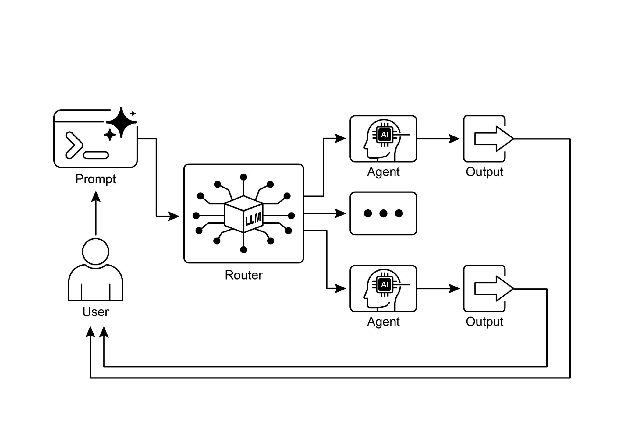

# Chapter 2: Routing

# Routing Pattern 개요

Prompt Chaining을 통한 순차적 처리는 결정론적이고 선형적인 워크플로우를 실행하는 언어 모델의 기본 기법이지만, 적응적 응답이 필요한 시나리오에서는 적용 가능성이 제한됨. 실제 agentic 시스템은 환경 상태, 사용자 입력, 이전 작업의 결과와 같은 조건적 요인에 따라 여러 잠재적 행동 중에서 선택해야 하는 경우가 많음. 이러한 동적 의사결정 능력은 여러 특수화된 함수, tool, sub-process로 제어 흐름을 지시하며, routing이라는 메커니즘을 통해 구현됨.

Routing은 agent의 운영 프레임워크에 조건부 로직을 도입하여, 고정된 실행 경로에서 agent가 특정 기준을 동적으로 평가하여 가능한 후속 행동 집합 중에서 선택하는 모델로 전환할 수 있도록 함. 이를 통해 더 유연하고 컨텍스트 인식적인 시스템 동작이 가능해짐.

예를 들어, 고객 문의를 위해 설계된 agent가 routing 기능을 갖추고 있다면, 먼저 들어오는 쿼리를 분류하여 사용자의 의도를 파악할 수 있음. 이 분류를 기반으로 직접 질문 답변을 위한 특수 agent, 계정 정보를 위한 데이터베이스 검색 tool, 복잡한 문제를 위한 에스컬레이션 절차로 쿼리를 전달할 수 있으며, 단일하고 사전 결정된 응답 경로를 기본값으로 사용하지 않음. 따라서 routing을 사용하는 더 정교한 agent는 다음과 같은 작업을 수행할 수 있음:

1. 사용자의 쿼리를 분석함.
2. *의도*에 따라 쿼리를 **Route**함:
   * 의도가 "주문 상태 확인"이면, 주문 데이터베이스와 상호작용하는 sub-agent 또는 tool chain으로 route함.
   * 의도가 "제품 정보"이면, 제품 카탈로그를 검색하는 sub-agent 또는 chain으로 route함.
   * 의도가 "기술 지원"이면, 문제 해결 가이드에 액세스하거나 사람에게 에스컬레이션하는 다른 chain으로 route함.
   * 의도가 불명확하면, 명확화 sub-agent 또는 prompt chain으로 route함.

Routing pattern의 핵심 구성 요소는 평가를 수행하고 흐름을 지시하는 메커니즘임. 이 메커니즘은 여러 방법으로 구현 가능함:

* **LLM 기반 Routing:** 언어 모델 자체가 입력을 분석하고 다음 단계 또는 목적지를 나타내는 특정 식별자 또는 지시문을 출력하도록 프롬프트할 수 있음. 예를 들어, prompt가 LLM에게 "다음 사용자 쿼리를 분석하고 카테고리만 출력: 'Order Status', 'Product Info', 'Technical Support', 또는 'Other'"라고 요청할 수 있음. 그런 다음 agentic 시스템이 이 출력을 읽고 그에 따라 워크플로우를 지시함.
* **Embedding 기반 Routing:** 입력 쿼리를 벡터 embedding으로 변환할 수 있음 (RAG, Chapter 14 참조). 이 embedding은 다양한 route 또는 기능을 나타내는 embedding과 비교됨. 쿼리는 embedding이 가장 유사한 route로 route됨. 이는 의미론적 routing에 유용하며, 결정이 단순한 키워드가 아닌 입력의 의미를 기반으로 함.
* **규칙 기반 Routing:** 입력에서 추출한 키워드, 패턴 또는 구조화된 데이터를 기반으로 사전 정의된 규칙 또는 로직(예: if-else 문, switch case)을 사용함. 이는 LLM 기반 routing보다 빠르고 결정론적일 수 있지만, 미묘하거나 새로운 입력을 처리하는 데 있어 유연성이 떨어짐.
* **Machine Learning Model 기반 Routing**: routing 작업을 수행하기 위해 레이블이 지정된 작은 데이터 코퍼스에서 특별히 훈련된 분류기와 같은 판별 모델을 사용함. embedding 기반 방법과 개념적 유사성을 공유하지만, 핵심 특징은 모델의 매개변수를 조정하여 특수화된 routing 기능을 생성하는 지도 미세 조정 프로세스임. 이 기법은 의사결정 구성요소가 추론 시간에 prompt를 실행하는 생성 모델이 아니기 때문에 LLM 기반 routing과 구별됨. 대신 routing 로직이 미세 조정된 모델의 학습된 가중치 내에 인코딩됨. LLM이 훈련 세트를 증강하기 위해 합성 데이터를 생성하는 전처리 단계에서 사용될 수 있지만, 실시간 routing 결정 자체에는 관여하지 않음.

Routing 메커니즘은 agent의 운영 주기 내 여러 지점에서 구현될 수 있음. 초기에 적용하여 주요 작업을 분류하거나, 처리 chain 내 중간 지점에서 후속 조치를 결정하거나, subroutine 중에 주어진 세트에서 가장 적절한 tool을 선택하는 데 사용될 수 있음.

LangChain, LangGraph, Google의 Agent Developer Kit (ADK)와 같은 계산 프레임워크는 이러한 조건부 로직을 정의하고 관리하기 위한 명시적 구조를 제공함. 상태 기반 그래프 아키텍처를 갖춘 LangGraph는 전체 시스템의 누적 상태에 따라 결정이 내려지는 복잡한 routing 시나리오에 특히 적합함. 마찬가지로 Google의 ADK는 agent의 기능과 상호작용 모델을 구조화하기 위한 기본 구성요소를 제공하며, 이는 routing 로직 구현의 기초가 됨. 이러한 프레임워크가 제공하는 실행 환경 내에서 개발자는 가능한 운영 경로와 계산 그래프의 노드 간 전환을 지시하는 함수 또는 모델 기반 평가를 정의함.

Routing 구현은 시스템이 결정론적 순차 처리를 넘어서도록 함. 더 넓은 범위의 입력 및 상태 변화에 동적이고 적절하게 응답할 수 있는 적응형 실행 흐름 개발을 촉진함.

# 실용적 응용 사례

Routing pattern은 적응형 agentic 시스템 설계에서 중요한 제어 메커니즘이며, 가변 입력 및 내부 상태에 대응하여 실행 경로를 동적으로 변경할 수 있도록 함. 필요한 조건부 로직 계층을 제공함으로써 여러 도메인에 걸쳐 유용성이 있음.

가상 비서 또는 AI 기반 튜터와 같은 인간-컴퓨터 상호작용에서 routing은 사용자 의도를 해석하는 데 사용됨. 자연어 쿼리의 초기 분석은 특정 정보 검색 tool 호출, 사람 운영자에게 에스컬레이션, 사용자 성과에 따른 커리큘럼의 다음 모듈 선택 등 가장 적절한 후속 조치를 결정함. 이를 통해 시스템은 선형 대화 흐름을 넘어 컨텍스트에 따라 응답할 수 있음.

자동화된 데이터 및 문서 처리 파이프라인 내에서 routing은 분류 및 배포 기능을 수행함. 이메일, 지원 티켓 또는 API 페이로드와 같은 들어오는 데이터는 내용, 메타데이터 또는 형식을 기반으로 분석됨. 그런 다음 시스템은 각 항목을 판매 리드 수집 프로세스, JSON 또는 CSV 형식을 위한 특정 데이터 변환 함수, 긴급 문제 에스컬레이션 경로와 같은 해당 워크플로우로 전달함.

여러 특수화된 tool 또는 agent가 포함된 복잡한 시스템에서 routing은 고수준 dispatcher 역할을 함. 검색, 요약, 정보 분석을 위한 별도 agent로 구성된 연구 시스템은 router를 사용하여 현재 목표에 따라 가장 적합한 agent에 작업을 할당함. 마찬가지로 AI 코딩 비서는 routing을 사용하여 프로그래밍 언어와 사용자의 의도(디버그, 설명 또는 번역)를 식별한 후 코드 스니펫을 올바른 특수화된 tool에 전달함.

궁극적으로 routing은 기능적으로 다양하고 컨텍스트 인식적인 시스템을 생성하는 데 필수적인 논리적 중재 기능을 제공함. agent를 사전 정의된 시퀀스의 정적 실행자에서 변화하는 조건 하에서 작업을 수행하는 가장 효과적인 방법에 대한 결정을 내릴 수 있는 동적 시스템으로 변환함.

# 실습 코드 예제 (LangChain)

코드에서 routing 구현은 가능한 경로와 어떤 경로를 선택할지 결정하는 로직을 정의하는 것을 포함함. LangChain 및 LangGraph와 같은 프레임워크는 이를 위한 특정 구성요소와 구조를 제공함. LangGraph의 상태 기반 그래프 구조는 routing 로직을 시각화하고 구현하는 데 특히 직관적임.

이 코드는 LangChain과 Google의 Generative AI를 사용하는 간단한 agent 유사 시스템을 시연함. 요청의 의도(예약, 정보 또는 불명확)에 따라 사용자 요청을 다양한 시뮬레이션된 "sub-agent" handler로 route하는 "coordinator"를 설정함. 시스템은 언어 모델을 사용하여 요청을 분류한 다음 적절한 handler 함수에 위임하며, multi-agent 아키텍처에서 자주 볼 수 있는 기본 위임 pattern을 시뮬레이션함.

먼저 필요한 라이브러리가 설치되어 있는지 확인:

```bash
pip install langchain langgraph google-cloud-aiplatform langchain-google-genai google-adk deprecated pydantic
```

선택한 언어 모델의 API key로 환경을 설정해야 함 (예: OpenAI, Google Gemini, Anthropic).

```python
# Copyright (c) 2025 Marco Fago
# https://www.linkedin.com/in/marco-fago/
#
# This code is licensed under the MIT License.
# See the LICENSE file in the repository for the full license text.

from langchain_google_genai import ChatGoogleGenerativeAI
from langchain_core.prompts import ChatPromptTemplate
from langchain_core.output_parsers import StrOutputParser
from langchain_core.runnables import RunnablePassthrough, RunnableBranch

# --- Configuration ---
# Ensure your API key environment variable is set (e.g., GOOGLE_API_KEY)
try:
    llm = ChatGoogleGenerativeAI(model="gemini-2.5-flash", temperature=0)
    print(f"Language model initialized: {llm.model}")
except Exception as e:
    print(f"Error initializing language model: {e}")
    llm = None

# --- Define Simulated Sub-Agent Handlers (equivalent to ADK sub_agents) ---
def booking_handler(request: str) -> str:
    """Simulates the Booking Agent handling a request."""
    print("\n--- DELEGATING TO BOOKING HANDLER ---")
    return f"Booking Handler processed request: '{request}'. Result: Simulated booking action."

def info_handler(request: str) -> str:
    """Simulates the Info Agent handling a request."""
    print("\n--- DELEGATING TO INFO HANDLER ---")
    return f"Info Handler processed request: '{request}'. Result: Simulated information retrieval."

def unclear_handler(request: str) -> str:
    """Handles requests that couldn't be delegated."""
    print("\n--- HANDLING UNCLEAR REQUEST ---")
    return f"Coordinator could not delegate request: '{request}'. Please clarify."

# --- Define Coordinator Router Chain (equivalent to ADK coordinator's instruction) ---
# This chain decides which handler to delegate to.
coordinator_router_prompt = ChatPromptTemplate.from_messages([
    ("system", """Analyze the user's request and determine which specialist handler should process it.
    - If the request is related to booking flights or hotels, output 'booker'.
    - For all other general information questions, output 'info'.
    - If the request is unclear or doesn't fit either category, output 'unclear'.
    ONLY output one word: 'booker', 'info', or 'unclear'."""),
    ("user", "{request}")
])

if llm:
    coordinator_router_chain = coordinator_router_prompt | llm | StrOutputParser()

# --- Define the Delegation Logic (equivalent to ADK's Auto-Flow based on sub_agents) ---
# Use RunnableBranch to route based on the router chain's output.
# Define the branches for the RunnableBranch
branches = {
    "booker": RunnablePassthrough.assign(output=lambda x: booking_handler(x['request']['request'])),
    "info": RunnablePassthrough.assign(output=lambda x: info_handler(x['request']['request'])),
    "unclear": RunnablePassthrough.assign(output=lambda x: unclear_handler(x['request']['request'])),
}

# Create the RunnableBranch. It takes the output of the router chain
# and routes the original input ('request') to the corresponding handler.
delegation_branch = RunnableBranch(
    (lambda x: x['decision'].strip() == 'booker', branches["booker"]), # Added .strip()
    (lambda x: x['decision'].strip() == 'info', branches["info"]),     # Added .strip()
    branches["unclear"] # Default branch for 'unclear' or any other output
)

# Combine the router chain and the delegation branch into a single runnable
# The router chain's output ('decision') is passed along with the original input ('request')
# to the delegation_branch.
coordinator_agent = {
    "decision": coordinator_router_chain,
    "request": RunnablePassthrough()
} | delegation_branch | (lambda x: x['output']) # Extract the final output

# --- Example Usage ---
def main():
    if not llm:
        print("\nSkipping execution due to LLM initialization failure.")
        return

    print("--- Running with a booking request ---")
    request_a = "Book me a flight to London."
    result_a = coordinator_agent.invoke({"request": request_a})
    print(f"Final Result A: {result_a}")

    print("\n--- Running with an info request ---")
    request_b = "What is the capital of Italy?"
    result_b = coordinator_agent.invoke({"request": request_b})
    print(f"Final Result B: {result_b}")

    print("\n--- Running with an unclear request ---")
    request_c = "Tell me about quantum physics."
    result_c = coordinator_agent.invoke({"request": request_c})
    print(f"Final Result C: {result_c}")

if __name__ == "__main__":
    main()
```

언급했듯이 이 Python 코드는 LangChain 라이브러리와 Google의 Generative AI 모델, 특히 gemini-2.5-flash를 사용하여 간단한 agent 유사 시스템을 구축함. 세 가지 시뮬레이션된 sub-agent handler를 정의함: booking_handler, info_handler, unclear_handler로, 각각 특정 유형의 요청을 처리하도록 설계됨.

핵심 구성요소는 coordinator_router_chain으로, ChatPromptTemplate을 활용하여 언어 모델에 들어오는 사용자 요청을 'booker', 'info' 또는 'unclear'의 세 가지 카테고리 중 하나로 분류하도록 지시함. 이 router chain의 출력은 RunnableBranch에서 사용되어 원래 요청을 해당 handler 함수에 위임함. RunnableBranch는 언어 모델의 결정을 확인하고 요청 데이터를 booking_handler, info_handler 또는 unclear_handler로 전달함. coordinator_agent는 이러한 구성요소를 결합하여 먼저 결정을 위해 요청을 routing하고 선택한 handler에 요청을 전달함. 최종 출력은 handler의 응답에서 추출됨.

main 함수는 세 가지 예제 요청으로 시스템 사용을 시연하며, 다양한 입력이 시뮬레이션된 agent에 의해 어떻게 route되고 처리되는지 보여줌. 언어 모델 초기화를 위한 오류 처리가 포함되어 견고성을 보장함. 코드 구조는 중앙 coordinator가 의도에 따라 특수화된 agent에 작업을 위임하는 기본 multi-agent 프레임워크를 모방함.

# 실습 코드 예제 (Google ADK)

Agent Development Kit (ADK)는 agentic 시스템을 엔지니어링하기 위한 프레임워크로, agent의 기능과 동작을 정의하기 위한 구조화된 환경을 제공함. 명시적 계산 그래프를 기반으로 하는 아키텍처와 달리, ADK 패러다임 내에서 routing은 일반적으로 agent의 기능을 나타내는 별도의 "tools" 세트를 정의하여 구현됨. 사용자 쿼리에 대한 응답으로 적절한 tool을 선택하는 것은 프레임워크의 내부 로직에 의해 관리되며, 이는 기본 모델을 활용하여 사용자 의도를 올바른 기능 handler와 일치시킴.

이 Python 코드는 Google의 ADK 라이브러리를 사용하는 Agent Development Kit (ADK) 애플리케이션의 예를 보여줌. 정의된 지시에 따라 사용자 요청을 특수화된 sub-agent("Booker"는 예약용, "Info"는 일반 정보용)로 route하는 "Coordinator" agent를 설정함. 그런 다음 sub-agent는 특정 tool을 사용하여 요청 처리를 시뮬레이션하며, agent 시스템 내에서 기본 위임 pattern을 보여줌.

```python
# Copyright (c) 2025 Marco Fago
#
# This code is licensed under the MIT License.
# See the LICENSE file in the repository for the full license text.

import uuid
from typing import Dict, Any, Optional
from google.adk.agents import Agent
from google.adk.runners import InMemoryRunner
from google.adk.tools import FunctionTool
from google.genai import types
from google.adk.events import Event

# --- Define Tool Functions ---
# These functions simulate the actions of the specialist agents.
def booking_handler(request: str) -> str:
    """
    Handles booking requests for flights and hotels.
    Args:
        request: The user's request for a booking.
    Returns:
        A confirmation message that the booking was handled.
    """
    print("-------------------------- Booking Handler Called ----------------------------")
    return f"Booking action for '{request}' has been simulated."

def info_handler(request: str) -> str:
    """
    Handles general information requests.
    Args:
        request: The user's question.
    Returns:
        A message indicating the information request was handled.
    """
    print("-------------------------- Info Handler Called ----------------------------")
    return f"Information request for '{request}'. Result: Simulated information retrieval."

def unclear_handler(request: str) -> str:
    """Handles requests that couldn't be delegated."""
    return f"Coordinator could not delegate request: '{request}'. Please clarify."

# --- Create Tools from Functions ---
booking_tool = FunctionTool(booking_handler)
info_tool = FunctionTool(info_handler)

# Define specialized sub-agents equipped with their respective tools
booking_agent = Agent(
    name="Booker",
    model="gemini-2.0-flash",
    description="A specialized agent that handles all flight and hotel booking requests by calling the booking tool.",
    tools=[booking_tool]
)

info_agent = Agent(
    name="Info",
    model="gemini-2.0-flash",
    description="A specialized agent that provides general information and answers user questions by calling the info tool.",
    tools=[info_tool]
)

# Define the parent agent with explicit delegation instructions
coordinator = Agent(
    name="Coordinator",
    model="gemini-2.0-flash",
    instruction=(
        "You are the main coordinator. Your only task is to analyze incoming user requests "
        "and delegate them to the appropriate specialist agent. Do not try to answer the user directly.\n"
        "- For any requests related to booking flights or hotels, delegate to the 'Booker' agent.\n"
        "- For all other general information questions, delegate to the 'Info' agent."
    ),
    description="A coordinator that routes user requests to the correct specialist agent.",
    # The presence of sub_agents enables LLM-driven delegation (Auto-Flow) by default.
    sub_agents=[booking_agent, info_agent]
)

# --- Execution Logic ---
async def run_coordinator(runner: InMemoryRunner, request: str):
    """Runs the coordinator agent with a given request and delegates."""
    print(f"\n--- Running Coordinator with request: '{request}' ---")
    final_result = ""
    try:
        user_id = "user_123"
        session_id = str(uuid.uuid4())
        await runner.session_service.create_session(
            app_name=runner.app_name, user_id=user_id, session_id=session_id
        )
        for event in runner.run(
            user_id=user_id,
            session_id=session_id,
            new_message=types.Content(
                role='user',
                parts=[types.Part(text=request)]
            ),
        ):
            if event.is_final_response() and event.content:
                # Try to get text directly from event.content to avoid iterating parts
                if hasattr(event.content, 'text') and event.content.text:
                    final_result = event.content.text
                elif event.content.parts:
                    # Fallback: Iterate through parts and extract text (might trigger warning)
                    text_parts = [part.text for part in event.content.parts if part.text]
                    final_result = "".join(text_parts)
                # Assuming the loop should break after the final response
                break
        print(f"Coordinator Final Response: {final_result}")
        return final_result
    except Exception as e:
        print(f"An error occurred while processing your request: {e}")
        return f"An error occurred while processing your request: {e}"

async def main():
    """Main function to run the ADK example."""
    print("--- Google ADK Routing Example (ADK Auto-Flow Style) ---")
    print("Note: This requires Google ADK installed and authenticated.")
    runner = InMemoryRunner(coordinator)

    # Example Usage
    result_a = await run_coordinator(runner, "Book me a hotel in Paris.")
    print(f"Final Output A: {result_a}")

    result_b = await run_coordinator(runner, "What is the highest mountain in the world?")
    print(f"Final Output B: {result_b}")

    result_c = await run_coordinator(runner, "Tell me a random fact.") # Should go to Info
    print(f"Final Output C: {result_c}")

    result_d = await run_coordinator(runner, "Find flights to Tokyo next month.") # Should go to Booker
    print(f"Final Output D: {result_d}")

if __name__ == "__main__":
    import nest_asyncio
    nest_asyncio.apply()
    await main()
```

이 스크립트는 주 Coordinator agent와 두 개의 특수화된 sub_agent인 Booker와 Info로 구성됨. 각 특수화된 agent는 Python 함수를 래핑하는 FunctionTool을 갖추고 있어 작업을 시뮬레이션함. booking_handler 함수는 항공편 및 호텔 예약 처리를 시뮬레이션하고, info_handler 함수는 일반 정보 검색을 시뮬레이션함. unclear_handler는 coordinator가 위임할 수 없는 요청에 대한 대체 수단으로 포함되지만, 현재 coordinator 로직은 주 run_coordinator 함수에서 위임 실패에 대해 명시적으로 사용하지 않음.

Coordinator agent의 주요 역할은 instruction에 정의된 대로 들어오는 사용자 메시지를 분석하고 Booker 또는 Info agent에 위임하는 것임. 이 위임은 Coordinator에 sub_agents가 정의되어 있기 때문에 ADK의 Auto-Flow 메커니즘에 의해 자동으로 처리됨. run_coordinator 함수는 InMemoryRunner를 설정하고 사용자 및 세션 ID를 생성한 다음 runner를 사용하여 coordinator agent를 통해 사용자의 요청을 처리함. runner.run 메서드는 요청을 처리하고 이벤트를 생성하며, 코드는 event.content에서 최종 응답 텍스트를 추출함.

main 함수는 다양한 요청으로 coordinator를 실행하여 시스템 사용을 시연하며, Booker에 예약 요청을 위임하고 Info에 정보 요청을 위임하는 방법을 보여줌.

# 한눈에 보기

**무엇:** Agentic 시스템은 단일 선형 프로세스로 처리할 수 없는 다양한 입력 및 상황에 자주 응답해야 함. 단순한 순차 워크플로우는 컨텍스트를 기반으로 결정을 내리는 능력이 부족함. 특정 작업에 대해 올바른 tool 또는 sub-process를 선택하는 메커니즘이 없으면 시스템은 경직되고 적응력이 없음. 이러한 제한은 실제 사용자 요청의 복잡성과 가변성을 관리할 수 있는 정교한 애플리케이션을 구축하기 어렵게 만듦.

**왜:** Routing pattern은 agent의 운영 프레임워크에 조건부 로직을 도입하여 표준화된 솔루션을 제공함. 시스템이 먼저 들어오는 쿼리를 분석하여 의도 또는 특성을 파악할 수 있도록 함. 이 분석을 기반으로 agent는 가장 적절한 특수화된 tool, 함수 또는 sub-agent로 제어 흐름을 동적으로 전달함. 이 결정은 LLM prompting, 사전 정의된 규칙 적용 또는 embedding 기반 의미론적 유사성 사용을 포함한 다양한 방법에 의해 주도될 수 있음. 궁극적으로 routing은 정적이고 사전 결정된 실행 경로를 최상의 가능한 조치를 선택할 수 있는 유연하고 컨텍스트 인식적인 워크플로우로 변환함.

**경험 법칙:** agent가 사용자의 입력 또는 현재 상태에 따라 여러 개별 워크플로우, tool 또는 sub-agent 중에서 결정해야 할 때 Routing pattern을 사용함. 판매 문의, 기술 지원 및 계정 관리 질문을 구별하는 고객 지원 봇과 같이 다양한 유형의 작업을 처리하기 위해 들어오는 요청을 분류하거나 분류해야 하는 애플리케이션에 필수적임.

#### **시각적 요약:**


Fig.1: LLM을 Router로 사용하는 Router pattern

# 주요 요점

* Routing은 agent가 조건에 따라 워크플로우의 다음 단계에 대한 동적 결정을 내릴 수 있도록 함.
* agent가 다양한 입력을 처리하고 동작을 조정하여 선형 실행을 넘어설 수 있도록 함.
* Routing 로직은 LLM, 규칙 기반 시스템 또는 embedding 유사성을 사용하여 구현할 수 있음.
* LangGraph 및 Google ADK와 같은 프레임워크는 agent 워크플로우 내에서 routing을 정의하고 관리하는 구조화된 방법을 제공하지만, 서로 다른 아키텍처 접근 방식을 사용함.

# 결론

Routing pattern은 진정으로 동적이고 반응적인 agentic 시스템을 구축하는 데 중요한 단계임. routing을 구현함으로써 단순하고 선형적인 실행 흐름을 넘어 agent가 정보 처리 방법, 사용자 입력에 대한 응답 방법, 사용 가능한 tool 또는 sub-agent 활용 방법에 대한 지능적인 결정을 내릴 수 있도록 함.

고객 서비스 챗봇에서 복잡한 데이터 처리 파이프라인에 이르기까지 다양한 도메인에서 routing을 어떻게 적용할 수 있는지 확인함. 입력을 분석하고 조건부로 워크플로우를 지시하는 능력은 실제 작업의 내재된 가변성을 처리할 수 있는 agent를 만드는 데 기본임.

LangChain과 Google ADK를 사용하는 코드 예제는 routing 구현에 대한 두 가지 다른 하지만 효과적인 접근 방식을 보여줌. LangGraph의 그래프 기반 구조는 상태와 전환을 정의하는 시각적이고 명시적인 방법을 제공하여 복잡한 routing 로직이 있는 복잡한 다단계 워크플로우에 이상적임. 반면 Google ADK는 종종 별도의 기능(Tools)을 정의하고 프레임워크가 사용자 요청을 적절한 tool handler로 route하는 능력에 의존하는 데 중점을 두며, 잘 정의된 별도 작업 세트를 가진 agent에 대해 더 간단할 수 있음.

Routing pattern을 마스터하는 것은 다양한 시나리오를 지능적으로 탐색하고 컨텍스트를 기반으로 맞춤형 응답 또는 작업을 제공할 수 있는 agent를 구축하는 데 필수적임. 다재다능하고 견고한 agentic 애플리케이션을 만드는 핵심 구성요소임.

# 참고문헌

1. LangGraph Documentation: [https://www.langchain.com/](https://www.langchain.com/)
2. Google Agent Developer Kit Documentation: [https://google.github.io/adk-docs/](https://google.github.io/adk-docs/)
