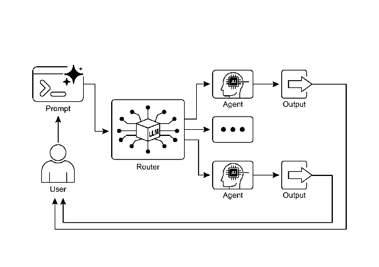

# Chapter 2: Routing

# Routing Pattern Overview

While sequential processing via prompt chaining is a foundational technique for executing deterministic, linear workflows with language models, its applicability is limited in scenarios requiring adaptive responses. Real-world agentic systems must often arbitrate between multiple potential actions based on contingent factors, such as the state of the environment, user input, or the outcome of a preceding operation. This capacity for dynamic decision-making, which governs the flow of control to different specialized functions, tools, or sub-processes, is achieved through a mechanism known as routing.

Routing introduces conditional logic into an agent's operational framework, enabling a shift from a fixed execution path to a model where the agent dynamically evaluates specific criteria to select from a set of possible subsequent actions. This allows for more flexible and context-aware system behavior.

For instance, an agent designed for customer inquiries, when equipped with a routing function, can first classify an incoming query to determine the user's intent. Based on this classification, it can then direct the query to a specialized agent for direct question-answering, a database retrieval tool for account information, or an escalation procedure for complex issues, rather than defaulting to a single, predetermined response pathway.  Therefore, a more sophisticated agent using routing could:

1. Analyze the user's query.  
2. **Route** the query based on its *intent*:  
   * If the intent is "check order status", route to a sub-agent or tool chain that interacts with the order database.  
   * If the intent is "product information", route to a sub-agent or chain that searches the product catalog.  
   * If the intent is "technical support", route to a different chain that accesses troubleshooting guides or escalates to a human.  
   * If the intent is unclear, route to a clarification sub-agent or prompt chain.

The core component of the Routing pattern is a mechanism that performs the evaluation and directs the flow. This mechanism can be implemented in several ways:

* **LLM-based Routing:** The language model itself can be prompted to analyze the input and output a specific identifier or instruction that indicates the next step or destination. For example, a prompt might ask the LLM to "Analyze the following user query and output only the category: 'Order Status', 'Product Info', 'Technical Support', or 'Other'." The agentic system then reads this output and directs the workflow accordingly.  
* **Embedding-based Routing:** The input query can be converted into a vector embedding (see RAG, Chapter 14). This embedding is then compared to embeddings representing different routes or capabilities. The query is routed to the route whose embedding is most similar. This is useful for semantic routing, where the decision is based on the meaning of the input rather than just keywords.  
* **Rule-based Routing:** This involves using predefined rules or logic (e.g., if-else statements, switch cases) based on keywords, patterns, or structured data extracted from the input. This can be faster and more deterministic than LLM-based routing, but is less flexible for handling nuanced or novel inputs.  
* **Machine Learning Model-Based Routing**: it employs a discriminative model, such as a classifier, that has been specifically trained on a small corpus of labeled data to perform a routing task. While it shares conceptual similarities with embedding-based methods, its key characteristic is the supervised fine-tuning process, which adjusts the model's parameters to create a specialized routing function. This technique is distinct from LLM-based routing because the decision-making component is not a generative model executing a prompt at inference time. Instead, the routing logic is encoded within the fine-tuned model's learned weights. While LLMs may be used in a pre-processing step to generate synthetic data for augmenting the training set, they are not involved in the real-time routing decision itself.

Routing mechanisms can be implemented at multiple junctures within an agent's operational cycle. They can be applied at the outset to classify a primary task, at intermediate points within a processing chain to determine a subsequent action, or during a subroutine to select the most appropriate tool from a given set.

Computational frameworks such as LangChain, LangGraph, and Google's Agent Developer Kit (ADK) provide explicit constructs for defining and managing such conditional logic. With its state-based graph architecture, LangGraph is particularly well-suited for complex routing scenarios where decisions are contingent upon the accumulated state of the entire system. Similarly, Google's ADK provides foundational components for structuring an agent's capabilities and interaction models, which serve as the basis for implementing routing logic. Within the execution environments provided by these frameworks, developers define the possible operational paths and the functions or model-based evaluations that dictate the transitions between nodes in the computational graph.

The implementation of routing enables a system to move beyond deterministic sequential processing. It facilitates the development of more adaptive execution flows that can respond dynamically and appropriately to a wider range of inputs and state changes.

# Practical Applications & Use Cases

The routing pattern is a critical control mechanism in the design of adaptive agentic systems, enabling them to dynamically alter their execution path in response to variable inputs and internal states. Its utility spans multiple domains by providing a necessary layer of conditional logic.

In human-computer interaction, such as with virtual assistants or AI-driven tutors, routing is employed to interpret user intent. An initial analysis of a natural language query determines the most appropriate subsequent action, whether it is invoking a specific information retrieval tool, escalating to a human operator, or selecting the next module in a curriculum based on user performance. This allows the system to move beyond linear dialogue flows and respond contextually.

Within automated data and document processing pipelines, routing serves as a classification and distribution function. Incoming data, such as emails, support tickets, or API payloads, is analyzed based on content, metadata, or format. The system then directs each item to a corresponding workflow, such as a sales lead ingestion process, a specific data transformation function for JSON or CSV formats, or an urgent issue escalation path.

In complex systems involving multiple specialized tools or agents, routing acts as a high-level dispatcher. A research system composed of distinct agents for searching, summarizing, and analyzing information would use a router to assign tasks to the most suitable agent based on the current objective. Similarly, an AI coding assistant uses routing to identify the programming language and user's intent—to debug, explain, or translate—before passing a code snippet to the correct specialized tool.

Ultimately, routing provides the capacity for logical arbitration that is essential for creating functionally diverse and context-aware systems. It transforms an agent from a static executor of pre-defined sequences into a dynamic system that can make decisions about the most effective method for accomplishing a task under changing conditions.

# Hands-On Code Example (LangChain)

Implementing routing in code involves defining the possible paths and the logic that decides which path to take. Frameworks like LangChain and LangGraph provide specific components and structures for this. LangGraph's state-based graph structure is particularly intuitive for visualizing and implementing routing logic.

This code demonstrates a simple agent-like system using LangChain and Google's Generative AI. It sets up a "coordinator" that routes user requests to different simulated "sub-agent" handlers based on the request's intent (booking, information, or unclear). The system uses a language model to classify the request and then delegates it to the appropriate handler function, simulating a basic delegation pattern often seen in multi-agent architectures.

First, ensure you have the necessary libraries installed:

```bash
pip install langchain langgraph google-cloud-aiplatform langchain-google-genai google-adk deprecated pydantic
```

You will also need to set up your environment with your API key for the language model you choose (e.g., OpenAI, Google Gemini, Anthropic).

```python
# Copyright (c) 2025 Marco Fago
# https://www.linkedin.com/in/marco-fago/
#
# This code is licensed under the MIT License.
# See the LICENSE file in the repository for the full license text.

from langchain_google_genai import ChatGoogleGenerativeAI
from langchain_core.prompts import ChatPromptTemplate
from langchain_core.output_parsers import StrOutputParser
from langchain_core.runnables import RunnablePassthrough, RunnableBranch

# --- Configuration ---
# Ensure your API key environment variable is set (e.g., GOOGLE_API_KEY)
try:
    llm = ChatGoogleGenerativeAI(model="gemini-2.5-flash", temperature=0)
    print(f"Language model initialized: {llm.model}")
except Exception as e:
    print(f"Error initializing language model: {e}")
    llm = None

# --- Define Simulated Sub-Agent Handlers (equivalent to ADK sub_agents) ---
def booking_handler(request: str) -> str:
    """Simulates the Booking Agent handling a request."""
    print("\n--- DELEGATING TO BOOKING HANDLER ---")
    return f"Booking Handler processed request: '{request}'. Result: Simulated booking action."

def info_handler(request: str) -> str:
    """Simulates the Info Agent handling a request."""
    print("\n--- DELEGATING TO INFO HANDLER ---")
    return f"Info Handler processed request: '{request}'. Result: Simulated information retrieval."

def unclear_handler(request: str) -> str:
    """Handles requests that couldn't be delegated."""
    print("\n--- HANDLING UNCLEAR REQUEST ---")
    return f"Coordinator could not delegate request: '{request}'. Please clarify."

# --- Define Coordinator Router Chain (equivalent to ADK coordinator's instruction) ---
# This chain decides which handler to delegate to.
coordinator_router_prompt = ChatPromptTemplate.from_messages([
    ("system", """Analyze the user's request and determine which specialist handler should process it.
    - If the request is related to booking flights or hotels, output 'booker'.
    - For all other general information questions, output 'info'.
    - If the request is unclear or doesn't fit either category, output 'unclear'.
    ONLY output one word: 'booker', 'info', or 'unclear'."""),
    ("user", "{request}")
])

if llm:
    coordinator_router_chain = coordinator_router_prompt | llm | StrOutputParser()

# --- Define the Delegation Logic (equivalent to ADK's Auto-Flow based on sub_agents) ---
# Use RunnableBranch to route based on the router chain's output.
# Define the branches for the RunnableBranch
branches = {
    "booker": RunnablePassthrough.assign(output=lambda x: booking_handler(x['request']['request'])),
    "info": RunnablePassthrough.assign(output=lambda x: info_handler(x['request']['request'])),
    "unclear": RunnablePassthrough.assign(output=lambda x: unclear_handler(x['request']['request'])),
}

# Create the RunnableBranch. It takes the output of the router chain
# and routes the original input ('request') to the corresponding handler.
delegation_branch = RunnableBranch(
    (lambda x: x['decision'].strip() == 'booker', branches["booker"]), # Added .strip()
    (lambda x: x['decision'].strip() == 'info', branches["info"]),     # Added .strip()
    branches["unclear"] # Default branch for 'unclear' or any other output
)

# Combine the router chain and the delegation branch into a single runnable
# The router chain's output ('decision') is passed along with the original input ('request')
# to the delegation_branch.
coordinator_agent = {
    "decision": coordinator_router_chain,
    "request": RunnablePassthrough()
} | delegation_branch | (lambda x: x['output']) # Extract the final output

# --- Example Usage ---
def main():
    if not llm:
        print("\nSkipping execution due to LLM initialization failure.")
        return

    print("--- Running with a booking request ---")
    request_a = "Book me a flight to London."
    result_a = coordinator_agent.invoke({"request": request_a})
    print(f"Final Result A: {result_a}")

    print("\n--- Running with an info request ---")
    request_b = "What is the capital of Italy?"
    result_b = coordinator_agent.invoke({"request": request_b})
    print(f"Final Result B: {result_b}")

    print("\n--- Running with an unclear request ---")
    request_c = "Tell me about quantum physics."
    result_c = coordinator_agent.invoke({"request": request_c})
    print(f"Final Result C: {result_c}")

if __name__ == "__main__":
    main()
```

As mentioned, this Python code constructs a simple agent-like system using the LangChain library and Google's Generative AI model, specifically gemini-2.5-flash. In detail, It defines three simulated sub-agent handlers: booking\_handler, info\_handler, and unclear\_handler, each designed to process specific types of requests. 

A core component is the coordinator\_router\_chain, which utilizes a ChatPromptTemplate to instruct the language model to categorize incoming user requests into one of three categories: 'booker', 'info', or 'unclear'. The output of this router chain is then used by a RunnableBranch to delegate the original request to the corresponding handler function. The RunnableBranch checks the decision from the language model and directs the request data to either the booking\_handler, info\_handler, or unclear\_handler. The coordinator\_agent combines these components, first routing the request for a decision and then passing the request to the chosen handler. The final output is extracted from the handler's response. 

The main function demonstrates the system's usage with three example requests, showcasing how different inputs are routed and processed by the simulated agents. Error handling for language model initialization is included to ensure robustness. The code structure mimics a basic multi-agent framework where a central coordinator delegates tasks to specialized agents based on intent.

# Hands-On Code Example (Google ADK)

The Agent Development Kit (ADK) is a framework for engineering agentic systems, providing a structured environment for defining an agent's capabilities and behaviours. In contrast to architectures based on explicit computational graphs, routing within the ADK paradigm is typically implemented by defining a discrete set of "tools" that represent the agent's functions. The selection of the appropriate tool in response to a user query is managed by the framework's internal logic, which leverages an underlying model to match user intent to the correct functional handler.

This Python code demonstrates an example of an Agent Development Kit (ADK) application using Google's ADK library. It sets up a "Coordinator" agent that routes user requests to specialized sub-agents ("Booker" for bookings and "Info" for general information) based on defined instructions. The sub-agents then use specific tools to simulate handling the requests, showcasing a basic delegation pattern within an agent system

```python
# Copyright (c) 2025 Marco Fago
#
# This code is licensed under the MIT License.
# See the LICENSE file in the repository for the full license text.

import uuid
from typing import Dict, Any, Optional
from google.adk.agents import Agent
from google.adk.runners import InMemoryRunner
from google.adk.tools import FunctionTool
from google.genai import types
from google.adk.events import Event

# --- Define Tool Functions ---
# These functions simulate the actions of the specialist agents.
def booking_handler(request: str) -> str:
    """
    Handles booking requests for flights and hotels.
    Args:
        request: The user's request for a booking.
    Returns:
        A confirmation message that the booking was handled.
    """
    print("-------------------------- Booking Handler Called ----------------------------")
    return f"Booking action for '{request}' has been simulated."

def info_handler(request: str) -> str:
    """
    Handles general information requests.
    Args:
        request: The user's question.
    Returns:
        A message indicating the information request was handled.
    """
    print("-------------------------- Info Handler Called ----------------------------")
    return f"Information request for '{request}'. Result: Simulated information retrieval."

def unclear_handler(request: str) -> str:
    """Handles requests that couldn't be delegated."""
    return f"Coordinator could not delegate request: '{request}'. Please clarify."

# --- Create Tools from Functions ---
booking_tool = FunctionTool(booking_handler)
info_tool = FunctionTool(info_handler)

# Define specialized sub-agents equipped with their respective tools
booking_agent = Agent(
    name="Booker",
    model="gemini-2.0-flash",
    description="A specialized agent that handles all flight and hotel booking requests by calling the booking tool.",
    tools=[booking_tool]
)

info_agent = Agent(
    name="Info",
    model="gemini-2.0-flash",
    description="A specialized agent that provides general information and answers user questions by calling the info tool.",
    tools=[info_tool]
)

# Define the parent agent with explicit delegation instructions
coordinator = Agent(
    name="Coordinator",
    model="gemini-2.0-flash",
    instruction=(
        "You are the main coordinator. Your only task is to analyze incoming user requests "
        "and delegate them to the appropriate specialist agent. Do not try to answer the user directly.\n"
        "- For any requests related to booking flights or hotels, delegate to the 'Booker' agent.\n"
        "- For all other general information questions, delegate to the 'Info' agent."
    ),
    description="A coordinator that routes user requests to the correct specialist agent.",
    # The presence of sub_agents enables LLM-driven delegation (Auto-Flow) by default.
    sub_agents=[booking_agent, info_agent]
)

# --- Execution Logic ---
async def run_coordinator(runner: InMemoryRunner, request: str):
    """Runs the coordinator agent with a given request and delegates."""
    print(f"\n--- Running Coordinator with request: '{request}' ---")
    final_result = ""
    try:
        user_id = "user_123"
        session_id = str(uuid.uuid4())
        await runner.session_service.create_session(
            app_name=runner.app_name, user_id=user_id, session_id=session_id
        )
        for event in runner.run(
            user_id=user_id,
            session_id=session_id,
            new_message=types.Content(
                role='user',
                parts=[types.Part(text=request)]
            ),
        ):
            if event.is_final_response() and event.content:
                # Try to get text directly from event.content to avoid iterating parts
                if hasattr(event.content, 'text') and event.content.text:
                    final_result = event.content.text
                elif event.content.parts:
                    # Fallback: Iterate through parts and extract text (might trigger warning)
                    text_parts = [part.text for part in event.content.parts if part.text]
                    final_result = "".join(text_parts)
                # Assuming the loop should break after the final response
                break
        print(f"Coordinator Final Response: {final_result}")
        return final_result
    except Exception as e:
        print(f"An error occurred while processing your request: {e}")
        return f"An error occurred while processing your request: {e}"

async def main():
    """Main function to run the ADK example."""
    print("--- Google ADK Routing Example (ADK Auto-Flow Style) ---")
    print("Note: This requires Google ADK installed and authenticated.")
    runner = InMemoryRunner(coordinator)

    # Example Usage
    result_a = await run_coordinator(runner, "Book me a hotel in Paris.")
    print(f"Final Output A: {result_a}")

    result_b = await run_coordinator(runner, "What is the highest mountain in the world?")
    print(f"Final Output B: {result_b}")

    result_c = await run_coordinator(runner, "Tell me a random fact.") # Should go to Info
    print(f"Final Output C: {result_c}")

    result_d = await run_coordinator(runner, "Find flights to Tokyo next month.") # Should go to Booker
    print(f"Final Output D: {result_d}")

if __name__ == "__main__":
    import nest_asyncio
    nest_asyncio.apply()
    await main()
```

This script consists of a main Coordinator agent and two specialized sub\_agents: Booker and Info. Each specialized agent is equipped with a FunctionTool that wraps a Python function simulating an action. The booking\_handler function simulates handling flight and hotel bookings, while the info\_handler function simulates retrieving general information. The unclear\_handler is included as a fallback for requests the coordinator cannot delegate, although the current coordinator logic doesn't explicitly use it for delegation failure in the main run\_coordinator function. 

The Coordinator agent's primary role, as defined in its instruction, is to analyze incoming user messages and delegate them to either the Booker or Info agent. This delegation is handled automatically by the ADK's Auto-Flow mechanism because the Coordinator has sub\_agents defined. The run\_coordinator function sets up an InMemoryRunner, creates a user and session ID, and then uses the runner to process the user's request through the coordinator agent. The runner.run method processes the request and yields events, and the code extracts the final response text from the event.content. 

The main function demonstrates the system's usage by running the coordinator with different requests, showcasing how it delegates booking requests to the Booker and information requests to the Info agent.

# At a Glance

**What**: Agentic systems must often respond to a wide variety of inputs and situations that cannot be handled by a single, linear process. A simple sequential workflow lacks the ability to make decisions based on context. Without a mechanism to choose the correct tool or sub-process for a specific task, the system remains rigid and non-adaptive. This limitation makes it difficult to build sophisticated applications that can manage the complexity and variability of real-world user requests.

**Why:** The Routing pattern provides a standardized solution by introducing conditional logic into an agent's operational framework. It enables the system to first analyze an incoming query to determine its intent or nature. Based on this analysis, the agent dynamically directs the flow of control to the most appropriate specialized tool, function, or sub-agent. This decision can be driven by various methods, including prompting LLMs, applying predefined rules, or using embedding-based semantic similarity. Ultimately, routing transforms a static, predetermined execution path into a flexible and context-aware workflow capable of selecting the best possible action.

**Rule of Thumb:** Use the Routing pattern when an agent must decide between multiple distinct workflows, tools, or sub-agents based on the user's input or the current state. It is essential for applications that need to triage or classify incoming requests to handle different types of tasks, such as a customer support bot distinguishing between sales inquiries, technical support, and account management questions.

#### **Visual Summary:**


Fig.1: Router pattern, using an LLM as a Router

# Key Takeaways

* Routing enables agents to make dynamic decisions about the next step in a workflow based on conditions.  
* It allows agents to handle diverse inputs and adapt their behavior, moving beyond linear execution.  
* Routing logic can be implemented using LLMs, rule-based systems, or embedding similarity.  
* Frameworks like LangGraph and Google ADK provide structured ways to define and manage routing within agent workflows, albeit with different architectural approaches.

# Conclusion

The Routing pattern is a critical step in building truly dynamic and responsive agentic systems. By implementing routing, we move beyond simple, linear execution flows and empower our agents to make intelligent decisions about how to process information, respond to user input, and utilize available tools or sub-agents.

We've seen how routing can be applied in various domains, from customer service chatbots to complex data processing pipelines. The ability to analyze input and conditionally direct the workflow is fundamental to creating agents that can handle the inherent variability of real-world tasks.

The code examples using LangChain and Google ADK demonstrate two different, yet effective, approaches to implementing routing. LangGraph's graph-based structure provides a visual and explicit way to define states and transitions, making it ideal for complex, multi-step workflows with intricate routing logic. Google ADK, on the other hand, often focuses on defining distinct capabilities (Tools) and relies on the framework's ability to route user requests to the appropriate tool handler, which can be simpler for agents with a well-defined set of discrete actions.

Mastering the Routing pattern is essential for building agents that can intelligently navigate different scenarios and provide tailored responses or actions based on context. It's a key component in creating versatile and robust agentic applications.

# References

1. LangGraph Documentation: [https://www.langchain.com/](https://www.langchain.com/)    
2. Google Agent Developer Kit Documentation: [https://google.github.io/adk-docs/](https://google.github.io/adk-docs/) 

