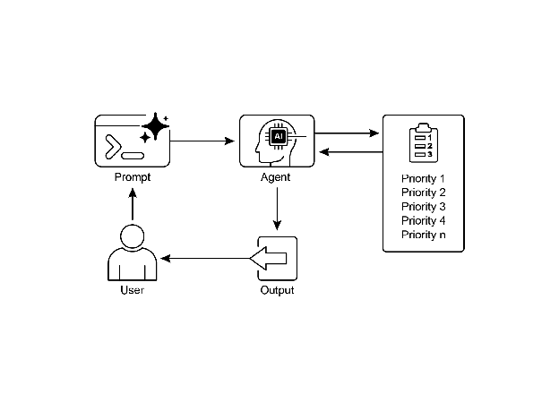

# Chapter 20: Prioritization

In complex, dynamic environments, Agents frequently encounter numerous potential actions, conflicting goals, and limited resources. Without a defined process for determining the subsequent action, the agents may experience reduced efficiency, operational delays, or failures to achieve key objectives. The prioritization pattern addresses this issue by enabling agents to assess and rank tasks, objectives, or actions based on their significance, urgency, dependencies, and established criteria. This ensures the agents concentrate efforts on the most critical tasks, resulting in enhanced effectiveness and goal alignment.

# Prioritization Pattern Overview

Agents employ prioritization to effectively manage tasks, goals, and sub-goals, guiding subsequent actions. This process facilitates informed decision-making when addressing multiple demands, prioritizing vital or urgent activities over less critical ones. It is particularly relevant in real-world scenarios where resources are constrained, time is limited, and objectives may conflict.

The fundamental aspects of agent prioritization typically involve several elements. First, criteria definition establishes the rules or metrics for task evaluation. These may include urgency (time sensitivity of the task), importance (impact on the primary objective), dependencies (whether the task is a prerequisite for others), resource availability (readiness of necessary tools or information), cost/benefit analysis (effort versus expected outcome), and user preferences for personalized agents. Second, task evaluation involves assessing each potential task against these defined criteria, utilizing methods ranging from simple rules to complex scoring or reasoning by LLMs. Third, scheduling or selection logic refers to the algorithm that, based on the evaluations, selects the optimal next action or task sequence, potentially utilizing a queue or an advanced planning component. Finally, dynamic re-prioritization allows the agent to modify priorities as circumstances change, such as the emergence of a new critical event or an approaching deadline, ensuring agent adaptability and responsiveness.

Prioritization can occur at various levels: selecting an overarching objective (high-level goal prioritization), ordering steps within a plan (sub-task prioritization), or choosing the next immediate action from available options (action selection). Effective prioritization enables agents to exhibit more intelligent, efficient, and robust behavior, especially in complex, multi-objective environments. This mirrors human team organization, where managers prioritize tasks by considering input from all members.

# Practical Applications & Use Cases

In various real-world applications, AI agents demonstrate a sophisticated use of prioritization to make timely and effective decisions. 

* **Automated Customer Support**: Agents prioritize urgent requests, like system outage reports, over routine matters, such as password resets. They may also give preferential treatment to high-value customers.  
* **Cloud Computing**: AI manages and schedules resources by prioritizing allocation to critical applications during peak demand, while relegating less urgent batch jobs to off-peak hours to optimize costs.  
* **Autonomous Driving Systems**: Continuously prioritize actions to ensure safety and efficiency. For example, braking to avoid a collision takes precedence over maintaining lane discipline or optimizing fuel efficiency.  
* **Financial Trading**: Bots prioritize trades by analyzing factors like market conditions, risk tolerance, profit margins, and real-time news, enabling prompt execution of high-priority transactions.  
* **Project Management**: AI agents prioritize tasks on a project board based on deadlines, dependencies, team availability, and strategic importance.  
* **Cybersecurity**: Agents monitoring network traffic prioritize alerts by assessing threat severity, potential impact, and asset criticality, ensuring immediate responses to the most dangerous threats.  
* **Personal Assistant AIs**: Utilize prioritization to manage daily lives, organizing calendar events, reminders, and notifications according to user-defined importance, upcoming deadlines, and current context.

These examples collectively illustrate how the ability to prioritize is fundamental to the enhanced performance and decision-making capabilities of AI agents across a wide spectrum of situations.

# Hands-On Code Example

The following demonstrates the development of a Project Manager AI agent using LangChain. This agent facilitates the creation, prioritization, and assignment of tasks to team members, illustrating the application of large language models with bespoke tools for automated project management.

```python
import os
import asyncio
from typing import List, Optional, Dict, Type
from dotenv import load_dotenv
from pydantic import BaseModel, Field
from langchain_core.prompts import ChatPromptTemplate
from langchain_core.tools import Tool
from langchain_openai import ChatOpenAI
from langchain.agents import AgentExecutor, create_react_agent
from langchain.memory import ConversationBufferMemory

# --- 0. Configuration and Setup ---
# Loads the OPENAI_API_KEY from the .env file.
load_dotenv()

# The ChatOpenAI client automatically picks up the API key from the environment.
llm = ChatOpenAI(temperature=0.5, model="gpt-4o-mini")

# --- 1. Task Management System ---
class Task(BaseModel):
    """Represents a single task in the system."""
    id: str
    description: str
    priority: Optional[str] = None  # P0, P1, P2
    assigned_to: Optional[str] = None # Name of the worker

class SuperSimpleTaskManager:
    """An efficient and robust in-memory task manager."""
    def __init__(self):
        # Use a dictionary for O(1) lookups, updates, and deletions.
        self.tasks: Dict[str, Task] = {}
        self.next_task_id = 1

    def create_task(self, description: str) -> Task:
        """Creates and stores a new task."""
        task_id = f"TASK-{self.next_task_id:03d}"
        new_task = Task(id=task_id, description=description)
        self.tasks[task_id] = new_task
        self.next_task_id += 1
        print(f"DEBUG: Task created - {task_id}: {description}")
        return new_task

    def update_task(self, task_id: str, **kwargs) -> Optional[Task]:
        """Safely updates a task using Pydantic's model_copy."""
        task = self.tasks.get(task_id)
        if task:
            # Use model_copy for type-safe updates.
            update_data = {k: v for k, v in kwargs.items() if v is not None}
            updated_task = task.model_copy(update=update_data)
            self.tasks[task_id] = updated_task
            print(f"DEBUG: Task {task_id} updated with {update_data}")
            return updated_task

        print(f"DEBUG: Task {task_id} not found for update.")
        return None

    def list_all_tasks(self) -> str:
        """Lists all tasks currently in the system."""
        if not self.tasks:
            return "No tasks in the system."

        task_strings = []
        for task in self.tasks.values():
            task_strings.append(
                f"ID: {task.id}, Desc: '{task.description}', "
                f"Priority: {task.priority or 'N/A'}, "
                f"Assigned To: {task.assigned_to or 'N/A'}"
            )
        return "Current Tasks:\n" + "\n".join(task_strings)

task_manager = SuperSimpleTaskManager()

# --- 2. Tools for the Project Manager Agent ---
# Use Pydantic models for tool arguments for better validation and clarity.
class CreateTaskArgs(BaseModel):
    description: str = Field(description="A detailed description of the task.")

class PriorityArgs(BaseModel):
    task_id: str = Field(description="The ID of the task to update, e.g., 'TASK-001'.")
    priority: str = Field(description="The priority to set. Must be one of: 'P0', 'P1', 'P2'.")

class AssignWorkerArgs(BaseModel):
    task_id: str = Field(description="The ID of the task to update, e.g., 'TASK-001'.")
    worker_name: str = Field(description="The name of the worker to assign the task to.")

def create_new_task_tool(description: str) -> str:
    """Creates a new project task with the given description."""
    task = task_manager.create_task(description)
    return f"Created task {task.id}: '{task.description}'."

def assign_priority_to_task_tool(task_id: str, priority: str) -> str:
    """Assigns a priority (P0, P1, P2) to a given task ID."""
    if priority not in ["P0", "P1", "P2"]:
        return "Invalid priority. Must be P0, P1, or P2."
    task = task_manager.update_task(task_id, priority=priority)
    return f"Assigned priority {priority} to task {task.id}." if task else f"Task {task_id} not found."

def assign_task_to_worker_tool(task_id: str, worker_name: str) -> str:
    """Assigns a task to a specific worker."""
    task = task_manager.update_task(task_id, assigned_to=worker_name)
    return f"Assigned task {task.id} to {worker_name}." if task else f"Task {task_id} not found."

# All tools the PM agent can use
pm_tools = [
    Tool(
        name="create_new_task",
        func=create_new_task_tool,
        description="Use this first to create a new task and get its ID.",
        args_schema=CreateTaskArgs
    ),
    Tool(
        name="assign_priority_to_task",
        func=assign_priority_to_task_tool,
        description="Use this to assign a priority to a task after it has been created.",
        args_schema=PriorityArgs
    ),
    Tool(
        name="assign_task_to_worker",
        func=assign_task_to_worker_tool,
        description="Use this to assign a task to a specific worker after it has been created.",
        args_schema=AssignWorkerArgs
    ),
    Tool(
        name="list_all_tasks",
        func=task_manager.list_all_tasks,
        description="Use this to list all current tasks and their status."
    ),
]

# --- 3. Project Manager Agent Definition ---
pm_prompt_template = ChatPromptTemplate.from_messages([
    ("system", """You are a focused Project Manager LLM agent. Your goal is to manage project tasks efficiently.

When you receive a new task request, follow these steps:
    1.  First, create the task with the given description using the `create_new_task` tool. You must do this first to get a `task_id`.
    2.  Next, analyze the user's request to see if a priority or an assignee is mentioned.
        - If a priority is mentioned (e.g., "urgent", "ASAP", "critical"), map it to P0. Use `assign_priority_to_task`.
        - If a worker is mentioned, use `assign_task_to_worker`.
    3.  If any information (priority, assignee) is missing, you must make a reasonable default assignment (e.g., assign P1 priority and assign to 'Worker A').
    4.  Once the task is fully processed, use `list_all_tasks` to show the final state.

Available workers: 'Worker A', 'Worker B', 'Review Team'
    Priority levels: P0 (highest), P1 (medium), P2 (lowest)
    """),
    ("placeholder", "{chat_history}"),
    ("human", "{input}"),
    ("placeholder", "{agent_scratchpad}")
])

# Create the agent executor
pm_agent = create_react_agent(llm, pm_tools, pm_prompt_template)
pm_agent_executor = AgentExecutor(
    agent=pm_agent,
    tools=pm_tools,
    verbose=True,
    handle_parsing_errors=True,
    memory=ConversationBufferMemory(memory_key="chat_history", return_messages=True)
)

# --- 4. Simple Interaction Flow ---
async def run_simulation():
    print("--- Project Manager Simulation ---")
    # Scenario 1: Handle a new, urgent feature request
    print("\n[User Request] I need a new login system implemented ASAP. It should be assigned to Worker B.")
    await pm_agent_executor.ainvoke({"input": "Create a task to implement a new login system. It's urgent and should be assigned to Worker B."})
    print("\n" + "-"*60 + "\n")
    # Scenario 2: Handle a less urgent content update with fewer details
    print("[User Request] We need to review the marketing website content.")
    await pm_agent_executor.ainvoke({"input": "Manage a new task: Review marketing website content."})
    print("\n--- Simulation Complete ---")

# Run the simulation
if __name__ == "__main__":
    asyncio.run(run_simulation())
```

This code implements a simple task management system using Python and LangChain, designed to simulate a project manager agent powered by a large language model.

The system employs a SuperSimpleTaskManager class to efficiently manage tasks within memory, utilizing a dictionary structure for rapid data retrieval. Each task is represented by a Task Pydantic model, which encompasses attributes such as a unique identifier, a descriptive text, an optional priority level (P0, P1, P2), and an optional assignee designation.Memory usage varies based on task type, the number of workers, and other contributing factors. The task manager provides methods for task creation, task modification, and retrieval of all tasks. 

The agent interacts with the task manager via a defined set of Tools. These tools facilitate the creation of new tasks, the assignment of priorities to tasks, the allocation of tasks to personnel, and the listing of all tasks. Each tool is encapsulated to enable interaction with an instance of the SuperSimpleTaskManager. Pydantic models are utilized to delineate the requisite arguments for the tools, thereby ensuring data validation. 

An AgentExecutor is configured with the language model, the toolset, and a conversation memory component to maintain contextual continuity. A specific ChatPromptTemplate is defined to direct the agent's behavior in its project management role. The prompt instructs the agent to initiate by creating a task, subsequently assigning priority and personnel as specified, and concluding with a comprehensive task list. Default assignments, such as P1 priority and 'Worker A', are stipulated within the prompt for instances where information is absent. 

The code incorporates a simulation function (run\_simulation) of asynchronous nature to demonstrate the agent's operational capacity. The simulation executes two distinct scenarios: the management of an urgent task with designated personnel, and the management of a less urgent task with minimal input. The agent's actions and logical processes are outputted to the console due to the activation of verbose=True within the AgentExecutor.

# At a Glance

**What:** AI agents operating in complex environments face a multitude of potential actions, conflicting goals, and finite resources. Without a clear method to determine their next move, these agents risk becoming inefficient and ineffective. This can lead to significant operational delays or a complete failure to accomplish primary objectives. The core challenge is to manage this overwhelming number of choices to ensure the agent acts purposefully and logically.

**Why:** The Prioritization pattern provides a standardized solution for this problem by enabling agents to rank tasks and goals. This is achieved by establishing clear criteria such as urgency, importance, dependencies, and resource cost. The agent then evaluates each potential action against these criteria to determine the most critical and timely course of action. This Agentic capability allows the system to dynamically adapt to changing circumstances and manage constrained resources effectively. By focusing on the highest-priority items, the agent's behavior becomes more intelligent, robust, and aligned with its strategic goals.

**Rule of thumb:** Use the Prioritization pattern when an Agentic system must autonomously manage multiple, often conflicting, tasks or goals under resource constraints to operate effectively in a dynamic environment.

**Visual summary:**

****

Fig.1: Prioritization Design pattern

# Key Takeaways

* Prioritization enables AI agents to function effectively in complex, multi-faceted environments.  
* Agents utilize established criteria such as urgency, importance, and dependencies to evaluate and rank tasks.  
* Dynamic re-prioritization allows agents to adjust their operational focus in response to real-time changes.   
* Prioritization occurs at various levels, encompassing overarching strategic objectives and immediate tactical decisions.   
* Effective prioritization results in increased efficiency and improved operational robustness of AI agents.

# Conclusions

In conclusion, the prioritization pattern is a cornerstone of effective agentic AI, equipping systems to navigate the complexities of dynamic environments with purpose and intelligence. It allows an agent to autonomously evaluate a multitude of conflicting tasks and goals, making reasoned decisions about where to focus its limited resources. This agentic capability moves beyond simple task execution, enabling the system to act as a proactive, strategic decision-maker. By weighing criteria such as urgency, importance, and dependencies, the agent demonstrates a sophisticated, human-like reasoning process.

A key feature of this agentic behavior is dynamic re-prioritization, which grants the agent the autonomy to adapt its focus in real-time as conditions change. As demonstrated in the code example, the agent interprets ambiguous requests, autonomously selects and uses the appropriate tools, and logically sequences its actions to fulfill its objectives. This ability to self-manage its workflow is what separates a true agentic system from a simple automated script. Ultimately, mastering prioritization is fundamental for creating robust and intelligent agents that can operate effectively and reliably in any complex, real-world scenario.

# References

1. Examining the Security of Artificial Intelligence in Project Management: A Case Study of AI-driven Project Scheduling and Resource Allocation in Information Systems Projects ; [https://www.irejournals.com/paper-details/1706160](https://www.irejournals.com/paper-details/1706160)   
2. AI-Driven Decision Support Systems in Agile Software Project Management: Enhancing Risk Mitigation and Resource Allocation; [https://www.mdpi.com/2079-8954/13/3/208](https://www.mdpi.com/2079-8954/13/3/208)  

