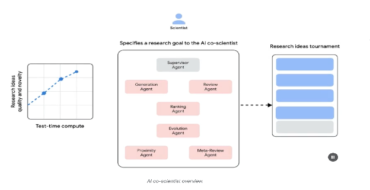
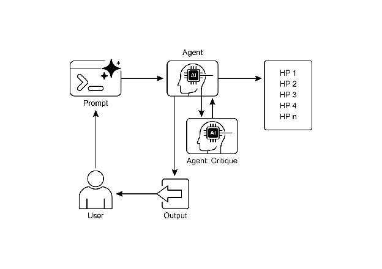

# Chapter 21: Exploration and Discovery

이 챕터는 지능형 Agent가 운영 환경 내에서 새로운 정보를 적극적으로 탐색하고, 새로운 가능성을 발견하며, 미지의 미지(unknown unknowns)를 식별할 수 있게 하는 패턴을 탐구함. Exploration과 discovery는 반응적 동작이나 미리 정의된 솔루션 공간 내에서의 최적화와 다름. 대신 Agent가 능동적으로 미지의 영역으로 모험하고, 새로운 접근 방식을 실험하며, 새로운 지식이나 이해를 생성하는 데 집중함. 이 패턴은 정적 지식이나 사전 프로그래밍된 솔루션이 불충분한 개방형, 복잡하거나 빠르게 진화하는 도메인에서 운영되는 Agent에 중요함. Agent의 이해와 능력을 확장하는 역량을 강조함.

# Practical Applications & Use Cases

AI Agent는 지능적으로 우선순위를 정하고 탐색하는 능력을 보유하며, 이는 다양한 도메인에서 애플리케이션으로 이어짐. 잠재적 행동을 자율적으로 평가하고 순서화함으로써 이러한 Agent는 복잡한 환경을 탐색하고, 숨겨진 통찰을 발견하며, 혁신을 주도할 수 있음. 우선순위가 지정된 탐색에 대한 이 능력은 프로세스를 최적화하고, 새로운 지식을 발견하며, 콘텐츠를 생성할 수 있게 함.

예시:

* **과학 연구 자동화:** Agent가 실험을 설계 및 실행하고, 결과를 분석하며, 새로운 가설을 수립하여 새로운 재료, 약물 후보 또는 과학적 원리를 발견함.
* **게임 플레이 및 전략 생성:** Agent는 게임 상태를 탐색하여 창발적 전략을 발견하거나 게임 환경의 취약점을 식별함(예: AlphaGo).
* **시장 조사 및 트렌드 발견:** Agent는 비정형 데이터(소셜 미디어, 뉴스, 보고서)를 스캔하여 트렌드, 소비자 행동 또는 시장 기회를 식별함.
* **보안 취약점 발견:** Agent는 시스템이나 코드베이스를 조사하여 보안 결함이나 공격 벡터를 찾음.
* **창의적 콘텐츠 생성:** Agent는 스타일, 테마 또는 데이터의 조합을 탐색하여 예술 작품, 음악 작곡 또는 문학 작품을 생성함.
* **개인화된 교육 및 훈련:** AI 튜터는 학생의 진행 상황, 학습 스타일 및 개선이 필요한 영역을 기반으로 학습 경로와 콘텐츠 전달의 우선순위를 지정함.

Google Co-Scientist

AI co-scientist는 Google Research가 개발한 AI 시스템으로 계산 과학 협력자로 설계됨. 가설 생성, 제안 개선 및 실험 설계와 같은 연구 측면에서 인간 과학자를 지원함. 이 시스템은 Gemini LLM에서 작동함.

AI co-scientist의 개발은 과학 연구의 과제를 해결함. 여기에는 대량의 정보 처리, 테스트 가능한 가설 생성 및 실험 계획 관리가 포함됨. AI co-scientist는 대규모 정보 처리 및 합성을 포함하는 작업을 수행하여 연구자를 지원하며, 잠재적으로 데이터 내의 관계를 드러냄. 그 목적은 초기 단계 연구의 계산적으로 요구되는 측면을 처리하여 인간 인지 프로세스를 증강하는 것임.

**시스템 아키텍처 및 방법론:** AI co-scientist의 아키텍처는 협력적이고 반복적인 프로세스를 모방하도록 구조화된 multi-agent 프레임워크를 기반으로 함. 이 설계는 각각 연구 목표에 기여하는 특정 역할을 가진 전문화된 AI Agent를 통합함. Supervisor agent는 계산 리소스의 유연한 확장을 허용하는 비동기 작업 실행 프레임워크 내에서 이러한 개별 Agent의 활동을 관리하고 조정함.

핵심 Agent와 그 기능은 다음을 포함함 (Fig. 1 참조):

* **Generation agent**: 문헌 탐색과 시뮬레이션된 과학적 토론을 통해 초기 가설을 생성하여 프로세스를 시작함.
* **Reflection agent**: 동료 검토자로서 생성된 가설의 정확성, 참신성 및 품질을 비판적으로 평가함.
* **Ranking agent**: Elo 기반 토너먼트를 사용하여 시뮬레이션된 과학적 토론을 통해 가설을 비교, 순위 지정 및 우선순위 지정함.
* **Evolution agent**: 개념을 단순화하고, 아이디어를 종합하며, 비전통적인 추론을 탐색하여 상위 순위 가설을 지속적으로 개선함.
* **Proximity agent**: 유사한 아이디어를 클러스터링하고 가설 환경을 탐색하는 데 도움을 주기 위해 근접성 그래프를 계산함.
* **Meta-review agent**: 모든 검토와 토론에서 통찰을 종합하여 공통 패턴을 식별하고 피드백을 제공하여 시스템이 지속적으로 개선되도록 함.

시스템의 운영 기반은 언어 이해, 추론 및 생성 능력을 제공하는 Gemini에 의존함. 시스템은 "test-time compute scaling" 메커니즘을 통합하여 반복적으로 추론하고 출력을 향상시키기 위해 증가된 계산 리소스를 할당함. 시스템은 학술 문헌, 웹 기반 데이터 및 데이터베이스를 포함한 다양한 소스의 정보를 처리하고 종합함.

Fig. 1: (Courtesy of the Authors) AI Co-Scientist: Ideation to Validation

시스템은 과학적 방법을 반영하는 반복적인 "생성, 토론 및 진화" 접근 방식을 따름. 인간 과학자로부터 과학 문제의 입력을 받은 후 시스템은 가설 생성, 평가 및 개선의 자체 개선 주기에 참여함. 가설은 Agent 간의 내부 평가와 토너먼트 기반 순위 메커니즘을 포함하여 체계적 평가를 거침.

**검증 및 결과:** AI co-scientist의 유용성은 여러 검증 연구에서 입증되었으며, 특히 생물의학 분야에서 자동화된 벤치마크, 전문가 검토 및 종단 간 wet-lab 실험을 통해 성능을 평가함.

**자동화 및 전문가 평가:** 어려운 GPQA 벤치마크에서 시스템의 내부 Elo 등급은 결과의 정확도와 일치하는 것으로 나타났으며, 어려운 "diamond set"에서 78.4%의 top-1 정확도를 달성함. 200개 이상의 연구 목표에 대한 분석은 test-time compute를 확장하면 Elo 등급으로 측정한 가설의 품질이 일관되게 향상됨을 보여줌. 엄선된 15개의 어려운 문제에서 AI co-scientist는 다른 최첨단 AI 모델과 인간 전문가가 제공한 "best guess" 솔루션을 능가함. 소규모 평가에서 생물의학 전문가들은 co-scientist의 출력이 다른 기준 모델에 비해 더 참신하고 영향력 있다고 평가함. 약물 재사용에 대한 시스템의 제안은 NIH Specific Aims 페이지로 포맷되었으며, 6명의 전문 종양학자 패널에 의해 높은 품질로 판단됨.

**종단 간 실험 검증:**

약물 재사용: 급성 골수성 백혈병(AML)의 경우 시스템은 새로운 약물 후보를 제안함. KIRA6와 같은 일부는 AML에서 사용하기 위한 사전 전임상 증거가 전혀 없는 완전히 새로운 제안이었음. 후속 in vitro 실험은 KIRA6 및 기타 제안된 약물이 여러 AML 세포주에서 임상적으로 관련된 농도에서 종양 세포 생존력을 억제함을 확인함.

새로운 표적 발견: 시스템은 간 섬유증에 대한 새로운 후성유전학적 표적을 식별함. 인간 간 오가노이드를 사용한 실험실 실험은 이러한 발견을 검증하여 제안된 후성유전학적 수정자를 표적으로 하는 약물이 상당한 항섬유화 활성을 가짐을 보여줌. 식별된 약물 중 하나는 이미 다른 조건에 대해 FDA 승인을 받아 재사용 기회를 열었음.

항생제 내성: AI co-scientist는 독립적으로 미공개 실험 결과를 재현함. 특정 이동성 유전 요소(cf-PICI)가 많은 박테리아 종에서 발견되는 이유를 설명하라는 과제를 받음. 이틀 만에 시스템의 최상위 가설은 cf-PICI가 다양한 파지 꼬리와 상호작용하여 숙주 범위를 확장한다는 것이었음. 이는 독립적인 연구 그룹이 10년 이상의 연구 끝에 도달한 새로운 실험적으로 검증된 발견을 반영함.

**증강 및 제한사항:** AI co-scientist의 설계 철학은 인간 연구의 완전한 자동화보다는 증강을 강조함. 연구자는 자연어를 통해 시스템과 상호 작용하고 안내하며, 피드백을 제공하고, 자신의 아이디어를 기여하고, "scientist-in-the-loop" 협력 패러다임에서 AI의 탐색 프로세스를 지시함. 그러나 시스템에는 일부 제한 사항이 있음. 지식은 오픈 액세스 문헌에 대한 의존으로 제한되어 페이월 뒤의 중요한 이전 작업을 놓칠 수 있음. 또한 거의 게시되지 않지만 경험이 풍부한 과학자에게 중요한 부정적 실험 결과에 대한 제한된 액세스를 가짐. 또한 시스템은 사실적 부정확성이나 "hallucination"의 가능성을 포함하여 기본 LLM의 제한 사항을 상속함.

**안전성:** 안전성은 중요한 고려 사항이며 시스템은 여러 안전장치를 통합함. 모든 연구 목표는 입력 시 안전성을 검토하고 생성된 가설도 시스템이 안전하지 않거나 비윤리적인 연구에 사용되는 것을 방지하기 위해 확인됨. 1,200개의 적대적 연구 목표를 사용한 예비 안전 평가는 시스템이 위험한 입력을 강력하게 거부할 수 있음을 발견함. 책임 있는 개발을 보장하기 위해 시스템은 실제 피드백을 수집하기 위해 Trusted Tester Program을 통해 더 많은 과학자에게 제공됨.

# Hands-On Code Example

Exploration과 Discovery를 위한 agentic AI의 구체적인 예를 살펴봄: MIT 라이선스 하에 Samuel Schmidgall이 개발한 Agent Laboratory 프로젝트.

"Agent Laboratory"는 인간 과학적 노력을 대체하기보다는 증강하도록 설계된 자율 연구 워크플로우 프레임워크임. 이 시스템은 과학 연구 프로세스의 다양한 단계를 자동화하기 위해 전문화된 LLM을 활용하여 인간 연구자가 개념화와 비판적 분석에 더 많은 인지 자원을 전념할 수 있게 함.

프레임워크는 자율 연구 Agent를 위한 분산 저장소인 "AgentRxiv"를 통합함. AgentRxiv는 연구 출력의 저장, 검색 및 개발을 촉진함.

Agent Laboratory는 다음과 같은 뚜렷한 단계를 통해 연구 프로세스를 안내함:

1. **문헌 검토:** 이 초기 단계에서 전문화된 LLM 기반 Agent는 관련 학술 문헌의 자율적 수집 및 비판적 분석을 담당함. 여기에는 arXiv와 같은 외부 데이터베이스를 활용하여 관련 연구를 식별, 종합 및 분류하고 후속 단계를 위한 포괄적인 지식 기반을 효과적으로 구축하는 것이 포함됨.
2. **실험:** 이 단계는 실험 설계, 데이터 준비, 실험 실행 및 결과 분석의 협력적 공식화를 포함함. Agent는 코드 생성 및 실행을 위한 Python, 모델 액세스를 위한 Hugging Face와 같은 통합 도구를 활용하여 자동화된 실험을 수행함. 시스템은 실시간 결과를 기반으로 Agent가 실험 절차를 조정하고 최적화할 수 있는 반복적 개선을 위해 설계됨.
3. **보고서 작성:** 최종 단계에서 시스템은 포괄적인 연구 보고서 생성을 자동화함. 여기에는 실험 단계의 발견과 문헌 검토의 통찰을 종합하고, 학술 규약에 따라 문서를 구조화하며, 전문적인 포맷팅과 그림 생성을 위한 LaTeX와 같은 외부 도구를 통합하는 것이 포함됨.
4. **지식 공유**: AgentRxiv는 자율 연구 Agent가 과학적 발견을 공유, 액세스 및 협력적으로 발전시킬 수 있는 플랫폼임. Agent가 이전 발견을 기반으로 구축하여 누적 연구 진행을 촉진할 수 있게 함.

Agent Laboratory의 모듈식 아키텍처는 계산 유연성을 보장함. 목표는 인간 연구자를 유지하면서 작업을 자동화하여 연구 생산성을 향상시키는 것임.

**코드 분석:** 포괄적인 코드 분석은 이 책의 범위를 벗어나지만 몇 가지 핵심 통찰을 제공하고 독자가 직접 코드를 탐구하도록 권장함.

**판단:** 인간 평가 프로세스를 모방하기 위해 시스템은 출력을 평가하기 위한 3자 agentic judgment 메커니즘을 사용함. 여기에는 각각 특정 관점에서 생산을 평가하도록 구성된 세 개의 구별되는 자율 Agent의 배치가 포함되어 인간 판단의 미묘하고 다면적인 성격을 집합적으로 모방함. 이 접근 방식은 단일 메트릭을 넘어 더 풍부한 질적 평가를 포착하여 더 강력하고 포괄적인 평가를 가능하게 함.

```python
class ReviewersAgent:
    def __init__(self, model="gpt-4o-mini", notes=None, openai_api_key=None):
        if notes is None: self.notes = []
        else: self.notes = notes
        self.model = model
        self.openai_api_key = openai_api_key

    def inference(self, plan, report):
        reviewer_1 = "You are a harsh but fair reviewer and expect good experiments that lead to insights for the research topic."
        review_1 = get_score(outlined_plan=plan, latex=report, reward_model_llm=self.model, reviewer_type=reviewer_1, openai_api_key=self.openai_api_key)

        reviewer_2 = "You are a harsh and critical but fair reviewer who is looking for an idea that would be impactful in the field."
        review_2 = get_score(outlined_plan=plan, latex=report, reward_model_llm=self.model, reviewer_type=reviewer_2, openai_api_key=self.openai_api_key)

        reviewer_3 = "You are a harsh but fair open-minded reviewer that is looking for novel ideas that have not been proposed before."
        review_3 = get_score(outlined_plan=plan, latex=report, reward_model_llm=self.model, reviewer_type=reviewer_3, openai_api_key=self.openai_api_key)

        return f"Reviewer #1:\n{review_1}, \nReviewer #2:\n{review_2}, \nReviewer #3:\n{review_3}"
```

판단 Agent는 인간 검토자가 일반적으로 사용하는 인지 프레임워크와 평가 기준을 밀접하게 모방하는 특정 프롬프트로 설계됨. 이 프롬프트는 Agent가 인간 전문가와 유사한 렌즈를 통해 출력을 분석하도록 안내하며 관련성, 일관성, 사실 정확성 및 전반적인 품질과 같은 요소를 고려함. 인간 검토 프로토콜을 반영하도록 이러한 프롬프트를 작성함으로써 시스템은 인간과 유사한 식별력에 접근하는 평가 정교함 수준을 달성하는 것을 목표로 함.

```python
def get_score(outlined_plan, latex, reward_model_llm, reviewer_type=None, attempts=3, openai_api_key=None):
    e = str()
    for _attempt in range(attempts):
        try:
            template_instructions = """
            Respond in the following format:
            THOUGHT:
            <THOUGHT>
            REVIEW JSON:
            ```json
            <JSON>
            ```
            In <THOUGHT>, first briefly discuss your intuitions
            and reasoning for the evaluation.
            Detail your high-level arguments, necessary choices
            and desired outcomes of the review.
            Do not make generic comments here, but be specific
            to your current paper.
            Treat this as the note-taking phase of your review.
            In <JSON>, provide the review in JSON format with
            the following fields in the order:
            - "Summary": A summary of the paper content and
            its contributions.
            - "Strengths": A list of strengths of the paper.
            - "Weaknesses": A list of weaknesses of the paper.
            - "Originality": A rating from 1 to 4
              (low, medium, high, very high).
            - "Quality": A rating from 1 to 4
              (low, medium, high, very high).
            - "Clarity": A rating from 1 to 4
              (low, medium, high, very high).
            - "Significance": A rating from 1 to 4
              (low, medium, high, very high).
            - "Questions": A set of clarifying questions to be
              answered by the paper authors.
            - "Limitations": A set of limitations and potential
              negative societal impacts of the work.
            - "Ethical Concerns": A boolean value indicating
               whether there are ethical concerns.
            - "Soundness": A rating from 1 to 4
               (poor, fair, good, excellent).
            - "Presentation": A rating from 1 to 4
               (poor, fair, good, excellent).
            - "Contribution": A rating from 1 to 4
              (poor, fair, good, excellent).
            - "Overall": A rating from 1 to 10
              (very strong reject to award quality).
            - "Confidence": A rating from 1 to 5
              (low, medium, high, very high, absolute).
            - "Decision": A decision that has to be one of the
             following: Accept, Reject.
            For the "Decision" field, don't use Weak Accept,
              Borderline Accept, Borderline Reject, or Strong Reject.
             Instead, only use Accept or Reject.
            This JSON will be automatically parsed, so ensure
            the format is precise.
            """
```

이 multi-agent 시스템에서 연구 프로세스는 전문화된 역할을 중심으로 구조화되어 워크플로우를 간소화하고 출력을 최적화하기 위해 일반적인 학술 계층을 반영함.

**Professor Agent:** Professor Agent는 주요 연구 책임자로서 연구 의제 수립, 연구 질문 정의 및 다른 Agent에게 작업 위임을 담당함. 이 Agent는 전략적 방향을 설정하고 프로젝트 목표와의 정렬을 보장함.

```python
class ProfessorAgent(BaseAgent):
    def __init__(self, model="gpt4omini", notes=None, max_steps=100, openai_api_key=None):
        super().__init__(model, notes, max_steps, openai_api_key)
        self.phases = ["report writing"]

    def generate_readme(self):
        sys_prompt = f"""You are {self.role_description()} \n Here is the written paper \n{self.report}. Task instructions: Your goal is to integrate all of the knowledge, code, reports, and notes provided to you and generate a readme.md for a github repository."""
        history_str = "\n".join([_[1] for _ in self.history])
        prompt = (
            f"""History: {history_str}\n{'~' * 10}\n"""
            f"Please produce the readme below in markdown:\n")
        model_resp = query_model(model_str=self.model, system_prompt=sys_prompt, prompt=prompt, openai_api_key=self.openai_api_key)
        return model_resp.replace("```markdown", "")
```

**PostDoc Agent:** PostDoc Agent의 역할은 연구를 실행하는 것임. 여기에는 문헌 검토 수행, 실험 설계 및 구현, 논문과 같은 연구 출력 생성이 포함됨. 중요한 것은 PostDoc Agent가 코드를 작성하고 실행할 수 있는 능력을 가지고 있어 실험 프로토콜과 데이터 분석의 실용적인 구현을 가능하게 함. 이 Agent는 연구 산물의 주요 생산자임.

```python
class PostdocAgent(BaseAgent):
    def __init__(self, model="gpt4omini", notes=None, max_steps=100, openai_api_key=None):
        super().__init__(model, notes, max_steps, openai_api_key)
        self.phases = ["plan formulation", "results interpretation"]

    def context(self, phase):
        sr_str = str()
        if self.second_round:
            sr_str = (
                f"The following are results from the previous experiments\n",
                f"Previous Experiment code: {self.prev_results_code}\n"
                f"Previous Results: {self.prev_exp_results}\n"
                f"Previous Interpretation of results: {self.prev_interpretation}\n"
                f"Previous Report: {self.prev_report}\n"
                f"{self.reviewer_response}\n\n\n"
            )
        if phase == "plan formulation":
            return (
                sr_str,
                f"Current Literature Review: {self.lit_review_sum}",
            )
        elif phase == "results interpretation":
            return (
                sr_str,
                f"Current Literature Review: {self.lit_review_sum}\n"
                f"Current Plan: {self.plan}\n"
                f"Current Dataset code: {self.dataset_code}\n"
                f"Current Experiment code: {self.results_code}\n"
                f"Current Results: {self.exp_results}"
            )
        return ""
```

**Reviewer Agents:** Reviewer Agent는 PostDoc Agent의 연구 출력에 대한 비판적 평가를 수행하여 논문과 실험 결과의 품질, 타당성 및 과학적 엄격성을 평가함. 이 평가 단계는 최종화 전에 높은 수준의 연구 출력을 보장하기 위해 학술 환경의 동료 검토 프로세스를 모방함.

**ML Engineering Agents**: Machine Learning Engineering Agent는 기계 학습 엔지니어로서 박사 과정 학생과 대화적 협력을 통해 코드를 개발함. 중심 기능은 제공된 문헌 검토와 실험 프로토콜에서 파생된 통찰을 통합하여 데이터 전처리를 위한 간단한 코드를 생성하는 것임. 이는 데이터가 지정된 실험을 위해 적절하게 포맷되고 준비되도록 보장함.

```
"You are a machine learning engineer being directed by a PhD student who will help you write the code, and you can interact with them through dialogue.\n"
"Your goal is to produce code that prepares the data for the provided experiment. You should aim for simple code to prepare the data, not complex code. You should integrate the provided literature review and the plan and come up with code to prepare data for this experiment.\n"
```

**SWEngineerAgents:** Software Engineering Agent는 Machine Learning Engineer Agent를 안내함. 주요 목적은 Machine Learning Engineer Agent가 특정 실험을 위한 간단한 데이터 준비 코드를 만드는 것을 돕는 것임. Software Engineer Agent는 제공된 문헌 검토와 실험 계획을 통합하여 생성된 코드가 간단하고 연구 목표와 직접적으로 관련되도록 보장함.

```
"You are a software engineer directing a machine learning engineer, where the machine learning engineer will be writing the code, and you can interact with them through dialogue.\n"
"Your goal is to help the ML engineer produce code that prepares the data for the provided experiment. You should aim for very simple code to prepare the data, not complex code. You should integrate the provided literature review and the plan and come up with code to prepare data for this experiment.\n"
```

요약하면 "Agent Laboratory"는 자율 과학 연구를 위한 정교한 프레임워크를 나타냄. 핵심 연구 단계를 자동화하고 협력적 AI 기반 지식 생성을 촉진하여 인간 연구 능력을 증강하도록 설계됨. 시스템은 일상적인 작업을 관리하면서 인간 감독을 유지하여 연구 효율성을 높이는 것을 목표로 함.

# At a Glance

**What:** AI Agent는 종종 미리 정의된 지식 내에서 작동하여 새로운 상황이나 개방형 문제를 처리하는 능력을 제한함. 복잡하고 동적인 환경에서 이러한 정적이고 사전 프로그래밍된 정보는 진정한 혁신이나 발견에 불충분함. 근본적인 과제는 Agent가 단순한 최적화를 넘어 능동적으로 새로운 정보를 탐색하고 "미지의 미지"를 식별할 수 있도록 하는 것임. 이는 순전히 반응적인 동작에서 시스템 자체의 이해와 능력을 확장하는 능동적인 Agentic 탐색으로의 패러다임 전환을 필요로 함.

**Why:** 표준화된 솔루션은 자율적 탐색과 발견을 위해 특별히 설계된 Agentic AI 시스템을 구축하는 것임. 이러한 시스템은 전문화된 LLM이 과학적 방법과 같은 프로세스를 모방하기 위해 협력하는 multi-agent 프레임워크를 종종 활용함. 예를 들어, 구별되는 Agent는 가설 생성, 비판적 검토 및 가장 유망한 개념 진화를 담당할 수 있음. 이 구조화된 협력적 방법론은 시스템이 방대한 정보 환경을 지능적으로 탐색하고, 실험을 설계 및 실행하며, 진정으로 새로운 지식을 생성할 수 있게 함. 탐색의 노동 집약적 측면을 자동화함으로써 이러한 시스템은 인간 지능을 증강하고 발견 속도를 크게 가속화함.

**Rule of thumb:** 솔루션 공간이 완전히 정의되지 않은 개방형, 복잡하거나 빠르게 진화하는 도메인에서 운영할 때 Exploration and Discovery 패턴을 사용함. 과학 연구, 시장 분석 및 창의적 콘텐츠 생성과 같은 새로운 가설, 전략 또는 통찰의 생성이 필요한 작업에 이상적임. 이 패턴은 알려진 프로세스를 단순히 최적화하는 것이 아니라 "미지의 미지"를 발견하는 것이 목표일 때 필수적임.

**Visual summary**

****

Fig.2: Exploration and Discovery design pattern

# Key Takeaways

* AI의 Exploration과 Discovery는 Agent가 새로운 정보와 가능성을 적극적으로 추구할 수 있게 하며, 이는 복잡하고 진화하는 환경을 탐색하는 데 필수적임.
* Google Co-Scientist와 같은 시스템은 Agent가 가설을 자율적으로 생성하고 실험을 설계하여 인간 과학 연구를 보완하는 방법을 보여줌.
* Agent Laboratory의 전문화된 역할로 예시되는 multi-agent 프레임워크는 문헌 검토, 실험 및 보고서 작성의 자동화를 통해 연구를 개선함.
* 궁극적으로 이러한 Agent는 계산 집약적 작업을 관리하여 인간의 창의성과 문제 해결을 향상시켜 혁신과 발견을 가속화하는 것을 목표로 함.

# Conclusion

결론적으로 Exploration and Discovery 패턴은 진정한 agentic 시스템의 본질이며, 수동적 지시 따르기를 넘어 환경을 능동적으로 탐색하는 능력을 정의함. 이 타고난 agentic 추진력이 AI를 복잡한 도메인에서 자율적으로 운영할 수 있게 하는 것이며, 단순히 작업을 실행하는 것이 아니라 독립적으로 하위 목표를 설정하여 새로운 정보를 발견함. 이 고급 agentic 동작은 각 Agent가 더 큰 협력 프로세스에서 특정하고 능동적인 역할을 구현하는 multi-agent 프레임워크를 통해 가장 강력하게 실현됨. 예를 들어, Google의 Co-scientist의 고도로 agentic한 시스템은 과학적 가설을 자율적으로 생성, 토론 및 진화시키는 Agent를 특징으로 함.

Agent Laboratory와 같은 프레임워크는 인간 연구 팀을 모방하는 agentic 계층을 만들어 시스템이 전체 발견 라이프사이클을 자체 관리할 수 있게 하여 이를 더욱 구조화함. 이 패턴의 핵심은 시스템이 최소한의 인간 개입으로 장기적이고 개방형 목표를 추구할 수 있도록 하는 창발적 agentic 동작을 조율하는 데 있음. 이는 인간-AI 파트너십을 향상시켜 AI를 탐색 작업의 자율적 실행을 처리하는 진정한 agentic 협력자로 위치시킴. 이 능동적 발견 작업을 agentic 시스템에 위임함으로써 인간 지능이 크게 증강되고 혁신이 가속화됨. 이러한 강력한 agentic 능력의 개발은 안전성과 윤리적 감독에 대한 강한 약속을 필요로 함. 궁극적으로 이 패턴은 진정한 agentic AI를 만들기 위한 청사진을 제공하여 계산 도구를 지식 추구의 독립적이고 목표 지향적인 파트너로 변환함.

# References

1. Exploration-Exploitation Dilemma**:** A fundamental problem in reinforcement learning and decision-making under uncertainty. [https://en.wikipedia.org/wiki/Exploration%E2%80%93exploitation\_dilemma](https://en.wikipedia.org/wiki/Exploration%E2%80%93exploitation_dilemma)
2. Google Co-Scientist: [https://research.google/blog/accelerating-scientific-breakthroughs-with-an-ai-co-scientist/](https://research.google/blog/accelerating-scientific-breakthroughs-with-an-ai-co-scientist/)
3. Agent Laboratory: Using LLM Agents as Research Assistants [https://github.com/SamuelSchmidgall/AgentLaboratory](https://github.com/SamuelSchmidgall/AgentLaboratory)
4. AgentRxiv: Towards Collaborative Autonomous Research: [https://agentrxiv.github.io/](https://agentrxiv.github.io/)
