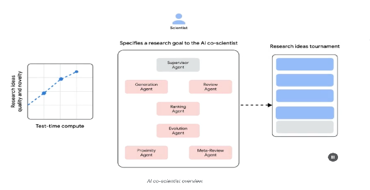
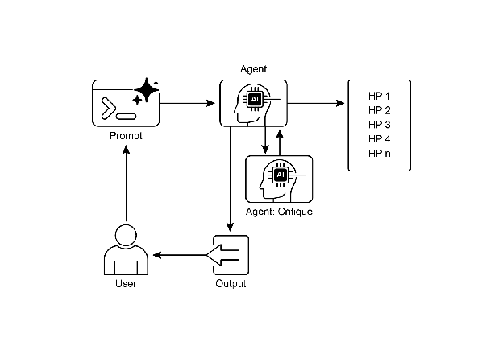

# Chapter 21: Exploration and Discovery

This chapter explores patterns that enable intelligent agents to actively seek out novel information, uncover new possibilities, and identify unknown unknowns within their operational environment. Exploration and discovery differ from reactive behaviors or optimization within a predefined solution space. Instead, they focus on agents proactively venturing into unfamiliar territories, experimenting with new approaches, and generating new knowledge or understanding. This pattern is crucial for agents operating in open-ended, complex, or rapidly evolving domains where static knowledge or pre-programmed solutions are insufficient. It emphasizes the agent's capacity to expand its understanding and capabilities.

# Practical Applications & Use Cases

AI agents possess the ability to intelligently prioritize and explore, which leads to applications across various domains. By autonomously evaluating and ordering potential actions, these agents can navigate complex environments, uncover hidden insights, and drive innovation. This capacity for prioritized exploration enables them to optimize processes, discover new knowledge, and generate content.

Examples:

* **Scientific Research Automation:** An agent designs and runs experiments, analyzes results, and formulates new hypotheses to discover novel materials, drug candidates, or scientific principles.  
* **Game Playing and Strategy Generation:** Agents explore game states, discovering emergent strategies or identifying vulnerabilities in game environments (e.g., AlphaGo).  
* **Market Research and Trend Spotting:** Agents scan unstructured data (social media, news, reports) to identify trends, consumer behaviors, or market opportunities.  
* **Security Vulnerability Discovery:** Agents probe systems or codebases to find security flaws or attack vectors.  
* **Creative Content Generation:** Agents explore combinations of styles, themes, or data to generate artistic pieces, musical compositions, or literary works.  
* **Personalized Education and Training:** AI tutors prioritize learning paths and content delivery based on a student's progress, learning style, and areas needing improvement.

Google Co-Scientist

An AI co-scientist is an AI system developed by Google Research designed as a computational scientific collaborator. It assists human scientists in research aspects such as hypothesis generation, proposal refinement, and experimental design. This system operates on the Gemini LLM..

The development of the AI co-scientist addresses challenges in scientific research. These include processing large volumes of information, generating testable hypotheses, and managing experimental planning. The AI co-scientist supports researchers by performing tasks that involve large-scale information processing and synthesis, potentially revealing relationships within data. Its purpose is to augment human cognitive processes by handling computationally demanding aspects of early-stage research.

**System Architecture and Methodology:** The architecture of the AI co-scientist is based on a multi-agent framework, structured to emulate collaborative and iterative processes. This design integrates specialized AI agents, each with a specific role in contributing to a research objective. A supervisor agent manages and coordinates the activities of these individual agents within an asynchronous task execution framework that allows for flexible scaling of computational resources.

The core agents and their functions include (see Fig. 1):

* **Generation agent**: Initiates the process by producing initial hypotheses through literature exploration and simulated scientific debates.  
* **Reflection agent**: Acts as a peer reviewer, critically assessing the correctness, novelty, and quality of the generated hypotheses.  
* **Ranking agent**: Employs an Elo-based tournament to compare, rank, and prioritize hypotheses through simulated scientific debates.  
* **Evolution agent**: Continuously refines top-ranked hypotheses by simplifying concepts, synthesizing ideas, and exploring unconventional reasoning.  
* **Proximity agent**: Computes a proximity graph to cluster similar ideas and assist in exploring the hypothesis landscape.  
* **Meta-review agent**: Synthesizes insights from all reviews and debates to identify common patterns and provide feedback, enabling the system to continuously improve.

The system's operational foundation relies on Gemini, which provides language understanding, reasoning, and generative abilities. The system incorporates "test-time compute scaling," a mechanism that allocates increased computational resources to iteratively reason and enhance outputs. The system processes and synthesizes information from diverse sources, including academic literature, web-based data, and databases.

Fig. 1: (Courtesy of the Authors) AI Co-Scientist: Ideation to Validation

The system follows an iterative "generate, debate, and evolve" approach mirroring the scientific method. Following the input of a scientific problem from a human scientist, the system engages in a self-improving cycle of hypothesis generation, evaluation, and refinement. Hypotheses undergo systematic assessment, including internal evaluations among agents and a tournament-based ranking mechanism.

**Validation and Results:** The AI co-scientist's utility has been demonstrated in several validation studies, particularly in biomedicine, assessing its performance through automated benchmarks, expert reviews, and end-to-end wet-lab experiments.

**Automated and Expert Evaluation:** On the challenging GPQA benchmark, the system's internal Elo rating was shown to be concordant with the accuracy of its results, achieving a top-1 accuracy of 78.4% on the difficult "diamond set". Analysis across over 200 research goals demonstrated that scaling test-time compute consistently improves the quality of hypotheses, as measured by the Elo rating. On a curated set of 15 challenging problems, the AI co-scientist outperformed other state-of-the-art AI models and the "best guess" solutions provided by human experts. In a small-scale evaluation, biomedical experts rated the co-scientist's outputs as more novel and impactful compared to other baseline models. The system's proposals for drug repurposing, formatted as NIH Specific Aims pages, were also judged to be of high quality by a panel of six expert oncologists.

**End-to-End Experimental Validation:** 

Drug Repurposing: For acute myeloid leukemia (AML), the system proposed novel drug candidates. Some of these, like KIRA6, were completely novel suggestions with no prior preclinical evidence for use in AML. Subsequent in vitro experiments confirmed that KIRA6 and other suggested drugs inhibited tumor cell viability at clinically relevant concentrations in multiple AML cell lines.

 Novel Target Discovery: The system identified novel epigenetic targets for liver fibrosis. Laboratory experiments using human hepatic organoids validated these findings, showing that drugs targeting the suggested epigenetic modifiers had significant anti-fibrotic activity. One of the identified drugs is already FDA-approved for another condition, opening an opportunity for repurposing. 

Antimicrobial Resistance: The AI co-scientist independently recapitulated unpublished experimental findings. It was tasked to explain why certain mobile genetic elements (cf-PICIs) are found across many bacterial species. In two days, the system's top-ranked hypothesis was that cf-PICIs interact with diverse phage tails to expand their host range. This mirrored the novel, experimentally validated discovery that an independent research group had reached after more than a decade of research.

**Augmentation, and Limitations:** The design philosophy behind the AI co-scientist emphasizes augmentation rather than complete automation of human research. Researchers interact with and guide the system through natural language, providing feedback, contributing their own ideas, and directing the AI's exploratory processes in a "scientist-in-the-loop" collaborative paradigm. However, the system has some limitations. Its knowledge is constrained by its reliance on open-access literature, potentially missing critical prior work behind paywalls. It also has limited access to negative experimental results, which are rarely published but crucial for experienced scientists. Furthermore, the system inherits limitations from the underlying LLMs, including the potential for factual inaccuracies or "hallucinations".

**Safety:** Safety is a critical consideration, and the system incorporates multiple safeguards. All research goals are reviewed for safety upon input, and generated hypotheses are also checked to prevent the system from being used for unsafe or unethical research. A preliminary safety evaluation using 1,200 adversarial research goals found that the system could robustly reject dangerous inputs. To ensure responsible development, the system is being made available to more scientists through a Trusted Tester Program to gather real-world feedback.

# Hands-On Code Example

Let's look at a concrete example of agentic AI for Exploration and Discovery in action: Agent Laboratory, a project developed by Samuel Schmidgall under the MIT License.

"Agent Laboratory" is an autonomous research workflow framework designed to augment human scientific endeavors rather than replace them. This system leverages specialized LLMs to automate various stages of the scientific research process, thereby enabling human researchers to dedicate more cognitive resources to conceptualization and critical analysis.

The framework integrates "AgentRxiv," a decentralized repository for autonomous research agents. AgentRxiv facilitates the deposition, retrieval, and development of research outputs

Agent Laboratory guides the research process through distinct phases:

1. **Literature Review:** During this initial phase, specialized LLM-driven agents are tasked with the autonomous collection and critical analysis of pertinent scholarly literature. This involves leveraging external databases such as arXiv to identify, synthesize, and categorize relevant research, effectively establishing a comprehensive knowledge base for the subsequent stages.  
2. **Experimentation:** This phase encompasses the collaborative formulation of experimental designs, data preparation, execution of experiments, and analysis of results. Agents utilize integrated tools like Python for code generation and execution, and Hugging Face for model access, to conduct automated experimentation. The system is designed for iterative refinement, where agents can adapt and optimize experimental procedures based on real-time outcomes.  
3. **Report Writing:** In the final phase, the system automates the generation of comprehensive research reports. This involves synthesizing findings from the experimentation phase with insights from the literature review, structuring the document according to academic conventions, and integrating external tools like LaTeX for professional formatting and figure generation.  
4. **Knowledge Sharing**: AgentRxiv is a platform enabling autonomous research agents to share, access, and collaboratively advance scientific discoveries. It allows agents to build upon previous findings, fostering cumulative research progress.

The modular architecture of Agent Laboratory ensures computational flexibility. The aim is to enhance research productivity by automating tasks while maintaining the human researcher.

**Code analysis:** While a comprehensive code analysis is beyond the scope of this book, I want to provide you with some key insights and encourage you to delve into the code on your own.

**Judgment:** In order to emulate human evaluative processes, the system employs a tripartite agentic judgment mechanism for assessing outputs. This involves the deployment of three distinct autonomous agents, each configured to evaluate the production from a specific perspective, thereby collectively mimicking the nuanced and multi-faceted nature of human judgment. This approach allows for a more robust and comprehensive appraisal, moving beyond singular metrics to capture a richer qualitative assessment.

```python
class ReviewersAgent:
    def __init__(self, model="gpt-4o-mini", notes=None, openai_api_key=None):
        if notes is None: self.notes = []
        else: self.notes = notes
        self.model = model
        self.openai_api_key = openai_api_key

    def inference(self, plan, report):
        reviewer_1 = "You are a harsh but fair reviewer and expect good experiments that lead to insights for the research topic."
        review_1 = get_score(outlined_plan=plan, latex=report, reward_model_llm=self.model, reviewer_type=reviewer_1, openai_api_key=self.openai_api_key)

        reviewer_2 = "You are a harsh and critical but fair reviewer who is looking for an idea that would be impactful in the field."
        review_2 = get_score(outlined_plan=plan, latex=report, reward_model_llm=self.model, reviewer_type=reviewer_2, openai_api_key=self.openai_api_key)

        reviewer_3 = "You are a harsh but fair open-minded reviewer that is looking for novel ideas that have not been proposed before."
        review_3 = get_score(outlined_plan=plan, latex=report, reward_model_llm=self.model, reviewer_type=reviewer_3, openai_api_key=self.openai_api_key)

        return f"Reviewer #1:\n{review_1}, \nReviewer #2:\n{review_2}, \nReviewer #3:\n{review_3}"
```

The judgment agents are designed with a specific prompt that closely emulates the cognitive framework and evaluation criteria typically employed by human reviewers. This prompt guides the agents to analyze outputs through a lens similar to how a human expert would, considering factors like relevance, coherence, factual accuracy, and overall quality. By crafting these prompts to mirror human review protocols, the system aims to achieve a level of evaluative sophistication that approaches human-like discernment.

```python
def get_score(outlined_plan, latex, reward_model_llm, reviewer_type=None, attempts=3, openai_api_key=None):
    e = str()
    for _attempt in range(attempts):
        try:
            template_instructions = """
            Respond in the following format:
            THOUGHT:
            <THOUGHT>
            REVIEW JSON:
            ```json
            <JSON>
            ```
            In <THOUGHT>, first briefly discuss your intuitions
            and reasoning for the evaluation.
            Detail your high-level arguments, necessary choices
            and desired outcomes of the review.
            Do not make generic comments here, but be specific
            to your current paper.
            Treat this as the note-taking phase of your review.
            In <JSON>, provide the review in JSON format with
            the following fields in the order:
            - "Summary": A summary of the paper content and
            its contributions.
            - "Strengths": A list of strengths of the paper.
            - "Weaknesses": A list of weaknesses of the paper.
            - "Originality": A rating from 1 to 4
              (low, medium, high, very high).
            - "Quality": A rating from 1 to 4
              (low, medium, high, very high).
            - "Clarity": A rating from 1 to 4
              (low, medium, high, very high).
            - "Significance": A rating from 1 to 4
              (low, medium, high, very high).
            - "Questions": A set of clarifying questions to be
              answered by the paper authors.
            - "Limitations": A set of limitations and potential
              negative societal impacts of the work.
            - "Ethical Concerns": A boolean value indicating
               whether there are ethical concerns.
            - "Soundness": A rating from 1 to 4
               (poor, fair, good, excellent).
            - "Presentation": A rating from 1 to 4
               (poor, fair, good, excellent).
            - "Contribution": A rating from 1 to 4
              (poor, fair, good, excellent).
            - "Overall": A rating from 1 to 10
              (very strong reject to award quality).
            - "Confidence": A rating from 1 to 5
              (low, medium, high, very high, absolute).
            - "Decision": A decision that has to be one of the
             following: Accept, Reject.
            For the "Decision" field, don't use Weak Accept,
              Borderline Accept, Borderline Reject, or Strong Reject.
             Instead, only use Accept or Reject.
            This JSON will be automatically parsed, so ensure
            the format is precise.
            """
```

In this multi-agent system, the research process is structured around specialized roles, mirroring a typical academic hierarchy to streamline workflow and optimize output.

**Professor Agent:** The Professor Agent functions as the primary research director, responsible for establishing the research agenda, defining research questions, and delegating tasks to other agents. This agent sets the strategic direction and ensures alignment with project objectives.

```python
class ProfessorAgent(BaseAgent):
    def __init__(self, model="gpt4omini", notes=None, max_steps=100, openai_api_key=None):
        super().__init__(model, notes, max_steps, openai_api_key)
        self.phases = ["report writing"]

    def generate_readme(self):
        sys_prompt = f"""You are {self.role_description()} \n Here is the written paper \n{self.report}. Task instructions: Your goal is to integrate all of the knowledge, code, reports, and notes provided to you and generate a readme.md for a github repository."""
        history_str = "\n".join([_[1] for _ in self.history])
        prompt = (
            f"""History: {history_str}\n{'~' * 10}\n"""
            f"Please produce the readme below in markdown:\n")
        model_resp = query_model(model_str=self.model, system_prompt=sys_prompt, prompt=prompt, openai_api_key=self.openai_api_key)
        return model_resp.replace("```markdown", "")
```

**PostDoc Agent:** The PostDoc Agent's role is to execute the research. This includes conducting literature reviews, designing and implementing experiments, and generating research outputs such as papers. Importantly, the PostDoc Agent has the capability to write and execute code, enabling the practical implementation of experimental protocols and data analysis. This agent is the primary producer of research artifacts.

```python
class PostdocAgent(BaseAgent):
    def __init__(self, model="gpt4omini", notes=None, max_steps=100, openai_api_key=None):
        super().__init__(model, notes, max_steps, openai_api_key)
        self.phases = ["plan formulation", "results interpretation"]

    def context(self, phase):
        sr_str = str()
        if self.second_round:
            sr_str = (
                f"The following are results from the previous experiments\n",
                f"Previous Experiment code: {self.prev_results_code}\n"
                f"Previous Results: {self.prev_exp_results}\n"
                f"Previous Interpretation of results: {self.prev_interpretation}\n"
                f"Previous Report: {self.prev_report}\n"
                f"{self.reviewer_response}\n\n\n"
            )
        if phase == "plan formulation":
            return (
                sr_str,
                f"Current Literature Review: {self.lit_review_sum}",
            )
        elif phase == "results interpretation":
            return (
                sr_str,
                f"Current Literature Review: {self.lit_review_sum}\n"
                f"Current Plan: {self.plan}\n"
                f"Current Dataset code: {self.dataset_code}\n"
                f"Current Experiment code: {self.results_code}\n"
                f"Current Results: {self.exp_results}"
            )
        return ""
```

**Reviewer Agents:** Reviewer agents perform critical evaluations of research outputs from the PostDoc Agent, assessing the quality, validity, and scientific rigor of papers and experimental results. This evaluation phase emulates the peer-review process in academic settings to ensure a high standard of research output before finalization.

**ML Engineering Agents**:The Machine Learning Engineering Agents serve as machine learning engineers, engaging in dialogic collaboration with a PhD student to develop code. Their central function is to generate uncomplicated code for data preprocessing, integrating insights derived from the provided literature review and experimental protocol. This guarantees that the data is appropriately formatted and prepared for the designated experiment.

```
"You are a machine learning engineer being directed by a PhD student who will help you write the code, and you can interact with them through dialogue.\n"
"Your goal is to produce code that prepares the data for the provided experiment. You should aim for simple code to prepare the data, not complex code. You should integrate the provided literature review and the plan and come up with code to prepare data for this experiment.\n"
```

**SWEngineerAgents:** Software Engineering Agents guide Machine Learning Engineer Agents. Their main purpose is to assist the Machine Learning Engineer Agent in creating straightforward data preparation code for a specific experiment. The Software Engineer Agent integrates the provided literature review and experimental plan, ensuring the generated code is uncomplicated and directly relevant to the research objectives.

```
"You are a software engineer directing a machine learning engineer, where the machine learning engineer will be writing the code, and you can interact with them through dialogue.\n"
"Your goal is to help the ML engineer produce code that prepares the data for the provided experiment. You should aim for very simple code to prepare the data, not complex code. You should integrate the provided literature review and the plan and come up with code to prepare data for this experiment.\n"
```

In summary, "Agent Laboratory" represents a sophisticated framework for autonomous scientific research. It is designed to augment human research capabilities by automating key research stages and facilitating collaborative AI-driven knowledge generation. The system aims to increase research efficiency by managing routine tasks while maintaining human oversight.

# At a Glance

**What:** AI agents often operate within predefined knowledge, limiting their ability to tackle novel situations or open-ended problems. In complex and dynamic environments, this static, pre-programmed information is insufficient for true innovation or discovery. The fundamental challenge is to enable agents to move beyond simple optimization to actively seek out new information and identify "unknown unknowns." This necessitates a paradigm shift from purely reactive behaviors to proactive, Agentic exploration that expands the system's own understanding and capabilities.

**Why:** The standardized solution is to build Agentic AI systems specifically designed for autonomous exploration and discovery. These systems often utilize a multi-agent framework where specialized LLMs collaborate to emulate processes like the scientific method. For instance, distinct agents can be tasked with generating hypotheses, critically reviewing them, and evolving the most promising concepts. This structured, collaborative methodology allows the system to intelligently navigate vast information landscapes, design and execute experiments, and generate genuinely new knowledge. By automating the labor-intensive aspects of exploration, these systems augment human intellect and significantly accelerate the pace of discovery.

**Rule of thumb:** Use the Exploration and Discovery pattern when operating in open-ended, complex, or rapidly evolving domains where the solution space is not fully defined. It is ideal for tasks requiring the generation of novel hypotheses, strategies, or insights, such as in scientific research, market analysis, and creative content generation. This pattern is essential when the objective is to uncover "unknown unknowns" rather than merely optimizing a known process.

**Visual summary**

****

Fig.2: Exploration and Discovery design pattern

# Key Takeaways

* Exploration and Discovery in AI enable agents to actively pursue new information and possibilities, which is essential for navigating complex and evolving environments.  
* Systems such as Google Co-Scientist demonstrate how Agents can autonomously generate hypotheses and design experiments, supplementing human scientific research.  
* The multi-agent framework, exemplified by Agent Laboratory's specialized roles, improves research through the automation of literature review, experimentation, and report writing.  
* Ultimately, these Agents aim to enhance human creativity and problem-solving by managing computationally intensive tasks, thus accelerating innovation and discovery.

# Conclusion

In conclusion, the Exploration and Discovery pattern is the very essence of a truly agentic system, defining its ability to move beyond passive instruction-following to proactively explore its environment. This innate agentic drive is what empowers an AI to operate autonomously in complex domains, not merely executing tasks but independently setting sub-goals to uncover novel information. This advanced agentic behavior is most powerfully realized through multi-agent frameworks where each agent embodies a specific, proactive role in a larger collaborative process. For instance, the highly agentic system of Google's Co-scientist features agents that autonomously generate, debate, and evolve scientific hypotheses.

Frameworks like Agent Laboratory further structure this by creating an agentic hierarchy that mimics human research teams, enabling the system to self-manage the entire discovery lifecycle. The core of this pattern lies in orchestrating emergent agentic behaviors, allowing the system to pursue long-term, open-ended goals with minimal human intervention. This elevates the human-AI partnership, positioning the AI as a genuine agentic collaborator that handles the autonomous execution of exploratory tasks. By delegating this proactive discovery work to an agentic system, human intellect is significantly augmented, accelerating innovation. The development of such powerful agentic capabilities also necessitates a strong commitment to safety and ethical oversight. Ultimately, this pattern provides the blueprint for creating truly agentic AI, transforming computational tools into independent, goal-seeking partners in the pursuit of knowledge.

# References

1. Exploration-Exploitation Dilemma**:** A fundamental problem in reinforcement learning and decision-making under uncertainty. [https://en.wikipedia.org/wiki/Exploration%E2%80%93exploitation\_dilemma](https://en.wikipedia.org/wiki/Exploration%E2%80%93exploitation_dilemma)   
2. Google Co-Scientist: [https://research.google/blog/accelerating-scientific-breakthroughs-with-an-ai-co-scientist/](https://research.google/blog/accelerating-scientific-breakthroughs-with-an-ai-co-scientist/)   
3. Agent Laboratory: Using LLM Agents as Research Assistants [https://github.com/SamuelSchmidgall/AgentLaboratory](https://github.com/SamuelSchmidgall/AgentLaboratory)   
4. AgentRxiv: Towards Collaborative Autonomous Research: [https://agentrxiv.github.io/](https://agentrxiv.github.io/) 


