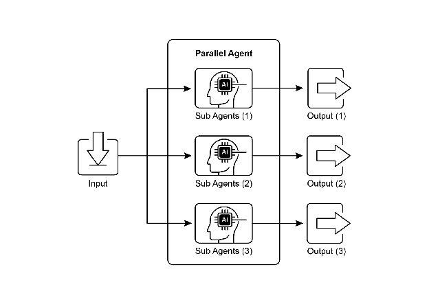
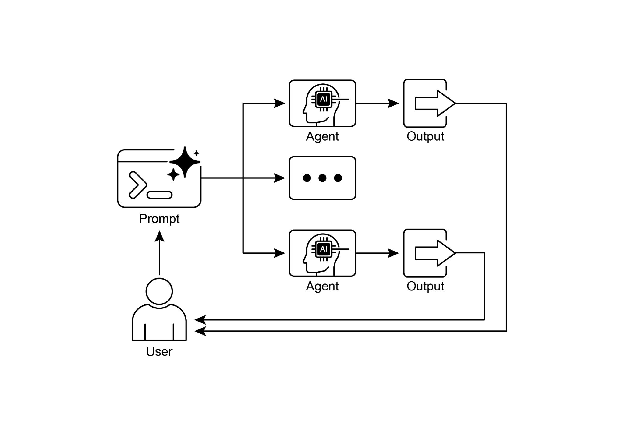

# Chapter 3: Parallelization

# Parallelization Pattern Overview

In the previous chapters, we've explored Prompt Chaining for sequential workflows and Routing for dynamic decision-making and transitions between different paths. While these patterns are essential, many complex agentic tasks involve multiple sub-tasks that can be executed *simultaneously* rather than one after another. This is where the **Parallelization** pattern becomes crucial.

Parallelization involves executing multiple components, such as LLM calls, tool usages, or even entire sub-agents, concurrently (see Fig.1). Instead of waiting for one step to complete before starting the next, parallel execution allows independent tasks to run at the same time, significantly reducing the overall execution time for tasks that can be broken down into independent parts.

Consider an agent designed to research a topic and summarize its findings. A sequential approach might:

1. Search for Source A.  
2. Summarize Source A.  
3. Search for Source B.  
4. Summarize Source B.  
5. Synthesize a final answer from summaries A and B.

A parallel approach could instead:

1. Search for Source A *and* Search for Source B simultaneously.  
2. Once both searches are complete, Summarize Source A *and* Summarize Source B simultaneously.  
3. Synthesize a final answer from summaries A and B (this step is typically sequential, waiting for the parallel steps to finish).

The core idea is to identify parts of the workflow that do not depend on the output of other parts and execute them in parallel. This is particularly effective when dealing with external services (like APIs or databases) that have latency, as you can issue multiple requests concurrently.

Implementing parallelization often requires frameworks that support asynchronous execution or multi-threading/multi-processing. Modern agentic frameworks are designed with asynchronous operations in mind, allowing you to easily define steps that can run in parallel.



Fig.1. Example of parallelization with sub-agents

Frameworks like LangChain, LangGraph, and Google ADK provide mechanisms for parallel execution. In LangChain Expression Language (LCEL), you can achieve parallel execution by combining runnable objects using operators like | (for sequential) and by structuring your chains or graphs to have branches that execute concurrently. LangGraph, with its graph structure, allows you to define multiple nodes that can be executed from a single state transition, effectively enabling parallel branches in the workflow. Google ADK provides robust, native mechanisms to facilitate and manage the parallel execution of agents, significantly enhancing the efficiency and scalability of complex, multi-agent systems. This inherent capability within the ADK framework allows developers to design and implement solutions where multiple agents can operate concurrently, rather than sequentially.

The Parallelization pattern is vital for improving the efficiency and responsiveness of agentic systems, especially when dealing with tasks that involve multiple independent lookups, computations, or interactions with external services. It's a key technique for optimizing the performance of complex agent workflows.

# Practical Applications & Use Cases

Parallelization is a powerful pattern for optimizing agent performance across various applications:

1\. Information Gathering and Research:  
Collecting information from multiple sources simultaneously is a classic use case.

* **Use Case:** An agent researching a company.  
  * **Parallel Tasks:** Search news articles, pull stock data, check social media mentions, and query a company database, all at the same time.  
  * **Benefit:** Gathers a comprehensive view much faster than sequential lookups.

2\. Data Processing and Analysis:  
Applying different analysis techniques or processing different data segments concurrently.

* **Use Case:** An agent analyzing customer feedback.  
  * **Parallel Tasks:** Run sentiment analysis, extract keywords, categorize feedback, and identify urgent issues simultaneously across a batch of feedback entries.  
  * **Benefit:** Provides a multi-faceted analysis quickly.

3\. Multi-API or Tool Interaction:  
Calling multiple independent APIs or tools to gather different types of information or perform different actions.

* **Use Case:** A travel planning agent.  
  * **Parallel Tasks:** Check flight prices, search for hotel availability, look up local events, and find restaurant recommendations concurrently.  
  * **Benefit:** Presents a complete travel plan faster.

4\. Content Generation with Multiple Components:  
Generating different parts of a complex piece of content in parallel.

* **Use Case:** An agent creating a marketing email.  
  * **Parallel Tasks:** Generate a subject line, draft the email body, find a relevant image, and create a call-to-action button text simultaneously.  
  * **Benefit:** Assembles the final email more efficiently.

5\. Validation and Verification:  
Performing multiple independent checks or validations concurrently.

* **Use Case:** An agent verifying user input.  
  * **Parallel Tasks:** Check email format, validate phone number, verify address against a database, and check for profanity simultaneously.  
  * **Benefit:** Provides faster feedback on input validity.

6\. Multi-Modal Processing:  
Processing different modalities (text, image, audio) of the same input concurrently.

* **Use Case:** An agent analyzing a social media post with text and an image.  
  * **Parallel Tasks:** Analyze the text for sentiment and keywords *and* analyze the image for objects and scene description simultaneously.  
  * **Benefit:** Integrates insights from different modalities more quickly.

7\. A/B Testing or Multiple Options Generation:  
Generating multiple variations of a response or output in parallel to select the best one.

* **Use Case:** An agent generating different creative text options.  
  * **Parallel Tasks:** Generate three different headlines for an article simultaneously using slightly different prompts or models.  
  * **Benefit:** Allows for quick comparison and selection of the best option.

Parallelization is a fundamental optimization technique in agentic design, allowing developers to build more performant and responsive applications by leveraging concurrent execution for independent tasks.

# Hands-On Code Example (LangChain)

Parallel execution within the LangChain framework is facilitated by the LangChain Expression Language (LCEL). The primary method involves structuring multiple runnable components within a dictionary or list construct. When this collection is passed as input to a subsequent component in the chain, the LCEL runtime executes the contained runnables concurrently.

In the context of LangGraph, this principle is applied to the graph's topology. Parallel workflows are defined by architecting the graph such that multiple nodes, lacking direct sequential dependencies, can be initiated from a single common node. These parallel pathways execute independently before their results can be aggregated at a subsequent convergence point in the graph.

The following implementation demonstrates a parallel processing workflow constructed with the LangChain framework. This workflow is designed to execute two independent operations concurrently in response to a single user query. These parallel processes are instantiated as distinct chains or functions, and their respective outputs are subsequently aggregated into a unified result.

The prerequisites for this implementation include the installation of the requisite Python packages, such as langchain, langchain-community, and a model provider library like langchain-openai. Furthermore, a valid API key for the chosen language model must be configured in the local environment for authentication.

```python
import os
import asyncio
from typing import Optional
from langchain_openai import ChatOpenAI
from langchain_core.prompts import ChatPromptTemplate
from langchain_core.output_parsers import StrOutputParser
from langchain_core.runnables import Runnable, RunnableParallel, RunnablePassthrough

# --- Configuration ---
# Ensure your API key environment variable is set (e.g., OPENAI_API_KEY)
try:
    llm: Optional[ChatOpenAI] = ChatOpenAI(model="gpt-4o-mini", temperature=0.7)
except Exception as e:
    print(f"Error initializing language model: {e}")
    llm = None

# --- Define Independent Chains ---
# These three chains represent distinct tasks that can be executed in parallel.
summarize_chain: Runnable = (
    ChatPromptTemplate.from_messages([
        ("system", "Summarize the following topic concisely:"),
        ("user", "{topic}")
    ])
    | llm
    | StrOutputParser()
)

questions_chain: Runnable = (
    ChatPromptTemplate.from_messages([
        ("system", "Generate three interesting questions about the following topic:"),
        ("user", "{topic}")
    ])
    | llm
    | StrOutputParser()
)

terms_chain: Runnable = (
    ChatPromptTemplate.from_messages([
        ("system", "Identify 5-10 key terms from the following topic, separated by commas:"),
        ("user", "{topic}")
    ])
    | llm
    | StrOutputParser()
)

# --- Build the Parallel + Synthesis Chain ---
# 1. Define the block of tasks to run in parallel. The results of these,
#    along with the original topic, will be fed into the next step.
map_chain = RunnableParallel(
    {
        "summary": summarize_chain,
        "questions": questions_chain,
        "key_terms": terms_chain,
        "topic": RunnablePassthrough(),  # Pass the original topic through
    }
)

# 2. Define the final synthesis prompt which will combine the parallel results.
synthesis_prompt = ChatPromptTemplate.from_messages([
    ("system", """Based on the following information:
    Summary: {summary}
    Related Questions: {questions}
    Key Terms: {key_terms}
    Synthesize a comprehensive answer."""),
    ("user", "Original topic: {topic}")
])

# 3. Construct the full chain by piping the parallel results directly
#    into the synthesis prompt, followed by the LLM and output parser.
full_parallel_chain = map_chain | synthesis_prompt | llm | StrOutputParser()

# --- Run the Chain ---
async def run_parallel_example(topic: str) -> None:
    """
    Asynchronously invokes the parallel processing chain with a specific topic
    and prints the synthesized result.
    Args:
        topic: The input topic to be processed by the LangChain chains.
    """
    if not llm:
        print("LLM not initialized. Cannot run example.")
        return

    print(f"\n--- Running Parallel LangChain Example for Topic: '{topic}' ---")
    try:
        # The input to `ainvoke` is the single 'topic' string,
        # then passed to each runnable in the `map_chain`.
        response = await full_parallel_chain.ainvoke(topic)
        print("\n--- Final Response ---")
        print(response)
    except Exception as e:
        print(f"\nAn error occurred during chain execution: {e}")

if __name__ == "__main__":
    test_topic = "The history of space exploration"
    # In Python 3.7+, asyncio.run is the standard way to run an async function.
    asyncio.run(run_parallel_example(test_topic))
```

The provided Python code implements a LangChain application designed for processing a given topic efficiently by leveraging parallel execution. Note that asyncio provides concurrency, not parallelism. It achieves this on a single thread by using an event loop that intelligently switches between tasks when one is idle (e.g., waiting for a network request). This creates the effect of multiple tasks progressing at once, but the code itself is still being executed by only one thread, constrained by Python's Global Interpreter Lock (GIL). 

The code begins by importing essential modules from langchain\_openai and langchain\_core, including components for language models, prompts, output parsing, and runnable structures. The code attempts to initialize a ChatOpenAI instance, specifically using the "gpt-4o-mini" model, with a specified temperature for controlling creativity. A try-except block is used for robustness during the language model initialization. Three independent LangChain "chains" are then defined, each designed to perform a distinct task on the input topic. The first chain is for summarizing the topic concisely, using a system message and a user message containing the topic placeholder. The second chain is configured to generate three interesting questions related to the topic. The third chain is set up to identify between 5 and 10 key terms from the input topic, requesting them to be comma-separated. Each of these independent chains consists of a ChatPromptTemplate tailored to its specific task, followed by the initialized language model and a StrOutputParser to format the output as a string. 

A RunnableParallel block is then constructed to bundle these three chains, allowing them to execute simultaneously. This parallel runnable also includes a RunnablePassthrough to ensure the original input topic is available for subsequent steps. A separate ChatPromptTemplate is defined for the final synthesis step, taking the summary, questions, key terms, and the original topic as input to generate a comprehensive answer. The full end-to-end processing chain, named full\_parallel\_chain, is created by sequencing the map\_chain (the parallel block) into the synthesis prompt, followed by the language model and the output parser. An asynchronous function run\_parallel\_example is provided to demonstrate how to invoke this full\_parallel\_chain. This function takes the topic as input and uses invoke to run the asynchronous chain. Finally, the standard Python if \_\_name\_\_ \== "\_\_main\_\_": block shows how to execute the run\_parallel\_example with a sample topic, in this case, "The history of space exploration", using asyncio.run to manage the asynchronous execution.

In essence, this code sets up a workflow where multiple LLM calls (for summarizing, questions, and terms) happen at the same time for a given topic, and their results are then combined by a final LLM call. This showcases the core idea of parallelization in an agentic workflow using LangChain.

# Hands-On Code Example (Google ADK)

Okay, let's now turn our attention to a concrete example illustrating these concepts within the Google ADK framework. We'll examine how the ADK primitives, such as ParallelAgent and SequentialAgent, can be applied to build an agent flow that leverages concurrent execution for improved efficiency.

```python
from google.adk.agents import LlmAgent, ParallelAgent, SequentialAgent
from google.adk.tools import google_search

GEMINI_MODEL="gemini-2.0-flash"

# --- 1. Define Researcher Sub-Agents (to run in parallel) ---

# Researcher 1: Renewable Energy
researcher_agent_1 = LlmAgent(
    name="RenewableEnergyResearcher",
    model=GEMINI_MODEL,
    instruction="""You are an AI Research Assistant specializing in energy.
Research the latest advancements in 'renewable energy sources'.
Use the Google Search tool provided.
Summarize your key findings concisely (1-2 sentences).
Output *only* the summary.
""",
    description="Researches renewable energy sources.",
    tools=[google_search],
    # Store result in state for the merger agent
    output_key="renewable_energy_result"
)

# Researcher 2: Electric Vehicles
researcher_agent_2 = LlmAgent(
    name="EVResearcher",
    model=GEMINI_MODEL,
    instruction="""You are an AI Research Assistant specializing in transportation.
Research the latest developments in 'electric vehicle technology'.
Use the Google Search tool provided.
Summarize your key findings concisely (1-2 sentences).
Output *only* the summary.
""",
    description="Researches electric vehicle technology.",
    tools=[google_search],
    # Store result in state for the merger agent
    output_key="ev_technology_result"
)

# Researcher 3: Carbon Capture
researcher_agent_3 = LlmAgent(
    name="CarbonCaptureResearcher",
    model=GEMINI_MODEL,
    instruction="""You are an AI Research Assistant specializing in climate solutions.
Research the current state of 'carbon capture methods'.
Use the Google Search tool provided.
Summarize your key findings concisely (1-2 sentences).
Output *only* the summary.
""",
    description="Researches carbon capture methods.",
    tools=[google_search],
    # Store result in state for the merger agent
    output_key="carbon_capture_result"
)

# --- 2. Create the ParallelAgent (Runs researchers concurrently) ---
# This agent orchestrates the concurrent execution of the researchers.
# It finishes once all researchers have completed and stored their results in state.
parallel_research_agent = ParallelAgent(
    name="ParallelWebResearchAgent",
    sub_agents=[researcher_agent_1, researcher_agent_2, researcher_agent_3],
    description="Runs multiple research agents in parallel to gather information."
)

# --- 3. Define the Merger Agent (Runs *after* the parallel agents) ---
# This agent takes the results stored in the session state by the parallel agents
# and synthesizes them into a single, structured response with attributions.
merger_agent = LlmAgent(
    name="SynthesisAgent",
    model=GEMINI_MODEL,  # Or potentially a more powerful model if needed for synthesis
    instruction="""You are an AI Assistant responsible for combining research findings into a structured report.
Your primary task is to synthesize the following research summaries, clearly attributing findings to their source areas.
Structure your response using headings for each topic. Ensure the report is coherent and integrates the key points smoothly.

**Crucially: Your entire response MUST be grounded *exclusively* on the information provided in the 'Input Summaries' below. Do NOT add any external knowledge, facts, or details not present in these specific summaries.**

**Input Summaries:**
*   **Renewable Energy:**
    {renewable_energy_result}
*   **Electric Vehicles:**
    {ev_technology_result}
*   **Carbon Capture:**
    {carbon_capture_result}

**Output Format:**

## Summary of Recent Sustainable Technology Advancements

### Renewable Energy Findings (Based on RenewableEnergyResearcher's findings)
[Synthesize and elaborate *only* on the renewable energy input summary provided above.]

### Electric Vehicle Findings (Based on EVResearcher's findings)
[Synthesize and elaborate *only* on the EV input summary provided above.]

### Carbon Capture Findings (Based on CarbonCaptureResearcher's findings)
[Synthesize and elaborate *only* on the carbon capture input summary provided above.]

### Overall Conclusion
[Provide a brief (1-2 sentence) concluding statement that connects *only* the findings presented above.]

Output *only* the structured report following this format. Do not include introductory or concluding phrases outside this structure, and strictly adhere to using only the provided input summary content.
""",
    description="Combines research findings from parallel agents into a structured, cited report, strictly grounded on provided inputs.",
    # No tools needed for merging
    # No output_key needed here, as its direct response is the final output of the sequence
)

# --- 4. Create the SequentialAgent (Orchestrates the overall flow) ---
# This is the main agent that will be run. It first executes the ParallelAgent
# to populate the state, and then executes the MergerAgent to produce the final output.
sequential_pipeline_agent = SequentialAgent(
    name="ResearchAndSynthesisPipeline",
    # Run parallel research first, then merge
    sub_agents=[parallel_research_agent, merger_agent],
    description="Coordinates parallel research and synthesizes the results."
)

root_agent = sequential_pipeline_agent
```

This code defines a multi-agent system used to research and synthesize information on sustainable technology advancements. It sets up three LlmAgent instances to act as specialized researchers. ResearcherAgent\_1 focuses on renewable energy sources, ResearcherAgent\_2 researches electric vehicle technology, and ResearcherAgent\_3 investigates carbon capture methods. Each researcher agent is configured to use a GEMINI\_MODEL and the google\_search tool. They are instructed to summarize their findings concisely (1-2 sentences) and store these summaries in the session state using output\_key.

A ParallelAgent named ParallelWebResearchAgent is then created to run these three researcher agents concurrently. This allows the research to be conducted in parallel, potentially saving time. The ParallelAgent completes its execution once all its sub-agents (the researchers) have finished and populated the state.

Next, a MergerAgent (also an LlmAgent) is defined to synthesize the research results. This agent takes the summaries stored in the session state by the parallel researchers as input. Its instruction emphasizes that the output must be strictly based only on the provided input summaries, prohibiting the addition of external knowledge. The MergerAgent is designed to structure the combined findings into a report with headings for each topic and a brief overall conclusion.

Finally, a SequentialAgent named ResearchAndSynthesisPipeline is created to orchestrate the entire workflow. As the primary controller, this main agent first executes the ParallelAgent to perform the research. Once the ParallelAgent is complete, the SequentialAgent then executes the MergerAgent to synthesize the collected information. The sequential\_pipeline\_agent is set as the root\_agent, representing the entry point for running this multi-agent system. The overall process is designed to efficiently gather information from multiple sources in parallel and then combine it into a single, structured report.

# At a Glance

**What:** Many agentic workflows involve multiple sub-tasks that must be completed to achieve a final goal. A purely sequential execution, where each task waits for the previous one to finish, is often inefficient and slow. This latency becomes a significant bottleneck when tasks depend on external I/O operations, such as calling different APIs or querying multiple databases. Without a mechanism for concurrent execution, the total processing time is the sum of all individual task durations, hindering the system's overall performance and responsiveness.

**Why:** The Parallelization pattern provides a standardized solution by enabling the simultaneous execution of independent tasks. It works by identifying components of a workflow, like tool usages or LLM calls, that do not rely on each other's immediate outputs. Agentic frameworks like LangChain and the Google ADK provide built-in constructs to define and manage these concurrent operations. For instance, a main process can invoke several sub-tasks that run in parallel and wait for all of them to complete before proceeding to the next step. By running these independent tasks at the same time rather than one after another, this pattern drastically reduces the total execution time.

**Rule of thumb:** Use this pattern when a workflow contains multiple independent operations that can run simultaneously, such as fetching data from several APIs, processing different chunks of data, or generating multiple pieces of content for later synthesis.

**Visual summary**



Fig.2: Parallelization design pattern

# Key Takeaways

Here are the key takeaways:

* Parallelization is a pattern for executing independent tasks concurrently to improve efficiency.  
* It is particularly useful when tasks involve waiting for external resources, such as API calls.  
* The adoption of a concurrent or parallel architecture introduces substantial complexity and cost, impacting key development phases such as design, debugging, and system logging.  
* Frameworks like LangChain and Google ADK provide built-in support for defining and managing parallel execution.  
* In LangChain Expression Language (LCEL), RunnableParallel is a key construct for running multiple runnables side-by-side.  
* Google ADK can facilitate parallel execution through LLM-Driven Delegation, where a Coordinator agent's LLM identifies independent sub-tasks and triggers their concurrent handling by specialized sub-agents.  
* Parallelization helps reduce overall latency and makes agentic systems more responsive for complex tasks.

# Conclusion

The parallelization pattern is a method for optimizing computational workflows by concurrently executing independent sub-tasks. This approach reduces overall latency, particularly in complex operations that involve multiple model inferences or calls to external services.

Frameworks provide distinct mechanisms for implementing this pattern. In LangChain, constructs like RunnableParallel are used to explicitly define and execute multiple processing chains simultaneously. In contrast, frameworks like the Google Agent Developer Kit (ADK) can achieve parallelization through multi-agent delegation, where a primary coordinator model assigns different sub-tasks to specialized agents that can operate concurrently.

By integrating parallel processing with sequential (chaining) and conditional (routing) control flows, it becomes possible to construct sophisticated, high-performance computational systems capable of efficiently managing diverse and complex tasks.

# References

Here are some resources for further reading on the Parallelization pattern and related concepts:

1. LangChain Expression Language (LCEL) Documentation (Parallelism): [https://python.langchain.com/docs/concepts/lcel/](https://python.langchain.com/docs/concepts/lcel/)   
2. Google Agent Developer Kit (ADK) Documentation (Multi-Agent Systems): [https://google.github.io/adk-docs/agents/multi-agents/](https://google.github.io/adk-docs/agents/multi-agents/)  
3. Python asynci`o` Documentation: [https://docs.python.org/3/library/asyncio.html](https://docs.python.org/3/library/asyncio.html)


