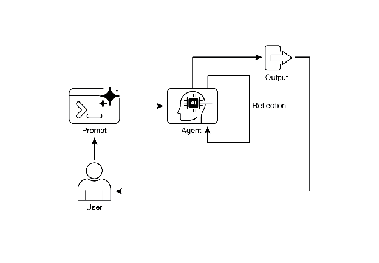
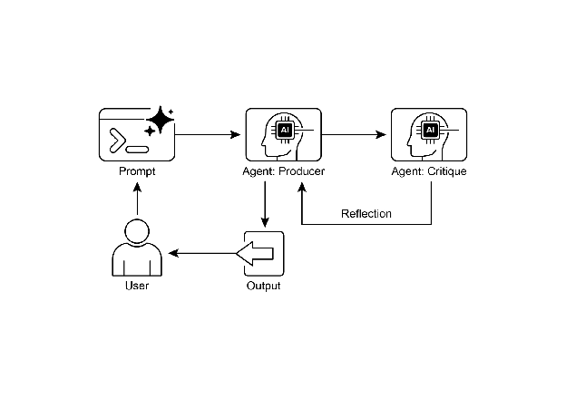

# Chapter 4: Reflection

# Reflection Pattern Overview

In the preceding chapters, we've explored fundamental agentic patterns: Chaining for sequential execution, Routing for dynamic path selection, and Parallelization for concurrent task execution. These patterns enable agents to perform complex tasks more efficiently and flexibly. However, even with sophisticated workflows, an agent's initial output or plan might not be optimal, accurate, or complete. This is where the **Reflection** pattern comes into play.

The Reflection pattern involves an agent evaluating its own work, output, or internal state and using that evaluation to improve its performance or refine its response. It's a form of self-correction or self-improvement, allowing the agent to iteratively refine its output or adjust its approach based on feedback, internal critique, or comparison against desired criteria. Reflection can occasionally be facilitated by a separate agent whose specific role is to analyze the output of an initial agent.

Unlike a simple sequential chain where output is passed directly to the next step, or routing which chooses a path, reflection introduces a feedback loop. The agent doesn't just produce an output; it then examines that output (or the process that generated it), identifies potential issues or areas for improvement, and uses those insights to generate a better version or modify its future actions.

The process typically involves:

1. **Execution:** The agent performs a task or generates an initial output.  
2. **Evaluation/Critique:** The agent (often using another LLM call or a set of rules) analyzes the result from the previous step. This evaluation might check for factual accuracy, coherence, style, completeness, adherence to instructions, or other relevant criteria.  
3. **Reflection/Refinement:** Based on the critique, the agent determines how to improve. This might involve generating a refined output, adjusting parameters for a subsequent step, or even modifying the overall plan.  
4. **Iteration (Optional but common):** The refined output or adjusted approach can then be executed, and the reflection process can repeat until a satisfactory result is achieved or a stopping condition is met.

A key and highly effective implementation of the Reflection pattern separates the process into two distinct logical roles: a Producer and a Critic. This is often called the "Generator-Critic" or "Producer-Reviewer" model. While a single agent can perform self-reflection, using two specialized agents (or two separate LLM calls with distinct system prompts) often yields more robust and unbiased results.

1\. The Producer Agent: This agent's primary responsibility is to perform the initial execution of the task. It focuses entirely on generating the content, whether it's writing code, drafting a blog post, or creating a plan. It takes the initial prompt and produces the first version of the output.

2\. The Critic Agent: This agent's sole purpose is to evaluate the output generated by the Producer. It is given a different set of instructions, often a distinct persona (e.g., "You are a senior software engineer," "You are a meticulous fact-checker"). The Critic's instructions guide it to analyze the Producer's work against specific criteria, such as factual accuracy, code quality, stylistic requirements, or completeness. It is designed to find flaws, suggest improvements, and provide structured feedback.

This separation of concerns is powerful because it prevents the "cognitive bias" of an agent reviewing its own work. The Critic agent approaches the output with a fresh perspective, dedicated entirely to finding errors and areas for improvement. The feedback from the Critic is then passed back to the Producer agent, which uses it as a guide to generate a new, refined version of the output. The provided LangChain and ADK code examples both implement this two-agent model: the LangChain example uses a specific "reflector\_prompt" to create a critic persona, while the ADK example explicitly defines a producer and a reviewer agent.

Implementing reflection often requires structuring the agent's workflow to include these feedback loops. This can be achieved through iterative loops in code, or using frameworks that support state management and conditional transitions based on evaluation results. While a single step of evaluation and refinement can be implemented within either a LangChain/LangGraph, or ADK, or Crew.AI chain, true iterative reflection typically involves more complex orchestration.

The Reflection pattern is crucial for building agents that can produce high-quality outputs, handle nuanced tasks, and exhibit a degree of self-awareness and adaptability. It moves agents beyond simply executing instructions towards a more sophisticated form of problem-solving and content generation.

The intersection of reflection with goal setting and monitoring (see Chapter 11\) is worth noticing. A goal provides the ultimate benchmark for the agent's self-evaluation, while monitoring tracks its progress. In a number of practical cases, Reflection then might act as the corrective engine, using monitored feedback to analyze deviations and adjust its strategy. This synergy transforms the agent from a passive executor into a purposeful system that adaptively works to achieve its objectives. 

Furthermore, the effectiveness of the Reflection pattern is significantly enhanced when the LLM keeps a memory of the conversation (see Chapter 8). This conversational history provides crucial context for the evaluation phase, allowing the agent to assess its output not just in isolation, but against the backdrop of previous interactions, user feedback, and evolving goals. It enables the agent to learn from past critiques and avoid repeating errors. Without memory, each reflection is a self-contained event; with memory, reflection becomes a cumulative process where each cycle builds upon the last, leading to more intelligent and context-aware refinement.

# Practical Applications & Use Cases

The Reflection pattern is valuable in scenarios where output quality, accuracy, or adherence to complex constraints is critical:

1\. Creative Writing and Content Generation:  
Refining generated text, stories, poems, or marketing copy.

* **Use Case:** An agent writing a blog post.  
  * **Reflection:** Generate a draft, critique it for flow, tone, and clarity, then rewrite based on the critique. Repeat until the post meets quality standards.  
  * **Benefit:** Produces more polished and effective content.

2\. Code Generation and Debugging:  
Writing code, identifying errors, and fixing them.

* **Use Case:** An agent writing a Python function.  
  * **Reflection:** Write initial code, run tests or static analysis, identify errors or inefficiencies, then modify the code based on the findings.  
  * **Benefit:** Generates more robust and functional code.

3\. Complex Problem Solving:  
Evaluating intermediate steps or proposed solutions in multi-step reasoning tasks.

* **Use Case:** An agent solving a logic puzzle.  
  * **Reflection:** Propose a step, evaluate if it leads closer to the solution or introduces contradictions, backtrack or choose a different step if needed.  
  * **Benefit:** Improves the agent's ability to navigate complex problem spaces.

4\. Summarization and Information Synthesis:  
Refining summaries for accuracy, completeness, and conciseness.

* **Use Case:** An agent summarizing a long document.  
  * **Reflection:** Generate an initial summary, compare it against key points in the original document, refine the summary to include missing information or improve accuracy.  
  * **Benefit:** Creates more accurate and comprehensive summaries.

5\. Planning and Strategy:  
Evaluating a proposed plan and identifying potential flaws or improvements.

* **Use Case:** An agent planning a series of actions to achieve a goal.  
  * **Reflection:** Generate a plan, simulate its execution or evaluate its feasibility against constraints, revise the plan based on the evaluation.  
  * **Benefit:** Develops more effective and realistic plans.

6\. Conversational Agents:  
Reviewing previous turns in a conversation to maintain context, correct misunderstandings, or improve response quality.

* **Use Case:** A customer support chatbot.  
  * **Reflection:** After a user response, review the conversation history and the last generated message to ensure coherence and address the user's latest input accurately.  
  * **Benefit:** Leads to more natural and effective conversations.

Reflection adds a layer of meta-cognition to agentic systems, enabling them to learn from their own outputs and processes, leading to more intelligent, reliable, and high-quality results.

# Hands-On Code Example (LangChain)

The implementation of a complete, iterative reflection process necessitates mechanisms for state management and cyclical execution. While these are handled natively in graph-based frameworks like LangGraph or through custom procedural code, the fundamental principle of a single reflection cycle can be demonstrated effectively using the compositional syntax of LCEL (LangChain Expression Language).

This example implements a reflection loop using the Langchain library and OpenAI's GPT-4o model to iteratively generate and refine a Python function that calculates the factorial of a number. The process starts with a task prompt, generates initial code, and then repeatedly reflects on the code based on critiques from a simulated senior software engineer role, refining the code in each iteration until the critique stage determines the code is perfect or a maximum number of iterations is reached. Finally, it prints the resulting refined code.

First, ensure you have the necessary libraries installed:

```bash
pip install langchain langchain-community langchain-openai
```

You will also need to set up your environment with your API key for the language model you choose (e.g., OpenAI, Google Gemini, Anthropic).

```python
import os
from dotenv import load_dotenv
from langchain_openai import ChatOpenAI
from langchain_core.prompts import ChatPromptTemplate
from langchain_core.messages import SystemMessage, HumanMessage

# --- Configuration ---
# Load environment variables from .env file (for OPENAI_API_KEY)
load_dotenv()

# Check if the API key is set
if not os.getenv("OPENAI_API_KEY"):
    raise ValueError("OPENAI_API_KEY not found in .env file. Please add it.")

# Initialize the Chat LLM. We use gpt-4o for better reasoning.
# A lower temperature is used for more deterministic outputs.
llm = ChatOpenAI(model="gpt-4o", temperature=0.1)

def run_reflection_loop():
    """
    Demonstrates a multi-step AI reflection loop to progressively improve a Python function.
    """
    # --- The Core Task ---
    task_prompt = """
    Your task is to create a Python function named `calculate_factorial`.
    This function should do the following:
    1.  Accept a single integer `n` as input.
    2.  Calculate its factorial (n!).
    3.  Include a clear docstring explaining what the function does.
    4.  Handle edge cases: The factorial of 0 is 1.
    5.  Handle invalid input: Raise a ValueError if the input is a negative number.
    """

    # --- The Reflection Loop ---
    max_iterations = 3
    current_code = ""

    # We will build a conversation history to provide context in each step.
    message_history = [HumanMessage(content=task_prompt)]

    for i in range(max_iterations):
        print("\n" + "="*25 + f" REFLECTION LOOP: ITERATION {i + 1} " + "="*25)

        # --- 1. GENERATE / REFINE STAGE ---
        # In the first iteration, it generates. In subsequent iterations, it refines.
        if i == 0:
            print("\n>>> STAGE 1: GENERATING initial code...")
            # The first message is just the task prompt.
            response = llm.invoke(message_history)
            current_code = response.content
        else:
            print("\n>>> STAGE 1: REFINING code based on previous critique...")
            # The message history now contains the task,
            # the last code, and the last critique.
            # We instruct the model to apply the critiques.
            message_history.append(HumanMessage(content="Please refine the code using the critiques provided."))
            response = llm.invoke(message_history)
            current_code = response.content

        print("\n--- Generated Code (v" + str(i + 1) + ") ---\n" + current_code)
        message_history.append(response) # Add the generated code to history

        # --- 2. REFLECT STAGE ---
        print("\n>>> STAGE 2: REFLECTING on the generated code...")
        # Create a specific prompt for the reflector agent.
        # This asks the model to act as a senior code reviewer.
        reflector_prompt = [
            SystemMessage(content="""
                You are a senior software engineer and an expert in Python.
                Your role is to perform a meticulous code review.
                Critically evaluate the provided Python code based on the original task requirements.
                Look for bugs, style issues, missing edge cases, and areas for improvement.
                If the code is perfect and meets all requirements,
                respond with the single phrase 'CODE_IS_PERFECT'.
                Otherwise, provide a bulleted list of your critiques.
            """),
            HumanMessage(content=f"Original Task:\n{task_prompt}\n\nCode to Review:\n{current_code}")
        ]
        critique_response = llm.invoke(reflector_prompt)
        critique = critique_response.content

        # --- 3. STOPPING CONDITION ---
        if "CODE_IS_PERFECT" in critique:
            print("\n--- Critique ---\nNo further critiques found. The code is satisfactory.")
            break
        print("\n--- Critique ---\n" + critique)

        # Add the critique to the history for the next refinement loop.
        message_history.append(HumanMessage(content=f"Critique of the previous code:\n{critique}"))

    print("\n" + "="*30 + " FINAL RESULT " + "="*30)
    print("\nFinal refined code after the reflection process:\n")
    print(current_code)

if __name__ == "__main__":
    run_reflection_loop()
```

The code  begins by setting up the environment, loading API keys, and initializing a powerful language model like GPT-4o with a low temperature for focused outputs. The core task is defined by a prompt asking for a Python function to calculate the factorial of a number, including specific requirements for docstrings, edge cases (factorial of 0), and error handling for negative input. The run\_reflection\_loop function orchestrates the iterative refinement process. Within the loop, in the first iteration, the language model generates initial code based on the task prompt. In subsequent iterations, it refines the code based on critiques from the previous step. A separate "reflector" role, also played by the language model but with a different system prompt, acts as a senior software engineer to critique the generated code against the original task requirements. This critique is provided as a bulleted list of issues or the phrase 'CODE\_IS\_PERFECT' if no issues are found. The loop continues until the critique indicates the code is perfect or a maximum number of iterations is reached. The conversation history is maintained and passed to the language model in each step to provide context for both generation/refinement and reflection stages. Finally, the script prints the last generated code version after the loop concludes.

# Hands-On Code Example (ADK)

Let's now look at a conceptual code example implemented using the Google ADK.  Specifically, the code showcases this by employing a Generator-Critic structure, where one component (the Generator) produces an initial result or plan, and another component (the Critic) provides critical feedback or a critique, guiding the Generator towards a more refined or accurate final output.

```python
from google.adk.agents import SequentialAgent, LlmAgent

# The first agent generates the initial draft.
generator = LlmAgent(
   name="DraftWriter",
   description="Generates initial draft content on a given subject.",
   instruction="Write a short, informative paragraph about the user's subject.",
   output_key="draft_text" # The output is saved to this state key.
)

# The second agent critiques the draft from the first agent.
reviewer = LlmAgent(
   name="FactChecker",
   description="Reviews a given text for factual accuracy and provides a structured critique.",
   instruction="""
   You are a meticulous fact-checker.
   1. Read the text provided in the state key 'draft_text'.
   2. Carefully verify the factual accuracy of all claims.
   3. Your final output must be a dictionary containing two keys:
      - "status": A string, either "ACCURATE" or "INACCURATE".
      - "reasoning": A string providing a clear explanation for your status, citing specific issues if any are found.
   """,
   output_key="review_output" # The structured dictionary is saved here.
)

# The SequentialAgent ensures the generator runs before the reviewer.
review_pipeline = SequentialAgent(
   name="WriteAndReview_Pipeline",
   sub_agents=[generator, reviewer]
)

# Execution Flow:
# 1. generator runs -> saves its paragraph to state['draft_text'].
# 2. reviewer runs -> reads state['draft_text'] and saves its dictionary output to state['review_output'].
```

This code demonstrates the use of a sequential agent pipeline in Google ADK  for generating and reviewing text. It defines two LlmAgent instances: generator and reviewer. The generator agent is designed to create an initial draft paragraph on a given subject. It is instructed to write a short and informative piece and saves its output to the state key draft\_text. The reviewer agent acts as a fact-checker for the text produced by the generator. It is instructed to read the text from draft\_text and verify its factual accuracy. The reviewer's output is a structured dictionary with two keys: status and reasoning. status indicates if the text is "ACCURATE" or "INACCURATE", while reasoning provides an explanation for the status. This dictionary is saved to the state key review\_output. A SequentialAgent named review\_pipeline is created to manage the execution order of the two agents. It ensures that the generator runs first, followed by the reviewer. The overall execution flow is that the generator produces text, which is then saved to the state. Subsequently, the reviewer reads this text from the state, performs its fact-checking, and saves its findings (the status and reasoning) back to the state. This pipeline allows for a structured process of content creation and review using separate agents.**Note:** An alternative implementation utilizing ADK's LoopAgent is also available for those interested.

Before concluding, it's important to consider that while the Reflection pattern significantly enhances output quality, it comes with important trade-offs. The iterative process, though powerful, can lead to higher costs and latency, since every refinement loop may require a new LLM call, making it suboptimal for time-sensitive applications. Furthermore, the pattern is memory-intensive; with each iteration, the conversational history expands, including the initial output, critique, and subsequent refinements.

# At Glance

**What:** An agent's initial output is often suboptimal, suffering from inaccuracies, incompleteness, or a failure to meet complex requirements. Basic agentic workflows lack a built-in process for the agent to recognize and fix its own errors. This is solved by having the agent evaluate its own work or, more robustly, by introducing a separate logical agent to act as a critic, preventing the initial response from being the final one regardless of quality.

**Why:** The Reflection pattern offers a solution by introducing a mechanism for self-correction and refinement. It establishes a feedback loop where a "producer" agent generates an output, and then a "critic" agent (or the producer itself) evaluates it against predefined criteria. This critique is then used to generate an improved version. This iterative process of generation, evaluation, and refinement progressively enhances the quality of the final result, leading to more accurate, coherent, and reliable outcomes.

**Rule of thumb:** Use the Reflection pattern when the quality, accuracy, and detail of the final output are more important than speed and cost. It is particularly effective for tasks like generating polished long-form content, writing and debugging code, and creating detailed plans. Employ a separate critic agent when tasks require high objectivity or specialized evaluation that a generalist producer agent might miss.

**Visual summary**



Fig. 1: Reflection design pattern, self-reflection



Fig.2: Reflection design pattern, producer and critique agent

# Key Takeaways

* The primary advantage of the Reflection pattern is its ability to iteratively self-correct and refine outputs, leading to significantly higher quality, accuracy, and adherence to complex instructions.  
* It involves a feedback loop of execution, evaluation/critique, and refinement. Reflection is essential for tasks requiring high-quality, accurate, or nuanced outputs.  
* A powerful implementation is the Producer-Critic model, where a separate agent (or prompted role) evaluates the initial output. This separation of concerns enhances objectivity and allows for more specialized, structured feedback.  
* However, these benefits come at the cost of increased latency and computational expense, along with a higher risk of exceeding the model's context window or being throttled by API services.  
* While full iterative reflection often requires stateful workflows (like LangGraph), a single reflection step can be implemented in LangChain using LCEL to pass output for critique and subsequent refinement.  
* Google ADK can facilitate reflection through sequential workflows where one agent's output is critiqued by another agent, allowing for subsequent refinement steps.  
* This pattern enables agents to perform self-correction and enhance their performance over time.

# Conclusion

The reflection pattern provides a crucial mechanism for self-correction within an agent's workflow, enabling iterative improvement beyond a single-pass execution. This is achieved by creating a loop where the system generates an output, evaluates it against specific criteria, and then uses that evaluation to produce a refined result. This evaluation can be performed by the agent itself (self-reflection) or, often more effectively, by a distinct critic agent, which represents a key architectural choice within the pattern. 

While a fully autonomous, multi-step reflection process requires a robust architecture for state management, its core principle is effectively demonstrated in a single generate-critique-refine cycle. As a control structure, reflection can be integrated with other foundational patterns to construct more robust and functionally complex agentic systems.

# References

Here are some resources for further reading on the Reflection pattern and related concepts:

1. Training Language Models to Self-Correct via Reinforcement Learning, [https://arxiv.org/abs/2409.12917](https://arxiv.org/abs/2409.12917)   
2. LangChain Expression Language (LCEL) Documentation: [https://python.langchain.com/docs/introduction/](https://python.langchain.com/docs/introduction/)   
3. LangGraph Documentation:[https://www.langchain.com/langgraph](https://www.langchain.com/langgraph)   
4. Google Agent Developer Kit (ADK) Documentation (Multi-Agent Systems): [https://google.github.io/adk-docs/agents/multi-agents/](https://google.github.io/adk-docs/agents/multi-agents/)


