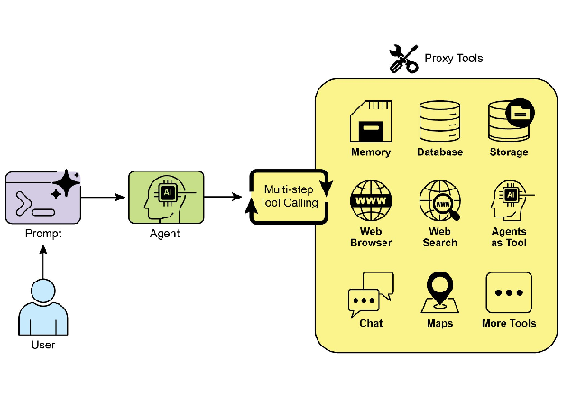
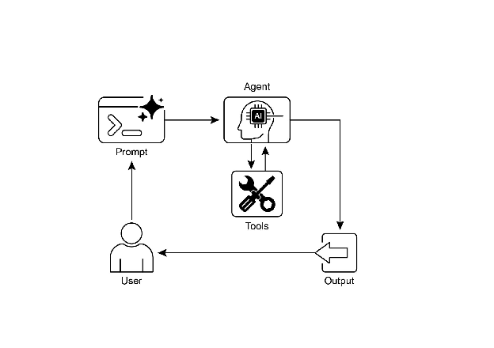

# Chapter 5: Tool Use (Function Calling)

# Tool Use Pattern 개요

지금까지 주로 언어 모델 간의 상호작용을 조율하고 Agent 내부 워크플로우 내에서 정보 흐름을 관리하는 agentic pattern들(Chaining, Routing, Parallelization, Reflection)을 다뤘음. 하지만 Agent가 진정으로 유용하고 실제 세계나 외부 시스템과 상호작용하려면 Tool을 사용할 수 있는 능력이 필요함.

Tool Use pattern은 흔히 Function Calling이라는 메커니즘을 통해 구현되며, Agent가 외부 API, 데이터베이스, 서비스와 상호작용하거나 코드를 실행할 수 있게 함. 이를 통해 Agent 핵심에 있는 LLM이 사용자 요청이나 작업의 현재 상태를 기반으로 특정 외부 함수를 언제 어떻게 사용할지 결정할 수 있음.

프로세스는 일반적으로 다음을 포함함:

1. **Tool 정의:** 외부 함수나 기능을 LLM에 정의하고 설명함. 이 설명에는 함수의 목적, 이름, 허용하는 파라미터와 그 타입 및 설명이 포함됨.
2. **LLM 결정:** LLM은 사용자 요청과 사용 가능한 tool 정의를 받음. 요청과 tool에 대한 이해를 바탕으로 LLM은 요청을 충족하기 위해 하나 이상의 tool 호출이 필요한지 결정함.
3. **Function Call 생성:** LLM이 tool을 사용하기로 결정하면, 호출할 tool의 이름과 사용자 요청에서 추출한 전달할 인자(파라미터)를 명시하는 구조화된 출력(주로 JSON 객체)을 생성함.
4. **Tool 실행:** Agentic framework 또는 orchestration layer가 이 구조화된 출력을 가로채서 요청된 tool을 식별하고 제공된 인자로 실제 외부 함수를 실행함.
5. **관찰/결과:** Tool 실행의 출력 또는 결과가 Agent에게 반환됨.
6. **LLM 처리 (선택적이지만 일반적):** LLM은 tool의 출력을 컨텍스트로 받아 사용자에게 최종 응답을 구성하거나 워크플로우의 다음 단계를 결정함(다른 tool 호출, reflection, 또는 최종 답변 제공 포함 가능).

이 pattern은 LLM의 학습 데이터 제약을 깨고 최신 정보 접근, 내부적으로 불가능한 계산 수행, 사용자별 데이터와의 상호작용, 또는 실제 세계의 행동 트리거를 가능하게 하므로 근본적임. Function calling은 LLM의 추론 능력과 외부에서 사용 가능한 광범위한 기능 간의 간극을 메우는 기술적 메커니즘임.

"function calling"이 특정 사전 정의된 코드 함수 호출을 적절히 설명하긴 하지만, 더 확장적인 "tool calling" 개념을 고려하는 것이 유용함. 이 넓은 용어는 Agent의 능력이 단순 함수 실행을 훨씬 넘어설 수 있음을 인정함. "tool"은 전통적인 함수일 수도 있지만, 복잡한 API endpoint, 데이터베이스 요청, 또는 다른 특화된 Agent에 대한 지시일 수도 있음. 이러한 관점은 예를 들어 주 Agent가 복잡한 데이터 분석 작업을 전담 "analyst agent"에게 위임하거나 외부 지식 베이스를 API를 통해 쿼리하는 등 더 정교한 시스템을 구상할 수 있게 함. "tool calling"로 사고하면 Agent가 다양한 디지털 리소스와 다른 지능적 개체의 생태계에서 orchestrator로 작동할 수 있는 전체 잠재력을 더 잘 포착함.

LangChain, LangGraph, Google Agent Developer Kit (ADK) 같은 framework들은 tool 정의와 Agent 워크플로우로의 통합을 위한 견고한 지원을 제공하며, 종종 Gemini나 OpenAI 시리즈 같은 최신 LLM의 네이티브 function calling 능력을 활용함. 이러한 framework의 "canvas"에서 tool을 정의한 후 Agent(일반적으로 LLM Agent)가 이러한 tool을 인식하고 사용할 수 있도록 구성함.

Tool Use는 강력하고 상호작용적이며 외부 인식 Agent를 구축하기 위한 핵심 pattern임.

# 실용적 응용 및 사용 사례

Tool Use pattern은 Agent가 텍스트 생성을 넘어 행동을 수행하거나 특정 동적 정보를 검색해야 하는 거의 모든 시나리오에 적용 가능함:

1\. 외부 소스로부터 정보 검색:
LLM의 학습 데이터에 없는 실시간 데이터나 정보에 접근.

* **사용 사례:** 날씨 Agent.
  * **Tool:** 위치를 받아 현재 날씨 조건을 반환하는 날씨 API.
  * **Agent 흐름:** 사용자가 "런던 날씨는?" 질문, LLM이 날씨 tool 필요성 식별, "London"으로 tool 호출, tool이 데이터 반환, LLM이 데이터를 사용자 친화적 응답으로 포맷팅.

2\. 데이터베이스 및 API와의 상호작용:
구조화된 데이터에 대한 쿼리, 업데이트 또는 기타 작업 수행.

* **사용 사례:** 전자상거래 Agent.
  * **Tools:** 제품 재고 확인, 주문 상태 조회, 결제 처리를 위한 API 호출.
  * **Agent 흐름:** 사용자가 "제품 X 재고 있나요?" 질문, LLM이 재고 API 호출, tool이 재고 수량 반환, LLM이 사용자에게 재고 상태 알림.

3\. 계산 및 데이터 분석 수행:
외부 계산기, 데이터 분석 라이브러리 또는 통계 tool 사용.

* **사용 사례:** 금융 Agent.
  * **Tools:** 계산기 함수, 주식 시장 데이터 API, 스프레드시트 tool.
  * **Agent 흐름:** 사용자가 "AAPL의 현재 가격은? $150에 100주 매수 시 잠재적 이익 계산해줘" 질문, LLM이 주식 API 호출, 현재 가격 획득, 계산기 tool 호출, 결과 획득, 응답 포맷팅.

4\. 통신 전송:
이메일, 메시지 전송 또는 외부 통신 서비스에 API 호출.

* **사용 사례:** 개인 비서 Agent.
  * **Tool:** 이메일 전송 API.
  * **Agent 흐름:** 사용자가 "내일 회의에 대해 John에게 이메일 보내줘" 지시, LLM이 요청에서 추출한 수신자, 제목, 본문으로 이메일 tool 호출.

5\. 코드 실행:
안전한 환경에서 코드 스니펫을 실행하여 특정 작업 수행.

* **사용 사례:** 코딩 보조 Agent.
  * **Tool:** 코드 인터프리터.
  * **Agent 흐름:** 사용자가 Python 스니펫을 제공하며 "이 코드가 뭐하는 거야?" 질문, LLM이 인터프리터 tool을 사용해 코드 실행 및 출력 분석.

6\. 다른 시스템 또는 장치 제어:
스마트홈 장치, IoT 플랫폼 또는 기타 연결된 시스템과 상호작용.

* **사용 사례:** 스마트홈 Agent.
  * **Tool:** 스마트 조명 제어 API.
  * **Agent 흐름:** 사용자가 "거실 불 꺼줘" 지시. LLM이 명령과 대상 장치로 스마트홈 tool 호출.

Tool Use는 언어 모델을 텍스트 생성기에서 디지털 또는 물리적 세계에서 감지하고 추론하며 행동할 수 있는 Agent로 변환하는 요소임 (Fig. 1 참조)



Fig.1: Agent가 Tools를 사용하는 몇 가지 예시

# 실습 코드 예제 (LangChain)

LangChain framework 내 tool use 구현은 2단계 프로세스임. 초기에 하나 이상의 tool을 정의하며, 일반적으로 기존 Python 함수나 다른 실행 가능한 컴포넌트를 캡슐화함. 이후 이러한 tool을 언어 모델에 바인딩하여, 모델이 사용자 쿼리를 충족하기 위해 외부 함수 호출이 필요하다고 판단할 때 구조화된 tool 사용 요청을 생성할 수 있는 능력을 부여함.

다음 구현은 먼저 정보 검색 tool을 시뮬레이션하는 간단한 함수를 정의하여 이 원리를 보여줌. 이후 Agent를 구축하고 사용자 입력에 응답하여 이 tool을 활용하도록 구성함. 이 예제의 실행은 핵심 LangChain 라이브러리와 모델별 provider 패키지 설치가 필요함. 또한 선택한 언어 모델 서비스와의 적절한 인증(일반적으로 로컬 환경에 구성된 API 키를 통해)이 필수 전제 조건임.

```python
import os, getpass
import asyncio
import nest_asyncio
from typing import List
from dotenv import load_dotenv
import logging
from langchain_google_genai import ChatGoogleGenerativeAI
from langchain_core.prompts import ChatPromptTemplate
from langchain_core.tools import tool as langchain_tool
from langchain.agents import create_tool_calling_agent, AgentExecutor

# UNCOMMENT
# Prompt the user securely and set API keys as an environment variables
os.environ["GOOGLE_API_KEY"] = getpass.getpass("Enter your Google API key: ")
os.environ["OPENAI_API_KEY"] = getpass.getpass("Enter your OpenAI API key: ")

try:
    # A model with function/tool calling capabilities is required.
    llm = ChatGoogleGenerativeAI(model="gemini-2.0-flash", temperature=0)
    print(f"✅ Language model initialized: {llm.model}")
except Exception as e:
    print(f"🛑 Error initializing language model: {e}")
    llm = None

# --- Define a Tool ---
@langchain_tool
def search_information(query: str) -> str:
    """
    Provides factual information on a given topic. Use this tool to find answers to phrases
    like 'capital of France' or 'weather in London?'.
    """
    print(f"\n--- 🛠️ Tool Called: search_information with query: '{query}' ---")
    # Simulate a search tool with a dictionary of predefined results.
    simulated_results = {
        "weather in london": "The weather in London is currently cloudy with a temperature of 15°C.",
        "capital of france": "The capital of France is Paris.",
        "population of earth": "The estimated population of Earth is around 8 billion people.",
        "tallest mountain": "Mount Everest is the tallest mountain above sea level.",
        "default": f"Simulated search result for '{query}': No specific information found, but the topic seems interesting."
    }
    result = simulated_results.get(query.lower(), simulated_results["default"])
    print(f"--- TOOL RESULT: {result} ---")
    return result

tools = [search_information]

# --- Create a Tool-Calling Agent ---
if llm:
    # This prompt template requires an `agent_scratchpad` placeholder for the agent's internal steps.
    agent_prompt = ChatPromptTemplate.from_messages([
        ("system", "You are a helpful assistant."),
        ("human", "{input}"),
        ("placeholder", "{agent_scratchpad}"),
    ])
    # Create the agent, binding the LLM, tools, and prompt together.
    agent = create_tool_calling_agent(llm, tools, agent_prompt)
    # AgentExecutor is the runtime that invokes the agent and executes the chosen tools.
    # The 'tools' argument is not needed here as they are already bound to the agent.
    agent_executor = AgentExecutor(agent=agent, verbose=True, tools=tools)

async def run_agent_with_tool(query: str):
    """Invokes the agent executor with a query and prints the final response."""
    print(f"\n--- 🏃 Running Agent with Query: '{query}' ---")
    try:
        response = await agent_executor.ainvoke({"input": query})
        print("\n--- ✅ Final Agent Response ---")
        print(response["output"])
    except Exception as e:
        print(f"\n🛑 An error occurred during agent execution: {e}")

async def main():
    """Runs all agent queries concurrently."""
    tasks = [
        run_agent_with_tool("What is the capital of France?"),
        run_agent_with_tool("What's the weather like in London?"),
        run_agent_with_tool("Tell me something about dogs.") # Should trigger the default tool response
    ]
    await asyncio.gather(*tasks)

nest_asyncio.apply()
asyncio.run(main())
```

코드는 LangChain 라이브러리와 Google Gemini 모델을 사용해 tool-calling Agent를 설정함. 특정 쿼리에 대한 사실적 답변 제공을 시뮬레이션하는 search_information tool을 정의함. Tool은 "weather in london," "capital of france," "population of earth"에 대한 사전 정의된 응답과 기타 쿼리에 대한 기본 응답을 가짐. Tool calling 능력이 있는 ChatGoogleGenerativeAI 모델을 초기화함. Agent의 상호작용을 안내하기 위한 ChatPromptTemplate을 생성함. create_tool_calling_agent 함수를 사용해 언어 모델, tools, prompt를 Agent로 결합함. 그 다음 AgentExecutor를 설정하여 Agent 실행과 tool 호출을 관리함. run_agent_with_tool 비동기 함수는 주어진 쿼리로 Agent를 호출하고 결과를 출력하도록 정의됨. main 비동기 함수는 여러 쿼리를 동시에 실행하도록 준비함. 이 쿼리들은 search_information tool의 특정 응답과 기본 응답을 모두 테스트하도록 설계됨. 마지막으로 asyncio.run(main()) 호출이 모든 Agent 작업을 실행함. 코드는 Agent 설정 및 실행을 진행하기 전 성공적인 LLM 초기화를 위한 체크를 포함함.

# 실습 코드 예제 (CrewAI)

이 코드는 CrewAI framework 내에서 function calling(Tools)을 구현하는 방법의 실용적 예제를 제공함. 정보 조회 tool을 갖춘 Agent가 설정되는 간단한 시나리오를 구성함. 예제는 특히 이 Agent와 tool을 사용해 시뮬레이션된 주식 가격을 가져오는 것을 보여줌.

```python
# pip install crewai langchain-openai
import os
from crewai import Agent, Task, Crew
from crewai.tools import tool
import logging

# --- Best Practice: Configure Logging ---
# A basic logging setup helps in debugging and tracking the crew's execution.
logging.basicConfig(level=logging.INFO, format='%(asctime)s - %(levelname)s - %(message)s')

# --- Set up your API Key ---
# For production, it's recommended to use a more secure method for key management
# like environment variables loaded at runtime or a secret manager.
#
# Set the environment variable for your chosen LLM provider (e.g., OPENAI_API_KEY)
# os.environ["OPENAI_API_KEY"] = "YOUR_API_KEY"
# os.environ["OPENAI_MODEL_NAME"] = "gpt-4o"

# --- 1. Refactored Tool: Returns Clean Data ---
# The tool now returns raw data (a float) or raises a standard Python error.
# This makes it more reusable and forces the agent to handle outcomes properly.
@tool("Stock Price Lookup Tool")
def get_stock_price(ticker: str) -> float:
    """
    Fetches the latest simulated stock price for a given stock ticker symbol.
    Returns the price as a float. Raises a ValueError if the ticker is not found.
    """
    logging.info(f"Tool Call: get_stock_price for ticker '{ticker}'")
    simulated_prices = {
        "AAPL": 178.15,
        "GOOGL": 1750.30,
        "MSFT": 425.50,
    }
    price = simulated_prices.get(ticker.upper())
    if price is not None:
        return price
    else:
        # Raising a specific error is better than returning a string.
        # The agent is equipped to handle exceptions and can decide on the next action.
        raise ValueError(f"Simulated price for ticker '{ticker.upper()}' not found.")

# --- 2. Define the Agent ---
# The agent definition remains the same, but it will now leverage the improved tool.
financial_analyst_agent = Agent(
    role='Senior Financial Analyst',
    goal='Analyze stock data using provided tools and report key prices.',
    backstory="You are an experienced financial analyst adept at using data sources to find stock information. You provide clear, direct answers.",
    verbose=True,
    tools=[get_stock_price],
    # Allowing delegation can be useful, but is not necessary for this simple task.
    allow_delegation=False,
)

# --- 3. Refined Task: Clearer Instructions and Error Handling ---
# The task description is more specific and guides the agent on how to react
# to both successful data retrieval and potential errors.
analyze_aapl_task = Task(
    description=(
        "What is the current simulated stock price for Apple (ticker: AAPL)? "
        "Use the 'Stock Price Lookup Tool' to find it. "
        "If the ticker is not found, you must report that you were unable to retrieve the price."
    ),
    expected_output=(
        "A single, clear sentence stating the simulated stock price for AAPL. "
        "For example: 'The simulated stock price for AAPL is $178.15.' "
        "If the price cannot be found, state that clearly."
    ),
    agent=financial_analyst_agent,
)

# --- 4. Formulate the Crew ---
# The crew orchestrates how the agent and task work together.
financial_crew = Crew(
    agents=[financial_analyst_agent],
    tasks=[analyze_aapl_task],
    verbose=True # Set to False for less detailed logs in production
)

# --- 5. Run the Crew within a Main Execution Block ---
# Using a __name__ == "__main__": block is a standard Python best practice.
def main():
    """Main function to run the crew."""
    # Check for API key before starting to avoid runtime errors.
    if not os.environ.get("OPENAI_API_KEY"):
        print("ERROR: The OPENAI_API_KEY environment variable is not set.")
        print("Please set it before running the script.")
        return

    print("\n## Starting the Financial Crew...")
    print("---------------------------------")

    # The kickoff method starts the execution.
    result = financial_crew.kickoff()
    print("\n---------------------------------")
    print("## Crew execution finished.")
    print("\nFinal Result:\n", result)

if __name__ == "__main__":
    main()
```

이 코드는 Crew.ai 라이브러리를 사용해 금융 분석 작업을 시뮬레이션하는 간단한 애플리케이션을 보여줌. 사전 정의된 ticker에 대한 주식 가격 조회를 시뮬레이션하는 커스텀 tool인 get_stock_price를 정의함. Tool은 유효한 ticker에 대해 부동소수점 숫자를 반환하거나 무효한 ticker에 대해 ValueError를 발생시키도록 설계됨. financial_analyst_agent라는 Crew.ai Agent를 Senior Financial Analyst 역할로 생성함. 이 Agent에게 상호작용할 get_stock_price tool을 제공함. Task인 analyze_aapl_task를 정의하여, 구체적으로 tool을 사용해 AAPL의 시뮬레이션된 주식 가격을 찾도록 Agent에 지시함. Task 설명에는 tool 사용 시 성공 및 실패 케이스를 모두 처리하는 방법에 대한 명확한 지침이 포함됨. financial_analyst_agent와 analyze_aapl_task로 구성된 Crew를 조립함. 실행 중 상세 로깅을 제공하기 위해 Agent와 Crew 모두에 verbose 설정을 활성화함. 스크립트의 main 부분은 표준 if __name__ == "__main__": 블록 내에서 kickoff() 메서드를 사용해 Crew의 작업을 실행함. Crew를 시작하기 전 Agent가 작동하는 데 필요한 OPENAI_API_KEY 환경 변수가 설정되어 있는지 확인함. Crew 실행 결과인 task의 출력을 콘솔에 출력함. 코드는 Crew의 행동과 tool 호출을 더 잘 추적하기 위한 기본 로깅 구성도 포함함. API 키 관리를 위해 환경 변수를 사용하지만, 프로덕션 환경에서는 더 안전한 방법을 권장한다고 명시함. 요약하면 핵심 로직은 Crew.ai에서 협업 워크플로우를 생성하기 위해 tools, agents, tasks를 정의하는 방법을 보여줌.

# 실습 코드 (Google ADK)

# Google Agent Developer Kit (ADK)는 Agent의 능력에 직접 통합할 수 있는 네이티브 통합 tool 라이브러리를 포함함.

# **Google search:** 이러한 컴포넌트의 주요 예시는 Google Search tool임. 이 tool은 Google Search 엔진에 대한 직접 인터페이스 역할을 하며, Agent에 웹 검색을 수행하고 외부 정보를 검색하는 기능을 제공함.

```python
from google.adk.agents import Agent
from google.adk.runners import Runner
from google.adk.sessions import InMemorySessionService
from google.adk.tools import google_search
from google.genai import types
import nest_asyncio
import asyncio

# Define variables required for Session setup and Agent execution
APP_NAME="Google Search_agent"
USER_ID="user1234"
SESSION_ID="1234"

# Define Agent with access to search tool
root_agent = ADKAgent(
  name="basic_search_agent",
  model="gemini-2.0-flash-exp",
  description="Agent to answer questions using Google Search.",
  instruction="I can answer your questions by searching the internet. Just ask me anything!",
  tools=[google_search] # Google Search is a pre-built tool to perform Google searches.
)

# Agent Interaction
async def call_agent(query):
  """
  Helper function to call the agent with a query.
  """
  # Session and Runner
  session_service = InMemorySessionService()
  session = await session_service.create_session(app_name=APP_NAME, user_id=USER_ID, session_id=SESSION_ID)
  runner = Runner(agent=root_agent, app_name=APP_NAME, session_service=session_service)

  content = types.Content(role='user', parts=[types.Part(text=query)])
  events = runner.run(user_id=USER_ID, session_id=SESSION_ID, new_message=content)

  for event in events:
      if event.is_final_response():
          final_response = event.content.parts[0].text
          print("Agent Response: ", final_response)

nest_asyncio.apply()
asyncio.run(call_agent("what's the latest ai news?"))
```

이 코드는 Python용 Google ADK를 사용해 기본 Agent를 생성하고 사용하는 방법을 보여줌. Agent는 Google Search를 tool로 활용하여 질문에 답변하도록 설계됨. 먼저 IPython, google.adk, google.genai에서 필요한 라이브러리를 import함. 애플리케이션 이름, 사용자 ID, 세션 ID에 대한 상수를 정의함. 설명과 지침으로 목적을 나타내는 "basic_search_agent"라는 Agent 인스턴스를 생성함. ADK에서 제공하는 사전 구축 tool인 Google Search tool을 사용하도록 구성됨. Agent에 대한 세션을 관리하기 위해 InMemorySessionService(Chapter 8 참조)를 초기화함. 지정된 애플리케이션, 사용자, 세션 ID에 대해 새 세션을 생성함. 생성된 Agent를 세션 서비스와 연결하는 Runner를 인스턴스화함. 이 runner는 세션 내에서 Agent의 상호작용 실행을 담당함. Agent에 쿼리를 보내고 응답을 처리하는 과정을 단순화하기 위해 call_agent helper 함수를 정의함. call_agent 내부에서 사용자의 쿼리는 'user' 역할을 가진 types.Content 객체로 포맷팅됨. runner.run 메서드가 사용자 ID, 세션 ID, 새 메시지 content와 함께 호출됨. runner.run 메서드는 Agent의 행동과 응답을 나타내는 이벤트 리스트를 반환함. 코드는 이러한 이벤트들을 반복하며 최종 응답을 찾음. 이벤트가 최종 응답으로 식별되면 해당 응답의 텍스트 content를 추출함. 추출된 Agent 응답을 콘솔에 출력함. 마지막으로 call_agent 함수를 "what's the latest ai news?" 쿼리로 호출하여 Agent를 실제로 보여줌.

**Code execution:** Google ADK는 동적 코드 실행을 위한 환경을 포함한 특화 작업용 통합 컴포넌트를 제공함. built_in_code_execution tool은 Agent에게 샌드박스 Python 인터프리터를 제공함. 이를 통해 모델이 코드를 작성하고 실행하여 계산 작업을 수행하고, 데이터 구조를 조작하며, 절차적 스크립트를 실행할 수 있음. 이러한 기능은 확률적 언어 생성 범위를 벗어나는 결정론적 로직과 정밀한 계산을 필요로 하는 문제를 해결하는 데 중요함.

```python
import os, getpass
import asyncio
import nest_asyncio
from typing import List
from dotenv import load_dotenv
import logging
from google.adk.agents import Agent as ADKAgent, LlmAgent
from google.adk.runners import Runner
from google.adk.sessions import InMemorySessionService
from google.adk.tools import google_search
from google.adk.code_executors import BuiltInCodeExecutor
from google.genai import types

# Define variables required for Session setup and Agent execution
APP_NAME="calculator"
USER_ID="user1234"
SESSION_ID="session_code_exec_async"

# Agent Definition
code_agent = LlmAgent(
    name="calculator_agent",
    model="gemini-2.0-flash",
    code_executor=BuiltInCodeExecutor(),
    instruction="""You are a calculator agent.
    When given a mathematical expression, write and execute Python code to calculate the result.
    Return only the final numerical result as plain text, without markdown or code blocks.
    """,
    description="Executes Python code to perform calculations.",
)

# Agent Interaction (Async)
async def call_agent_async(query):
    # Session and Runner
    session_service = InMemorySessionService()
    session = await session_service.create_session(app_name=APP_NAME, user_id=USER_ID, session_id=SESSION_ID)
    runner = Runner(agent=code_agent, app_name=APP_NAME, session_service=session_service)
    content = types.Content(role='user', parts=[types.Part(text=query)])
    print(f"\n--- Running Query: {query} ---")
    final_response_text = "No final text response captured."
    try:
        # Use run_async
        async for event in runner.run_async(user_id=USER_ID, session_id=SESSION_ID, new_message=content):
            print(f"Event ID: {event.id}, Author: {event.author}")
            # --- Check for specific parts FIRST ---
            # has_specific_part = False
            if event.content and event.content.parts and event.is_final_response():
                for part in event.content.parts: # Iterate through all parts
                    if part.executable_code:
                        # Access the actual code string via .code
                        print(f"  Debug: Agent generated code:\n```python\n{part.executable_code.code}\n```")
                        has_specific_part = True
                    elif part.code_execution_result:
                        # Access outcome and output correctly
                        print(f"  Debug: Code Execution Result: {part.code_execution_result.outcome} - Output:\n{part.code_execution_result.output}")
                        has_specific_part = True
                    # Also print any text parts found in any event for debugging
                    elif part.text and not part.text.isspace():
                        print(f"  Text: '{part.text.strip()}'")
                        # Do not set has_specific_part=True here, as we want the final response logic below
                # --- Check for final response AFTER specific parts ---
                text_parts = [part.text for part in event.content.parts if part.text]
                final_result = "".join(text_parts)
                print(f"==> Final Agent Response: {final_result}")
    except Exception as e:
        print(f"ERROR during agent run: {e}")
    print("-" * 30)

# Main async function to run the examples
async def main():
    await call_agent_async("Calculate the value of (5 + 7) * 3")
    await call_agent_async("What is 10 factorial?")

# Execute the main async function
try:
    nest_asyncio.apply()
    asyncio.run(main())
except RuntimeError as e:
    # Handle specific error when running asyncio.run in an already running loop (like Jupyter/Colab)
    if "cannot be called from a running event loop" in str(e):
        print("\nRunning in an existing event loop (like Colab/Jupyter).")
        print("Please run `await main()` in a notebook cell instead.")
        # If in an interactive environment like a notebook, you might need to run:
        # await main()
    else:
        raise e # Re-raise other runtime errors
```

이 스크립트는 Google의 Agent Development Kit (ADK)를 사용해 Python 코드를 작성하고 실행하여 수학 문제를 해결하는 Agent를 생성함. 계산기로 작동하도록 구체적으로 지시된 LlmAgent를 정의하며, built_in_code_execution tool을 갖추고 있음. 주요 로직은 사용자 쿼리를 Agent의 runner에 전송하고 결과 이벤트를 처리하는 call_agent_async 함수에 있음. 이 함수 내부에서 비동기 루프가 이벤트를 반복하며, 생성된 Python 코드와 그 실행 결과를 디버깅을 위해 출력함. 코드는 이러한 중간 단계와 수치 답변을 포함하는 최종 이벤트를 신중히 구분함. 마지막으로 main 함수가 두 개의 서로 다른 수학 표현식으로 Agent를 실행하여 계산 수행 능력을 보여줌.

**Enterprise search:** 이 코드는 Python에서 google.adk 라이브러리를 사용하는 Google ADK 애플리케이션을 정의함. 특히 지정된 Vertex AI Search datastore를 검색하여 질문에 답변하도록 설계된 VSearchAgent를 사용함. 코드는 "q2_strategy_vsearch_agent"라는 VSearchAgent를 초기화하며, 설명, 사용할 모델("gemini-2.0-flash-exp"), Vertex AI Search datastore의 ID를 제공함. DATASTORE_ID는 환경 변수로 설정되어야 함. 그 다음 대화 기록을 관리하기 위해 InMemorySessionService를 사용하여 Agent에 대한 Runner를 설정함. call_vsearch_agent_async라는 비동기 함수가 Agent와 상호작용하도록 정의됨. 이 함수는 쿼리를 받아 메시지 content 객체를 구성하고 runner의 run_async 메서드를 호출하여 쿼리를 Agent에 전송함. 그 다음 함수는 Agent의 응답이 도착하는 대로 콘솔에 스트리밍함. 또한 datastore에서 나온 소스 출처를 포함한 최종 응답에 대한 정보를 출력함. 잘못된 datastore ID나 누락된 권한 같은 잠재적 이슈에 대해 정보성 메시지를 제공하는 오류 처리가 포함됨. 예시 쿼리로 Agent를 호출하는 방법을 보여주기 위해 run_vsearch_example이라는 다른 비동기 함수가 제공됨. main 실행 블록은 DATASTORE_ID가 설정되었는지 확인한 후 asyncio.run을 사용해 예시를 실행함. Jupyter notebook 같이 이미 실행 중인 이벤트 루프가 있는 환경에서 코드가 실행되는 경우를 처리하기 위한 체크를 포함함.

```python
import asyncio
from google.genai import types
from google.adk import agents
from google.adk.runners import Runner
from google.adk.sessions import InMemorySessionService
import os

# --- Configuration ---
# Ensure you have set your GOOGLE_API_KEY and DATASTORE_ID environment variables
# For example:
# os.environ["GOOGLE_API_KEY"] = "YOUR_API_KEY"
# os.environ["DATASTORE_ID"] = "YOUR_DATASTORE_ID"

DATASTORE_ID = os.environ.get("DATASTORE_ID")

# --- Application Constants ---
APP_NAME = "vsearch_app"
USER_ID = "user_123"  # Example User ID
SESSION_ID = "session_456" # Example Session ID

# --- Agent Definition (Updated with the newer model from the guide) ---
vsearch_agent = agents.VSearchAgent(
    name="q2_strategy_vsearch_agent",
    description="Answers questions about Q2 strategy documents using Vertex AI Search.",
    model="gemini-2.0-flash-exp", # Updated model based on the guide's examples
    datastore_id=DATASTORE_ID,
    model_parameters={"temperature": 0.0}
)

# --- Runner and Session Initialization ---
runner = Runner(
    agent=vsearch_agent,
    app_name=APP_NAME,
    session_service=InMemorySessionService(),
)

# --- Agent Invocation Logic ---
async def call_vsearch_agent_async(query: str):
    """Initializes a session and streams the agent's response."""
    print(f"User: {query}")
    print("Agent: ", end="", flush=True)
    try:
        # Construct the message content correctly
        content = types.Content(role='user', parts=[types.Part(text=query)])
        # Process events as they arrive from the asynchronous runner
        async for event in runner.run_async(
            user_id=USER_ID,
            session_id=SESSION_ID,
            new_message=content
        ):
            # For token-by-token streaming of the response text
            if hasattr(event, 'content_part_delta') and event.content_part_delta:
                print(event.content_part_delta.text, end="", flush=True)
            # Process the final response and its associated metadata
            if event.is_final_response():
                print() # Newline after the streaming response
                if event.grounding_metadata:
                    print(f"  (Source Attributions: {len(event.grounding_metadata.grounding_attributions)} sources found)")
                else:
                    print("  (No grounding metadata found)")
                print("-" * 30)
    except Exception as e:
        print(f"\nAn error occurred: {e}")
        print("Please ensure your datastore ID is correct and that the service account has the necessary permissions.")
        print("-" * 30)

# --- Run Example ---
async def run_vsearch_example():
    # Replace with a question relevant to YOUR datastore content
    await call_vsearch_agent_async("Summarize the main points about the Q2 strategy document.")
    await call_vsearch_agent_async("What safety procedures are mentioned for lab X?")

# --- Execution ---
if __name__ == "__main__":
    if not DATASTORE_ID:
        print("Error: DATASTORE_ID environment variable is not set.")
    else:
        try:
            asyncio.run(run_vsearch_example())
        except RuntimeError as e:
            # This handles cases where asyncio.run is called in an environment
            # that already has a running event loop (like a Jupyter notebook).
            if "cannot be called from a running event loop" in str(e):
                print("Skipping execution in a running event loop. Please run this script directly.")
            else:
                raise e
```

전반적으로 이 코드는 Vertex AI Search를 활용하여 datastore에 저장된 정보를 기반으로 질문에 답변하는 대화형 AI 애플리케이션을 구축하기 위한 기본 framework를 제공함. Agent를 정의하고, runner를 설정하며, 응답을 스트리밍하면서 비동기적으로 Agent와 상호작용하는 방법을 보여줌. 특정 datastore에서 정보를 검색하고 종합하여 사용자 쿼리에 답변하는 데 중점을 둠.

**Vertex Extensions:** Vertex AI extension은 모델이 외부 API와 연결하여 실시간 데이터 처리 및 action 실행을 가능하게 하는 구조화된 API wrapper임. Extension은 엔터프라이즈급 보안, 데이터 프라이버시 및 성능 보장을 제공함. 코드 생성 및 실행, 웹사이트 쿼리, 비공개 datastore의 정보 분석 같은 작업에 사용할 수 있음. Google은 Code Interpreter 및 Vertex AI Search 같은 일반적인 사용 사례에 대한 사전 구축 extension을 제공하며, 커스텀 extension을 생성할 수 있는 옵션도 있음. Extension의 주요 이점은 강력한 엔터프라이즈 제어와 다른 Google 제품과의 원활한 통합을 포함함. Extension과 function calling의 주요 차이점은 실행 방식에 있음: Vertex AI가 extension을 자동으로 실행하는 반면, function call은 사용자나 클라이언트가 수동으로 실행해야 함.

# 한눈에 보기

**What:** LLM은 강력한 텍스트 생성기이지만, 근본적으로 외부 세계와 단절되어 있음. 그들의 지식은 정적이며 훈련 데이터에 제한되고, 행동을 수행하거나 실시간 정보를 검색하는 능력이 없음. 이러한 본질적 제약은 외부 API, 데이터베이스 또는 서비스와의 상호작용이 필요한 작업을 완료하지 못하게 함. 이러한 외부 시스템으로의 다리 없이는 실제 문제 해결을 위한 유용성이 심각하게 제한됨.

**Why:** Tool Use pattern은 function calling을 통해 종종 구현되며, 이 문제에 대한 표준화된 솔루션을 제공함. 사용 가능한 외부 함수 또는 "tools"를 LLM이 이해할 수 있는 방식으로 설명하는 방식으로 작동함. 사용자 요청을 기반으로 agentic LLM은 tool이 필요한지 결정하고 호출할 함수와 인자를 명시하는 구조화된 데이터 객체(예: JSON)를 생성할 수 있음. Orchestration layer가 이 function call을 실행하고 결과를 검색하여 LLM에 피드백함. 이를 통해 LLM이 최신 외부 정보나 행동의 결과를 최종 응답에 통합할 수 있어 효과적으로 행동할 수 있는 능력을 부여함.

**Rule of thumb:** Agent가 LLM의 내부 지식을 벗어나 외부 세계와 상호작용해야 할 때마다 Tool Use pattern을 사용함. 이는 실시간 데이터(예: 날씨, 주가 확인), 비공개 또는 독점 정보 접근(예: 회사 데이터베이스 쿼리), 정밀한 계산 수행, 코드 실행, 또는 다른 시스템에서 행동 트리거(예: 이메일 전송, 스마트 장치 제어)가 필요한 작업에 필수적임.

**Visual summary:**



Fig.2: Tool use design pattern

# 핵심 요점

* Tool Use (Function Calling)는 Agent가 외부 시스템과 상호작용하고 동적 정보에 접근할 수 있게 함.
* LLM이 이해할 수 있는 명확한 설명과 파라미터로 tool을 정의하는 것을 포함함.
* LLM이 tool 사용 시기를 결정하고 구조화된 function call을 생성함.
* Agentic framework가 실제 tool call을 실행하고 결과를 LLM에 반환함.
* Tool Use는 실제 행동을 수행하고 최신 정보를 제공할 수 있는 Agent 구축에 필수적임.
* LangChain은 @tool decorator를 사용한 tool 정의를 단순화하고 tool 사용 Agent 구축을 위한 create_tool_calling_agent 및 AgentExecutor를 제공함.
* Google ADK는 Google Search, Code Execution, Vertex AI Search Tool 같은 매우 유용한 사전 구축 tool들을 다수 보유함.

# 결론

Tool Use pattern은 대형 언어 모델의 기능적 범위를 고유한 텍스트 생성 능력을 넘어 확장하기 위한 중요한 아키텍처 원칙임. 모델에 외부 소프트웨어 및 데이터 소스와 인터페이스할 수 있는 능력을 갖추게 함으로써, 이 패러다임은 Agent가 행동을 수행하고, 계산을 실행하며, 다른 시스템에서 정보를 검색할 수 있게 함. 이 프로세스는 모델이 사용자 쿼리를 충족하기 위해 필요하다고 판단할 때 외부 tool을 호출하는 구조화된 요청을 생성하는 것을 포함함. LangChain, Google ADK, Crew AI 같은 framework들은 이러한 외부 tool의 통합을 촉진하는 구조화된 추상화 및 컴포넌트를 제공함. 이러한 framework들은 모델에 tool 사양을 노출하고 후속 tool 사용 요청을 파싱하는 프로세스를 관리함. 이는 외부 디지털 환경과 상호작용하고 그 안에서 행동할 수 있는 정교한 agentic 시스템 개발을 단순화함.

# 참고문헌

1. LangChain Documentation (Tools): [https://python.langchain.com/docs/integrations/tools/](https://python.langchain.com/docs/integrations/tools/)
2. Google Agent Developer Kit (ADK) Documentation (Tools): [https://google.github.io/adk-docs/tools/](https://google.github.io/adk-docs/tools/)
3. OpenAI Function Calling Documentation: [https://platform.openai.com/docs/guides/function-calling](https://platform.openai.com/docs/guides/function-calling)
4. CrewAI Documentation (Tools): [https://docs.crewai.com/concepts/tools](https://docs.crewai.com/concepts/tools)
