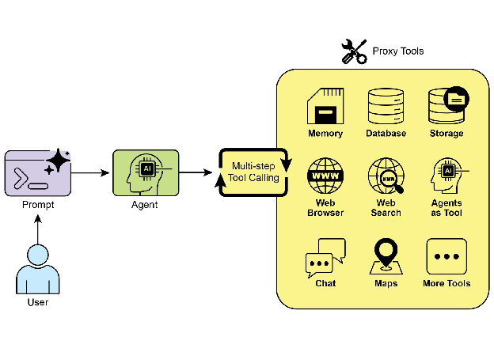

# Chapter 5: Tool Use (Function Calling)

# Tool Use Pattern Overview

So far, we've discussed agentic patterns that primarily involve orchestrating interactions between language models and managing the flow of information within the agent's internal workflow (Chaining, Routing, Parallelization, Reflection). However, for agents to be truly useful and interact with the real world or external systems, they need the ability to use Tools.

The Tool Use pattern, often implemented through a mechanism called Function Calling, enables an agent to interact with external APIs, databases, services, or even execute code. It allows the LLM at the core of the agent to decide when and how to use a specific external function based on the user's request or the current state of the task.

The process typically involves:

1. **Tool Definition:** External functions or capabilities are defined and described to the LLM. This description includes the function's purpose, its name, and the parameters it accepts, along with their types and descriptions.  
2. **LLM Decision:** The LLM receives the user's request and the available tool definitions. Based on its understanding of the request and the tools, the LLM decides if calling one or more tools is necessary to fulfill the request.  
3. **Function Call Generation:** If the LLM decides to use a tool, it generates a structured output (often a JSON object) that specifies the name of the tool to call and the arguments (parameters) to pass to it, extracted from the user's request.  
4. **Tool Execution:** The agentic framework or orchestration layer intercepts this structured output. It identifies the requested tool and executes the actual external function with the provided arguments.  
5. **Observation/Result:** The output or result from the tool execution is returned to the agent.  
6. **LLM Processing (Optional but common):** The LLM receives the tool's output as context and uses it to formulate a final response to the user or decide on the next step in the workflow (which might involve calling another tool, reflecting, or providing a final answer).

This pattern is fundamental because it breaks the limitations of the LLM's training data and allows it to access up-to-date information, perform calculations it can't do internally, interact with user-specific data, or trigger real-world actions. Function calling is the technical mechanism that bridges the gap between the LLM's reasoning capabilities and the vast array of external functionalities available.

While "function calling" aptly describes invoking specific, predefined code functions, it's useful to consider the more expansive concept of "tool calling." This broader term acknowledges that an agent's capabilities can extend far beyond simple function execution. A "tool" can be a traditional function, but it can also be a complex API endpoint, a request to a database, or even an instruction directed at another specialized agent. This perspective allows us to envision more sophisticated systems where, for instance, a primary agent might delegate a complex data analysis task to a dedicated "analyst agent" or query an external knowledge base through its API. Thinking in terms of "tool calling" better captures the full potential of agents to act as orchestrators across a diverse ecosystem of digital resources and other intelligent entities.

Frameworks like LangChain, LangGraph, and Google Agent Developer Kit (ADK) provide robust support for defining tools and integrating them into agent workflows, often leveraging the native function calling capabilities of modern LLMs like those in the Gemini or OpenAI series. On the "canvas" of these frameworks, you define the tools and then configure agents (typically LLM Agents) to be aware of and capable of using these tools.

Tool Use is a cornerstone pattern for building powerful, interactive, and externally aware agents.

# Practical Applications & Use Cases

The Tool Use pattern is applicable in virtually any scenario where an agent needs to go beyond generating text to perform an action or retrieve specific, dynamic information:

1\. Information Retrieval from External Sources:  
Accessing real-time data or information that is not present in the LLM's training data.

* **Use Case:** A weather agent.  
  * **Tool:** A weather API that takes a location and returns the current weather conditions.  
  * **Agent Flow:** User asks, "What's the weather in London?", LLM identifies the need for the weather tool, calls the tool with "London", tool returns data, LLM formats the data into a user-friendly response.

2\. Interacting with Databases and APIs:  
Performing queries, updates, or other operations on structured data.

* **Use Case:** An e-commerce agent.  
  * **Tools:** API calls to check product inventory, get order status, or process payments.  
  * **Agent Flow:** User asks "Is product X in stock?", LLM calls the inventory API, tool returns stock count, LLM tells the user the stock status.

3\. Performing Calculations and Data Analysis:  
Using external calculators, data analysis libraries, or statistical tools.

* **Use Case:** A financial agent.  
  * **Tools:** A calculator function, a stock market data API, a spreadsheet tool.  
  * **Agent Flow:** User asks "What's the current price of AAPL and calculate the potential profit if I bought 100 shares at $150?", LLM calls stock API, gets current price, then calls calculator tool, gets result, formats response.

4\. Sending Communications:  
Sending emails, messages, or making API calls to external communication services.

* **Use Case:** A personal assistant agent.  
  * **Tool:** An email sending API.  
  * **Agent Flow:** User says, "Send an email to John about the meeting tomorrow.", LLM calls an email tool with the recipient, subject, and body extracted from the request.

5\. Executing Code:  
Running code snippets in a safe environment to perform specific tasks.

* **Use Case:** A coding assistant agent.  
  * **Tool:** A code interpreter.  
  * **Agent Flow:** User provides a Python snippet and asks, "What does this code do?", LLM uses the interpreter tool to run the code and analyze its output.

6\. Controlling Other Systems or Devices:  
Interacting with smart home devices, IoT platforms, or other connected systems.

* **Use Case:** A smart home agent.  
  * **Tool:** An API to control smart lights.  
  * **Agent Flow:** User says, "Turn off the living room lights." LLM calls the smart home tool with the command and target device.

Tool Use is what transforms a language model from a text generator into an agent capable of sensing, reasoning, and acting in the digital or physical world (see Fig. 1\)



Fig.1: Some examples of an Agent using Tools

# Hands-On Code Example (LangChain)

The implementation of tool use within the LangChain framework is a two-stage process. Initially, one or more tools are defined, typically by encapsulating existing Python functions or other runnable components. Subsequently, these tools are bound to a language model, thereby granting the model the capability to generate a structured tool-use request when it determines that an external function call is required to fulfill a user's query.

The following implementation will demonstrate this principle by first defining a simple function to simulate an information retrieval tool. Following this, an agent will be constructed and configured to leverage this tool in response to user input. The execution of this example requires the installation of the core LangChain libraries and a model-specific provider package. Furthermore, proper authentication with the selected language model service, typically via an API key configured in the local environment, is a necessary prerequisite.

```python
import os, getpass
import asyncio
import nest_asyncio
from typing import List
from dotenv import load_dotenv
import logging
from langchain_google_genai import ChatGoogleGenerativeAI
from langchain_core.prompts import ChatPromptTemplate
from langchain_core.tools import tool as langchain_tool
from langchain.agents import create_tool_calling_agent, AgentExecutor

# UNCOMMENT
# Prompt the user securely and set API keys as an environment variables
os.environ["GOOGLE_API_KEY"] = getpass.getpass("Enter your Google API key: ")
os.environ["OPENAI_API_KEY"] = getpass.getpass("Enter your OpenAI API key: ")

try:
    # A model with function/tool calling capabilities is required.
    llm = ChatGoogleGenerativeAI(model="gemini-2.0-flash", temperature=0)
    print(f"✅ Language model initialized: {llm.model}")
except Exception as e:
    print(f"🛑 Error initializing language model: {e}")
    llm = None

# --- Define a Tool ---
@langchain_tool
def search_information(query: str) -> str:
    """
    Provides factual information on a given topic. Use this tool to find answers to phrases
    like 'capital of France' or 'weather in London?'.
    """
    print(f"\n--- 🛠️ Tool Called: search_information with query: '{query}' ---")
    # Simulate a search tool with a dictionary of predefined results.
    simulated_results = {
        "weather in london": "The weather in London is currently cloudy with a temperature of 15°C.",
        "capital of france": "The capital of France is Paris.",
        "population of earth": "The estimated population of Earth is around 8 billion people.",
        "tallest mountain": "Mount Everest is the tallest mountain above sea level.",
        "default": f"Simulated search result for '{query}': No specific information found, but the topic seems interesting."
    }
    result = simulated_results.get(query.lower(), simulated_results["default"])
    print(f"--- TOOL RESULT: {result} ---")
    return result

tools = [search_information]

# --- Create a Tool-Calling Agent ---
if llm:
    # This prompt template requires an `agent_scratchpad` placeholder for the agent's internal steps.
    agent_prompt = ChatPromptTemplate.from_messages([
        ("system", "You are a helpful assistant."),
        ("human", "{input}"),
        ("placeholder", "{agent_scratchpad}"),
    ])
    # Create the agent, binding the LLM, tools, and prompt together.
    agent = create_tool_calling_agent(llm, tools, agent_prompt)
    # AgentExecutor is the runtime that invokes the agent and executes the chosen tools.
    # The 'tools' argument is not needed here as they are already bound to the agent.
    agent_executor = AgentExecutor(agent=agent, verbose=True, tools=tools)

async def run_agent_with_tool(query: str):
    """Invokes the agent executor with a query and prints the final response."""
    print(f"\n--- 🏃 Running Agent with Query: '{query}' ---")
    try:
        response = await agent_executor.ainvoke({"input": query})
        print("\n--- ✅ Final Agent Response ---")
        print(response["output"])
    except Exception as e:
        print(f"\n🛑 An error occurred during agent execution: {e}")

async def main():
    """Runs all agent queries concurrently."""
    tasks = [
        run_agent_with_tool("What is the capital of France?"),
        run_agent_with_tool("What's the weather like in London?"),
        run_agent_with_tool("Tell me something about dogs.") # Should trigger the default tool response
    ]
    await asyncio.gather(*tasks)

nest_asyncio.apply()
asyncio.run(main())
```

The code sets up a tool-calling agent using the LangChain library and the Google Gemini model. It defines a search\_information tool that simulates providing factual answers to specific queries. The tool has predefined responses for "weather in london," "capital of france," and "population of earth," and a default response for other queries. A ChatGoogleGenerativeAI model is initialized, ensuring it has tool-calling capabilities. A ChatPromptTemplate is created to guide the agent's interaction. The create\_tool\_calling\_agent function is used to combine the language model, tools, and prompt into an agent. An AgentExecutor is then set up to manage the agent's execution and tool invocation. The run\_agent\_with\_tool asynchronous function is defined to invoke the agent with a given query and print the result. The main asynchronous function prepares multiple queries to be run concurrently. These queries are designed to test both the specific and default responses of the search\_information tool. Finally, the asyncio.run(main()) call executes all the agent tasks. The code includes checks for successful LLM initialization before proceeding with agent setup and execution.

# Hands-On Code Example (CrewAI)

This code provides a practical example of how to implement function calling (Tools) within the CrewAI framework. It sets up a simple scenario where an agent is equipped with a tool to look up information. The example specifically demonstrates fetching a simulated stock price using this agent and tool.

```python
# pip install crewai langchain-openai
import os
from crewai import Agent, Task, Crew
from crewai.tools import tool
import logging

# --- Best Practice: Configure Logging ---
# A basic logging setup helps in debugging and tracking the crew's execution.
logging.basicConfig(level=logging.INFO, format='%(asctime)s - %(levelname)s - %(message)s')

# --- Set up your API Key ---
# For production, it's recommended to use a more secure method for key management
# like environment variables loaded at runtime or a secret manager.
#
# Set the environment variable for your chosen LLM provider (e.g., OPENAI_API_KEY)
# os.environ["OPENAI_API_KEY"] = "YOUR_API_KEY"
# os.environ["OPENAI_MODEL_NAME"] = "gpt-4o"

# --- 1. Refactored Tool: Returns Clean Data ---
# The tool now returns raw data (a float) or raises a standard Python error.
# This makes it more reusable and forces the agent to handle outcomes properly.
@tool("Stock Price Lookup Tool")
def get_stock_price(ticker: str) -> float:
    """
    Fetches the latest simulated stock price for a given stock ticker symbol.
    Returns the price as a float. Raises a ValueError if the ticker is not found.
    """
    logging.info(f"Tool Call: get_stock_price for ticker '{ticker}'")
    simulated_prices = {
        "AAPL": 178.15,
        "GOOGL": 1750.30,
        "MSFT": 425.50,
    }
    price = simulated_prices.get(ticker.upper())
    if price is not None:
        return price
    else:
        # Raising a specific error is better than returning a string.
        # The agent is equipped to handle exceptions and can decide on the next action.
        raise ValueError(f"Simulated price for ticker '{ticker.upper()}' not found.")

# --- 2. Define the Agent ---
# The agent definition remains the same, but it will now leverage the improved tool.
financial_analyst_agent = Agent(
    role='Senior Financial Analyst',
    goal='Analyze stock data using provided tools and report key prices.',
    backstory="You are an experienced financial analyst adept at using data sources to find stock information. You provide clear, direct answers.",
    verbose=True,
    tools=[get_stock_price],
    # Allowing delegation can be useful, but is not necessary for this simple task.
    allow_delegation=False,
)

# --- 3. Refined Task: Clearer Instructions and Error Handling ---
# The task description is more specific and guides the agent on how to react
# to both successful data retrieval and potential errors.
analyze_aapl_task = Task(
    description=(
        "What is the current simulated stock price for Apple (ticker: AAPL)? "
        "Use the 'Stock Price Lookup Tool' to find it. "
        "If the ticker is not found, you must report that you were unable to retrieve the price."
    ),
    expected_output=(
        "A single, clear sentence stating the simulated stock price for AAPL. "
        "For example: 'The simulated stock price for AAPL is $178.15.' "
        "If the price cannot be found, state that clearly."
    ),
    agent=financial_analyst_agent,
)

# --- 4. Formulate the Crew ---
# The crew orchestrates how the agent and task work together.
financial_crew = Crew(
    agents=[financial_analyst_agent],
    tasks=[analyze_aapl_task],
    verbose=True # Set to False for less detailed logs in production
)

# --- 5. Run the Crew within a Main Execution Block ---
# Using a __name__ == "__main__": block is a standard Python best practice.
def main():
    """Main function to run the crew."""
    # Check for API key before starting to avoid runtime errors.
    if not os.environ.get("OPENAI_API_KEY"):
        print("ERROR: The OPENAI_API_KEY environment variable is not set.")
        print("Please set it before running the script.")
        return

    print("\n## Starting the Financial Crew...")
    print("---------------------------------")

    # The kickoff method starts the execution.
    result = financial_crew.kickoff()
    print("\n---------------------------------")
    print("## Crew execution finished.")
    print("\nFinal Result:\n", result)

if __name__ == "__main__":
    main()
```

This code demonstrates a simple application using the Crew.ai library to simulate a financial analysis task. It defines a custom tool, get\_stock\_price, that simulates looking up stock prices for predefined tickers. The tool is designed to return a floating-point number for valid tickers or raise a ValueError for invalid ones. A Crew.ai Agent named financial\_analyst\_agent is created with the role of a Senior Financial Analyst. This agent is given the get\_stock\_price tool to interact with. A Task is defined, analyze\_aapl\_task, specifically instructing the agent to find the simulated stock price for AAPL using the tool. The task description includes clear instructions on how to handle both success and failure cases when using the tool. A Crew is assembled, comprising the financial\_analyst\_agent and the analyze\_aapl\_task. The verbose setting is enabled for both the agent and the crew to provide detailed logging during execution. The main part of the script runs the crew's task using the kickoff() method within a standard if \_\_name\_\_ \== "\_\_main\_\_": block. Before starting the crew, it checks if the OPENAI\_API\_KEY environment variable is set, which is required for the agent to function. The result of the crew's execution, which is the output of the task, is then printed to the console. The code also includes basic logging configuration for better tracking of the crew's actions and tool calls. It uses environment variables for API key management, though it notes that more secure methods are recommended for production environments. In short, the core logic showcases how to define tools, agents, and tasks to create a collaborative workflow in Crew.ai.

# Hands-on code (Google ADK)

# The Google Agent Developer Kit (ADK) includes a library of natively integrated tools that can be directly incorporated into an agent's capabilities. 

# **Google search:** A primary example of such a component is the Google Search tool. This tool serves as a direct interface to the Google Search engine, equipping the agent with the functionality to perform web searches and retrieve external information.

```python
from google.adk.agents import Agent
from google.adk.runners import Runner
from google.adk.sessions import InMemorySessionService
from google.adk.tools import google_search
from google.genai import types
import nest_asyncio
import asyncio

# Define variables required for Session setup and Agent execution
APP_NAME="Google Search_agent"
USER_ID="user1234"
SESSION_ID="1234"

# Define Agent with access to search tool
root_agent = ADKAgent(
  name="basic_search_agent",
  model="gemini-2.0-flash-exp",
  description="Agent to answer questions using Google Search.",
  instruction="I can answer your questions by searching the internet. Just ask me anything!",
  tools=[google_search] # Google Search is a pre-built tool to perform Google searches.
)

# Agent Interaction
async def call_agent(query):
  """
  Helper function to call the agent with a query.
  """
  # Session and Runner
  session_service = InMemorySessionService()
  session = await session_service.create_session(app_name=APP_NAME, user_id=USER_ID, session_id=SESSION_ID)
  runner = Runner(agent=root_agent, app_name=APP_NAME, session_service=session_service)

  content = types.Content(role='user', parts=[types.Part(text=query)])
  events = runner.run(user_id=USER_ID, session_id=SESSION_ID, new_message=content)

  for event in events:
      if event.is_final_response():
          final_response = event.content.parts[0].text
          print("Agent Response: ", final_response)

nest_asyncio.apply()
asyncio.run(call_agent("what's the latest ai news?"))
```

This code demonstrates how to create and use a basic agent powered by the Google ADK for Python. The agent is designed to answer questions by utilizing Google Search as a tool. First, necessary libraries from IPython, google.adk, and google.genai are imported. Constants for the application name, user ID, and session ID are defined. An Agent instance named "basic\_search\_agent" is created with a description and instructions indicating its purpose. It's configured to use the Google Search tool, which is a pre-built tool provided by the ADK. An InMemorySessionService (see Chapter 8\) is initialized to manage sessions for the agent. A new session is created for the specified application, user, and session IDs. A Runner is instantiated, linking the created agent with the session service. This runner is responsible for executing the agent's interactions within a session. A helper function call\_agent is defined to simplify the process of sending a query to the agent and processing the response. Inside call\_agent, the user's query is formatted as a types.Content object with the role 'user'. The runner.run method is called with the user ID, session ID, and the new message content. The runner.run method returns a list of events representing the agent's actions and responses. The code iterates through these events to find the final response. If an event is identified as the final response, the text content of that response is extracted. The extracted agent response is then printed to the console. Finally, the call\_agent function is called with the query "what's the latest ai news?" to demonstrate the agent in action.

**Code execution:** The Google ADK features integrated components for specialized tasks, including an environment for dynamic code execution. The built\_in\_code\_execution tool provides an agent with a sandboxed Python interpreter. This allows the model to write and run code to perform computational tasks, manipulate data structures, and execute procedural scripts. Such functionality is critical for addressing problems that require deterministic logic and precise calculations, which are outside the scope of probabilistic language generation alone.

```python
import os, getpass
import asyncio
import nest_asyncio
from typing import List
from dotenv import load_dotenv
import logging
from google.adk.agents import Agent as ADKAgent, LlmAgent
from google.adk.runners import Runner
from google.adk.sessions import InMemorySessionService
from google.adk.tools import google_search
from google.adk.code_executors import BuiltInCodeExecutor
from google.genai import types

# Define variables required for Session setup and Agent execution
APP_NAME="calculator"
USER_ID="user1234"
SESSION_ID="session_code_exec_async"

# Agent Definition
code_agent = LlmAgent(
    name="calculator_agent",
    model="gemini-2.0-flash",
    code_executor=BuiltInCodeExecutor(),
    instruction="""You are a calculator agent.
    When given a mathematical expression, write and execute Python code to calculate the result.
    Return only the final numerical result as plain text, without markdown or code blocks.
    """,
    description="Executes Python code to perform calculations.",
)

# Agent Interaction (Async)
async def call_agent_async(query):
    # Session and Runner
    session_service = InMemorySessionService()
    session = await session_service.create_session(app_name=APP_NAME, user_id=USER_ID, session_id=SESSION_ID)
    runner = Runner(agent=code_agent, app_name=APP_NAME, session_service=session_service)
    content = types.Content(role='user', parts=[types.Part(text=query)])
    print(f"\n--- Running Query: {query} ---")
    final_response_text = "No final text response captured."
    try:
        # Use run_async
        async for event in runner.run_async(user_id=USER_ID, session_id=SESSION_ID, new_message=content):
            print(f"Event ID: {event.id}, Author: {event.author}")
            # --- Check for specific parts FIRST ---
            # has_specific_part = False
            if event.content and event.content.parts and event.is_final_response():
                for part in event.content.parts: # Iterate through all parts
                    if part.executable_code:
                        # Access the actual code string via .code
                        print(f"  Debug: Agent generated code:\n```python\n{part.executable_code.code}\n```")
                        has_specific_part = True
                    elif part.code_execution_result:
                        # Access outcome and output correctly
                        print(f"  Debug: Code Execution Result: {part.code_execution_result.outcome} - Output:\n{part.code_execution_result.output}")
                        has_specific_part = True
                    # Also print any text parts found in any event for debugging
                    elif part.text and not part.text.isspace():
                        print(f"  Text: '{part.text.strip()}'")
                        # Do not set has_specific_part=True here, as we want the final response logic below
                # --- Check for final response AFTER specific parts ---
                text_parts = [part.text for part in event.content.parts if part.text]
                final_result = "".join(text_parts)
                print(f"==> Final Agent Response: {final_result}")
    except Exception as e:
        print(f"ERROR during agent run: {e}")
    print("-" * 30)

# Main async function to run the examples
async def main():
    await call_agent_async("Calculate the value of (5 + 7) * 3")
    await call_agent_async("What is 10 factorial?")

# Execute the main async function
try:
    nest_asyncio.apply()
    asyncio.run(main())
except RuntimeError as e:
    # Handle specific error when running asyncio.run in an already running loop (like Jupyter/Colab)
    if "cannot be called from a running event loop" in str(e):
        print("\nRunning in an existing event loop (like Colab/Jupyter).")
        print("Please run `await main()` in a notebook cell instead.")
        # If in an interactive environment like a notebook, you might need to run:
        # await main()
    else:
        raise e # Re-raise other runtime errors
```

This script uses Google's Agent Development Kit (ADK) to create an agent that solves mathematical problems by writing and executing Python code. It defines an LlmAgent specifically instructed to act as a calculator, equipping it with the built\_in\_code\_execution tool. The primary logic resides in the call\_agent\_async function, which sends a user's query to the agent's runner and processes the resulting events. Inside this function, an asynchronous loop iterates through events, printing the generated Python code and its execution result for debugging. The code carefully distinguishes between these intermediate steps and the final event containing the numerical answer. Finally, a main function runs the agent with two different mathematical expressions to demonstrate its ability to perform calculations.

**Enterprise search:** This code defines a Google ADK application using the google.adk library in Python. It specifically uses a VSearchAgent, which is designed to answer questions by searching a specified Vertex AI Search datastore. The code initializes a VSearchAgent named "q2\_strategy\_vsearch\_agent", providing a description, the model to use ("gemini-2.0-flash-exp"), and the ID of the Vertex AI Search datastore. The DATASTORE\_ID is expected to be set as an environment variable. It then sets up a Runner for the agent, using an InMemorySessionService to manage conversation history. An asynchronous function call\_vsearch\_agent\_async is defined to interact with the agent. This function takes a query, constructs a message content object, and calls the runner's run\_async method to send the query to the agent. The function then streams the agent's response back to the console as it arrives. It also prints information about the final response, including any source attributions from the datastore. Error handling is included to catch exceptions during the agent's execution, providing informative messages about potential issues like an incorrect datastore ID or missing permissions. Another asynchronous function run\_vsearch\_example is provided to demonstrate how to call the agent with example queries. The main execution block checks if the DATASTORE\_ID is set and then runs the example using asyncio.run. It includes a check to handle cases where the code is run in an environment that already has a running event loop, like a Jupyter notebook. 

```python
import asyncio
from google.genai import types
from google.adk import agents
from google.adk.runners import Runner
from google.adk.sessions import InMemorySessionService
import os

# --- Configuration ---
# Ensure you have set your GOOGLE_API_KEY and DATASTORE_ID environment variables
# For example:
# os.environ["GOOGLE_API_KEY"] = "YOUR_API_KEY"
# os.environ["DATASTORE_ID"] = "YOUR_DATASTORE_ID"

DATASTORE_ID = os.environ.get("DATASTORE_ID")

# --- Application Constants ---
APP_NAME = "vsearch_app"
USER_ID = "user_123"  # Example User ID
SESSION_ID = "session_456" # Example Session ID

# --- Agent Definition (Updated with the newer model from the guide) ---
vsearch_agent = agents.VSearchAgent(
    name="q2_strategy_vsearch_agent",
    description="Answers questions about Q2 strategy documents using Vertex AI Search.",
    model="gemini-2.0-flash-exp", # Updated model based on the guide's examples
    datastore_id=DATASTORE_ID,
    model_parameters={"temperature": 0.0}
)

# --- Runner and Session Initialization ---
runner = Runner(
    agent=vsearch_agent,
    app_name=APP_NAME,
    session_service=InMemorySessionService(),
)

# --- Agent Invocation Logic ---
async def call_vsearch_agent_async(query: str):
    """Initializes a session and streams the agent's response."""
    print(f"User: {query}")
    print("Agent: ", end="", flush=True)
    try:
        # Construct the message content correctly
        content = types.Content(role='user', parts=[types.Part(text=query)])
        # Process events as they arrive from the asynchronous runner
        async for event in runner.run_async(
            user_id=USER_ID,
            session_id=SESSION_ID,
            new_message=content
        ):
            # For token-by-token streaming of the response text
            if hasattr(event, 'content_part_delta') and event.content_part_delta:
                print(event.content_part_delta.text, end="", flush=True)
            # Process the final response and its associated metadata
            if event.is_final_response():
                print() # Newline after the streaming response
                if event.grounding_metadata:
                    print(f"  (Source Attributions: {len(event.grounding_metadata.grounding_attributions)} sources found)")
                else:
                    print("  (No grounding metadata found)")
                print("-" * 30)
    except Exception as e:
        print(f"\nAn error occurred: {e}")
        print("Please ensure your datastore ID is correct and that the service account has the necessary permissions.")
        print("-" * 30)

# --- Run Example ---
async def run_vsearch_example():
    # Replace with a question relevant to YOUR datastore content
    await call_vsearch_agent_async("Summarize the main points about the Q2 strategy document.")
    await call_vsearch_agent_async("What safety procedures are mentioned for lab X?")

# --- Execution ---
if __name__ == "__main__":
    if not DATASTORE_ID:
        print("Error: DATASTORE_ID environment variable is not set.")
    else:
        try:
            asyncio.run(run_vsearch_example())
        except RuntimeError as e:
            # This handles cases where asyncio.run is called in an environment
            # that already has a running event loop (like a Jupyter notebook).
            if "cannot be called from a running event loop" in str(e):
                print("Skipping execution in a running event loop. Please run this script directly.")
            else:
                raise e
```

Overall, this code provides a basic framework for building a conversational AI application that leverages Vertex AI Search to answer questions based on information stored in a datastore. It demonstrates how to define an agent, set up a runner, and interact with the agent asynchronously while streaming the response. The focus is on retrieving and synthesizing information from a specific datastore to answer user queries.

**Vertex Extensions:** A Vertex AI extension is a structured API wrapper that enables a model to connect with external APIs for real-time data processing and action execution. Extensions offer enterprise-grade security, data privacy, and performance guarantees. They can be used for tasks like generating and running code, querying websites, and analyzing information from private datastores. Google provides prebuilt extensions for common use cases like Code Interpreter and Vertex AI Search, with the option to create custom ones. The primary benefit of extensions includes strong enterprise controls and seamless integration with other Google products. The key difference between extensions and function calling lies in their execution: Vertex AI automatically executes extensions, whereas function calls require manual execution by the user or client.

# At a Glance

**What:** LLMs are powerful text generators, but they are fundamentally disconnected from the outside world. Their knowledge is static, limited to the data they were trained on, and they lack the ability to perform actions or retrieve real-time information. This inherent limitation prevents them from completing tasks that require interaction with external APIs, databases, or services. Without a bridge to these external systems, their utility for solving real-world problems is severely constrained.

**Why:** The Tool Use pattern, often implemented via function calling, provides a standardized solution to this problem. It works by describing available external functions, or "tools," to the LLM in a way it can understand. Based on a user's request, the agentic LLM can then decide if a tool is needed and generate a structured data object (like a JSON) specifying which function to call and with what arguments. An orchestration layer executes this function call, retrieves the result, and feeds it back to the LLM. This allows the LLM to incorporate up-to-date, external information or the result of an action into its final response, effectively giving it the ability to act.

**Rule of thumb:** Use the Tool Use pattern whenever an agent needs to break out of the LLM's internal knowledge and interact with the outside world. This is essential for tasks requiring real-time data (e.g., checking weather, stock prices), accessing private or proprietary information (e.g., querying a company's database), performing precise calculations, executing code, or triggering actions in other systems (e.g., sending an email, controlling smart devices).

**Visual summary:**


Fig.2: Tool use design pattern

# Key Takeaways

* Tool Use (Function Calling) allows agents to interact with external systems and access dynamic information.  
* It involves defining tools with clear descriptions and parameters that the LLM can understand.  
* The LLM decides when to use a tool and generates structured function calls.  
* Agentic frameworks execute the actual tool calls and return the results to the LLM.  
* Tool Use is essential for building agents that can perform real-world actions and provide up-to-date information.  
* LangChain simplifies tool definition using the @tool decorator and provides create\_tool\_calling\_agent and AgentExecutor for building tool-using agents.  
* Google ADK has a number of very useful pre-built tools such as Google Search, Code Execution and Vertex AI Search Tool.

# Conclusion

The Tool Use pattern is a critical architectural principle for extending the functional scope of large language models beyond their intrinsic text generation capabilities. By equipping a model with the ability to interface with external software and data sources, this paradigm allows an agent to perform actions, execute computations, and retrieve information from other systems. This process involves the model generating a structured request to call an external tool when it determines that doing so is necessary to fulfill a user's query. Frameworks such as LangChain, Google ADK, and Crew AI offer structured abstractions and components that facilitate the integration of these external tools. These frameworks manage the process of exposing tool specifications to the model and parsing its subsequent tool-use requests. This simplifies the development of sophisticated agentic systems that can interact with and take action within external digital environments.

# References

1. LangChain Documentation (Tools): [https://python.langchain.com/docs/integrations/tools/](https://python.langchain.com/docs/integrations/tools/)   
2. Google Agent Developer Kit (ADK) Documentation (Tools): [https://google.github.io/adk-docs/tools/](https://google.github.io/adk-docs/tools/)   
3. OpenAI Function Calling Documentation: [https://platform.openai.com/docs/guides/function-calling](https://platform.openai.com/docs/guides/function-calling)   
4. CrewAI Documentation (Tools): [https://docs.crewai.com/concepts/tools](https://docs.crewai.com/concepts/tools) 


