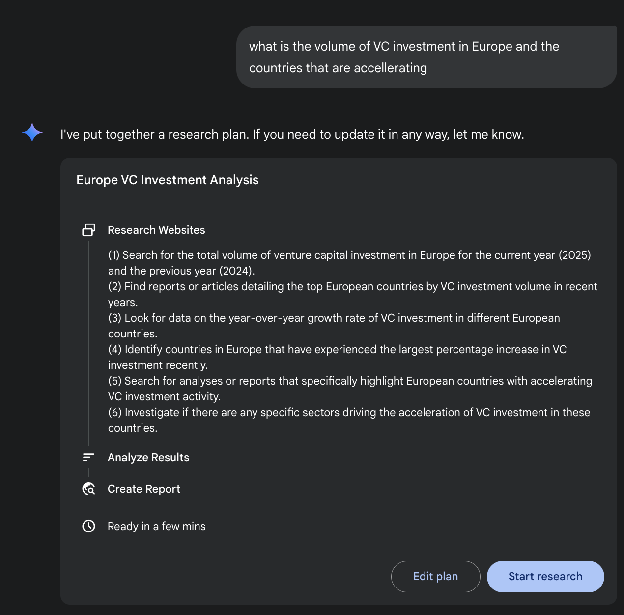
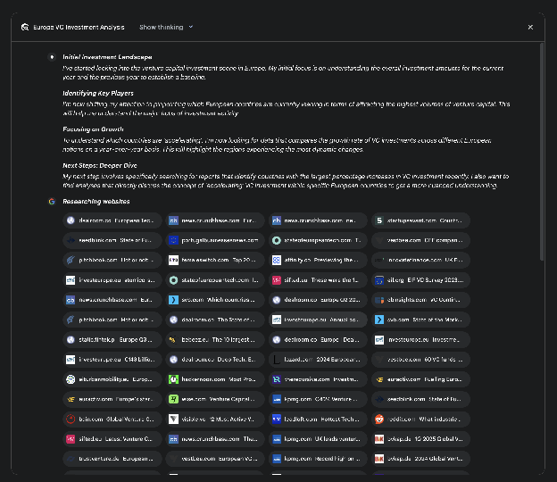
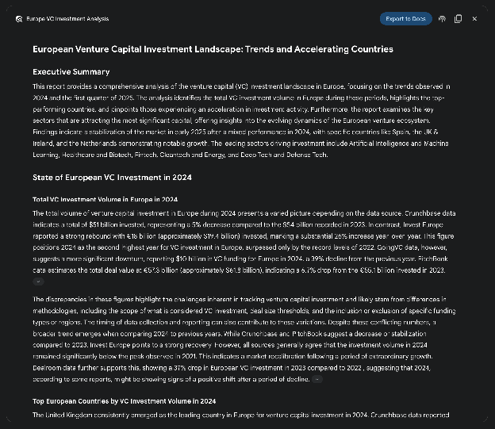
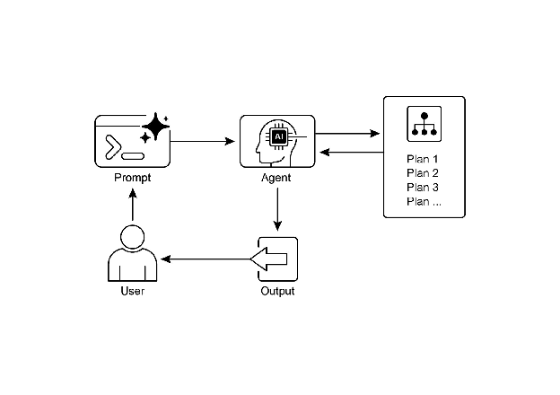

# Chapter 6: Planning

지능적인 행동은 종종 즉각적인 입력에 단순히 반응하는 것 이상을 포함함. 이는 통찰력, 복잡한 작업을 더 작고 관리 가능한 단계로 분해하는 능력, 그리고 원하는 결과를 달성하기 위한 전략 수립을 필요로 함. 이것이 바로 Planning 패턴이 적용되는 부분임. 핵심적으로 planning은 agent 또는 agent 시스템이 초기 상태에서 목표 상태로 이동하기 위한 일련의 행동을 수립하는 능력임.

# Planning Pattern Overview

AI의 맥락에서 planning agent를 복잡한 목표를 위임받는 전문가로 생각하는 것이 유용함. "팀 오프사이트를 조직하라"고 요청할 때, 목표와 제약 조건인 "무엇"을 정의하는 것이지 "어떻게"를 정의하는 것이 아님. Agent의 핵심 과제는 해당 목표로 가는 경로를 자율적으로 계획하는 것임. 먼저 초기 상태(예: 예산, 참가자 수, 원하는 날짜)와 목표 상태(성공적으로 예약된 오프사이트)를 이해한 다음, 이들을 연결하는 최적의 행동 순서를 발견해야 함. 계획은 미리 알려진 것이 아니며, 요청에 대한 응답으로 생성됨.

이 과정의 특징은 적응성임. 초기 계획은 단순히 시작점일 뿐, 경직된 스크립트가 아님. Agent의 진정한 힘은 새로운 정보를 통합하고 장애물을 우회하여 프로젝트를 조정하는 능력에 있음. 예를 들어, 선호하는 장소가 이용 불가능해지거나 선택한 케이터링 업체가 예약이 꽉 찬 경우, 유능한 agent는 단순히 실패하지 않음. 적응함. 새로운 제약 조건을 등록하고, 옵션을 재평가하며, 대체 장소나 날짜를 제안하는 등 새로운 계획을 수립함.

그러나 유연성과 예측 가능성 사이의 트레이드오프를 인식하는 것이 중요함. 동적 planning은 특정 도구이지 범용 솔루션이 아님. 문제의 솔루션이 이미 잘 이해되고 반복 가능할 때는, agent를 미리 정의된 고정 워크플로우로 제한하는 것이 더 효과적임. 이 접근법은 agent의 자율성을 제한하여 불확실성과 예측 불가능한 동작의 위험을 줄이고, 신뢰할 수 있고 일관된 결과를 보장함. 따라서 planning agent와 단순 작업 실행 agent 중 선택은 하나의 질문에 달려 있음: "어떻게"를 발견해야 하는가, 아니면 이미 알려져 있는가?

# Practical Applications & Use Cases

Planning 패턴은 자율 시스템의 핵심 계산 프로세스로, agent가 특히 동적이거나 복잡한 환경 내에서 지정된 목표를 달성하기 위한 일련의 행동을 합성할 수 있게 함. 이 프로세스는 고수준 목표를 개별적이고 실행 가능한 단계로 구성된 구조화된 계획으로 변환함.

절차적 작업 자동화와 같은 도메인에서 planning은 복잡한 워크플로우를 조율하는 데 사용됨. 예를 들어, 신규 직원 온보딩과 같은 비즈니스 프로세스는 시스템 계정 생성, 교육 모듈 할당, 여러 부서와의 조율 등의 방향성 있는 하위 작업 순서로 분해될 수 있음. Agent는 이러한 단계를 논리적 순서로 실행하기 위한 계획을 생성하고, 필요한 도구를 호출하거나 다양한 시스템과 상호작용하여 종속성을 관리함.

로봇공학 및 자율 내비게이션 내에서 planning은 상태 공간 탐색의 기초가 됨. 물리적 로봇이든 가상 엔티티든 시스템은 초기 상태에서 목표 상태로 전환하기 위한 경로 또는 행동 순서를 생성해야 함. 이는 장애물 회피 또는 교통 규정 준수와 같은 환경 제약을 준수하면서 시간이나 에너지 소비와 같은 메트릭을 최적화하는 것을 포함함.

이 패턴은 구조화된 정보 합성에도 중요함. 연구 보고서와 같은 복잡한 출력물을 생성하는 작업이 주어지면, agent는 정보 수집, 데이터 요약, 콘텐츠 구조화, 반복적 개선을 위한 개별 단계를 포함하는 계획을 수립할 수 있음. 마찬가지로 다단계 문제 해결을 포함하는 고객 지원 시나리오에서 agent는 진단, 솔루션 구현, 에스컬레이션을 위한 체계적인 계획을 생성하고 따를 수 있음.

본질적으로 Planning 패턴은 agent가 단순한 반응적 행동을 넘어 목표 지향적 행동으로 나아갈 수 있게 함. 이는 상호 의존적인 작업의 일관된 순서를 필요로 하는 문제를 해결하는 데 필요한 논리적 프레임워크를 제공함.

# Hands-on code (Crew AI)

다음 섹션에서는 Crew AI 프레임워크를 사용한 Planner 패턴의 구현을 시연함. 이 패턴은 agent가 먼저 복잡한 쿼리를 해결하기 위한 다단계 계획을 수립한 다음 해당 계획을 순차적으로 실행하는 것을 포함함.

```python
import os
from dotenv import load_dotenv
from crewai import Agent, Task, Crew, Process
from langchain_openai import ChatOpenAI

# Load environment variables from .env file for security
load_dotenv()

# 1. Explicitly define the language model for clarity
llm = ChatOpenAI(model="gpt-4-turbo")

# 2. Define a clear and focused agent
planner_writer_agent = Agent(
    role='Article Planner and Writer',
    goal='Plan and then write a concise, engaging summary on a specified topic.',
    backstory=(
        'You are an expert technical writer and content strategist. '
        'Your strength lies in creating a clear, actionable plan before writing, '
        'ensuring the final summary is both informative and easy to digest.'
    ),
    verbose=True,
    allow_delegation=False,
    llm=llm # Assign the specific LLM to the agent
)

# 3. Define a task with a more structured and specific expected output
topic = "The importance of Reinforcement Learning in AI"
high_level_task = Task(
    description=(
        f"1. Create a bullet-point plan for a summary on the topic: '{topic}'.\n"
        f"2. Write the summary based on your plan, keeping it around 200 words."
    ),
    expected_output=(
        "A final report containing two distinct sections:\n\n"
        "### Plan\n"
        "- A bulleted list outlining the main points of the summary.\n\n"
        "### Summary\n"
        "- A concise and well-structured summary of the topic."
    ),
    agent=planner_writer_agent,
)

# Create the crew with a clear process
crew = Crew(
    agents=[planner_writer_agent],
    tasks=[high_level_task],
    process=Process.sequential,
)

# Execute the task
print("## Running the planning and writing task ##")
result = crew.kickoff()

print("\n\n---\n## Task Result ##\n---")
print(result)
```

이 코드는 CrewAI 라이브러리를 사용하여 주어진 주제에 대한 요약을 계획하고 작성하는 AI agent를 생성함. 필요한 라이브러리(Crew.ai 및 langchain_openai 포함)를 import하고 .env 파일에서 환경 변수를 로드하는 것으로 시작함. agent와 함께 사용할 ChatOpenAI 언어 모델을 명시적으로 정의함. planner_writer_agent라는 Agent가 특정 역할과 목표로 생성됨: 간결한 요약을 계획하고 작성하는 것. Agent의 backstory는 계획 수립 및 기술 문서 작성에 대한 전문성을 강조함. Task는 먼저 계획을 생성한 다음 "AI에서 Reinforcement Learning의 중요성"이라는 주제에 대한 요약을 작성하는 명확한 설명과 함께 정의되며, 예상 출력을 위한 특정 형식을 가짐. Crew는 agent 및 task와 함께 조립되며, 순차적으로 처리하도록 설정됨. 마지막으로 crew.kickoff() 메서드가 호출되어 정의된 task를 실행하고 결과가 출력됨.

# Google DeepResearch

Google Gemini DeepResearch(Fig.1 참조)는 자율적인 정보 검색 및 합성을 위해 설계된 agent 기반 시스템임. 복잡한 주제를 체계적으로 탐색하기 위해 Google Search를 동적이고 반복적으로 쿼리하는 다단계 agentic pipeline을 통해 작동함. 시스템은 대량의 웹 기반 소스 코퍼스를 처리하고, 수집된 데이터의 관련성과 지식 격차를 평가하며, 이를 해결하기 위한 후속 검색을 수행하도록 설계됨. 최종 출력은 검증된 정보를 원본 소스에 대한 인용과 함께 구조화된 다페이지 요약으로 통합함.

이를 확장하면, 시스템의 작동은 단일 쿼리-응답 이벤트가 아니라 관리되는 장기 실행 프로세스임. 사용자의 프롬프트를 다지점 연구 계획으로 분해하는 것으로 시작하며(Fig. 1 참조), 이는 검토 및 수정을 위해 사용자에게 제시됨. 이를 통해 실행 전에 연구 방향을 협력적으로 형성할 수 있음. 계획이 승인되면 agentic pipeline은 반복적인 검색-분석 루프를 시작함. 이는 단순히 미리 정의된 일련의 검색을 실행하는 것 이상을 포함함; agent는 수집한 정보를 기반으로 쿼리를 동적으로 공식화하고 개선하며, 지식 격차를 적극적으로 식별하고, 데이터 포인트를 입증하며, 불일치를 해결함.


Fig. 1: Google Deep Research agent가 Google Search를 도구로 사용하기 위한 실행 계획을 생성하는 모습.

핵심 아키텍처 구성 요소는 이 프로세스를 비동기적으로 관리하는 시스템의 능력임. 이 설계는 수백 개의 소스를 분석하는 것을 포함할 수 있는 조사가 단일 지점 장애에 대해 탄력적이며 사용자가 완료 시 알림을 받을 수 있도록 분리할 수 있음을 보장함. 시스템은 사용자가 제공한 문서도 통합하여 개인 소스의 정보를 웹 기반 연구와 결합할 수 있음. 최종 출력은 단순히 연결된 발견 목록이 아니라 구조화된 다페이지 보고서임. 합성 단계에서 모델은 수집된 정보에 대한 비판적 평가를 수행하고, 주요 주제를 식별하며, 콘텐츠를 논리적 섹션이 있는 일관된 서사로 구성함. 보고서는 오디오 개요, 차트, 원본 인용 소스에 대한 링크와 같은 기능을 포함하여 대화형으로 설계되어 사용자의 검증 및 추가 탐색을 가능하게 함. 합성된 결과 외에도 모델은 검색하고 참조한 전체 소스 목록을 명시적으로 반환함(Fig.2 참조). 이들은 인용으로 제시되어 완전한 투명성과 주요 정보에 대한 직접 액세스를 제공함. 이 전체 프로세스는 단순한 쿼리를 포괄적이고 합성된 지식체로 변환함.


Fig. 2: Deep Research 계획이 실행되어 Google Search가 다양한 웹 소스를 검색하는 도구로 사용되는 예시.

수동 데이터 수집 및 합성에 필요한 상당한 시간과 리소스 투자를 완화함으로써 Gemini DeepResearch는 정보 발견을 위한 보다 구조화되고 철저한 방법을 제공함. 시스템의 가치는 다양한 도메인에 걸친 복잡하고 다면적인 연구 작업에서 특히 명확함.

예를 들어, 경쟁 분석에서 agent는 시장 동향, 경쟁사 제품 사양, 다양한 온라인 소스의 대중 감정, 마케팅 전략에 대한 데이터를 체계적으로 수집하고 정리하도록 지시될 수 있음. 이 자동화된 프로세스는 여러 경쟁사를 수동으로 추적하는 힘든 작업을 대체하여 분석가가 데이터 수집이 아닌 상위 수준의 전략적 해석에 집중할 수 있게 함(Fig. 3 참조).


Fig. 3: Google Deep Research agent가 Google Search를 도구로 사용하여 얻은 소스를 분석하여 생성한 최종 출력.

마찬가지로 학술 탐색에서 시스템은 광범위한 문헌 검토를 수행하기 위한 강력한 도구 역할을 함. 기초 논문을 식별하고 요약하며, 수많은 출판물에 걸쳐 개념의 발전을 추적하고, 특정 분야 내의 새로운 연구 전선을 매핑하여 학술 탐구의 초기 및 가장 시간 소모적인 단계를 가속화할 수 있음.

이 접근법의 효율성은 수동 연구의 핵심 병목 현상인 반복적인 검색-필터 사이클의 자동화에서 비롯됨. 포괄성은 비교 가능한 시간 내에 인간 연구자가 일반적으로 실현 가능한 것보다 더 많은 양과 다양성의 정보 소스를 처리하는 시스템의 능력으로 달성됨. 이 더 넓은 분석 범위는 선택 편향의 가능성을 줄이고 덜 명백하지만 잠재적으로 중요한 정보를 발견할 가능성을 높여 주제에 대한 보다 견고하고 잘 뒷받침되는 이해로 이어짐.

# OpenAI Deep Research API

OpenAI Deep Research API는 복잡한 연구 작업을 자동화하도록 설계된 특수 도구임. 실제 소스에서 독립적으로 추론하고, 계획하고, 정보를 합성할 수 있는 고급 agentic 모델을 활용함. 단순한 Q&A 모델과 달리, 고수준 쿼리를 받아 자율적으로 하위 질문으로 분해하고, 내장 도구를 사용하여 웹 검색을 수행하며, 구조화되고 인용이 풍부한 최종 보고서를 제공함. API는 이 전체 프로세스에 대한 직접적인 프로그래밍 방식의 액세스를 제공하며, 작성 시점에 고품질 합성을 위한 o3-deep-research-2025-06-26과 지연 시간에 민감한 애플리케이션을 위한 더 빠른 o4-mini-deep-research-2025-06-26 같은 모델을 사용함.

Deep Research API는 그렇지 않으면 수 시간의 수동 연구가 필요할 작업을 자동화하여 비즈니스 전략, 투자 결정 또는 정책 권장 사항을 알리는 데 적합한 전문가 수준의 데이터 기반 보고서를 제공하기 때문에 유용함. 주요 이점은 다음과 같음:

* **구조화되고 인용된 출력:** 소스 메타데이터에 연결된 인라인 인용과 함께 잘 구성된 보고서를 생성하여 주장이 검증 가능하고 데이터 기반임을 보장함.
* **투명성:** ChatGPT의 추상화된 프로세스와 달리, API는 agent의 추론, 실행한 특정 웹 검색 쿼리, 실행한 모든 코드를 포함한 모든 중간 단계를 노출함. 이를 통해 상세한 디버깅, 분석, 최종 답변이 어떻게 구성되었는지에 대한 더 깊은 이해가 가능함.
* **확장성:** Model Context Protocol(MCP)을 지원하여 개발자가 agent를 개인 지식 베이스 및 내부 데이터 소스에 연결하여 공개 웹 연구와 독점 정보를 혼합할 수 있음.

API를 사용하려면 client.responses.create 엔드포인트에 모델, 입력 프롬프트, agent가 사용할 수 있는 도구를 지정하여 요청을 보냄. 입력은 일반적으로 agent의 페르소나와 원하는 출력 형식을 정의하는 system_message와 user_query를 포함함. web_search_preview 도구를 포함해야 하며, 선택적으로 code_interpreter 또는 내부 데이터를 위한 사용자 정의 MCP 도구(Chapter 10 참조)를 추가할 수 있음.

```python
from openai import OpenAI

# Initialize the client with your API key
client = OpenAI(api_key="YOUR_OPENAI_API_KEY")

# Define the agent's role and the user's research question
system_message = """You are a professional researcher preparing a structured, data-driven report.
Focus on data-rich insights, use reliable sources, and include inline citations."""

user_query = "Research the economic impact of semaglutide on global healthcare systems."

# Create the Deep Research API call
response = client.responses.create(
    model="o3-deep-research-2025-06-26",
    input=[
        {
            "role": "developer",
            "content": [{"type": "input_text", "text": system_message}]
        },
        {
            "role": "user",
            "content": [{"type": "input_text", "text": user_query}]
        }
    ],
    reasoning={"summary": "auto"},
    tools=[{"type": "web_search_preview"}]
)

# Access and print the final report from the response
final_report = response.output[-1].content[0].text
print(final_report)

# --- ACCESS INLINE CITATIONS AND METADATA ---
print("--- CITATIONS ---")
annotations = response.output[-1].content[0].annotations
if not annotations:
    print("No annotations found in the report.")
else:
    for i, citation in enumerate(annotations):
        # The text span the citation refers to
        cited_text = final_report[citation.start_index:citation.end_index]
        print(f"Citation {i+1}:")
        print(f"  Cited Text: {cited_text}")
        print(f"  Title: {citation.title}")
        print(f"  URL: {citation.url}")
        print(f"  Location: chars {citation.start_index}–{citation.end_index}")

print("\n" + "="*50 + "\n")

# --- INSPECT INTERMEDIATE STEPS ---
print("--- INTERMEDIATE STEPS ---")

# 1. Reasoning Steps: Internal plans and summaries generated by the model.
try:
    reasoning_step = next(item for item in response.output if item.type == "reasoning")
    print("\n[Found a Reasoning Step]")
    for summary_part in reasoning_step.summary:
        print(f"  - {summary_part.text}")
except StopIteration:
    print("\nNo reasoning steps found.")

# 2. Web Search Calls: The exact search queries the agent executed.
try:
    search_step = next(item for item in response.output if item.type == "web_search_call")
    print("\n[Found a Web Search Call]")
    print(f"  Query Executed: '{search_step.action['query']}'")
    print(f"  Status: {search_step.status}")
except StopIteration:
    print("\nNo web search steps found.")

# 3. Code Execution: Any code run by the agent using the code interpreter.
try:
    code_step = next(item for item in response.output if item.type == "code_interpreter_call")
    print("\n[Found a Code Execution Step]")
    print("  Code Input:")
    print(f"  ```python\n{code_step.input}\n  ```")
    print("  Code Output:")
    print(f"  {code_step.output}")
except StopIteration:
    print("\nNo code execution steps found.")
```

이 코드 스니펫은 OpenAI API를 활용하여 "Deep Research" 작업을 수행함. 인증에 중요한 API 키로 OpenAI 클라이언트를 초기화하는 것으로 시작함. 그런 다음 AI agent의 역할을 전문 연구자로 정의하고 semaglutide의 경제적 영향에 대한 사용자의 연구 질문을 설정함. 코드는 정의된 시스템 메시지와 사용자 쿼리를 입력으로 제공하여 o3-deep-research-2025-06-26 모델에 대한 API 호출을 구성함. 또한 추론의 자동 요약을 요청하고 웹 검색 기능을 활성화함. API 호출 후 최종 생성 보고서를 추출하고 출력함.

이어서 인용된 텍스트, 제목, URL, 보고서 내 위치를 포함하여 보고서의 주석에서 인라인 인용 및 메타데이터에 액세스하고 표시하려고 시도함. 마지막으로 모델이 수행한 중간 단계에 대한 세부 정보(추론 단계, 실행된 쿼리를 포함한 웹 검색 호출, 코드 인터프리터가 사용된 경우 코드 실행 단계)를 검사하고 출력함.

# At a Glance

**무엇:** 복잡한 문제는 종종 단일 행동으로 해결될 수 없으며 원하는 결과를 달성하기 위해 통찰력을 필요로 함. 구조화된 접근 없이는 agentic 시스템이 여러 단계와 종속성을 포함하는 다면적 요청을 처리하는 데 어려움을 겪음. 이로 인해 고수준 목표를 관리 가능한 일련의 더 작고 실행 가능한 작업으로 분해하기 어려움. 결과적으로 시스템은 효과적으로 전략을 수립하지 못하여 복잡한 목표에 직면했을 때 불완전하거나 부정확한 결과를 초래함.

**왜:** Planning 패턴은 agentic 시스템이 먼저 목표를 해결하기 위한 일관된 계획을 생성하도록 하여 표준화된 솔루션을 제공함. 고수준 목표를 더 작고 실행 가능한 단계 또는 하위 목표의 순서로 분해하는 것을 포함함. 이를 통해 시스템은 복잡한 워크플로우를 관리하고, 다양한 도구를 조율하며, 논리적 순서로 종속성을 처리할 수 있음. LLM은 방대한 학습 데이터를 기반으로 그럴듯하고 효과적인 계획을 생성할 수 있어 이에 특히 적합함. 이 구조화된 접근법은 단순한 반응적 agent를 복잡한 목표를 향해 능동적으로 작업하고 필요한 경우 계획을 조정할 수도 있는 전략적 실행자로 변환함.

**경험 규칙:** 사용자의 요청이 단일 행동이나 도구로 처리하기에 너무 복잡할 때 이 패턴을 사용함. 상세한 연구 보고서 생성, 신규 직원 온보딩, 경쟁 분석 실행과 같은 다단계 프로세스를 자동화하는 데 이상적임. 작업이 최종 합성 결과에 도달하기 위해 상호 의존적인 작업 순서를 필요로 할 때마다 Planning 패턴을 적용함.

**시각적 요약**

Fig.4; Planning 디자인 패턴

# Key Takeaways

* Planning은 agent가 복잡한 목표를 실행 가능한 순차적 단계로 분해할 수 있게 함.
* 다단계 작업, 워크플로우 자동화, 복잡한 환경 탐색을 처리하는 데 필수적임.
* LLM은 작업 설명을 기반으로 단계별 접근 방식을 생성하여 planning을 수행할 수 있음.
* planning 단계를 요구하도록 명시적으로 프롬프팅하거나 작업을 설계하면 agent 프레임워크에서 이러한 동작이 장려됨.
* Google Deep Research는 Google Search를 도구로 사용하여 얻은 소스를 우리 대신 분석하는 agent임. 이는 반영하고, 계획하고, 실행함.

# Conclusion

결론적으로 Planning 패턴은 agentic 시스템을 단순한 반응적 응답자에서 전략적이고 목표 지향적인 실행자로 향상시키는 기초 구성 요소임. 현대의 대규모 언어 모델은 이를 위한 핵심 능력을 제공하여 고수준 목표를 일관되고 실행 가능한 단계로 자율적으로 분해함. 이 패턴은 CrewAI agent가 작성 계획을 생성하고 따르는 것으로 입증된 간단한 순차적 작업 실행부터 더 복잡하고 동적인 시스템까지 확장됨. Google DeepResearch agent는 이러한 고급 애플리케이션을 예시하며, 지속적인 정보 수집을 기반으로 적응하고 진화하는 반복적인 연구 계획을 생성함. 궁극적으로 planning은 복잡한 문제에 대한 인간의 의도와 자동화된 실행 사이의 필수적인 다리를 제공함. 문제 해결 접근 방식을 구조화함으로써 이 패턴은 agent가 복잡한 워크플로우를 관리하고 포괄적이고 합성된 결과를 제공할 수 있게 함.

# References

1. Google DeepResearch (Gemini Feature): [gemini.google.com](http://gemini.google.com)
2. OpenAI ,Introducing deep research  [https://openai.com/index/introducing-deep-research/](https://openai.com/index/introducing-deep-research/)
3. Perplexity, Introducing Perplexity Deep Research, [https://www.perplexity.ai/hub/blog/introducing-perplexity-deep-research](https://www.perplexity.ai/hub/blog/introducing-perplexity-deep-research)


