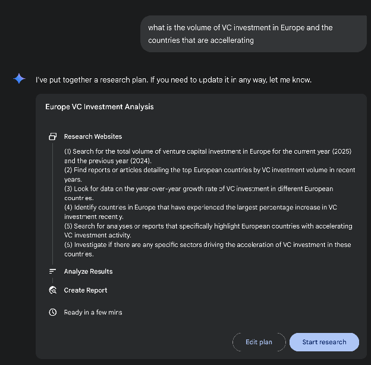
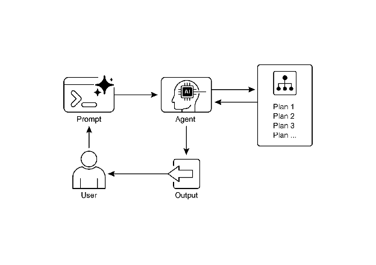

# Chapter 6: Planning

Intelligent behavior often involves more than just reacting to the immediate input. It requires foresight, breaking down complex tasks into smaller, manageable steps, and strategizing how to achieve a desired outcome. This is where the Planning pattern comes into play. At its core, planning is the ability for an agent or a system of agents to formulate a sequence of actions to move from an initial state towards a goal state.

# Planning Pattern Overview

In the context of AI, it's helpful to think of a planning agent as a specialist to whom you delegate a complex goal. When you ask it to "organize a team offsite," you are defining the what—the objective and its constraints—but not the how. The agent's core task is to autonomously chart a course to that goal. It must first understand the initial state (e.g., budget, number of participants, desired dates) and the goal state (a successfully booked offsite), and then discover the optimal sequence of actions to connect them. The plan is not known in advance; it is created in response to the request.

A hallmark of this process is adaptability. An initial plan is merely a starting point, not a rigid script. The agent's real power is its ability to incorporate new information and steer the project around obstacles. For instance, if the preferred venue becomes unavailable or a chosen caterer is fully booked, a capable agent doesn't simply fail. It adapts. It registers the new constraint, re-evaluates its options, and formulates a new plan, perhaps by suggesting alternative venues or dates.

However, it is crucial to recognize the trade-off between flexibility and predictability. Dynamic planning is a specific tool, not a universal solution. When a problem's solution is already well-understood and repeatable, constraining the agent to a predetermined, fixed workflow is more effective. This approach limits the agent's autonomy to reduce uncertainty and the risk of unpredictable behavior, guaranteeing a reliable and consistent outcome. Therefore, the decision to use a planning agent versus a simple task-execution agent hinges on a single question: does the "how" need to be discovered, or is it already known?

# Practical Applications & Use Cases

The Planning pattern is a core computational process in autonomous systems, enabling an agent to synthesize a sequence of actions to achieve a specified goal, particularly within dynamic or complex environments. This process transforms a high-level objective into a structured plan composed of discrete, executable steps.

In domains such as procedural task automation, planning is used to orchestrate complex workflows. For example, a business process like onboarding a new employee can be decomposed into a directed sequence of sub-tasks, such as creating system accounts, assigning training modules, and coordinating with different departments. The agent generates a plan to execute these steps in a logical order, invoking necessary tools or interacting with various systems to manage dependencies.

Within robotics and autonomous navigation, planning is fundamental for state-space traversal. A system, whether a physical robot or a virtual entity, must generate a path or sequence of actions to transition from an initial state to a goal state. This involves optimizing for metrics such as time or energy consumption while adhering to environmental constraints, like avoiding obstacles or following traffic regulations.

This pattern is also critical for structured information synthesis. When tasked with generating a complex output like a research report, an agent can formulate a plan that includes distinct phases for information gathering, data summarization, content structuring, and iterative refinement. Similarly, in customer support scenarios involving multi-step problem resolution, an agent can create and follow a systematic plan for diagnosis, solution implementation, and escalation.

In essence, the Planning pattern allows an agent to move beyond simple, reactive actions to goal-oriented behavior. It provides the logical framework necessary to solve problems that require a coherent sequence of interdependent operations.

# Hands-on code (Crew AI)

The following section will demonstrate an implementation of the Planner pattern using the Crew AI framework. This pattern involves an agent that first formulates a multi-step plan to address a complex query and then executes that plan sequentially.

```python
import os
from dotenv import load_dotenv
from crewai import Agent, Task, Crew, Process
from langchain_openai import ChatOpenAI

# Load environment variables from .env file for security
load_dotenv()

# 1. Explicitly define the language model for clarity
llm = ChatOpenAI(model="gpt-4-turbo")

# 2. Define a clear and focused agent
planner_writer_agent = Agent(
    role='Article Planner and Writer',
    goal='Plan and then write a concise, engaging summary on a specified topic.',
    backstory=(
        'You are an expert technical writer and content strategist. '
        'Your strength lies in creating a clear, actionable plan before writing, '
        'ensuring the final summary is both informative and easy to digest.'
    ),
    verbose=True,
    allow_delegation=False,
    llm=llm # Assign the specific LLM to the agent
)

# 3. Define a task with a more structured and specific expected output
topic = "The importance of Reinforcement Learning in AI"
high_level_task = Task(
    description=(
        f"1. Create a bullet-point plan for a summary on the topic: '{topic}'.\n"
        f"2. Write the summary based on your plan, keeping it around 200 words."
    ),
    expected_output=(
        "A final report containing two distinct sections:\n\n"
        "### Plan\n"
        "- A bulleted list outlining the main points of the summary.\n\n"
        "### Summary\n"
        "- A concise and well-structured summary of the topic."
    ),
    agent=planner_writer_agent,
)

# Create the crew with a clear process
crew = Crew(
    agents=[planner_writer_agent],
    tasks=[high_level_task],
    process=Process.sequential,
)

# Execute the task
print("## Running the planning and writing task ##")
result = crew.kickoff()

print("\n\n---\n## Task Result ##\n---")
print(result)
```

This code uses the CrewAI library to create an AI agent that plans and writes a summary on a given topic. It starts by importing necessary libraries, including Crew.ai and langchain\_openai, and loading environment variables from a .env file. A ChatOpenAI language model is explicitly defined for use with the agent. An Agent named planner\_writer\_agent is created with a specific role and goal: to plan and then write a concise summary. The agent's backstory emphasizes its expertise in planning and technical writing. A Task is defined with a clear description to first create a plan and then write a summary on the topic "The importance of Reinforcement Learning in AI", with a specific format for the expected output. A Crew is assembled with the agent and task, set to process them sequentially. Finally, the crew.kickoff() method is called to execute the defined task and the result is printed.

# Google DeepResearch

Google Gemini DeepResearch (see Fig.1)  is an agent-based system designed for autonomous information retrieval and synthesis. It functions through a multi-step agentic pipeline that dynamically and iteratively queries Google Search to systematically explore complex topics. The system is engineered to process a large corpus of web-based sources, evaluate the collected data for relevance and knowledge gaps, and perform subsequent searches to address them. The final output consolidates the vetted information into a structured, multi-page summary with citations to the original sources.

Expanding on this, the system's operation is not a single query-response event but a managed, long-running process. It begins by deconstructing a user's prompt into a multi-point research plan (see Fig. 1), which is then presented to the user for review and modification. This allows for a collaborative shaping of the research trajectory before execution. Once the plan is approved, the agentic pipeline initiates its iterative search-and-analysis loop. This involves more than just executing a series of predefined searches; the agent dynamically formulates and refines its queries based on the information it gathers, actively identifying knowledge gaps, corroborating data points, and resolving discrepancies.


Fig. 1: Google Deep Research agent generating an execution plan for using Google Search as a tool.

A key architectural component is the system's ability to manage this process asynchronously. This design ensures that the investigation, which can involve analyzing hundreds of sources, is resilient to single-point failures and allows the user to disengage and be notified upon completion. The system can also integrate user-provided documents, combining information from private sources with its web-based research. The final output is not merely a concatenated list of findings but a structured, multi-page report. During the synthesis phase, the model performs a critical evaluation of the collected information, identifying major themes and organizing the content into a coherent narrative with logical sections. The report is designed to be interactive, often including features like an audio overview, charts, and links to the original cited sources, allowing for verification and further exploration by the user. In addition to the synthesized results, the model explicitly returns the full list of sources it searched and consulted (see Fig.2). These are presented as citations, providing complete transparency and direct access to the primary information. This entire process transforms a simple query into a comprehensive, synthesized body of knowledge.


Fig. 2: An example of Deep Research plan being executed, resulting in Google Search being used as a tool to search various web sources.

By mitigating the substantial time and resource investment required for manual data acquisition and synthesis, Gemini DeepResearch provides a more structured and exhaustive method for information discovery. The system's value is particularly evident in complex, multi-faceted research tasks across various domains.

For instance, in competitive analysis, the agent can be directed to systematically gather and collate data on market trends, competitor product specifications, public sentiment from diverse online sources, and marketing strategies. This automated process replaces the laborious task of manually tracking multiple competitors, allowing analysts to focus on higher-order strategic interpretation rather than data collection (see Fig. 3).


Fig. 3: Final output generated by the Google Deep Research agent, analyzing on our behalf sources obtained using Google Search as a tool.

Similarly, in academic exploration, the system serves as a powerful tool for conducting extensive literature reviews. It can identify and summarize foundational papers, trace the development of concepts across numerous publications, and map out emerging research fronts within a specific field, thereby accelerating the initial and most time-consuming phase of academic inquiry.

The efficiency of this approach stems from the automation of the iterative search-and-filter cycle, which is a core bottleneck in manual research. Comprehensiveness is achieved by the system's capacity to process a larger volume and variety of information sources than is typically feasible for a human researcher within a comparable timeframe. This broader scope of analysis helps to reduce the potential for selection bias and increases the likelihood of uncovering less obvious but potentially critical information, leading to a more robust and well-supported understanding of the subject matter.

# OpenAI Deep Research API

The OpenAI Deep Research API is a specialized tool designed to automate complex research tasks. It utilizes an advanced, agentic model that can independently reason, plan, and synthesize information from real-world sources. Unlike a simple Q\&A model, it takes a high-level query and autonomously breaks it down into sub-questions, performs web searches using its built-in tools, and delivers a structured, citation-rich final report. The API provides direct programmatic access to this entire process, using  at the time of writing models like o3-deep-research-2025-06-26 for high-quality synthesis and the faster o4-mini-deep-research-2025-06-26 for latency-sensitive application

The Deep Research API is useful because it automates what would otherwise be hours of manual research, delivering professional-grade, data-driven reports suitable for informing business strategy, investment decisions, or policy recommendations. Its key benefits include:

* **Structured, Cited Output:** It produces well-organized reports with inline citations linked to source metadata, ensuring claims are verifiable and data-backed.  
* **Transparency:** Unlike the abstracted process in ChatGPT, the API exposes all intermediate steps, including the agent's reasoning, the specific web search queries it executed, and any code it ran. This allows for detailed debugging, analysis, and a deeper understanding of how the final answer was constructed.  
* **Extensibility:** It supports the Model Context Protocol (MCP), enabling developers to connect the agent to private knowledge bases and internal data sources, blending public web research with proprietary information.

To use the API, you send a request to the client.responses.create endpoint, specifying a model, an input prompt, and the tools the agent can use. The input typically includes a system\_message that defines the agent's persona and desired output format, along with the user\_query. You must also include the web\_search\_preview tool and can optionally add others like code\_interpreter or custom MCP tools (see Chapter 10\) for internal data.

```python
from openai import OpenAI

# Initialize the client with your API key
client = OpenAI(api_key="YOUR_OPENAI_API_KEY")

# Define the agent's role and the user's research question
system_message = """You are a professional researcher preparing a structured, data-driven report.
Focus on data-rich insights, use reliable sources, and include inline citations."""

user_query = "Research the economic impact of semaglutide on global healthcare systems."

# Create the Deep Research API call
response = client.responses.create(
    model="o3-deep-research-2025-06-26",
    input=[
        {
            "role": "developer",
            "content": [{"type": "input_text", "text": system_message}]
        },
        {
            "role": "user",
            "content": [{"type": "input_text", "text": user_query}]
        }
    ],
    reasoning={"summary": "auto"},
    tools=[{"type": "web_search_preview"}]
)

# Access and print the final report from the response
final_report = response.output[-1].content[0].text
print(final_report)

# --- ACCESS INLINE CITATIONS AND METADATA ---
print("--- CITATIONS ---")
annotations = response.output[-1].content[0].annotations
if not annotations:
    print("No annotations found in the report.")
else:
    for i, citation in enumerate(annotations):
        # The text span the citation refers to
        cited_text = final_report[citation.start_index:citation.end_index]
        print(f"Citation {i+1}:")
        print(f"  Cited Text: {cited_text}")
        print(f"  Title: {citation.title}")
        print(f"  URL: {citation.url}")
        print(f"  Location: chars {citation.start_index}–{citation.end_index}")

print("\n" + "="*50 + "\n")

# --- INSPECT INTERMEDIATE STEPS ---
print("--- INTERMEDIATE STEPS ---")

# 1. Reasoning Steps: Internal plans and summaries generated by the model.
try:
    reasoning_step = next(item for item in response.output if item.type == "reasoning")
    print("\n[Found a Reasoning Step]")
    for summary_part in reasoning_step.summary:
        print(f"  - {summary_part.text}")
except StopIteration:
    print("\nNo reasoning steps found.")

# 2. Web Search Calls: The exact search queries the agent executed.
try:
    search_step = next(item for item in response.output if item.type == "web_search_call")
    print("\n[Found a Web Search Call]")
    print(f"  Query Executed: '{search_step.action['query']}'")
    print(f"  Status: {search_step.status}")
except StopIteration:
    print("\nNo web search steps found.")

# 3. Code Execution: Any code run by the agent using the code interpreter.
try:
    code_step = next(item for item in response.output if item.type == "code_interpreter_call")
    print("\n[Found a Code Execution Step]")
    print("  Code Input:")
    print(f"  ```python\n{code_step.input}\n  ```")
    print("  Code Output:")
    print(f"  {code_step.output}")
except StopIteration:
    print("\nNo code execution steps found.")
```

This code snippet utilizes the OpenAI API to perform a "Deep Research" task. It starts by initializing the OpenAI client with your API key, which is crucial for authentication. Then, it defines the role of the AI agent as a professional researcher and sets the user's research question about the economic impact of semaglutide. The code constructs an API call to the o3-deep-research-2025-06-26 model, providing the defined system message and user query as input. It also requests an automatic summary of the reasoning and enables web search capabilities. After making the API call, it extracts and prints the final generated report. 

Subsequently, it attempts to access and display inline citations and metadata from the report's annotations, including the cited text, title, URL, and location within the report. Finally, it inspects and prints details about the intermediate steps the model took, such as reasoning steps, web search calls (including the query executed), and any code execution steps if a code interpreter was used.

# At a Glance

**What:** Complex problems often cannot be solved with a single action and require foresight to achieve a desired outcome. Without a structured approach, an agentic system struggles to handle multifaceted requests that involve multiple steps and dependencies. This makes it difficult to break down high-level objectives into a manageable series of smaller, executable tasks. Consequently, the system fails to strategize effectively, leading to incomplete or incorrect results when faced with intricate goals.

**Why:** The Planning pattern offers a standardized solution by having an agentic system first create a coherent plan to address a goal. It involves decomposing a high-level objective into a sequence of smaller, actionable steps or sub-goals. This allows the system to manage complex workflows, orchestrate various tools, and handle dependencies in a logical order. LLMs are particularly well-suited for this, as they can generate plausible and effective plans based on their vast training data. This structured approach transforms a simple reactive agent into a strategic executor that can proactively work towards a complex objective and even adapt its plan if necessary.

**Rule of thumb:** Use this pattern when a user's request is too complex to be handled by a single action or tool. It is ideal for automating multi-step processes, such as generating a detailed research report, onboarding a new employee, or executing a competitive analysis. Apply the Planning pattern whenever a task requires a sequence of interdependent operations to reach a final, synthesized outcome.

**Visual summary**

Fig.4; Planning design pattern

# Key Takeaways

* Planning enables agents to break down complex goals into actionable, sequential steps.  
* It is essential for handling multi-step tasks, workflow automation, and navigating complex environments.  
* LLMs can perform planning by generating step-by-step approaches based on task descriptions.  
* Explicitly prompting or designing tasks to require planning steps encourages this behavior in agent frameworks.  
* Google Deep Research is an agent analyzing on our behalf sources obtained using Google Search as a tool. It reflects, plans, and executes

# Conclusion

In conclusion, the Planning pattern is a foundational component that elevates agentic systems from simple reactive responders to strategic, goal-oriented executors. Modern large language models provide the core capability for this, autonomously decomposing high-level objectives into coherent, actionable steps. This pattern scales from straightforward, sequential task execution, as demonstrated by the CrewAI agent creating and following a writing plan, to more complex and dynamic systems. The Google DeepResearch agent exemplifies this advanced application, creating iterative research plans that adapt and evolve based on continuous information gathering. Ultimately, planning provides the essential bridge between human intent and automated execution for complex problems. By structuring a problem-solving approach, this pattern enables agents to manage intricate workflows and deliver comprehensive, synthesized results.

# References

1. Google DeepResearch (Gemini Feature): [gemini.google.com](http://gemini.google.com)   
2. OpenAI ,Introducing deep research  [https://openai.com/index/introducing-deep-research/](https://openai.com/index/introducing-deep-research/)   
3. Perplexity, Introducing Perplexity Deep Research, [https://www.perplexity.ai/hub/blog/introducing-perplexity-deep-research](https://www.perplexity.ai/hub/blog/introducing-perplexity-deep-research) 


