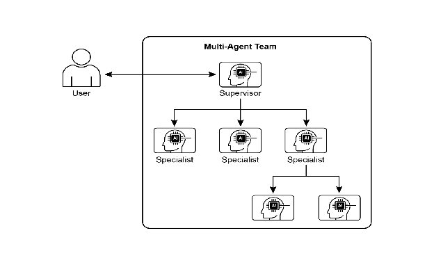
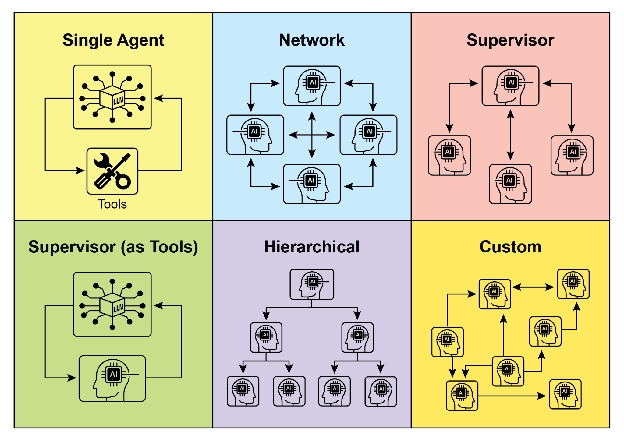
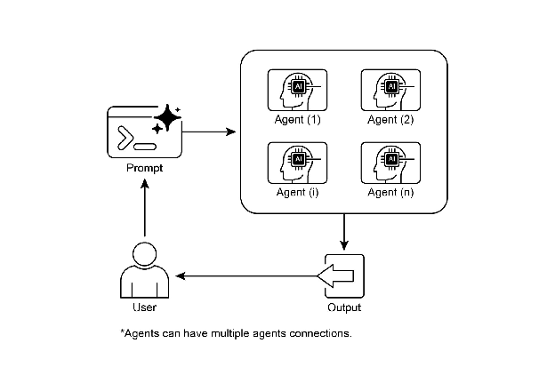

# Chapter 7: Multi-Agent Collaboration

단일형 agent 아키텍처는 명확히 정의된 문제에 효과적일 수 있으나, 복잡하고 다영역적인 작업에 직면할 때는 그 역량이 제한됨. Multi-Agent Collaboration 패턴은 시스템을 뚜렷하게 전문화된 agent들의 협력 앙상블로 구조화하여 이러한 한계를 해결함. 이 접근법은 고수준 목표를 개별 하위 문제로 분해하는 작업 분해 원칙에 기반함. 각 하위 문제는 해당 작업에 가장 적합한 특정 도구, 데이터 접근 권한 또는 추론 역량을 보유한 agent에게 할당됨.

예를 들어, 복잡한 연구 질의는 정보 검색을 위한 Research Agent, 통계 처리를 위한 Data Analysis Agent, 최종 보고서 생성을 위한 Synthesis Agent에 분해되어 할당될 수 있음. 이러한 시스템의 효율성은 단순히 작업 분할에만 있지 않고, agent 간 통신 메커니즘에 결정적으로 의존함. 이는 표준화된 통신 프로토콜과 공유 온톨로지를 요구하며, agent들이 데이터를 교환하고 하위 작업을 위임하며 최종 출력의 일관성을 보장하기 위해 행동을 조율할 수 있게 함.

이 분산 아키텍처는 향상된 모듈성, 확장성, 견고성 등 여러 이점을 제공함. 단일 agent의 실패가 전체 시스템 장애를 반드시 초래하지 않음. 협력은 multi-agent 시스템의 집단 성능이 앙상블 내 단일 agent의 잠재 역량을 초과하는 시너지 효과를 창출함.

# Multi-Agent Collaboration Pattern Overview

Multi-Agent Collaboration 패턴은 여러 독립적 또는 반독립적 agent가 공통 목표 달성을 위해 협력하는 시스템 설계를 포함함. 각 agent는 일반적으로 정의된 역할, 전체 목표와 정렬된 특정 목표, 그리고 잠재적으로 서로 다른 도구나 지식 베이스에 대한 접근 권한을 가짐. 이 패턴의 힘은 agent들 간의 상호작용과 시너지에 있음.

협력은 다양한 형태를 취할 수 있음:

* **Sequential Handoffs:** 한 agent가 작업을 완료하고 출력을 파이프라인의 다음 단계를 위해 다른 agent에게 전달함 (Planning 패턴과 유사하지만, 명시적으로 서로 다른 agent들이 관여함).
* **Parallel Processing:** 여러 agent가 문제의 다른 부분에 대해 동시에 작업하고, 그들의 결과가 나중에 결합됨.
* **Debate and Consensus:** 다양한 관점과 정보 소스를 가진 Agent들이 토론에 참여하여 옵션을 평가하고, 궁극적으로 합의 또는 더 정보에 입각한 결정에 도달하는 Multi-Agent Collaboration.
* **Hierarchical Structures:** 관리자 agent가 도구 접근 권한이나 플러그인 역량에 따라 작업자 agent에게 동적으로 작업을 위임하고 그들의 결과를 종합함. 각 agent는 단일 agent가 모든 도구를 처리하는 것이 아니라 관련 도구 그룹을 처리할 수도 있음.
* **Expert Teams:** 서로 다른 영역에서 전문 지식을 가진 agent들 (예: researcher, writer, editor)이 복잡한 출력을 생성하기 위해 협력함.

* ### **Critic-Reviewer:** Agent들이 계획, 초안 또는 답변과 같은 초기 출력을 생성함. 두 번째 agent 그룹이 정책, 보안, 규정 준수, 정확성, 품질 및 조직 목표와의 정렬에 대해 이 출력을 비판적으로 평가함. 원래 작성자 또는 최종 agent가 이 피드백을 기반으로 출력을 수정함. 이 패턴은 코드 생성, 연구 작성, 논리 검증, 윤리적 정렬 보장에 특히 효과적임. 이 접근법의 이점은 견고성 증가, 품질 향상, 환각 또는 오류 가능성 감소를 포함함.

Multi-agent 시스템 (Fig.1 참조)은 근본적으로 agent 역할과 책임의 명확화, agent들이 정보를 교환하는 통신 채널 구축, 그들의 협력 노력을 지시하는 작업 흐름 또는 상호작용 프로토콜의 공식화로 구성됨.



Fig.1: Multi-agent 시스템 예시

Crew AI와 Google ADK 같은 프레임워크는 agent, 작업 및 그들의 상호작용 절차 사양을 위한 구조를 제공하여 이 패러다임을 촉진하도록 설계됨. 이 접근법은 다양한 전문 지식이 필요한 과제, 여러 개별 단계를 포함하는 과제, 또는 동시 처리와 agent 간 정보 검증의 이점을 활용하는 과제에 특히 효과적임.

# Practical Applications & Use Cases

Multi-Agent Collaboration은 수많은 영역에 적용 가능한 강력한 패턴임:

* **Complex Research and Analysis:** Agent 팀이 연구 프로젝트에서 협력할 수 있음. 한 agent는 학술 데이터베이스 검색을 전문으로 하고, 다른 agent는 발견 사항 요약, 세 번째 agent는 추세 식별, 네 번째 agent는 정보를 보고서로 종합함. 이는 인간 연구 팀이 운영하는 방식을 반영함.
* **Software Development:** Agent들이 소프트웨어 구축에 협력하는 것을 상상해 보면, 한 agent는 요구사항 분석가, 다른 agent는 코드 생성기, 세 번째 agent는 테스터, 네 번째 agent는 문서 작성자가 될 수 있음. 그들은 컴포넌트를 구축하고 검증하기 위해 출력을 서로 전달할 수 있음.
* **Creative Content Generation:** 마케팅 캠페인 생성은 시장 조사 agent, 카피라이터 agent, 그래픽 디자인 agent (이미지 생성 도구 사용), 소셜 미디어 스케줄링 agent가 모두 함께 작업하는 것을 포함할 수 있음.
* **Financial Analysis:** Multi-agent 시스템이 금융 시장을 분석할 수 있음. Agent들은 주식 데이터 수집, 뉴스 감성 분석, 기술 분석 수행, 투자 권장 사항 생성을 전문으로 할 수 있음.
* **Customer Support Escalation:** 일선 지원 agent가 초기 문의를 처리하고, 필요 시 복잡한 문제를 전문가 agent (예: 기술 전문가 또는 청구 전문가)에게 에스컬레이션하여 문제 복잡성에 따른 순차적 핸드오프를 시연함.
* **Supply Chain Optimization:** Agent들이 공급망의 다른 노드 (공급업체, 제조업체, 유통업체)를 나타내고 수요 변화 또는 중단에 대응하여 재고 수준, 물류 및 스케줄링을 최적화하기 위해 협력할 수 있음.
* **Network Analysis & Remediation**: 자율 운영은 agentic 아키텍처, 특히 장애 식별에서 큰 이점을 얻음. 여러 agent가 문제를 분류하고 해결하기 위해 협력하여 최적의 조치를 제안함. 이러한 agent들은 기존 기계 학습 모델 및 도구와 통합하여 기존 시스템을 활용하면서 동시에 Generative AI의 이점을 제공할 수 있음.

전문화된 agent를 명확히 정의하고 그들의 상호관계를 세심하게 조율하는 역량은 개발자가 향상된 모듈성, 확장성, 그리고 단일 통합 agent로는 해결 불가능한 복잡성을 다룰 수 있는 시스템을 구축할 수 있게 함.

# Multi-Agent Collaboration: Exploring Interrelationships and Communication Structures

Agent들이 상호작용하고 통신하는 복잡한 방식을 이해하는 것은 효과적인 multi-agent 시스템 설계의 핵심임. Fig. 2에 나타난 것처럼, 가장 단순한 single-agent 시나리오에서 복잡하고 맞춤 설계된 협력 프레임워크까지 상호관계 및 통신 모델의 스펙트럼이 존재함. 각 모델은 고유한 장점과 과제를 제시하며, multi-agent 시스템의 전반적인 효율성, 견고성 및 적응성에 영향을 미침.

**1\. Single Agent:** 가장 기본적인 수준에서 "Single Agent"는 다른 엔티티와의 직접적인 상호작용이나 통신 없이 자율적으로 작동함. 이 모델은 구현하고 관리하기 간단하지만, 그 역량은 본질적으로 개별 agent의 범위와 리소스에 의해 제한됨. 독립적인 하위 문제로 분해 가능하고 각각 단일 자립형 agent에 의해 해결 가능한 작업에 적합함.

**2\. Network:** "Network" 모델은 여러 agent가 분산된 방식으로 서로 직접 상호작용하는 협력을 향한 중요한 단계를 나타냄. 통신은 일반적으로 peer-to-peer로 이루어지며, 정보, 리소스, 심지어 작업의 공유를 허용함. 이 모델은 한 agent의 실패가 전체 시스템을 반드시 무력화하지 않으므로 복원력을 촉진함. 그러나 대규모 비구조화 네트워크에서 통신 오버헤드를 관리하고 일관된 의사결정을 보장하는 것은 어려울 수 있음.

**3\. Supervisor:** "Supervisor" 모델에서는 전담 agent인 "supervisor"가 하위 agent 그룹의 활동을 감독하고 조율함. Supervisor는 통신, 작업 할당 및 충돌 해결을 위한 중앙 허브 역할을 함. 이 계층적 구조는 명확한 권한 라인을 제공하고 관리와 제어를 단순화할 수 있음. 그러나 단일 장애 지점 (supervisor)을 도입하고, supervisor가 많은 수의 하위 agent나 복잡한 작업으로 과부하되면 병목이 될 수 있음.

**4\. Supervisor as a Tool:** 이 모델은 "Supervisor" 개념의 미묘한 확장으로, supervisor의 역할이 직접적인 명령과 통제보다는 다른 agent에게 리소스, 지침 또는 분석 지원을 제공하는 것에 더 가까움. Supervisor는 다른 agent가 작업을 더 효과적으로 수행할 수 있도록 하는 도구, 데이터 또는 계산 서비스를 제공할 수 있으며, 반드시 모든 행동을 지시하지는 않음. 이 접근법은 엄격한 top-down 제어를 부과하지 않으면서 supervisor의 역량을 활용하는 것을 목표로 함.

**5\. Hierarchical:** "Hierarchical" 모델은 supervisor 개념을 확장하여 다층 조직 구조를 생성함. 여러 수준의 supervisor가 포함되며, 상위 수준 supervisor는 하위 수준 supervisor를 감독하고, 궁극적으로 최하위 계층에 운영 agent 집합이 있음. 이 구조는 각 계층에 의해 관리되는 하위 문제로 분해될 수 있는 복잡한 문제에 적합함. 정의된 경계 내에서 분산 의사결정을 허용하면서 확장성과 복잡성 관리에 구조화된 접근법을 제공함.



Fig. 2: Agent들이 통신하고 상호작용하는 다양한 방식.

**6\. Custom:** "Custom" 모델은 multi-agent 시스템 설계에서 궁극적인 유연성을 나타냄. 주어진 문제나 애플리케이션의 특정 요구사항에 정확히 맞춤화된 고유한 상호관계 및 통신 구조 생성을 허용함. 이전에 언급된 모델의 요소를 결합한 하이브리드 접근법이나, 환경의 고유한 제약과 기회에서 나타나는 완전히 새로운 설계를 포함할 수 있음. Custom 모델은 종종 특정 성능 지표를 최적화하거나, 매우 동적인 환경을 처리하거나, 도메인별 지식을 시스템 아키텍처에 통합해야 할 필요에서 발생함. Custom 모델 설계 및 구현은 일반적으로 multi-agent 시스템 원칙에 대한 깊은 이해와 통신 프로토콜, 조정 메커니즘 및 창발 행동에 대한 신중한 고려를 요구함.

요약하면, multi-agent 시스템의 상호관계 및 통신 모델 선택은 중요한 설계 결정임. 각 모델은 뚜렷한 장단점을 제공하며, 최적의 선택은 작업의 복잡성, agent의 수, 원하는 자율성 수준, 견고성의 필요성, 허용 가능한 통신 오버헤드 같은 요소에 달려 있음. Multi-agent 시스템의 미래 발전은 이러한 모델을 계속 탐색하고 개선하며, 협력 지능을 위한 새로운 패러다임을 개발할 것임.

# Hands-On code (Crew AI)

이 Python 코드는 CrewAI 프레임워크를 사용하여 AI 트렌드에 관한 블로그 포스트를 생성하는 AI 기반 crew를 정의함. 환경 설정으로 시작하여 .env 파일에서 API 키를 로드함. 애플리케이션의 핵심은 두 개의 agent 정의를 포함함: AI 트렌드를 찾고 요약하는 researcher와 연구 기반으로 블로그 포스트를 작성하는 writer.

두 개의 작업이 그에 따라 정의됨: 하나는 트렌드 연구용이고 다른 하나는 블로그 포스트 작성용이며, 작성 작업은 연구 작업의 출력에 의존함. 이러한 agent와 작업은 Crew로 조립되며, 작업이 순서대로 실행되는 순차적 프로세스를 지정함. Crew는 agent, 작업 및 언어 모델 (특히 "gemini-2.0-flash" 모델)로 초기화됨. main 함수는 kickoff() 메서드를 사용하여 이 crew를 실행하고, 원하는 출력을 생성하기 위해 agent 간 협력을 조율함. 마지막으로 코드는 crew 실행의 최종 결과인 생성된 블로그 포스트를 출력함.

```python
import os
from dotenv import load_dotenv
from crewai import Agent, Task, Crew, Process
from langchain_google_genai import ChatGoogleGenerativeAI

def setup_environment():
    """Loads environment variables and checks for the required API key."""
    load_dotenv()
    if not os.getenv("GOOGLE_API_KEY"):
        raise ValueError("GOOGLE_API_KEY not found. Please set it in your .env file.")

def main():
    """
    Initializes and runs the AI crew for content creation using the latest Gemini model.
    """
    setup_environment()
    # Define the language model to use.
    # Updated to a model from the Gemini 2.0 series for better performance and features.
    # For cutting-edge (preview) capabilities, you could use "gemini-2.5-flash".
    llm = ChatGoogleGenerativeAI(model="gemini-2.0-flash")

    # Define Agents with specific roles and goals
    researcher = Agent(
        role='Senior Research Analyst',
        goal='Find and summarize the latest trends in AI.',
        backstory="You are an experienced research analyst with a knack for identifying key trends and synthesizing information.",
        verbose=True,
        allow_delegation=False,
    )

    writer = Agent(
        role='Technical Content Writer',
        goal='Write a clear and engaging blog post based on research findings.',
        backstory="You are a skilled writer who can translate complex technical topics into accessible content.",
        verbose=True,
        allow_delegation=False,
    )

    # Define Tasks for the agents
    research_task = Task(
        description="Research the top 3 emerging trends in Artificial Intelligence in 2024-2025. Focus on practical applications and potential impact.",
        expected_output="A detailed summary of the top 3 AI trends, including key points and sources.",
        agent=researcher,
    )

    writing_task = Task(
        description="Write a 500-word blog post based on the research findings. The post should be engaging and easy for a general audience to understand.",
        expected_output="A complete 500-word blog post about the latest AI trends.",
        agent=writer,
        context=[research_task],
    )

    # Create the Crew
    blog_creation_crew = Crew(
        agents=[researcher, writer],
        tasks=[research_task, writing_task],
        process=Process.sequential,
        llm=llm,
        verbose=2 # Set verbosity for detailed crew execution logs
    )

    # Execute the Crew
    print("## Running the blog creation crew with Gemini 2.0 Flash... ##")
    try:
        result = blog_creation_crew.kickoff()
        print("\n------------------\n")
        print("## Crew Final Output ##")
        print(result)
    except Exception as e:
        print(f"\nAn unexpected error occurred: {e}")

if __name__ == "__main__":
    main()
```

이제 Google ADK 프레임워크 내에서 계층적, 병렬 및 순차적 조정 패러다임과 함께 agent를 운영 도구로 구현하는 것에 특히 중점을 둔 추가 예제를 살펴볼 것임.

# Hands-on Code (Google ADK)

다음 코드 예제는 parent-child 관계 생성을 통해 Google ADK 내에서 계층적 agent 구조 확립을 보여줌. 코드는 두 가지 유형의 agent를 정의함: LlmAgent와 BaseAgent에서 파생된 커스텀 TaskExecutor agent. TaskExecutor는 특정 non-LLM 작업을 위해 설계되었으며, 이 예제에서는 단순히 "Task finished successfully" 이벤트를 yield함. greeter라는 이름의 LlmAgent가 지정된 모델과 친근한 greeter 역할 지시로 초기화됨. 커스텀 TaskExecutor는 task\_doer로 인스턴스화됨. coordinator라는 parent LlmAgent가 생성되며, 모델과 지시사항이 포함됨. coordinator의 지시사항은 인사를 greeter에게, 작업 실행을 task\_doer에게 위임하도록 안내함. greeter와 task\_doer는 coordinator의 sub-agent로 추가되어 parent-child 관계를 확립함. 코드는 이 관계가 올바르게 설정되었음을 단언함. 마지막으로 agent 계층이 성공적으로 생성되었음을 나타내는 메시지를 출력함.

```python
from google.adk.agents import LlmAgent, BaseAgent
from google.adk.agents.invocation_context import InvocationContext
from google.adk.events import Event
from typing import AsyncGenerator

# Correctly implement a custom agent by extending BaseAgent
class TaskExecutor(BaseAgent):
   """A specialized agent with custom, non-LLM behavior."""
   name: str = "TaskExecutor"
   description: str = "Executes a predefined task."

   async def _run_async_impl(self, context: InvocationContext) -> AsyncGenerator[Event, None]:
       """Custom implementation logic for the task."""
       # This is where your custom logic would go.
       # For this example, we'll just yield a simple event.
       yield Event(author=self.name, content="Task finished successfully.")

# Define individual agents with proper initialization
# LlmAgent requires a model to be specified.
greeter = LlmAgent(
   name="Greeter",
   model="gemini-2.0-flash-exp",
   instruction="You are a friendly greeter."
)

task_doer = TaskExecutor() # Instantiate our concrete custom agent

# Create a parent agent and assign its sub-agents
# The parent agent's description and instructions should guide its delegation logic.
coordinator = LlmAgent(
   name="Coordinator",
   model="gemini-2.0-flash-exp",
   description="A coordinator that can greet users and execute tasks.",
   instruction="When asked to greet, delegate to the Greeter. When asked to perform a task, delegate to the TaskExecutor.",
   sub_agents=[
       greeter,
       task_doer
   ]
)

# The ADK framework automatically establishes the parent-child relationships.
# These assertions will pass if checked after initialization.
assert greeter.parent_agent == coordinator
assert task_doer.parent_agent == coordinator
print("Agent hierarchy created successfully.")
```

이 코드 발췌는 Google ADK 프레임워크 내에서 LoopAgent를 사용하여 반복 워크플로우를 확립하는 것을 보여줌. 코드는 두 개의 agent를 정의함: ConditionChecker와 ProcessingStep. ConditionChecker는 세션 상태의 "status" 값을 확인하는 커스텀 agent임. "status"가 "completed"이면 ConditionChecker는 루프를 중지하는 이벤트를 escalate함. 그렇지 않으면 루프를 계속하는 이벤트를 yield함. ProcessingStep은 "gemini-2.0-flash-exp" 모델을 사용하는 LlmAgent임. 그 지시사항은 작업을 수행하고 최종 단계인 경우 세션 "status"를 "completed"로 설정하는 것임. StatusPoller라는 이름의 LoopAgent가 생성됨. StatusPoller는 max\_iterations=10으로 구성됨. StatusPoller는 ProcessingStep과 ConditionChecker 인스턴스를 sub-agent로 포함함. LoopAgent는 최대 10회 반복 동안 sub-agent를 순차적으로 실행하며, ConditionChecker가 상태가 "completed"임을 발견하면 중지함.

```python
import asyncio
from typing import AsyncGenerator
from google.adk.agents import LoopAgent, LlmAgent, BaseAgent
from google.adk.events import Event, EventActions
from google.adk.agents.invocation_context import InvocationContext

# Best Practice: Define custom agents as complete, self-describing classes.
class ConditionChecker(BaseAgent):
    """A custom agent that checks for a 'completed' status in the session state."""
    name: str = "ConditionChecker"
    description: str = "Checks if a process is complete and signals the loop to stop."

    async def _run_async_impl(
        self, context: InvocationContext
    ) -> AsyncGenerator[Event, None]:
        """Checks state and yields an event to either continue or stop the loop."""
        status = context.session.state.get("status", "pending")
        is_done = (status == "completed")
        if is_done:
            # Escalate to terminate the loop when the condition is met.
            yield Event(author=self.name, actions=EventActions(escalate=True))
        else:
            # Yield a simple event to continue the loop.
            yield Event(author=self.name, content="Condition not met, continuing loop.")

# Correction: The LlmAgent must have a model and clear instructions.
process_step = LlmAgent(
    name="ProcessingStep",
    model="gemini-2.0-flash-exp",
    instruction="You are a step in a longer process. Perform your task. If you are the final step, update session state by setting 'status' to 'completed'."
)

# The LoopAgent orchestrates the workflow.
poller = LoopAgent(
    name="StatusPoller",
    max_iterations=10,
    sub_agents=[
        process_step,
        ConditionChecker() # Instantiating the well-defined custom agent.
    ]
)

# This poller will now execute 'process_step'
# and then 'ConditionChecker'
# repeatedly until the status is 'completed' or 10 iterations
# have passed.
```

이 코드 발췌는 Google ADK 내에서 선형 워크플로우 구축을 위해 설계된 SequentialAgent 패턴을 설명함. 이 코드는 google.adk.agents 라이브러리를 사용하여 순차 agent 파이프라인을 정의함. 파이프라인은 step1과 step2 두 개의 agent로 구성됨. step1은 "Step1\_Fetch"로 이름 지어지며 그 출력은 세션 상태의 "data" 키 아래에 저장됨. step2는 "Step2\_Process"로 이름 지어지며 session.state\["data"\]에 저장된 정보를 분석하고 요약을 제공하도록 지시됨. "MyPipeline"이라는 이름의 SequentialAgent가 이러한 sub-agent의 실행을 조율함. 파이프라인이 초기 입력으로 실행되면 step1이 먼저 실행됨. step1의 응답은 세션 상태의 "data" 키 아래에 저장됨. 이후 step2가 실행되며, 지시사항에 따라 step1이 상태에 배치한 정보를 활용함. 이 구조는 한 agent의 출력이 다음 agent의 입력이 되는 워크플로우 구축을 허용함. 이는 다단계 AI 또는 데이터 처리 파이프라인을 생성하는 일반적인 패턴임.

```python
from google.adk.agents import SequentialAgent, Agent

# This agent's output will be saved to session.state["data"]
step1 = Agent(name="Step1_Fetch", output_key="data")

# This agent will use the data from the previous step.
# We instruct it on how to find and use this data.
step2 = Agent(
    name="Step2_Process",
    instruction="Analyze the information found in state['data'] and provide a summary."
)

pipeline = SequentialAgent(
    name="MyPipeline",
    sub_agents=[step1, step2]
)

# When the pipeline is run with an initial input, Step1 will execute,
# its response will be stored in session.state["data"], and then
# Step2 will execute, using the information from the state as instructed.
```

다음 코드 예제는 여러 agent 작업의 동시 실행을 촉진하는 Google ADK 내의 ParallelAgent 패턴을 보여줌. data\_gatherer는 weather\_fetcher와 news\_fetcher 두 개의 sub-agent를 동시에 실행하도록 설계됨. weather\_fetcher agent는 주어진 위치의 날씨를 가져와 결과를 session.state\["weather\_data"\]에 저장하도록 지시됨. 유사하게 news\_fetcher agent는 주어진 주제의 주요 뉴스 스토리를 검색하여 session.state\["news\_data"\]에 저장하도록 지시됨. 각 sub-agent는 "gemini-2.0-flash-exp" 모델을 사용하도록 구성됨. ParallelAgent는 이러한 sub-agent의 실행을 조율하여 병렬로 작동할 수 있게 함. weather\_fetcher와 news\_fetcher 모두의 결과가 수집되어 세션 상태에 저장됨. 마지막으로 예제는 agent 실행이 완료된 후 final\_state에서 수집된 날씨 및 뉴스 데이터에 액세스하는 방법을 보여줌.

```python
from google.adk.agents import Agent, ParallelAgent

# It's better to define the fetching logic as tools for the agents
# For simplicity in this example, we'll embed the logic in the agent's instruction.
# In a real-world scenario, you would use tools.

# Define the individual agents that will run in parallel
weather_fetcher = Agent(
    name="weather_fetcher",
    model="gemini-2.0-flash-exp",
    instruction="Fetch the weather for the given location and return only the weather report.",
    output_key="weather_data"  # The result will be stored in session.state["weather_data"]
)

news_fetcher = Agent(
    name="news_fetcher",
    model="gemini-2.0-flash-exp",
    instruction="Fetch the top news story for the given topic and return only that story.",
    output_key="news_data"      # The result will be stored in session.state["news_data"]
)

# Create the ParallelAgent to orchestrate the sub-agents
data_gatherer = ParallelAgent(
    name="data_gatherer",
    sub_agents=[
        weather_fetcher,
        news_fetcher
    ]
)
```

제공된 코드 세그먼트는 Google ADK 내에서 "Agent as a Tool" 패러다임을 예시하며, agent가 다른 agent의 역량을 함수 호출과 유사한 방식으로 활용할 수 있게 함. 구체적으로 코드는 Google의 LlmAgent 및 AgentTool 클래스를 사용하여 이미지 생성 시스템을 정의함. parent artist\_agent와 sub-agent image\_generator\_agent 두 개의 agent로 구성됨. generate\_image 함수는 이미지 생성을 시뮬레이션하는 간단한 도구로, 모의 이미지 데이터를 반환함. image\_generator\_agent는 받은 텍스트 프롬프트를 기반으로 이 도구를 사용할 책임이 있음. artist\_agent의 역할은 먼저 창의적인 이미지 프롬프트를 발명하는 것임. 그런 다음 AgentTool 래퍼를 통해 image\_generator\_agent를 호출함. AgentTool은 한 agent가 다른 agent를 도구로 사용할 수 있게 하는 브리지 역할을 함. artist\_agent가 image\_tool을 호출하면 AgentTool은 artist의 발명된 프롬프트로 image\_generator\_agent를 호출함. image\_generator\_agent는 그 프롬프트로 generate\_image 함수를 사용함. 마지막으로 생성된 이미지 (또는 모의 데이터)가 agent들을 통해 다시 반환됨. 이 아키텍처는 상위 agent가 작업을 수행하기 위해 하위 전문 agent를 조율하는 계층화된 agent 시스템을 보여줌.

```python
from google.adk.agents import LlmAgent
from google.adk.tools import agent_tool
from google.genai import types

# 1. A simple function tool for the core capability.
# This follows the best practice of separating actions from reasoning.
def generate_image(prompt: str) -> dict:
    """
    Generates an image based on a textual prompt.
    Args:
        prompt: A detailed description of the image to generate.
    Returns:
        A dictionary with the status and the generated image bytes.
    """
    print(f"TOOL: Generating image for prompt: '{prompt}'")
    # In a real implementation, this would call an image generation API.
    # For this example, we return mock image data.
    mock_image_bytes = b"mock_image_data_for_a_cat_wearing_a_hat"
    return {
        "status": "success",
        # The tool returns the raw bytes, the agent will handle the Part creation.
        "image_bytes": mock_image_bytes,
        "mime_type": "image/png"
    }

# 2. Refactor the ImageGeneratorAgent into an LlmAgent.
# It now correctly uses the input passed to it.
image_generator_agent = LlmAgent(
    name="ImageGen",
    model="gemini-2.0-flash",
    description="Generates an image based on a detailed text prompt.",
    instruction=(
        "You are an image generation specialist. Your task is to take the user's request "
        "and use the `generate_image` tool to create the image. "
        "The user's entire request should be used as the 'prompt' argument for the tool. "
        "After the tool returns the image bytes, you MUST output the image."
    ),
    tools=[generate_image]
)

# 3. Wrap the corrected agent in an AgentTool.
# The description here is what the parent agent sees.
image_tool = agent_tool.AgentTool(
    agent=image_generator_agent,
    description="Use this tool to generate an image. The input should be a descriptive prompt of the desired image."
)

# 4. The parent agent remains unchanged. Its logic was correct.
artist_agent = LlmAgent(
    name="Artist",
    model="gemini-2.0-flash",
    instruction=(
        "You are a creative artist. First, invent a creative and descriptive prompt for an image. "
        "Then, use the `ImageGen` tool to generate the image using your prompt."
    ),
    tools=[image_tool]
)
```

# At a Glance

**What:** 복잡한 문제는 종종 단일 단일형 LLM 기반 agent의 역량을 초과함. 단독 agent는 다각적 작업의 모든 부분을 다루는 데 필요한 다양하고 전문화된 기술이나 특정 도구에 대한 접근이 부족할 수 있음. 이 한계는 병목을 생성하여 시스템의 전반적인 효과성과 확장성을 감소시킴. 결과적으로 정교하고 다영역적인 목표를 다루는 것이 비효율적이 되며 불완전하거나 차선책인 결과를 초래할 수 있음.

**Why:** Multi-Agent Collaboration 패턴은 여러 협력하는 agent의 시스템을 생성하여 표준화된 솔루션을 제공함. 복잡한 문제는 더 작고 관리 가능한 하위 문제로 분해됨. 각 하위 문제는 그것을 해결하는 데 필요한 정확한 도구와 역량을 가진 전문 agent에게 할당됨. 이러한 agent들은 순차적 핸드오프, 병렬 워크스트림 또는 계층적 위임과 같은 정의된 통신 프로토콜과 상호작용 모델을 통해 함께 작동함. 이 agentic 분산 접근법은 시너지 효과를 창출하여 그룹이 단일 agent로는 불가능한 결과를 달성할 수 있게 함.

**Rule of thumb:** 작업이 단일 agent에게 너무 복잡하고 전문화된 기술이나 도구가 필요한 뚜렷한 하위 작업으로 분해될 수 있을 때 이 패턴을 사용함. 복잡한 연구 및 분석, 소프트웨어 개발 또는 창의적 콘텐츠 생성과 같이 다양한 전문 지식, 병렬 처리 또는 여러 단계가 있는 구조화된 워크플로우에서 이점을 얻는 문제에 이상적임.

**Visual summary**



Fig.3: Multi-Agent 디자인 패턴

# Key Takeaways

* Multi-agent collaboration은 여러 agent가 공통 목표 달성을 위해 함께 작업하는 것을 포함함.
* 이 패턴은 전문화된 역할, 분산된 작업 및 agent 간 통신을 활용함.
* 협력은 순차적 핸드오프, 병렬 처리, 토론 또는 계층적 구조와 같은 형태를 취할 수 있음.
* 이 패턴은 다양한 전문 지식이나 여러 뚜렷한 단계가 필요한 복잡한 문제에 이상적임.

# Conclusion

이 장에서는 Multi-Agent Collaboration 패턴을 탐구하여 시스템 내에서 여러 전문 agent를 조율하는 이점을 보여줌. 다양한 협력 모델을 검토하며, 다양한 영역에서 복잡하고 다각적인 문제를 다루는 데 있어 패턴의 필수적인 역할을 강조함. Agent 협력을 이해하는 것은 자연스럽게 외부 환경과의 상호작용에 대한 탐구로 이어짐.

# References

1. Multi-Agent Collaboration Mechanisms: A Survey of LLMs, [https://arxiv.org/abs/2501.06322](https://arxiv.org/abs/2501.06322)
2. Multi-Agent System — The Power of Collaboration, [https://aravindakumar.medium.com/introducing-multi-agent-frameworks-the-power-of-collaboration-e9db31bba1b6](https://aravindakumar.medium.com/introducing-multi-agent-frameworks-the-power-of-collaboration-e9db31bba1b6)


