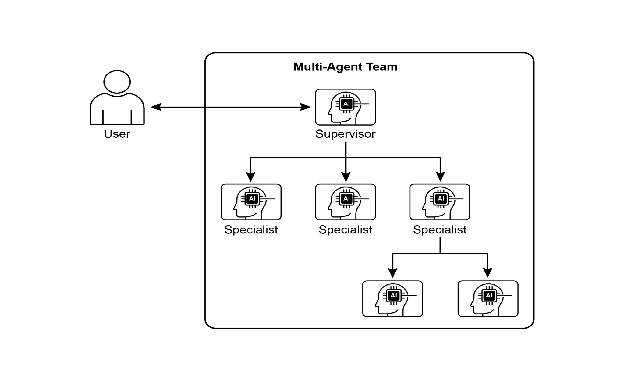
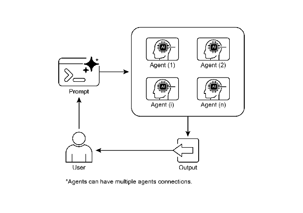

# Chapter 7: Multi-Agent Collaboration

While a monolithic agent architecture can be effective for well-defined problems, its capabilities are often constrained when faced with complex, multi-domain tasks. The Multi-Agent Collaboration pattern addresses these limitations by structuring a system as a cooperative ensemble of distinct, specialized agents. This approach is predicated on the principle of task decomposition, where a high-level objective is broken down into discrete sub-problems. Each sub-problem is then assigned to an agent possessing the specific tools, data access, or reasoning capabilities best suited for that task.

For example, a complex research query might be decomposed and assigned to a Research Agent for information retrieval, a Data Analysis Agent for statistical processing, and a Synthesis Agent for generating the final report. The efficacy of such a system is not merely due to the division of labor but is critically dependent on the mechanisms for inter-agent communication. This requires a standardized communication protocol and a shared ontology, allowing agents to exchange data, delegate sub-tasks, and coordinate their actions to ensure the final output is coherent.

This distributed architecture offers several advantages, including enhanced modularity, scalability, and robustness, as the failure of a single agent does not necessarily cause a total system failure. The collaboration allows for a synergistic outcome where the collective performance of the multi-agent system surpasses the potential capabilities of any single agent within the ensemble.

# Multi-Agent Collaboration Pattern Overview

The Multi-Agent Collaboration pattern involves designing systems where multiple independent or semi-independent agents work together to achieve a common goal. Each agent typically has a defined role, specific goals aligned with the overall objective, and potentially access to different tools or knowledge bases. The power of this pattern lies in the interaction and synergy between these agents.

Collaboration can take various forms:

* **Sequential Handoffs:** One agent completes a task and passes its output to another agent for the next step in a pipeline (similar to the Planning pattern, but explicitly involving different agents).  
* **Parallel Processing:** Multiple agents work on different parts of a problem simultaneously, and their results are later combined.  
* **Debate and Consensus:** Multi-Agent Collaboration where Agents with varied perspectives and information sources engage in discussions to evaluate options, ultimately reaching a consensus or a more informed decision.  
* **Hierarchical Structures:** A manager agent might delegate tasks to worker agents dynamically based on their tool access or plugin capabilities and synthesize their results. Each agent can also handle relevant groups of tools, rather than a single agent handling all the tools.  
* **Expert Teams:** Agents with specialized knowledge in different domains (e.g., a researcher, a writer, an editor) collaborate to produce a complex output.

* ### **Critic-Reviewer:** Agents create initial outputs such as plans, drafts, or answers. A second group of agents then critically assesses this output for adherence to policies, security, compliance, correctness, quality, and alignment with organizational objectives. The original creator or a final agent revises the output based on this feedback. This pattern is particularly effective for code generation, research writing, logic checking, and ensuring ethical alignment. The advantages of this approach include increased robustness, improved quality, and a reduced likelihood of hallucinations or errors.

A multi-agent system (see Fig.1) fundamentally comprises the delineation of agent roles and responsibilities, the establishment of communication channels through which agents exchange information, and the formulation of a task flow or interaction protocol that directs their collaborative endeavors.



Fig.1: Example of multi-agent system

Frameworks such as Crew AI and Google ADK are engineered to facilitate this paradigm by providing structures for the specification of agents, tasks, and their interactive procedures. This approach is particularly effective for challenges necessitating a variety of specialized knowledge, encompassing multiple discrete phases, or leveraging the advantages of concurrent processing and the corroboration of information across agents.

# Practical Applications & Use Cases

Multi-Agent Collaboration is a powerful pattern applicable across numerous domains:

* **Complex Research and Analysis:** A team of agents could collaborate on a research project. One agent might specialize in searching academic databases, another in summarizing findings, a third in identifying trends, and a fourth in synthesizing the information into a report. This mirrors how a human research team might operate.  
* **Software Development:** Imagine agents collaborating on building software. One agent could be a requirements analyst, another a code generator, a third a tester, and a fourth a documentation writer. They could pass outputs between each other to build and verify components.  
* **Creative Content Generation:** Creating a marketing campaign could involve a market research agent, a copywriter agent, a graphic design agent (using image generation tools), and a social media scheduling agent, all working together.  
* **Financial Analysis:** A multi-agent system could analyze financial markets. Agents might specialize in fetching stock data, analyzing news sentiment, performing technical analysis, and generating investment recommendations.  
* **Customer Support Escalation:** A front-line support agent could handle initial queries, escalating complex issues to a specialist agent (e.g., a technical expert or a billing specialist) when needed, demonstrating a sequential handoff based on problem complexity.  
* **Supply Chain Optimization:** Agents could represent different nodes in a supply chain (suppliers, manufacturers, distributors) and collaborate to optimize inventory levels, logistics, and scheduling in response to changing demand or disruptions.  
* **Network Analysis & Remediation**: Autonomous operations benefit greatly from an agentic architecture, particularly in failure pinpointing. Multiple agents can collaborate to triage and remediate issues, suggesting optimal actions. These agents can also integrate with traditional machine learning models and tooling, leveraging existing systems while simultaneously offering the advantages of Generative AI.

The capacity to delineate specialized agents and meticulously orchestrate their interrelationships empowers developers to construct systems exhibiting enhanced modularity, scalability, and the ability to address complexities that would prove insurmountable for a singular, integrated agent. 

# Multi-Agent Collaboration: Exploring Interrelationships and Communication Structures

Understanding the intricate ways in which agents interact and communicate is fundamental to designing effective multi-agent systems. As depicted in Fig. 2, a spectrum of interrelationship and communication models exists, ranging from the simplest single-agent scenario to complex, custom-designed collaborative frameworks. Each model presents unique advantages and challenges, influencing the overall efficiency, robustness, and adaptability of the multi-agent system.

**1\. Single Agent:** At the most basic level, a "Single Agent" operates autonomously without direct interaction or communication with other entities. While this model is straightforward to implement and manage, its capabilities are inherently limited by the individual agent's scope and resources. It is suitable for tasks that are decomposable into independent sub-problems, each solvable by a single, self-sufficient agent.

**2\. Network:** The "Network" model represents a significant step towards collaboration, where multiple agents interact directly with each other in a decentralized fashion. Communication typically occurs peer-to-peer, allowing for the sharing of information, resources, and even tasks. This model fosters resilience, as the failure of one agent does not necessarily cripple the entire system. However, managing communication overhead and ensuring coherent decision-making in a large, unstructured network can be challenging.

**3\. Supervisor:** In the "Supervisor" model, a dedicated agent, the "supervisor," oversees and coordinates the activities of a group of subordinate agents. The supervisor acts as a central hub for communication, task allocation, and conflict resolution. This hierarchical structure offers clear lines of authority and can simplify management and control. However, it introduces a single point of failure (the supervisor) and can become a bottleneck if the supervisor is overwhelmed by a large number of subordinates or complex tasks.

**4\. Supervisor as a Tool:** This model is a nuanced extension of the "Supervisor" concept, where the supervisor's role is less about direct command and control and more about providing resources, guidance, or analytical support to other agents. The supervisor might offer tools, data, or computational services that enable other agents to perform their tasks more effectively, without necessarily dictating their every action. This approach aims to leverage the supervisor's capabilities without imposing rigid top-down control.

**5\. Hierarchical:** The "Hierarchical" model expands upon the supervisor concept to create a multi-layered organizational structure. This involves multiple levels of supervisors, with higher-level supervisors overseeing lower-level ones, and ultimately, a collection of operational agents at the lowest tier. This structure is well-suited for complex problems that can be decomposed into sub-problems, each managed by a specific layer of the hierarchy. It provides a structured approach to scalability and complexity management, allowing for distributed decision-making within defined boundaries.


Fig. 2: Agents communicate and interact in various ways.

**6\. Custom:** The "Custom" model represents the ultimate flexibility in multi-agent system design. It allows for the creation of unique interrelationship and communication structures tailored precisely to the specific requirements of a given problem or application. This can involve hybrid approaches that combine elements from the previously mentioned models, or entirely novel designs that emerge from the unique constraints and opportunities of the environment. Custom models often arise from the need to optimize for specific performance metrics, handle highly dynamic environments, or incorporate domain-specific knowledge into the system's architecture. Designing and implementing custom models typically requires a deep understanding of multi-agent systems principles and careful consideration of communication protocols, coordination mechanisms, and emergent behaviors.

In summary, the choice of interrelationship and communication model for a multi-agent system is a critical design decision. Each model offers distinct advantages and disadvantages, and the optimal choice depends on factors such as the complexity of the task, the number of agents, the desired level of autonomy, the need for robustness, and the acceptable communication overhead. Future advancements in multi-agent systems will likely continue to explore and refine these models, as well as develop new paradigms for collaborative intelligence.

# Hands-On code (Crew AI)

This Python code defines an AI-powered crew using the CrewAI framework to generate a blog post about AI trends. It starts by setting up the environment, loading API keys from a .env file. The core of the application involves defining two agents: a researcher to find and summarize AI trends, and a writer to create a blog post based on the research. 

Two tasks are defined accordingly: one for researching the trends and another for writing the blog post, with the writing task depending on the output of the research task. These agents and tasks are then assembled into a Crew, specifying a sequential process where tasks are executed in order. The Crew is initialized with the agents, tasks, and a language model (specifically the "gemini-2.0-flash" model). The main function executes this crew using the kickoff() method, orchestrating the collaboration between the agents to produce the desired output. Finally, the code prints the final result of the crew's execution, which is the generated blog post.

```python
import os
from dotenv import load_dotenv
from crewai import Agent, Task, Crew, Process
from langchain_google_genai import ChatGoogleGenerativeAI

def setup_environment():
    """Loads environment variables and checks for the required API key."""
    load_dotenv()
    if not os.getenv("GOOGLE_API_KEY"):
        raise ValueError("GOOGLE_API_KEY not found. Please set it in your .env file.")

def main():
    """
    Initializes and runs the AI crew for content creation using the latest Gemini model.
    """
    setup_environment()
    # Define the language model to use.
    # Updated to a model from the Gemini 2.0 series for better performance and features.
    # For cutting-edge (preview) capabilities, you could use "gemini-2.5-flash".
    llm = ChatGoogleGenerativeAI(model="gemini-2.0-flash")

    # Define Agents with specific roles and goals
    researcher = Agent(
        role='Senior Research Analyst',
        goal='Find and summarize the latest trends in AI.',
        backstory="You are an experienced research analyst with a knack for identifying key trends and synthesizing information.",
        verbose=True,
        allow_delegation=False,
    )

    writer = Agent(
        role='Technical Content Writer',
        goal='Write a clear and engaging blog post based on research findings.',
        backstory="You are a skilled writer who can translate complex technical topics into accessible content.",
        verbose=True,
        allow_delegation=False,
    )

    # Define Tasks for the agents
    research_task = Task(
        description="Research the top 3 emerging trends in Artificial Intelligence in 2024-2025. Focus on practical applications and potential impact.",
        expected_output="A detailed summary of the top 3 AI trends, including key points and sources.",
        agent=researcher,
    )

    writing_task = Task(
        description="Write a 500-word blog post based on the research findings. The post should be engaging and easy for a general audience to understand.",
        expected_output="A complete 500-word blog post about the latest AI trends.",
        agent=writer,
        context=[research_task],
    )

    # Create the Crew
    blog_creation_crew = Crew(
        agents=[researcher, writer],
        tasks=[research_task, writing_task],
        process=Process.sequential,
        llm=llm,
        verbose=2 # Set verbosity for detailed crew execution logs
    )

    # Execute the Crew
    print("## Running the blog creation crew with Gemini 2.0 Flash... ##")
    try:
        result = blog_creation_crew.kickoff()
        print("\n------------------\n")
        print("## Crew Final Output ##")
        print(result)
    except Exception as e:
        print(f"\nAn unexpected error occurred: {e}")

if __name__ == "__main__":
    main()
```

We will now delve into further examples within the Google ADK framework, with particular emphasis on hierarchical, parallel, and sequential coordination paradigms, alongside the implementation of an agent as an operational instrument.

# Hands-on Code (Google ADK)

The following code example demonstrates the establishment of a hierarchical agent structure within the Google ADK through the creation of a parent-child relationship. The code defines two types of agents: LlmAgent and a custom TaskExecutor agent derived from BaseAgent. The TaskExecutor is designed for specific, non-LLM tasks and in this example, it simply yields a "Task finished successfully" event. An LlmAgent named greeter is initialized with a specified model and instruction to act as a friendly greeter. The custom TaskExecutor is instantiated as task\_doer. A parent LlmAgent called coordinator is created, also with a model and instructions. The coordinator's instructions guide it to delegate greetings to the greeter and task execution to the task\_doer. The greeter and task\_doer are added as sub-agents to the coordinator, establishing a parent-child relationship. The code then asserts that this relationship is correctly set up. Finally, it prints a message indicating that the agent hierarchy has been successfully created.

```python
from google.adk.agents import LlmAgent, BaseAgent
from google.adk.agents.invocation_context import InvocationContext
from google.adk.events import Event
from typing import AsyncGenerator

# Correctly implement a custom agent by extending BaseAgent
class TaskExecutor(BaseAgent):
   """A specialized agent with custom, non-LLM behavior."""
   name: str = "TaskExecutor"
   description: str = "Executes a predefined task."

   async def _run_async_impl(self, context: InvocationContext) -> AsyncGenerator[Event, None]:
       """Custom implementation logic for the task."""
       # This is where your custom logic would go.
       # For this example, we'll just yield a simple event.
       yield Event(author=self.name, content="Task finished successfully.")

# Define individual agents with proper initialization
# LlmAgent requires a model to be specified.
greeter = LlmAgent(
   name="Greeter",
   model="gemini-2.0-flash-exp",
   instruction="You are a friendly greeter."
)

task_doer = TaskExecutor() # Instantiate our concrete custom agent

# Create a parent agent and assign its sub-agents
# The parent agent's description and instructions should guide its delegation logic.
coordinator = LlmAgent(
   name="Coordinator",
   model="gemini-2.0-flash-exp",
   description="A coordinator that can greet users and execute tasks.",
   instruction="When asked to greet, delegate to the Greeter. When asked to perform a task, delegate to the TaskExecutor.",
   sub_agents=[
       greeter,
       task_doer
   ]
)

# The ADK framework automatically establishes the parent-child relationships.
# These assertions will pass if checked after initialization.
assert greeter.parent_agent == coordinator
assert task_doer.parent_agent == coordinator
print("Agent hierarchy created successfully.")
```

This code excerpt illustrates the employment of the LoopAgent within the Google ADK framework to establish iterative workflows. The code defines two agents: ConditionChecker and ProcessingStep. ConditionChecker is a custom agent that checks a "status" value in the session state. If the "status" is "completed", ConditionChecker escalates an event to stop the loop. Otherwise, it yields an event to continue the loop. ProcessingStep is an LlmAgent using the "gemini-2.0-flash-exp" model. Its instruction is to perform a task and set the session "status" to "completed" if it's the final step. A LoopAgent named StatusPoller is created. StatusPoller is configured with max\_iterations=10. StatusPoller includes both ProcessingStep and an instance of ConditionChecker as sub-agents. The LoopAgent will execute the sub-agents sequentially for up to 10 iterations, stopping if ConditionChecker finds the status is "completed".

```python
import asyncio
from typing import AsyncGenerator
from google.adk.agents import LoopAgent, LlmAgent, BaseAgent
from google.adk.events import Event, EventActions
from google.adk.agents.invocation_context import InvocationContext

# Best Practice: Define custom agents as complete, self-describing classes.
class ConditionChecker(BaseAgent):
    """A custom agent that checks for a 'completed' status in the session state."""
    name: str = "ConditionChecker"
    description: str = "Checks if a process is complete and signals the loop to stop."

    async def _run_async_impl(
        self, context: InvocationContext
    ) -> AsyncGenerator[Event, None]:
        """Checks state and yields an event to either continue or stop the loop."""
        status = context.session.state.get("status", "pending")
        is_done = (status == "completed")
        if is_done:
            # Escalate to terminate the loop when the condition is met.
            yield Event(author=self.name, actions=EventActions(escalate=True))
        else:
            # Yield a simple event to continue the loop.
            yield Event(author=self.name, content="Condition not met, continuing loop.")

# Correction: The LlmAgent must have a model and clear instructions.
process_step = LlmAgent(
    name="ProcessingStep",
    model="gemini-2.0-flash-exp",
    instruction="You are a step in a longer process. Perform your task. If you are the final step, update session state by setting 'status' to 'completed'."
)

# The LoopAgent orchestrates the workflow.
poller = LoopAgent(
    name="StatusPoller",
    max_iterations=10,
    sub_agents=[
        process_step,
        ConditionChecker() # Instantiating the well-defined custom agent.
    ]
)

# This poller will now execute 'process_step'
# and then 'ConditionChecker'
# repeatedly until the status is 'completed' or 10 iterations
# have passed.
```

This code excerpt elucidates the SequentialAgent pattern within the Google ADK, engineered for the construction of linear workflows. This code defines a sequential agent pipeline using the google.adk.agents library. The pipeline consists of two agents, step1 and step2. step1 is named "Step1\_Fetch" and its output will be stored in the session state under the key "data". step2 is named "Step2\_Process" and is instructed to analyze the information stored in session.state\["data"\] and provide a summary. The SequentialAgent named "MyPipeline" orchestrates the execution of these sub-agents. When the pipeline is run with an initial input, step1 will execute first. The response from step1 will be saved into the session state under the key "data". Subsequently, step2 will execute, utilizing the information that step1 placed into the state as per its instruction. This structure allows for building workflows where the output of one agent becomes the input for the next. This is a common pattern in creating multi-step AI or data processing pipelines. 

```python
from google.adk.agents import SequentialAgent, Agent

# This agent's output will be saved to session.state["data"]
step1 = Agent(name="Step1_Fetch", output_key="data")

# This agent will use the data from the previous step.
# We instruct it on how to find and use this data.
step2 = Agent(
    name="Step2_Process",
    instruction="Analyze the information found in state['data'] and provide a summary."
)

pipeline = SequentialAgent(
    name="MyPipeline",
    sub_agents=[step1, step2]
)

# When the pipeline is run with an initial input, Step1 will execute,
# its response will be stored in session.state["data"], and then
# Step2 will execute, using the information from the state as instructed.
```

The following code example illustrates the ParallelAgent pattern within the Google ADK, which facilitates the concurrent execution of multiple agent tasks. The data\_gatherer is designed to run two sub-agents concurrently: weather\_fetcher and news\_fetcher. The weather\_fetcher agent is instructed to get the weather for a given location and store the result in session.state\["weather\_data"\]. Similarly, the news\_fetcher agent is instructed to retrieve the top news story for a given topic and store it in session.state\["news\_data"\]. Each sub-agent is configured to use the "gemini-2.0-flash-exp" model. The ParallelAgent orchestrates the execution of these sub-agents, allowing them to work in parallel. The results from both weather\_fetcher and news\_fetcher would be gathered and stored in the session state. Finally, the example shows how to access the collected weather and news data from the final\_state after the agent's execution is complete.

```python
from google.adk.agents import Agent, ParallelAgent

# It's better to define the fetching logic as tools for the agents
# For simplicity in this example, we'll embed the logic in the agent's instruction.
# In a real-world scenario, you would use tools.

# Define the individual agents that will run in parallel
weather_fetcher = Agent(
    name="weather_fetcher",
    model="gemini-2.0-flash-exp",
    instruction="Fetch the weather for the given location and return only the weather report.",
    output_key="weather_data"  # The result will be stored in session.state["weather_data"]
)

news_fetcher = Agent(
    name="news_fetcher",
    model="gemini-2.0-flash-exp",
    instruction="Fetch the top news story for the given topic and return only that story.",
    output_key="news_data"      # The result will be stored in session.state["news_data"]
)

# Create the ParallelAgent to orchestrate the sub-agents
data_gatherer = ParallelAgent(
    name="data_gatherer",
    sub_agents=[
        weather_fetcher,
        news_fetcher
    ]
)
```

The provided code segment exemplifies the "Agent as a Tool" paradigm within the Google ADK, enabling an agent to utilize the capabilities of another agent in a manner analogous to function invocation. Specifically, the code defines an image generation system using Google's LlmAgent and AgentTool classes. It consists of two agents: a parent artist\_agent and a sub-agent image\_generator\_agent. The generate\_image function is a simple tool that simulates image creation, returning mock image data. The image\_generator\_agent is responsible for using this tool based on a text prompt it receives. The artist\_agent's role is to first invent a creative image prompt. It then calls the image\_generator\_agent through an AgentTool wrapper. The AgentTool acts as a bridge, allowing one agent to use another agent as a tool. When the artist\_agent calls the image\_tool, the AgentTool invokes the image\_generator\_agent with the artist's invented prompt. The image\_generator\_agent then uses the generate\_image function with that prompt. Finally, the generated image (or mock data) is returned back up through the agents. This architecture demonstrates a layered agent system where a higher-level agent orchestrates a lower-level, specialized agent to perform a task.

```python
from google.adk.agents import LlmAgent
from google.adk.tools import agent_tool
from google.genai import types

# 1. A simple function tool for the core capability.
# This follows the best practice of separating actions from reasoning.
def generate_image(prompt: str) -> dict:
    """
    Generates an image based on a textual prompt.
    Args:
        prompt: A detailed description of the image to generate.
    Returns:
        A dictionary with the status and the generated image bytes.
    """
    print(f"TOOL: Generating image for prompt: '{prompt}'")
    # In a real implementation, this would call an image generation API.
    # For this example, we return mock image data.
    mock_image_bytes = b"mock_image_data_for_a_cat_wearing_a_hat"
    return {
        "status": "success",
        # The tool returns the raw bytes, the agent will handle the Part creation.
        "image_bytes": mock_image_bytes,
        "mime_type": "image/png"
    }

# 2. Refactor the ImageGeneratorAgent into an LlmAgent.
# It now correctly uses the input passed to it.
image_generator_agent = LlmAgent(
    name="ImageGen",
    model="gemini-2.0-flash",
    description="Generates an image based on a detailed text prompt.",
    instruction=(
        "You are an image generation specialist. Your task is to take the user's request "
        "and use the `generate_image` tool to create the image. "
        "The user's entire request should be used as the 'prompt' argument for the tool. "
        "After the tool returns the image bytes, you MUST output the image."
    ),
    tools=[generate_image]
)

# 3. Wrap the corrected agent in an AgentTool.
# The description here is what the parent agent sees.
image_tool = agent_tool.AgentTool(
    agent=image_generator_agent,
    description="Use this tool to generate an image. The input should be a descriptive prompt of the desired image."
)

# 4. The parent agent remains unchanged. Its logic was correct.
artist_agent = LlmAgent(
    name="Artist",
    model="gemini-2.0-flash",
    instruction=(
        "You are a creative artist. First, invent a creative and descriptive prompt for an image. "
        "Then, use the `ImageGen` tool to generate the image using your prompt."
    ),
    tools=[image_tool]
)
```

# At a Glance

**What:** Complex problems often exceed the capabilities of a single, monolithic LLM-based agent. A solitary agent may lack the diverse, specialized skills or access to the specific tools needed to address all parts of a multifaceted task. This limitation creates a bottleneck, reducing the system's overall effectiveness and scalability. As a result, tackling sophisticated, multi-domain objectives becomes inefficient and can lead to incomplete or suboptimal outcomes.

**Why:** The Multi-Agent Collaboration pattern offers a standardized solution by creating a system of multiple, cooperating agents. A complex problem is broken down into smaller, more manageable sub-problems. Each sub-problem is then assigned to a specialized agent with the precise tools and capabilities required to solve it. These agents work together through defined communication protocols and interaction models like sequential handoffs, parallel workstreams, or hierarchical delegation. This agentic, distributed approach creates a synergistic effect, allowing the group to achieve outcomes that would be impossible for any single agent.

**Rule of thumb:** Use this pattern when a task is too complex for a single agent and can be decomposed into distinct sub-tasks requiring specialized skills or tools. It is ideal for problems that benefit from diverse expertise, parallel processing, or a structured workflow with multiple stages, such as complex research and analysis, software development, or creative content generation.

**Visual summary**



Fig.3: Multi-Agent design pattern

# Key Takeaways

* Multi-agent collaboration involves multiple agents working together to achieve a common goal.  
* This pattern leverages specialized roles, distributed tasks, and inter-agent communication.  
* Collaboration can take forms like sequential handoffs, parallel processing, debate, or hierarchical structures.  
* This pattern is ideal for complex problems requiring diverse expertise or multiple distinct stages.

# Conclusion 

This chapter explored the Multi-Agent Collaboration pattern, demonstrating the benefits of orchestrating multiple specialized agents within systems. We examined various collaboration models, emphasizing the pattern's essential role in addressing complex, multifaceted problems across diverse domains. Understanding agent collaboration naturally leads to an inquiry into their interactions with the external environment.

# References

1. Multi-Agent Collaboration Mechanisms: A Survey of LLMs, [https://arxiv.org/abs/2501.06322](https://arxiv.org/abs/2501.06322)   
2. Multi-Agent System — The Power of Collaboration, [https://aravindakumar.medium.com/introducing-multi-agent-frameworks-the-power-of-collaboration-e9db31bba1b6](https://aravindakumar.medium.com/introducing-multi-agent-frameworks-the-power-of-collaboration-e9db31bba1b6) 


