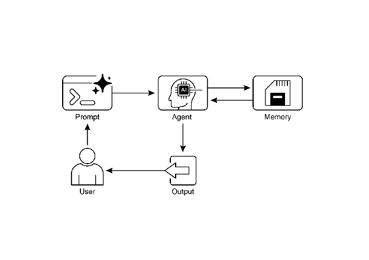

# Chapter 8: Memory Management

효과적인 memory management는 지능형 agent가 정보를 유지하는 데 필수적임. Agent는 인간처럼 다양한 유형의 memory가 필요하며 이를 통해 효율적으로 작동함. 본 장에서는 memory management, 특히 agent의 즉각적(short-term) 및 영구적(long-term) memory 요구사항을 다룸.

Agent system에서 memory는 agent가 과거 상호작용, 관찰, 학습 경험에서 얻은 정보를 유지하고 활용하는 능력을 의미함. 이 기능을 통해 agent는 정보에 기반한 의사결정을 내리고, 대화 맥락을 유지하며, 시간이 지남에 따라 개선됨. Agent memory는 일반적으로 두 가지 주요 유형으로 분류됨:

* **Short-Term Memory (Contextual Memory):** 작업 memory와 유사하게, 현재 처리 중이거나 최근 접근한 정보를 보유함. LLM을 사용하는 agent의 경우, short-term memory는 주로 context window 내에 존재함. 이 window에는 현재 상호작용의 최근 메시지, agent 응답, tool 사용 결과, agent reflection이 포함되며, 이 모든 것이 LLM의 후속 응답과 작업에 정보를 제공함. Context window는 용량이 제한되어 있어 agent가 직접 접근할 수 있는 최근 정보의 양이 제한됨. 효율적인 short-term memory 관리는 이 제한된 공간 내에 가장 관련성 높은 정보를 유지하는 것을 포함하며, 오래된 대화 segment를 요약하거나 핵심 세부사항을 강조하는 기술을 통해 가능함. 'long context' window를 가진 model의 등장은 단순히 이 short-term memory의 크기를 확장하여 단일 상호작용 내에서 더 많은 정보를 보유할 수 있게 함. 그러나 이 context는 여전히 ephemeral하며 session이 종료되면 손실되고, 매번 처리하는 데 비용이 많이 들고 비효율적임. 따라서 agent는 진정한 persistence를 달성하고, 과거 상호작용에서 정보를 recall하며, 지속적인 knowledge base를 구축하기 위해 별도의 memory 유형이 필요함.
* **Long-Term Memory (Persistent Memory):** Agent가 다양한 상호작용, 작업 또는 장기간에 걸쳐 유지해야 하는 정보의 repository 역할을 하며, long-term knowledge base와 유사함. Data는 일반적으로 agent의 즉각적인 처리 환경 외부에 저장되며, 종종 database, knowledge graph 또는 vector database에 저장됨. Vector database에서 정보는 numerical vector로 변환되어 저장되며, agent가 정확한 keyword 일치가 아닌 semantic similarity를 기반으로 data를 retrieve할 수 있게 하는데, 이를 semantic search라고 함. Agent가 long-term memory에서 정보가 필요할 때, 외부 storage를 query하고, 관련 data를 retrieve하며, 즉각적인 사용을 위해 short-term context에 통합하여 이전 knowledge와 현재 상호작용을 결합함.

# Practical Applications & Use Cases

Memory management는 agent가 시간이 지남에 따라 정보를 추적하고 지능적으로 수행하는 데 필수적임. 이는 agent가 기본적인 질문-응답 기능을 넘어서는 데 필수적임. 응용 프로그램은 다음과 같음:

* **Chatbot 및 Conversational AI:** 대화 흐름 유지는 short-term memory에 의존함. Chatbot은 일관된 응답을 제공하기 위해 이전 사용자 입력을 기억해야 함. Long-term memory를 통해 chatbot은 사용자 선호도, 과거 문제 또는 이전 논의를 recall하여 개인화되고 지속적인 상호작용을 제공할 수 있음.
* **Task-Oriented Agent:** 다단계 task를 관리하는 agent는 이전 단계, 현재 진행 상황 및 전체 목표를 추적하기 위해 short-term memory가 필요함. 이 정보는 task의 context 또는 임시 storage에 있을 수 있음. Long-term memory는 즉각적인 context에 없는 특정 사용자 관련 data에 접근하는 데 중요함.
* **Personalized Experience:** 맞춤형 상호작용을 제공하는 agent는 사용자 선호도, 과거 행동 및 개인 정보를 저장하고 retrieve하기 위해 long-term memory를 활용함. 이를 통해 agent는 응답과 제안을 조정할 수 있음.
* **Learning 및 Improvement:** Agent는 과거 상호작용에서 학습하여 성능을 개선할 수 있음. 성공적인 전략, 실수 및 새로운 정보는 long-term memory에 저장되어 향후 적응을 용이하게 함. Reinforcement learning agent는 이러한 방식으로 학습된 전략 또는 knowledge를 저장함.
* **Information Retrieval (RAG):** 질문 답변을 위해 설계된 agent는 종종 Retrieval Augmented Generation (RAG) 내에서 구현되는 long-term memory인 knowledge base에 접근함. Agent는 응답을 알리기 위해 관련 문서 또는 data를 retrieve함.
* **Autonomous System:** Robot 또는 자율주행차는 지도, 경로, 객체 위치 및 학습된 행동을 위한 memory가 필요함. 이는 즉각적인 주변 환경을 위한 short-term memory와 일반 환경 knowledge를 위한 long-term memory를 포함함.

Memory를 통해 agent는 history를 유지하고, 학습하며, 상호작용을 개인화하고, 복잡하고 시간 의존적인 문제를 관리할 수 있음.

# Hands-On Code: Memory Management in Google Agent Developer Kit (ADK)

Google Agent Developer Kit (ADK)는 실용적 적용을 위한 component를 포함하여 context 및 memory 관리를 위한 구조화된 방법을 제공함. 정보를 유지해야 하는 agent를 구축하려면 ADK의 Session, State 및 Memory를 확실히 이해하는 것이 중요함.

인간의 상호작용과 마찬가지로, agent는 일관되고 자연스러운 대화를 수행하기 위해 이전 교환을 recall할 수 있어야 함. ADK는 세 가지 핵심 개념과 관련 service를 통해 context 관리를 단순화함.

Agent와의 모든 상호작용은 고유한 대화 thread로 간주될 수 있음. Agent는 이전 상호작용의 data에 접근해야 할 수 있음. ADK는 이를 다음과 같이 구조화함:

* **Session:** 특정 상호작용에 대한 메시지 및 작업(Event)을 기록하고 해당 대화와 관련된 임시 data(State)를 저장하는 개별 chat thread.
* **State (session.state):** Session 내에 저장된 data로, 현재 활성 chat thread에만 관련된 정보를 포함함.
* **Memory:** 다양한 과거 chat 또는 외부 소스에서 sourced된 정보의 검색 가능한 repository로, 즉각적인 대화를 넘어 data retrieve를 위한 리소스 역할을 함.

ADK는 복잡하고 stateful하며 context-aware agent를 구축하는 데 필수적인 중요 component를 관리하기 위한 전용 service를 제공함. SessionService는 chat thread(Session 객체)를 관리하며 initiation, recording 및 termination을 처리하고, MemoryService는 long-term knowledge(Memory)의 storage 및 retrieval을 감독함.

SessionService와 MemoryService 모두 다양한 구성 옵션을 제공하여 사용자가 application 요구사항에 따라 storage 방법을 선택할 수 있음. In-memory 옵션은 테스트 목적으로 사용할 수 있지만 data는 restart 시 유지되지 않음. Persistent storage 및 확장성을 위해 ADK는 database 및 cloud 기반 service도 지원함.

## Session: Keeping Track of Each Chat

ADK의 Session 객체는 개별 chat thread를 추적하고 관리하도록 설계됨. Agent와 대화를 시작하면 SessionService가 `google.adk.sessions.Session`으로 표현되는 Session 객체를 생성함. 이 객체는 고유 식별자(id, app_name, user_id), Event 객체로서의 event 시간순 기록, state로 알려진 session별 임시 data용 storage 영역, 마지막 update를 나타내는 timestamp(last_update_time)를 포함하여 특정 대화 thread와 관련된 모든 data를 캡슐화함. 개발자는 일반적으로 SessionService를 통해 Session 객체와 간접적으로 상호작용함. SessionService는 새 session 시작, 이전 session 재개, session 활동 기록(state update 포함), 활성 session 식별 및 session data 제거 관리를 포함하는 대화 session의 lifecycle 관리를 담당함. ADK는 session history 및 임시 data를 위한 다양한 storage mechanism을 가진 여러 SessionService 구현을 제공하며, InMemorySessionService는 테스트에 적합하지만 application restart 시 data persistence를 제공하지 않음.

```python
# Example: Using InMemorySessionService
# This is suitable for local development and testing where data
# persistence across application restarts is not required.
from google.adk.sessions import InMemorySessionService

session_service = InMemorySessionService()
```

관리하는 database에 안정적으로 저장하려면 DatabaseSessionService가 있음.

```python
# Example: Using DatabaseSessionService
# This is suitable for production or development requiring persistent storage.
# You need to configure a database URL (e.g., for SQLite, PostgreSQL, etc.).
# Requires: pip install google-adk[sqlalchemy] and a database driver (e.g., psycopg2 for PostgreSQL)
from google.adk.sessions import DatabaseSessionService

# Example using a local SQLite file:
db_url = "sqlite:///./my_agent_data.db"
session_service = DatabaseSessionService(db_url=db_url)
```

Google Cloud의 확장 가능한 production을 위해 Vertex AI infrastructure를 사용하는 VertexAiSessionService도 있음.

```python
# Example: Using VertexAiSessionService
# This is suitable for scalable production on Google Cloud Platform, leveraging
# Vertex AI infrastructure for session management.
# Requires: pip install google-adk[vertexai] and GCP setup/authentication
from google.adk.sessions import VertexAiSessionService

PROJECT_ID = "your-gcp-project-id" # Replace with your GCP project ID
LOCATION = "us-central1" # Replace with your desired GCP location

# The app_name used with this service should correspond to the Reasoning Engine ID or name
REASONING_ENGINE_APP_NAME = "projects/your-gcp-project-id/locations/us-central1/reasoningEngines/your-engine-id" # Replace with your Reasoning Engine resource name

session_service = VertexAiSessionService(project=PROJECT_ID, location=LOCATION)

# When using this service, pass REASONING_ENGINE_APP_NAME to service methods:
# session_service.create_session(app_name=REASONING_ENGINE_APP_NAME, ...)
# session_service.get_session(app_name=REASONING_ENGINE_APP_NAME, ...)
# session_service.append_event(session, event, app_name=REASONING_ENGINE_APP_NAME)
# session_service.delete_session(app_name=REASONING_ENGINE_APP_NAME, ...)
```

적절한 SessionService 선택은 agent의 상호작용 history 및 임시 data가 저장되는 방식과 persistence를 결정하므로 중요함.

각 메시지 교환은 순환 process를 포함함: 메시지가 수신되고, Runner가 SessionService를 사용하여 Session을 retrieve하거나 establish하며, agent가 Session의 context(state 및 historical interaction)를 사용하여 메시지를 처리하고, agent가 응답을 생성하고 state를 update할 수 있으며, Runner가 이를 Event로 캡슐화하고, session_service.append_event method가 새 event를 기록하고 storage의 state를 update함. 그런 다음 Session은 다음 메시지를 기다림. 이상적으로는 상호작용이 종료될 때 delete_session method를 사용하여 session을 종료함. 이 process는 SessionService가 Session별 history 및 임시 data를 관리하여 연속성을 유지하는 방법을 보여줌.

## State: The Session's Scratchpad

ADK에서 chat thread를 나타내는 각 Session에는 특정 대화 기간 동안 agent의 임시 작업 memory와 유사한 state component가 포함됨. session.events는 전체 chat history를 기록하는 반면, session.state는 활성 chat과 관련된 동적 data point를 저장하고 update함.

기본적으로 session.state는 dictionary로 작동하여 data를 key-value pair로 저장함. 핵심 기능은 agent가 사용자 선호도, task 진행 상황, 증분 data 수집 또는 후속 agent 작업에 영향을 미치는 조건부 flag와 같은 일관된 대화에 필수적인 세부사항을 유지하고 관리할 수 있도록 하는 것임.

State의 구조는 string key와 string, number, boolean, list 및 이러한 기본 유형을 포함하는 dictionary를 포함한 serializable Python 유형의 값을 paired함. State는 동적이며 대화 전반에 걸쳐 진화함. 이러한 변경사항의 영속성은 구성된 SessionService에 따라 달라짐.

State 구성은 data scope 및 persistence를 정의하기 위해 key prefix를 사용하여 달성할 수 있음. Prefix가 없는 key는 session별임.

* user: prefix는 모든 session에서 user ID와 data를 연결함.
* app: prefix는 application의 모든 사용자 간에 공유되는 data를 지정함.
* temp: prefix는 현재 처리 turn에만 유효하며 영구적으로 저장되지 않는 data를 나타냄.

Agent는 단일 session.state dictionary를 통해 모든 state data에 접근함. SessionService는 data retrieval, merging 및 persistence를 처리함. State는 session_service.append_event()를 통해 session history에 Event를 추가할 때 update되어야 함. 이렇게 하면 정확한 추적, persistent service에서의 적절한 저장 및 state 변경의 안전한 처리가 보장됨.

1. **간단한 방법: output_key 사용 (Agent Text Reply용):** Agent의 최종 텍스트 응답을 state에 직접 저장하려는 경우 가장 쉬운 방법임. LlmAgent를 설정할 때 사용하려는 output_key를 지정하기만 하면 됨. Runner가 이를 확인하고 event를 append할 때 응답을 state에 저장하는 데 필요한 작업을 자동으로 생성함. output_key를 통한 state update를 보여주는 code example을 살펴보자.

```python
# Import necessary classes from the Google Agent Developer Kit (ADK)
from google.adk.agents import LlmAgent
from google.adk.sessions import InMemorySessionService, Session
from google.adk.runners import Runner
from google.genai.types import Content, Part

# Define an LlmAgent with an output_key.
greeting_agent = LlmAgent(
   name="Greeter",
   model="gemini-2.0-flash",
   instruction="Generate a short, friendly greeting.",
   output_key="last_greeting"
)

# --- Setup Runner and Session ---
app_name, user_id, session_id = "state_app", "user1", "session1"
session_service = InMemorySessionService()
runner = Runner(
   agent=greeting_agent,
   app_name=app_name,
   session_service=session_service
)

session = session_service.create_session(
   app_name=app_name,
   user_id=user_id,
   session_id=session_id
)

print(f"Initial state: {session.state}")

# --- Run the Agent ---
user_message = Content(parts=[Part(text="Hello")])
print("\n--- Running the agent ---")

for event in runner.run(
   user_id=user_id,
   session_id=session_id,
   new_message=user_message
):
   if event.is_final_response():
     print("Agent responded.")

# --- Check Updated State ---
# Correctly check the state *after* the runner has finished processing all events.
updated_session = session_service.get_session(app_name, user_id, session_id)
print(f"\nState after agent run: {updated_session.state}")
```

내부적으로 Runner는 output_key를 확인하고 append_event를 호출할 때 state_delta를 사용하여 필요한 작업을 자동으로 생성함.

2. **표준 방법: EventActions.state_delta 사용 (더 복잡한 Update용):** 여러 key를 한 번에 update하거나, 텍스트가 아닌 것을 저장하거나, user: 또는 app:와 같은 특정 scope를 target으로 하거나, agent의 최종 텍스트 reply와 연결되지 않은 update를 수행하는 등 더 복잡한 작업을 수행해야 하는 경우, state 변경사항의 dictionary(state_delta)를 수동으로 구축하고 append하는 Event의 EventActions 내에 포함시킴. 한 가지 example을 살펴보자:

```python
import time
from google.adk.tools.tool_context import ToolContext
from google.adk.sessions import InMemorySessionService

# --- Define the Recommended Tool-Based Approach ---
def log_user_login(tool_context: ToolContext) -> dict:
   """
   Updates the session state upon a user login event.
   This tool encapsulates all state changes related to a user login.

   Args:
       tool_context: Automatically provided by ADK, gives access to session state.

   Returns:
       A dictionary confirming the action was successful.
   """
   # Access the state directly through the provided context.
   state = tool_context.state

   # Get current values or defaults, then update the state.
   # This is much cleaner and co-locates the logic.
   login_count = state.get("user:login_count", 0) + 1
   state["user:login_count"] = login_count
   state["task_status"] = "active"
   state["user:last_login_ts"] = time.time()
   state["temp:validation_needed"] = True

   print("State updated from within the `log_user_login` tool.")

   return {
       "status": "success",
       "message": f"User login tracked. Total logins: {login_count}."
   }

# --- Demonstration of Usage ---
# In a real application, an LLM Agent would decide to call this tool.
# Here, we simulate a direct call for demonstration purposes.

# 1. Setup
session_service = InMemorySessionService()
app_name, user_id, session_id = "state_app_tool", "user3", "session3"

session = session_service.create_session(
   app_name=app_name,
   user_id=user_id,
   session_id=session_id,
   state={"user:login_count": 0, "task_status": "idle"}
)

print(f"Initial state: {session.state}")

# 2. Simulate a tool call (in a real app, the ADK Runner does this)
# We create a ToolContext manually just for this standalone example.
from google.adk.tools.tool_context import InvocationContext

mock_context = ToolContext(
   invocation_context=InvocationContext(
       app_name=app_name, user_id=user_id, session_id=session_id,
       session=session, session_service=session_service
   )
)

# 3. Execute the tool
log_user_login(mock_context)

# 4. Check the updated state
updated_session = session_service.get_session(app_name, user_id, session_id)
print(f"State after tool execution: {updated_session.state}")
# Expected output will show the same state change as the
# "Before" case,
# but the code organization is significantly cleaner
# and more robust.
```

이 code는 application에서 사용자 session state를 관리하기 위한 tool 기반 접근 방식을 보여줌. Tool로 작동하는 함수 *log_user_login*을 정의함. 이 tool은 사용자가 로그인할 때 session state를 update하는 역할을 함.
함수는 ADK에서 제공하는 ToolContext 객체를 가져와 session의 state dictionary에 접근하고 수정함. Tool 내부에서 *user:login_count*를 증가시키고, t*ask_status*를 "active"로 설정하며, *user:last_login_ts (timestamp)*를 기록하고, 임시 flag temp:validation_needed를 추가함.

Code의 demonstration 부분은 이 tool이 어떻게 사용되는지 시뮬레이션함. In-memory session service를 설정하고 일부 사전 정의된 state로 초기 session을 생성함. 그런 다음 ADK Runner가 tool을 실행하는 환경을 모방하기 위해 ToolContext를 수동으로 생성함. Mock context로 log_user_login 함수를 호출함. 마지막으로 code는 session을 다시 retrieve하여 tool 실행으로 state가 update되었음을 보여줌. 목표는 tool 내에 state 변경사항을 캡슐화하면 tool 외부에서 직접 state를 조작하는 것과 비교하여 code가 더 깔끔하고 체계적으로 만드는 방법을 보여주는 것임.

Session을 retrieve한 후 `session.state` dictionary를 직접 수정하는 것은 표준 event 처리 mechanism을 우회하므로 강력히 권장하지 않음. 이러한 직접적인 변경사항은 session의 event history에 기록되지 않으며, 선택한 `SessionService`에 의해 persist되지 않을 수 있고, concurrency 문제를 일으킬 수 있으며, timestamp와 같은 필수 metadata를 update하지 않음. Session state를 update하는 권장 방법은 `LlmAgent`에서 `output_key` parameter를 사용하거나(특히 agent의 최종 텍스트 응답용) `session_service.append_event()`를 통해 event를 append할 때 `EventActions.state_delta` 내에 state 변경사항을 포함하는 것임. `session.state`는 주로 기존 data를 읽는 데 사용되어야 함.

요약하자면, state를 설계할 때 간단하게 유지하고, 기본 data 유형을 사용하며, key에 명확한 이름을 지정하고 prefix를 올바르게 사용하며, deep nesting을 피하고, 항상 append_event process를 사용하여 state를 update해야 함.

## Memory: Long-Term Knowledge with MemoryService

Agent system에서 Session component는 단일 대화에 특정한 현재 chat history(event) 및 임시 data(state)의 기록을 유지함. 그러나 agent가 여러 상호작용에 걸쳐 정보를 유지하거나 외부 data에 접근하려면 long-term knowledge 관리가 필요함. 이는 MemoryService에 의해 촉진됨.

```python
# Example: Using InMemoryMemoryService
# This is suitable for local development and testing where data
# persistence across application restarts is not required.
# Memory content is lost when the app stops.
from google.adk.memory import InMemoryMemoryService

memory_service = InMemoryMemoryService()
```

Session 및 State는 단일 chat session의 short-term memory로 개념화할 수 있는 반면, MemoryService에서 관리하는 Long-Term Knowledge는 persistent하고 검색 가능한 repository로 기능함. 이 repository에는 여러 과거 상호작용 또는 외부 소스의 정보가 포함될 수 있음. BaseMemoryService interface로 정의된 MemoryService는 이 검색 가능한 long-term knowledge를 관리하기 위한 표준을 설정함. 주요 기능에는 정보 추가(add_session_to_memory method를 사용하여 session에서 content를 추출하고 저장하는 것 포함) 및 정보 retrieve(agent가 store를 query하고 search_memory method를 사용하여 관련 data를 받을 수 있도록 함)가 포함됨.

ADK는 이 long-term knowledge store를 생성하기 위한 여러 구현을 제공함. InMemoryMemoryService는 테스트 목적에 적합한 임시 storage 솔루션을 제공하지만 data는 application restart 시 보존되지 않음. Production 환경의 경우 일반적으로 VertexAiRagMemoryService가 활용됨. 이 service는 Google Cloud의 Retrieval Augmented Generation (RAG) service를 활용하여 확장 가능하고 persistent하며 semantic search 기능을 가능하게 함(RAG에 대한 chapter 14도 참조).

```python
# Example: Using VertexAiRagMemoryService
# This is suitable for scalable production on GCP, leveraging
# Vertex AI RAG (Retrieval Augmented Generation) for persistent,
# searchable memory.
# Requires: pip install google-adk[vertexai], GCP
# setup/authentication, and a Vertex AI RAG Corpus.
from google.adk.memory import VertexAiRagMemoryService

# The resource name of your Vertex AI RAG Corpus
RAG_CORPUS_RESOURCE_NAME = "projects/your-gcp-project-id/locations/us-central1/ragCorpora/your-corpus-id" # Replace with your Corpus resource name

# Optional configuration for retrieval behavior
SIMILARITY_TOP_K = 5 # Number of top results to retrieve
VECTOR_DISTANCE_THRESHOLD = 0.7 # Threshold for vector similarity

memory_service = VertexAiRagMemoryService(
   rag_corpus=RAG_CORPUS_RESOURCE_NAME,
   similarity_top_k=SIMILARITY_TOP_K,
   vector_distance_threshold=VECTOR_DISTANCE_THRESHOLD
)

# When using this service, methods like add_session_to_memory
# and search_memory will interact with the specified Vertex AI
# RAG Corpus.
```

# Hands-on code: Memory Management in LangChain and LangGraph

LangChain 및 LangGraph에서 Memory는 지능적이고 자연스러운 conversational application을 만드는 데 중요한 component임. Agent가 과거 상호작용에서 정보를 기억하고, feedback에서 학습하며, 사용자 선호도에 적응할 수 있게 함. LangChain의 memory 기능은 저장된 history를 참조하여 현재 prompt를 풍부하게 한 다음 향후 사용을 위해 최신 교환을 기록하여 이를 위한 기반을 제공함. Agent가 더 복잡한 task를 처리함에 따라 이 기능은 효율성과 사용자 만족도 모두에 필수적임.

**Short-Term Memory:** 이것은 thread-scoped로, 단일 session 또는 thread 내에서 진행 중인 대화를 추적함을 의미함. 즉각적인 context를 제공하지만 전체 history는 LLM의 context window에 도전할 수 있어 잠재적으로 오류 또는 낮은 성능으로 이어질 수 있음. LangGraph는 checkpointer를 통해 persist되는 agent의 state의 일부로 short-term memory를 관리하여 언제든지 thread를 재개할 수 있음.

**Long-Term Memory:** 이것은 session 간에 사용자별 또는 application 수준 data를 저장하며 conversational thread 간에 공유됨. 사용자 정의 "namespace"에 저장되며 언제든지 모든 thread에서 recall할 수 있음. LangGraph는 long-term memory를 저장하고 recall하기 위한 store를 제공하여 agent가 knowledge를 무기한 유지할 수 있게 함.

LangChain은 manual 제어에서 chain 내 자동 통합에 이르기까지 대화 history를 관리하기 위한 여러 tool을 제공함.

**ChatMessageHistory: Manual Memory Management.** 공식 chain 외부에서 대화 history에 대한 직접적이고 간단한 제어를 위해 ChatMessageHistory class가 이상적임. 대화 교환의 수동 추적을 허용함.

```python
from langchain.memory import ChatMessageHistory

# Initialize the history object
history = ChatMessageHistory()

# Add user and AI messages
history.add_user_message("I'm heading to New York next week.")
history.add_ai_message("Great! It's a fantastic city.")

# Access the list of messages
print(history.messages)
```

**ConversationBufferMemory: Automated Memory for Chain**. Memory를 chain에 직접 통합하기 위해 ConversationBufferMemory가 일반적인 선택임. 대화의 buffer를 보유하고 prompt에 사용할 수 있게 만듦. 동작은 두 가지 주요 parameter로 customize할 수 있음:

* memory_key: Chat history를 보유할 prompt의 변수 이름을 지정하는 string. 기본값은 "history"임.
* return_messages: History의 형식을 지정하는 boolean.
  * False(기본값)인 경우 표준 LLM에 이상적인 단일 형식화된 string을 반환함.
  * True인 경우 Chat Model에 권장되는 형식인 메시지 객체 목록을 반환함.

```python
from langchain.memory import ConversationBufferMemory

# Initialize memory
memory = ConversationBufferMemory()

# Save a conversation turn
memory.save_context({"input": "What's the weather like?"}, {"output": "It's sunny today."})

# Load the memory as a string
print(memory.load_memory_variables({}))
```

이 memory를 LLMChain에 통합하면 model이 대화의 history에 접근하고 맥락적으로 관련된 응답을 제공할 수 있음

```python
from langchain_openai import OpenAI
from langchain.chains import LLMChain
from langchain.prompts import PromptTemplate
from langchain.memory import ConversationBufferMemory

# 1. Define LLM and Prompt
llm = OpenAI(temperature=0)

template = """You are a helpful travel agent.

Previous conversation:
{history}

New question: {question}

Response:"""

prompt = PromptTemplate.from_template(template)

# 2. Configure Memory
# The memory_key "history" matches the variable in the prompt
memory = ConversationBufferMemory(memory_key="history")

# 3. Build the Chain
conversation = LLMChain(llm=llm, prompt=prompt, memory=memory)

# 4. Run the Conversation
response = conversation.predict(question="I want to book a flight.")
print(response)

response = conversation.predict(question="My name is Sam, by the way.")
print(response)

response = conversation.predict(question="What was my name again?")
print(response)
```

Chat model과의 향상된 효과를 위해 `return_messages=True`를 설정하여 메시지 객체의 구조화된 목록을 사용하는 것이 권장됨.

```python
from langchain_openai import ChatOpenAI
from langchain.chains import LLMChain
from langchain.memory import ConversationBufferMemory
from langchain_core.prompts import (
   ChatPromptTemplate,
   MessagesPlaceholder,
   SystemMessagePromptTemplate,
   HumanMessagePromptTemplate,
)

# 1. Define Chat Model and Prompt
llm = ChatOpenAI()

prompt = ChatPromptTemplate(
   messages=[
       SystemMessagePromptTemplate.from_template("You are a friendly assistant."),
       MessagesPlaceholder(variable_name="chat_history"),
       HumanMessagePromptTemplate.from_template("{question}")
   ]
)

# 2. Configure Memory
# return_messages=True is essential for chat models
memory = ConversationBufferMemory(memory_key="chat_history", return_messages=True)

# 3. Build the Chain
conversation = LLMChain(llm=llm, prompt=prompt, memory=memory)

# 4. Run the Conversation
response = conversation.predict(question="Hi, I'm Jane.")
print(response)

response = conversation.predict(question="Do you remember my name?")
print(response)
```

**Types of Long-Term Memory**: Long-term memory를 통해 system은 다른 대화 간에 정보를 유지하여 더 깊은 수준의 context 및 personalization을 제공함. 인간 memory와 유사한 세 가지 유형으로 나눌 수 있음:

* **Semantic Memory: Remembering Facts:** 사용자 선호도 또는 domain knowledge와 같은 특정 사실 및 개념을 유지하는 것을 포함함. Agent의 응답을 ground하는 데 사용되어 더 개인화되고 관련성 높은 상호작용으로 이어짐. 이 정보는 지속적으로 update되는 사용자 "profile"(JSON 문서) 또는 개별 사실 문서의 "collection"으로 관리할 수 있음.
* **Episodic Memory: Remembering Experiences:** 과거 event 또는 작업을 recall하는 것을 포함함. AI agent의 경우 episodic memory는 종종 task를 수행하는 방법을 기억하는 데 사용됨. 실제로 few-shot example prompting을 통해 자주 구현되며, 여기서 agent는 과거 성공적인 상호작용 sequence에서 학습하여 task를 올바르게 수행함.
* **Procedural Memory: Remembering Rules:** 이것은 task를 수행하는 방법의 memory로, 종종 system prompt에 포함된 agent의 핵심 지침 및 행동임. Agent가 자체 prompt를 수정하여 적응하고 개선하는 것이 일반적임. 효과적인 기술은 "Reflection"으로, 여기서 agent는 현재 지침 및 최근 상호작용으로 prompted된 다음 자체 지침을 개선하도록 요청됨.

다음은 agent가 LangGraph BaseStore에 저장된 procedural memory를 update하기 위해 reflection을 사용하는 방법을 보여주는 pseudo-code임

```python
# Node that updates the agent's instructions
def update_instructions(state: State, store: BaseStore):
   namespace = ("instructions",)
   # Get the current instructions from the store
   current_instructions = store.search(namespace)[0]

   # Create a prompt to ask the LLM to reflect on the conversation
   # and generate new, improved instructions
   prompt = prompt_template.format(
       instructions=current_instructions.value["instructions"],
       conversation=state["messages"]
   )

   # Get the new instructions from the LLM
   output = llm.invoke(prompt)
   new_instructions = output['new_instructions']

   # Save the updated instructions back to the store
   store.put(("agent_instructions",), "agent_a", {"instructions": new_instructions})

# Node that uses the instructions to generate a response
def call_model(state: State, store: BaseStore):
   namespace = ("agent_instructions", )
   # Retrieve the latest instructions from the store
   instructions = store.get(namespace, key="agent_a")[0]

   # Use the retrieved instructions to format the prompt
   prompt = prompt_template.format(instructions=instructions.value["instructions"])
   # ... application logic continues
```

LangGraph는 long-term memory를 store에 JSON 문서로 저장함. 각 memory는 사용자 정의 namespace(폴더와 같음) 및 고유 key(파일 이름과 같음) 아래에 구성됨. 이 계층 구조를 통해 정보를 쉽게 구성하고 retrieve할 수 있음. 다음 code는 InMemoryStore를 사용하여 memory를 put, get 및 search하는 방법을 보여줌.

```python
from langgraph.store.memory import InMemoryStore

# A placeholder for a real embedding function
def embed(texts: list[str]) -> list[list[float]]:
   # In a real application, use a proper embedding model
   return [[1.0, 2.0] for _ in texts]

# Initialize an in-memory store. For production, use a database-backed store.
store = InMemoryStore(index={"embed": embed, "dims": 2})

# Define a namespace for a specific user and application context
user_id = "my-user"
application_context = "chitchat"
namespace = (user_id, application_context)

# 1. Put a memory into the store
store.put(
   namespace,
   "a-memory",  # The key for this memory
   {
       "rules": [
           "User likes short, direct language",
           "User only speaks English & python",
       ],
       "my-key": "my-value",
   },
)

# 2. Get the memory by its namespace and key
item = store.get(namespace, "a-memory")
print("Retrieved Item:", item)

# 3. Search for memories within the namespace, filtering by content
# and sorting by vector similarity to the query.
items = store.search(
   namespace,
   filter={"my-key": "my-value"},
   query="language preferences"
)
print("Search Results:", items)
```

# Vertex Memory Bank

Vertex AI Agent Engine의 managed service인 Memory Bank는 agent에게 persistent long-term memory를 제공함. Service는 Gemini model을 사용하여 대화 history를 비동기적으로 분석하여 주요 사실 및 사용자 선호도를 추출함.

이 정보는 user ID와 같이 정의된 scope로 구성되어 영구적으로 저장되며, 새 data를 consolidate하고 contradiction을 해결하도록 지능적으로 update됨. 새 session을 시작할 때 agent는 전체 data recall 또는 embedding을 사용한 similarity search를 통해 관련 memory를 retrieve함. 이 process를 통해 agent는 session 간 연속성을 유지하고 recalled 정보를 기반으로 응답을 personalize할 수 있음.

Agent의 runner는 먼저 초기화되는 VertexAiMemoryBankService와 상호작용함. 이 service는 agent의 대화 중에 생성된 memory의 자동 storage를 처리함. 각 memory는 고유한 USER_ID 및 APP_NAME으로 tag되어 향후 정확한 retrieval을 보장함.

```python
from google.adk.memory import VertexAiMemoryBankService

agent_engine_id = agent_engine.api_resource.name.split("/")[-1]

memory_service = VertexAiMemoryBankService(
   project="PROJECT_ID",
   location="LOCATION",
   agent_engine_id=agent_engine_id
)

session = await session_service.get_session(
   app_name=app_name,
   user_id="USER_ID",
   session_id=session.id
)

await memory_service.add_session_to_memory(session)
```

Memory Bank는 Google ADK와의 seamless 통합을 제공하여 즉각적인 out-of-the-box 경험을 제공함. LangGraph 및 CrewAI와 같은 다른 agent framework의 사용자를 위해 Memory Bank는 직접 API 호출을 통한 지원도 제공함. 이러한 통합을 보여주는 온라인 code example은 관심 있는 독자가 쉽게 사용할 수 있음.

# At a Glance

**What**: Agentic system은 복잡한 task를 수행하고 일관된 경험을 제공하기 위해 과거 상호작용의 정보를 기억해야 함. Memory mechanism이 없으면 agent는 stateless이며, conversational context를 유지하고, 경험에서 학습하거나, 사용자를 위해 응답을 personalize할 수 없음. 이는 근본적으로 간단한 one-shot 상호작용으로 제한하여 다단계 process 또는 진화하는 사용자 요구를 처리하는 데 실패함. 핵심 문제는 단일 대화의 즉각적이고 임시적인 정보와 시간이 지남에 따라 수집된 방대하고 persistent한 knowledge를 모두 효과적으로 관리하는 방법임.

**Why:** 표준화된 솔루션은 short-term 및 long-term storage를 구분하는 dual-component memory system을 구현하는 것임. Short-term, contextual memory는 conversational flow를 유지하기 위해 LLM의 context window 내에 최근 상호작용 data를 보유함. Persist해야 하는 정보의 경우 long-term memory 솔루션은 효율적인 semantic retrieval을 위해 종종 vector store인 외부 database를 사용함. Google ADK와 같은 agentic framework는 대화 thread를 위한 Session 및 임시 data를 위한 State와 같이 이를 관리하기 위한 특정 component를 제공함. 전용 MemoryService는 long-term knowledge base와 interface하는 데 사용되어 agent가 과거 관련 정보를 현재 context에 retrieve하고 통합할 수 있게 함.

**Rule of thumb:** Agent가 단일 질문에 답변하는 것 이상을 수행해야 할 때 이 pattern을 사용함. 대화 전반에 걸쳐 context를 유지하고, 다단계 task의 진행 상황을 추적하거나, 사용자 선호도 및 history를 recall하여 상호작용을 personalize해야 하는 agent에 필수적임. Agent가 과거 성공, 실패 또는 새로 획득한 정보를 기반으로 학습하거나 적응할 것으로 예상될 때마다 memory management를 구현함.

**Visual summary**



Fig.1: Memory management design pattern

# Key Takeaways

Memory management에 대한 주요 사항을 빠르게 요약하면:

* Memory는 agent가 사항을 추적하고, 학습하며, 상호작용을 personalize하는 데 매우 중요함.
* Conversational AI는 단일 chat 내의 즉각적인 context를 위한 short-term memory와 여러 session에 걸친 persistent knowledge를 위한 long-term memory 모두에 의존함.
* Short-term memory(즉각적인 것)는 임시적이며, 종종 LLM의 context window 또는 framework가 context를 전달하는 방법에 의해 제한됨.
* Long-term memory(지속되는 것)는 vector database와 같은 외부 storage를 사용하여 다른 chat 간에 정보를 저장하며 searching을 통해 접근됨.
* ADK와 같은 framework에는 memory를 관리하기 위한 Session(chat thread), State(임시 chat data) 및 MemoryService(검색 가능한 long-term knowledge)와 같은 특정 부분이 있음.
* ADK의 SessionService는 history(event) 및 임시 data(state)를 포함한 chat session의 전체 life를 처리함.
* ADK의 session.state는 임시 chat data를 위한 dictionary임. Prefix(user:, app:, temp:)는 data가 어디에 속하는지 그리고 지속되는지를 알려줌.
* ADK에서 event를 추가할 때 EventActions.state_delta 또는 output_key를 사용하여 state를 update해야 하며, state dictionary를 직접 변경해서는 안 됨.
* ADK의 MemoryService는 long-term storage에 정보를 넣고 agent가 종종 tool을 사용하여 검색할 수 있도록 하는 것임.
* LangChain은 단일 대화의 history를 prompt에 자동으로 주입하여 agent가 즉각적인 context를 recall할 수 있게 하는 ConversationBufferMemory와 같은 실용적인 tool을 제공함.
* LangGraph는 store를 사용하여 다른 사용자 session에 걸쳐 semantic 사실, episodic 경험 또는 update 가능한 procedural rule을 저장하고 retrieve하여 고급 long-term memory를 가능하게 함.
* Memory Bank는 사용자별 정보를 자동으로 추출, 저장 및 recall하여 Google의 ADK, LangGraph 및 CrewAI와 같은 framework에서 personalized되고 지속적인 대화를 가능하게 하는 persistent long-term memory를 agent에게 제공하는 managed service임.

# Conclusion

본 장에서는 agent system의 memory management의 정말 중요한 작업을 다루며, 단기적인 context와 오랫동안 지속되는 knowledge의 차이를 보여줌. 이러한 memory 유형이 어떻게 설정되는지, 그리고 기억할 수 있는 더 스마트한 agent를 구축하는 데 어디에서 사용되는지 논의함. Google ADK가 이를 처리하기 위해 Session, State 및 MemoryService와 같은 특정 piece를 제공하는 방법을 자세히 살펴봄. 이제 agent가 short-term 및 long-term 모두에서 사항을 기억할 수 있는 방법을 다루었으므로 학습하고 적응할 수 있는 방법으로 넘어갈 수 있음. 다음 pattern인 "Learning and Adaptation"은 agent가 새로운 경험 또는 data를 기반으로 생각하고, 행동하거나, 아는 방식을 변경하는 것에 관한 것임.

# References

1. ADK Memory, [https://google.github.io/adk-docs/sessions/memory/](https://google.github.io/adk-docs/sessions/memory/)
2. LangGraph Memory, [https://langchain-ai.github.io/langgraph/concepts/memory/](https://langchain-ai.github.io/langgraph/concepts/memory/)
3. Vertex AI Agent Engine Memory Bank, [https://cloud.google.com/blog/products/ai-machine-learning/vertex-ai-memory-bank-in-public-preview](https://cloud.google.com/blog/products/ai-machine-learning/vertex-ai-memory-bank-in-public-preview)
