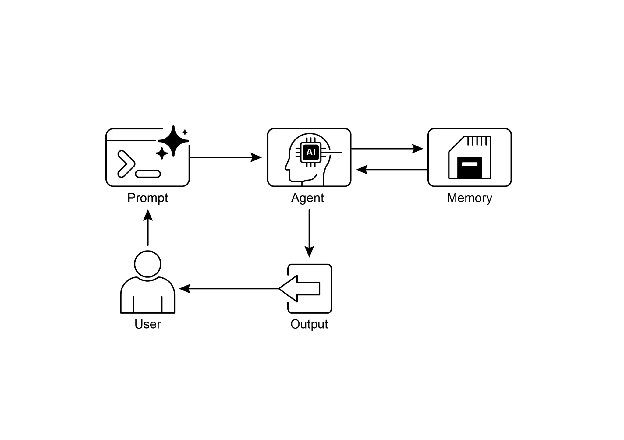

# Chapter 8: Memory Management

Effective memory management is crucial for intelligent agents to retain information. Agents require different types of memory, much like humans, to operate efficiently. This chapter delves into memory management, specifically addressing the immediate (short-term) and persistent (long-term) memory requirements of agents.

In agent systems, memory refers to an agent's ability to retain and utilize information from past interactions, observations, and learning experiences. This capability allows agents to make informed decisions, maintain conversational context, and improve over time. Agent memory is generally categorized into two main types:

* **Short-Term Memory (Contextual Memory):** Similar to working memory, this holds information currently being processed or recently accessed. For agents using large language models (LLMs), short-term memory primarily exists within the context window. This window contains recent messages, agent replies, tool usage results, and agent reflections from the current interaction, all of which inform the LLM's subsequent responses and actions. The context window has a limited capacity, restricting the amount of recent information an agent can directly access. Efficient short-term memory management involves keeping the most relevant information within this limited space, possibly through techniques like summarizing older conversation segments or emphasizing key details. The advent of models with 'long context' windows simply expands the size of this short-term memory, allowing more information to be held within a single interaction. However, this context is still ephemeral and is lost once the session concludes, and it can be costly and inefficient to process every time. Consequently, agents require separate memory types to achieve true persistence, recall information from past interactions, and build a lasting knowledge base.
* **Long-Term Memory (Persistent Memory):** This acts as a repository for information agents need to retain across various interactions, tasks, or extended periods, akin to long-term knowledge bases. Data is typically stored outside the agent's immediate processing environment, often in databases, knowledge graphs, or vector databases. In vector databases, information is converted into numerical vectors and stored, enabling agents to retrieve data based on semantic similarity rather than exact keyword matches, a process known as semantic search. When an agent needs information from long-term memory, it queries the external storage, retrieves relevant data, and integrates it into the short-term context for immediate use, thus combining prior knowledge with the current interaction.

# Practical Applications & Use Cases

Memory management is vital for agents to track information and perform intelligently over time. This is essential for agents to surpass basic question-answering capabilities. Applications include:

* **Chatbots and Conversational AI:** Maintaining conversation flow relies on short-term memory. Chatbots require remembering prior user inputs to provide coherent responses. Long-term memory enables chatbots to recall user preferences, past issues, or prior discussions, offering personalized and continuous interactions.
* **Task-Oriented Agents:** Agents managing multi-step tasks need short-term memory to track previous steps, current progress, and overall goals. This information might reside in the task's context or temporary storage. Long-term memory is crucial for accessing specific user-related data not in the immediate context.
* **Personalized Experiences:** Agents offering tailored interactions utilize long-term memory to store and retrieve user preferences, past behaviors, and personal information. This allows agents to adapt their responses and suggestions.
* **Learning and Improvement:** Agents can refine their performance by learning from past interactions. Successful strategies, mistakes, and new information are stored in long-term memory, facilitating future adaptations. Reinforcement learning agents store learned strategies or knowledge in this way.
* **Information Retrieval (RAG):** Agents designed for answering questions access a knowledge base, their long-term memory, often implemented within Retrieval Augmented Generation (RAG). The agent retrieves relevant documents or data to inform its responses.
* **Autonomous Systems:** Robots or self-driving cars require memory for maps, routes, object locations, and learned behaviors. This involves short-term memory for immediate surroundings and long-term memory for general environmental knowledge.

Memory enables agents to maintain history, learn, personalize interactions, and manage complex, time-dependent problems.

# Hands-On Code: Memory Management in Google Agent Developer Kit (ADK)

The Google Agent Developer Kit (ADK) offers a structured method for managing context and memory, including components for practical application. A solid grasp of ADK's Session, State, and Memory is vital for building agents that need to retain information.

Just as in human interactions, agents require the ability to recall previous exchanges to conduct coherent and natural conversations. ADK simplifies context management through three core concepts and their associated services.

Every interaction with an agent can be considered a unique conversation thread. Agents might need to access data from earlier interactions. ADK structures this as follows:

* **Session:** An individual chat thread that logs messages and actions (Events) for that specific interaction, also storing temporary data (State) relevant to that conversation.
* **State (session.state):** Data stored within a Session, containing information relevant only to the current, active chat thread.
* **Memory:** A searchable repository of information sourced from various past chats or external sources, serving as a resource for data retrieval beyond the immediate conversation.

ADK provides dedicated services for managing critical components essential for building complex, stateful, and context-aware agents. The SessionService manages chat threads (Session objects) by handling their initiation, recording, and termination, while the MemoryService oversees the storage and retrieval of long-term knowledge (Memory).

Both the SessionService and MemoryService offer various configuration options, allowing users to choose storage methods based on application needs. In-memory options are available for testing purposes, though data will not persist across restarts. For persistent storage and scalability, ADK also supports database and cloud-based services.

## Session: Keeping Track of Each Chat

A Session object in ADK is designed to track and manage individual chat threads. Upon initiation of a conversation with an agent, the SessionService generates a Session object, represented as `google.adk.sessions.Session`. This object encapsulates all data relevant to a specific conversation thread, including unique identifiers (id, app_name, user_id), a chronological record of events as Event objects, a storage area for session-specific temporary data known as state, and a timestamp indicating the last update (last_update_time). Developers typically interact with Session objects indirectly through the SessionService. The SessionService is responsible for managing the lifecycle of conversation sessions, which includes initiating new sessions, resuming previous sessions, recording session activity (including state updates), identifying active sessions, and managing the removal of session data. The ADK provides several SessionService implementations with varying storage mechanisms for session history and temporary data, such as the InMemorySessionService, which is suitable for testing but does not provide data persistence across application restarts.

```python
# Example: Using InMemorySessionService
# This is suitable for local development and testing where data
# persistence across application restarts is not required.
from google.adk.sessions import InMemorySessionService

session_service = InMemorySessionService()
```

Then there's DatabaseSessionService if you want reliable saving to a database you manage.

```python
# Example: Using DatabaseSessionService
# This is suitable for production or development requiring persistent storage.
# You need to configure a database URL (e.g., for SQLite, PostgreSQL, etc.).
# Requires: pip install google-adk[sqlalchemy] and a database driver (e.g., psycopg2 for PostgreSQL)
from google.adk.sessions import DatabaseSessionService

# Example using a local SQLite file:
db_url = "sqlite:///./my_agent_data.db"
session_service = DatabaseSessionService(db_url=db_url)
```

Besides, there's VertexAiSessionService which uses Vertex AI infrastructure for scalable production on Google Cloud.

```python
# Example: Using VertexAiSessionService
# This is suitable for scalable production on Google Cloud Platform, leveraging
# Vertex AI infrastructure for session management.
# Requires: pip install google-adk[vertexai] and GCP setup/authentication
from google.adk.sessions import VertexAiSessionService

PROJECT_ID = "your-gcp-project-id" # Replace with your GCP project ID
LOCATION = "us-central1" # Replace with your desired GCP location

# The app_name used with this service should correspond to the Reasoning Engine ID or name
REASONING_ENGINE_APP_NAME = "projects/your-gcp-project-id/locations/us-central1/reasoningEngines/your-engine-id" # Replace with your Reasoning Engine resource name

session_service = VertexAiSessionService(project=PROJECT_ID, location=LOCATION)

# When using this service, pass REASONING_ENGINE_APP_NAME to service methods:
# session_service.create_session(app_name=REASONING_ENGINE_APP_NAME, ...)
# session_service.get_session(app_name=REASONING_ENGINE_APP_NAME, ...)
# session_service.append_event(session, event, app_name=REASONING_ENGINE_APP_NAME)
# session_service.delete_session(app_name=REASONING_ENGINE_APP_NAME, ...)
```

Choosing an appropriate SessionService is crucial as it determines how the agent's interaction history and temporary data are stored and their persistence.

Each message exchange involves a cyclical process: A message is received, the Runner retrieves or establishes a Session using the SessionService, the agent processes the message using the Session's context (state and historical interactions), the agent generates a response and may update the state, the Runner encapsulates this as an Event, and the session_service.append_event method records the new event and updates the state in storage. The Session then awaits the next message. Ideally, the delete_session method is employed to terminate the session when the interaction concludes. This process illustrates how the SessionService maintains continuity by managing the Session-specific history and temporary data.

## State: The Session's Scratchpad

In the ADK, each Session, representing a chat thread, includes a state component akin to an agent's temporary working memory for the duration of that specific conversation. While session.events logs the entire chat history, session.state stores and updates dynamic data points relevant to the active chat.

Fundamentally, session.state operates as a dictionary, storing data as key-value pairs. Its core function is to enable the agent to retain and manage details essential for coherent dialogue, such as user preferences, task progress, incremental data collection, or conditional flags influencing subsequent agent actions.

The state's structure comprises string keys paired with values of serializable Python types, including strings, numbers, booleans, lists, and dictionaries containing these basic types. State is dynamic, evolving throughout the conversation. The permanence of these changes depends on the configured SessionService.

State organization can be achieved using key prefixes to define data scope and persistence. Keys without prefixes are session-specific.

* The user: prefix associates data with a user ID across all sessions.
* The app: prefix designates data shared among all users of the application.
* The temp: prefix indicates data valid only for the current processing turn and is not persistently stored.

The agent accesses all state data through a single session.state dictionary. The SessionService handles data retrieval, merging, and persistence. State should be updated upon adding an Event to the session history via session_service.append_event(). This ensures accurate tracking, proper saving in persistent services, and safe handling of state changes.

1. **The Simple Way: Using output_key (for Agent Text Replies):** This is the easiest method if you just want to save your agent's final text response directly into the state. When you set up your LlmAgent, just tell it the output_key you want to use. The Runner sees this and automatically creates the necessary actions to save the response to the state when it appends the event. Let's look at a code example demonstrating state update via output_key.

```python
# Import necessary classes from the Google Agent Developer Kit (ADK)
from google.adk.agents import LlmAgent
from google.adk.sessions import InMemorySessionService, Session
from google.adk.runners import Runner
from google.genai.types import Content, Part

# Define an LlmAgent with an output_key.
greeting_agent = LlmAgent(
   name="Greeter",
   model="gemini-2.0-flash",
   instruction="Generate a short, friendly greeting.",
   output_key="last_greeting"
)

# --- Setup Runner and Session ---
app_name, user_id, session_id = "state_app", "user1", "session1"
session_service = InMemorySessionService()
runner = Runner(
   agent=greeting_agent,
   app_name=app_name,
   session_service=session_service
)

session = session_service.create_session(
   app_name=app_name,
   user_id=user_id,
   session_id=session_id
)

print(f"Initial state: {session.state}")

# --- Run the Agent ---
user_message = Content(parts=[Part(text="Hello")])
print("\n--- Running the agent ---")

for event in runner.run(
   user_id=user_id,
   session_id=session_id,
   new_message=user_message
):
   if event.is_final_response():
     print("Agent responded.")

# --- Check Updated State ---
# Correctly check the state *after* the runner has finished processing all events.
updated_session = session_service.get_session(app_name, user_id, session_id)
print(f"\nState after agent run: {updated_session.state}")
```

Behind the scenes, the Runner sees your output_key and automatically creates the necessary actions with a state_delta when it calls append_event.

2. **The Standard Way: Using EventActions.state_delta (for More Complicated Updates):** For times when you need to do more complex things – like updating several keys at once, saving things that aren't just text, targeting specific scopes like user: or app:, or making updates that aren't tied to the agent's final text reply – you'll manually build a dictionary of your state changes (the state_delta) and include it within the EventActions of the Event you're appending. Let's look at one example:

```python
import time
from google.adk.tools.tool_context import ToolContext
from google.adk.sessions import InMemorySessionService

# --- Define the Recommended Tool-Based Approach ---
def log_user_login(tool_context: ToolContext) -> dict:
   """
   Updates the session state upon a user login event.
   This tool encapsulates all state changes related to a user login.

   Args:
       tool_context: Automatically provided by ADK, gives access to session state.

   Returns:
       A dictionary confirming the action was successful.
   """
   # Access the state directly through the provided context.
   state = tool_context.state

   # Get current values or defaults, then update the state.
   # This is much cleaner and co-locates the logic.
   login_count = state.get("user:login_count", 0) + 1
   state["user:login_count"] = login_count
   state["task_status"] = "active"
   state["user:last_login_ts"] = time.time()
   state["temp:validation_needed"] = True

   print("State updated from within the `log_user_login` tool.")

   return {
       "status": "success",
       "message": f"User login tracked. Total logins: {login_count}."
   }

# --- Demonstration of Usage ---
# In a real application, an LLM Agent would decide to call this tool.
# Here, we simulate a direct call for demonstration purposes.

# 1. Setup
session_service = InMemorySessionService()
app_name, user_id, session_id = "state_app_tool", "user3", "session3"

session = session_service.create_session(
   app_name=app_name,
   user_id=user_id,
   session_id=session_id,
   state={"user:login_count": 0, "task_status": "idle"}
)

print(f"Initial state: {session.state}")

# 2. Simulate a tool call (in a real app, the ADK Runner does this)
# We create a ToolContext manually just for this standalone example.
from google.adk.tools.tool_context import InvocationContext

mock_context = ToolContext(
   invocation_context=InvocationContext(
       app_name=app_name, user_id=user_id, session_id=session_id,
       session=session, session_service=session_service
   )
)

# 3. Execute the tool
log_user_login(mock_context)

# 4. Check the updated state
updated_session = session_service.get_session(app_name, user_id, session_id)
print(f"State after tool execution: {updated_session.state}")
# Expected output will show the same state change as the
# "Before" case,
# but the code organization is significantly cleaner
# and more robust.
```

This code demonstrates a tool-based approach for managing user session state in an application. It defines a function *log_user_login*, which acts as a tool. This tool is responsible for updating the session state when a user logs in.
The function takes a ToolContext object, provided by the ADK, to access and modify the session's state dictionary. Inside the tool, it increments a *user:login_count*, sets the t*ask_status* to "active", records the *user:last_login_ts (timestamp)*, and adds a temporary flag temp:validation_needed.

The demonstration part of the code simulates how this tool would be used. It sets up an in-memory session service and creates an initial session with some predefined state. A ToolContext is then manually created to mimic the environment in which the ADK Runner would execute the tool. The log_user_login function is called with this mock context. Finally, the code retrieves the session again to show that the state has been updated by the tool's execution. The goal is to show how encapsulating state changes within tools makes the code cleaner and more organized compared to directly manipulating state outside of tools.

Note that direct modification of the `session.state` dictionary after retrieving a session is strongly discouraged as it bypasses the standard event processing mechanism. Such direct changes will not be recorded in the session's event history, may not be persisted by the selected `SessionService`, could lead to concurrency issues, and will not update essential metadata such as timestamps. The recommended methods for updating the session state are using the `output_key` parameter on an `LlmAgent` (specifically for the agent's final text responses) or including state changes within `EventActions.state_delta` when appending an event via `session_service.append_event()`. The `session.state` should primarily be used for reading existing data.

To recap, when designing your state, keep it simple, use basic data types, give your keys clear names and use prefixes correctly, avoid deep nesting, and always update state using the append_event process.

## Memory: Long-Term Knowledge with MemoryService

In agent systems, the Session component maintains a record of the current chat history (events) and temporary data (state) specific to a single conversation. However, for agents to retain information across multiple interactions or access external data, long-term knowledge management is necessary. This is facilitated by the MemoryService.

```python
# Example: Using InMemoryMemoryService
# This is suitable for local development and testing where data
# persistence across application restarts is not required.
# Memory content is lost when the app stops.
from google.adk.memory import InMemoryMemoryService

memory_service = InMemoryMemoryService()
```

Session and State can be conceptualized as short-term memory for a single chat session, whereas the Long-Term Knowledge managed by the MemoryService functions as a persistent and searchable repository. This repository may contain information from multiple past interactions or external sources. The MemoryService, as defined by the BaseMemoryService interface, establishes a standard for managing this searchable, long-term knowledge. Its primary functions include adding information, which involves extracting content from a session and storing it using the add_session_to_memory method, and retrieving information, which allows an agent to query the store and receive relevant data using the search_memory method.

The ADK offers several implementations for creating this long-term knowledge store. The InMemoryMemoryService provides a temporary storage solution suitable for testing purposes, but data is not preserved across application restarts. For production environments, the VertexAiRagMemoryService is typically utilized. This service leverages Google Cloud's Retrieval Augmented Generation (RAG) service, enabling scalable, persistent, and semantic search capabilities (Also, refer to the chapter 14 on RAG).

```python
# Example: Using VertexAiRagMemoryService
# This is suitable for scalable production on GCP, leveraging
# Vertex AI RAG (Retrieval Augmented Generation) for persistent,
# searchable memory.
# Requires: pip install google-adk[vertexai], GCP
# setup/authentication, and a Vertex AI RAG Corpus.
from google.adk.memory import VertexAiRagMemoryService

# The resource name of your Vertex AI RAG Corpus
RAG_CORPUS_RESOURCE_NAME = "projects/your-gcp-project-id/locations/us-central1/ragCorpora/your-corpus-id" # Replace with your Corpus resource name

# Optional configuration for retrieval behavior
SIMILARITY_TOP_K = 5 # Number of top results to retrieve
VECTOR_DISTANCE_THRESHOLD = 0.7 # Threshold for vector similarity

memory_service = VertexAiRagMemoryService(
   rag_corpus=RAG_CORPUS_RESOURCE_NAME,
   similarity_top_k=SIMILARITY_TOP_K,
   vector_distance_threshold=VECTOR_DISTANCE_THRESHOLD
)

# When using this service, methods like add_session_to_memory
# and search_memory will interact with the specified Vertex AI
# RAG Corpus.
```

# Hands-on code: Memory Management in LangChain and LangGraph

In LangChain and LangGraph, Memory is a critical component for creating intelligent and natural-feeling conversational applications. It allows an AI agent to remember information from past interactions, learn from feedback, and adapt to user preferences. LangChain's memory feature provides the foundation for this by referencing a stored history to enrich current prompts and then recording the latest exchange for future use. As agents handle more complex tasks, this capability becomes essential for both efficiency and user satisfaction.

**Short-Term Memory:** This is thread-scoped, meaning it tracks the ongoing conversation within a single session or thread. It provides immediate context, but a full history can challenge an LLM's context window, potentially leading to errors or poor performance. LangGraph manages short-term memory as part of the agent's state, which is persisted via a checkpointer, allowing a thread to be resumed at any time.

**Long-Term Memory:** This stores user-specific or application-level data across sessions and is shared between conversational threads. It is saved in custom "namespaces" and can be recalled at any time in any thread. LangGraph provides stores to save and recall long-term memories, enabling agents to retain knowledge indefinitely.

LangChain provides several tools for managing conversation history, ranging from manual control to automated integration within chains.

**ChatMessageHistory: Manual Memory Management.** For direct and simple control over a conversation's history outside of a formal chain, the ChatMessageHistory class is ideal. It allows for the manual tracking of dialogue exchanges.

```python
from langchain.memory import ChatMessageHistory

# Initialize the history object
history = ChatMessageHistory()

# Add user and AI messages
history.add_user_message("I'm heading to New York next week.")
history.add_ai_message("Great! It's a fantastic city.")

# Access the list of messages
print(history.messages)
```

**ConversationBufferMemory: Automated Memory for Chains**. For integrating memory directly into chains, ConversationBufferMemory is a common choice. It holds a buffer of the conversation and makes it available to your prompt. Its behavior can be customized with two key parameters:

* memory_key: A string that specifies the variable name in your prompt that will hold the chat history. It defaults to "history".
* return_messages: A boolean that dictates the format of the history.
  * If False (the default), it returns a single formatted string, which is ideal for standard LLMs.
  * If True, it returns a list of message objects, which is the recommended format for Chat Models.

```python
from langchain.memory import ConversationBufferMemory

# Initialize memory
memory = ConversationBufferMemory()

# Save a conversation turn
memory.save_context({"input": "What's the weather like?"}, {"output": "It's sunny today."})

# Load the memory as a string
print(memory.load_memory_variables({}))
```

Integrating this memory into an LLMChain allows the model to access the conversation's history and provide contextually relevant responses

```python
from langchain_openai import OpenAI
from langchain.chains import LLMChain
from langchain.prompts import PromptTemplate
from langchain.memory import ConversationBufferMemory

# 1. Define LLM and Prompt
llm = OpenAI(temperature=0)

template = """You are a helpful travel agent.

Previous conversation:
{history}

New question: {question}

Response:"""

prompt = PromptTemplate.from_template(template)

# 2. Configure Memory
# The memory_key "history" matches the variable in the prompt
memory = ConversationBufferMemory(memory_key="history")

# 3. Build the Chain
conversation = LLMChain(llm=llm, prompt=prompt, memory=memory)

# 4. Run the Conversation
response = conversation.predict(question="I want to book a flight.")
print(response)

response = conversation.predict(question="My name is Sam, by the way.")
print(response)

response = conversation.predict(question="What was my name again?")
print(response)
```

For improved effectiveness with chat models, it is recommended to use a structured list of message objects by setting `return_messages=True`.

```python
from langchain_openai import ChatOpenAI
from langchain.chains import LLMChain
from langchain.memory import ConversationBufferMemory
from langchain_core.prompts import (
   ChatPromptTemplate,
   MessagesPlaceholder,
   SystemMessagePromptTemplate,
   HumanMessagePromptTemplate,
)

# 1. Define Chat Model and Prompt
llm = ChatOpenAI()

prompt = ChatPromptTemplate(
   messages=[
       SystemMessagePromptTemplate.from_template("You are a friendly assistant."),
       MessagesPlaceholder(variable_name="chat_history"),
       HumanMessagePromptTemplate.from_template("{question}")
   ]
)

# 2. Configure Memory
# return_messages=True is essential for chat models
memory = ConversationBufferMemory(memory_key="chat_history", return_messages=True)

# 3. Build the Chain
conversation = LLMChain(llm=llm, prompt=prompt, memory=memory)

# 4. Run the Conversation
response = conversation.predict(question="Hi, I'm Jane.")
print(response)

response = conversation.predict(question="Do you remember my name?")
print(response)
```

**Types of Long-Term Memory**: Long-term memory allows systems to retain information across different conversations, providing a deeper level of context and personalization. It can be broken down into three types analogous to human memory:

* **Semantic Memory: Remembering Facts:** This involves retaining specific facts and concepts, such as user preferences or domain knowledge. It is used to ground an agent's responses, leading to more personalized and relevant interactions. This information can be managed as a continuously updated user "profile" (a JSON document) or as a "collection" of individual factual documents.
* **Episodic Memory: Remembering Experiences:** This involves recalling past events or actions. For AI agents, episodic memory is often used to remember how to accomplish a task. In practice, it's frequently implemented through few-shot example prompting, where an agent learns from past successful interaction sequences to perform tasks correctly.
* **Procedural Memory: Remembering Rules:**  This is the memory of how to perform tasks—the agent's core instructions and behaviors, often contained in its system prompt. It's common for agents to modify their own prompts to adapt and improve. An effective technique is "Reflection," where an agent is prompted with its current instructions and recent interactions, then asked to refine its own instructions.

Below is pseudo-code demonstrating how an agent might use reflection to update its procedural memory stored in a LangGraph BaseStore

```python
# Node that updates the agent's instructions
def update_instructions(state: State, store: BaseStore):
   namespace = ("instructions",)
   # Get the current instructions from the store
   current_instructions = store.search(namespace)[0]

   # Create a prompt to ask the LLM to reflect on the conversation
   # and generate new, improved instructions
   prompt = prompt_template.format(
       instructions=current_instructions.value["instructions"],
       conversation=state["messages"]
   )

   # Get the new instructions from the LLM
   output = llm.invoke(prompt)
   new_instructions = output['new_instructions']

   # Save the updated instructions back to the store
   store.put(("agent_instructions",), "agent_a", {"instructions": new_instructions})

# Node that uses the instructions to generate a response
def call_model(state: State, store: BaseStore):
   namespace = ("agent_instructions", )
   # Retrieve the latest instructions from the store
   instructions = store.get(namespace, key="agent_a")[0]

   # Use the retrieved instructions to format the prompt
   prompt = prompt_template.format(instructions=instructions.value["instructions"])
   # ... application logic continues
```

LangGraph stores long-term memories as JSON documents in a store. Each memory is organized under a custom namespace (like a folder) and a distinct key (like a filename). This hierarchical structure allows for easy organization and retrieval of information. The following code demonstrates how to use InMemoryStore to put, get, and search for memories.

```python
from langgraph.store.memory import InMemoryStore

# A placeholder for a real embedding function
def embed(texts: list[str]) -> list[list[float]]:
   # In a real application, use a proper embedding model
   return [[1.0, 2.0] for _ in texts]

# Initialize an in-memory store. For production, use a database-backed store.
store = InMemoryStore(index={"embed": embed, "dims": 2})

# Define a namespace for a specific user and application context
user_id = "my-user"
application_context = "chitchat"
namespace = (user_id, application_context)

# 1. Put a memory into the store
store.put(
   namespace,
   "a-memory",  # The key for this memory
   {
       "rules": [
           "User likes short, direct language",
           "User only speaks English & python",
       ],
       "my-key": "my-value",
   },
)

# 2. Get the memory by its namespace and key
item = store.get(namespace, "a-memory")
print("Retrieved Item:", item)

# 3. Search for memories within the namespace, filtering by content
# and sorting by vector similarity to the query.
items = store.search(
   namespace,
   filter={"my-key": "my-value"},
   query="language preferences"
)
print("Search Results:", items)
```

# Vertex Memory Bank

Memory Bank, a managed service in the Vertex AI Agent Engine, provides agents with persistent, long-term memory. The service uses Gemini models to asynchronously analyze conversation histories to extract key facts and user preferences.

This information is stored persistently, organized by a defined scope like user ID, and intelligently updated to consolidate new data and resolve contradictions. Upon starting a new session, the agent retrieves relevant memories through either a full data recall or a similarity search using embeddings. This process allows an agent to maintain continuity across sessions and personalize responses based on recalled information.

The agent's runner interacts with the VertexAiMemoryBankService, which is initialized first. This service handles the automatic storage of memories generated during the agent's conversations. Each memory is tagged with a unique USER_ID and APP_NAME, ensuring accurate retrieval in the future.

```python
from google.adk.memory import VertexAiMemoryBankService

agent_engine_id = agent_engine.api_resource.name.split("/")[-1]

memory_service = VertexAiMemoryBankService(
   project="PROJECT_ID",
   location="LOCATION",
   agent_engine_id=agent_engine_id
)

session = await session_service.get_session(
   app_name=app_name,
   user_id="USER_ID",
   session_id=session.id
)

await memory_service.add_session_to_memory(session)
```

Memory Bank offers seamless integration with the Google ADK, providing an immediate out-of-the-box experience. For users of other agent frameworks, such as LangGraph and CrewAI, Memory Bank also offers support through direct API calls. Online code examples demonstrating these integrations are readily available for interested readers.

# At a Glance

**What**: Agentic systems need to remember information from past interactions to perform complex tasks and provide coherent experiences. Without a memory mechanism, agents are stateless, unable to maintain conversational context, learn from experience, or personalize responses for users. This fundamentally limits them to simple, one-shot interactions, failing to handle multi-step processes or evolving user needs. The core problem is how to effectively manage both the immediate, temporary information of a single conversation and the vast, persistent knowledge gathered over time.

**Why:** The standardized solution is to implement a dual-component memory system that distinguishes between short-term and long-term storage. Short-term, contextual memory holds recent interaction data within the LLM's context window to maintain conversational flow. For information that must persist, long-term memory solutions use external databases, often vector stores, for efficient, semantic retrieval. Agentic frameworks like the Google ADK provide specific components to manage this, such as Session for the conversation thread and State for its temporary data. A dedicated MemoryService is used to interface with the long-term knowledge base, allowing the agent to retrieve and incorporate relevant past information into its current context.

**Rule of thumb:** Use this pattern when an agent needs to do more than answer a single question. It is essential for agents that must maintain context throughout a conversation, track progress in multi-step tasks, or personalize interactions by recalling user preferences and history. Implement memory management whenever the agent is expected to learn or adapt based on past successes, failures, or newly acquired information.

**Visual summary**



Fig.1: Memory management design pattern

# Key Takeaways

To quickly recap the main points about memory management:

* Memory is super important for agents to keep track of things, learn, and personalize interactions.
* Conversational AI relies on both short-term memory for immediate context within a single chat and long-term memory for persistent knowledge across multiple sessions.
* Short-term memory (the immediate stuff) is temporary, often limited by the LLM's context window or how the framework passes context.
* Long-term memory (the stuff that sticks around) saves info across different chats using outside storage like vector databases and is accessed by searching.
* Frameworks like ADK have specific parts like Session (the chat thread), State (temporary chat data), and MemoryService (the searchable long-term knowledge) to manage memory.
* ADK's SessionService handles the whole life of a chat session, including its history (events) and temporary data (state).
* ADK's session.state is a dictionary for temporary chat data. Prefixes (user:, app:, temp:) tell you where the data belongs and if it sticks around.
* In ADK, you should update state by using EventActions.state_delta or output_key when adding events, not by changing the state dictionary directly.
* ADK's MemoryService is for putting info into long-term storage and letting agents search it, often using tools.
* LangChain offers practical tools like ConversationBufferMemory to automatically inject the history of a single conversation into a prompt, enabling an agent to recall immediate context.
* LangGraph enables advanced, long-term memory by using a store to save and retrieve semantic facts, episodic experiences, or even updatable procedural rules across different user sessions.
* Memory Bank is a managed service that provides agents with persistent, long-term memory by automatically extracting, storing, and recalling user-specific information to enable personalized, continuous conversations across frameworks like Google's ADK, LangGraph, and CrewAI.

# Conclusion

This chapter dove into the really important job of memory management for agent systems, showing the difference between the short-lived context and the knowledge that sticks around for a long time. We talked about how these types of memory are set up and where you see them used in building smarter agents that can remember things. We took a detailed look at how Google ADK gives you specific pieces like Session, State, and MemoryService to handle this. Now that we've covered how agents can remember things, both short-term and long-term, we can move on to how they can learn and adapt. The next pattern "Learning and Adaptation" is about an agent changing how it thinks, acts, or what it knows, all based on new experiences or data.

# References

1. ADK Memory, [https://google.github.io/adk-docs/sessions/memory/](https://google.github.io/adk-docs/sessions/memory/)
2. LangGraph Memory, [https://langchain-ai.github.io/langgraph/concepts/memory/](https://langchain-ai.github.io/langgraph/concepts/memory/)
3. Vertex AI Agent Engine Memory Bank, [https://cloud.google.com/blog/products/ai-machine-learning/vertex-ai-memory-bank-in-public-preview](https://cloud.google.com/blog/products/ai-machine-learning/vertex-ai-memory-bank-in-public-preview)
