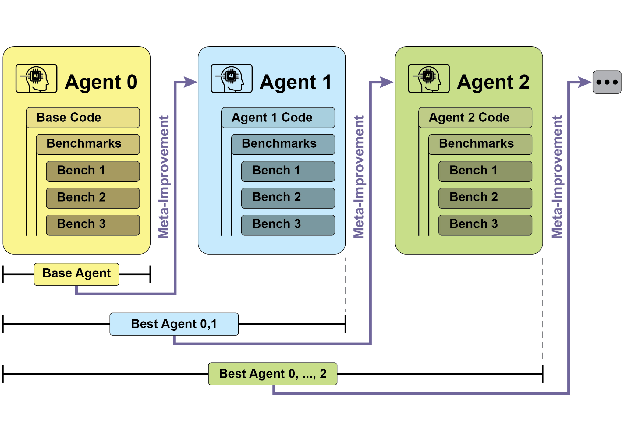
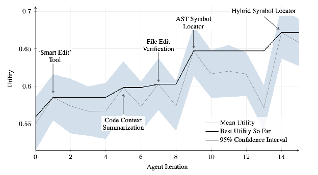
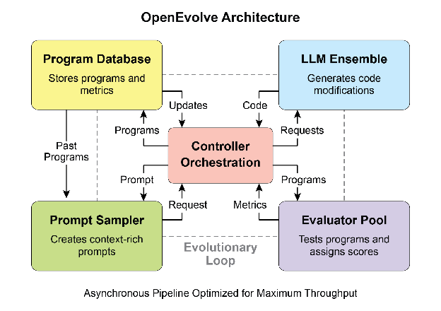
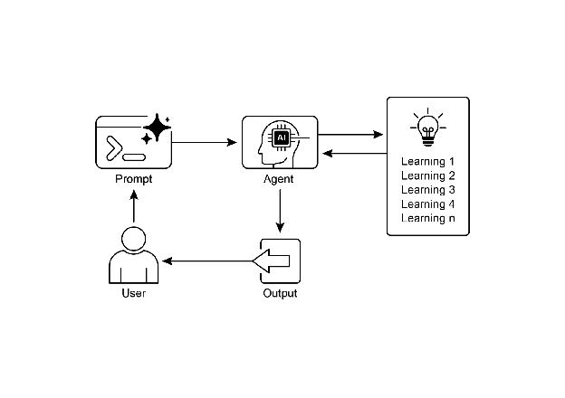

# Chapter 9: Learning and Adaptation

인공지능 agent의 역량 향상을 위해 학습과 적응은 핵심적임. 이러한 프로세스를 통해 agent는 사전 정의된 파라미터를 넘어서 진화할 수 있으며, 경험과 환경 상호작용을 통해 자율적으로 개선 가능함. 학습과 적응을 통해 agent는 새로운 상황을 효과적으로 관리하고 지속적인 수동 개입 없이 성능 최적화 가능. 본 챕터에서는 agent 학습과 적응을 뒷받침하는 원칙과 메커니즘을 상세히 탐구.

# The big picture

Agent는 새로운 경험과 데이터를 기반으로 사고, 행동, 지식을 변경하여 학습하고 적응함. 이를 통해 단순히 명령을 따르는 것에서 벗어나 시간이 지남에 따라 더 똑똑해짐.

* **Reinforcement Learning:** Agent가 행동을 시도하고 긍정적 결과에 대해 보상을, 부정적 결과에 대해 페널티를 받으며 변화하는 상황에서 최적의 행동을 학습. 로봇 제어나 게임 플레이 agent에 유용.
* **Supervised Learning:** Agent가 레이블링된 예제로부터 학습하여 입력을 원하는 출력과 연결하며, 의사결정과 패턴 인식 같은 작업 가능. 이메일 분류나 트렌드 예측 agent에 이상적.
* **Unsupervised Learning:** Agent가 레이블링되지 않은 데이터에서 숨겨진 연결과 패턴을 발견하여 인사이트, 조직화, 환경의 멘탈 맵 생성을 지원. 특정 가이드 없이 데이터를 탐색하는 agent에 유용.
* **Few-Shot/Zero-Shot Learning with LLM-Based Agents:** LLM을 활용하는 agent는 최소한의 예제나 명확한 지시만으로 새로운 작업에 빠르게 적응 가능하며, 새로운 명령이나 상황에 신속하게 대응 가능.
* **Online Learning:** Agent가 새로운 데이터로 지식을 지속적으로 업데이트하며, 동적 환경에서 실시간 반응과 지속적 적응에 필수적. 연속적인 데이터 스트림을 처리하는 agent에 중요.
* **Memory-Based Learning:** Agent가 과거 경험을 회상하여 유사한 상황에서 현재 행동을 조정하며, 컨텍스트 인식과 의사결정을 향상시킴. 메모리 회상 기능이 있는 agent에 효과적.

Agent는 학습을 기반으로 전략, 이해, 목표를 변경하여 적응함. 이는 예측 불가능하고 변화하거나 새로운 환경의 agent에 필수적.

**Proximal Policy Optimization (PPO)**은 로봇 관절 제어나 게임 캐릭터처럼 연속적인 행동 범위를 가진 환경에서 agent를 훈련시키는 데 사용되는 reinforcement learning 알고리즘임. 주요 목표는 agent의 의사결정 전략, 즉 policy를 안정적이고 신뢰성 있게 개선하는 것.

PPO의 핵심 아이디어는 agent의 policy에 대해 작고 신중한 업데이트를 수행하는 것임. 성능 붕괴를 일으킬 수 있는 급격한 변경을 방지. 작동 방식은 다음과 같음:

1. 데이터 수집: Agent가 현재 policy를 사용하여 환경과 상호작용하고(예: 게임 플레이) 경험 배치(상태, 행동, 보상)를 수집.
2. "Surrogate" 목표 평가: PPO가 잠재적 policy 업데이트가 예상 보상을 어떻게 변경할지 계산. 그러나 단순히 이 보상을 최대화하는 대신 특별한 "clipped" 목적 함수를 사용.
3. "Clipping" 메커니즘: PPO 안정성의 핵심. 현재 policy 주변에 "trust region" 또는 안전 영역을 생성. 알고리즘이 현재 전략과 너무 다른 업데이트를 수행하지 못하도록 방지. 이 clipping은 안전 브레이크처럼 작동하여 agent가 학습을 무효화하는 거대하고 위험한 단계를 밟지 않도록 보장.

요약하면, PPO는 성능 개선과 알려진 작동 전략에 가깝게 유지하는 것 사이의 균형을 맞추어 훈련 중 치명적 실패를 방지하고 더 안정적인 학습으로 이어짐.

**Direct Preference Optimization (DPO)**은 Large Language Model (LLM)을 인간 선호도와 정렬하기 위해 특별히 설계된 최신 방법임. 이 작업에 PPO를 사용하는 것보다 더 간단하고 직접적인 대안을 제공.

DPO를 이해하려면 먼저 전통적인 PPO 기반 정렬 방법을 이해하는 것이 도움됨:

* PPO 접근법 (2단계 프로세스):
  1. Reward Model 훈련: 먼저 사람들이 서로 다른 LLM 응답을 평가하거나 비교하는 인간 피드백 데이터를 수집(예: "응답 A가 응답 B보다 낫다"). 이 데이터는 reward model이라는 별도의 AI 모델을 훈련하는 데 사용되며, 이 모델의 역할은 인간이 새로운 응답에 부여할 점수를 예측하는 것.
  2. PPO로 Fine-Tune: 다음으로 LLM이 PPO를 사용하여 fine-tune됨. LLM의 목표는 reward model에서 가능한 최고 점수를 얻는 응답을 생성하는 것. Reward model이 훈련 게임에서 "심판" 역할을 함.

이 2단계 프로세스는 복잡하고 불안정할 수 있음. 예를 들어, LLM이 허점을 찾아 reward model을 "해킹"하여 나쁜 응답에 대해 높은 점수를 얻는 방법을 학습할 수 있음.

* DPO 접근법 (직접 프로세스): DPO는 reward model을 완전히 건너뜀. 인간 선호도를 보상 점수로 변환한 다음 해당 점수를 최적화하는 대신, DPO는 선호도 데이터를 직접 사용하여 LLM의 policy를 업데이트.
* 선호도 데이터를 최적 policy와 직접 연결하는 수학적 관계를 사용하여 작동. 본질적으로 모델에게 다음을 가르침: "*선호되는* 응답과 같은 응답을 생성할 확률을 높이고 *선호되지 않는* 응답과 같은 응답을 생성할 확률을 낮춰라."

본질적으로 DPO는 인간 선호도 데이터에 대해 언어 모델을 직접 최적화하여 정렬을 단순화함. 별도의 reward model을 훈련하고 사용하는 복잡성과 잠재적 불안정성을 피하여 정렬 프로세스를 더 효율적이고 견고하게 만듦.

# Practical Applications & Use Cases

적응형 agent는 경험 데이터 기반의 반복적 업데이트를 통해 가변적인 환경에서 향상된 성능을 보임.

* **개인화 assistant agent**는 개별 사용자 행동의 종단 분석을 통해 상호작용 프로토콜을 정제하여 고도로 최적화된 응답 생성을 보장.
* **트레이딩 bot agent**는 고해상도 실시간 시장 데이터를 기반으로 모델 파라미터를 동적으로 조정하여 의사결정 알고리즘을 최적화하여 재정적 수익을 극대화하고 위험 요소를 완화.
* **애플리케이션 agent**는 관찰된 사용자 행동을 기반으로 동적 수정을 통해 사용자 인터페이스와 기능을 최적화하여 사용자 참여도와 시스템 직관성을 증가시킴.
* **로봇 및 자율주행차 agent**는 센서 데이터와 과거 행동 분석을 통합하여 내비게이션과 응답 역량을 향상시켜 다양한 환경 조건에서 안전하고 효율적인 작동을 가능하게 함.
* **사기 탐지 agent**는 새로 식별된 사기 패턴으로 예측 모델을 정제하여 이상 탐지를 개선하고 시스템 보안을 강화하며 재정적 손실을 최소화.
* **추천 agent**는 사용자 선호도 학습 알고리즘을 사용하여 콘텐츠 선택 정밀도를 개선하고 고도로 개인화되고 맥락적으로 관련된 추천을 제공.
* **게임 AI agent**는 전략 알고리즘을 동적으로 적응시켜 플레이어 참여도를 향상시키고 게임 복잡성과 도전을 증가시킴.
* **Knowledge Base Learning Agent**: Agent는 Retrieval Augmented Generation (RAG)을 활용하여 문제 설명과 검증된 솔루션의 동적 지식 베이스를 유지할 수 있음 (Chapter 14 참조). 성공적인 전략과 직면한 과제를 저장함으로써 agent는 의사결정 중 이 데이터를 참조할 수 있으며, 이전에 성공한 패턴을 적용하거나 알려진 함정을 피함으로써 새로운 상황에 더 효과적으로 적응 가능.

# Case Study: The Self-Improving Coding Agent (SICA)

Maxime Robeyns, Laurence Aitchison, Martin Szummer가 개발한 Self-Improving Coding Agent (SICA)는 agent 기반 학습의 진보를 나타내며, agent가 자신의 소스 코드를 수정할 수 있는 역량을 보여줌. 한 agent가 다른 agent를 훈련시킬 수 있는 전통적 접근법과 달리, SICA는 수정자이자 수정되는 실체로서 작동하며, 다양한 코딩 챌린지에서 성능을 향상시키기 위해 코드 베이스를 반복적으로 정제함.

SICA의 자기 개선은 반복 사이클을 통해 작동함 (Fig.1 참조). 처음에 SICA는 과거 버전의 아카이브와 벤치마크 테스트에서의 성능을 검토. 성공, 시간, 계산 비용을 고려한 가중 공식을 기반으로 계산된 가장 높은 성능 점수를 가진 버전을 선택. 선택된 버전은 다음 라운드의 자기 수정을 수행. 아카이브를 분석하여 잠재적 개선 사항을 식별한 다음 코드베이스를 직접 변경. 수정된 agent는 이후 벤치마크에 대해 테스트되며 결과는 아카이브에 기록됨. 이 프로세스가 반복되어 과거 성능으로부터 직접 학습을 촉진. 이 자기 개선 메커니즘을 통해 SICA는 전통적인 훈련 패러다임을 요구하지 않고 역량을 진화시킬 수 있음.

Fig.1: SICA의 자기 개선, 과거 버전을 기반으로 학습하고 적응

SICA는 상당한 자기 개선을 거쳐 코드 편집과 내비게이션의 발전으로 이어짐. 처음에 SICA는 코드 변경을 위해 기본적인 파일 덮어쓰기 방식을 활용. 이후 더 지능적이고 맥락적인 편집이 가능한 "Smart Editor"를 개발. 이것은 대상 수정과 패턴 기반 편집을 위한 diff를 통합한 "Diff-Enhanced Smart Editor"와 처리 요구사항을 줄이기 위한 "Quick Overwrite Tool"로 진화.

SICA는 효율성을 위해 Abstract Syntax Tree (AST) 파싱을 사용하는 "Minimal Diff Output Optimization"과 "Context-Sensitive Diff Minimization"을 추가로 구현. 또한 "SmartEditor Input Normalizer"가 추가됨. 내비게이션 측면에서 SICA는 코드의 구조적 맵(AST)을 사용하여 코드베이스 내 정의를 식별하는 "AST Symbol Locator"를 독립적으로 생성. 이후 빠른 검색과 AST 확인을 결합한 "Hybrid Symbol Locator"가 개발됨. 이것은 관련 코드 섹션에 집중하여 검색 속도를 개선하는 "Optimized AST Parsing in Hybrid Symbol Locator"를 통해 더욱 최적화됨 (Fig. 2 참조).

Fig.2: 반복에 걸친 성능. 주요 개선 사항은 해당 도구 또는 agent 수정과 함께 주석 처리됨. (courtesy of Maxime Robeyns, Martin Szummer, Laurence Aitchison)

SICA의 아키텍처는 기본 파일 작업, 명령 실행, 산술 계산을 위한 기본 툴킷으로 구성됨. 결과 제출과 특수 하위 agent(코딩, 문제 해결, 추론) 호출을 위한 메커니즘을 포함. 이러한 하위 agent는 복잡한 작업을 분해하고 특히 확장된 개선 사이클 동안 LLM의 컨텍스트 길이를 관리.

비동기 overseer, 또다른 LLM이 SICA의 행동을 모니터링하여 루프나 정체와 같은 잠재적 문제를 식별. SICA와 통신하며 필요시 실행을 중단하도록 개입 가능. Overseer는 패턴과 비효율성을 식별하기 위해 callgraph와 메시지 및 도구 작업 로그를 포함한 SICA 작업의 상세한 보고서를 수신.

SICA의 LLM은 컨텍스트 윈도우, 즉 단기 메모리 내 정보를 작동에 중요한 구조화된 방식으로 조직화. 이 구조에는 agent 목표를 정의하는 System Prompt, 도구 및 하위 agent 문서, 시스템 지시사항이 포함. Core Prompt는 문제 설명 또는 지시사항, 열린 파일의 내용, 디렉토리 맵을 포함. Assistant Message는 agent의 단계별 추론, 도구 및 하위 agent 호출 기록과 결과, overseer 통신을 기록. 이 조직화는 효율적인 정보 흐름을 촉진하여 LLM 작동을 향상시키고 처리 시간과 비용을 절감. 처음에는 파일 변경이 diff로 기록되어 수정 사항만 보여주고 주기적으로 통합됨.

**SICA: 코드 살펴보기:** SICA의 구현을 더 깊이 탐구하면 역량을 뒷받침하는 몇 가지 주요 설계 선택이 드러남. 논의된 바와 같이, 시스템은 코딩 agent, 문제 해결 agent, 추론 agent와 같은 여러 하위 agent를 통합한 모듈식 아키텍처로 구축됨. 이러한 하위 agent는 도구 호출과 유사하게 메인 agent에 의해 호출되며, 복잡한 작업을 분해하고 특히 확장된 메타 개선 반복 중 컨텍스트 길이를 효율적으로 관리하는 역할을 함.

프로젝트는 활발히 개발 중이며 도구 사용 및 기타 agentic 작업에 대한 post-training LLM에 관심 있는 사람들을 위한 견고한 프레임워크 제공을 목표로 하며, 전체 코드는 [https://github.com/MaximeRobeyns/self_improving_coding_agent/](https://github.com/MaximeRobeyns/self_improving_coding_agent/) GitHub 리포지토리에서 추가 탐구와 기여를 위해 제공됨.

보안을 위해 프로젝트는 Docker 컨테이너화를 강력히 강조하며, 이는 agent가 전용 Docker 컨테이너 내에서 실행됨을 의미. 이것은 중요한 조치로, agent가 셸 명령을 실행할 수 있는 능력을 고려할 때 실수로 인한 파일 시스템 조작과 같은 위험을 완화하여 호스트 머신으로부터 격리를 제공.

투명성과 제어를 보장하기 위해 시스템은 이벤트 버스와 agent의 callgraph에서 이벤트를 시각화하는 대화형 웹페이지를 통한 강력한 관찰 가능성을 특징으로 함. 이것은 agent의 작업에 대한 포괄적인 인사이트를 제공하여 사용자가 개별 이벤트를 검사하고, overseer 메시지를 읽고, 더 명확한 이해를 위해 하위 agent 추적을 축소할 수 있게 함.

핵심 지능 측면에서 agent 프레임워크는 다양한 제공자의 LLM 통합을 지원하여 특정 작업에 가장 적합한 모델을 찾기 위한 실험을 가능하게 함. 마지막으로, 중요한 구성요소는 비동기 overseer로, 메인 agent와 동시에 실행되는 LLM임. 이 overseer는 주기적으로 agent의 행동을 병리학적 편차나 정체에 대해 평가하고 알림을 보내거나 필요시 agent의 실행을 취소함으로써 개입 가능. Callgraph와 LLM 메시지, 도구 호출, 응답의 이벤트 스트림을 포함한 시스템 상태의 상세한 텍스트 표현을 수신하여 비효율적인 패턴이나 반복 작업을 감지할 수 있음.

초기 SICA 구현에서 주목할 만한 과제는 각 메타 개선 반복 동안 LLM 기반 agent가 독립적으로 새롭고, 혁신적이고, 실현 가능하며, 흥미로운 수정을 제안하도록 프롬프트하는 것이었음. 특히 개방형 학습과 LLM agent의 진정한 창의성을 촉진하는 측면에서 이러한 한계는 현재 연구의 핵심 영역으로 남아있음.

# AlphaEvolve and OpenEvolve

**AlphaEvolve**는 알고리즘을 발견하고 최적화하도록 설계된 Google이 개발한 AI agent임. LLM, 특히 Gemini 모델(Flash와 Pro), 자동화된 평가 시스템, 진화 알고리즘 프레임워크의 조합을 활용. 이 시스템은 이론 수학과 실용적 컴퓨팅 애플리케이션 모두를 발전시키는 것을 목표로 함.

AlphaEvolve는 Gemini 모델의 앙상블을 사용. Flash는 광범위한 초기 알고리즘 제안을 생성하는 데 사용되며, Pro는 더 심층적인 분석과 정제를 제공. 제안된 알고리즘은 사전 정의된 기준에 따라 자동으로 평가되고 점수가 매겨짐. 이 평가는 솔루션을 반복적으로 개선하는 데 사용되는 피드백을 제공하여 최적화되고 새로운 알고리즘으로 이어짐.

실용적 컴퓨팅에서 AlphaEvolve는 Google의 인프라 내에 배포됨. 데이터 센터 스케줄링에서 개선을 보여주어 글로벌 컴퓨팅 리소스 사용을 0.7% 감소시킴. 또한 향후 Tensor Processing Unit (TPU)의 Verilog 코드 최적화를 제안하여 하드웨어 설계에 기여. 더 나아가 AlphaEvolve는 Gemini 아키텍처의 핵심 커널에서 23% 속도 향상과 FlashAttention용 저수준 GPU 명령어의 최대 32.5% 최적화를 포함한 AI 성능을 가속화함.

기초 연구 영역에서 AlphaEvolve는 48개의 스칼라 곱셈을 사용하는 4x4 복소수 행렬에 대한 방법을 포함하여 행렬 곱셈을 위한 새로운 알고리즘 발견에 기여하여 이전에 알려진 솔루션을 능가함. 더 광범위한 수학 연구에서는 75%의 경우에 50개 이상의 열린 문제에 대한 기존 최첨단 솔루션을 재발견하고 20%의 경우에 기존 솔루션을 개선했으며, 예제로는 kissing number 문제의 발전이 포함됨.

**OpenEvolve**는 LLM을 활용하여 코드를 반복적으로 최적화하는 진화적 코딩 agent임 (Fig.3 참조). 다양한 작업에 대한 프로그램을 지속적으로 향상시키기 위해 LLM 기반 코드 생성, 평가, 선택의 파이프라인을 조율. OpenEvolve의 주요 측면은 단일 함수로 제한되지 않고 전체 코드 파일을 진화시킬 수 있는 역량임. Agent는 다재다능하게 설계되어 여러 프로그래밍 언어를 지원하고 모든 LLM에 대한 OpenAI 호환 API와의 호환성을 제공. 또한 다목적 최적화를 통합하고 유연한 프롬프트 엔지니어링을 허용하며 복잡한 코딩 챌린지를 효율적으로 처리하기 위한 분산 평가가 가능함.

Fig. 3: OpenEvolve 내부 아키텍처는 컨트롤러에 의해 관리됨. 이 컨트롤러는 program sampler, Program Database, Evaluator Pool, LLM Ensemble과 같은 여러 핵심 구성요소를 조율. 주요 기능은 코드 품질을 향상시키기 위해 학습 및 적응 프로세스를 촉진하는 것임.

이 코드 스니펫은 OpenEvolve 라이브러리를 사용하여 프로그램에 대한 진화적 최적화를 수행. 초기 프로그램, 평가 파일, 구성 파일의 경로로 OpenEvolve 시스템을 초기화. evolve.run(iterations=1000) 라인은 진화 프로세스를 시작하여 프로그램의 개선된 버전을 찾기 위해 1000번의 반복을 실행. 마지막으로 진화 중 발견된 최고 프로그램의 메트릭을 소수점 넷째 자리까지 포맷하여 출력.

| `from openevolve import OpenEvolve # Initialize the system evolve = OpenEvolve(    initial_program_path="path/to/initial_program.py",    evaluation_file="path/to/evaluator.py",    config_path="path/to/config.yaml" ) # Run the evolution best_program = await evolve.run(iterations=1000) print(f"Best program metrics:") for name, value in best_program.metrics.items():    print(f"  {name}: {value:.4f}")` |
| :---- |

# At a Glance

**What:** AI agent는 종종 사전 프로그래밍된 로직이 불충분한 동적이고 예측 불가능한 환경에서 작동. 초기 설계 중 예상되지 않은 새로운 상황에 직면하면 성능이 저하될 수 있음. 경험으로부터 학습할 능력이 없으면 agent는 전략을 최적화하거나 시간이 지남에 따라 상호작용을 개인화할 수 없음. 이러한 경직성은 효과성을 제한하고 복잡한 실제 시나리오에서 진정한 자율성을 달성하는 것을 방해.

**Why:** 표준화된 솔루션은 학습 및 적응 메커니즘을 통합하여 정적 agent를 동적이고 진화하는 시스템으로 변환하는 것임. 이를 통해 agent는 새로운 데이터와 상호작용을 기반으로 지식과 행동을 자율적으로 정제 가능. Agentic 시스템은 reinforcement learning부터 Self-Improving Coding Agent (SICA)에서 볼 수 있는 자기 수정과 같은 더 고급 기술까지 다양한 방법을 사용 가능. Google의 AlphaEvolve와 같은 고급 시스템은 LLM과 진화 알고리즘을 활용하여 복잡한 문제에 대한 완전히 새롭고 더 효율적인 솔루션을 발견. 지속적인 학습을 통해 agent는 새로운 작업을 마스터하고 성능을 향상시키며 지속적인 수동 재프로그래밍 없이 변화하는 조건에 적응 가능.

**Rule of thumb:** 동적이고, 불확실하거나, 진화하는 환경에서 작동해야 하는 agent를 구축할 때 이 패턴을 사용. 개인화, 지속적인 성능 개선, 새로운 상황을 자율적으로 처리할 수 있는 능력을 요구하는 애플리케이션에 필수적.

**Visual summary**

Fig.4: Learning and adapting pattern

# Key Takeaways

* Learning과 Adaptation은 agent가 경험을 사용하여 하는 일을 더 잘 수행하고 새로운 상황을 처리하는 것에 관한 것임.
* "Adaptation"은 학습으로부터 나오는 agent의 행동이나 지식의 가시적 변화임.
* Self-Improving Coding Agent인 SICA는 과거 성능을 기반으로 코드를 수정하여 자기 개선함. 이것은 Smart Editor와 AST Symbol Locator 같은 도구로 이어짐.
* 특수화된 "sub-agent"와 "overseer"를 갖는 것은 이러한 자기 개선 시스템이 큰 작업을 관리하고 궤도를 유지하는 데 도움이 됨.
* LLM의 "context window"가 설정되는 방식(system prompt, core prompt, assistant message 포함)은 agent가 작동하는 효율성에 매우 중요함.
* 이 패턴은 항상 변화하고, 불확실하거나, 개인적 터치가 필요한 환경에서 작동해야 하는 agent에 필수적임.
* 학습하는 agent를 구축하는 것은 종종 머신러닝 도구와 연결하고 데이터 흐름을 관리하는 것을 의미함.
* 기본 코딩 도구를 갖춘 agent 시스템은 자율적으로 자신을 편집할 수 있으며, 이를 통해 벤치마크 작업에서 성능을 향상시킬 수 있음.
* AlphaEvolve는 LLM과 진화 프레임워크를 활용하여 알고리즘을 자율적으로 발견하고 최적화하는 Google의 AI agent로, 기초 연구와 실용적 컴퓨팅 애플리케이션 모두를 크게 향상시킴.

# Conclusion

본 챕터는 인공지능에서 학습과 적응의 중요한 역할을 검토. AI agent는 지속적인 데이터 수집과 경험을 통해 성능을 향상시킴. Self-Improving Coding Agent (SICA)는 코드 수정을 통해 자율적으로 역량을 개선하는 것을 예시로 보여줌.

Agentic AI의 기본 구성요소인 아키텍처, 애플리케이션, 계획, 다중 agent 협업, 메모리 관리, 학습과 적응을 검토했음. 학습 원칙은 다중 agent 시스템에서 조정된 개선을 위해 특히 중요. 이를 달성하기 위해 튜닝 데이터는 각 참여 agent의 개별 입력과 출력을 캡처하여 완전한 상호작용 궤적을 정확히 반영해야 함.

이러한 요소들은 Google의 AlphaEvolve와 같은 중요한 발전에 기여. 이 AI 시스템은 LLM, 자동화된 평가, 진화적 접근을 통해 독립적으로 알고리즘을 발견하고 정제하여 과학 연구와 계산 기술의 진보를 주도. 이러한 패턴들은 결합되어 정교한 AI 시스템을 구축할 수 있음. AlphaEvolve와 같은 개발은 AI agent에 의한 자율적 알고리즘 발견과 최적화가 달성 가능함을 보여줌.

# References

1. Sutton, R. S., & Barto, A. G. (2018). *Reinforcement Learning: An Introduction*. MIT Press.
2. Goodfellow, I., Bengio, Y., & Courville, A. (2016). *Deep Learning*. MIT Press.
3. Mitchell, T. M. (1997). *Machine Learning*. McGraw-Hill.
4. Proximal Policy Optimization Algorithms by John Schulman, Filip Wolski, Prafulla Dhariwal, Alec Radford, and Oleg Klimov. You can find it on arXiv: [https://arxiv.org/abs/1707.06347](https://arxiv.org/abs/1707.06347)
5. Robeyns, M., Aitchison, L., & Szummer, M. (2025). *A Self-Improving Coding Agent*. arXiv:2504.15228v2. [https://arxiv.org/pdf/2504.15228](https://arxiv.org/pdf/2504.15228)  [https://github.com/MaximeRobeyns/self_improving_coding_agent](https://github.com/MaximeRobeyns/self_improving_coding_agent)
6. AlphaEvolve blog, [https://deepmind.google/discover/blog/alphaevolve-a-gemini-powered-coding-agent-for-designing-advanced-algorithms/](https://deepmind.google/discover/blog/alphaevolve-a-gemini-powered-coding-agent-for-designing-advanced-algorithms/)
7. OpenEvolve, [https://github.com/codelion/openevolve](https://github.com/codelion/openevolve)
