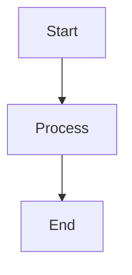
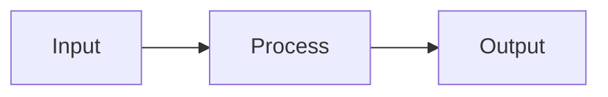
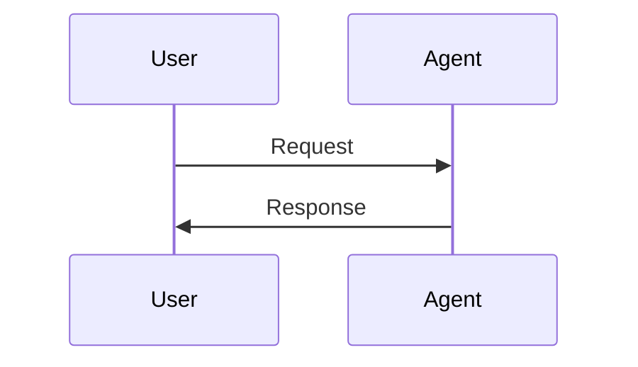

# Markdown 포맷팅 가이드

## 목적
GitHub 호환 마크다운 문서 작성 및 변환 작업 시 참고용 가이드

## 1. 코드블록 포맷팅

### ✅ 올바른 형식
```python
def example():
    return "proper formatting"
```

### ❌ 잘못된 형식 (테이블 형태)
```
| `def example():`
| `    return "wrong formatting"`
```

### 수정 패턴
- 검색 패턴: `^\| .*\``
- 테이블 형식으로 잘못 들어간 코드블록을 정상 코드블록으로 변환
- 언어 지정 필수: ```python, ```bash, ```javascript 등

## 2. 코드블록 언어 지정

### Bash 명령어
```bash
pip install langchain langgraph
```

### Python 코드
```python
from langchain import LLMChain
agent = LLMAgent(name="example")
```

### JSON 데이터
```json
{
  "key": "value"
}
```

## 3. Base64 이미지 처리

### ❌ 제거 대상
```
[image1]: data:image/png;base64,iVBORw0KGgoAAAANSUhEUgAA...
[image2]: data:image/svg+xml;base64,PHN2ZyB4bWxucz0iaHR0...
```

### 제거 패턴
- 검색: `^\[image[0-9]*\]:.*`
- Sed 명령어: `sed -i '' '/^\[image[0-9]*\]:.*/d' file.md`

### ✅ 대체 방법
- Mermaid 다이어그램을 별도 파일로 분리
- 이미지 폴더 구조: `images/chapter1/diagram-name.md`
- 참조: ``

## 4. Mermaid 다이어그램

### 기본 구조


### 플로우차트 예시


### 시퀀스 다이어그램


## 5. 들여쓰기 및 개행

### ✅ 올바른 들여쓰기
```python
def function():
    if condition:
        nested_function()
        return result
```

### ❌ 잘못된 들여쓰기 (한 줄로 연결)
```python
def function(): if condition: nested_function(); return result
```

## 6. 검증 명령어

### 테이블 형식 코드블록 검색
```bash
grep -r '^\| .*`' Chapter-*.md
```

### Base64 이미지 검색
```bash
grep -r '^\[image[0-9]*\]:' Chapter-*.md
```

### 코드블록 언어 지정 누락 확인
```bash
grep -A1 '^```$' Chapter-*.md
```

## 7. 파일 구조

### 권장 디렉토리 구조
```
project/
├── Chapter-1-Topic.md
├── Chapter-1-Topic.ko.md          # 한글 번역본
├── Chapter-2-Topic.md
├── Chapter-2-Topic.ko.md
├── images/
│   ├── chapter1/
│   │   ├── diagram1.md
│   │   └── diagram2.md
│   └── chapter2/
│       └── diagram1.md
└── README.md
```

## 8. 다국어 파일명 규칙

### 표준 네이밍 컨벤션
- **권장 방식**: `.{언어코드}.md` (ISO 639-1 코드 사용)
- 예시:
  - `README.ko.md` (한국어)
  - `README.en.md` (영어)
  - `README.ja.md` (일본어)
  - `README.zh.md` (중국어)

### 실제 적용 예시
```
Chapter-1-Prompt-Chaining.md       # 영문 원본
Chapter-1-Prompt-Chaining.ko.md   # 한글 번역본
```

### 다국어 파일 생성 규칙
1. 원본 파일명 뒤에 `.{언어코드}` 추가
2. 확장자 앞에 언어 코드 위치
3. 언어 코드는 소문자 사용
4. ISO 639-1 표준 준수

### 지원 언어 코드 (ISO 639-1)
- `ko` - 한국어 (Korean)
- `en` - 영어 (English)
- `ja` - 일본어 (Japanese)
- `zh` - 중국어 (Chinese)
- `es` - 스페인어 (Spanish)
- `fr` - 프랑스어 (French)
- `de` - 독일어 (German)

### 번역 시 주의사항
1. **기술 용어 유지**: LLM, Agent, API, JSON 등 표준 기술 용어는 번역하지 않음
2. **코드블록 보존**: 모든 코드는 수정 없이 그대로 유지
3. **링크 유지**: 이미지 링크, 참조 URL은 수정 금지
4. **마크다운 구조**: 헤딩, 리스트, 테이블 구조 동일하게 유지
5. **문체 통일**: 기술 문서 톤 유지 (간결한 업무체)

## 9. GitHub 호환성 체크리스트

- [ ] 모든 코드블록에 언어 지정 (`python`, `bash` 등)
- [ ] Base64 이미지 제거 및 별도 파일로 분리
- [ ] 테이블 형식 코드블록 → 정상 코드블록 변환
- [ ] 적절한 들여쓰기 및 개행 처리
- [ ] Mermaid 다이어그램 별도 파일 분리
- [ ] 상대 경로로 이미지 참조
- [ ] 헤딩 구조 일관성 유지
- [ ] 다국어 파일명 규칙 준수 (`.ko.md` 형식)

## 10. 일괄 수정 명령어 예시

### Base64 이미지 제거
```bash
for file in Chapter-*.md; do
    sed -i '' '/^\[image[0-9]*\]:.*/d' "$file"
done
```

### 코드블록 검증
```bash
grep -Hn '^\| .*`' Chapter-*.md | wc -l
```

### 파일 읽기 (대용량)
```bash
# offset과 limit 사용
Read tool with offset=0, limit=500
Read tool with offset=500, limit=500
```

## 11. 주의사항

1. **원본 파일 보존**: `original/` 폴더의 파일은 절대 수정 금지
2. **언어 지정**: 코드블록은 반드시 언어 지정 (``` 단독 사용 금지)
3. **개행 처리**: 긴 코드는 적절히 개행하여 가독성 확보
4. **인코딩**: UTF-8 인코딩 유지
5. **검증**: 수정 후 항상 grep 패턴으로 최종 확인
6. **다국어 파일**: 번역본 생성 시 `.{언어코드}.md` 형식 준수

## 참고 자료

- GitHub Flavored Markdown: https://github.github.com/gfm/
- Mermaid Documentation: https://mermaid.js.org/
- CommonMark Spec: https://commonmark.org/
